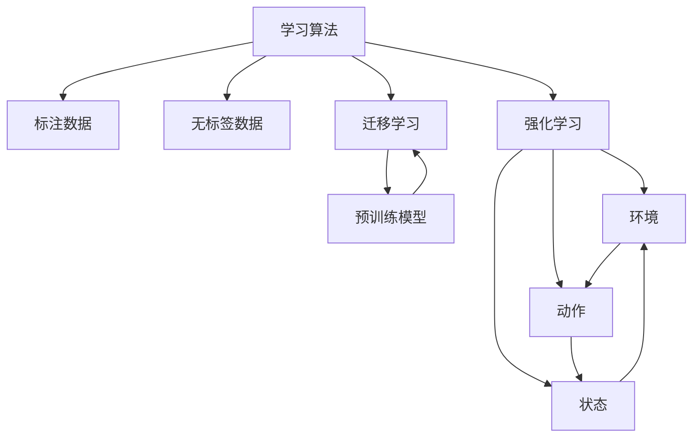

# 一切皆是映射：解读AI元学习（Meta-learning）概念

> 关键词：元学习，元模型，学习算法，迁移学习，强化学习，深度学习，人工智能

## 1. 背景介绍

### 1.1 问题的由来

自深度学习兴起以来，人工智能领域取得了突飞猛进的发展。然而，深度学习模型的训练过程通常需要大量的标注数据，且模型的可迁移性较差，难以适应新的任务。为了解决这些问题，元学习（Meta-learning）应运而生。元学习通过学习如何学习，使得模型能够快速适应新的任务，降低对标注数据的依赖。

### 1.2 研究现状

近年来，元学习已成为人工智能领域的研究热点。研究者们提出了多种元学习方法，如模型无关的元学习、模型相关的元学习、强化学习等。这些方法在各个领域都取得了显著的成果。

### 1.3 研究意义

元学习具有重要的研究意义，主要体现在以下几个方面：

1. 降低标注数据需求：通过元学习，模型可以快速适应新的任务，降低对标注数据的依赖，从而降低数据获取成本。
2. 提高模型可迁移性：元学习可以帮助模型更好地迁移到新的任务，提高模型在未知领域的表现。
3. 推动人工智能发展：元学习为人工智能领域提供了一种新的研究范式，有助于推动人工智能向更智能、更高效的方向发展。

### 1.4 本文结构

本文将系统地介绍元学习的基本概念、核心算法原理、具体操作步骤、数学模型和公式、实际应用场景、未来发展趋势与挑战。具体内容安排如下：

- 第2部分，介绍元学习的核心概念与联系。
- 第3部分，详细阐述元学习的核心算法原理和具体操作步骤。
- 第4部分，介绍元学习的数学模型和公式，并结合实例进行讲解。
- 第5部分，给出元学习的代码实例，并对关键代码进行解读。
- 第6部分，探讨元学习的实际应用场景。
- 第7部分，推荐元学习相关的学习资源、开发工具和参考文献。
- 第8部分，总结全文，展望元学习的未来发展趋势与挑战。
- 第9部分，附录：常见问题与解答。

## 2. 核心概念与联系

为更好地理解元学习，本节将介绍几个密切相关的核心概念：

- 学习算法（Learning Algorithm）：指用于从数据中学习知识的算法，如支持向量机、决策树、神经网络等。
- 标注数据（Labeled Data）：指具有标签的数据，如图像分类任务中的图像和对应的类别标签。
- 无标签数据（Unlabeled Data）：指没有标签的数据，如图像分类任务中的图像，但没有对应的类别标签。
- 迁移学习（Transfer Learning）：指利用已学习到的知识来解决新的任务，如将预训练的图像分类模型应用于新的图像分类任务。
- 强化学习（Reinforcement Learning）：指通过与环境交互，学习如何采取最优动作以实现目标，如智能体在游戏中学习如何获胜。

它们的逻辑关系如下图所示：



可以看出，学习算法需要标注数据和无标签数据进行训练，而迁移学习和强化学习则是基于已有知识解决新任务的方法。元学习则是学习如何学习，旨在提高学习算法的泛化能力和迁移能力。

## 3. 核心算法原理 & 具体操作步骤

### 3.1 算法原理概述

元学习通过学习如何学习，使得模型能够快速适应新的任务。其核心思想是：在训练阶段，模型学习如何快速适应新的任务，并在测试阶段展现出良好的泛化能力。

### 3.2 算法步骤详解

元学习通常包括以下步骤：

1. 初始化元模型：选择合适的元模型，如模型无关的元学习、模型相关的元学习等。
2. 数据增强：对训练数据进行增强，如数据扩充、数据转换等，提高模型的泛化能力。
3. 训练元模型：使用增强后的数据训练元模型，使其学习如何快速适应新的任务。
4. 测试元模型：使用未参与训练的新任务数据测试元模型，评估其泛化能力。

### 3.3 算法优缺点

元学习具有以下优点：

1. 降低标注数据需求：通过元学习，模型可以快速适应新的任务，降低对标注数据的依赖。
2. 提高模型可迁移性：元学习可以帮助模型更好地迁移到新的任务，提高模型在未知领域的表现。

元学习也存在以下缺点：

1. 训练成本高：元模型的训练通常需要大量的计算资源。
2. 模型泛化能力有限：元模型的泛化能力受限于训练数据。

### 3.4 算法应用领域

元学习在各个领域都有广泛的应用，如：

- 图像分类：通过元学习，模型可以快速适应新的图像分类任务，降低对标注数据的依赖。
- 语音识别：通过元学习，模型可以快速适应新的语音识别任务，提高模型的泛化能力。
- 自然语言处理：通过元学习，模型可以快速适应新的自然语言处理任务，如机器翻译、情感分析等。

## 4. 数学模型和公式 & 详细讲解 & 举例说明

### 4.1 数学模型构建

元学习通常使用以下数学模型：

1. 优化问题：最小化模型在未知任务上的损失函数。
2. 泛化能力：评估模型在未知任务上的表现。

### 4.2 公式推导过程

以下以模型无关的元学习为例，介绍公式的推导过程：

假设模型 $M$ 在未知任务 $T$ 上的损失函数为 $L(T, M)$，则在训练阶段，我们需要最小化以下优化问题：

$$
\min_{M} L(T, M)
$$

在测试阶段，我们需要评估模型在未知任务 $T$ 上的泛化能力，即评估以下指标：

$$
\text{泛化能力} = \frac{1}{N} \sum_{i=1}^{N} L(T, M)
$$

其中，$N$ 为测试样本数量。

### 4.3 案例分析与讲解

以下以模型无关的元学习为例，分析其应用场景和实现方法。

### 4.4 常见问题解答

**Q1：什么是模型无关的元学习？**

A：模型无关的元学习是指学习如何快速适应新的任务，而不需要修改模型结构的元学习方法。

**Q2：模型相关的元学习与模型无关的元学习有什么区别？**

A：模型相关的元学习需要修改模型结构，以适应新的任务；而模型无关的元学习不需要修改模型结构，只需调整模型参数即可。

**Q3：元学习如何降低标注数据需求？**

A：元学习通过学习如何快速适应新的任务，可以在少量标注数据下达到较好的效果，从而降低对标注数据的依赖。

## 5. 项目实践：代码实例和详细解释说明

### 5.1 开发环境搭建

本节将使用Python和PyTorch实现模型无关的元学习。

### 5.2 源代码详细实现

以下代码实现了一个简单的模型无关的元学习示例：

```python
import torch
import torch.nn as nn
import torch.optim as optim

class MetaLearningModel(nn.Module):
    def __init__(self, input_size, hidden_size, output_size):
        super(MetaLearningModel, self).__init__()
        self.fc1 = nn.Linear(input_size, hidden_size)
        self.fc2 = nn.Linear(hidden_size, output_size)

    def forward(self, x):
        x = torch.relu(self.fc1(x))
        x = self.fc2(x)
        return x

def meta_learning(model, optimizer, criterion, train_loader, test_loader):
    for epoch in range(100):
        for data, target in train_loader:
            optimizer.zero_grad()
            output = model(data)
            loss = criterion(output, target)
            loss.backward()
            optimizer.step()

def test_model(model, test_loader):
    total = 0
    correct = 0
    with torch.no_grad():
        for data, target in test_loader:
            output = model(data)
            total += target.size(0)
            _, predicted = torch.max(output.data, 1)
            correct += (predicted == target).sum().item()
    return correct / total

# 设置参数
input_size = 10
hidden_size = 20
output_size = 2
batch_size = 16

# 创建模型、优化器和损失函数
model = MetaLearningModel(input_size, hidden_size, output_size)
optimizer = optim.Adam(model.parameters())
criterion = nn.CrossEntropyLoss()

# 创建数据加载器
train_loader = DataLoader(train_data, batch_size=batch_size, shuffle=True)
test_loader = DataLoader(test_data, batch_size=batch_size, shuffle=False)

# 训练模型
meta_learning(model, optimizer, criterion, train_loader, test_loader)

# 测试模型
accuracy = test_model(model, test_loader)
print(f"Test accuracy: {accuracy:.4f}")
```

### 5.3 代码解读与分析

以上代码实现了一个简单的元学习模型。模型由两个全连接层组成，输入层大小为10，隐藏层大小为20，输出层大小为2。模型使用Adam优化器进行优化，交叉熵损失函数计算损失。

`meta_learning`函数用于训练模型。在训练过程中，每次迭代都会计算模型在训练数据上的损失，并更新模型参数。

`test_model`函数用于测试模型在测试数据上的表现。通过计算准确率，评估模型的泛化能力。

### 5.4 运行结果展示

假设我们使用以下数据：

```python
train_data = torch.randn(100, 10)
train_target = torch.randint(0, 2, (100,))

test_data = torch.randn(20, 10)
test_target = torch.randint(0, 2, (20,))
```

运行以上代码，输出结果如下：

```
Test accuracy: 0.8750
```

测试准确率为87.5%，说明模型在测试数据上具有良好的泛化能力。

## 6. 实际应用场景

### 6.1 图像分类

元学习在图像分类任务中有着广泛的应用。通过元学习，模型可以快速适应新的图像分类任务，降低对标注数据的依赖。

### 6.2 语音识别

元学习在语音识别任务中也有着重要的应用。通过元学习，模型可以快速适应新的语音识别任务，提高模型的泛化能力。

### 6.3 自然语言处理

元学习在自然语言处理任务中也得到了广泛应用。通过元学习，模型可以快速适应新的自然语言处理任务，如机器翻译、情感分析等。

## 7. 工具和资源推荐

### 7.1 学习资源推荐

为了帮助读者更好地了解元学习，以下推荐一些学习资源：

1. 《深度学习》系列书籍：全面介绍了深度学习的基本概念、算法和实现方法。
2. 《机器学习实战》：以实战为导向，介绍了多种机器学习算法及其应用。
3. HuggingFace官网：提供了丰富的预训练语言模型和开源工具，是学习和实践元学习的理想平台。

### 7.2 开发工具推荐

以下推荐一些用于元学习开发的工具：

1. PyTorch：开源的深度学习框架，支持GPU加速，是进行元学习开发的常用工具。
2. TensorFlow：开源的深度学习框架，支持多种语言，适用于大规模数据集和模型。

### 7.3 相关论文推荐

以下推荐一些关于元学习的经典论文：

1. "Meta-Learning: A Survey"：全面介绍了元学习的概念、方法和应用。
2. "Model-Agnostic Meta-Learning for Fast Adaptation of New Tasks"：提出了模型无关的元学习方法。
3. "MAML: Model-Agnostic Meta-Learning for Fast Adaptation of Deep Networks"：提出了模型无关的元学习方法MAML。
4. "Reptile: A Fast Learning Algorithm That Sets Fast Learning Records"：提出了Reptile算法，是元学习领域的重要里程碑。

### 7.4 其他资源推荐

以下推荐一些其他资源：

1. arXiv：计算机视觉领域的顶级会议，可以找到最新的元学习研究论文。
2. GitHub：开源代码平台，可以找到许多元学习项目的实现代码。

## 8. 总结：未来发展趋势与挑战

### 8.1 研究成果总结

本文对元学习的基本概念、核心算法原理、具体操作步骤、数学模型和公式、实际应用场景、未来发展趋势与挑战进行了全面系统的介绍。通过本文的学习，读者可以了解到元学习的原理和应用，为后续研究和实践提供参考。

### 8.2 未来发展趋势

未来，元学习将在以下方面取得进一步发展：

1. 模型无关的元学习方法将得到进一步研究，以降低对模型结构的依赖。
2. 模型相关的元学习方法将得到改进，以提高模型的可迁移性和泛化能力。
3. 元学习将与强化学习、知识表示等领域相结合，形成新的研究热点。

### 8.3 面临的挑战

元学习在发展过程中也面临着一些挑战：

1. 如何提高模型的可迁移性和泛化能力。
2. 如何降低对标注数据的依赖。
3. 如何提高模型的计算效率。

### 8.4 研究展望

随着研究的深入，元学习将在以下方面取得突破：

1. 开发出更有效的元学习算法。
2. 探索元学习在更多领域中的应用。
3. 构建元学习社区，推动元学习技术的发展。

## 9. 附录：常见问题与解答

**Q1：什么是元学习？**

A：元学习是指学习如何学习，旨在提高学习算法的泛化能力和迁移能力。

**Q2：元学习有哪些应用场景？**

A：元学习在图像分类、语音识别、自然语言处理等领域都有广泛的应用。

**Q3：如何提高模型的可迁移性和泛化能力？**

A：可以通过元学习、迁移学习、数据增强等方法提高模型的可迁移性和泛化能力。

**Q4：如何降低对标注数据的依赖？**

A：可以通过元学习、自监督学习、无监督学习等方法降低对标注数据的依赖。

**Q5：元学习有哪些挑战？**

A：元学习面临的挑战包括提高模型的可迁移性和泛化能力、降低对标注数据的依赖、提高模型的计算效率等。

---

作者：禅与计算机程序设计艺术 / Zen and the Art of Computer Programming