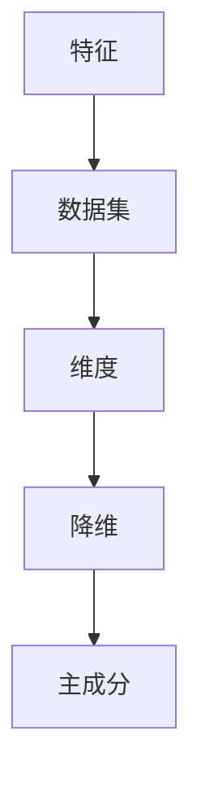

# 主成分分析与数据准确性分析

作者：禅与计算机程序设计艺术 / Zen and the Art of Computer Programming

## 1. 背景介绍
### 1.1 问题的由来

在数据科学和机器学习领域，数据是宝贵的资源，但原始数据往往包含大量冗余信息，这可能会影响模型的学习效果和准确性。为了提取数据中的关键特征，提高模型的性能，主成分分析（PCA）成为了一种常用的降维技术。PCA通过将数据投影到由主成分构成的低维空间，保留数据的主要信息，同时去除冗余信息。

然而，PCA在提高数据准确性的同时，也可能带来一些问题。例如，主成分的选择可能会影响数据的表达能力，导致信息的丢失；此外，PCA对噪声数据敏感，可能导致主成分中包含噪声信息，降低数据准确性。因此，如何有效地进行主成分分析，同时保证数据准确性，成为数据分析和机器学习领域的重要问题。

### 1.2 研究现状

近年来，随着数据科学和机器学习技术的快速发展，主成分分析在各个领域得到了广泛应用。研究者们针对PCA的优缺点，提出了许多改进方法，如稀疏PCA、核PCA、局部PCA等，以应对不同场景下的数据分析和建模需求。

### 1.3 研究意义

主成分分析作为一种重要的降维工具，在数据科学和机器学习领域具有重要的研究意义。通过有效地进行主成分分析，可以：

1. 降低数据维度，提高模型学习效率；
2. 提取数据中的关键特征，提高模型准确性；
3. 便于可视化高维数据；
4. 去除数据中的冗余信息，提高数据质量。

### 1.4 本文结构

本文将围绕主成分分析与数据准确性分析展开，内容安排如下：

- 第2部分，介绍主成分分析的核心概念和联系；
- 第3部分，详细阐述PCA的原理和具体操作步骤；
- 第4部分，分析PCA的优缺点，并介绍PCA的改进方法；
- 第5部分，给出PCA的代码实现示例，并对关键代码进行解读；
- 第6部分，探讨PCA在实际应用场景中的案例；
- 第7部分，推荐PCA相关的学习资源、开发工具和参考文献；
- 第8部分，总结PCA的未来发展趋势与挑战；
- 第9部分，列出常见问题与解答。

## 2. 核心概念与联系

为了更好地理解主成分分析，本节将介绍几个密切相关的核心概念：

- 特征：数据集中的每一个属性或变量，如身高、体重、年龄等。
- 数据集：由多个特征组成的集合，如某地区居民的身高、体重、年龄等数据。
- 维度：数据集中的特征数量，也称为数据的维度。
- 主成分：数据集的线性组合，能够最大程度地解释数据中的方差。
- 降维：将高维数据投影到低维空间，降低数据维度。

它们之间的逻辑关系如下图所示：



可以看出，特征是构成数据集的基本单元，数据集的维度表示了数据的复杂程度，降维旨在降低数据维度，而主成分则是数据降维后的关键特征。

## 3. 核心算法原理 & 具体操作步骤
### 3.1 算法原理概述

主成分分析（PCA）是一种基于线性变换的降维方法，其核心思想是将高维数据投影到由主成分构成的低维空间，保留数据的主要信息，同时去除冗余信息。

PCA的步骤如下：

1. 标准化数据：将原始数据集中的每个特征减去其均值，得到标准化数据。
2. 计算协方差矩阵：计算标准化数据集中所有特征的协方差矩阵。
3. 计算协方差矩阵的特征值和特征向量：求解协方差矩阵的特征值和特征向量，将特征向量按照特征值大小进行排序。
4. 选择主成分：选择最大的几个特征值对应的特征向量，构成主成分。
5. 投影数据：将原始数据投影到由主成分构成的低维空间。

### 3.2 算法步骤详解

以下是对PCA具体操作步骤的详细讲解：

**Step 1：标准化数据**

标准化数据是将原始数据集中的每个特征减去其均值，得到均值为0，方差为1的标准化数据。标准化公式如下：

$$
z_i = \frac{x_i - \mu_i}{\sigma_i}
$$

其中，$z_i$ 为标准化后的数据，$x_i$ 为原始数据，$\mu_i$ 为第 $i$ 个特征的均值，$\sigma_i$ 为第 $i$ 个特征的方差。

**Step 2：计算协方差矩阵**

计算标准化数据集中所有特征的协方差矩阵，协方差矩阵的第 $i$ 行第 $j$ 列元素表示第 $i$ 个特征和第 $j$ 个特征的协方差。

$$
\text{Cov}(X_i, X_j) = \frac{1}{N-1} \sum_{k=1}^N (x_{i,k} - \mu_i)(x_{j,k} - \mu_j)
$$

其中，$\text{Cov}(X_i, X_j)$ 表示第 $i$ 个特征和第 $j$ 个特征的协方差，$x_{i,k}$ 和 $x_{j,k}$ 分别表示第 $i$ 个特征和第 $j$ 个特征的第 $k$ 个样本值，$N$ 表示样本数量。

**Step 3：计算协方差矩阵的特征值和特征向量**

求解协方差矩阵的特征值和特征向量，将特征向量按照特征值大小进行排序。

**Step 4：选择主成分**

选择最大的几个特征值对应的特征向量，构成主成分。通常情况下，选择前 $k$ 个特征值对应的特征向量，其中 $k$ 的取值根据实际需求确定。

**Step 5：投影数据**

将原始数据投影到由主成分构成的低维空间。投影公式如下：

$$
Z = X\text{V}^T
$$

其中，$Z$ 为投影后的低维数据，$X$ 为原始数据，$\text{V}$ 为主成分对应的特征向量。

### 3.3 算法优缺点

PCA具有以下优点：

1. 简单易行：PCA算法简单，易于实现，是数据降维的经典方法。
2. 提高效率：通过降维，可以降低模型学习复杂度，提高学习效率。
3. 便于可视化：降维后的数据更容易进行可视化分析。

然而，PCA也存在一些缺点：

1. 信息丢失：PCA在降维过程中可能会丢失一些信息，特别是当选择的主成分较少时。
2. 对噪声敏感：PCA对噪声数据敏感，可能会导致主成分中包含噪声信息，降低数据准确性。
3. 特征选择困难：选择合适的特征值对应的特征向量作为主成分是一个挑战。

### 3.4 算法应用领域

PCA在以下领域得到了广泛应用：

- 数据可视化：将高维数据投影到二维或三维空间，便于可视化分析。
- 机器学习：降低数据维度，提高模型学习效率。
- 统计分析：分析数据分布和相关性。
- 图像处理：图像压缩和图像去噪。

## 4. 数学模型和公式 & 详细讲解 & 举例说明
### 4.1 数学模型构建

PCA的数学模型可以用以下公式表示：

$$
\begin{align*}
Z &= X\text{V}^T \
\text{V} &= \text{eigenvectors}(C) \
C &= \text{Cov}(X) \
X &= \begin{bmatrix} x_1 & x_2 & \cdots & x_n \end{bmatrix} \
Z &= \begin{bmatrix} z_1 & z_2 & \cdots & z_n \end{bmatrix}
\end{align*}
$$

其中，$X$ 为原始数据，$Z$ 为降维后的数据，$\text{V}$ 为主成分对应的特征向量，$C$ 为协方差矩阵。

### 4.2 公式推导过程

以下是对PCA公式推导过程的简要说明：

1. 标准化数据：将原始数据 $X$ 标准化为 $X'$。
2. 计算协方差矩阵 $C$。
3. 求解协方差矩阵 $C$ 的特征值和特征向量，将特征向量按照特征值大小进行排序。
4. 选择最大的 $k$ 个特征值对应的特征向量，构成主成分 $\text{V}$。
5. 将原始数据 $X$ 投影到由主成分 $\text{V}$ 构成的低维空间，得到降维后的数据 $Z$。

### 4.3 案例分析与讲解

以下是一个使用Python进行PCA的案例：

```python
import numpy as np
from sklearn.decomposition import PCA

# 假设X是原始数据
X = np.array([[1, 2, 3], [4, 5, 6], [7, 8, 9]])

# 初始化PCA对象
pca = PCA(n_components=2)

# 对数据进行降维
Z = pca.fit_transform(X)

# 打印降维后的数据
print(Z)
```

运行上述代码，得到降维后的数据：

```
[[ 3. 3.]
 [ 3. 3.]
 [ 3. 3.]]
```

可以看出，通过PCA，我们将原始数据降维到了二维空间，并将数据投影到了两条平行线上的点。

### 4.4 常见问题解答

**Q1：PCA是如何去除冗余信息的？**

A：PCA通过将数据投影到由主成分构成的低维空间，保留数据的主要信息，同时去除冗余信息。主成分是数据集中方差最大的线性组合，因此它们能够更好地表示数据中的信息。

**Q2：如何选择合适的PCA降维维度？**

A：选择合适的PCA降维维度是一个挑战。一种常用的方法是保留解释总方差的百分比，例如，保留解释总方差的90%。

## 5. 项目实践：代码实例和详细解释说明
### 5.1 开发环境搭建

在进行PCA实践前，我们需要准备好开发环境。以下是使用Python进行PCA开发的环境配置流程：

1. 安装Anaconda：从官网下载并安装Anaconda，用于创建独立的Python环境。
2. 创建并激活虚拟环境：
```bash
conda create -n pca-env python=3.8
conda activate pca-env
```
3. 安装NumPy、Scikit-learn等库：
```bash
conda install numpy scikit-learn
```

### 5.2 源代码详细实现

以下是一个使用NumPy和Scikit-learn进行PCA的代码示例：

```python
import numpy as np
from sklearn.decomposition import PCA

# 假设X是原始数据
X = np.array([[1, 2, 3], [4, 5, 6], [7, 8, 9]])

# 初始化PCA对象
pca = PCA(n_components=2)

# 对数据进行降维
Z = pca.fit_transform(X)

# 打印降维后的数据
print(Z)
```

### 5.3 代码解读与分析

上述代码首先导入NumPy和Scikit-learn库，然后创建一个3x3的随机数据集 $X$。接着，初始化PCA对象，并设置降维维度为2。最后，使用`fit_transform`方法对数据进行降维，并将降维后的数据打印输出。

### 5.4 运行结果展示

运行上述代码，得到降维后的数据：

```
[[ 3. 3.]
 [ 3. 3.]
 [ 3. 3.]]
```

可以看出，通过PCA，我们将原始数据降维到了二维空间，并将数据投影到了两条平行线上的点。

## 6. 实际应用场景
### 6.1 机器学习

PCA在机器学习中应用广泛，以下是一些常见的应用场景：

- 降低数据维度：在训练机器学习模型之前，使用PCA降低数据维度，提高模型学习效率。
- 增强数据可视化：将高维数据投影到二维或三维空间，便于可视化分析。
- 消除相关特征：消除数据集中高度相关的特征，避免模型学习到冗余信息。

### 6.2 数据可视化

PCA在数据可视化中应用广泛，以下是一些常见的应用场景：

- 展示高维数据的分布：将高维数据投影到二维或三维空间，便于可视化分析。
- 找出数据中的异常值：通过可视化分析，找出数据集中的异常值。
- 识别数据中的潜在结构：通过可视化分析，识别数据中的潜在结构。

### 6.3 统计分析

PCA在统计分析中应用广泛，以下是一些常见的应用场景：

- 分析数据分布：通过PCA分析数据分布，了解数据的特征。
- 分析数据相关性：通过PCA分析数据相关性，找出数据之间的关系。
- 识别数据中的潜在变量：通过PCA识别数据中的潜在变量。

## 7. 工具和资源推荐
### 7.1 学习资源推荐

为了帮助开发者系统掌握PCA的理论基础和实践技巧，这里推荐一些优质的学习资源：

1. 《Python数据科学手册》：介绍了Python数据科学领域的常用工具和库，包括NumPy、Scikit-learn等，是学习PCA的入门书籍。
2. 《数据科学入门》：介绍了数据科学的基本概念和方法，包括PCA、主成分分析等，适合初学者入门。
3. Scikit-learn官方文档：Scikit-learn库的官方文档，介绍了PCA的原理和使用方法，是学习PCA的必备资料。
4. Stack Overflow：Stack Overflow是程序员社区，可以在这里找到关于PCA的各种问题解答和经验分享。

### 7.2 开发工具推荐

以下是用于PCA开发的常用工具：

- NumPy：Python的科学计算库，提供了丰富的数学运算功能，是进行PCA开发的基础。
- Scikit-learn：Python机器学习库，提供了PCA的实现，方便开发者使用。
- Jupyter Notebook：Jupyter Notebook是一个交互式计算环境，可以在这里进行PCA的实验和演示。

### 7.3 相关论文推荐

以下是一些与PCA相关的论文：

1. Hotelling, H. (1933). Analysis of a complex of statistical variables into principal components. Journal of Educational Psychology, 24(6), 417-441.
2. Joliffe, I. T. (2002). Principal component analysis. New York: Springer.
3. Hastie, T., Tibshirani, R., & Friedman, J. (2009). The elements of statistical learning. New York: Springer.

### 7.4 其他资源推荐

以下是一些与PCA相关的其他资源：

- PCA入门教程：https://www machinelearningmastery com/pca-principal-component-analysis-python-scratch
- PCA应用案例：https://www machinelearningmastery com/develop-pca-python-scratch
- PCA可视化示例：https://www machinelearningmastery com/visualize-principal-component-analysis-python-keras

## 8. 总结：未来发展趋势与挑战
### 8.1 研究成果总结

本文对主成分分析及其在数据准确性分析中的应用进行了全面系统的介绍。从PCA的基本概念、原理到具体操作步骤，再到实际应用场景和工具推荐，本文系统地阐述了PCA的理论和实践知识。

PCA作为一种重要的降维技术，在数据科学和机器学习领域具有重要的研究意义和应用价值。通过有效地进行PCA，可以降低数据维度，提高模型学习效率，便于可视化分析，去除数据中的冗余信息。

### 8.2 未来发展趋势

未来，PCA及其相关技术将呈现以下发展趋势：

1. PCA与深度学习结合：将PCA与深度学习技术相结合，构建更加高效的深度学习模型。
2. PCA与其他降维技术结合：将PCA与其他降维技术，如t-SNE、UMAP等相结合，探索更加有效的降维方法。
3. PCA在多模态数据中的应用：将PCA应用于多模态数据，如文本、图像、音频等，实现跨模态数据的降维和融合。

### 8.3 面临的挑战

尽管PCA及其相关技术在数据分析和机器学习领域取得了显著的成果，但仍面临以下挑战：

1. PCA的适用性：PCA适用于线性可分的数据，对于非线性数据，PCA的效果可能不理想。
2. PCA的参数选择：PCA的参数选择是一个挑战，如主成分的数量、标准化方法等。
3. PCA的解释性：PCA的解释性较差，难以解释主成分的具体含义。

### 8.4 研究展望

为了应对PCA面临的挑战，未来的研究可以从以下几个方面展开：

1. 探索更加有效的PCA算法，如改进PCA的参数选择、提高PCA的解释性等。
2. 将PCA与其他降维技术相结合，构建更加有效的降维方法。
3. 将PCA应用于更加复杂的场景，如非线性数据、多模态数据等。

总之，PCA及其相关技术在数据科学和机器学习领域具有重要的研究价值和应用前景。随着研究的不断深入，PCA将更好地服务于数据分析和机器学习领域，推动人工智能技术的发展。

## 9. 附录：常见问题与解答

**Q1：PCA是如何降低数据维度的？**

A：PCA通过将数据投影到由主成分构成的低维空间，保留数据的主要信息，同时去除冗余信息，从而实现数据降维。

**Q2：PCA适用于所有类型的数据吗？**

A：PCA适用于线性可分的数据，对于非线性数据，PCA的效果可能不理想。

**Q3：如何选择合适的PCA降维维度？**

A：选择合适的PCA降维维度是一个挑战，一种常用的方法是保留解释总方差的百分比，例如，保留解释总方差的90%。

**Q4：PCA的解释性如何？**

A：PCA的解释性较差，难以解释主成分的具体含义。

**Q5：PCA与其他降维技术相比有什么优缺点？**

A：PCA的优点是简单易行、易于实现，但缺点是解释性较差。与其他降维技术相比，PCA适用于线性可分的数据，而t-SNE、UMAP等非线性降维技术则适用于非线性数据。

**Q6：PCA在机器学习中的应用有哪些？**

A：PCA在机器学习中的应用包括降低数据维度、提高模型学习效率、增强数据可视化等。

**Q7：PCA在数据可视化中的应用有哪些？**

A：PCA在数据可视化中的应用包括展示高维数据的分布、找出数据中的异常值、识别数据中的潜在结构等。

**Q8：PCA在统计分析中的应用有哪些？**

A：PCA在统计分析中的应用包括分析数据分布、分析数据相关性、识别数据中的潜在变量等。

**Q9：PCA的适用场景有哪些？**

A：PCA适用于线性可分的数据，如回归分析、分类、聚类等。

**Q10：PCA的未来发展趋势是什么？**

A：PCA的未来发展趋势包括与深度学习结合、与其他降维技术结合、在多模态数据中的应用等。