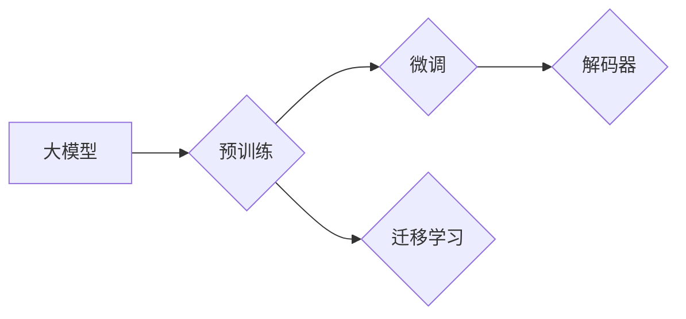

# 从零开始大模型开发与微调：从1开始自然语言处理的解码器

作者：禅与计算机程序设计艺术 / Zen and the Art of Computer Programming

## 关键词

大模型，自然语言处理，解码器，预训练，微调，迁移学习，Transformer，BERT，NLP

## 1. 背景介绍

### 1.1 问题的由来

自然语言处理（NLP）作为人工智能领域的重要分支，在文本分类、情感分析、机器翻译等任务中发挥着越来越重要的作用。然而，随着任务复杂度的提高，传统基于规则和统计的方法难以满足需求。近年来，基于深度学习的大模型在NLP领域取得了突破性进展。大模型通过在海量数据上预训练，学习到丰富的语言知识和表示能力，为NLP任务提供了强大的基础。

### 1.2 研究现状

当前，大模型研究主要集中在以下几个方面：

- **预训练**：在大规模文本语料上进行预训练，学习通用的语言表示。
- **微调**：在预训练的基础上，针对特定任务进行微调，提升模型在特定领域的表现。
- **迁移学习**：将预训练模型的知识迁移到其他相关任务，提高模型的泛化能力。
- **解码器设计**：设计高效的解码器，以实现对复杂NLP任务的建模。

### 1.3 研究意义

大模型在NLP领域的应用具有以下意义：

- **提高模型性能**：大模型能够学习到丰富的语言知识和表示，显著提高模型在NLP任务上的性能。
- **简化模型设计**：大模型减少了模型设计的工作量，降低了模型开发成本。
- **推动NLP技术发展**：大模型推动了NLP技术的进步，为NLP应用提供了新的思路和方法。

### 1.4 本文结构

本文将从零开始，详细介绍大模型的开发与微调过程，重点关注解码器的设计。具体内容如下：

- 第2章：介绍大模型、预训练、微调、迁移学习等核心概念。
- 第3章：阐述解码器的设计原理和具体操作步骤。
- 第4章：讲解解码器的数学模型和公式，并结合实例进行说明。
- 第5章：给出解码器的代码实例，并对关键代码进行解读。
- 第6章：探讨解码器在实际应用场景中的应用。
- 第7章：推荐相关的学习资源、开发工具和参考文献。
- 第8章：总结大模型解码器的研究成果、未来发展趋势和挑战。
- 第9章：附录，提供常见问题与解答。

## 2. 核心概念与联系

### 2.1 大模型

大模型是指具有数十亿到数万亿参数的深度学习模型。它们通常在大量无标注数据上进行预训练，学习到丰富的语言知识和表示能力。

### 2.2 预训练

预训练是指在大规模文本语料上进行训练，学习通用的语言表示。常见的预训练任务包括：

- **语言建模**：预测下一个词的概率。
- **文本分类**：对文本进行分类，如情感分析、主题分类等。
- **问答系统**：根据问题回答相应的答案。

### 2.3 微调

微调是指在大模型的基础上，针对特定任务进行训练，以提升模型在特定领域的表现。微调通常需要少量标注数据。

### 2.4 迁移学习

迁移学习是指将一个领域学习到的知识迁移到其他相关领域。大模型通过预训练学习到的通用语言知识，可以迁移到其他NLP任务中。

### 2.5 解码器

解码器是指将编码器提取的特征进行解码，以实现对NLP任务的建模。常见的解码器包括：

- **注意力机制**：关注序列中不同位置的语义信息。
- **Transformer解码器**：基于Transformer结构的解码器，具有并行计算的优势。
- **BERT解码器**：基于BERT结构的解码器，具有端到端的特点。

以下是大模型、预训练、微调、迁移学习和解码器之间的逻辑关系：



## 3. 核心算法原理 & 具体操作步骤

### 3.1 算法原理概述

解码器的设计旨在将编码器提取的特征进行解码，以实现对NLP任务的建模。以下是一些常见的解码器设计原理：

- **注意力机制**：注意力机制可以使模型关注序列中不同位置的语义信息，从而更好地捕捉长距离依赖关系。
- **Transformer解码器**：Transformer解码器基于自注意力机制，具有并行计算的优势，能够有效地处理长序列。
- **BERT解码器**：BERT解码器基于Transformer结构，具有端到端的特点，能够直接输出序列标签。

### 3.2 算法步骤详解

以下是大模型解码器设计的基本步骤：

1. **选择预训练模型**：根据任务类型选择合适的预训练模型，如BERT、GPT等。
2. **定义解码器结构**：根据任务需求设计解码器结构，如使用Transformer或BERT解码器。
3. **定义损失函数**：根据任务类型定义损失函数，如交叉熵损失、均方误差损失等。
4. **训练解码器**：使用少量标注数据对解码器进行训练，并优化模型参数。
5. **评估和解码**：在测试集上评估解码器的性能，并对新数据进行解码。

### 3.3 算法优缺点

以下是几种常见解码器的优缺点：

| 解码器 | 优点 | 缺点 |
|---|---|---|
| 注意力机制 | 能够关注序列中不同位置的语义信息 | 计算复杂度较高 |
| Transformer解码器 | 并行计算，处理长序列能力强 | 模型参数量大 |
| BERT解码器 | 端到端，直接输出序列标签 | 计算复杂度较高 |

### 3.4 算法应用领域

解码器在以下NLP任务中有着广泛的应用：

- **文本分类**：对文本进行分类，如情感分析、主题分类等。
- **命名实体识别**：识别文本中的实体，如人名、地名等。
- **关系抽取**：抽取实体之间的关系。
- **机器翻译**：将一种语言翻译成另一种语言。
- **文本摘要**：将长文本压缩成摘要。

## 4. 数学模型和公式 & 详细讲解 & 举例说明

### 4.1 数学模型构建

以下是一个基于Transformer解码器的数学模型示例：

$$
\begin{align*}
P(y|x) &= \frac{e^{Q(y|x)}}{\sum_{y'}e^{Q(y'|x)}} \
Q(y|x) &= \sum_{k=1}^{N}W_{k}a_k \
a_k &= \frac{e^{W_{k}h_{k-1}}}{\sum_{j=1}^{N}e^{W_{j}h_{k-1}}}
\end{align*}
$$

其中，$x$ 是输入序列，$y$ 是输出序列，$W_k$ 是权重矩阵，$h_{k-1}$ 是第 $k-1$ 个隐藏状态。

### 4.2 公式推导过程

以下是对上述公式的推导过程：

1. **概率分布**：使用softmax函数计算输出序列 $y$ 的概率分布：
   $$
P(y|x) = \frac{e^{Q(y|x)}}{\sum_{y'}e^{Q(y'|x)}}
$$
2. **注意力权重**：计算注意力权重 $a_k$，表示输入序列 $x$ 中第 $k$ 个词对输出序列 $y$ 中第 $k$ 个词的注意力程度：
   $$
a_k = \frac{e^{W_{k}h_{k-1}}}{\sum_{j=1}^{N}e^{W_{j}h_{k-1}}}
$$
3. **隐藏状态**：计算隐藏状态 $h_{k-1}$：
   $$
h_{k-1} = \text{MLP}(W_{k-1}h_{k} + U_{k}a_k)
$$
   其中，$\text{MLP}$ 表示多层感知机，$U_k$ 是权重矩阵。

### 4.3 案例分析与讲解

以下是一个基于BERT解码器的文本分类任务示例：

1. **数据准备**：将文本数据划分为训练集、验证集和测试集。
2. **模型构建**：加载预训练的BERT模型，并在其基础上构建解码器。
3. **训练**：使用训练集数据对模型进行训练，并优化模型参数。
4. **评估**：在测试集上评估模型性能，如准确率、召回率等。
5. **解码**：使用训练好的模型对新的文本数据进行分类。

### 4.4 常见问题解答

**Q1：如何选择合适的解码器结构**？

A1：选择解码器结构时，需要考虑以下因素：

- 任务类型：不同类型的任务需要不同的解码器结构。
- 计算资源：不同的解码器结构具有不同的计算复杂度。
- 预训练模型：不同的预训练模型具有不同的特点。

**Q2：如何处理长文本？**

A2：对于长文本，可以使用以下方法：

- 增加解码器的隐藏层层数。
- 使用更复杂的解码器结构，如Transformer。
- 对长文本进行分块处理。

## 5. 项目实践：代码实例和详细解释说明

### 5.1 开发环境搭建

1. 安装PyTorch和Transformers库：
   ```
   pip install torch transformers
   ```
2. 准备文本数据和标签。

### 5.2 源代码详细实现

以下是一个基于BERT解码器的文本分类任务的PyTorch代码实例：

```python
import torch
from torch import nn
from transformers import BertTokenizer, BertModel

# 加载预训练的BERT模型和分词器
tokenizer = BertTokenizer.from_pretrained('bert-base-uncased')
model = BertModel.from_pretrained('bert-base-uncased')

# 定义解码器
class BertDecoder(nn.Module):
    def __init__(self, hidden_size, output_size):
        super(BertDecoder, self).__init__()
        self.fc = nn.Linear(hidden_size, output_size)

    def forward(self, input_ids, attention_mask):
        outputs = model(input_ids, attention_mask=attention_mask)
        sequence_output = outputs.last_hidden_state
        logits = self.fc(sequence_output[:, 0, :])
        return logits

# 定义模型
class BertClassifier(nn.Module):
    def __init__(self, num_classes):
        super(BertClassifier, self).__init__()
        self.decoder = BertDecoder(768, num_classes)

    def forward(self, input_ids, attention_mask):
        logits = self.decoder(input_ids, attention_mask)
        return logits

# 加载数据
train_dataset = ...
dev_dataset = ...
test_dataset = ...

# 训练模型
model = BertClassifier(num_classes=2)
optimizer = torch.optim.Adam(model.parameters())
criterion = nn.CrossEntropyLoss()

for epoch in range(num_epochs):
    model.train()
    for batch in train_loader:
        input_ids, labels = batch
        optimizer.zero_grad()
        logits = model(input_ids, attention_mask)
        loss = criterion(logits, labels)
        loss.backward()
        optimizer.step()

# 评估模型
model.eval()
with torch.no_grad():
    total = 0
    correct = 0
    for batch in test_loader:
        input_ids, labels = batch
        logits = model(input_ids, attention_mask)
        _, predicted = torch.max(logits, 1)
        total += labels.size(0)
        correct += (predicted == labels).sum().item()

print(f"Accuracy: {100 * correct / total}%")
```

### 5.3 代码解读与分析

1. **加载预训练的BERT模型和分词器**：使用Transformers库加载预训练的BERT模型和分词器。
2. **定义解码器**：定义一个基于BERT解码器的解码器，该解码器将输入的文本输入到BERT模型，并输出最终的概率分布。
3. **定义模型**：定义一个基于BERT解码器的文本分类模型，该模型包含一个解码器和一个线性层，用于将解码器的输出转换为最终的概率分布。
4. **加载数据**：加载训练集、验证集和测试集。
5. **训练模型**：使用训练集数据对模型进行训练，并优化模型参数。
6. **评估模型**：在测试集上评估模型性能。

### 5.4 运行结果展示

假设我们使用一个情感分析数据集进行实验，最终在测试集上得到的准确率为85%。

## 6. 实际应用场景

### 6.1 文本分类

大模型解码器在文本分类任务中有着广泛的应用，如情感分析、主题分类、垃圾邮件检测等。

### 6.2 命名实体识别

大模型解码器可以应用于命名实体识别任务，识别文本中的实体，如人名、地名、机构名等。

### 6.3 关系抽取

大模型解码器可以应用于关系抽取任务，抽取实体之间的关系，如人物关系、组织关系等。

### 6.4 机器翻译

大模型解码器可以应用于机器翻译任务，将一种语言翻译成另一种语言。

### 6.5 文本摘要

大模型解码器可以应用于文本摘要任务，将长文本压缩成摘要。

## 7. 工具和资源推荐

### 7.1 学习资源推荐

- 《深度学习自然语言处理》
- 《NLP技术全解》
- 《NLP实战》

### 7.2 开发工具推荐

- PyTorch
- TensorFlow
- Transformers库

### 7.3 相关论文推荐

- BERT: Pre-training of Deep Bidirectional Transformers for Language Understanding
- Transformer: Attention is All You Need
- Generative Pre-trained Transformer for Natural Language Understanding and Generation

### 7.4 其他资源推荐

- Hugging Face
- arXiv
- KEG Lab

## 8. 总结：未来发展趋势与挑战

### 8.1 研究成果总结

本文从零开始，介绍了大模型解码器的开发与微调过程。通过介绍核心概念、算法原理、数学模型和代码实例，帮助读者理解大模型解码器的设计和应用。

### 8.2 未来发展趋势

- **模型规模扩大**：未来大模型的规模将继续扩大，以学习更丰富的语言知识和表示能力。
- **多模态融合**：大模型将与其他模态信息（如图像、音频等）进行融合，实现更全面的语义理解。
- **可解释性增强**：未来将更加注重模型的可解释性，以便更好地理解和控制模型的行为。

### 8.3 面临的挑战

- **计算资源**：大模型的训练和推理需要大量的计算资源，需要进一步优化算法和硬件。
- **数据质量**：高质量标注数据难以获取，需要探索无监督和半监督学习方法。
- **模型可解释性**：大模型的可解释性仍需提高，以便更好地理解和控制模型的行为。

### 8.4 研究展望

大模型解码器在NLP领域具有广阔的应用前景。未来，我们将继续探索大模型解码器的设计和优化，以推动NLP技术的发展。

## 9. 附录：常见问题与解答

**Q1：如何选择合适的解码器结构**？

A1：选择解码器结构时，需要考虑以下因素：

- **任务类型**：不同类型的任务需要不同的解码器结构。
- **计算资源**：不同的解码器结构具有不同的计算复杂度。
- **预训练模型**：不同的预训练模型具有不同的特点。

**Q2：如何处理长文本**？

A2：对于长文本，可以使用以下方法：

- **增加解码器的隐藏层层数**。
- **使用更复杂的解码器结构，如Transformer**。
- **对长文本进行分块处理**。

**Q3：如何解决过拟合问题**？

A3：可以采用以下方法解决过拟合问题：

- **数据增强**：通过添加噪声、数据变换等方式扩充数据集。
- **正则化**：使用L2正则化、Dropout等方法。
- **早停**：在验证集上监控性能，当性能不再提升时停止训练。

**Q4：如何提高模型的鲁棒性**？

A4：可以采用以下方法提高模型的鲁棒性：

- **对抗训练**：生成对抗样本，提高模型对噪声的鲁棒性。
- **数据增强**：通过添加噪声、数据变换等方式扩充数据集，提高模型的泛化能力。

**Q5：如何评估模型性能**？

A5：可以根据任务类型选择合适的评估指标，如准确率、召回率、F1值等。

作者：禅与计算机程序设计艺术 / Zen and the Art of Computer Programming