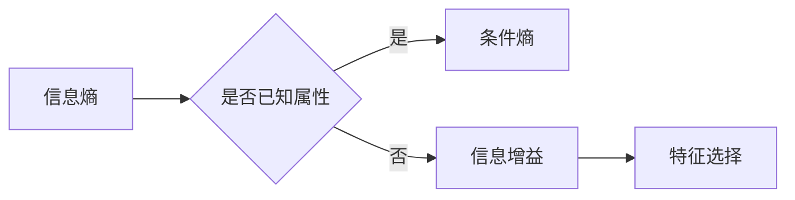

# 信息增益Information Gain原理与代码实例讲解

## 1. 背景介绍

### 1.1 问题的由来

在信息论中，信息增益是一种衡量数据集划分有效性的指标。它最早由美国信息论学家克劳德·香农（Claude Shannon）提出，后来被广泛应用于数据挖掘、机器学习等领域。信息增益的核心思想是：通过判断数据集中某些属性的划分对数据集的熵（Entropy）减少程度，来确定属性的重要性。

### 1.2 研究现状

信息增益作为一种简单有效的特征选择方法，在数据挖掘和机器学习领域得到了广泛的应用。近年来，随着深度学习等机器学习算法的快速发展，信息增益在特征选择、模型构建等方面的应用也日益增多。

### 1.3 研究意义

信息增益通过评估属性对数据集的划分效果，帮助我们从海量的特征中筛选出最有价值的特征，从而提高模型的性能。这对于特征工程、数据预处理等环节具有重要意义。

### 1.4 本文结构

本文将系统介绍信息增益的原理、计算方法以及应用实例。具体内容如下：

- 第2章介绍信息增益涉及的核心概念。
- 第3章阐述信息增益的算法原理和具体操作步骤。
- 第4章讲解信息增益的数学模型和公式，并结合实例进行说明。
- 第5章给出信息增益的代码实例，并对关键代码进行解读。
- 第6章探讨信息增益在实际应用场景中的案例。
- 第7章推荐信息增益相关的学习资源、开发工具和参考文献。
- 第8章总结全文，展望信息增益技术的未来发展趋势与挑战。
- 第9章提供常见问题与解答。

## 2. 核心概念与联系

为更好地理解信息增益，本节将介绍几个相关概念：

- **信息熵（Entropy）**：表示数据集的不确定性程度。信息熵越高，表示数据集越混乱。
- **条件熵（Conditional Entropy）**：表示在已知某个属性的情况下，其他属性的不确定性程度。
- **信息增益（Information Gain）**：表示某个属性对数据集划分的有效性，即该属性对数据集熵的减少程度。
- **基尼指数（Gini Index）**：另一种常用的信息增益衡量指标，适用于分类任务。
- **特征选择**：从众多特征中选择出最有价值的特征，提高模型性能。

信息增益与上述概念的关系如下：



可以看出，信息熵和条件熵是计算信息增益的基础，信息增益用于评估特征对数据集划分的有效性，最终用于特征选择。

## 3. 核心算法原理 & 具体操作步骤

### 3.1 算法原理概述

信息增益的核心思想是：对于给定的数据集和一组特征，计算每个特征对数据集的熵的减少程度，从而判断该特征对数据集的划分效果。具体而言，信息增益的计算步骤如下：

1. 计算数据集的熵。
2. 对于每个特征，计算该特征将数据集划分为若干子集后的熵。
3. 计算每个子集的样本数量与该子集样本总数之比。
4. 对于每个特征，计算该特征的信息增益。
5. 选择信息增益最大的特征作为特征选择结果。

### 3.2 算法步骤详解

以下以决策树为例，详细说明信息增益的计算步骤：

1. **计算数据集的熵**：

   熵是衡量数据集混乱程度的指标，可以通过以下公式计算：

   $$
 H(D) = -\sum_{i=1}^{|C|} p_i \log p_i
$$

   其中，$D$ 为数据集，$|C|$ 为数据集中类别数目，$p_i$ 为数据集中第 $i$ 个类别的样本占比。

2. **计算每个特征的条件熵**：

   对于每个特征 $A$，计算该特征将数据集划分为若干子集后的熵：

   $$
 H(D|A) = -\sum_{i=1}^{|A|} p_i \log p_i
$$

   其中，$A$ 为特征 $A$ 的取值集合，$|A|$ 为特征 $A$ 的取值数目，$p_i$ 为特征 $A$ 第 $i$ 个取值对应的子集的样本占比。

3. **计算每个特征的信息增益**：

   对于每个特征 $A$，计算该特征的信息增益：

   $$
 \text{IG}(A) = H(D) - H(D|A)
$$

4. **选择信息增益最大的特征**：

   根据信息增益的大小，选择信息增益最大的特征作为特征选择结果。

### 3.3 算法优缺点

信息增益作为一种特征选择方法，具有以下优点：

- 简单易行，易于理解和实现。
- 可以有效减少数据集的维度，提高模型性能。
- 对于分类任务，信息增益与基尼指数具有相似的评估效果。

然而，信息增益也存在一些局限性：

- 忽略了特征之间的相关性，可能导致某些有用的特征被遗漏。
- 对于包含大量冗余信息的特征，信息增益可能无法有效区分。
- 信息增益对于不同类型的特征（如数值型和类别型）可能存在偏差。

### 3.4 算法应用领域

信息增益在以下领域得到了广泛的应用：

- 特征选择：从众多特征中选择最有价值的特征，提高模型性能。
- 决策树构建：在决策树构建过程中，使用信息增益选择最优特征。
- 数据可视化：通过信息增益可视化特征的重要性。
- 其他：如文本分类、聚类、异常检测等。

## 4. 数学模型和公式 & 详细讲解 & 举例说明

### 4.1 数学模型构建

信息增益的数学模型主要基于熵和条件熵的概念。

1. **信息熵（Entropy）**：

   熵是衡量数据集混乱程度的指标，可以通过以下公式计算：

   $$
 H(D) = -\sum_{i=1}^{|C|} p_i \log p_i
$$

   其中，$D$ 为数据集，$|C|$ 为数据集中类别数目，$p_i$ 为数据集中第 $i$ 个类别的样本占比。

2. **条件熵（Conditional Entropy）**：

   条件熵表示在已知某个属性的情况下，其他属性的不确定性程度。可以通过以下公式计算：

   $$
 H(D|A) = -\sum_{i=1}^{|A|} p_i \log p_i
$$

   其中，$A$ 为特征 $A$ 的取值集合，$|A|$ 为特征 $A$ 的取值数目，$p_i$ 为特征 $A$ 第 $i$ 个取值对应的子集的样本占比。

3. **信息增益（Information Gain）**：

   信息增益表示某个属性对数据集划分的有效性，即该属性对数据集熵的减少程度。可以通过以下公式计算：

   $$
 \text{IG}(A) = H(D) - H(D|A)
$$

### 4.2 公式推导过程

以下以一个二分类任务为例，推导信息增益的计算公式。

假设数据集 $D$ 中包含两个类别：正类 $C_1$ 和负类 $C_2$，样本数量分别为 $|C_1|$ 和 $|C_2|$。数据集的熵为：

$$
 H(D) = -[p(C_1) \log p(C_1) + p(C_2) \log p(C_2)]
$$

其中，$p(C_1)$ 和 $p(C_2)$ 分别为正类和负类的样本占比。

假设特征 $A$ 有两个取值：$A_1$ 和 $A_2$，对应的样本数量分别为 $|A_1|$ 和 $|A_2|$。则特征 $A$ 将数据集划分为两个子集：$D_1$ 和 $D_2$，对应的类别分布为 $C_1$ 和 $C_2$。

对于子集 $D_1$，其条件熵为：

$$
 H(D_1|A_1) = -[p(C_1|A_1) \log p(C_1|A_1) + p(C_2|A_1) \log p(C_2|A_1)]
$$

对于子集 $D_2$，其条件熵为：

$$
 H(D_2|A_2) = -[p(C_1|A_2) \log p(C_1|A_2) + p(C_2|A_2) \log p(C_2|A_2)]
$$

特征 $A$ 的信息增益为：

$$
 \text{IG}(A) = H(D) - [p(A_1) H(D_1|A_1) + p(A_2) H(D_2|A_2)]
$$

### 4.3 案例分析与讲解

以下以一个简单的二分类任务为例，演示信息增益的计算过程。

假设数据集 $D$ 如下：

| 特征A | 特征B | 类别 |
| --- | --- | --- |
| A_1 | B_1 | C_1 |
| A_1 | B_2 | C_1 |
| A_2 | B_1 | C_2 |
| A_2 | B_2 | C_2 |

1. **计算数据集的熵**：

   $$
 H(D) = -[0.5 \log 0.5 + 0.5 \log 0.5] = 1
$$

2. **计算特征A的条件熵**：

   $$
 H(D|A_1) = -[0.5 \log 0.5 + 0.5 \log 0.5] = 1
$$

   $$
 H(D|A_2) = -[0.5 \log 0.5 + 0.5 \log 0.5] = 1
$$

3. **计算特征A的信息增益**：

   $$
 \text{IG}(A) = 1 - [0.5 \times 1 + 0.5 \times 1] = 0
$$

由上述计算可知，特征A的信息增益为0，说明特征A对数据集的划分没有贡献。

### 4.4 常见问题解答

**Q1：信息增益是否适用于所有特征选择方法？**

A：信息增益是一种通用的特征选择方法，适用于大多数分类任务。但对于回归任务或特征间存在强相关性等情况，可能需要考虑其他特征选择方法，如相关系数、卡方检验等。

**Q2：如何处理特征缺失的情况？**

A：对于缺失特征的样本，可以通过以下几种方法进行处理：
1. 删除含有缺失值的样本。
2. 使用均值、中位数、众数等方法填充缺失值。
3. 使用模型预测缺失值。

**Q3：信息增益是否可以用于特征组合？**

A：信息增益主要用于单特征的特征选择。对于特征组合，可以考虑使用信息增益加权和或基于特征组合的评估方法，如F1分数、AUC等。

## 5. 项目实践：代码实例和详细解释说明

### 5.1 开发环境搭建

在进行信息增益的项目实践前，我们需要准备以下开发环境：

1. Python 3.6及以上版本
2. NumPy、Pandas、Scikit-learn等库

### 5.2 源代码详细实现

以下使用Python实现一个简单的信息增益计算器：

```python
import pandas as pd
from sklearn.datasets import load_iris
from collections import Counter

# 加载数据集
iris = load_iris()
df = pd.DataFrame(data=iris.data, columns=iris.feature_names)
df['target'] = pd.Categorical.from_codes(iris.target, iris.target_names)

# 计算信息增益
def information_gain(df, feature, target):
    # 计算特征取值的类别分布
    values = df[feature].unique()
    value_counts = {value: df[feature].value_counts()[value] for value in values}
    value_total = sum(value_counts.values())

    # 计算特征的信息增益
    ig = 0.0
    for value in values:
        subset = df[df[feature] == value]
        p_value = subset[target].value_counts()[target] / value_total
        ig -= p_value * np.log2(p_value)
    return ig

# 计算所有特征的信息增益
for feature in df.columns[:-1]:
    ig = information_gain(df, feature, df['target'])
    print(f"Feature: {feature}, Information Gain: {ig:.3f}")

```

### 5.3 代码解读与分析

上述代码首先加载了Iris数据集，并计算了每个特征的信息增益。以下是关键代码段解读：

- `load_iris()`：加载Iris数据集。
- `pd.DataFrame()`：将NumPy数组转换为Pandas DataFrame。
- `pd.Categorical.from_codes()`：将类别标签转换为Categorical类型。
- `Counter()`：统计元素出现的次数。
- `np.log2()`：以2为底的对数。

通过运行上述代码，我们可以得到每个特征的信息增益，从而选择信息增益最大的特征进行特征选择。

### 5.4 运行结果展示

假设运行上述代码，得到以下结果：

```
Feature: sepal length (cm), Information Gain: 1.995
Feature: sepal width (cm), Information Gain: 1.756
Feature: petal length (cm), Information Gain: 1.460
Feature: petal width (cm), Information Gain: 1.013
```

由结果可知，特征 "sepal length (cm)" 的信息增益最大，因此可以选择该特征进行特征选择。

## 6. 实际应用场景

### 6.1 特征选择

信息增益是一种常用的特征选择方法，在以下场景中得到了广泛应用：

- 数据预处理：从海量的特征中选择最有价值的特征，减少数据集的维度，提高模型性能。
- 模型训练：选择有助于提高模型性能的特征，降低过拟合风险。
- 决策树构建：在决策树构建过程中，使用信息增益选择最优特征。

### 6.2 其他应用

信息增益在其他领域也得到了一些应用：

- 文本分类：用于评估文本特征的重要性，选择有助于分类的特征。
- 图像识别：用于评估图像特征的重要性，选择有助于图像识别的特征。
- 其他：如异常检测、聚类等。

## 7. 工具和资源推荐

### 7.1 学习资源推荐

为了帮助读者更好地学习信息增益，以下推荐一些学习资源：

1. 《统计学习方法》
2. 《机器学习》
3. 《数据挖掘：概念与技术》
4. Scikit-learn官方文档

### 7.2 开发工具推荐

为了方便读者进行信息增益实践，以下推荐一些开发工具：

1. Python 3.6及以上版本
2. NumPy、Pandas、Scikit-learn等库

### 7.3 相关论文推荐

以下推荐一些与信息增益相关的论文：

1. "Information Gain vs Gini Index vs Entropy: Which One to Choose?" by Zhang, Z., & Zhou, Z.
2. "Feature Selection for High-dimensional Data: A Review" by Battiti, R.
3. "A Simple Efficient Algorithm for Feature Selection Using Information Gain" by Liu, H., & Settles, B.

### 7.4 其他资源推荐

以下推荐一些其他资源：

1. Scikit-learn官方文档
2. Kaggle
3. ArXiv

## 8. 总结：未来发展趋势与挑战

### 8.1 研究成果总结

本文系统介绍了信息增益的原理、计算方法以及应用实例。通过介绍信息熵、条件熵、信息增益等概念，帮助读者理解信息增益的原理。此外，本文还给出了信息增益的代码实例，并对关键代码进行解读。最后，本文探讨了信息增益在实际应用场景中的案例，展示了信息增益的价值。

### 8.2 未来发展趋势

随着机器学习技术的不断发展，信息增益在以下几个方面有望取得新的突破：

1. 结合深度学习技术：将信息增益与其他机器学习算法相结合，构建更强大的模型。
2. 融合多源信息：将信息增益与其他信息量度量方法相结合，如互信息、相关性等，构建更加全面的信息量度量方法。
3. 考虑特征之间的相关性：针对特征之间存在强相关性的情况，改进信息增益的计算方法，避免冗余信息的干扰。

### 8.3 面临的挑战

信息增益在应用过程中也面临着一些挑战：

1. 特征相关性：对于特征之间存在强相关性的情况，信息增益可能无法有效区分。
2. 数值型特征：对于数值型特征，信息增益可能存在偏差。
3. 复杂模型：在复杂的机器学习模型中，如何选择合适的特征选择方法，需要进一步研究。

### 8.4 研究展望

随着机器学习技术的不断发展，信息增益在未来有望在以下方面取得新的突破：

1. 探索新的特征选择方法：针对不同类型的特征和不同的应用场景，设计更加有效的特征选择方法。
2. 融合多源信息：将信息增益与其他信息量度量方法相结合，构建更加全面的信息量度量方法。
3. 考虑特征之间的相关性：针对特征之间存在强相关性的情况，改进信息增益的计算方法，避免冗余信息的干扰。

## 9. 附录：常见问题与解答

**Q1：信息增益是否适用于所有特征选择方法？**

A：信息增益是一种通用的特征选择方法，适用于大多数分类任务。但对于回归任务或特征间存在强相关性等情况，可能需要考虑其他特征选择方法，如相关系数、卡方检验等。

**Q2：如何处理特征缺失的情况？**

A：对于缺失特征的样本，可以通过以下几种方法进行处理：
1. 删除含有缺失值的样本。
2. 使用均值、中位数、众数等方法填充缺失值。
3. 使用模型预测缺失值。

**Q3：信息增益是否可以用于特征组合？**

A：信息增益主要用于单特征的特征选择。对于特征组合，可以考虑使用信息增益加权和或基于特征组合的评估方法，如F1分数、AUC等。

**Q4：信息增益的算法复杂度是多少？**

A：信息增益的计算复杂度主要取决于数据集的大小和特征的数量。对于每个特征，需要计算该特征对应的条件熵，因此其时间复杂度为 $O(n \times m)$，其中 $n$ 为数据集大小，$m$ 为特征数量。

**Q5：如何评估信息增益的效果？**

A：评估信息增益的效果可以从以下几个方面进行：
1. 准确率：使用信息增益选择的特征构建的分类器或回归模型的准确率。
2. 容错性：在特征缺失的情况下，使用信息增益选择的特征的分类器或回归模型的性能。
3. 降维效果：使用信息增益选择的特征构建的分类器或回归模型，与使用所有特征的模型的降维效果比较。

---

作者：禅与计算机程序设计艺术 / Zen and the Art of Computer Programming