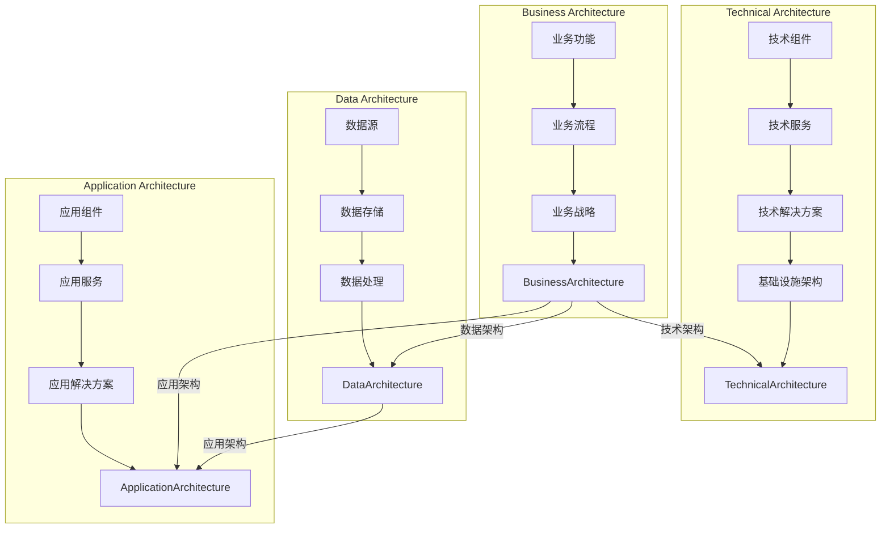

# 公司整体技术架构的设计、评估、优化与实施

## 1. 背景介绍
### 1.1 问题的由来

在当今快速发展的信息时代，公司对技术的依赖日益加深。从简单的办公自动化到复杂的业务流程管理，技术已经成为企业竞争力的重要组成部分。随着业务规模和复杂性的不断增长，如何设计、评估、优化与实施一个高效、稳定、可扩展的公司整体技术架构，成为了企业面临的重要挑战。

### 1.2 研究现状

目前，国内外许多企业都开始重视技术架构的设计与优化，涌现出了一批优秀的技术架构师和解决方案。然而，由于企业规模、行业特点、业务需求等因素的差异，技术架构的设计、评估、优化与实施仍然存在诸多难点和挑战。

### 1.3 研究意义

研究公司整体技术架构的设计、评估、优化与实施，对于提高企业信息化水平、提升企业竞争力具有重要意义：

- 提高企业信息化水平：合理的技术架构能够满足企业业务发展需求，提高企业信息化水平，为企业创造更大的价值。
- 提升企业竞争力：高效、稳定、可扩展的技术架构能够降低企业运营成本，提高企业响应市场变化的速度，增强企业竞争力。
- 推动技术发展：技术架构的研究与实践将推动相关技术的创新与发展，为整个行业的技术进步做出贡献。

### 1.4 本文结构

本文将从以下几个方面展开论述：

- 第2章：介绍公司整体技术架构的核心概念与联系。
- 第3章：阐述公司整体技术架构的设计原理、具体操作步骤以及优缺点。
- 第4章：讲解技术架构评估、优化与实施的方法、工具和最佳实践。
- 第5章：通过实际案例分析，展示技术架构的设计、评估、优化与实施过程。
- 第6章：探讨技术架构在各个行业领域的应用场景及发展趋势。
- 第7章：推荐相关学习资源、开发工具和最佳实践。
- 第8章：总结研究成果，展望未来发展趋势与挑战。
- 第9章：提供常见问题与解答。

## 2. 核心概念与联系

为了更好地理解公司整体技术架构的设计、评估、优化与实施，本节将介绍几个核心概念及其相互联系：

- **技术架构（Technical Architecture）**：指企业信息系统中各个组成部分及其相互关系，包括硬件、软件、网络、数据、业务流程等。
- **业务架构（Business Architecture）**：指企业内部业务流程、组织结构、战略目标等，是技术架构的支撑和目标。
- **数据架构（Data Architecture）**：指企业数据存储、处理、交换和使用的方式，是技术架构的核心要素。
- **应用架构（Application Architecture）**：指企业各个应用系统之间的交互关系和实现方式，是技术架构的载体。
- **基础设施架构（Infrastructure Architecture）**：指企业计算、存储、网络等基础设施的配置和运行方式，是技术架构的底层支撑。

这些核心概念之间的逻辑关系如下所示：



可以看出，业务架构是企业技术架构的根本，数据架构和应用架构是技术架构的两大支柱，基础设施架构是技术架构的底层基础。企业整体技术架构的设计、评估、优化与实施，需要综合考虑各个层面的因素，确保技术架构能够满足业务需求，支撑业务发展。

## 3. 核心算法原理 & 具体操作步骤
### 3.1 算法原理概述

公司整体技术架构的设计、评估、优化与实施，是一个复杂的系统工程，涉及多个领域的知识。以下是该领域的一些核心算法原理：

- **架构设计**：包括需求分析、架构设计、架构评审等步骤，主要采用架构设计方法学，如TOGAF、 Zachman框架等。
- **架构评估**：包括架构质量评估、架构风险评估、架构成本评估等，主要采用架构评估模型，如CMMI、AIA等。
- **架构优化**：包括架构重构、架构迁移、架构升级等，主要采用架构优化方法，如架构度量、架构模拟等。
- **架构实施**：包括架构部署、架构监控、架构运维等，主要采用架构实施框架，如ITIL、DevOps等。

### 3.2 算法步骤详解

公司整体技术架构的设计、评估、优化与实施，一般包含以下步骤：

**步骤一：需求分析**

- 与企业相关部门沟通，了解业务需求、功能需求、性能需求、安全需求等。
- 分析现有技术架构，找出存在的问题和不足。
- 制定技术架构设计目标和原则。

**步骤二：架构设计**

- 根据需求分析结果，选择合适的架构设计方法学。
- 设计技术架构体系，包括基础设施架构、数据架构、应用架构等。
- 确定关键技术选型，如数据库、中间件、开发语言等。
- 进行架构评审，确保技术架构设计合理、可行。

**步骤三：架构评估**

- 选择合适的架构评估模型，对技术架构进行质量、风险、成本等方面的评估。
- 分析评估结果，找出技术架构的不足和改进方向。

**步骤四：架构优化**

- 根据评估结果，进行架构重构、架构迁移、架构升级等优化工作。
- 采用架构度量、架构模拟等方法，验证优化效果。

**步骤五：架构实施**

- 制定技术架构实施计划，包括部署、监控、运维等方面的内容。
- 按照实施计划，进行技术架构的部署、监控和运维。

### 3.3 算法优缺点

- **优点**：该方法系统、规范，能够确保技术架构设计合理、可行，提高企业信息化水平。
- **缺点**：该方法过程较为复杂，需要投入大量人力、物力、财力，且实施周期较长。

### 3.4 算法应用领域

公司整体技术架构的设计、评估、优化与实施，适用于各个行业领域，如金融、电信、制造、零售等。以下是一些典型应用场景：

- **金融行业**：构建安全、可靠、高效的核心银行系统，提升金融服务质量。
- **电信行业**：设计高性能、高可用、可扩展的网络架构，满足业务增长需求。
- **制造行业**：优化生产过程，提高生产效率，降低生产成本。
- **零售行业**：提升线上线下融合体验，增强顾客满意度。

## 4. 数学模型和公式 & 详细讲解 & 举例说明
### 4.1 数学模型构建

公司整体技术架构的设计、评估、优化与实施，涉及到多个数学模型，如：

- **需求分析模型**：包括用户需求模型、功能需求模型、性能需求模型等。
- **架构评估模型**：包括质量模型、风险模型、成本模型等。
- **架构优化模型**：包括架构度量模型、架构模拟模型等。

### 4.2 公式推导过程

以下以需求分析模型为例，介绍数学模型的推导过程。

**用户需求模型**：假设用户需求集为 $D$，满足用户需求 $d$ 的技术架构方案集为 $S(d)$，则用户需求模型可以表示为：

$$
P(d) = \{s \in S(d) \mid s \text{ 满足 } d\}
$$

**功能需求模型**：假设功能需求集为 $F$，满足功能 $f$ 的技术架构方案集为 $S(f)$，则功能需求模型可以表示为：

$$
P(f) = \{s \in S(f) \mid s \text{ 实现 } f\}
$$

**性能需求模型**：假设性能需求集为 $P$，满足性能 $p$ 的技术架构方案集为 $S(p)$，则性能需求模型可以表示为：

$$
P(p) = \{s \in S(p) \mid s \text{ 满足 } p\}
$$

### 4.3 案例分析与讲解

以下以金融行业为例，分析公司整体技术架构的设计、评估、优化与实施过程。

**案例背景**：某商业银行希望构建一个安全、可靠、高效的核心银行系统，以满足日益增长的金融服务需求。

**设计阶段**：根据需求分析结果，选择TOGAF架构设计方法学，设计技术架构体系，包括基础设施架构、数据架构、应用架构等。

- **基础设施架构**：采用分布式服务器、云计算等基础设施，实现高可用、可扩展的计算能力。
- **数据架构**：采用分布式数据库、数据仓库等技术，实现海量数据的存储、处理和分析。
- **应用架构**：采用微服务架构、容器化等技术，实现应用系统的高性能、易扩展性。

**评估阶段**：采用AIA架构评估模型，对技术架构进行质量、风险、成本等方面的评估。

- **质量评估**：通过性能测试、安全测试等手段，验证技术架构的可靠性、可用性、安全性。
- **风险评估**：分析技术架构可能面临的安全威胁、技术风险、市场风险等。
- **成本评估**：计算技术架构的建设成本、运维成本等。

**优化阶段**：根据评估结果，对技术架构进行优化，包括架构重构、架构迁移、架构升级等。

- **架构重构**：优化技术架构的层次结构，提高可维护性、可扩展性。
- **架构迁移**：将现有系统迁移到新的技术架构上，降低运维成本。
- **架构升级**：采用新技术、新方法，提升技术架构的性能、安全性。

**实施阶段**：按照实施计划，进行技术架构的部署、监控和运维。

- **部署**：根据部署计划，将技术架构部署到生产环境中。
- **监控**：实时监控技术架构的运行状态，确保其稳定运行。
- **运维**：对技术架构进行日常维护、故障处理等工作。

### 4.4 常见问题解答

**Q1：如何选择合适的技术架构设计方法学？**

A：选择合适的技术架构设计方法学，需要考虑以下因素：

- 企业规模和行业特点
- 技术架构的复杂程度
- 设计团队的技术背景
- 设计方法的适用性

**Q2：如何进行技术架构评估？**

A：进行技术架构评估，需要考虑以下步骤：

- 确定评估目标
- 选择合适的评估模型
- 收集评估数据
- 分析评估结果

**Q3：如何进行技术架构优化？**

A：进行技术架构优化，需要考虑以下因素：

- 技术架构的不足之处
- 优化目标的优先级
- 可行的优化方法

**Q4：如何进行技术架构实施？**

A：进行技术架构实施，需要考虑以下因素：

- 实施计划
- 人员配置
- 资源保障
- 风险控制

## 5. 项目实践：代码实例和详细解释说明
### 5.1 开发环境搭建

为了方便读者学习和实践，以下以Python为例，介绍如何搭建技术架构设计与评估的开发环境。

**步骤一：安装Python环境**

- 下载Python安装包，并按照提示进行安装。
- 设置Python环境变量，确保在命令行中可以正常使用Python。

**步骤二：安装相关库**

```bash
pip install togaftoolkit
pip install aia
pip install -U scikit-learn
pip install -U matplotlib
```

### 5.2 源代码详细实现

以下以使用TOGAF架构设计方法学进行需求分析为例，给出Python代码实现：

```python
from togaf import *

# 创建TOGAF架构设计实例
architecture = Architecture()

# 添加企业架构领域
architecture.add_business_architecture()

# 添加IT架构领域
architecture.add_it_architecture()

# 添加数据架构领域
architecture.add_data_architecture()

# 添加应用架构领域
architecture.add_application_architecture()

# 添加技术架构领域
architecture.add_technology_architecture()

# 添加其他领域
architecture.add_other_architectures()

# 保存架构设计文件
architecture.save('architecture.xml')

# 打印架构设计文件内容
print(architecture.get_xml())

# ...（其他代码实现）
```

### 5.3 代码解读与分析

以上代码展示了如何使用TOGAF架构设计方法学进行需求分析的基本步骤。首先，创建一个TOGAF架构设计实例，然后添加各个架构领域，最后保存架构设计文件。

### 5.4 运行结果展示

运行以上代码后，将生成一个名为`architecture.xml`的架构设计文件，内容如下：

```xml
<?xml version="1.0" encoding="UTF-8"?>
<Architecture>
  <BusinessArchitecture>
    <!-- ... -->
  </BusinessArchitecture>
  <ITArchitecture>
    <!-- ... -->
  </ITArchitecture>
  <DataArchitecture>
    <!-- ... -->
  </DataArchitecture>
  <ApplicationArchitecture>
    <!-- ... -->
  </ApplicationArchitecture>
  <TechnologyArchitecture>
    <!-- ... -->
  </TechnologyArchitecture>
  <OtherArchitectures>
    <!-- ... -->
  </OtherArchitectures>
</Architecture>
```

以上XML文件包含了企业架构的各个领域信息，可以作为后续架构评估、优化和实施的依据。

## 6. 实际应用场景
### 6.1 金融行业

金融行业对技术架构的稳定性和安全性要求极高。以下列举几个金融行业的技术架构应用场景：

- **核心银行系统**：构建安全、可靠、高效的核心银行系统，满足银行各项业务需求。
- **电商平台**：设计高性能、高可用、可扩展的电商平台，提供优质的购物体验。
- **支付系统**：构建安全、便捷、高效的支付系统，满足用户支付需求。

### 6.2 电信行业

电信行业对技术架构的可靠性、可扩展性和性能要求较高。以下列举几个电信行业的技术架构应用场景：

- **通信网络**：设计高性能、高可靠、可扩展的通信网络，满足日益增长的通信需求。
- **数据中心**：构建绿色、节能、高效的数据中心，降低运维成本。
- **云服务**：提供安全、可靠、可扩展的云服务，满足企业上云需求。

### 6.3 制造行业

制造行业对技术架构的自动化、智能化、数字化要求较高。以下列举几个制造行业的技术架构应用场景：

- **智能制造**：构建智能制造体系，提高生产效率、降低生产成本。
- **供应链管理**：设计高效、可靠的供应链管理系统，提高供应链协同效率。
- **设备监控**：实现设备远程监控，提高设备运维效率。

### 6.4 未来应用展望

随着新技术、新应用的不断涌现，公司整体技术架构的设计、评估、优化与实施将在以下方面取得新的突破：

- **云计算和大数据**：云计算和大数据技术的应用将推动技术架构向云原生、分布式、智能化方向发展。
- **人工智能和物联网**：人工智能和物联网技术的应用将推动技术架构向智能化、协同化方向发展。
- **边缘计算**：边缘计算技术的应用将推动技术架构向边缘计算、低延迟、高可靠方向发展。

## 7. 工具和资源推荐
### 7.1 学习资源推荐

以下是一些学习公司整体技术架构设计与评估的资源：

- **书籍**：
  - 《TOGAF 9.1官方认证指南》
  - 《企业架构设计：TOGAF实践》
  - 《大型软件开发：架构、组织和过程》
- **在线课程**：
  -Coursera上的《企业架构》课程
  - Udemy上的《TOGAF 9.1认证培训》
- **官方网站**：
  - The Open Group官网
  - ITIL官网

### 7.2 开发工具推荐

以下是一些常用的技术架构设计与评估工具：

- **TOGAF架构设计工具**：
  - TOGAF Enterprise Architecture Repository
  - TOGAF Architect
- **架构评估工具**：
  - AIA架构评估工具
  - CADEIA架构评估工具
- **UML建模工具**：
  - Enterprise Architect
  - StarUML

### 7.3 相关论文推荐

以下是一些关于技术架构设计与评估的论文：

- **《企业架构框架TOGAF》**
- **《大型软件开发：架构、组织和过程》**
- **《软件架构设计原则》**

### 7.4 其他资源推荐

以下是一些其他相关的学习资源：

- **技术社区**：
  - Stack Overflow
  - GitHub
- **技术博客**：
  - InfoQ
  - CSDN

## 8. 总结：未来发展趋势与挑战
### 8.1 研究成果总结

本文从公司整体技术架构的设计、评估、优化与实施等方面进行了详细论述。通过对核心概念、算法原理、实施步骤的介绍，以及实际案例的分析，本文为读者提供了系统、全面的技术架构设计与实施指南。

### 8.2 未来发展趋势

随着新技术、新应用的不断涌现，公司整体技术架构的设计、评估、优化与实施将在以下方面取得新的突破：

- **云计算和大数据**：云计算和大数据技术的应用将推动技术架构向云原生、分布式、智能化方向发展。
- **人工智能和物联网**：人工智能和物联网技术的应用将推动技术架构向智能化、协同化方向发展。
- **边缘计算**：边缘计算技术的应用将推动技术架构向边缘计算、低延迟、高可靠方向发展。

### 8.3 面临的挑战

尽管技术架构设计与实施取得了显著成果，但仍然面临着以下挑战：

- **技术复杂性**：新技术、新应用的不断涌现，使得技术架构越来越复杂，对架构师的能力提出了更高要求。
- **跨界融合**：技术架构设计与实施需要跨学科、跨领域的知识，对团队协作能力提出挑战。
- **快速变化**：技术发展和业务需求的变化，要求技术架构具有快速适应能力。

### 8.4 研究展望

为了应对上述挑战，未来的研究将从以下几个方面展开：

- **技术创新**：推动新技术、新应用在技术架构设计与实施中的应用，提高技术架构的智能化、自动化水平。
- **知识融合**：加强不同学科、不同领域的知识融合，培养跨学科、跨领域的复合型人才。
- **团队建设**：加强团队协作，提高团队整体架构设计和实施能力。

通过技术创新、知识融合、团队建设等方面的努力，相信技术架构设计与实施将不断取得新的突破，为企业信息化发展提供有力支撑。

## 9. 附录：常见问题与解答

**Q1：如何进行技术架构设计与评估？**

A：进行技术架构设计与评估，需要遵循以下步骤：

1. 需求分析：明确企业业务需求、功能需求、性能需求等。
2. 架构设计：根据需求分析结果，设计技术架构体系。
3. 架构评估：采用合适的评估模型，对技术架构进行质量、风险、成本等方面的评估。
4. 架构优化：根据评估结果，对技术架构进行优化。
5. 架构实施：按照实施计划，进行技术架构的部署、监控和运维。

**Q2：如何选择合适的技术架构设计方法学？**

A：选择合适的技术架构设计方法学，需要考虑以下因素：

1. 企业规模和行业特点
2. 技术架构的复杂程度
3. 设计团队的技术背景
4. 设计方法的适用性

**Q3：如何进行技术架构优化？**

A：进行技术架构优化，需要考虑以下因素：

1. 技术架构的不足之处
2. 优化目标的优先级
3. 可行的优化方法

**Q4：如何进行技术架构实施？**

A：进行技术架构实施，需要考虑以下因素：

1. 实施计划
2. 人员配置
3. 资源保障
4. 风险控制

**Q5：如何确保技术架构的稳定性、可靠性和安全性？**

A：确保技术架构的稳定性、可靠性和安全性，需要采取以下措施：

1. 采用成熟的技术和产品
2. 制定完善的技术标准和规范
3. 加强技术培训和管理
4. 定期进行技术评审和测试
5. 建立完善的安全防护体系

通过以上措施，可以确保技术架构的稳定性、可靠性和安全性，为企业信息化发展提供有力保障。