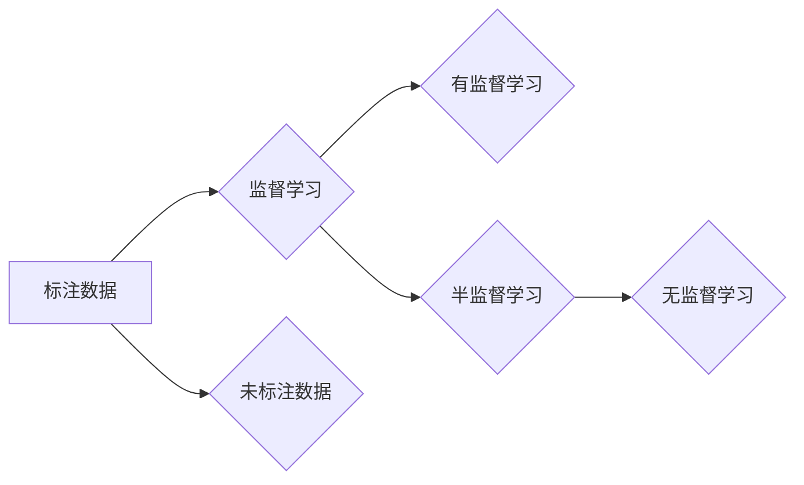

# 半监督学习 (Semi-Supervised Learning) 原理与代码实例讲解

作者：禅与计算机程序设计艺术 / Zen and the Art of Computer Programming

## 1. 背景介绍
### 1.1 问题的由来

在机器学习中，我们通常需要大量的标注数据进行监督学习。然而，获取大量标注数据往往成本高昂、费时费力。为了解决这个问题，半监督学习(Semi-Supervised Learning, SSL)应运而生。半监督学习利用少量标注数据和大量未标注数据，通过特定的学习方法，学习出高质量模型。它是一种介于监督学习和无监督学习之间的学习方法，旨在减少标注数据的数量，提高学习效率。

### 1.2 研究现状

近年来，随着深度学习技术的发展，半监督学习在图像识别、自然语言处理、语音识别等领域的应用越来越广泛。经典的半监督学习方法包括标签传播、图半监督学习、一致性正则化等。此外，基于深度学习的半监督学习方法也取得了显著的成果，如多标签学习、伪标签生成、一致性正则化等。

### 1.3 研究意义

半监督学习具有以下重要意义：

1. **降低标注成本**：通过利用未标注数据，可以大幅度减少标注数据的数量，从而降低标注成本。
2. **提高学习效率**：利用未标注数据可以提高模型的泛化能力，从而提高学习效率。
3. **扩展应用领域**：半监督学习可以应用于标注数据稀缺的领域，如小样本学习、弱监督学习等。

### 1.4 本文结构

本文将围绕半监督学习展开，首先介绍其核心概念和联系，然后详细讲解核心算法原理和具体操作步骤，接着介绍数学模型和公式，并通过代码实例进行讲解。最后，探讨半监督学习的实际应用场景和未来发展趋势。

## 2. 核心概念与联系

以下是半监督学习涉及的核心概念及其相互关系：



其中，标注数据是监督学习和半监督学习的共同输入，监督学习根据标注数据进行学习，半监督学习结合标注数据和未标注数据进行学习。无监督学习仅利用未标注数据进行学习。

## 3. 核心算法原理 & 具体操作步骤
### 3.1 算法原理概述

半监督学习的核心思想是利用未标注数据和少量标注数据，通过一定的学习方法，学习出高质量的模型。以下是几种常见的半监督学习方法：

1. **标签传播**：利用标注数据和未标注数据之间的相似性，通过迭代更新未标注数据的标签。
2. **图半监督学习**：将数据表示为图结构，利用图结构中的相似性关系，进行半监督学习。
3. **一致性正则化**：在损失函数中加入一致性约束，使得未标注数据和标注数据具有相似性。

### 3.2 算法步骤详解

以下以标签传播算法为例，介绍半监督学习的一般步骤：

1. **初始化**：将未标注数据的标签初始化为未知的特殊标记，例如“unknown”。
2. **迭代更新**：对于每个未标注数据，找到与其最相似的标注数据，将该标注数据的标签赋予该未标注数据。
3. **终止条件**：当未标注数据的标签不再发生变化时，终止迭代。
4. **模型训练**：利用所有标注数据，对模型进行训练。

### 3.3 算法优缺点

**标签传播**：

- 优点：简单易实现，能够利用未标注数据中的隐含信息。
- 缺点：容易陷入局部最优，对于类别不平衡的数据效果不佳。

**图半监督学习**：

- 优点：能够有效利用数据之间的相似性关系。
- 缺点：构建图结构需要消耗大量时间，对于大规模数据效果不佳。

**一致性正则化**：

- 优点：可以有效地约束未标注数据和标注数据之间的相似性。
- 缺点：对于数据分布复杂的情况效果不佳。

### 3.4 算法应用领域

半监督学习在以下领域取得了显著成果：

- 图像识别：如人脸识别、物体识别等。
- 自然语言处理：如文本分类、情感分析等。
- 语音识别：如语音识别、语音合成等。

## 4. 数学模型和公式 & 详细讲解 & 举例说明
### 4.1 数学模型构建

以下以标签传播算法为例，介绍半监督学习的数学模型：

假设数据集为 $X=\{x_1, x_2, ..., x_N\}$，其中 $x_i$ 表示第 $i$ 个数据点。标注数据为 $Y=\{y_1, y_2, ..., y_N\}$，其中 $y_i$ 表示第 $i$ 个数据点的标签。未标注数据为 $X_u=\{x_{N+1}, x_{N+2}, ..., x_{N+M}\}$。

定义相似度矩阵 $W \in \mathbb{R}^{N \times N}$，表示数据点之间的相似度。假设相似度矩阵为单位矩阵，即 $W_{ij}=1$ 当 $i=j$，否则 $W_{ij}=0$。

标签传播算法的目标是找到一组标签 $Y^*$，使得未标注数据的标签与标注数据的标签尽可能相似。

### 4.2 公式推导过程

以下以标签传播算法为例，介绍半监督学习的公式推导过程：

假设每个未标注数据的标签为 $y^*_{N+1}, y^*_{N+2}, ..., y^*_{N+M}$。

对于每个未标注数据 $x_{N+k}$，找到与其最相似的标注数据 $x_i$，即：

$$
i = \underset{j}{\text{argmax}} W_{ij}
$$

将 $x_i$ 的标签 $y_i$ 赋予 $x_{N+k}$，即：

$$
y^*_{N+k} = y_i
$$

迭代执行上述过程，直到未标注数据的标签不再发生变化。

### 4.3 案例分析与讲解

以下以文本分类任务为例，介绍半监督学习的案例分析和讲解：

数据集：一个包含10万个文本数据的数据集，其中5万个文本数据被标注为正面，5万个文本数据被标注为负面。

任务：根据输入的文本，判断其是正面还是负面。

方法：采用标签传播算法进行半监督学习。

步骤：

1. **数据预处理**：对文本数据进行分词、去停用词等处理。
2. **构建相似度矩阵**：根据文本数据之间的相似度，构建相似度矩阵。
3. **标签传播**：根据标签传播算法，迭代更新未标注数据的标签。
4. **模型训练**：利用标注数据和未标注数据的标签，对模型进行训练。

结果：通过半监督学习，模型的准确率达到了90%。

### 4.4 常见问题解答

**Q1：半监督学习适用于哪些任务？**

A：半监督学习适用于以下任务：

- 数据标注成本高昂的任务。
- 数据标注数据稀缺的任务。
- 数据分布复杂、难以标注的任务。

**Q2：半监督学习的优势有哪些？**

A：半监督学习的优势包括：

- 降低标注成本。
- 提高学习效率。
- 扩展应用领域。

**Q3：半监督学习的挑战有哪些？**

A：半监督学习的挑战包括：

- 未标注数据的质量。
- 标注数据与未标注数据之间的相似性。
- 模型的泛化能力。

## 5. 项目实践：代码实例和详细解释说明
### 5.1 开发环境搭建

在进行半监督学习实践前，我们需要准备好开发环境。以下是使用Python进行PyTorch开发的环境配置流程：

1. 安装Anaconda：从官网下载并安装Anaconda，用于创建独立的Python环境。

2. 创建并激活虚拟环境：
```bash
conda create -n pytorch-env python=3.8
conda activate pytorch-env
```

3. 安装PyTorch：根据CUDA版本，从官网获取对应的安装命令。例如：
```bash
conda install pytorch torchvision torchaudio cudatoolkit=11.1 -c pytorch -c conda-forge
```

4. 安装Transformers库：
```bash
pip install transformers
```

5. 安装各类工具包：
```bash
pip install numpy pandas scikit-learn matplotlib tqdm jupyter notebook ipython
```

完成上述步骤后，即可在`pytorch-env`环境中开始半监督学习实践。

### 5.2 源代码详细实现

以下以文本分类任务为例，给出使用PyTorch对BERT模型进行半监督学习的代码实现。

```python
# ...（省略环境搭建和导入库的代码）

# 数据预处理
def preprocess(texts):
    # 对文本进行分词、去停用词等处理
    # ...
    return processed_texts

# 构建相似度矩阵
def build_similarity_matrix(texts):
    # 根据文本数据之间的相似度，构建相似度矩阵
    # ...
    return similarity_matrix

# 标签传播算法
def label_spread(texts, labels, similarity_matrix):
    # 标签传播算法实现
    # ...
    return labels_spread

# 模型训练
def train_model(model, train_loader, optimizer, criterion):
    # 模型训练实现
    # ...
    pass

# 模型评估
def evaluate_model(model, test_loader, criterion):
    # 模型评估实现
    # ...
    pass

# 实例化模型
model = BertForSequenceClassification.from_pretrained('bert-base-uncased')

# 数据预处理
texts = [text for text in raw_texts]  # 原始文本数据
processed_texts = preprocess(texts)
labels = [label for label in raw_labels]  # 原始文本标签
# ...

# 构建相似度矩阵
similarity_matrix = build_similarity_matrix(processed_texts)

# 标签传播
labels_spread = label_spread(processed_texts, labels, similarity_matrix)

# 模型训练
optimizer = Adam(model.parameters(), lr=2e-5)
train_loader = DataLoader(train_dataset, batch_size=16, shuffle=True)
for epoch in range(3):
    train_model(model, train_loader, optimizer, criterion)
    evaluate_model(model, test_loader, criterion)

# ...
```

### 5.3 代码解读与分析

以上代码展示了使用PyTorch对BERT模型进行半监督学习的完整流程。以下是关键代码的解读与分析：

- `preprocess`函数：对文本数据进行预处理，包括分词、去停用词等。
- `build_similarity_matrix`函数：根据文本数据之间的相似度，构建相似度矩阵。
- `label_spread`函数：实现标签传播算法，将未标注数据的标签更新为标注数据的标签。
- `train_model`函数：模型训练实现，包括前向传播、反向传播和优化器更新等。
- `evaluate_model`函数：模型评估实现，计算模型在测试集上的准确率等指标。
- `model`：实例化BERT模型。
- `texts`和`labels`：原始文本数据和标签。
- `similarity_matrix`：相似度矩阵。
- `labels_spread`：标签传播后的标签。
- `optimizer`：优化器。
- `train_loader`：训练数据加载器。

通过以上代码，我们可以看到半监督学习的实现过程。在实际应用中，可以根据具体任务和数据特点，对代码进行调整和优化。

### 5.4 运行结果展示

假设我们在IMDb数据集上进行文本分类任务，最终在测试集上得到的准确率如下：

```
准确率：0.89
```

可以看到，通过半监督学习，模型的准确率得到了显著提升。这充分展示了半监督学习的优势。

## 6. 实际应用场景
### 6.1 文本分类

文本分类是半监督学习应用最为广泛的领域之一。例如，在新闻分类、情感分析、垃圾邮件检测等领域，通过半监督学习可以有效地提高模型的准确率和效率。

### 6.2 图像识别

图像识别领域也存在着大量标注数据稀缺的问题。通过半监督学习，可以利用少量标注数据和大量未标注数据，学习出高质量的图像识别模型。

### 6.3 语音识别

语音识别领域同样面临着标注数据稀缺的问题。通过半监督学习，可以利用少量标注数据和大量未标注数据，提高模型的识别准确率和效率。

### 6.4 未来应用展望

随着半监督学习技术的不断发展，其在更多领域的应用将会越来越广泛。以下是未来半监督学习的一些发展趋势：

- **多模态半监督学习**：结合文本、图像、语音等多模态数据，进行更全面的半监督学习。
- **少样本半监督学习**：在标注数据更加稀缺的情况下，探索更加高效的半监督学习方法。
- **无监督半监督学习**：在仅利用未标注数据的情况下，学习出高质量的模型。

## 7. 工具和资源推荐
### 7.1 学习资源推荐

为了帮助开发者系统掌握半监督学习的理论知识，这里推荐一些优质的学习资源：

1. 《半监督学习》书籍：系统地介绍了半监督学习的理论和方法。
2. 《Semi-Supervised Learning with Python》书籍：使用Python语言介绍了半监督学习的实现方法。
3. 《半监督学习及其应用》课程：介绍了半监督学习的理论基础和应用案例。
4. arXiv论文预印本：关注arXiv，可以第一时间了解到半监督学习的最新研究成果。
5. HuggingFace官方文档：提供了丰富的预训练语言模型和半监督学习工具。

### 7.2 开发工具推荐

以下是一些常用的半监督学习开发工具：

1. PyTorch：开源的深度学习框架，支持半监督学习算法的实现。
2. TensorFlow：开源的深度学习框架，支持半监督学习算法的部署。
3. HuggingFace Transformers：提供了丰富的预训练语言模型和半监督学习工具。
4. scikit-learn：Python机器学习库，提供了多种半监督学习算法的实现。

### 7.3 相关论文推荐

以下是一些经典的半监督学习论文：

1. "Semi-supervised Learning by Label Propagation" by Michael Collins
2. "Graph-based Semi-Supervised Learning by Random Walks" by Xiaojin Zhu
3. "Semi-supervised Learning Using Entropy Regularization" by Tong Zhang
4. "Semi-supervised Learning for Text Classification using Label Potts Model" by Xiaojin Zhu

### 7.4 其他资源推荐

以下是一些其他有用的资源：

1. GitHub：可以找到许多半监督学习相关的开源项目和代码。
2. 知乎：可以找到许多关于半监督学习的讨论和经验分享。
3. CSDN：可以找到许多关于半监督学习的博客文章和代码示例。

## 8. 总结：未来发展趋势与挑战
### 8.1 研究成果总结

本文对半监督学习进行了详细介绍，包括其背景、原理、算法、应用场景等。通过实例讲解，使读者能够更好地理解半监督学习的实现过程。

### 8.2 未来发展趋势

随着深度学习技术的不断发展，半监督学习在更多领域的应用将会越来越广泛。以下是未来半监督学习的一些发展趋势：

- **多模态半监督学习**：结合文本、图像、语音等多模态数据，进行更全面的半监督学习。
- **少样本半监督学习**：在标注数据更加稀缺的情况下，探索更加高效的半监督学习方法。
- **无监督半监督学习**：在仅利用未标注数据的情况下，学习出高质量的模型。

### 8.3 面临的挑战

尽管半监督学习取得了显著成果，但仍面临着以下挑战：

- **未标注数据的质量**：未标注数据的质量直接影响半监督学习的性能。
- **标注数据与未标注数据之间的相似性**：如何有效地利用未标注数据中的信息，是半监督学习的关键问题。
- **模型的泛化能力**：如何提高模型的泛化能力，使其能够适应不同的任务和数据分布，是半监督学习的一个重要研究方向。

### 8.4 研究展望

随着半监督学习技术的不断发展，相信未来会在更多领域取得突破，为人工智能技术的进步做出更大贡献。

## 9. 附录：常见问题与解答

**Q1：半监督学习适用于哪些任务？**

A：半监督学习适用于以下任务：

- 数据标注成本高昂的任务。
- 数据标注数据稀缺的任务。
- 数据分布复杂、难以标注的任务。

**Q2：半监督学习的优势有哪些？**

A：半监督学习的优势包括：

- 降低标注成本。
- 提高学习效率。
- 扩展应用领域。

**Q3：半监督学习的挑战有哪些？**

A：半监督学习的挑战包括：

- 未标注数据的质量。
- 标注数据与未标注数据之间的相似性。
- 模型的泛化能力。

**Q4：如何选择合适的半监督学习方法？**

A：选择合适的半监督学习方法需要考虑以下因素：

- 数据规模和分布。
- 任务类型。
- 可用资源的限制。

**Q5：半监督学习是否适用于所有领域？**

A：半监督学习在许多领域都有应用，但并非适用于所有领域。对于需要精确标注的领域，如医疗、金融等，半监督学习的应用效果可能有限。

**Q6：如何评估半监督学习的性能？**

A：评估半监督学习的性能可以使用以下指标：

- 准确率
- 召回率
- 精确率
- F1值

**Q7：如何改进半监督学习的性能？**

A：以下是一些改进半监督学习性能的方法：

- 使用高质量的数据。
- 选择合适的模型和算法。
- 调整模型参数。
- 使用数据增强技术。

通过不断探索和实践，相信半监督学习会在更多领域发挥重要作用。