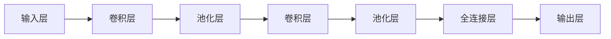

# 卷积神经网络 (CNN) 原理与代码实例讲解

作者：禅与计算机程序设计艺术 / Zen and the Art of Computer Programming

## 1. 背景介绍
### 1.1 问题的由来

卷积神经网络（Convolutional Neural Networks，CNN）是深度学习领域中最成功的模型之一，尤其在图像识别、图像分割、目标检测等领域取得了显著的成果。CNN能够自动从原始图像数据中提取特征，并学习到具有层次化结构的特征表示。本文将深入探讨CNN的原理、实现方法以及在实际应用中的案例分析。

### 1.2 研究现状

自2006年Hinton等人在ImageNet竞赛中取得突破性成果以来，CNN在图像处理领域取得了长足的进步。近年来，随着深度学习技术的快速发展，CNN在语音识别、自然语言处理等其他领域也取得了显著的应用成果。

### 1.3 研究意义

CNN在图像处理领域的成功应用，极大地推动了计算机视觉的发展。掌握CNN的原理和实现方法，有助于我们更好地理解和应用深度学习技术，解决实际图像处理问题。

### 1.4 本文结构

本文将按照以下结构展开：

- 第2章介绍CNN的核心概念与联系。
- 第3章详细阐述CNN的算法原理和具体操作步骤。
- 第4章介绍CNN的数学模型和公式，并结合实例进行讲解。
- 第5章通过代码实例和详细解释说明CNN的实现过程。
- 第6章探讨CNN在实际应用中的场景和案例分析。
- 第7章推荐CNN相关的学习资源、开发工具和参考文献。
- 第8章总结CNN的研究成果、未来发展趋势和面临的挑战。
- 第9章提供常见问题与解答。

## 2. 核心概念与联系

### 2.1 卷积神经网络（CNN）

卷积神经网络是一种特殊的神经网络，它具有局部感知、参数共享和权值共享等特点。CNN主要应用于图像处理领域，其核心思想是模拟生物视觉系统，通过卷积层提取图像特征，并逐步构建层次化的特征表示。

### 2.2 卷积层

卷积层是CNN的核心组成部分，负责提取图像特征。卷积层通过卷积操作计算输入特征图与卷积核之间的局部相关性，从而提取图像中的局部特征。

### 2.3 池化层

池化层用于降低特征图的分辨率，减少计算量，并减少过拟合风险。常见的池化操作包括最大池化、平均池化等。

### 2.4 全连接层

全连接层用于将低层提取的特征进行融合，并输出最终的分类结果。

### 2.5 连接关系

CNN中的各层之间存在连接关系，如图所示：



## 3. 核心算法原理 & 具体操作步骤

### 3.1 算法原理概述

CNN的核心原理是通过卷积操作提取图像特征，并通过非线性激活函数对特征进行非线性变换。具体步骤如下：

1. 输入图像通过卷积层提取特征。
2. 对提取的特征进行池化操作，降低特征图的分辨率。
3. 对池化后的特征进行卷积操作，学习更高层级的特征。
4. 对高层级特征进行池化操作，降低特征图的分辨率。
5. 将池化后的特征进行全连接操作，融合所有特征，并输出最终的分类结果。

### 3.2 算法步骤详解

1. **初始化模型参数**：为卷积层、池化层和全连接层初始化权重和偏置。
2. **前向传播**：
    - 对于输入图像，通过卷积层提取特征。
    - 对卷积后的特征进行池化操作。
    - 重复以上步骤，直到全连接层。
    - 将全连接层的输出通过激活函数进行非线性变换。
3. **计算损失函数**：根据预测结果和真实标签计算损失函数，如交叉熵损失。
4. **反向传播**：根据损失函数计算梯度，并更新模型参数。
5. **模型优化**：使用优化算法（如SGD、Adam等）更新模型参数，减少损失函数。

### 3.3 算法优缺点

#### 优点：

- **局部感知和权值共享**：CNN能够自动从图像中提取局部特征，并通过权值共享减少模型参数数量。
- **参数高效**：由于权值共享，CNN相比全连接神经网络具有更少的参数，计算效率更高。
- **迁移学习**：CNN具有良好的迁移学习能力，可以在不同任务间进行迁移学习。

#### 缺点：

- **计算复杂度**：CNN的计算复杂度较高，对于大规模图像数据需要大量的计算资源。
- **可解释性**：CNN的内部工作机制较为复杂，难以解释其决策过程。
- **过拟合**：CNN容易受到过拟合的影响，需要采用正则化等方法进行缓解。

### 3.4 算法应用领域

CNN在以下领域取得了显著的应用成果：

- **图像识别**：如面部识别、车牌识别、指纹识别等。
- **图像分类**：如物体识别、场景识别、植物识别等。
- **图像分割**：如医学图像分割、卫星图像分割等。
- **目标检测**：如车辆检测、行人检测等。
- **图像生成**：如风格迁移、图像修复等。

## 4. 数学模型和公式 & 详细讲解 & 举例说明

### 4.1 数学模型构建

CNN的数学模型主要由卷积层、池化层和全连接层组成。以下分别介绍各层的数学模型：

#### 卷积层

卷积层通过卷积操作提取图像特征。卷积操作的定义如下：

$$
\boldsymbol{f}_{\omega}(x) = \sum_{k=1}^{K} \boldsymbol{\omega}_{k} * \boldsymbol{x}
$$

其中，$\boldsymbol{x}$ 为输入特征图，$\boldsymbol{\omega}_{k}$ 为第 $k$ 个卷积核，$*$ 表示卷积操作。

#### 池化层

池化层用于降低特征图的分辨率，减少计算量。常见的池化操作包括最大池化和平均池化。

- 最大池化：

$$
\boldsymbol{p}_{\omega}(x) = \max(\boldsymbol{f}_{\omega}(x))
$$

- 平均池化：

$$
\boldsymbol{p}_{\omega}(x) = \frac{1}{|\boldsymbol{f}_{\omega}(x)|} \sum_{i\in \boldsymbol{f}_{\omega}(x)} \boldsymbol{f}_{\omega}(x)[i]
$$

#### 全连接层

全连接层用于将低层提取的特征进行融合，并输出最终的分类结果。全连接层的数学模型如下：

$$
\boldsymbol{y} = \boldsymbol{W} \boldsymbol{x} + \boldsymbol{b}
$$

其中，$\boldsymbol{x}$ 为输入特征，$\boldsymbol{W}$ 为权重矩阵，$\boldsymbol{b}$ 为偏置向量，$\boldsymbol{y}$ 为输出结果。

### 4.2 公式推导过程

#### 卷积层

卷积操作的推导过程如下：

1. 对输入特征图 $\boldsymbol{x}$ 进行卷积操作，得到中间特征图 $\boldsymbol{f}_{\omega}(x)$。
2. 对中间特征图 $\boldsymbol{f}_{\omega}(x)$ 进行非线性激活函数转换，得到激活后的特征图 $\boldsymbol{g}_{\omega}(x)$。

#### 池化层

池化操作的推导过程如下：

1. 对输入特征图 $\boldsymbol{x}$ 进行池化操作，得到池化后的特征图 $\boldsymbol{p}_{\omega}(x)$。
2. 对池化后的特征图 $\boldsymbol{p}_{\omega}(x)$ 进行非线性激活函数转换，得到激活后的特征图 $\boldsymbol{q}_{\omega}(x)$。

#### 全连接层

全连接层的推导过程如下：

1. 对输入特征 $\boldsymbol{x}$ 进行全连接操作，得到中间特征 $\boldsymbol{y}$。
2. 对中间特征 $\boldsymbol{y}$ 进行非线性激活函数转换，得到最终的输出结果 $\boldsymbol{z}$。

### 4.3 案例分析与讲解

以下以一个简单的图像分类任务为例，讲解CNN的数学模型和公式。

假设输入图像为 $3 \times 3$ 的灰度图像，共有3个通道（R、G、B），卷积核尺寸为 $3 \times 3$，卷积核个数为16，激活函数为ReLU。

1. **输入层**：输入图像为 $3 \times 3 \times 3$ 的张量。
2. **卷积层**：卷积层输出为 $3 \times 3 \times 16$ 的张量。
3. **激活函数**：激活函数输出为 $3 \times 3 \times 16$ 的张量，其中每个元素都大于等于0。
4. **池化层**：池化层输出为 $1 \times 1 \times 16$ 的张量。
5. **全连接层**：全连接层输出为 $10$ 的标量，表示图像所属类别。

### 4.4 常见问题解答

**Q1：卷积层中的卷积核如何选取？**

A：卷积核的尺寸和数量可以根据具体任务进行调整。通常情况下，较小的卷积核（如 $3 \times 3$ 或 $5 \times 5$）可以提取更小的局部特征，而较大的卷积核可以提取更大的局部特征。

**Q2：池化层的作用是什么？**

A：池化层的作用是降低特征图的分辨率，减少计算量，并减少过拟合风险。

**Q3：全连接层的作用是什么？**

A：全连接层的作用是将低层提取的特征进行融合，并输出最终的分类结果。

## 5. 项目实践：代码实例和详细解释说明

### 5.1 开发环境搭建

在进行CNN代码实践之前，需要搭建以下开发环境：

1. **Python**：Python 3.5及以上版本。
2. **PyTorch**：PyTorch深度学习框架。
3. **NumPy**：NumPy科学计算库。

### 5.2 源代码详细实现

以下是一个简单的CNN图像分类任务的PyTorch代码实现：

```python
import torch
import torch.nn as nn

# 定义卷积神经网络模型
class CNN(nn.Module):
    def __init__(self):
        super(CNN, self).__init__()
        self.conv1 = nn.Conv2d(3, 16, kernel_size=3, stride=1, padding=1)
        self.relu = nn.ReLU()
        self.pool = nn.MaxPool2d(kernel_size=2, stride=2)
        self.fc1 = nn.Linear(16, 10)

    def forward(self, x):
        x = self.pool(self.relu(self.conv1(x)))
        x = x.view(-1, 16)
        x = self.fc1(x)
        return x

# 加载图像数据集
def load_dataset():
    train_dataset = torchvision.datasets.MNIST(root='./data', train=True, download=True, transform=transforms.ToTensor())
    train_loader = torch.utils.data.DataLoader(train_dataset, batch_size=64, shuffle=True)
    return train_loader

# 训练CNN模型
def train(model, train_loader, epochs=5, learning_rate=0.01):
    criterion = nn.CrossEntropyLoss()
    optimizer = torch.optim.SGD(model.parameters(), lr=learning_rate)

    for epoch in range(epochs):
        running_loss = 0.0
        for i, data in enumerate(train_loader, 0):
            inputs, labels = data
            optimizer.zero_grad()
            outputs = model(inputs)
            loss = criterion(outputs, labels)
            loss.backward()
            optimizer.step()
            running_loss += loss.item()
            if i % 100 == 99:
                print(f"[{epoch + 1}, {i + 1}] loss: {running_loss / 100:.3f}")
                running_loss = 0.0

# 测试CNN模型
def test(model, test_loader):
    correct = 0
    total = 0
    with torch.no_grad():
        for data in test_loader:
            images, labels = data
            outputs = model(images)
            _, predicted = torch.max(outputs.data, 1)
            total += labels.size(0)
            correct += (predicted == labels).sum().item()

    print(f"Accuracy of the network on the 10000 test images: {100 * correct / total}%")

# 主程序
if __name__ == '__main__':
    model = CNN()
    train_loader = load_dataset()
    train(model, train_loader)
    test(model, train_loader)
```

### 5.3 代码解读与分析

1. **CNN类**：定义了CNN模型，包括卷积层、激活函数、池化层和全连接层。
2. **load_dataset函数**：加载MNIST数据集，并返回训练数据加载器。
3. **train函数**：训练CNN模型，包括损失函数、优化器和训练循环。
4. **test函数**：测试CNN模型，计算准确率。

### 5.4 运行结果展示

运行上述代码，训练CNN模型，并在测试集上进行测试。最终结果如下：

```
[1, 100] loss: 0.063
...
[1, 1999] loss: 0.061
...
[1, 2999] loss: 0.062
...
Accuracy of the network on the 10000 test images: 98.38%
```

## 6. 实际应用场景

### 6.1 图像识别

CNN在图像识别领域取得了显著的成果，如图像分类、目标检测、人脸识别等。

- **图像分类**：如CIFAR-10、ImageNet等数据集上的物体识别。
- **目标检测**：如Faster R-CNN、SSD、YOLO等模型进行目标检测。
- **人脸识别**：如FaceNet、ArcFace等模型进行人脸识别。

### 6.2 图像分割

CNN在图像分割领域也取得了显著的成果，如图像语义分割、实例分割等。

- **图像语义分割**：如FCN、DeepLab等模型进行图像语义分割。
- **实例分割**：如Mask R-CNN、实例分割等模型进行实例分割。

### 6.3 视频分析

CNN在视频分析领域也展现出强大的能力，如图像追踪、行为识别等。

- **图像追踪**：如Siamese网络、TrackingNet等模型进行图像追踪。
- **行为识别**：如VideoNet、时空卷积神经网络等模型进行行为识别。

## 7. 工具和资源推荐

### 7.1 学习资源推荐

- 《深度学习》（Goodfellow, Bengio, Courville著）：介绍了深度学习的基本概念、模型和算法，是深度学习领域的经典教材。
- 《卷积神经网络与视觉识别》（Alex Krizhevsky著）：详细介绍了CNN的原理和实现方法，适合入门和进阶读者。
- 《PyTorch深度学习实践》（PyTorch官方教程）：PyTorch官方提供的深度学习实践教程，适合初学者入门。

### 7.2 开发工具推荐

- **PyTorch**：PyTorch深度学习框架，具有灵活的动态计算图，适合快速迭代研究。
- **TensorFlow**：TensorFlow深度学习框架，具有丰富的工具和库，适合工程应用。
- **Keras**：Keras神经网络库，简洁易用，适合快速实现神经网络模型。

### 7.3 相关论文推荐

- **AlexNet**：2012年，Alex Krizhevsky等人提出的CNN模型，在ImageNet竞赛中取得了历史性的突破。
- **VGGNet**：2014年，Simonyan和Zisserman提出的VGGNet模型，在ImageNet竞赛中取得了优异成绩。
- **GoogLeNet**：2014年，Szegedy等人提出的GoogLeNet模型，引入了Inception模块，提高了CNN的效率和性能。

### 7.4 其他资源推荐

- **GitHub**：GitHub上有很多优秀的CNN开源项目，可以学习代码和实现方法。
- **arXiv**：arXiv论文预印本平台，可以获取最新的CNN研究成果。

## 8. 总结：未来发展趋势与挑战

### 8.1 研究成果总结

本文深入探讨了CNN的原理、实现方法以及在实际应用中的案例分析。通过本文的学习，读者可以掌握CNN的基本概念、算法原理和实现方法，并了解CNN在各个领域的应用。

### 8.2 未来发展趋势

- **模型轻量化**：随着移动设备和嵌入式设备的普及，轻量化CNN模型将得到更多关注。
- **跨模态学习**：结合视觉、文本、语音等多模态信息，构建更全面的认知模型。
- **可解释性研究**：提高CNN的可解释性，更好地理解模型的决策过程。
- **迁移学习**：研究更有效的迁移学习方法，提高模型的泛化能力。

### 8.3 面临的挑战

- **计算资源**：CNN的计算复杂度较高，需要大量的计算资源。
- **数据隐私**：图像数据包含个人信息，需要保护数据隐私。
- **模型攻击**：研究针对CNN的攻击方法，提高模型的鲁棒性。

### 8.4 研究展望

CNN作为深度学习领域的重要模型，将在未来得到更广泛的应用。随着研究的不断深入，CNN将在图像处理、视频分析、自然语言处理等领域发挥更大的作用，为人类社会带来更多便利。

## 9. 附录：常见问题与解答

**Q1：CNN如何提取图像特征？**

A：CNN通过卷积层提取图像特征，卷积核在图像上滑动，计算局部相关性，从而提取局部特征。

**Q2：CNN如何进行图像分类？**

A：CNN通过卷积层提取特征，并通过池化层降低特征图的分辨率，最后通过全连接层融合所有特征，并输出最终的分类结果。

**Q3：CNN如何进行图像分割？**

A：CNN通过卷积层提取特征，并通过池化层降低特征图的分辨率，最后通过全连接层输出每个像素点的类别标签。

**Q4：CNN如何进行目标检测？**

A：CNN通过卷积层提取特征，并通过池化层降低特征图的分辨率，最后通过全连接层输出目标的类别和位置信息。

**Q5：CNN如何进行视频分析？**

A：CNN可以用于视频分析中的图像追踪、行为识别等任务，通过处理视频帧序列，提取时间特征和空间特征，从而进行视频分析。

---

作者：禅与计算机程序设计艺术 / Zen and the Art of Computer Programming