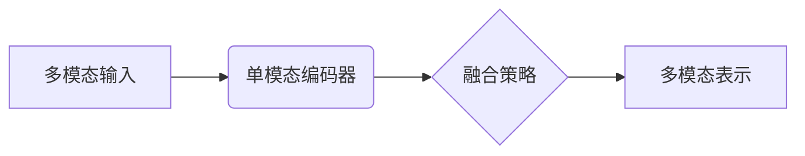
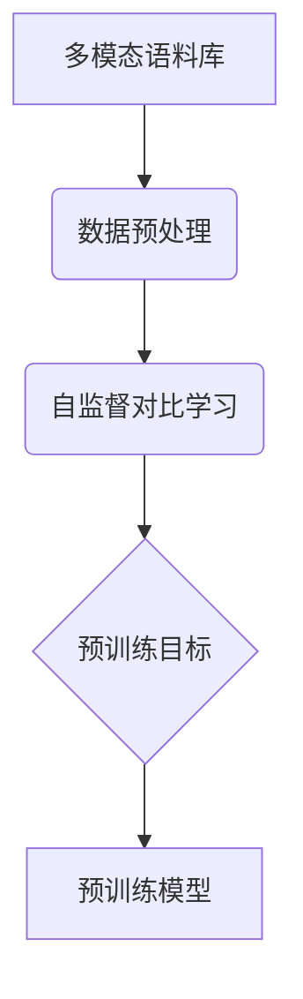
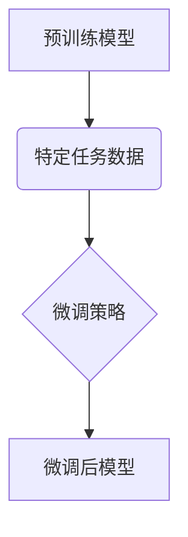

# 多模态大模型：技术原理与实战优化逻辑介绍

## 1. 背景介绍

### 1.1 人工智能发展历程

人工智能的发展经历了几个重要阶段。早期的人工智能系统主要采用符号主义方法,依赖专家系统和知识库。20世纪90年代,机器学习和神经网络的兴起,推动了数据驱动的人工智能发展。近年来,benefiting from大量数据、算力和新算法,深度学习取得了突破性进展,在计算机视觉、自然语言处理等领域表现优异。

### 1.2 大模型兴起

随着算力和数据的不断增长,大规模预训练语言模型(如GPT、BERT等)开始崭露头角。这些大模型通过在海量无标注数据上预训练,学习到丰富的知识,展现出惊人的泛化能力。然而,它们主要局限于单一模态(文本),无法充分利用多源异构信息。

### 1.3 多模态AI需求

现实世界是多模态的,包含文本、图像、视频、语音等不同形式的信息。为了更好地理解和模拟真实世界,亟需发展多模态人工智能技术,融合并利用多源异构信息。多模态人工智能在多领域都有广阔的应用前景,如智能助手、内容理解、多媒体分析等。

## 2. 核心概念与联系

### 2.1 多模态表示学习

多模态表示学习旨在学习不同模态数据的联合表示,捕获模态间的相关性和互补性。常用方法包括:

1. **早融合**:在底层直接拼接不同模态的特征向量。
2. **晚融合**:分别学习每个模态的表示,然后在高层进行融合。
3. **跨模态注意力**:使用注意力机制捕获不同模态间的相关性。



### 2.2 多任务学习

多模态模型通常需要同时完成多个下游任务,如文本生成、视觉问答等。多任务学习有助于模型学习更加通用的表示,并提高数据利用效率。常见的多任务学习方式包括硬参数共享、渐进式多任务等。

### 2.3 模态对齐

由于不同模态数据的表示形式差异很大,需要设计有效的方法将不同模态的表示映射到同一语义空间,实现模态对齐。常用方法包括对比学习、投影等。

### 2.4 模态融合

模态融合是多模态建模的核心,旨在充分利用不同模态之间的互补信息。主要方法有:

1. **门控融合**:使用门控机制动态调节不同模态的重要性。
2. **交互融合**:建模不同模态间的交互关系。
3. **外部记忆**:引入外部记忆模块存储跨模态信息。

## 3. 核心算法原理具体操作步骤

多模态模型的训练通常包括两个阶段:预训练和微调。

### 3.1 预训练

预训练旨在让模型从大规模无监督数据中学习通用的多模态表示。常见的预训练目标包括:

1. **遮蔽语言建模(MLM)**:预测被遮蔽的文本标记。
2. **图像文本对比(ITM)**:判断图像和文本是否匹配。
3. **视觉问答(VQA)**:根据图像回答相关问题。

预训练通常采用自监督对比学习范式,最大化不同视图(如不同数据增强)之间的一致性。此外,也可以融入监督信号,如图像分类、命名实体识别等辅助任务。



### 3.2 微调

微调是在特定下游任务上进一步优化预训练模型的过程。常见的微调策略包括:

1. **全模型微调**:对整个预训练模型进行端到端的微调。
2. **前馈适配**:只微调预训练模型的部分层,如添加新的前馈层。
3. **提示微调**:利用任务提示指令,让模型生成相应的输出。

微调过程中,通常需要构造合适的输入表示,并设计针对性的损失函数。此外,也可以融入其他训练技巧,如数据增强、对抗训练等,以提高模型的泛化能力。



## 4. 数学模型和公式详细讲解举例说明

### 4.1 自监督对比学习目标

自监督对比学习是多模态预训练的核心范式。其基本思想是最大化不同视图(如数据增强)之间的一致性,同时最小化不同样本之间的相似性。数学上,对比损失函数可表示为:

$$\mathcal{L}_\text{contrast} = -\mathbb{E}_{(x,x^+)} \left[\log \frac{e^{s(x,x^+)/\tau}}{\sum_{x^-} e^{s(x,x^-)/\tau}}\right]$$

其中,$(x,x^+)$是同一样本的不同视图(正对),$x^-$是其他样本(负例),函数$s(\cdot,\cdot)$测量两个视图的相似性,温度参数$\tau$控制相似度分布的平滑程度。

### 4.2 视觉问答建模

视觉问答(VQA)任务需要根据给定的图像和问题,生成相应的答案。一种常见的建模方式是使用双流融合网络:

1. 图像流:使用CNN提取图像特征$\boldsymbol{v}$。
2. 问题流:使用Transformer编码问题$\boldsymbol{q}$,得到问题表示$\boldsymbol{u}$。
3. 双流融合:将图像特征和问题表示融合,得到联合表示$\boldsymbol{j} = f(\boldsymbol{v}, \boldsymbol{u})$。
4. 答案预测:将联合表示$\boldsymbol{j}$输入分类器,预测答案$\hat{y} = \text{softmax}(\boldsymbol{W}\boldsymbol{j} + \boldsymbol{b})$。

在训练阶段,通过最小化答案预测与真实答案$y$之间的交叉熵损失,优化模型参数$\theta$:

$$\mathcal{L}_\text{VQA}(\theta) = -\mathbb{E}_{(v,q,y)}\left[\sum_c y_c \log \hat{y}_c\right]$$

### 4.3 多模态融合注意力

注意力机制是建模不同模态间相关性的有效方式。多头注意力可扩展到多模态场景,用于捕获不同模态间的交互关系:

$$\text{MultiModalAtt}(\boldsymbol{Q}, \boldsymbol{K}, \boldsymbol{V}) = \text{Concat}(\text{head}_1, \dots, \text{head}_h)\boldsymbol{W^O}$$
$$\text{where, head}_i = \text{Att}(\boldsymbol{Q}\boldsymbol{W}_i^Q, \boldsymbol{K}\boldsymbol{W}_i^K, \boldsymbol{V}\boldsymbol{W}_i^V)$$

其中,$\boldsymbol{Q}$,$\boldsymbol{K}$,$\boldsymbol{V}$分别是查询、键和值表示,可由不同模态编码器产生。通过计算查询与键的相关性,模型可以选择性地聚合不同模态的值表示,形成更加丰富的多模态融合表示。

## 5. 项目实践:代码实例和详细解释说明

以下是一个使用PyTorch实现的简单多模态融合网络示例,用于视觉问答任务。

```python
import torch
import torch.nn as nn

# 图像编码器
class ImageEncoder(nn.Module):
    def __init__(self, emb_size):
        super().__init__()
        self.cnn = ... # 用CNN提取图像特征
        self.fc = nn.Linear(cnn_out_dim, emb_size) # 将CNN特征映射到嵌入空间
    
    def forward(self, images):
        img_feats = self.cnn(images) # 提取CNN特征
        img_embs = self.fc(img_feats) # 得到图像嵌入表示
        return img_embs

# 文本编码器
class TextEncoder(nn.Module):
    def __init__(self, emb_size, vocab_size):
        super().__init__()
        self.emb = nn.Embedding(vocab_size, emb_size) # 词嵌入层
        self.encoder = nn.TransformerEncoder(...) # Transformer编码器
    
    def forward(self, questions):
        q_embs = self.emb(questions) # 得到词嵌入表示
        q_encs = self.encoder(q_embs) # 编码问题序列
        return q_encs

# 多模态融合模块
class MultimodalFusion(nn.Module):
    def __init__(self, emb_size, num_heads):
        super().__init__()
        self.attn = nn.MultiheadAttention(emb_size, num_heads) # 多头注意力
        self.fc = nn.Linear(2*emb_size, emb_size) # 融合前馈层
    
    def forward(self, img_embs, q_encs):
        fused = self.attn(q_encs, img_embs, img_embs)[0] # 计算注意力权重
        fused = torch.cat([fused, q_encs], dim=-1) # 拼接问题和融合表示
        fused = self.fc(fused) # 融合前馈层
        return fused

# 视觉问答模型
class VQAModel(nn.Module):
    def __init__(self, emb_size, num_heads, vocab_size, num_answers):
        super().__init__()
        self.img_enc = ImageEncoder(emb_size)
        self.txt_enc = TextEncoder(emb_size, vocab_size)
        self.fusion = MultimodalFusion(emb_size, num_heads)
        self.classifier = nn.Linear(emb_size, num_answers)
    
    def forward(self, images, questions):
        img_embs = self.img_enc(images)
        q_encs = self.txt_enc(questions)
        fused = self.fusion(img_embs, q_encs)
        outputs = self.classifier(fused)
        return outputs
```

上述代码定义了四个模块:

1. `ImageEncoder`:使用CNN提取图像特征,并将其映射到嵌入空间。
2. `TextEncoder`:使用Transformer编码器编码问题序列,得到问题表示。
3. `MultimodalFusion`:使用多头注意力机制融合图像和问题表示。
4. `VQAModel`:将上述模块集成,构建视觉问答模型。

在前向传播时,模型首先分别编码图像和问题,然后使用多模态融合模块捕获它们之间的交互关系,最后通过分类器预测答案。训练时,可以使用交叉熵损失函数优化模型参数。

## 6. 实际应用场景

多模态人工智能技术在诸多领域都有广泛的应用前景:

1. **智能助手**:集成视觉、语音、自然语言等多模态能力,提供更加智能和人性化的交互体验。
2. **内容理解**:通过融合文本、图像、视频等多源信息,实现更加准确和全面的内容理解。
3. **多媒体分析**:分析和挖掘多媒体数据(如社交媒体、新闻报道等)中蕴含的丰富信息。
4. **医疗健康**:融合医学影像、电子病历等多模态数据,辅助疾病诊断和治疗方案制定。
5. **自动驾驶**:利用摄像头、雷达等多传感器数据,实现对复杂环境的感知和决策。
6. **机器人**:赋予机器人视觉、语音、触觉等多模态交互能力,在服务、制造等领域发挥作用。

## 7. 工具和资源推荐

以下是一些流行的多模态人工智能框架、模型和数据集:

1. **PyTorch/TensorFlow**:支持动态计算图的深度学习框架,适合构建和训练多模态模型。
2. **HuggingFace Transformers**:提供多种预训练语言模型和多模态模型,方便加载和微调。
3. **CLIP**:OpenAI开源的多模态视觉语义模型,可用于图像-文本对比任务。
4. **Flamingo/Socratic Models**:DeepMind/Google开源的大规模多模态模型。
5. **VQA