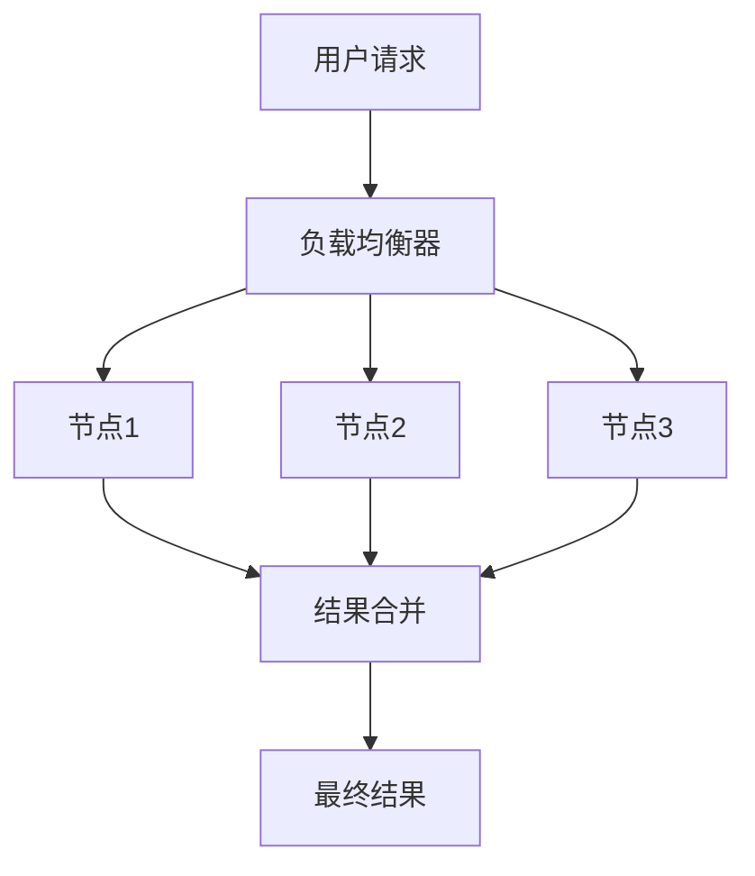

# 电商重要活动技术保障：高并发的峰值系统问题解决

## 1.背景介绍

在电商平台上，重要活动如“双十一”、“黑色星期五”等促销活动期间，网站流量会急剧增加，系统需要处理大量的并发请求。这种高并发的峰值流量对系统的稳定性和性能提出了极高的要求。如果处理不当，可能会导致系统崩溃、用户体验差、订单丢失等严重问题。因此，如何在高并发情况下保障系统的稳定性和性能成为了电商平台技术团队的核心任务。

## 2.核心概念与联系

### 2.1 高并发

高并发是指系统在同一时间内处理大量请求的能力。高并发系统需要具备高吞吐量、低延迟和高可用性。

### 2.2 峰值流量

峰值流量是指在特定时间段内，系统所需处理的最大请求量。电商活动期间的峰值流量通常是平时的数倍甚至数十倍。

### 2.3 分布式系统

分布式系统是指将计算任务分散到多个独立的计算节点上，以提高系统的处理能力和可靠性。分布式系统是应对高并发的关键技术之一。

### 2.4 缓存

缓存是指将频繁访问的数据存储在高速存储介质中，以减少数据库的访问压力，提高系统响应速度。

### 2.5 限流

限流是指通过限制单位时间内的请求数量，防止系统过载，保障系统的稳定性。

### 2.6 熔断

熔断是指在检测到系统异常时，自动中断部分请求，以防止故障蔓延，保护系统的整体稳定性。

## 3.核心算法原理具体操作步骤

### 3.1 分布式系统架构设计

分布式系统架构设计是应对高并发的基础。通过将计算任务分散到多个节点上，可以提高系统的处理能力和可靠性。以下是分布式系统架构设计的具体步骤：

1. **任务分解**：将复杂的计算任务分解为多个独立的子任务。
2. **节点分配**：将子任务分配到不同的计算节点上。
3. **任务调度**：通过任务调度算法，合理分配计算资源，确保各节点负载均衡。
4. **结果合并**：将各节点的计算结果合并，得到最终结果。

### 3.2 缓存策略

缓存策略是提高系统响应速度的重要手段。常见的缓存策略包括：

1. **本地缓存**：将频繁访问的数据存储在本地内存中，减少数据库访问。
2. **分布式缓存**：将缓存数据分布到多个节点上，提高缓存的可用性和扩展性。
3. **缓存更新策略**：通过设置缓存过期时间、主动更新缓存等方式，确保缓存数据的实时性和准确性。

### 3.3 限流算法

限流算法是防止系统过载的重要手段。常见的限流算法包括：

1. **令牌桶算法**：通过令牌的生成和消耗，控制请求的速率。
2. **漏桶算法**：通过固定速率的漏水过程，控制请求的速率。
3. **滑动窗口算法**：通过滑动时间窗口，统计单位时间内的请求数量，控制请求的速率。

### 3.4 熔断机制

熔断机制是保护系统稳定性的重要手段。常见的熔断机制包括：

1. **熔断器**：通过监控系统的健康状态，自动中断部分请求，防止故障蔓延。
2. **降级策略**：在系统负载过高时，自动降级部分功能，保障核心功能的正常运行。

## 4.数学模型和公式详细讲解举例说明

### 4.1 分布式系统的负载均衡模型

在分布式系统中，负载均衡是确保各节点负载均衡的重要手段。常见的负载均衡算法包括：

1. **轮询算法**：将请求依次分配到各节点上，确保各节点负载均衡。
2. **加权轮询算法**：根据各节点的处理能力，设置不同的权重，将请求按权重分配到各节点上。
3. **一致性哈希算法**：通过哈希函数，将请求分配到特定的节点上，确保请求的均匀分布。

### 4.2 缓存命中率模型

缓存命中率是衡量缓存效果的重要指标。缓存命中率的计算公式为：

$$
\text{缓存命中率} = \frac{\text{缓存命中次数}}{\text{总访问次数}}
$$

通过提高缓存命中率，可以减少数据库访问，提高系统响应速度。

### 4.3 限流算法的数学模型

限流算法的数学模型如下：

1. **令牌桶算法**：令牌桶算法通过令牌的生成和消耗，控制请求的速率。令牌桶的容量为 $C$，令牌生成速率为 $R$，请求的速率为 $Q$。当 $Q \leq R$ 时，请求可以通过；当 $Q > R$ 时，请求被拒绝。

2. **漏桶算法**：漏桶算法通过固定速率的漏水过程，控制请求的速率。漏桶的容量为 $C$，漏水速率为 $R$，请求的速率为 $Q$。当 $Q \leq R$ 时，请求可以通过；当 $Q > R$ 时，请求被拒绝。

3. **滑动窗口算法**：滑动窗口算法通过滑动时间窗口，统计单位时间内的请求数量，控制请求的速率。时间窗口的大小为 $W$，请求的数量为 $N$。当 $N \leq W$ 时，请求可以通过；当 $N > W$ 时，请求被拒绝。

## 5.项目实践：代码实例和详细解释说明

### 5.1 分布式系统架构设计

以下是一个简单的分布式系统架构设计示例：



### 5.2 缓存策略

以下是一个简单的缓存策略示例：

```python
import time

class Cache:
    def __init__(self, expiration_time):
        self.cache = {}
        self.expiration_time = expiration_time

    def get(self, key):
        if key in self.cache and time.time() - self.cache[key][1] < self.expiration_time:
            return self.cache[key][0]
        else:
            return None

    def set(self, key, value):
        self.cache[key] = (value, time.time())

# 使用示例
cache = Cache(expiration_time=60)
cache.set('key1', 'value1')
print(cache.get('key1'))  # 输出: value1
time.sleep(61)
print(cache.get('key1'))  # 输出: None
```

### 5.3 限流算法

以下是一个简单的令牌桶算法示例：

```python
import time
import threading

class TokenBucket:
    def __init__(self, capacity, rate):
        self.capacity = capacity
        self.rate = rate
        self.tokens = capacity
        self.lock = threading.Lock()
        self.last_time = time.time()

    def get_token(self):
        with self.lock:
            current_time = time.time()
            elapsed_time = current_time - self.last_time
            self.tokens = min(self.capacity, self.tokens + elapsed_time * self.rate)
            self.last_time = current_time
            if self.tokens >= 1:
                self.tokens -= 1
                return True
            else:
                return False

# 使用示例
bucket = TokenBucket(capacity=10, rate=1)
for _ in range(15):
    if bucket.get_token():
        print("Request allowed")
    else:
        print("Request denied")
    time.sleep(0.5)
```

### 5.4 熔断机制

以下是一个简单的熔断器示例：

```python
import time

class CircuitBreaker:
    def __init__(self, failure_threshold, recovery_time):
        self.failure_threshold = failure_threshold
        self.recovery_time = recovery_time
        self.failure_count = 0
        self.last_failure_time = 0
        self.state = 'CLOSED'

    def call(self, func, *args, **kwargs):
        if self.state == 'OPEN':
            if time.time() - self.last_failure_time > self.recovery_time:
                self.state = 'HALF_OPEN'
            else:
                raise Exception("Circuit is open")

        try:
            result = func(*args, **kwargs)
            self.failure_count = 0
            self.state = 'CLOSED'
            return result
        except Exception as e:
            self.failure_count += 1
            self.last_failure_time = time.time()
            if self.failure_count >= self.failure_threshold:
                self.state = 'OPEN'
            raise e

# 使用示例
def unreliable_function():
    if time.time() % 2 < 1:
        raise Exception("Function failed")
    return "Success"

breaker = CircuitBreaker(failure_threshold=3, recovery_time=5)
for _ in range(10):
    try:
        print(breaker.call(unreliable_function))
    except Exception as e:
        print(e)
    time.sleep(1)
```

## 6.实际应用场景

### 6.1 电商促销活动

在电商促销活动期间，系统需要处理大量的并发请求。通过分布式系统架构设计、缓存策略、限流算法和熔断机制，可以有效应对高并发的峰值流量，保障系统的稳定性和性能。

### 6.2 在线教育平台

在在线教育平台上，直播课程、在线考试等场景也会出现高并发的峰值流量。通过合理的系统架构设计和优化，可以提高系统的处理能力和用户体验。

### 6.3 金融交易系统

在金融交易系统中，高并发的交易请求对系统的稳定性和性能提出了极高的要求。通过分布式系统架构设计、缓存策略、限流算法和熔断机制，可以保障系统的稳定性和安全性。

## 7.工具和资源推荐

### 7.1 分布式系统工具

- **Apache Kafka**：高吞吐量的分布式消息系统，适用于实时数据流处理。
- **Apache Zookeeper**：分布式协调服务，用于管理分布式系统中的配置和同步。

### 7.2 缓存工具

- **Redis**：高性能的分布式缓存系统，支持多种数据结构。
- **Memcached**：简单高效的分布式缓存系统，适用于缓存频繁访问的数据。

### 7.3 限流工具

- **Guava RateLimiter**：Google Guava库中的限流工具，基于令牌桶算法实现。
- **Hystrix**：Netflix开源的熔断器和限流工具，适用于分布式系统中的故障隔离和容错处理。

### 7.4 熔断工具

- **Resilience4j**：轻量级的熔断器和限流工具，支持多种熔断策略和限流算法。
- **Sentinel**：阿里巴巴开源的流量控制和熔断工具，适用于微服务架构中的流量管理和故障隔离。

## 8.总结：未来发展趋势与挑战

随着互联网技术的不断发展，高并发系统的设计和优化将面临更多的挑战和机遇。未来的发展趋势包括：

1. **微服务架构**：通过将系统拆分为多个独立的服务，提高系统的扩展性和灵活性。
2. **无服务器架构**：通过无服务器计算平台，自动管理计算资源，提高系统的弹性和可用性。
3. **智能调度算法**：通过机器学习和人工智能技术，优化任务调度和资源分配，提高系统的效率和性能。

然而，高并发系统的设计和优化也面临诸多挑战，如数据一致性、故障容错、性能瓶颈等。技术团队需要不断探索和创新，才能应对这些挑战，保障系统的稳定性和性能。

## 9.附录：常见问题与解答

### 9.1 如何提高缓存命中率？

提高缓存命中率的方法包括：

1. **合理设置缓存过期时间**：根据数据的访问频率和变化情况，合理设置缓存过期时间，确保缓存数据的实时性和准确性。
2. **优化缓存策略**：根据业务需求，选择合适的缓存策略，如本地缓存、分布式缓存等。
3. **减少缓存穿透**：通过设置缓存空值、使用布隆过滤器等方法，减少缓存穿透，提高缓存命中率。

### 9.2 如何选择合适的限流算法？

选择合适的限流算法需要考虑以下因素：

1. **请求的速率和波动情况**：根据请求的速率和波动情况，选择合适的限流算法，如令牌桶算法、漏桶算法等。
2. **系统的处理能力和负载情况**：根据系统的处理能力和负载情况，设置合适的限流参数，如令牌桶的容量、漏桶的速率等。
3. **业务需求和用户体验**：根据业务需求和用户体验，选择合适的限流策略，如限流后的处理方式、限流的优先级等。

### 9.3 如何应对分布式系统中的数据一致性问题？

应对分布式系统中的数据一致性问题的方法包括：

1. **使用分布式事务**：通过分布式事务管理工具，如XA、TCC等，确保数据的一致性和完整性。
2. **采用最终一致性策略**：通过异步复制、事件驱动等方式，确保数据的最终一致性。
3. **使用一致性哈希算法**：通过一致性哈希算法，将数据分布到不同的节点上，确保数据的一致性和均匀分布。

作者：禅与计算机程序设计艺术 / Zen and the Art of Computer Programming