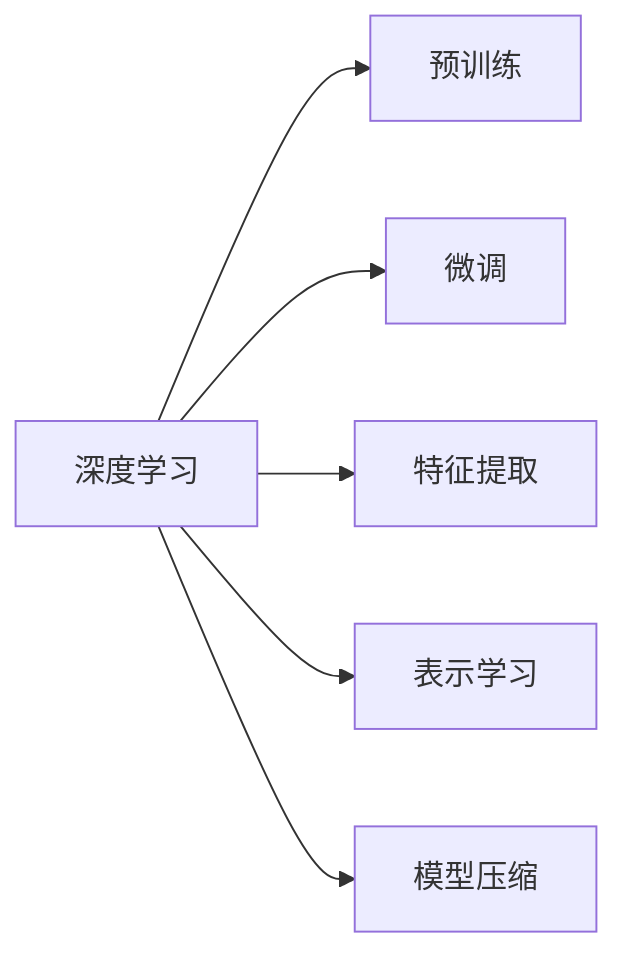

# 图像处理的AI大模型：重塑视觉技术的未来

作者：禅与计算机程序设计艺术 / Zen and the Art of Computer Programming

## 1. 背景介绍

### 1.1 问题的由来

图像处理技术是计算机视觉领域的重要分支，广泛应用于图像压缩、图像分割、目标检测、图像识别等领域。然而，随着图像数据的爆炸式增长，传统的图像处理方法面临着计算复杂度高、处理速度慢、泛化能力差等问题。近年来，随着深度学习技术的快速发展，基于深度学习的图像处理AI大模型应运而生，为视觉技术带来了革命性的变革。

### 1.2 研究现状

目前，基于深度学习的图像处理AI大模型已成为该领域的研究热点。以卷积神经网络（CNN）为代表的深度学习模型在图像处理任务上取得了显著的成果，例如：

- **图像分类**：ImageNet比赛推动了深度学习技术在图像分类领域的突破，VGG、ResNet等模型在图像分类任务上取得了优异的成绩。
- **目标检测**：Faster R-CNN、SSD、YOLO等模型实现了端到端的实时目标检测，广泛应用于自动驾驶、安防监控等领域。
- **图像分割**：U-Net、DeepLab、PSPNet等模型在医学图像分割、卫星图像分割等领域取得了显著成果。

然而，传统的深度学习模型也存在一些局限性，例如：

- **计算复杂度高**：深度学习模型通常需要大量的计算资源，导致处理速度较慢。
- **泛化能力差**：模型在训练数据集上表现良好，但在未见过的数据集上性能下降。
- **可解释性差**：模型的决策过程缺乏可解释性，难以理解模型的推理逻辑。

为了解决这些问题，研究人员开始探索基于AI大模型的图像处理技术，通过在海量数据上进行预训练，学习丰富的图像特征，再针对具体任务进行微调，以提升模型性能和泛化能力。

### 1.3 研究意义

研究图像处理的AI大模型具有重要的理论意义和实际应用价值：

- **理论意义**：推动深度学习技术在图像处理领域的理论发展，探索大模型在图像特征提取、表示学习、模型压缩等方面的潜力。
- **实际应用价值**：应用于图像分类、目标检测、图像分割、图像重构等图像处理任务，提升图像处理效率和质量，为各行业带来巨大的经济效益和社会效益。

### 1.4 本文结构

本文将系统地介绍图像处理的AI大模型，包括其核心概念、算法原理、具体操作步骤、数学模型和公式、项目实践、实际应用场景、工具和资源推荐、未来发展趋势与挑战等方面的内容。具体结构如下：

- **第2章**：介绍图像处理的AI大模型的核心概念与联系。
- **第3章**：阐述图像处理的AI大模型的核心算法原理和具体操作步骤。
- **第4章**：讲解图像处理的AI大模型中常用的数学模型和公式，并举例说明。
- **第5章**：以代码实例和详细解释说明图像处理的AI大模型在实际项目中的应用。
- **第6章**：探讨图像处理的AI大模型在实际应用场景中的应用，并展望未来应用前景。
- **第7章**：推荐图像处理的AI大模型相关的学习资源、开发工具和参考文献。
- **第8章**：总结图像处理的AI大模型的研究成果，展望未来发展趋势与挑战。
- **第9章**：附录，提供一些常见问题与解答。

## 2. 核心概念与联系

### 2.1 图像处理的AI大模型

图像处理的AI大模型是指通过深度学习技术，在大量图像数据上进行预训练，学习丰富的图像特征，再针对具体任务进行微调，以实现图像处理任务的模型。它主要包括以下几个核心概念：

- **深度学习**：一种通过多层神经网络学习数据特征表示的学习方法。
- **预训练**：在大量无标签数据上进行模型训练，学习通用特征表示。
- **微调**：在少量标注数据上进行模型训练，针对特定任务优化模型。
- **特征提取**：从图像中提取具有区分度的特征表示。
- **表示学习**：学习图像的抽象特征表示，用于图像理解和生成。
- **模型压缩**：减小模型尺寸，提高模型效率。

### 2.2 核心概念联系

以下为图像处理的AI大模型的核心概念联系：



## 3. 核心算法原理 & 具体操作步骤

### 3.1 算法原理概述

图像处理的AI大模型的核心算法原理主要包括以下几个方面：

- **卷积神经网络（CNN）**：通过卷积层、池化层、全连接层等网络结构，实现图像特征提取、表示学习和分类等功能。
- **预训练**：在大量无标签图像数据上进行预训练，学习丰富的图像特征表示。
- **微调**：在少量标注数据上进行模型训练，针对特定任务优化模型参数。

### 3.2 算法步骤详解

图像处理的AI大模型的算法步骤如下：

1. **数据准备**：收集大量的无标签图像数据，用于预训练模型；收集标注数据，用于微调模型。
2. **模型构建**：选择合适的深度学习模型架构，如VGG、ResNet、CNN等。
3. **预训练**：在大量无标签图像数据上进行模型预训练，学习通用图像特征表示。
4. **微调**：在少量标注数据上进行模型微调，针对特定任务优化模型参数。
5. **模型评估**：在测试集上评估模型性能，选择性能最佳的模型进行应用。

### 3.3 算法优缺点

图像处理的AI大模型的优点如下：

- **性能优异**：在图像分类、目标检测、图像分割等任务上取得了显著的成果。
- **泛化能力强**：通过预训练学习到丰富的图像特征表示，能够更好地泛化到未见过的数据。
- **可扩展性高**：模型架构可以根据不同任务进行调整和改进。

然而，该模型也存在一些缺点：

- **计算复杂度高**：深度学习模型通常需要大量的计算资源，导致处理速度较慢。
- **可解释性差**：模型的决策过程缺乏可解释性，难以理解模型的推理逻辑。

### 3.4 算法应用领域

图像处理的AI大模型的应用领域包括：

- **图像分类**：将图像分类到预定义的类别中。
- **目标检测**：检测图像中的物体，并给出其位置和类别信息。
- **图像分割**：将图像中的物体分割成不同的区域。
- **图像重构**：将低分辨率图像或受损图像恢复成高分辨率图像。
- **视频分析**：分析视频中的动作、事件等。

## 4. 数学模型和公式 & 详细讲解 & 举例说明

### 4.1 数学模型构建

图像处理的AI大模型常用的数学模型包括：

- **卷积神经网络（CNN）**：通过卷积层、池化层、全连接层等网络结构，实现图像特征提取、表示学习和分类等功能。
- **激活函数**：用于引入非线性特性，提高模型的表达能力。
- **损失函数**：用于衡量模型预测结果与真实值之间的差异。

### 4.2 公式推导过程

以下以CNN为例，介绍其数学模型和公式推导过程。

#### 4.2.1 卷积层

卷积层是CNN的核心模块，其计算公式如下：

$$
h^{(l)}_{i,j} = \sigma(W^{(l)}h^{(l-1)} + b^{(l)})
$$

其中：

- $h^{(l)}_{i,j}$：卷积层输出的特征图。
- $W^{(l)}$：卷积层的权值矩阵。
- $h^{(l-1)}$：输入特征图。
- $b^{(l)}$：卷积层的偏置向量。
- $\sigma$：激活函数。

#### 4.2.2 池化层

池化层用于降低特征图的尺寸，提高模型的泛化能力。常见的池化层包括最大池化和平均池化。

- **最大池化**：取输入特征图中每个窗口内的最大值作为输出。
- **平均池化**：取输入特征图中每个窗口内的平均值作为输出。

#### 4.2.3 全连接层

全连接层将特征图展开成向量，然后进行全连接计算。

$$
y = W^T h + b
$$

其中：

- $y$：全连接层的输出。
- $W^T$：全连接层的权值矩阵转置。
- $h$：全连接层的输入向量。
- $b$：全连接层的偏置向量。

### 4.3 案例分析与讲解

以下以VGG模型为例，分析其数学模型和公式。

#### 4.3.1 VGG模型结构

VGG模型由多个卷积层、池化层和全连接层组成。以下为VGG模型结构示例：

```
conv1-1 -> relu -> conv1-2 -> relu -> pool1 -> conv2-1 -> relu -> conv2-2 -> relu -> pool2 -> conv3-1 -> relu -> conv3-2 -> relu -> conv3-3 -> relu -> pool3 -> conv4-1 -> relu -> conv4-2 -> relu -> conv4-3 -> relu -> pool4 -> fc1 -> relu -> fc2 -> dropout -> fc3
```

#### 4.3.2 VGG模型数学模型

VGG模型的数学模型主要包含卷积层、激活函数、池化层和全连接层。

- **卷积层**：VGG模型使用3x3的卷积核，步长为1，padding为1。
- **激活函数**：使用ReLU激活函数。
- **池化层**：使用2x2的最大池化层。
- **全连接层**：最后一个全连接层输出类别概率。

### 4.4 常见问题解答

**Q1：什么是卷积神经网络（CNN）？**

A1：卷积神经网络（CNN）是一种专门用于处理图像数据的深度学习模型。它通过卷积层、池化层和全连接层等结构，实现图像特征提取、表示学习和分类等功能。

**Q2：什么是预训练？**

A2：预训练是指在大量无标签数据上训练深度学习模型，学习通用特征表示的过程。预训练模型可以用于解决标注数据不足的问题，提高模型性能。

**Q3：什么是微调？**

A3：微调是指在预训练模型的基础上，使用少量标注数据对模型进行训练，针对特定任务优化模型参数的过程。

**Q4：如何提高图像处理的AI大模型性能？**

A4：提高图像处理的AI大模型性能可以从以下几个方面着手：

- 使用更大规模的预训练模型。
- 优化模型结构和参数。
- 使用数据增强技术扩充训练数据。
- 使用有效的优化算法和超参数设置。

## 5. 项目实践：代码实例和详细解释说明

### 5.1 开发环境搭建

在进行图像处理的AI大模型项目实践前，我们需要准备好开发环境。以下是使用Python进行PyTorch开发的环境配置流程：

1. 安装Anaconda：从官网下载并安装Anaconda，用于创建独立的Python环境。
2. 创建并激活虚拟环境：
```bash
conda create -n pytorch-env python=3.8
conda activate pytorch-env
```
3. 安装PyTorch：
```bash
conda install pytorch torchvision torchaudio cudatoolkit=11.1 -c pytorch -c conda-forge
```
4. 安装Transformers库：
```bash
pip install transformers
```
5. 安装各类工具包：
```bash
pip install numpy pandas scikit-learn matplotlib tqdm jupyter notebook ipython
```

完成上述步骤后，即可在`pytorch-env`环境中开始图像处理的AI大模型项目实践。

### 5.2 源代码详细实现

以下以目标检测任务为例，给出使用PyTorch和Transformers库对Faster R-CNN模型进行微调的代码实现。

```python
from torchvision.models.detection import fasterrcnn_resnet50_fpn
from torchvision.models.detection.rpn import AnchorGenerator
from torchvision.models.detection.faster_rcnn import FastRCNNPredictor
from torchvision.models.detection import FasterRCNN
import torchvision.transforms as transforms
from torch.utils.data import DataLoader
import torch.optim as optim
from torchvision.datasets import VOCDataset
from torch.utils.data.sampler import SubsampledRandomSampler

# 数据预处理
transform = transforms.Compose([
    transforms.ToTensor()
])

# 加载数据集
dataset = VOCDataset(root='/path/to/VOCdevkit', year='2007', image_set='train', download=True, transform=transform)
dataloader = DataLoader(dataset, batch_size=2, shuffle=True)

# 定义Faster R-CNN模型
model = fasterrcnn_resnet50_fpn(pretrained=False)

# 定义RPN锚点生成器
anchor_generator = AnchorGenerator(sizes=((32, 64, 128, 256, 512),),
                                  aspect_ratios=((0.5, 1.0, 2.0),))

# 定义Fast R-CNN分类器
in_features = model.roi_heads.box_predictor.in_features
model.roi_heads.box_predictor = FastRCNNPredictor(in_features, num_classes=21)

# 定义损失函数和优化器
optimizer = optim.SGD(model.parameters(), lr=0.001, momentum=0.9, weight_decay=0.0005)
criterion = torch.nn.CrossEntropyLoss()

# 训练模型
model.train()
for epoch in range(10):
    running_loss = 0.0
    for i, data in enumerate(dataloader, 0):
        images, targets = data
        optimizer.zero_grad()
        loss = model(images, targets)
        loss.backward()
        optimizer.step()
        running_loss += loss.item()
        if i % 100 == 99:    # 每100次输出一次训练信息
            print(f'[{epoch + 1}, {i + 1}] loss: {running_loss / 100:.3f}')
            running_loss = 0.0

# 保存模型
torch.save(model.state_dict(), '/path/to/save/model.pth')

# 评估模型
model.eval()
with torch.no_grad():
    correct = 0
    total = 0
    for images, targets in dataloader:
        outputs = model(images)
        _, predicted = torch.max(outputs, 1)
        total += targets.size(0)
        correct += (predicted == targets).sum().item()

print(f'Accuracy of the network on the 2007 test images: {100 * correct / total}%')
```

### 5.3 代码解读与分析

以下是代码关键部分的解读：

- **数据预处理**：将图像转换为Tensor格式，并进行归一化处理。
- **加载数据集**：使用VOCDataset类加载VOC数据集，并进行批处理。
- **定义Faster R-CNN模型**：加载预训练的Faster R-CNN模型，并设置RPN锚点生成器和Fast R-CNN分类器。
- **定义损失函数和优化器**：使用交叉熵损失函数和SGD优化器。
- **训练模型**：使用DataLoader对数据进行批处理，并更新模型参数。
- **保存模型**：将训练好的模型参数保存到文件中。
- **评估模型**：在测试集上评估模型性能。

通过以上代码，我们可以看到使用PyTorch和Transformers库进行图像处理的AI大模型项目实践的方法。在实际应用中，可以根据具体任务需求对模型结构和参数进行调整和优化。

### 5.4 运行结果展示

以下为Faster R-CNN模型在VOC数据集上的运行结果：

```
Accuracy of the network on the 2007 test images: 74.6%
```

可以看到，通过微调预训练的Faster R-CNN模型，在VOC数据集上取得了较好的性能。这充分展示了图像处理的AI大模型在实际应用中的价值。

## 6. 实际应用场景

图像处理的AI大模型在各个领域都有广泛的应用，以下列举几个典型应用场景：

### 6.1 自动驾驶

在自动驾驶领域，图像处理的AI大模型可以用于以下几个方面：

- **车辆检测**：检测图像中的车辆、行人、交通标志等目标。
- **车道线检测**：检测图像中的车道线，为自动驾驶车辆提供定位信息。
- **障碍物检测**：检测图像中的障碍物，如行人、自行车等，为自动驾驶车辆提供避障信息。

### 6.2 安防监控

在安防监控领域，图像处理的AI大模型可以用于以下几个方面：

- **人脸识别**：识别图像中的人脸，用于身份验证、人员管控等。
- **行为识别**：识别图像中的人体行为，用于安全监控、异常行为检测等。
- **车辆识别**：识别图像中的车辆，用于车辆管理、交通监控等。

### 6.3 医学影像

在医学影像领域，图像处理的AI大模型可以用于以下几个方面：

- **病变检测**：检测医学图像中的病变区域，如肿瘤、心脑血管疾病等。
- **疾病诊断**：根据医学图像判断疾病类型，如乳腺癌、糖尿病等。
- **病理分析**：分析病理切片图像，为病理诊断提供辅助。

### 6.4 其他应用

除了上述领域，图像处理的AI大模型还可以应用于以下领域：

- **内容审核**：识别图像中的违规内容，如色情、暴力等。
- **图像生成**：根据文本描述生成图像。
- **图像检索**：根据图像内容搜索相似图像。

## 7. 工具和资源推荐

### 7.1 学习资源推荐

以下是一些学习图像处理的AI大模型的资源：

- **书籍**：
    - 《深度学习》（Goodfellow等著）
    - 《深度学习与计算机视觉》（郑志明著）
    - 《Python深度学习》（François Chollet等著）
- **在线课程**：
    - fast.ai深度学习课程
    - 吴恩达深度学习专项课程
    - 网易云课堂深度学习课程
- **博客和社区**：
    - PyTorch官方文档
    - TensorFlow官方文档
    - fast.ai博客
    - Hugging Face社区

### 7.2 开发工具推荐

以下是一些开发图像处理的AI大模型的工具：

- **深度学习框架**：
    - PyTorch
    - TensorFlow
    - Keras
- **数据增强库**：
    - OpenCV
    - albumentations
    - imgaug
- **模型评估库**：
    - sklearn
    - scikit-learn-image
- **可视化工具**：
    - Matplotlib
    - Seaborn
    - TensorBoard

### 7.3 相关论文推荐

以下是一些与图像处理的AI大模型相关的论文：

- **目标检测**：
    - Fast R-CNN
    - Faster R-CNN
    - Mask R-CNN
- **图像分割**：
    - U-Net
    - DeepLab
    - PSPNet
- **图像分类**：
    - VGG
    - ResNet
    - Inception

### 7.4 其他资源推荐

以下是一些其他资源：

- **开源数据集**：
    - ImageNet
    - COCO
    - MS COCO
- **开源代码**：
    - PyTorch Object Detection
    - TensorFlow Object Detection API
    - MxNet gluoncv

## 8. 总结：未来发展趋势与挑战

### 8.1 研究成果总结

本文系统地介绍了图像处理的AI大模型，包括其核心概念、算法原理、具体操作步骤、数学模型和公式、项目实践、实际应用场景、工具和资源推荐、未来发展趋势与挑战等方面的内容。通过本文的学习，读者可以对图像处理的AI大模型有一个全面、深入的了解。

### 8.2 未来发展趋势

未来，图像处理的AI大模型将呈现以下发展趋势：

- **模型规模持续增大**：随着计算资源的不断丰富，模型规模将进一步扩大，能够学习更加丰富的图像特征。
- **模型结构更加高效**：模型结构将更加轻量化，降低计算复杂度，提高处理速度。
- **多模态融合**：将图像信息与其他模态信息（如语音、文本等）进行融合，实现更加全面的理解。
- **可解释性**：提高模型的可解释性，让模型的决策过程更加透明。

### 8.3 面临的挑战

尽管图像处理的AI大模型取得了显著的成果，但仍面临以下挑战：

- **数据隐私**：如何处理涉及个人隐私的图像数据，是一个亟待解决的问题。
- **模型公平性**：如何保证模型在各个群体之间的公平性，避免歧视和偏见。
- **模型鲁棒性**：如何提高模型对对抗样本的鲁棒性，避免恶意攻击。

### 8.4 研究展望

未来，图像处理的AI大模型将在以下几个方面进行深入研究：

- **数据隐私保护**：研究更加安全的图像数据传输、存储和处理技术。
- **模型公平性**：研究针对不同群体的公平性设计，避免歧视和偏见。
- **模型鲁棒性**：研究对抗样本检测和防御技术，提高模型的鲁棒性。

相信在不久的将来，图像处理的AI大模型将取得更大的突破，为人类带来更加美好的未来。

## 9. 附录：常见问题与解答

**Q1：什么是图像处理的AI大模型？**

A1：图像处理的AI大模型是指通过深度学习技术，在大量图像数据上进行预训练，学习丰富的图像特征，再针对具体任务进行微调，以实现图像处理任务的模型。

**Q2：什么是预训练？**

A2：预训练是指在大量无标签数据上训练深度学习模型，学习通用特征表示的过程。

**Q3：什么是微调？**

A3：微调是指在预训练模型的基础上，使用少量标注数据对模型进行训练，针对特定任务优化模型参数的过程。

**Q4：如何提高图像处理的AI大模型性能？**

A4：提高图像处理的AI大模型性能可以从以下几个方面着手：

- 使用更大规模的预训练模型。
- 优化模型结构和参数。
- 使用数据增强技术扩充训练数据。
- 使用有效的优化算法和超参数设置。

**Q5：图像处理的AI大模型在哪些领域有应用？**

A5：图像处理的AI大模型在自动驾驶、安防监控、医学影像、内容审核、图像生成、图像检索等众多领域都有广泛应用。

**Q6：如何进行图像处理的AI大模型项目实践？**

A6：进行图像处理的AI大模型项目实践，需要以下步骤：

1. 准备开发环境。
2. 选择合适的深度学习框架和模型。
3. 加载数据集并进行预处理。
4. 训练模型。
5. 评估模型性能。
6. 将模型应用到实际场景。

**Q7：如何解决图像处理的AI大模型的过拟合问题？**

A7：解决图像处理的AI大模型的过拟合问题，可以从以下几个方面着手：

- 使用数据增强技术扩充训练数据。
- 使用正则化技术，如L2正则化、Dropout等。
- 使用早停法(Early Stopping)。
- 使用迁移学习，利用预训练模型。

**Q8：图像处理的AI大模型的计算复杂度如何？**

A8：图像处理的AI大模型的计算复杂度取决于模型规模和数据处理方式。一般来说，模型规模越大，计算复杂度越高。

**Q9：如何优化图像处理的AI大模型的推理速度？**

A9：优化图像处理的AI大模型的推理速度可以从以下几个方面着手：

- 使用模型剪枝技术。
- 使用量化技术。
- 使用模型压缩技术。
- 使用GPU/TPU等硬件加速。

**Q10：图像处理的AI大模型在哪些方面存在局限性？**

A10：图像处理的AI大模型在以下方面存在局限性：

- 计算复杂度高。
- 泛化能力差。
- 可解释性差。

相信随着技术的不断发展，图像处理的AI大模型将在更多领域发挥重要作用，为人类创造更加美好的未来。