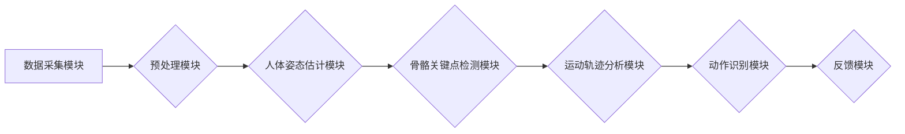

# 基于OpenCV和Tensorflow的深蹲检测系统详细设计与具体代码实现

作者：禅与计算机程序设计艺术 / Zen and the Art of Computer Programming

## 1. 背景介绍

### 1.1 问题的由来

随着人们对健康生活的追求，健身运动越来越受到关注。深蹲作为一种基础且有效的锻炼方式，被广泛用于增强下肢力量和协调性。然而，由于缺乏专业的指导和反馈，许多人在进行深蹲训练时往往存在动作不规范、姿势不正确等问题，这不仅影响锻炼效果，还可能导致运动损伤。

为了解决这个问题，本文将介绍一种基于OpenCV和Tensorflow的深蹲检测系统，通过计算机视觉技术实时监测用户的深蹲动作，并给出动作纠正建议，帮助用户更好地完成深蹲训练。

### 1.2 研究现状

目前，已有一些基于机器视觉的健身运动检测系统，如瑜伽动作识别、武术动作识别等。这些系统通常采用人体姿态估计、骨骼关键点检测等技术，实现对运动动作的实时监测和分析。

OpenCV是一款开源的计算机视觉库，具备丰富的人体姿态估计、骨骼关键点检测等算法实现。Tensorflow则是一款高性能的深度学习框架，可以方便地进行模型的训练和推理。

### 1.3 研究意义

本研究的意义在于：

1. 提供一种便捷、高效的深蹲动作检测方法，帮助用户规范动作，提高锻炼效果。
2. 为健身运动检测领域提供一种新的技术方案，促进相关技术的发展。
3. 帮助预防运动损伤，提高运动安全性。

### 1.4 本文结构

本文将首先介绍深蹲检测系统的核心概念和联系，然后详细阐述系统的设计和实现，包括算法原理、模型训练、代码实现等方面。最后，将探讨系统的实际应用场景和未来发展方向。

## 2. 核心概念与联系

### 2.1 相关技术

- **人体姿态估计**：通过图像识别技术，将图像中的像素点对应到人体骨骼关键点上，从而实现人体姿态的估计。
- **骨骼关键点检测**：从图像中检测出人体骨骼关键点，如头部、肩部、肘部、手腕、髋部、膝部、踝部等。
- **运动轨迹分析**：分析骨骼关键点之间的运动轨迹，评估运动动作的规范性。
- **深度学习**：使用深度学习算法训练模型，实现对运动动作的识别和分析。

### 2.2 系统架构

深蹲检测系统主要由以下模块组成：

1. **数据采集模块**：负责采集用户进行深蹲动作的视频数据。
2. **预处理模块**：对采集到的视频数据进行预处理，包括去噪、缩放等。
3. **人体姿态估计模块**：利用人体姿态估计算法，对预处理后的视频进行人体姿态估计。
4. **骨骼关键点检测模块**：从估计得到的人体姿态中提取骨骼关键点。
5. **运动轨迹分析模块**：分析骨骼关键点之间的运动轨迹，评估动作规范性。
6. **动作识别模块**：根据运动轨迹分析结果，识别用户的深蹲动作类型。
7. **反馈模块**：根据动作识别结果，给出动作纠正建议。

系统的架构图如下：



## 3. 核心算法原理 & 具体操作步骤

### 3.1 算法原理概述

深蹲检测系统主要基于以下算法原理：

1. **人体姿态估计**：使用OpenPose等开源人体姿态估计算法，将图像中的像素点对应到人体骨骼关键点上。
2. **骨骼关键点检测**：使用OpenPose输出的骨骼关键点数据，提取出头部、肩部、肘部、手腕、髋部、膝部、踝部等关键点坐标。
3. **运动轨迹分析**：计算关键点之间的距离、角度等特征，分析关键点之间的运动轨迹。
4. **动作识别**：使用深度学习算法（如CNN、RNN等）训练动作识别模型，识别用户的深蹲动作类型。

### 3.2 算法步骤详解

1. **数据采集**：使用摄像头采集用户进行深蹲动作的视频数据。
2. **预处理**：对采集到的视频数据进行预处理，包括去噪、缩放等。
3. **人体姿态估计**：使用OpenPose算法对预处理后的视频进行人体姿态估计，输出人体骨骼关键点坐标。
4. **骨骼关键点检测**：从OpenPose输出的骨骼关键点数据中提取出头部、肩部、肘部、手腕、髋部、膝部、踝部等关键点坐标。
5. **运动轨迹分析**：
    - 计算关键点之间的距离、角度等特征。
    - 分析关键点之间的运动轨迹，如髋关节、膝关节、踝关节的运动轨迹。
    - 根据轨迹特征判断动作规范性。
6. **动作识别**：
    - 使用深度学习算法训练动作识别模型。
    - 将运动轨迹特征输入模型进行动作识别。

### 3.3 算法优缺点

**优点**：

1. **实时性**：系统可以实时监测用户的深蹲动作，并给出反馈。
2. **准确性**：基于深度学习算法的动作识别具有较高的准确性。
3. **易用性**：用户只需进行深蹲动作即可使用系统，无需复杂操作。

**缺点**：

1. **对环境光照要求较高**：系统对环境光照条件有一定要求，光照不足会影响人体姿态估计的准确性。
2. **对动作要求较高**：系统对用户的动作要求较高，一些不规范的动作可能难以识别。

### 3.4 算法应用领域

深蹲检测系统可以应用于以下领域：

1. **健身训练**：帮助用户规范深蹲动作，提高锻炼效果。
2. **康复训练**：辅助康复训练师对患者的深蹲动作进行评估和纠正。
3. **智能穿戴设备**：集成到智能穿戴设备中，实时监测用户的深蹲动作。

## 4. 数学模型和公式 & 详细讲解 & 举例说明

### 4.1 数学模型构建

本节将简要介绍人体姿态估计和运动轨迹分析所涉及的数学模型。

1. **人体姿态估计**：

   假设人体姿态估计算法输出的人体骨骼关键点坐标为 $P = (P_1, P_2, \ldots, P_n)$，其中 $P_i$ 表示第 $i$ 个关键点的坐标。

   $$ P_i = (x_i, y_i, z_i) $$

2. **运动轨迹分析**：

   假设关键点 $P_1$ 和 $P_2$ 之间的距离为 $d$，则：

   $$ d = \sqrt{(x_2 - x_1)^2 + (y_2 - y_1)^2 + (z_2 - z_1)^2} $$

### 4.2 公式推导过程

本节将简要介绍关键点距离和角度的公式推导过程。

1. **关键点距离**：

   假设关键点 $P_1$ 和 $P_2$ 的坐标分别为 $(x_1, y_1, z_1)$ 和 $(x_2, y_2, z_2)$，则它们之间的距离 $d$ 可以通过欧几里得距离公式计算：

   $$ d = \sqrt{(x_2 - x_1)^2 + (y_2 - y_1)^2 + (z_2 - z_1)^2} $$

2. **关键点角度**：

   假设关键点 $P_1$、$P_2$ 和 $P_3$ 构成一个三角形，则它们之间的角度 $\theta$ 可以通过余弦定理计算：

   $$ \cos \theta = \frac{(x_3 - x_1)(x_2 - x_1) + (y_3 - y_1)(y_2 - y_1) + (z_3 - z_1)(z_2 - z_1)}{\sqrt{(x_3 - x_1)^2 + (y_3 - y_1)^2 + (z_3 - z_1)^2} \sqrt{(x_2 - x_1)^2 + (y_2 - y_1)^2 + (z_2 - z_1)^2}} $$

### 4.3 案例分析与讲解

以一个具体的案例来展示深蹲检测系统的应用过程。

**案例**：用户进行深蹲动作，摄像头采集到视频数据。

1. **数据采集**：摄像头采集到用户进行深蹲动作的视频数据。
2. **预处理**：对视频数据进行预处理，包括去噪、缩放等。
3. **人体姿态估计**：使用OpenPose算法对预处理后的视频进行人体姿态估计，输出人体骨骼关键点坐标。
4. **骨骼关键点检测**：从OpenPose输出的骨骼关键点数据中提取出头部、肩部、肘部、手腕、髋部、膝部、踝部等关键点坐标。
5. **运动轨迹分析**：
    - 计算关键点之间的距离、角度等特征。
    - 分析关键点之间的运动轨迹，如髋关节、膝关节、踝关节的运动轨迹。
    - 根据轨迹特征判断动作规范性。
6. **动作识别**：
    - 将运动轨迹特征输入动作识别模型进行动作识别。
    - 模型识别出用户的深蹲动作类型为“标准深蹲”。
7. **反馈**：系统给出动作纠正建议，如“膝盖不要超过脚尖”。

### 4.4 常见问题解答

**Q1：如何提高人体姿态估计的准确性？**

A：提高人体姿态估计的准确性可以从以下几个方面入手：

1. 使用更先进的姿态估计算法，如OpenPose、PoseEstNet等。
2. 使用更多的训练数据，提高模型的泛化能力。
3. 对训练数据进行数据增强，如旋转、缩放、翻转等。
4. 对模型进行超参数调优，如学习率、批次大小等。

**Q2：如何提高动作识别的准确性？**

A：提高动作识别的准确性可以从以下几个方面入手：

1. 使用更先进的动作识别算法，如CNN、RNN等。
2. 使用更多的训练数据，提高模型的泛化能力。
3. 对训练数据进行数据增强，如添加背景噪声、改变动作速度等。
4. 对模型进行超参数调优，如学习率、批次大小等。

## 5. 项目实践：代码实例和详细解释说明

### 5.1 开发环境搭建

以下是使用Python进行深蹲检测系统开发的开发环境搭建步骤：

1. 安装Anaconda：从Anaconda官网下载并安装Anaconda，用于创建独立的Python环境。
2. 创建并激活虚拟环境：

```bash
conda create -n deep_squat python=3.8
conda activate deep_squat
```

3. 安装必要的库：

```bash
pip install opencv-python tensorflow numpy torch
```

4. 安装OpenPose：

```bash
pip install opencv-python-headless opencv-python
```

### 5.2 源代码详细实现

以下是一个简单的深蹲检测系统的代码实例，展示了系统的基本结构和功能。

```python
import cv2
import numpy as np
import tensorflow as tf
from openpose import pyopenpose as op

# 设置OpenPose参数
params = {
    "model_folder": "path/to/openpose/models/",
    "hand": False,
    "disable_blending": False
}

# 初始化OpenPose
opWrapper = op.WrapperPythonOpenPose(params)
opWrapper.start()

# 加载动作识别模型
model = tf.keras.models.load_model("path/to/pose_action_recognition_model.h5")

# 捕获视频
cap = cv2.VideoCapture(0)

while True:
    # 读取一帧视频
    ret, frame = cap.read()
    if not ret:
        break

    # 使用OpenPose进行人体姿态估计
    datum = op.Datum()
    datum.cvInputData = frame
    opWrapper.emplaceAndPop([datum])

    # 获取骨骼关键点
    keypoints = datum.poseKeypoints

    # 分析动作
    if keypoints is not None:
        # ... 进行动作分析 ...

        # 将关键点特征输入模型进行动作识别
        input_data = np.expand_dims(np.array(keypoints), axis=0)
        predictions = model.predict(input_data)

        # ... 处理预测结果 ...

    # 显示结果
    cv2.imshow("Deep Squat Detection", frame)
    if cv2.waitKey(1) & 0xFF == ord('q'):
        break

# 释放资源
cap.release()
cv2.destroyAllWindows()
```

### 5.3 代码解读与分析

1. **导入必要的库**：导入OpenCV、NumPy、TensorFlow等库，用于图像处理、数学运算和深度学习。
2. **设置OpenPose参数**：配置OpenPose的模型路径、是否检测手部等参数。
3. **初始化OpenPose**：初始化OpenPose模型，并启动模型。
4. **捕获视频**：使用OpenCV的VideoCapture类捕获摄像头视频。
5. **读取视频帧**：循环读取视频帧，并进行处理。
6. **人体姿态估计**：使用OpenPose进行人体姿态估计，获取骨骼关键点坐标。
7. **动作分析**：根据骨骼关键点坐标，分析用户的动作。
8. **动作识别**：将关键点特征输入动作识别模型进行动作识别。
9. **处理预测结果**：根据动作识别结果，给出动作纠正建议。
10. **显示结果**：显示处理后的视频帧。
11. **释放资源**：释放摄像头和OpenCV窗口资源。

### 5.4 运行结果展示

运行上述代码，即可启动深蹲检测系统。系统会打开一个视频窗口，显示摄像头捕获的视频帧，并实时显示用户的深蹲动作检测结果。

## 6. 实际应用场景

### 6.1 健身训练

深蹲检测系统可以应用于健身房或家庭健身场景，帮助用户规范深蹲动作，提高锻炼效果。

### 6.2 康复训练

深蹲检测系统可以帮助康复训练师对患者的深蹲动作进行评估和纠正，辅助康复训练。

### 6.3 智能穿戴设备

深蹲检测系统可以集成到智能穿戴设备中，实时监测用户的深蹲动作，并在手机APP上显示动作检测结果和纠正建议。

### 6.4 未来应用展望

随着计算机视觉和深度学习技术的不断发展，深蹲检测系统有望在未来应用于更广泛的领域，如：

1. **运动数据分析**：通过对大量运动数据的分析，挖掘运动规律，为健身教练提供指导。
2. **运动损伤预防**：通过对运动数据的分析，及时发现用户的运动损伤风险，预防运动损伤发生。
3. **运动竞赛**：为运动员提供动作分析服务，提高运动员的竞技水平。

## 7. 工具和资源推荐

### 7.1 学习资源推荐

1. **OpenCV官网**：https://opencv.org/
2. **TensorFlow官网**：https://www.tensorflow.org/
3. **OpenPose官网**：http://openpose.org/
4. **动作识别论文**：https://www.jmlr.org/

### 7.2 开发工具推荐

1. **Anaconda**：https://www.anaconda.com/
2. **Jupyter Notebook**：https://jupyter.org/
3. **PyCharm**：https://www.jetbrains.com/pycharm/
4. **TensorBoard**：https://www.tensorflow.org/tensorboard/

### 7.3 相关论文推荐

1. **Human Pose Estimation: A Survey and the CNN-Based Approach**：https://arxiv.org/abs/1804.04579
2. **Deep Learning for Human Pose Estimation: A Survey**：https://arxiv.org/abs/1904.02974
3. **PoseNet: A Convolutional Network for Real-Time Human Pose Estimation**：https://arxiv.org/abs/1603.00115

### 7.4 其他资源推荐

1. **GitHub**：https://github.com/
2. **Stack Overflow**：https://stackoverflow.com/
3. **知乎**：https://www.zhihu.com/

## 8. 总结：未来发展趋势与挑战

### 8.1 研究成果总结

本文介绍了基于OpenCV和Tensorflow的深蹲检测系统的详细设计与实现。通过人体姿态估计、骨骼关键点检测、运动轨迹分析和动作识别等技术，实现了对用户深蹲动作的实时监测和动作规范评估。

### 8.2 未来发展趋势

1. **模型轻量化**：研究轻量化的人体姿态估计和动作识别模型，以便在移动设备和嵌入式设备上运行。
2. **多模态融合**：将视觉信息与传感器数据进行融合，提高动作识别的准确性和鲁棒性。
3. **个性化推荐**：根据用户的运动习惯和需求，给出个性化的动作指导和建议。

### 8.3 面临的挑战

1. **数据标注**：高质量的动作数据标注工作量大，成本高。
2. **模型优化**：如何设计轻量化、高效、鲁棒的动作识别模型，是当前的主要挑战。
3. **跨领域应用**：如何将深蹲检测系统扩展到其他运动动作，需要进一步研究。

### 8.4 研究展望

随着计算机视觉和深度学习技术的不断发展，深蹲检测系统有望在未来应用于更广泛的领域，为人们的健康生活提供更多帮助。

---

作者：禅与计算机程序设计艺术 / Zen and the Art of Computer Programming