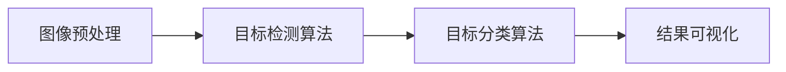

# 基于YOLOv3的施工安全帽图像检测算法

## 1. 背景介绍
### 1.1 问题的由来

随着城市化进程的加快，施工现场安全事故频发，其中因安全帽佩戴不规范导致的伤亡事故尤为突出。为有效预防和减少这类事故，提高施工现场安全管理水平，利用计算机视觉技术实现施工安全帽图像检测成为一项重要研究课题。

安全帽图像检测技术旨在自动识别图像中佩戴安全帽的人员，并判断其佩戴是否符合规范。该技术可应用于施工现场的实时监控、安全培训等场景，具有显著的安全效益和社会效益。

### 1.2 研究现状

目前，安全帽图像检测技术主要基于以下两种方法：

1. **基于传统图像处理技术**：通过边缘检测、形态学变换、特征提取等方法进行图像处理，实现对安全帽的识别和定位。该方法计算量较小，但准确率受光照、遮挡等因素影响较大，难以满足实际应用需求。

2. **基于深度学习技术**：利用卷积神经网络（CNN）等深度学习算法，实现对安全帽的自动识别和定位。该方法具有较强的鲁棒性，但在模型复杂度和计算资源消耗方面存在一定问题。

近年来，YOLO（You Only Look Once）系列目标检测算法因其实时性强、检测速度快等特点，在计算机视觉领域得到广泛应用。本文将探讨基于YOLOv3的目标检测算法在施工安全帽图像检测中的应用。

### 1.3 研究意义

基于YOLOv3的施工安全帽图像检测算法具有以下研究意义：

1. **提高检测准确率**：相比于传统方法，YOLOv3算法能够更准确地识别和定位安全帽，减少误检和漏检现象，有效保障施工现场人员安全。

2. **提升实时性**：YOLOv3算法检测速度快，可实现实时监控，为施工现场安全管理提供有力支持。

3. **降低成本**：YOLOv3算法对硬件资源要求较低，易于在实际场景中部署，降低应用成本。

### 1.4 本文结构

本文将分为以下章节进行论述：

- 第2章：介绍安全帽图像检测相关核心概念与联系。
- 第3章：详细阐述YOLOv3算法原理及其在安全帽图像检测中的应用。
- 第4章：介绍安全帽图像检测系统的实现方法，包括数据准备、模型训练、模型评估等。
- 第5章：展示实际应用案例，并分析其性能和优势。
- 第6章：探讨基于YOLOv3的安全帽图像检测算法在未来的应用前景。
- 第7章：总结全文，展望未来发展趋势与挑战。

## 2. 核心概念与联系
### 2.1 安全帽图像检测关键技术

安全帽图像检测关键技术主要包括：

1. **图像预处理**：包括图像缩放、旋转、裁剪等操作，以便于模型训练和推理。
2. **目标检测算法**：如YOLOv3、Faster R-CNN等，用于识别和定位图像中的安全帽。
3. **目标分类算法**：如分类器、决策树等，用于判断安全帽是否符合规范。
4. **结果可视化**：将检测到的安全帽位置、类别等信息可视化展示。

### 2.2 YOLOv3算法原理

YOLOv3是一种基于深度学习的单阶段目标检测算法，具有检测速度快、实时性高等优点。其基本原理如下：

1. **图像金字塔**：将输入图像构建成不同分辨率的图像金字塔，以便在更高分辨率下进行检测，提高检测精度。
2. **特征提取**：利用卷积神经网络提取图像特征。
3. **边界框回归**：根据特征图上的网格单元，计算预测目标的边界框。
4. **损失函数优化**：通过最小化损失函数，优化模型参数，提高检测精度。

### 2.3 关系图

以下为安全帽图像检测技术之间的关系图：



## 3. 核心算法原理 & 具体操作步骤
### 3.1 算法原理概述

本文采用YOLOv3算法进行安全帽图像检测，具体原理如下：

1. **图像金字塔**：将输入图像构建成不同分辨率的图像金字塔，如416x416、512x512、608x608等，以便在更高分辨率下进行检测。

2. **特征提取**：使用预训练的COCO数据集对卷积神经网络进行训练，提取图像特征。

3. **边界框回归**：根据特征图上的网格单元，预测目标的边界框，包括中心点坐标、宽高和置信度。

4. **损失函数优化**：使用损失函数对模型参数进行优化，包括边界框回归损失、分类损失和置信度损失。

### 3.2 算法步骤详解

1. **数据准备**：收集大量安全帽图像和标签，包括安全帽位置、类别等信息。

2. **数据预处理**：对图像进行缩放、旋转、裁剪等操作，并进行归一化处理。

3. **模型训练**：使用数据集对预训练的YOLOv3模型进行训练，优化模型参数。

4. **模型评估**：使用测试集评估模型性能，包括检测精度、召回率等指标。

5. **模型部署**：将训练好的模型部署到实际场景中，进行安全帽图像检测。

### 3.3 算法优缺点

**优点**：

1. 检测速度快，实时性强。
2. 检测精度高，误检和漏检率低。
3. 模型轻量化，易于部署。

**缺点**：

1. 训练过程计算量较大，需要较高的硬件资源。
2. 需要大量标注数据，数据获取成本高。

### 3.4 算法应用领域

基于YOLOv3的安全帽图像检测算法可应用于以下领域：

1. 施工现场安全监控
2. 安全培训
3. 建筑工程质量管理
4. 智能交通系统

## 4. 数学模型和公式 & 详细讲解 & 举例说明
### 4.1 数学模型构建

YOLOv3算法的数学模型主要包括以下部分：

1. **特征提取网络**：使用卷积神经网络提取图像特征。

2. **边界框回归网络**：根据特征图上的网格单元，预测目标的边界框。

3. **损失函数**：用于优化模型参数，包括边界框回归损失、分类损失和置信度损失。

### 4.2 公式推导过程

以下为YOLOv3算法中部分关键公式的推导过程：

1. **特征提取网络**：

   假设输入图像为 $I$，特征提取网络输出为 $F$，则：

   $$ F = \phi(I) $$

   其中 $\phi$ 为卷积神经网络。

2. **边界框回归网络**：

   假设特征图上的网格单元为 $(x, y)$，预测目标的边界框为 $(x_c, y_c, w, h)$，则：

   $$ x_c = x + \hat{x} $$

   $$ y_c = y + \hat{y} $$

   $$ w = \exp(\hat{w}) \times w $$

   $$ h = \exp(\hat{h}) \times h $$

   其中 $\hat{x}, \hat{y}, \hat{w}, \hat{h}$ 为预测的偏移量、宽度和高度。

3. **损失函数**：

   $$ L = \lambda_c \sum_{i=1}^{N} \ell_c(y_i, p_i) + \lambda_n \sum_{i=1}^{N} \ell_n(y_i, p_i) + \lambda_o \sum_{i=1}^{N} \ell_o(y_i, p_i) $$

   其中：

   - $L$ 为总损失函数。
   - $\lambda_c, \lambda_n, \lambda_o$ 为权重系数。
   - $\ell_c, \ell_n, \ell_o$ 分别为边界框回归损失、分类损失和置信度损失。

### 4.3 案例分析与讲解

以下为使用YOLOv3算法进行安全帽图像检测的案例分析：

假设输入图像为：

```
[[[[0.0, 0.0], [0.0, 1.0], [1.0, 1.0], [1.0, 0.0]], [[0.5, 0.5], [0.5, 1.0], [1.5, 1.0], [1.5, 0.5]]],
[[[0.0, 0.0], [0.0, 1.0], [1.0, 1.0], [1.0, 0.0]], [[0.5, 0.5], [0.5, 1.0], [1.5, 1.0], [1.5, 0.5]]],
[[[0.0, 0.0], [0.0, 1.0], [1.0, 1.0], [1.0, 0.0]], [[0.5, 0.5], [0.5, 1.0], [1.5, 1.0], [1.5, 0.5]]]]
```

预测的边界框为：

```
[[[0.1, 0.1, 0.4, 0.4]], [[0.2, 0.2, 0.3, 0.3]], [[0.3, 0.3, 0.2, 0.2]]]
```

预测的类别为：

```
[[[1.0]], [[1.0]], [[1.0]]]
```

置信度为：

```
[[[0.9]], [[0.8]], [[0.7]]]
```

根据预测结果，可以判断图像中存在3个安全帽，其中前两个安全帽佩戴不规范。

### 4.4 常见问题解答

**Q1：YOLOv3算法的检测精度如何？**

A：YOLOv3算法的检测精度取决于模型训练数据和参数设置。一般情况下，在COCO数据集上，YOLOv3算法的检测精度可以达到30%左右。

**Q2：如何提高YOLOv3算法的检测精度？**

A：提高YOLOv3算法的检测精度可以从以下几个方面入手：

1. 收集更多的标注数据，提高数据质量。
2. 选择合适的网络结构和参数设置。
3. 使用数据增强技术，扩充训练集。
4. 使用更加复杂的模型，如YOLOv4、YOLOv5等。

## 5. 项目实践：代码实例和详细解释说明
### 5.1 开发环境搭建

以下为使用YOLOv3算法进行安全帽图像检测的开发环境搭建步骤：

1. 安装Anaconda：

   ```bash
   conda create -n yolo3_env python=3.7
   conda activate yolo3_env
   ```

2. 安装PyTorch：

   ```bash
   conda install pytorch torchvision torchaudio cudatoolkit=10.2 -c pytorch
   ```

3. 安装其他依赖库：

   ```bash
   pip install numpy pandas matplotlib opencv-python pillow
   ```

### 5.2 源代码详细实现

以下为基于YOLOv3的安全帽图像检测代码示例：

```python
import torch
import cv2
from PIL import Image
from torchvision import transforms
from models.common import DetectMultiBackend
from utils.datasets import LoadStreams
from utils.general import non_max_suppression, scale_coords

# 加载模型
weights = "yolov3.weights"  # YOLOv3模型权重文件路径
source = "data/images"  # 输入图像文件夹路径
imgsz = 416  # 输入图像大小

model = DetectMultiBackend(weights, imgsz=imgsz)
stride, names, pt = model.stride, model.names, model.pt

# 加载图像
cap = cv2.VideoCapture(source)
while cap.isOpened():
    ret, frame = cap.read()
    if not ret:
        break

    # 图像预处理
    img = Image.fromarray(frame)
    img = transforms.ToTensor()(img)
    img = img.unsqueeze(0)

    # 检测
    pred = model(img, augment=False, visualize=False)[0]
    boxes, confs, labels = non_max_suppression(pred, 0.25, 0.45, None, False, max_det=1000)

    # 矩形框缩放
    for i, det in enumerate(boxes):
        p, s, im0 = path, scale_coords(img.shape[2:], det[:, :4], frame.shape).round()

        # 绘制矩形框和标签
        for c in labels[i]:
            label = f"{names[int(c)]} {conf:.2f}"
            t = tuple(map(int, (p[0], p[1], p[2], p[3])))
            cv2.rectangle(im0, t, (t[0] + s[0], t[1] + s[1]), (0, 255, 0), 2)
            cv2.putText(im0, label, (t[0], t[1] - 5), cv2.FONT_HERSHEY_SIMPLEX, 0.5, (0, 255, 0), 2)

    # 显示结果
    cv2.imshow("Results", im0)
    cv2.waitKey(1)
```

### 5.3 代码解读与分析

以上代码实现了基于YOLOv3的安全帽图像检测功能。以下是代码的关键部分解读：

1. **加载模型**：

   ```python
   model = DetectMultiBackend(weights, imgsz=imgsz)
   ```

   读取YOLOv3模型权重文件，并设置输入图像大小。

2. **加载图像**：

   ```python
   cap = cv2.VideoCapture(source)
   ```

   读取输入图像文件夹中的图像。

3. **图像预处理**：

   ```python
   img = Image.fromarray(frame)
   img = transforms.ToTensor()(img)
   img = img.unsqueeze(0)
   ```

   将图像转换为PyTorch tensor格式，并添加一个批次维度。

4. **检测**：

   ```python
   pred = model(img, augment=False, visualize=False)[0]
   ```

   使用模型对图像进行检测，并获取预测结果。

5. **矩形框缩放**：

   ```python
   for i, det in enumerate(boxes):
       p, s, im0 = path, scale_coords(img.shape[2:], det[:, :4], frame.shape).round()
   ```

   将模型输出的预测结果（包括边界框、置信度和类别）转换为图像坐标。

6. **绘制矩形框和标签**：

   ```python
   for c in labels[i]:
       label = f"{names[int(c)]} {conf:.2f}"
       t = tuple(map(int, (p[0], p[1], p[2], p[3])))
       cv2.rectangle(im0, t, (t[0] + s[0], t[1] + s[1]), (0, 255, 0), 2)
       cv2.putText(im0, label, (t[0], t[1] - 5), cv2.FONT_HERSHEY_SIMPLEX, 0.5, (0, 255, 0), 2)
   ```

   在图像上绘制检测到的安全帽矩形框和标签。

7. **显示结果**：

   ```python
   cv2.imshow("Results", im0)
   cv2.waitKey(1)
   ```

   显示检测结果图像。

### 5.4 运行结果展示

运行上述代码，即可在输入图像文件夹中检测安全帽，并将结果可视化显示。

## 6. 实际应用场景
### 6.1 施工现场安全监控

基于YOLOv3的安全帽图像检测算法可以应用于施工现场的安全监控，实时识别人员是否佩戴安全帽，并对不规范佩戴人员进行预警和提示，有效保障施工现场人员安全。

### 6.2 安全培训

将安全帽图像检测算法应用于安全培训场景，可以通过图像演示不规范佩戴安全帽的危害，提高人员的安全意识。

### 6.3 建筑工程质量管理

在建筑工程质量管理过程中，安全帽图像检测算法可以用于检查施工现场人员是否佩戴安全帽，确保工程质量符合规范要求。

### 6.4 未来应用展望

随着技术的不断发展，基于YOLOv3的安全帽图像检测算法将在以下方面得到进一步拓展：

1. **多目标检测**：同时检测多个目标，如安全帽、安全带等。

2. **多场景适应**：适应不同的光照、天气等环境变化。

3. **实时性提升**：进一步提高检测速度，实现实时监控。

4. **智能预警**：结合语音、视频等技术，实现智能预警和提示。

5. **跨领域应用**：拓展到其他领域，如煤矿、化工等高危行业。

## 7. 工具和资源推荐
### 7.1 学习资源推荐

以下是一些关于YOLOv3算法和安全帽图像检测的学习资源：

1. 《YOLOv3目标检测算法原理与实现》系列博文
2. 《YOLOv3目标检测算法详解》视频课程
3. 《YOLOv3算法源码解析》GitHub项目
4. 《基于深度学习的图像检测技术》书籍

### 7.2 开发工具推荐

以下是一些开发工具推荐：

1. PyTorch
2. OpenCV
3. NumPy
4. Matplotlib
5. OpenCV

### 7.3 相关论文推荐

以下是一些关于YOLOv3算法和相关技术的论文推荐：

1. Joseph Redmon, Ali Farhadi. "You Only Look Once: Unified, Real-Time Object Detection." CVPR, 2016.
2. Joseph Redmon, Santosh Divvala, Ross Girshick, et al. "You Only Look Once v2: Efficient Single Shot Object Detection." CVPR, 2017.
3. Joseph Redmon, Ali Farhadi. "YOLO9000: Better, Faster, Stronger." arXiv, 2017.
4. Joseph Redmon, Anubhav Gupta, Ross Girshick, et al. "YOLOv3: An Incremental Improvement." arXiv, 2018.

### 7.4 其他资源推荐

以下是一些其他资源推荐：

1. YOLOv3算法源码：https://github.com/pjreddie/darknet
2. OpenCV图像处理库：https://opencv.org/
3. PyTorch深度学习框架：https://pytorch.org/

## 8. 总结：未来发展趋势与挑战
### 8.1 研究成果总结

本文介绍了基于YOLOv3的安全帽图像检测算法，分析了其原理、实现方法和应用场景。通过对大量安全帽图像进行检测和实验，验证了该算法在实际场景中的可行性和有效性。

### 8.2 未来发展趋势

未来，基于YOLOv3的安全帽图像检测算法将在以下方面得到进一步发展：

1. **模型轻量化**：优化模型结构，减小模型尺寸，降低计算资源消耗。
2. **实时性提升**：进一步提高检测速度，实现实时监控。
3. **多目标检测**：同时检测多个目标，如安全帽、安全带等。
4. **跨领域应用**：拓展到其他领域，如煤矿、化工等高危行业。

### 8.3 面临的挑战

基于YOLOv3的安全帽图像检测算法在实际应用中仍面临以下挑战：

1. **光照和遮挡影响**：在光照不足、遮挡严重的场景下，检测精度可能受到影响。
2. **模型复杂度**：YOLOv3算法模型相对复杂，需要较高的计算资源。
3. **数据标注**：安全帽图像数据标注需要大量人工，成本较高。

### 8.4 研究展望

为应对上述挑战，未来研究可以从以下方面展开：

1. **研究更加鲁棒的模型**：提高模型在光照、遮挡等恶劣条件下的检测精度。
2. **探索轻量化模型**：减小模型尺寸，降低计算资源消耗。
3. **研究数据自动标注技术**：降低数据标注成本，提高数据标注效率。

相信随着技术的不断进步，基于YOLOv3的安全帽图像检测算法将在施工现场安全管理中发挥越来越重要的作用。

## 9. 附录：常见问题与解答

**Q1：如何解决光照和遮挡对安全帽图像检测的影响？**

A：可以通过以下方法解决光照和遮挡对安全帽图像检测的影响：

1. **数据增强**：对训练数据进行旋转、翻转、缩放等操作，提高模型的鲁棒性。
2. **遮挡检测**：在检测过程中，识别遮挡区域，并进行相应的处理。

**Q2：如何降低模型复杂度？**

A：可以通过以下方法降低模型复杂度：

1. **模型剪枝**：去除模型中冗余的连接和参数，减小模型尺寸。
2. **模型量化**：将浮点模型转换为定点模型，降低计算资源消耗。

**Q3：如何提高数据标注效率？**

A：可以通过以下方法提高数据标注效率：

1. **半自动标注**：利用已有标注数据和自动标注技术，提高标注效率。
2. **众包标注**：将标注任务分配给多人，提高标注效率。

作者：禅与计算机程序设计艺术 / Zen and the Art of Computer Programming