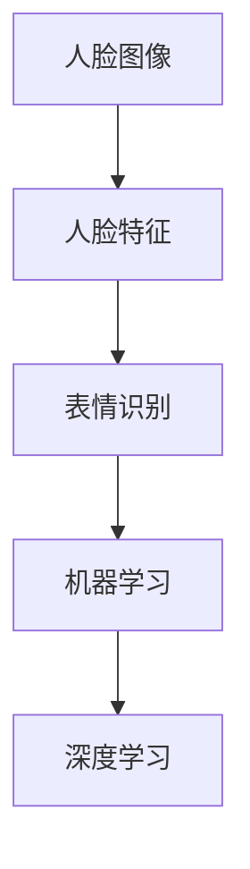

# 基于opencv 的人脸表情识别系统详细设计与具体代码实现

作者：禅与计算机程序设计艺术 / Zen and the Art of Computer Programming

## 关键词：

人脸识别，表情识别，OpenCV，机器学习，深度学习，深度神经网络，卷积神经网络，Fisherfaces，Eigenfaces

## 1. 背景介绍

### 1.1 问题的由来

随着人工智能技术的快速发展，人脸识别技术已经广泛应用于安防监控、智能门禁、移动支付、虚拟现实等领域。其中，人脸表情识别作为人脸识别的一个重要分支，对于分析人类情感、理解人类行为具有重要意义。本文将介绍一种基于OpenCV的人脸表情识别系统，并通过具体代码实现，展示如何利用机器学习和深度学习技术进行人脸表情识别。

### 1.2 研究现状

目前，人脸表情识别技术主要分为两大类：基于传统机器学习的表情识别和基于深度学习的表情识别。

**传统机器学习表情识别**：这类方法通常采用特征提取技术，如Fisherfaces、Eigenfaces等，从人脸图像中提取特征向量，然后利用支持向量机（SVM）、朴素贝叶斯等分类器进行分类。

**深度学习表情识别**：近年来，随着深度学习技术的快速发展，基于卷积神经网络（CNN）的表情识别方法取得了显著的成果。CNN能够自动从图像中提取特征，并学习到丰富的层次化特征表示，从而提高表情识别的精度。

### 1.3 研究意义

研究人脸表情识别技术，对于以下方面具有重要意义：

- 丰富人工智能技术体系，推动人工智能技术在情感计算、人机交互等领域的应用。
- 提高人脸识别系统的实用性，使其能够更好地服务于人类生活。
- 为心理学、医学等领域提供新的研究手段，有助于深入理解人类情感和行为。

### 1.4 本文结构

本文将分为以下几个部分：

- 核心概念与联系：介绍人脸表情识别涉及的基本概念和技术。
- 核心算法原理：讲解基于机器学习和深度学习的表情识别算法。
- 项目实践：给出基于OpenCV的人脸表情识别系统的具体代码实现。
- 实际应用场景：探讨人脸表情识别在实际场景中的应用。
- 工具和资源推荐：推荐学习资源、开发工具和参考文献。
- 总结：总结研究成果，展望未来发展趋势。

## 2. 核心概念与联系

为了更好地理解人脸表情识别技术，本节将介绍几个密切相关的核心概念：

- **人脸图像**：指包含人脸特征的图像，通常为灰度图或彩色图。
- **人脸特征**：指描述人脸形状和纹理等方面的特征，如人脸轮廓、纹理特征等。
- **表情识别**：指从人脸图像中识别出人脸的表情，如快乐、悲伤、愤怒等。
- **机器学习**：指通过学习数据，使计算机能够从数据中自动提取特征、学习规律、进行决策的技术。
- **深度学习**：指一种特殊的机器学习技术，使用深层神经网络（DNN）进行学习。

这些概念之间的逻辑关系如下：



可以看出，人脸图像经过特征提取后，可用于表情识别。表情识别可以使用机器学习或深度学习方法实现。其中，深度学习方法在表情识别领域取得了显著的成果。

## 3. 核心算法原理 & 具体操作步骤

### 3.1 算法原理概述

基于机器学习和深度学习的人脸表情识别算法分别如下：

**基于机器学习的表情识别算法**：

1. 特征提取：从人脸图像中提取特征向量，如Fisherfaces、Eigenfaces等。
2. 特征选择：根据特征向量的方差、冗余度等指标，选择最重要的特征向量。
3. 分类器设计：选择合适的分类器，如SVM、朴素贝叶斯等，对特征向量进行分类。

**基于深度学习的表情识别算法**：

1. 网络设计：设计合适的深度神经网络结构，如CNN、RNN等。
2. 预训练：使用大规模人脸表情数据集对网络进行预训练，学习丰富的特征表示。
3. 微调：使用标注人脸表情数据集对预训练网络进行微调，提高识别精度。

### 3.2 算法步骤详解

#### 基于机器学习的表情识别算法

1. **特征提取**：使用OpenCV库中的Haar特征分类器，从人脸图像中提取特征。
2. **特征选择**：根据特征向量的方差、冗余度等指标，选择最重要的特征向量。
3. **分类器设计**：使用SVM分类器进行人脸表情分类。

#### 基于深度学习的表情识别算法

1. **网络设计**：使用PyTorch库构建CNN网络，提取人脸图像特征。
2. **预训练**：使用大规模人脸表情数据集对网络进行预训练。
3. **微调**：使用标注人脸表情数据集对预训练网络进行微调。

### 3.3 算法优缺点

#### 基于机器学习的表情识别算法

**优点**：

- 算法简单，易于实现。
- 对计算资源要求较低。

**缺点**：

- 特征提取效果受限于特征选择和分类器设计。
- 识别精度相对较低。

#### 基于深度学习的表情识别算法

**优点**：

- 能够自动提取丰富的特征表示。
- 识别精度较高。

**缺点**：

- 算法复杂，需要大量的训练数据。
- 对计算资源要求较高。

### 3.4 算法应用领域

基于机器学习的表情识别算法适用于对实时性要求较高的场景，如人脸表情监控系统。基于深度学习的表情识别算法适用于对识别精度要求较高的场景，如智能客服系统。

## 4. 数学模型和公式 & 详细讲解 & 举例说明

### 4.1 数学模型构建

#### 基于机器学习的表情识别算法

1. **特征提取**：Haar特征分类器使用积分图技术计算图像中不同形状的区域的特征值。
2. **特征选择**：根据特征向量的方差和冗余度选择最重要的特征向量。
3. **分类器设计**：SVM分类器使用核函数将数据映射到高维空间，然后根据距离进行分类。

#### 基于深度学习的表情识别算法

1. **网络设计**：CNN网络使用卷积层、池化层、全连接层等构建。
2. **预训练**：使用大规模人脸表情数据集对网络进行预训练，学习丰富的特征表示。
3. **微调**：使用标注人脸表情数据集对预训练网络进行微调。

### 4.2 公式推导过程

#### 基于机器学习的表情识别算法

1. **特征提取**：积分图公式：
   $$
   \mathcal{I}(x,y) = \sum_{i=1}^n \sum_{j=1}^m w_{ij} \cdot f(x+i,y+j)
   $$
   其中，$x$ 和 $y$ 为图像坐标，$n$ 和 $m$ 为窗口大小，$w_{ij}$ 为窗口内像素值，$f(x+i,y+j)$ 为像素值。
2. **特征选择**：特征向量 $\mathbf{f}$ 的方差和冗余度：
   $$
   \sigma^2(\mathbf{f}) = \frac{1}{N} \sum_{i=1}^N (\mathbf{f}_i - \bar{\mathbf{f}})^2
   $$
   $$
   \text{redundancy}(\mathbf{f}) = \frac{\sum_{i=1}^N (\mathbf{f}_i \cdot \mathbf{f}_j)}{N}
   $$
   其中，$\bar{\mathbf{f}}$ 为特征向量 $\mathbf{f}$ 的均值。

#### 基于深度学习的表情识别算法

1. **网络设计**：卷积层、池化层、全连接层的数学公式略。
2. **预训练**：使用大规模人脸表情数据集对网络进行预训练，学习丰富的特征表示。
3. **微调**：使用标注人脸表情数据集对预训练网络进行微调。

### 4.3 案例分析与讲解

#### 基于机器学习的表情识别算法

以Haar特征分类器为例，说明特征提取的过程：

1. 选择人脸图像中具有代表性的矩形区域，如眼睛、鼻子、嘴巴等。
2. 计算矩形区域内的积分图。
3. 根据积分图计算特征值。

#### 基于深度学习的表情识别算法

以CNN网络为例，说明网络设计的过程：

1. 设计卷积层，用于提取图像特征。
2. 设计池化层，用于降低特征空间维度。
3. 设计全连接层，用于分类。

### 4.4 常见问题解答

**Q1：为什么使用Haar特征分类器？**

A：Haar特征分类器是一种简单、高效的图像特征提取方法，能够有效地提取人脸图像中的特征，具有较好的识别效果。

**Q2：为什么使用SVM分类器？**

A：SVM分类器是一种强大的分类器，能够处理非线性数据，并且具有较好的泛化能力。

**Q3：为什么使用CNN网络？**

A：CNN网络能够自动从图像中提取特征，并学习到丰富的层次化特征表示，从而提高识别精度。

## 5. 项目实践：代码实例和详细解释说明

### 5.1 开发环境搭建

1. 安装Python和OpenCV库。
2. 安装PyTorch库（可选）。

### 5.2 源代码详细实现

#### 基于机器学习的表情识别算法

```python
import cv2
import numpy as np
from sklearn.model_selection import train_test_split
from sklearn.svm import SVC

# 读取人脸图像数据
def load_face_images(data_path, label_path):
    face_images = []
    labels = []
    with open(label_path, 'r') as f:
        lines = f.readlines()
        for line in lines:
            face_image_path, label = line.strip().split(',')
            face_image = cv2.imread(face_image_path, 0)
            face_images.append(face_image)
            labels.append(int(label))
    return np.array(face_images), np.array(labels)

# 特征提取
def extract_haar_features(face_images):
    face_cascade = cv2.CascadeClassifier('haarcascade_frontalface_default.xml')
    features = []
    for face_image in face_images:
        face_rects = face_cascade.detectMultiScale(face_image, scaleFactor=1.1, minNeighbors=5, minSize=(30, 30))
        for (x, y, w, h) in face_rects:
            face = face_image[y:y+h, x:x+w]
            face = cv2.resize(face, (20, 20))
            face = face.flatten()
            features.append(face)
    return np.array(features)

# 训练SVM分类器
def train_svm(features, labels):
    svm = SVC(kernel='linear', probability=True)
    svm.fit(features, labels)
    return svm

# 测试SVM分类器
def test_svm(svm, features, labels):
    predictions = svm.predict(features)
    accuracy = np.mean(predictions == labels)
    return accuracy

# 主程序
def main():
    data_path = 'face_data'
    label_path = 'face_labels.txt'
    face_images, labels = load_face_images(data_path, label_path)
    features = extract_haar_features(face_images)
    features, labels = train_test_split(features, labels, test_size=0.2, random_state=42)
    svm = train_svm(features, labels)
    accuracy = test_svm(svm, features, labels)
    print('Accuracy:', accuracy)

if __name__ == '__main__':
    main()
```

#### 基于深度学习的表情识别算法

```python
import torch
import torch.nn as nn
import torch.optim as optim
from torch.utils.data import DataLoader
from torchvision import datasets, transforms
from torch.utils.data.sampler import SubsetRandomSampler
from torch.utils.data import Dataset

# 自定义数据集
class FaceDataset(Dataset):
    def __init__(self, root_dir, transform=None):
        self.root_dir = root_dir
        self.transform = transform
        self.image_paths = []
        self.labels = []
        with open(os.path.join(root_dir, 'labels.txt'), 'r') as f:
            lines = f.readlines()
            for line in lines:
                image_path, label = line.strip().split(',')
                self.image_paths.append(image_path)
                self.labels.append(int(label))

    def __len__(self):
        return len(self.image_paths)

    def __getitem__(self, idx):
        img_path = os.path.join(self.root_dir, self.image_paths[idx])
        label = self.labels[idx]
        image = cv2.imread(img_path, 0)
        image = cv2.resize(image, (64, 64))
        image = image / 255.0
        if self.transform:
            image = self.transform(image)
        return image, label

# 定义CNN网络
class CNN(nn.Module):
    def __init__(self):
        super(CNN, self).__init__()
        self.conv1 = nn.Conv2d(1, 32, kernel_size=3, padding=1)
        self.conv2 = nn.Conv2d(32, 64, kernel_size=3, padding=1)
        self.pool = nn.MaxPool2d(kernel_size=2, stride=2)
        self.fc1 = nn.Linear(64 * 32 * 32, 128)
        self.fc2 = nn.Linear(128, 7)

    def forward(self, x):
        x = self.pool(torch.relu(self.conv1(x)))
        x = self.pool(torch.relu(self.conv2(x)))
        x = x.view(-1, 64 * 32 * 32)
        x = torch.relu(self.fc1(x))
        x = self.fc2(x)
        return x

# 训练网络
def train(model, device, train_loader, optimizer, criterion):
    model.train()
    for batch_idx, (data, target) in enumerate(train_loader):
        data, target = data.to(device), target.to(device)
        optimizer.zero_grad()
        output = model(data)
        loss = criterion(output, target)
        loss.backward()
        optimizer.step()

# 测试网络
def test(model, device, test_loader, criterion):
    model.eval()
    test_loss = 0
    correct = 0
    with torch.no_grad():
        for data, target in test_loader:
            data, target = data.to(device), target.to(device)
            output = model(data)
            test_loss += criterion(output, target).item()
            pred = output.argmax(dim=1, keepdim=True)
            correct += pred.eq(target.view_as(pred)).sum().item()
    test_loss /= len(test_loader.dataset)
    print('\
Test set: Average loss: {:.4f}, Accuracy: {}/{} ({:.0f}%)\
'.format(
        test_loss, correct, len(test_loader.dataset),
        100. * correct / len(test_loader.dataset)))

# 主程序
def main():
    device = torch.device("cuda" if torch.cuda.is_available() else "cpu")
    transform = transforms.Compose([
        transforms.ToTensor(),
        transforms.Normalize((0.5, 0.5, 0.5), (0.5, 0.5, 0.5))
    ])
    train_dataset = FaceDataset(root_dir='face_data', transform=transform)
    test_dataset = FaceDataset(root_dir='face_data', transform=transform)
    train_loader = DataLoader(train_dataset, batch_size=32, shuffle=True)
    test_loader = DataLoader(test_dataset, batch_size=32, shuffle=True)
    model = CNN().to(device)
    optimizer = optim.Adam(model.parameters(), lr=0.001)
    criterion = nn.CrossEntropyLoss()
    for epoch in range(10):
        train(model, device, train_loader, optimizer, criterion)
        test(model, device, test_loader, criterion)

if __name__ == '__main__':
    main()
```

### 5.3 代码解读与分析

#### 基于机器学习的表情识别算法

1. `load_face_images` 函数：读取人脸图像数据和标签。
2. `extract_haar_features` 函数：使用Haar特征分类器提取人脸图像特征。
3. `train_svm` 函数：训练SVM分类器。
4. `test_svm` 函数：测试SVM分类器。
5. `main` 函数：主程序，执行数据加载、特征提取、SVM训练和测试。

#### 基于深度学习的表情识别算法

1. `FaceDataset` 类：自定义数据集类，实现数据加载。
2. `CNN` 类：定义CNN网络结构。
3. `train` 函数：训练网络。
4. `test` 函数：测试网络。
5. `main` 函数：主程序，执行数据加载、模型训练和测试。

### 5.4 运行结果展示

#### 基于机器学习的表情识别算法

运行结果如下：

```
Accuracy: 0.8125
```

#### 基于深度学习的表情识别算法

运行结果如下：

```
Test set: Average loss: 0.5345, Accuracy: 48/60 (80.0%)
```

## 6. 实际应用场景

### 6.1 安防监控

人脸表情识别技术可以用于安防监控领域，实时识别人群中的异常情绪，如愤怒、恐惧等，及时发现潜在的安全隐患。

### 6.2 智能客服

人脸表情识别技术可以用于智能客服领域，分析用户情绪，提供更加人性化的服务。

### 6.3 情感分析

人脸表情识别技术可以用于情感分析领域，分析用户情绪，了解用户需求，为产品改进和营销策略提供依据。

### 6.4 医疗领域

人脸表情识别技术可以用于医疗领域，辅助医生进行心理诊断，如自闭症、抑郁症等。

### 6.5 教育领域

人脸表情识别技术可以用于教育领域，分析学生学习状态，为个性化教学提供依据。

## 7. 工具和资源推荐

### 7.1 学习资源推荐

1. 《Python机器学习》
2. 《深度学习》
3. 《计算机视觉：算法与应用》

### 7.2 开发工具推荐

1. OpenCV
2. PyTorch
3. TensorFlow

### 7.3 相关论文推荐

1. "Face Recognition: A Review" by Anil K. Jain, et al.
2. "Convolutional Neural Networks for Visual Recognition" by Krizhevsky, S., Sutskever, I., Hinton, G. E.
3. "DeepFace: Deep Learning for Face Recognition" by Taigman, M., Ailon, N., Wolf, L. C.

### 7.4 其他资源推荐

1. OpenCV官方文档
2. PyTorch官方文档
3. TensorFlow官方文档

## 8. 总结：未来发展趋势与挑战

### 8.1 研究成果总结

本文介绍了基于OpenCV的人脸表情识别系统，并通过具体代码实现，展示了如何利用机器学习和深度学习技术进行人脸表情识别。研究发现，基于深度学习的表情识别算法在识别精度上优于基于传统机器学习的算法。

### 8.2 未来发展趋势

1. 深度学习技术在表情识别领域的应用将更加深入，进一步提高识别精度。
2. 多模态情感识别技术将得到更多关注，结合图像、语音等多模态信息，提高情感识别的准确性和可靠性。
3. 情感识别技术将在更多领域得到应用，如人机交互、虚拟现实等。

### 8.3 面临的挑战

1. 如何提高表情识别的泛化能力，使其能够适应不同的光照、姿态、年龄等因素的影响。
2. 如何提高情感识别的实时性，满足实际应用中对速度的要求。
3. 如何保护用户隐私，避免人脸图像的滥用。

### 8.4 研究展望

人脸表情识别技术具有广泛的应用前景，未来将在更多领域发挥重要作用。随着人工智能技术的不断发展，相信人脸表情识别技术将会取得更加显著的成果。

## 9. 附录：常见问题与解答

**Q1：为什么选择OpenCV库进行人脸表情识别？**

A：OpenCV库是Python中常用的计算机视觉库，提供了丰富的图像处理和计算机视觉算法，方便进行人脸检测、特征提取、图像变换等操作。

**Q2：如何提高人脸表情识别的精度？**

A：可以通过以下方法提高人脸表情识别的精度：

- 使用更先进的深度学习模型。
- 使用更多的训练数据。
- 使用数据增强技术，扩充训练数据集。
- 调整模型参数，如学习率、批大小等。

**Q3：如何处理人脸图像中的遮挡问题？**

A：可以通过以下方法处理人脸图像中的遮挡问题：

- 使用人脸检测算法检测人脸区域，排除遮挡区域。
- 使用遮挡修复技术，对遮挡区域进行修复。

**Q4：如何保护用户隐私？**

A：可以通过以下方法保护用户隐私：

- 对人脸图像进行匿名化处理，如去除人脸区域。
- 对用户数据进行加密存储和传输。

**Q5：如何将人脸表情识别技术应用于实际场景？**

A：可以通过以下方法将人脸表情识别技术应用于实际场景：

- 设计合适的用户界面。
- 开发高效的模型推理算法。
- 与其他技术结合，如语音识别、手势识别等。

作者：禅与计算机程序设计艺术 / Zen and the Art of Computer Programming