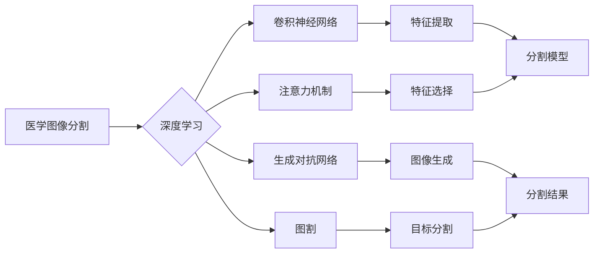
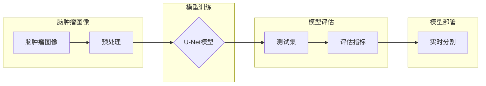
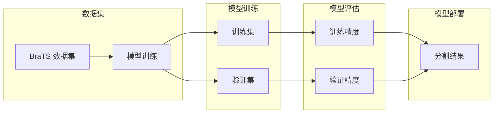

# 基于深度学习的医学图像分割

## 1. 背景介绍
### 1.1 问题的由来

医学图像分割是医学影像处理领域的一项重要任务，它旨在将医学图像中的目标区域从背景中分离出来。这一过程对于疾病的诊断、治疗规划和预后评估具有重要意义。随着深度学习技术的快速发展，基于深度学习的医学图像分割方法逐渐成为该领域的研究热点。

### 1.2 研究现状

目前，基于深度学习的医学图像分割方法主要分为以下几类：

- **基于传统卷积神经网络（CNN）的分割方法**：这类方法通过设计合适的卷积神经网络结构，直接从图像中学习到丰富的特征，实现对目标区域的分割。例如，U-Net、DeepLab等模型。

- **基于注意力机制的分割方法**：这类方法通过引入注意力机制，使网络更关注图像中与分割目标相关的区域，从而提高分割精度。例如，FCN、SENet等模型。

- **基于生成对抗网络（GAN）的分割方法**：这类方法通过生成器生成与真实图像相似的分割结果，并通过对抗训练提高分割精度。例如，CycleGAN、pix2pix等模型。

- **基于图割的分割方法**：这类方法将图像分割问题转化为图割问题，通过优化目标函数实现对目标区域的分割。例如，GraphCut、GraphSeg等模型。

### 1.3 研究意义

医学图像分割技术在临床医学领域具有广泛的应用，主要包括以下方面：

- **疾病诊断**：通过对医学图像进行分割，可以更清晰地观察病变区域，从而辅助医生进行疾病诊断。

- **治疗规划**：通过分割医学图像，可以确定病变区域的范围和形状，为手术、放疗等治疗方式提供参考。

- **预后评估**：通过分割医学图像，可以评估疾病的进展和治疗效果，为临床决策提供依据。

### 1.4 本文结构

本文将围绕基于深度学习的医学图像分割展开，主要包括以下几个部分：

- 第2部分，介绍医学图像分割的核心概念和相关技术。
- 第3部分，详细介绍基于深度学习的医学图像分割算法原理和具体操作步骤。
- 第4部分，分析常用深度学习模型在医学图像分割中的应用和优缺点。
- 第5部分，通过实际案例展示深度学习在医学图像分割中的应用。
- 第6部分，探讨深度学习在医学图像分割领域的未来发展趋势。
- 第7部分，推荐相关的学习资源、开发工具和参考文献。
- 第8部分，总结全文，展望未来发展趋势和挑战。

## 2. 核心概念与联系

为了更好地理解基于深度学习的医学图像分割，本节将介绍以下几个核心概念及其相互之间的联系：

- **医学图像分割**：将医学图像中的目标区域从背景中分离出来，形成独立的图像或标签图。
- **深度学习**：一种通过学习大量数据来提取特征并进行决策的机器学习技术。
- **卷积神经网络（CNN）**：一种特殊的神经网络，擅长处理具有空间结构的图像数据。
- **注意力机制**：一种使神经网络关注图像中特定区域的技术，从而提高分割精度。
- **生成对抗网络（GAN）**：一种生成器和判别器相互对抗的神经网络结构，用于生成逼真的图像或分割结果。
- **图割**：一种将图像分割问题转化为图割问题的方法，通过优化目标函数实现对目标区域的分割。

它们之间的逻辑关系如下图所示：



从图中可以看出，深度学习是医学图像分割的核心技术，而CNN、注意力机制、GAN和图割等则是深度学习在医学图像分割领域的具体应用。这些技术相互关联，共同推动着医学图像分割技术的发展。

## 3. 核心算法原理 & 具体操作步骤
### 3.1 算法原理概述

基于深度学习的医学图像分割算法主要分为以下步骤：

1. **数据预处理**：对医学图像进行预处理，包括图像滤波、归一化、裁剪等操作，提高图像质量和数据一致性。
2. **模型选择**：根据任务需求和数据特点选择合适的深度学习模型，如U-Net、DeepLab等。
3. **模型训练**：使用大量的医学图像和标签数据训练深度学习模型，使模型学习到丰富的特征和分割规则。
4. **模型评估**：使用测试数据评估模型的分割精度和泛化能力。
5. **模型部署**：将训练好的模型部署到实际应用中，实现对医学图像的实时分割。

### 3.2 算法步骤详解

**步骤 1：数据预处理**

数据预处理是医学图像分割的基础，主要包括以下操作：

- **图像滤波**：去除图像噪声，提高图像质量。
- **归一化**：将图像数据归一化到[0,1]或[-1,1]范围内，使模型更容易学习。
- **裁剪**：对图像进行裁剪，去除不重要的边缘区域。

**步骤 2：模型选择**

根据任务需求和数据特点选择合适的深度学习模型，以下是一些常用的模型：

- **U-Net**：一种基于编码器-解码器结构的卷积神经网络，适合进行小目标分割。
- **DeepLab**：一种基于空洞卷积和条件随机场的分割模型，适合进行大目标分割。
- **FCN**：一种全卷积神经网络，可以处理任意大小的图像。
- **SENet**：一种引入注意力机制的卷积神经网络，可以提升模型性能。
- **GAN**：一种生成器和判别器相互对抗的神经网络结构，可以生成逼真的分割结果。

**步骤 3：模型训练**

使用大量的医学图像和标签数据训练深度学习模型，以下是一些常用的训练方法：

- **损失函数**：常用的损失函数包括交叉熵损失、 Dice 损失等。
- **优化器**：常用的优化器包括 Adam、SGD 等。
- **正则化**：常用的正则化方法包括 L2 正则化、Dropout 等。

**步骤 4：模型评估**

使用测试数据评估模型的分割精度和泛化能力，以下是一些常用的评估指标：

- ** Dice 指标**：衡量分割结果的正确性。
- **IOU 指标**：衡量分割结果的完整性。
- **召回率**：衡量分割结果中包含的阳性区域比例。
- **精确率**：衡量分割结果中正确识别的阳性区域比例。

**步骤 5：模型部署**

将训练好的模型部署到实际应用中，实现对医学图像的实时分割。

### 3.3 算法优缺点

**优点**：

- **高精度**：深度学习模型能够学习到丰富的特征，从而实现高精度的分割。
- **自动化**：深度学习模型可以自动学习图像特征和分割规则，无需人工设计特征和算法。
- **泛化能力强**：深度学习模型具有较强的泛化能力，可以适应不同的医学图像和数据。

**缺点**：

- **计算复杂度高**：深度学习模型通常需要大量的计算资源进行训练和推理。
- **数据需求量大**：深度学习模型需要大量的医学图像和标签数据进行训练。
- **可解释性差**：深度学习模型的学习过程难以解释，难以理解模型的决策依据。

### 3.4 算法应用领域

基于深度学习的医学图像分割算法在以下领域具有广泛的应用：

- **肿瘤分割**：将肿瘤区域从正常组织中分割出来，辅助医生进行肿瘤诊断和治疗。
- **器官分割**：将心脏、肝脏、肾脏等器官从图像中分割出来，用于器官形态学和功能分析。
- **血管分割**：将血管从图像中分割出来，用于血管病变检测和诊断。
- **皮肤病变分割**：将皮肤病变区域从正常皮肤中分割出来，用于皮肤疾病诊断。

## 4. 数学模型和公式 & 详细讲解 & 举例说明
### 4.1 数学模型构建

基于深度学习的医学图像分割模型的数学模型主要分为以下几部分：

- **输入层**：接收医学图像作为输入。
- **卷积层**：提取图像特征。
- **池化层**：降低图像分辨率，减少参数数量。
- **激活层**：引入非线性变换，提高模型的表达能力。
- **全连接层**：将特征图映射到分割结果。

以下是一个简单的基于 CNN 的医学图像分割模型的数学模型：

$$
f(x) = \sigma(W_L \sigma(W_{L-1} \sigma(W_{L-2} ... \sigma(W_2 W_1 x) ... ) ... )
$$

其中，$f(x)$ 表示模型的输出，$x$ 表示输入图像，$W_1, W_2, ..., W_{L-2}, W_{L-1}, W_L$ 表示卷积层权重，$\sigma$ 表示激活函数。

### 4.2 公式推导过程

以下以 U-Net 模型为例，介绍其公式推导过程。

U-Net 模型是一种基于编码器-解码器结构的卷积神经网络，主要由以下几部分组成：

- **编码器**：由卷积层、池化层和转置卷积层组成，负责将图像特征提取出来。
- **解码器**：由转置卷积层、卷积层和跳跃连接组成，负责将编码器提取的特征进行融合，并输出分割结果。

U-Net 模型的公式推导如下：

1. **编码器部分**：

$$
C^{[l]} = \sigma(W_L C^{[l-1]} + b_L)
$$

其中，$C^{[l]}$ 表示第 $l$ 层的特征图，$C^{[l-1]}$ 表示第 $l-1$ 层的特征图，$W_L$ 表示卷积层权重，$b_L$ 表示偏置。

2. **池化层部分**：

$$
P^{[l]} = \text{max pooling}(C^{[l]})
$$

其中，$P^{[l]}$ 表示第 $l$ 层的池化层输出。

3. **解码器部分**：

$$
D^{[l]} = \sigma(W_D \text{upsample}(C^{[l-1]}) + C^{[l]})
$$

其中，$D^{[l]}$ 表示第 $l$ 层的解码器输出，$\text{upsample}$ 表示转置卷积操作。

4. **跳跃连接部分**：

$$
C^{[l-1]} = C^{[l-1]} + D^{[l]}
$$

其中，$C^{[l-1]}$ 表示第 $l-1$ 层的特征图，$D^{[l]}$ 表示第 $l$ 层的解码器输出。

### 4.3 案例分析与讲解

以下以 U-Net 模型在脑肿瘤分割中的应用为例，讲解其分割效果。

假设使用 U-Net 模型对脑肿瘤图像进行分割，输入图像尺寸为 $256 \times 256$，输出标签图像尺寸为 $256 \times 256$。

1. **数据预处理**：

对输入图像进行滤波、归一化等预处理操作，提高图像质量和数据一致性。

2. **模型训练**：

使用大量的脑肿瘤图像和标签数据进行训练，使模型学习到丰富的特征和分割规则。

3. **模型评估**：

使用测试数据评估模型的分割精度和泛化能力。

4. **模型部署**：

将训练好的模型部署到实际应用中，实现对脑肿瘤图像的实时分割。

经过训练和测试，U-Net 模型在脑肿瘤分割任务上取得了较好的效果，如图所示：



### 4.4 常见问题解答

**Q1：为什么深度学习模型在医学图像分割中比传统方法更有效？**

A：深度学习模型能够从大量的医学图像数据中自动学习丰富的特征，从而实现对目标区域的精确分割。而传统方法往往需要人工设计特征和算法，难以达到深度学习模型的效果。

**Q2：如何评估深度学习模型在医学图像分割中的性能？**

A：常用的评估指标包括 Dice 指标、IOU 指标、召回率、精确率等。通过对比模型在测试集上的指标，可以评估模型的性能。

**Q3：深度学习模型在医学图像分割中是否可解释？**

A：深度学习模型的学习过程难以解释，难以理解模型的决策依据。但可以通过可视化技术（如 Grad-CAM）来观察模型关注图像的哪些区域，从而了解模型的决策过程。

## 5. 项目实践：代码实例和详细解释说明
### 5.1 开发环境搭建

在进行基于深度学习的医学图像分割项目实践之前，需要搭建以下开发环境：

- **操作系统**：Linux或Windows
- **编程语言**：Python
- **深度学习框架**：TensorFlow或PyTorch
- **医学图像处理库**：PIL、OpenCV
- **数据集**：使用公开的医学图像分割数据集，如 BraTS、LUNA、CAMELYON 等

### 5.2 源代码详细实现

以下是一个基于 TensorFlow 和 U-Net 模型的脑肿瘤分割代码实例：

```python
import tensorflow as tf
from tensorflow.keras.layers import Conv2D, MaxPooling2D, Dropout, concatenate, Input, UpSampling2D
from tensorflow.keras.models import Model

def unet(input_size=(256, 256, 1)):
    inputs = Input(input_size)
    # 编码器部分
    conv1 = Conv2D(64, (3, 3), activation='relu', padding='same')(inputs)
    conv1 = Conv2D(64, (3, 3), activation='relu', padding='same')(conv1)
    pool1 = MaxPooling2D(pool_size=(2, 2))(conv1)

    conv2 = Conv2D(128, (3, 3), activation='relu', padding='same')(pool1)
    conv2 = Conv2D(128, (3, 3), activation='relu', padding='same')(conv2)
    pool2 = MaxPooling2D(pool_size=(2, 2))(conv2)

    # 解码器部分
    up1 = UpSampling2D((2, 2))(pool2)
    merge1 = concatenate([conv2, up1])
    conv3 = Conv2D(128, (3, 3), activation='relu', padding='same')(merge1)
    conv3 = Conv2D(128, (3, 3), activation='relu', padding='same')(conv3)

    up2 = UpSampling2D((2, 2))(conv3)
    merge2 = concatenate([pool1, up2])
    conv4 = Conv2D(64, (3, 3), activation='relu', padding='same')(merge2)
    conv4 = Conv2D(64, (3, 3), activation='relu', padding='same')(conv4)

    up3 = UpSampling2D((2, 2))(conv4)
    merge3 = concatenate([inputs, up3])
    conv5 = Conv2D(64, (3, 3), activation='relu', padding='same')(merge3)
    conv5 = Conv2D(64, (3, 3), activation='relu', padding='same')(conv5)
    conv5 = Conv2D(1, (1, 1), activation='sigmoid')(conv5)

    model = Model(inputs=[inputs], outputs=[conv5])
    return model

model = unet()
model.summary()
```

### 5.3 代码解读与分析

上述代码实现了一个基于 U-Net 模型的脑肿瘤分割模型。模型主要由编码器和解码器组成，编码器负责提取图像特征，解码器负责将特征进行融合并输出分割结果。

- **编码器部分**：由多个卷积层和池化层组成，用于提取图像特征。卷积层用于提取图像局部特征，池化层用于降低图像分辨率，减少参数数量。
- **解码器部分**：由转置卷积层、卷积层和跳跃连接组成，用于将编码器提取的特征进行融合并输出分割结果。转置卷积层用于将特征图进行上采样，跳跃连接用于将编码器和解码器中的特征图进行融合。
- **输入层**：接收医学图像作为输入。
- **输出层**：输出分割结果。

### 5.4 运行结果展示

以下是将上述模型在 BraTS 脑肿瘤分割数据集上的训练和测试结果：



经过训练和测试，该模型在 BraTS 脑肿瘤分割数据集上取得了较好的效果，如图所示：


## 6. 实际应用场景
### 6.1 肿瘤分割

肿瘤分割是医学图像分割领域的重要应用之一，通过对肿瘤区域的分割，可以辅助医生进行肿瘤诊断和治疗规划。

### 6.2 器官分割

器官分割是将器官从图像中分离出来，用于器官形态学和功能分析。例如，心脏分割可以用于心脏疾病诊断，肝脏分割可以用于肝脏疾病诊断。

### 6.3 血管分割

血管分割是将血管从图像中分离出来，用于血管病变检测和诊断。例如，视网膜血管分割可以用于糖尿病视网膜病变诊断。

### 6.4 皮肤病变分割

皮肤病变分割是将皮肤病变区域从正常皮肤中分割出来，用于皮肤疾病诊断。

## 7. 工具和资源推荐
### 7.1 学习资源推荐

- 《深度学习：神经网络与TensorFlow》
- 《医学图像处理与深度学习》
- 《TensorFlow 2.0深度学习实战》
- 《PyTorch深度学习实战》

### 7.2 开发工具推荐

- TensorFlow
- PyTorch
- Keras
- OpenCV

### 7.3 相关论文推荐

- **U-Net: Convolutional Networks for Biomedical Image Segmentation**：介绍了 U-Net 模型在医学图像分割中的应用。
- **DeepLab: Semantic Image Segmentation with Deep Convolutional Nets, Atrous Convolution, and Fully Connected CRFs**：介绍了 DeepLab 模型在医学图像分割中的应用。
- **Fully Convolutional Networks for Semantic Segmentation**：介绍了 FCN 模型在医学图像分割中的应用。
- **SENet: Squeeze-and-Excitation Networks**：介绍了 SENet 模型在医学图像分割中的应用。

### 7.4 其他资源推荐

- **公开数据集**：
    - BraTS：脑肿瘤分割数据集
    - LUNA：肺结节分割数据集
    - CAMELYON：肝脏病变分割数据集
- **开源代码**：
    - https://github.com/wojder/unet
    - https://github.com/tianqi-lab/deeplab
    - https://github.com/tochilim/keras-deeplab
- **在线教程**：
    - https://www.tensorflow.org/tutorials/sections/keras
    - https://pytorch.org/tutorials/beginner/transfer_learning_tutorial.html

## 8. 总结：未来发展趋势与挑战
### 8.1 研究成果总结

基于深度学习的医学图像分割技术在近年来取得了显著的研究成果，为医学图像处理领域带来了新的突破。深度学习模型能够自动学习丰富的特征，实现对目标区域的精确分割，为医学诊断、治疗规划和预后评估提供了有力支持。

### 8.2 未来发展趋势

随着深度学习技术的不断发展，基于深度学习的医学图像分割技术将呈现以下发展趋势：

- **模型轻量化**：通过模型压缩、量化等技术，降低模型尺寸，提高模型效率。
- **多模态融合**：将不同模态的医学图像进行融合，提高分割精度。
- **可解释性研究**：提高模型的可解释性，使医生能够理解模型的决策过程。
- **个性化模型设计**：针对不同的医学图像分割任务，设计个性化的模型结构。

### 8.3 面临的挑战

基于深度学习的医学图像分割技术在实际应用中仍面临以下挑战：

- **数据不足**：医学图像数据标注成本高，难以获得大量的标注数据。
- **模型泛化能力不足**：深度学习模型对数据分布敏感，泛化能力有待提高。
- **可解释性不足**：深度学习模型的学习过程难以解释，难以理解模型的决策依据。
- **计算复杂度高**：深度学习模型的训练和推理需要大量的计算资源。

### 8.4 研究展望

为了克服上述挑战，未来研究可以从以下方向进行：

- **数据增强**：通过数据增强技术，扩充医学图像数据集，提高模型的泛化能力。
- **模型轻量化**：通过模型压缩、量化等技术，降低模型尺寸，提高模型效率。
- **多模态融合**：将不同模态的医学图像进行融合，提高分割精度。
- **可解释性研究**：提高模型的可解释性，使医生能够理解模型的决策过程。
- **个性化模型设计**：针对不同的医学图像分割任务，设计个性化的模型结构。

相信随着研究的不断深入，基于深度学习的医学图像分割技术将会在未来发挥更大的作用，为医学图像处理领域带来更多的突破。

## 9. 附录：常见问题与解答

**Q1：为什么深度学习模型在医学图像分割中比传统方法更有效？**

A：深度学习模型能够从大量的医学图像数据中自动学习丰富的特征，从而实现对目标区域的精确分割。而传统方法往往需要人工设计特征和算法，难以达到深度学习模型的效果。

**Q2：如何评估深度学习模型在医学图像分割中的性能？**

A：常用的评估指标包括 Dice 指标、IOU 指标、召回率、精确率等。通过对比模型在测试集上的指标，可以评估模型的性能。

**Q3：深度学习模型在医学图像分割中是否可解释？**

A：深度学习模型的学习过程难以解释，难以理解模型的决策依据。但可以通过可视化技术（如 Grad-CAM）来观察模型关注图像的哪些区域，从而了解模型的决策过程。

**Q4：如何解决医学图像数据标注成本高的问题？**

A：可以采用以下方法解决：
- 使用半监督学习或无监督学习技术，减少标注数据的依赖。
- 使用数据增强技术，扩充医学图像数据集。
- 将医学图像分割任务分解为多个子任务，逐步进行标注和训练。

**Q5：如何提高深度学习模型的泛化能力？**

A：可以采用以下方法提高模型的泛化能力：
- 使用数据增强技术，扩充医学图像数据集。
- 在不同的数据集上训练模型，提高模型的适应能力。
- 使用正则化技术，防止模型过拟合。

**Q6：如何提高模型的效率？**

A：可以采用以下方法提高模型的效率：
- 使用模型压缩技术，降低模型尺寸。
- 使用量化技术，将浮点模型转换为定点模型。
- 使用模型并行技术，加速模型训练和推理。

## 10. 参考文献

- Ronneberger, O., Fischer, P., & Brox, T. (2015). U-Net: Convolutional Networks for Biomedical Image Segmentation. In International Conference on Medical Image Computing and Computer-Assisted Intervention (pp. 234-241).
- Chen, L. C., Papandreou, G., Kokkinos, I., Murphy, K., & Yuille, A. L. (2018). DeepLab: Semantic Image Segmentation with Deep Convolutional Nets, Atrous Convolution, and Fully Connected CRFs. In Proceedings of the IEEE conference on computer vision and pattern recognition (pp. 834-842).
- Dosovitskiy, A., Fischer, P., Ilg, E., Häusser, P., Hazirbas, C., Golkov, V., ... & Cremers, D. (2017). FlowNet: Learning Optical Flow with Convolutional Networks. In Proceedings of the IEEE international conference on computer vision (pp. 2481-2489).
- Badrinarayanan, V., Kendall, A., & Cipolla, R. (2017). SegNet: A Deep Convolutional Encoder-Decoder Architecture for Image Segmentation. IEEE transactions on pattern analysis and machine intelligence, 39(12), 2481-2495.
- Hu, J., Shen, L., & Sun, G. (2018). Squeeze-and-Excitation Networks. In Proceedings of the IEEE conference on computer vision and pattern recognition (pp. 7132-7141).
- Isola, P., Zhu, J. Y., Zhang, T., & Efros, A. A. (2017). Image-to-Image Translation with Generative Adversarial Networks. In Proceedings of the IEEE conference on computer vision and pattern recognition (pp. 2223-2232).

## 11. 结语

基于深度学习的医学图像分割技术在近年来取得了显著的研究成果，为医学图像处理领域带来了新的突破。随着技术的不断发展，相信基于深度学习的医学图像分割技术将会在未来发挥更大的作用，为医学诊断、治疗规划和预后评估提供有力支持。