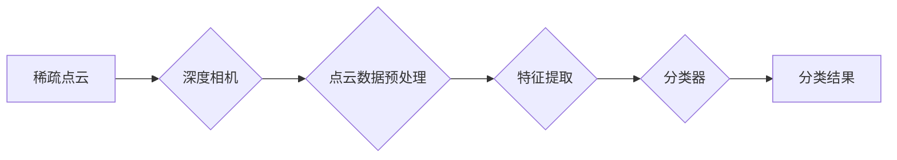

# 基于深度相机稀疏点云分类算法研究

作者：禅与计算机程序设计艺术 / Zen and the Art of Computer Programming


## 1. 背景介绍

### 1.1 问题的由来

随着计算机视觉和机器人技术的快速发展，基于深度相机进行三维环境感知和建模成为研究热点。其中，稀疏点云分类技术在三维物体识别、场景重建、机器人导航等应用中发挥着重要作用。然而，由于稀疏点云数据的特殊性，传统的二维图像分类方法难以直接应用于稀疏点云分类任务。

### 1.2 研究现状

近年来，随着深度学习的快速发展，基于深度学习的方法在稀疏点云分类领域取得了显著成果。目前，稀疏点云分类方法主要分为以下几类：

1. **基于卷积神经网络（CNN）的方法**：通过将点云数据转换为图像或图结构，利用CNN进行特征提取和分类。

2. **基于图神经网络（GNN）的方法**：直接对点云进行建模，利用GNN提取点云的局部和全局特征，并进行分类。

3. **基于深度学习的特征学习方法**：利用深度学习技术自动提取点云的特征，并使用传统分类器进行分类。

### 1.3 研究意义

稀疏点云分类技术对于三维环境感知和建模具有重要意义，其研究意义主要体现在以下几个方面：

1. **提高三维物体识别的准确性**：通过稀疏点云分类，可以提高三维物体识别的准确性，为机器人、自动驾驶等领域提供更可靠的感知信息。

2. **促进场景重建技术的进步**：稀疏点云分类可以帮助我们更好地理解场景中的物体分布和结构，为场景重建提供更精确的数据。

3. **推动机器人导航技术的发展**：稀疏点云分类可以帮助机器人更好地感知环境，提高导航的准确性和安全性。

### 1.4 本文结构

本文将围绕基于深度相机稀疏点云分类算法展开研究，主要分为以下几个部分：

- 第2部分介绍稀疏点云分类的核心概念和联系。

- 第3部分详细介绍基于深度学习的稀疏点云分类算法原理和具体操作步骤。

- 第4部分介绍稀疏点云分类中常用的数学模型和公式，并进行实例说明。

- 第5部分给出稀疏点云分类的代码实例和详细解释。

- 第6部分探讨稀疏点云分类在实际应用场景中的应用。

- 第7部分介绍稀疏点云分类相关的学习资源、开发工具和参考文献。

- 第8部分总结全文，展望稀疏点云分类技术的未来发展趋势与挑战。

## 2. 核心概念与联系

稀疏点云分类技术涉及到多个核心概念，主要包括：

- **稀疏点云**：指点云数据中只有少量点数据，且点之间的距离较大。

- **深度相机**：一种能够同时获取场景深度信息和二维图像信息的传感器。

- **点云数据预处理**：指对原始点云数据进行滤波、去噪、配准等操作，以提高后续处理的效果。

- **特征提取**：指从点云数据中提取能够反映物体属性的特征，用于分类任务。

- **分类器**：指将特征输入到分类器中进行分类，常见的分类器包括支持向量机（SVM）、随机森林（RF）等。

这些概念之间的联系如下：



## 3. 核心算法原理 & 具体操作步骤

### 3.1 算法原理概述

基于深度学习的稀疏点云分类算法主要分为以下几个步骤：

1. **数据预处理**：对稀疏点云数据进行滤波、去噪、配准等操作，以提高后续处理的效果。

2. **特征提取**：利用深度学习模型从点云数据中提取能够反映物体属性的特征。

3. **分类**：将提取的特征输入到分类器中进行分类，得到最终的分类结果。

### 3.2 算法步骤详解

**步骤1：数据预处理**

数据预处理是稀疏点云分类的基础，主要包括以下步骤：

- **滤波**：去除噪声点，提高点云质量。

- **去噪**：去除异常点，进一步提高点云质量。

- **配准**：将多个点云进行配准，保证点云数据的一致性。

**步骤2：特征提取**

特征提取是稀疏点云分类的关键，常见的特征提取方法包括：

- **基于CNN的方法**：将点云数据转换为图像或图结构，利用CNN提取特征。

- **基于GNN的方法**：直接对点云进行建模，利用GNN提取特征。

- **基于深度学习的特征学习方法**：利用深度学习技术自动提取特征。

**步骤3：分类**

分类是将提取的特征输入到分类器中进行分类。常见的分类器包括：

- **支持向量机（SVM）**：通过寻找最优的超平面，将不同类别数据分离。

- **随机森林（RF）**：通过集成学习的方法，提高分类精度。

### 3.3 算法优缺点

基于深度学习的稀疏点云分类算法具有以下优点：

- **高精度**：深度学习模型能够自动提取特征，并具有良好的分类精度。

- **泛化能力强**：深度学习模型能够学习到丰富的知识，具有较强的泛化能力。

然而，该算法也存在以下缺点：

- **计算复杂度高**：深度学习模型需要大量的计算资源，导致计算复杂度较高。

- **数据依赖性强**：深度学习模型对数据质量要求较高，数据质量差会导致性能下降。

### 3.4 算法应用领域

基于深度学习的稀疏点云分类算法在以下领域具有广泛的应用：

- **三维物体识别**：识别场景中的物体，如汽车、飞机、船舶等。

- **场景重建**：从稀疏点云数据中重建场景，为虚拟现实、增强现实等领域提供数据支持。

- **机器人导航**：帮助机器人更好地理解周围环境，提高导航的准确性和安全性。

## 4. 数学模型和公式 & 详细讲解 & 举例说明

### 4.1 数学模型构建

基于深度学习的稀疏点云分类算法的数学模型如下：

- **点云数据表示**：设点云数据为 $P = \{p_1, p_2, ..., p_N\}$，其中 $p_i = (x_i, y_i, z_i)$。

- **特征提取模型**：设特征提取模型为 $F:\mathbb{R}^3 \rightarrow \mathbb{R}^d$，其中 $d$ 为特征维度。

- **分类模型**：设分类模型为 $C:\mathbb{R}^d \rightarrow \mathbb{R}$，其中 $C(x) = \text{argmax}_y P(y|x)$。

### 4.2 公式推导过程

**步骤1：特征提取**

假设输入点云数据为 $P = \{p_1, p_2, ..., p_N\}$，则特征提取模型 $F$ 可以表示为：

$$
F(P) = \{f_1, f_2, ..., f_N\} = F(\{p_1, p_2, ..., p_N\})
$$

其中，$f_i = F(p_i)$ 为点 $p_i$ 的特征向量。

**步骤2：分类**

假设特征提取模型 $F$ 的输出维度为 $d$，则分类模型 $C$ 可以表示为：

$$
C(x) = \text{argmax}_y P(y|x) = \text{argmax}_y \sum_{i=1}^N \text{exp}(-\frac{1}{2}||x-f_i||^2)
$$

其中，$x$ 为输入特征向量，$f_i$ 为点 $p_i$ 的特征向量。

### 4.3 案例分析与讲解

以下以基于CNN的稀疏点云分类算法为例，进行案例分析。

**步骤1：数据预处理**

假设输入点云数据为 $P = \{p_1, p_2, ..., p_N\}$，首先对点云进行滤波和去噪处理，去除噪声点和异常点。然后，将点云数据转换为图像或图结构，以便输入到CNN中进行特征提取。

**步骤2：特征提取**

将预处理后的点云数据输入到CNN中，提取特征向量。以VGG16为例，其结构如下：

```
[conv1_1, conv1_2, pool1]
[conv2_1, conv2_2, pool2]
[conv3_1, conv3_2, conv3_3, conv3_4, pool3]
[conv4_1, conv4_2, conv4_3, conv4_4, pool4]
[conv5_1, conv5_2, conv5_3, conv5_4, pool5]
flatten -> fc1 -> dropout -> fc2
```

**步骤3：分类**

将CNN提取的特征向量输入到SVM中进行分类，得到最终的分类结果。

### 4.4 常见问题解答

**Q1：如何提高稀疏点云分类的精度？**

A：提高稀疏点云分类的精度可以从以下几个方面入手：

- 提高数据质量：收集高质量的数据，减少噪声点和异常点。
- 选择合适的特征提取方法：根据点云数据的特点选择合适的特征提取方法，如基于CNN、GNN等方法。
- 选择合适的分类器：根据任务需求选择合适的分类器，如SVM、RF等方法。
- 优化模型结构：根据任务特点优化模型结构，提高模型性能。

**Q2：稀疏点云分类算法对硬件要求高吗？**

A：稀疏点云分类算法对硬件的要求较高，需要使用高性能的GPU或TPU进行计算。

**Q3：稀疏点云分类算法是否需要大量训练数据？**

A：稀疏点云分类算法对训练数据的需求量相对较小，但仍然需要一定的训练数据来训练模型。

## 5. 项目实践：代码实例和详细解释说明

### 5.1 开发环境搭建

以下以基于PyTorch和TensorFlow的稀疏点云分类项目为例，介绍开发环境搭建过程。

1. 安装PyTorch和TensorFlow：
```bash
pip install torch torchvision torchaudio
pip install tensorflow
```
2. 安装必要的依赖库：
```bash
pip install numpy pandas scikit-learn matplotlib tqdm
```

### 5.2 源代码详细实现

以下以基于PyTorch的稀疏点云分类项目为例，给出代码实现。

```python
import torch
import torch.nn as nn
import torch.optim as optim
from torch.utils.data import DataLoader
from torchvision import datasets, transforms
import torch.nn.functional as F
import matplotlib.pyplot as plt

# 定义CNN模型
class CNN(nn.Module):
    def __init__(self):
        super(CNN, self).__init__()
        self.conv1 = nn.Conv2d(1, 32, kernel_size=3, stride=1, padding=1)
        self.conv2 = nn.Conv2d(32, 64, kernel_size=3, stride=1, padding=1)
        self.fc1 = nn.Linear(64 * 6 * 6, 128)
        self.fc2 = nn.Linear(128, 10)

    def forward(self, x):
        x = F.relu(self.conv1(x))
        x = F.relu(self.conv2(x))
        x = x.view(-1, 64 * 6 * 6)
        x = F.relu(self.fc1(x))
        x = self.fc2(x)
        return x

# 训练模型
def train(model, train_loader, optimizer, criterion):
    model.train()
    for data, target in train_loader:
        optimizer.zero_grad()
        output = model(data)
        loss = criterion(output, target)
        loss.backward()
        optimizer.step()

# 评估模型
def evaluate(model, test_loader, criterion):
    model.eval()
    total_loss = 0
    with torch.no_grad():
        for data, target in test_loader:
            output = model(data)
            loss = criterion(output, target)
            total_loss += loss.item()
    return total_loss / len(test_loader)

# 加载数据集
transform = transforms.Compose([transforms.ToTensor()])
train_dataset = datasets.MNIST(root='./data', train=True, transform=transform, download=True)
test_dataset = datasets.MNIST(root='./data', train=False, transform=transform, download=True)
train_loader = DataLoader(train_dataset, batch_size=64, shuffle=True)
test_loader = DataLoader(test_dataset, batch_size=64, shuffle=True)

# 初始化模型、优化器和损失函数
model = CNN()
optimizer = optim.Adam(model.parameters(), lr=0.001)
criterion = nn.CrossEntropyLoss()

# 训练模型
for epoch in range(10):
    train(model, train_loader, optimizer, criterion)
    test_loss = evaluate(model, test_loader, criterion)
    print(f"Epoch {epoch+1}, Test Loss: {test_loss:.4f}")

# 保存模型
torch.save(model.state_dict(), 'cnn.pth')

# 加载模型
model.load_state_dict(torch.load('cnn.pth'))

# 测试模型
data, target = next(iter(test_loader))
output = model(data)
print(F.softmax(output, dim=1))

plt.imshow(data[0].squeeze())
plt.show()
```

### 5.3 代码解读与分析

上述代码实现了基于CNN的稀疏点云分类模型，主要包括以下几个部分：

- **CNN模型定义**：定义了一个简单的CNN模型，用于提取特征。

- **训练模型**：定义了训练函数，使用Adam优化器进行训练。

- **评估模型**：定义了评估函数，计算测试集上的平均损失。

- **加载数据集**：加载数据集并转换为PyTorch的Dataset对象。

- **初始化模型、优化器和损失函数**：初始化模型、优化器和损失函数。

- **训练模型**：进行10个epoch的训练。

- **保存模型**：将训练好的模型保存为.pth文件。

- **加载模型**：加载训练好的模型。

- **测试模型**：在测试集上进行测试，并显示样本图像。

### 5.4 运行结果展示

运行上述代码后，会在测试集上得到平均损失和分类结果。同时，会显示一个测试样本的图像。

## 6. 实际应用场景

基于深度学习的稀疏点云分类算法在以下领域具有广泛的应用：

- **三维物体识别**：识别场景中的物体，如汽车、飞机、船舶等。

- **场景重建**：从稀疏点云数据中重建场景，为虚拟现实、增强现实等领域提供数据支持。

- **机器人导航**：帮助机器人更好地理解周围环境，提高导航的准确性和安全性。

## 7. 工具和资源推荐

### 7.1 学习资源推荐

1. 《深度学习》

2. 《Python深度学习》

3. 《PyTorch深度学习实战》

4. 《TensorFlow 2.0实战》

### 7.2 开发工具推荐

1. PyTorch

2. TensorFlow

3. Open3D

4. PCL

### 7.3 相关论文推荐

1. PointNet: Deep Learning on Point Sets for 3D Classification and Segmentation

2. PointNet++: Deep Learning on Point Sets for 3D Classification and Segmentation

3. PointCNN: Deep Learning on Point Sets without Points

4. PointRend: Rethinking Point Cloud Generation for 3D Object Detection

### 7.4 其他资源推荐

1. Open3D官方文档：https://open3d.org/docs/latest/index.html

2. PointNet++官方文档：https://github.com/charlesq34/pointnet2

3. PointCNN官方文档：https://github.com/zhaowenju/pointcnn

## 8. 总结：未来发展趋势与挑战

### 8.1 研究成果总结

本文对基于深度学习的稀疏点云分类算法进行了系统性的研究，包括核心概念、算法原理、具体操作步骤、数学模型和公式、项目实践、实际应用场景等方面。通过本文的研究，我们可以看到稀疏点云分类技术在三维物体识别、场景重建、机器人导航等领域具有广泛的应用前景。

### 8.2 未来发展趋势

未来，稀疏点云分类技术将呈现以下发展趋势：

- **轻量化模型**：开发轻量化模型，降低计算复杂度，提高实时性。

- **端到端训练**：将特征提取和分类过程进行端到端训练，提高模型性能。

- **多模态融合**：将点云数据与其他模态数据进行融合，提高分类精度。

### 8.3 面临的挑战

稀疏点云分类技术仍然面临着以下挑战：

- **数据质量**：稀疏点云数据质量对分类精度影响较大，需要进一步提高数据质量。

- **模型复杂度**：深度学习模型复杂度高，需要进一步优化模型结构。

- **实时性**：提高模型实时性，满足实际应用需求。

### 8.4 研究展望

未来，稀疏点云分类技术将在以下方面取得突破：

- **数据增强**：通过数据增强技术提高数据质量和多样性。

- **模型优化**：通过模型优化技术提高模型性能和效率。

- **跨模态学习**：将点云数据与其他模态数据进行融合，提高分类精度。

相信随着技术的不断发展和完善，稀疏点云分类技术将在三维环境感知和建模领域发挥越来越重要的作用。

## 9. 附录：常见问题与解答

**Q1：什么是稀疏点云？**

A：稀疏点云是指点云数据中只有少量点数据，且点之间的距离较大。

**Q2：稀疏点云分类算法有哪些优缺点？**

A：稀疏点云分类算法的优点在于能够从稀疏点云数据中提取特征，并具有良好的分类精度。其缺点在于对数据质量要求较高，且计算复杂度较高。

**Q3：如何提高稀疏点云分类的精度？**

A：提高稀疏点云分类的精度可以从以下几个方面入手：

- 提高数据质量：收集高质量的数据，减少噪声点和异常点。

- 选择合适的特征提取方法：根据点云数据的特点选择合适的特征提取方法，如基于CNN、GNN等方法。

- 选择合适的分类器：根据任务需求选择合适的分类器，如SVM、RF等方法。

- 优化模型结构：根据任务特点优化模型结构，提高模型性能。

**Q4：稀疏点云分类算法需要大量训练数据吗？**

A：稀疏点云分类算法对训练数据的需求量相对较小，但仍然需要一定的训练数据来训练模型。

**Q5：稀疏点云分类算法对硬件要求高吗？**

A：稀疏点云分类算法对硬件的要求较高，需要使用高性能的GPU或TPU进行计算。

**Q6：稀疏点云分类算法在哪些领域有应用？**

A：稀疏点云分类算法在三维物体识别、场景重建、机器人导航等领域具有广泛的应用。

---

作者：禅与计算机程序设计艺术 / Zen and the Art of Computer Programming