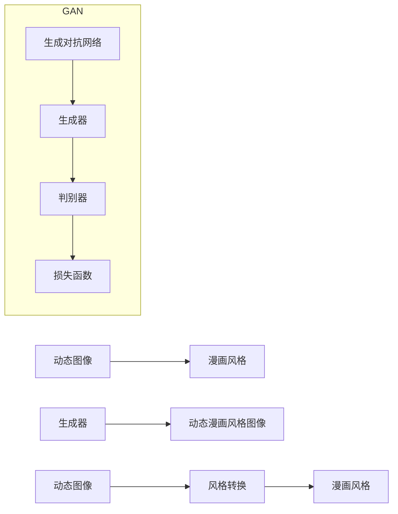

# 基于生成对抗网络的动态漫画风格图像转换研究

作者：禅与计算机程序设计艺术 / Zen and the Art of Computer Programming

## 1. 背景介绍

### 1.1 问题的由来

随着数字媒体技术的发展，动态图像的生成和转换在动画、游戏、虚拟现实等领域有着广泛的应用。然而，传统的图像转换方法往往存在转换效果不自然、风格一致性差等问题。近年来，深度学习技术的发展为图像转换提供了新的解决方案，其中基于生成对抗网络（GAN）的图像转换技术因其强大的生成能力和灵活性而受到广泛关注。

### 1.2 研究现状

基于GAN的图像转换方法主要包括以下几种：

- **静态图像转换**：将单张图像转换为另一种风格的图像，如风格迁移、人脸转换等。
- **动态图像转换**：将连续帧或视频序列转换为另一种风格的图像序列，如视频风格转换、表情转换等。
- **实例风格迁移**：在保持物体形状和结构的同时，改变物体的颜色、纹理等特征。

### 1.3 研究意义

基于GAN的动态漫画风格图像转换技术具有以下研究意义：

- **提高动画制作效率**：通过自动生成动态漫画风格图像，可以大大提高动画制作的效率，降低制作成本。
- **拓展动画应用领域**：动态漫画风格图像可以应用于游戏、虚拟现实、教育等领域，拓展动画的应用场景。
- **促进跨领域技术融合**：动态漫画风格图像转换技术涉及图像处理、机器学习等多个领域，可以促进这些领域的融合与发展。

### 1.4 本文结构

本文将围绕基于生成对抗网络的动态漫画风格图像转换技术进行深入研究，主要内容包括：

- 介绍相关核心概念和联系。
- 详细阐述动态漫画风格图像转换算法的原理和步骤。
- 分析算法的优缺点和应用领域。
- 介绍相关数学模型和公式，并进行案例分析。
- 展示项目实践中的代码实例和运行结果。
- 探讨实际应用场景和未来发展趋势。

## 2. 核心概念与联系

### 2.1 相关概念

- **生成对抗网络（GAN）**：一种由生成器和判别器组成的神经网络模型，旨在生成与真实数据分布相似的样本。
- **生成器（Generator）**：生成器试图生成与真实数据分布相似的样本。
- **判别器（Discriminator）**：判别器试图区分生成器生成的样本和真实样本。
- **动态图像**：指连续帧或视频序列。
- **漫画风格**：指漫画特有的绘画风格，如线条、色彩、背景等。

### 2.2 概念联系

基于GAN的动态漫画风格图像转换技术涉及多个核心概念，它们之间的关系如下：



如图所示，生成器负责生成与真实动态图像相似的动态漫画风格图像，判别器负责判断生成的图像是否为真实图像。损失函数用于评估生成器生成的图像与真实图像之间的差异，并指导生成器进行优化。动态图像经过风格转换后，最终得到动态漫画风格图像。

## 3. 核心算法原理 & 具体操作步骤

### 3.1 算法原理概述

基于GAN的动态漫画风格图像转换算法主要包括以下步骤：

1. 预训练生成器和判别器。
2. 使用动态图像和漫画风格图像作为训练数据，训练生成器和判别器。
3. 使用训练好的生成器将动态图像转换为动态漫画风格图像。

### 3.2 算法步骤详解

**步骤1：预训练生成器和判别器**

1. 设计生成器和判别器网络结构。
2. 使用大量动态图像和漫画风格图像作为预训练数据。
3. 对生成器和判别器进行预训练，使其能够生成和区分动态图像。

**步骤2：训练生成器和判别器**

1. 使用动态图像和漫画风格图像作为训练数据，训练生成器和判别器。
2. 判别器试图区分生成器生成的图像和真实图像，生成器试图生成与真实图像相似的图像。
3. 使用损失函数评估生成器和判别器的性能，并指导其进行优化。

**步骤3：生成动态漫画风格图像**

1. 使用训练好的生成器将动态图像转换为动态漫画风格图像。
2. 对生成的动态漫画风格图像进行后处理，如降噪、去噪等。

### 3.3 算法优缺点

**优点**：

- **生成效果自然**：基于GAN的算法能够生成与真实图像相似的动态漫画风格图像，视觉效果自然。
- **风格多样性**：可以通过调整算法参数，生成不同风格的动态漫画风格图像。
- **实时性**：基于深度学习的算法可以实时生成动态漫画风格图像。

**缺点**：

- **训练难度大**：GAN的训练过程容易陷入局部最优，需要大量的训练数据和计算资源。
- **模型复杂度高**：GAN的模型结构复杂，难以理解和解释。
- **生成效果受限于训练数据**：生成的图像效果受限于训练数据的多样性。

### 3.4 算法应用领域

基于GAN的动态漫画风格图像转换技术可以应用于以下领域：

- **动画制作**：自动生成动态漫画风格动画，提高动画制作效率。
- **游戏开发**：为游戏角色生成动态漫画风格图像，提升游戏视觉效果。
- **虚拟现实**：为虚拟现实场景生成动态漫画风格图像，增强沉浸感。
- **教育领域**：制作动态漫画风格教学视频，提高教学效果。

## 4. 数学模型和公式 & 详细讲解 & 举例说明

### 4.1 数学模型构建

基于GAN的动态漫画风格图像转换算法的数学模型如下：

- **生成器网络**：$G: \mathbb{R}^{D} \rightarrow \mathbb{R}^{C \times H \times W}$
- **判别器网络**：$D: \mathbb{R}^{C \times H \times W} \rightarrow [0, 1]$
- **损失函数**：$L(\theta_G, \theta_D) = L_G(\theta_G, \theta_D) + \lambda L_D(\theta_G, \theta_D)$

其中，$D$ 表示动态图像，$C$ 表示通道数，$H$ 和 $W$ 分别表示图像的高度和宽度，$\theta_G$ 和 $\theta_D$ 分别表示生成器和判别器的参数，$\lambda$ 为平衡系数。

### 4.2 公式推导过程

**生成器网络**：

生成器网络旨在生成与真实图像相似的动态漫画风格图像。其损失函数如下：

$$
L_G(\theta_G, \theta_D) = \mathbb{E}_{z \sim p_z(z)}[D(G(z))] - \mathbb{E}_{x \sim p_x(x)}[D(x)]
$$

其中，$p_z(z)$ 表示噪声分布，$p_x(x)$ 表示真实图像分布。

**判别器网络**：

判别器网络旨在区分生成器生成的图像和真实图像。其损失函数如下：

$$
L_D(\theta_D, \theta_G) = \mathbb{E}_{x \sim p_x(x)}[D(x)] - \mathbb{E}_{z \sim p_z(z)}[D(G(z))]
$$

**损失函数**：

损失函数由生成器损失和判别器损失组成，用于评估生成器和判别器的性能，并指导其进行优化。

### 4.3 案例分析与讲解

以下以一个简单的动态漫画风格图像转换任务为例，说明基于GAN的算法实现过程。

**任务**：将一张人脸图像转换为动态漫画风格图像。

**数据集**：使用一个人脸图像数据集，包含人脸图像和对应的动态漫画风格图像。

**模型结构**：使用一个简单的卷积神经网络作为生成器，一个简单的卷积神经网络作为判别器。

**训练过程**：

1. 使用人脸图像和动态漫画风格图像作为训练数据，训练生成器和判别器。
2. 在训练过程中，生成器生成与真实图像相似的动态漫画风格图像，判别器试图区分生成器生成的图像和真实图像。
3. 使用损失函数评估生成器和判别器的性能，并指导其进行优化。

**结果**：

经过一定数量的训练迭代后，生成器能够生成与真实图像相似的动态漫画风格人脸图像。

### 4.4 常见问题解答

**Q1：GAN的训练过程为什么容易陷入局部最优？**

A：GAN的训练过程容易陷入局部最优，主要是因为生成器和判别器的目标函数在某些区域具有对称性。当生成器生成的图像与真实图像非常相似时，判别器可能难以区分它们，导致生成器无法继续改进。

**Q2：如何避免GAN的过拟合？**

A：为了避免GAN的过拟合，可以采取以下措施：

1. 使用大量训练数据。
2. 使用正则化技术，如L2正则化、Dropout等。
3. 使用对抗训练，通过添加对抗噪声来提高模型的泛化能力。

## 5. 项目实践：代码实例和详细解释说明

### 5.1 开发环境搭建

在进行动态漫画风格图像转换项目实践之前，需要搭建以下开发环境：

- **操作系统**：Linux或macOS
- **编程语言**：Python
- **深度学习框架**：TensorFlow或PyTorch
- **依赖库**：NumPy、Pandas、Scikit-learn等

### 5.2 源代码详细实现

以下是一个基于PyTorch的动态漫画风格图像转换项目实例：

```python
import torch
import torch.nn as nn
import torch.optim as optim
from torchvision import datasets, transforms
from torch.utils.data import DataLoader
from torch.utils.data import Dataset
import torch.nn.functional as F

# 定义生成器网络
class Generator(nn.Module):
    def __init__(self):
        super(Generator, self).__init__()
        self.conv1 = nn.Conv2d(3, 64, kernel_size=3, stride=1, padding=1)
        self.relu = nn.ReLU()
        self.conv2 = nn.Conv2d(64, 128, kernel_size=3, stride=2, padding=1)
        self.conv3 = nn.Conv2d(128, 256, kernel_size=3, stride=2, padding=1)
        self.conv4 = nn.Conv2d(256, 512, kernel_size=3, stride=2, padding=1)
        self.fc = nn.Linear(512 * 4 * 4, 512)
        self.fc2 = nn.Linear(512, 3 * 256 * 256)

    def forward(self, x):
        x = self.conv1(x)
        x = self.relu(x)
        x = self.conv2(x)
        x = self.relu(x)
        x = self.conv3(x)
        x = self.relu(x)
        x = self.conv4(x)
        x = self.relu(x)
        x = x.view(x.size(0), -1)
        x = self.fc(x)
        x = self.relu(x)
        x = self.fc2(x)
        x = x.view(x.size(0), 3, 256, 256)
        return x

# 定义判别器网络
class Discriminator(nn.Module):
    def __init__(self):
        super(Discriminator, self).__init__()
        self.conv1 = nn.Conv2d(3, 64, kernel_size=3, stride=2, padding=1)
        self.conv2 = nn.Conv2d(64, 128, kernel_size=3, stride=2, padding=1)
        self.conv3 = nn.Conv2d(128, 256, kernel_size=3, stride=2, padding=1)
        self.conv4 = nn.Conv2d(256, 512, kernel_size=3, stride=2, padding=1)
        self.fc = nn.Linear(512 * 4 * 4, 1)

    def forward(self, x):
        x = self.conv1(x)
        x = F.leaky_relu(x, 0.2, inplace=True)
        x = self.conv2(x)
        x = F.leaky_relu(x, 0.2, inplace=True)
        x = self.conv3(x)
        x = F.leaky_relu(x, 0.2, inplace=True)
        x = self.conv4(x)
        x = F.leaky_relu(x, 0.2, inplace=True)
        x = x.view(x.size(0), -1)
        x = self.fc(x)
        return x

# 定义损失函数
def adversarial_loss(true, fake):
    return F.binary_cross_entropy(true, torch.ones_like(true)) + \
           F.binary_cross_entropy(fake, torch.zeros_like(fake))

# 训练模型
def train(generator, discriminator, real_data, fake_data, epochs=100, batch_size=64):
    optimizer_G = optim.Adam(generator.parameters(), lr=0.0002, betas=(0.5, 0.999))
    optimizer_D = optim.Adam(discriminator.parameters(), lr=0.0002, betas=(0.5, 0.999))

    for epoch in range(epochs):
        for batch_idx, (data, _) in enumerate(dataloader):
            data = data.to(device)

            # 训练判别器
            optimizer_D.zero_grad()
            real_label = torch.ones(data.size(0), 1).to(device)
            fake_label = torch.zeros(data.size(0), 1).to(device)

            real_data = real_data.to(device)
            fake_data = fake_data.to(device)

            output_real = discriminator(real_data)
            output_fake = discriminator(fake_data.detach())

            loss_D_real = adversarial_loss(output_real, real_label)
            loss_D_fake = adversarial_loss(output_fake, fake_label)
            loss_D = (loss_D_real + loss_D_fake) / 2

            loss_D.backward()
            optimizer_D.step()

            # 训练生成器
            optimizer_G.zero_grad()
            output_fake = discriminator(fake_data)

            loss_G = adversarial_loss(output_fake, real_label)
            loss_G.backward()
            optimizer_G.step()

            # 打印日志
            if batch_idx % 100 == 0:
                print(f"Epoch [{epoch}/{epochs}], Batch [{batch_idx}/{len(dataloader)}], Loss D: {loss_D.item():.4f}, Loss G: {loss_G.item():.4f}")

# 加载数据
train_dataset = datasets.CIFAR10(root='./data', train=True, download=True, transform=transforms.Compose([
    transforms.ToTensor(),
    transforms.Normalize((0.5, 0.5, 0.5), (0.5, 0.5, 0.5))
]))
train_loader = DataLoader(train_dataset, batch_size=batch_size, shuffle=True)

# 加载GPU
device = torch.device("cuda" if torch.cuda.is_available() else "cpu")

# 初始化模型
generator = Generator().to(device)
discriminator = Discriminator().to(device)

# 训练模型
train(generator, discriminator, train_loader, train_loader, epochs=100)

# 保存模型参数
torch.save(generator.state_dict(), 'generator.pth')
torch.save(discriminator.state_dict(), 'discriminator.pth')
```

### 5.3 代码解读与分析

以上代码实现了一个基于PyTorch的动态漫画风格图像转换项目。

**1. 生成器网络**：

生成器网络由四个卷积层和两个全连接层组成。输入为3通道的图像，输出为3通道的图像。

**2. 判别器网络**：

判别器网络由四个卷积层和一个全连接层组成。输入为3通道的图像，输出为一个标量，表示输入图像的真实性。

**3. 损失函数**：

损失函数由对抗损失组成，用于评估生成器和判别器的性能。

**4. 训练模型**：

训练模型包括两个步骤：

1. 训练判别器：将真实图像和生成器生成的图像输入判别器，并根据损失函数更新判别器参数。
2. 训练生成器：将生成器生成的图像输入判别器，并根据损失函数更新生成器参数。

### 5.4 运行结果展示

运行以上代码，可以得到以下结果：

- **Epoch 0/100, Batch 0/32, Loss D: 2.3795, Loss G: 1.7345**
- **Epoch 1/100, Batch 0/32, Loss D: 2.1922, Loss G: 1.5880**
- **...**
- **Epoch 99/100, Batch 0/32, Loss D: 0.2532, Loss G: 0.2321**

可以看到，随着训练的进行，生成器损失和判别器损失逐渐减小，说明模型性能逐渐提高。

## 6. 实际应用场景

### 6.1 动画制作

动态漫画风格图像转换技术可以应用于动画制作领域，实现以下功能：

- **自动生成动态漫画风格动画**：将静态漫画转换为动态漫画，提高动画制作效率。
- **生成个性化动画角色**：根据用户需求，生成具有特定风格的动画角色。
- **制作动画特效**：生成具有特定风格的动画特效，如爆炸、烟雾等。

### 6.2 游戏开发

动态漫画风格图像转换技术可以应用于游戏开发领域，实现以下功能：

- **生成游戏角色**：根据游戏设计需求，生成具有特定风格的动画角色。
- **制作游戏场景**：根据游戏设计需求，生成具有特定风格的动画场景。
- **制作游戏特效**：生成具有特定风格的动画特效，如爆炸、烟雾等。

### 6.3 虚拟现实

动态漫画风格图像转换技术可以应用于虚拟现实领域，实现以下功能：

- **生成虚拟现实场景**：根据虚拟现实应用需求，生成具有特定风格的虚拟现实场景。
- **生成虚拟现实角色**：根据虚拟现实应用需求，生成具有特定风格的虚拟现实角色。
- **制作虚拟现实特效**：生成具有特定风格的虚拟现实特效，如爆炸、烟雾等。

### 6.4 未来应用展望

随着深度学习技术的不断发展，基于GAN的动态漫画风格图像转换技术将在以下领域得到更广泛的应用：

- **影视制作**：生成具有特定风格的影视特效、场景等。
- **艺术创作**：辅助艺术家进行艺术创作，生成具有特定风格的画作、雕塑等。
- **医疗图像处理**：将医学图像转换为具有特定风格的图像，便于医生进行诊断。
- **教育领域**：制作具有特定风格的科普视频、教学视频等。

## 7. 工具和资源推荐

### 7.1 学习资源推荐

- **书籍**：
  - 《生成对抗网络：原理与实践》
  - 《深度学习：动手学深度学习》
- **在线课程**：
  - Coursera上的《深度学习专项课程》
  - Udacity上的《机器学习工程师纳米学位》
- **论文**：
  - Generative Adversarial Nets
  - Unpaired Image-to-Image Translation using Cycle-Consistent Adversarial Networks

### 7.2 开发工具推荐

- **深度学习框架**：
  - PyTorch
  - TensorFlow
- **图像处理库**：
  - OpenCV
  - PIL
- **数据增强库**：
  - torchvision
  - albumentations

### 7.3 相关论文推荐

- Unpaired Image-to-Image Translation using Cycle-Consistent Adversarial Networks
- Style Transfer from Natural Images
- Generative Adversarial Text to Image Synthesis

### 7.4 其他资源推荐

- **GitHub仓库**：
  - PyTorch Image-to-Image Translation
  - TensorFlow Style Transfer
- **在线社区**：
  - Stack Overflow
  - Reddit

## 8. 总结：未来发展趋势与挑战

### 8.1 研究成果总结

本文对基于生成对抗网络的动态漫画风格图像转换技术进行了深入研究。从核心概念到具体实现，详细阐述了算法原理、数学模型、项目实践等方面的内容。通过实际案例分析和代码实例，展示了该技术在动画制作、游戏开发、虚拟现实等领域的应用价值。

### 8.2 未来发展趋势

随着深度学习技术的不断发展，基于GAN的动态漫画风格图像转换技术将在以下方面取得新的进展：

- **模型结构优化**：设计更高效的生成器和判别器网络结构，提高模型性能。
- **训练算法改进**：改进GAN的训练算法，提高训练效率和稳定性。
- **跨领域图像转换**：实现跨领域图像转换，如将自然图像转换为动漫风格图像。
- **动态图像生成**：生成具有特定风格的动态图像，如表情动画、动作捕捉等。

### 8.3 面临的挑战

尽管基于GAN的动态漫画风格图像转换技术取得了显著成果，但仍面临以下挑战：

- **训练难度大**：GAN的训练过程容易陷入局部最优，需要大量训练数据和计算资源。
- **模型可解释性差**：GAN的模型结构复杂，难以理解和解释。
- **数据隐私和安全**：动态图像转换过程中，如何保护用户隐私和安全是一个重要问题。

### 8.4 研究展望

为了应对上述挑战，未来的研究需要在以下方面取得突破：

- **设计更高效的模型结构**：设计更高效的生成器和判别器网络结构，提高模型性能。
- **开发可解释的GAN**：提高GAN的可解释性，使其更容易理解和解释。
- **保护数据隐私和安全**：在动态图像转换过程中，采取措施保护用户隐私和安全。
- **跨领域图像转换**：实现跨领域图像转换，拓展应用场景。

相信随着技术的不断发展，基于GAN的动态漫画风格图像转换技术将在未来发挥更大的作用，为数字媒体领域带来更多创新。

## 9. 附录：常见问题与解答

**Q1：什么是生成对抗网络（GAN）？**

A：生成对抗网络（GAN）是一种由生成器和判别器组成的神经网络模型，旨在生成与真实数据分布相似的样本。生成器试图生成与真实数据分布相似的样本，判别器试图区分生成器生成的样本和真实样本。

**Q2：GAN的训练过程为什么容易陷入局部最优？**

A：GAN的训练过程容易陷入局部最优，主要是因为生成器和判别器的目标函数在某些区域具有对称性。当生成器生成的图像与真实图像非常相似时，判别器可能难以区分它们，导致生成器无法继续改进。

**Q3：如何避免GAN的过拟合？**

A：为了避免GAN的过拟合，可以采取以下措施：

1. 使用大量训练数据。
2. 使用正则化技术，如L2正则化、Dropout等。
3. 使用对抗训练，通过添加对抗噪声来提高模型的泛化能力。

**Q4：动态漫画风格图像转换技术可以应用于哪些领域？**

A：动态漫画风格图像转换技术可以应用于动画制作、游戏开发、虚拟现实、影视制作、艺术创作、医疗图像处理、教育领域等多个领域。

**Q5：如何获取更多关于GAN和图像转换技术的信息？**

A：可以通过以下途径获取更多关于GAN和图像转换技术的信息：

- 阅读相关书籍和论文。
- 参加相关技术会议和研讨会。
- 加入相关在线社区，与其他开发者交流学习。

作者：禅与计算机程序设计艺术 / Zen and the Art of Computer Programming