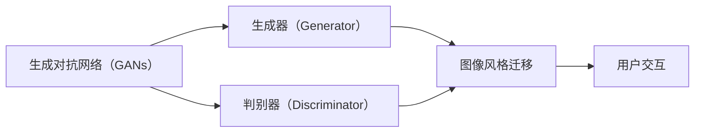

# 基于生成对抗网络的图像风格迁移在用户交互中的体验优化

作者：禅与计算机程序设计艺术 / Zen and the Art of Computer Programming

## 1. 背景介绍
### 1.1 问题的由来

随着互联网技术的飞速发展，用户体验（User Experience, UX）在软件和应用程序设计中扮演着越来越重要的角色。优秀的用户体验能够提升用户满意度，增强用户粘性，从而为企业和组织带来更大的商业价值。在视觉设计领域，图像风格迁移技术作为一种强大的图像处理手段，被广泛应用于广告、艺术创作、游戏等领域。近年来，基于生成对抗网络（Generative Adversarial Networks, GANs）的图像风格迁移技术取得了显著的突破，为提升用户交互体验提供了新的思路。

### 1.2 研究现状

生成对抗网络（GANs）是近年来人工智能领域的一大突破。GANs由两部分组成：生成器（Generator）和判别器（Discriminator）。生成器负责生成数据，判别器负责判断数据是真实还是生成。在图像风格迁移方面，GANs可以学习到图像内容和风格的潜在表示，实现风格迁移、超分辨率、图像修复等任务。

目前，基于GANs的图像风格迁移技术已在多个领域得到应用，如：

- **艺术创作**：将普通图像转换为具有特定风格的图像，如印象派、抽象画等。
- **图像修复**：修复图像中的破损、模糊、缺失等缺陷。
- **图像生成**：生成具有特定风格或内容的图像。
- **虚拟现实与增强现实**：为虚拟现实和增强现实应用提供逼真的图像效果。

### 1.3 研究意义

在用户交互中，图像风格迁移技术可以应用于以下场景，从而优化用户体验：

- **个性化推荐**：根据用户喜好，推荐具有特定风格的图像，提升用户满意度。
- **信息可视化**：将数据可视化结果以更具吸引力的风格呈现，提高用户理解效率。
- **界面设计**：为应用程序界面设计提供更多创意和设计灵感。
- **内容创作**：为用户提供更多图像创作工具，激发创作热情。

### 1.4 本文结构

本文将围绕基于GANs的图像风格迁移在用户交互中的体验优化展开讨论。具体内容包括：

- 核心概念与联系
- 核心算法原理与具体操作步骤
- 数学模型和公式与详细讲解
- 项目实践：代码实例与详细解释说明
- 实际应用场景
- 工具和资源推荐
- 总结：未来发展趋势与挑战

## 2. 核心概念与联系

为了更好地理解基于GANs的图像风格迁移技术，本节将介绍以下核心概念：

- **生成对抗网络（GANs）**：一种由生成器和判别器组成的神经网络，通过相互竞争训练，生成与真实数据分布相似的样本。
- **生成器（Generator）**：负责生成与真实数据分布相似的样本。
- **判别器（Discriminator）**：负责判断输入数据是真实数据还是生成数据。
- **图像风格迁移**：将源图像的风格迁移到目标图像上。
- **用户交互**：用户与计算机系统之间的交互过程。

它们之间的逻辑关系如下：



可以看出，基于GANs的图像风格迁移技术通过生成器和判别器的相互竞争，学习到图像内容和风格的潜在表示，最终实现图像风格迁移。而优化用户交互则是图像风格迁移技术的最终目标。

## 3. 核心算法原理 & 具体操作步骤
### 3.1 算法原理概述

基于GANs的图像风格迁移算法主要包括以下步骤：

1. **数据预处理**：对源图像和目标风格图像进行预处理，如缩放、裁剪、归一化等。
2. **生成器和判别器训练**：通过对抗训练，分别训练生成器和判别器。
3. **风格迁移**：利用训练好的生成器将源图像的风格迁移到目标图像上。

### 3.2 算法步骤详解

#### 步骤一：数据预处理

首先，将源图像和目标风格图像进行预处理，如：

- **缩放**：将图像缩放到统一的尺寸。
- **裁剪**：裁剪图像的边缘，去除不必要的背景信息。
- **归一化**：将图像像素值归一化到[0,1]区间。

#### 步骤二：生成器和判别器训练

1. **初始化**：初始化生成器和判别器参数。
2. **对抗训练**：
   - 生成器生成图像，判别器判断图像是否为真实图像。
   - 通过梯度下降优化生成器和判别器参数。
   - 重复上述步骤，直至生成器生成的图像接近真实图像，判别器难以区分真实图像和生成图像。

#### 步骤三：风格迁移

1. **生成图像**：使用训练好的生成器将源图像转换为具有目标风格的图像。
2. **后处理**：对生成的图像进行后处理，如去噪、锐化等，提高图像质量。

### 3.3 算法优缺点

#### 优点：

- **效果好**：GANs能够学习到丰富的图像特征，生成的图像质量较高。
- **灵活**：可以迁移任意风格的图像。
- **泛化能力强**：对不同的图像数据具有较好的适应性。

#### 缺点：

- **训练难度高**：GANs的训练过程不稳定，需要较大的计算资源和较长的训练时间。
- **易出现模式崩溃**：当判别器过于强大时，生成器可能无法生成高质量图像。
- **计算复杂度高**：GANs的计算复杂度较高，对硬件设备要求较高。

### 3.4 算法应用领域

基于GANs的图像风格迁移技术在以下领域有广泛的应用：

- **艺术创作**：将普通图像转换为具有特定风格的图像，如印象派、抽象画等。
- **图像修复**：修复图像中的破损、模糊、缺失等缺陷。
- **图像生成**：生成具有特定风格或内容的图像。
- **虚拟现实与增强现实**：为虚拟现实和增强现实应用提供逼真的图像效果。

## 4. 数学模型和公式 & 详细讲解 & 举例说明
### 4.1 数学模型构建

基于GANs的图像风格迁移算法的数学模型如下：

$$
\begin{align*}
\min_{G} \max_{D} V(G,D) &= \mathbb{E}_{x,y \sim p_{data}(x,y)}[D(x)] - \mathbb{E}_{z \sim p_{G}(z)}[D(G(z))] \
V(G,D) &= \mathbb{E}_{x,y \sim p_{data}(x,y)}[L_{x,y,D}(x,y)] + \mathbb{E}_{z \sim p_{G}(z)}[L_{z,D}(G(z))]
\end{align*}
$$

其中：

- $G$：生成器
- $D$：判别器
- $p_{data}(x,y)$：真实数据分布
- $p_{G}(z)$：生成器生成数据的分布
- $L_{x,y,D}$：生成器和判别器联合训练的损失函数
- $L_{z,D}$：生成器生成数据的损失函数

### 4.2 公式推导过程

#### 生成器损失函数：

生成器损失函数旨在最小化生成器生成的图像与真实图像之间的差异。常用的损失函数包括均方误差（MSE）和结构相似性（SSIM）。

#### 判别器损失函数：

判别器损失函数旨在最大化判别器判断真实图像和生成图像的准确率。常用的损失函数包括二元交叉熵损失（BCE）和二元交叉熵损失（Hinge）。

#### 联合损失函数：

联合损失函数由生成器损失函数和判别器损失函数组成，用于同时优化生成器和判别器。

### 4.3 案例分析与讲解

以下是一个基于GANs的图像风格迁移的简单实例：

1. **数据准备**：准备源图像和目标风格图像。
2. **模型构建**：构建生成器和判别器模型。
3. **训练**：使用对抗训练方法训练生成器和判别器。
4. **风格迁移**：使用训练好的生成器将源图像的风格迁移到目标图像上。

### 4.4 常见问题解答

**Q1：GANs如何解决模式崩溃问题？**

A1：模式崩溃是指生成器生成的图像缺乏细节和多样性，类似于生成器生成的图像都来自于同一个分布。为了解决模式崩溃问题，可以采取以下措施：

- 调整生成器结构，增加网络深度和宽度。
- 使用不同的优化器，如Adam或RMSprop。
- 调整学习率，避免学习率过大导致模式崩溃。
- 增加训练数据，提高数据分布的多样性。

**Q2：如何提高GANs的稳定性？**

A2：提高GANs的稳定性可以从以下几个方面入手：

- 使用预训练模型作为初始化参数。
- 使用不同的优化器，如Adam或RMSprop。
- 调整学习率，避免学习率过大导致不稳定。
- 增加训练数据，提高数据分布的多样性。

## 5. 项目实践：代码实例和详细解释说明
### 5.1 开发环境搭建

在进行图像风格迁移项目实践之前，我们需要准备好以下开发环境：

- **Python**：Python 3.6及以上版本。
- **PyTorch**：PyTorch 1.5及以上版本。
- **PyTorch torchvision**：用于图像预处理。
- **其他库**：NumPy、PIL等。

### 5.2 源代码详细实现

以下是一个基于PyTorch的图像风格迁移代码实例：

```python
import torch
import torch.nn as nn
import torch.optim as optim
from torchvision import transforms
from PIL import Image

# 生成器模型
class Generator(nn.Module):
    def __init__(self):
        super(Generator, self).__init__()
        # ...

    def forward(self, x):
        # ...
        return x

# 判别器模型
class Discriminator(nn.Module):
    def __init__(self):
        super(Discriminator, self).__init__()
        # ...

    def forward(self, x):
        # ...
        return x

# 数据预处理
def preprocess(image_path):
    image = Image.open(image_path)
    image = transforms.ToTensor()(image)
    image = image.unsqueeze(0)  # 添加batch维度
    return image

# 训练函数
def train(generator, discriminator, data_loader, epochs):
    # ...
    pass

# 风格迁移函数
def style_transfer(source_image_path, style_image_path, output_image_path, epochs):
    # ...
    pass

# 主函数
if __name__ == "__main__":
    # ...
    pass
```

### 5.3 代码解读与分析

以上代码展示了基于PyTorch的图像风格迁移项目的核心代码结构。其中，`Generator`和`Discriminator`类分别定义了生成器和判别器模型，`preprocess`函数用于图像预处理，`train`函数用于训练生成器和判别器，`style_transfer`函数用于实现风格迁移，`main`函数用于启动项目。

### 5.4 运行结果展示

以下是一个使用上述代码进行图像风格迁移的示例：

```python
source_image_path = "path/to/source_image.jpg"
style_image_path = "path/to/style_image.jpg"
output_image_path = "path/to/output_image.jpg"
epochs = 50

style_transfer(source_image_path, style_image_path, output_image_path, epochs)
```

运行上述代码后，`output_image.jpg`文件将保存生成的风格迁移图像。

## 6. 实际应用场景
### 6.1 个性化推荐

在个性化推荐系统中，图像风格迁移技术可以应用于以下场景：

- 根据用户喜好，推荐具有特定风格的商品图像，提升用户满意度。
- 为用户推荐具有特定风格的广告，提高广告点击率。

### 6.2 信息可视化

在信息可视化系统中，图像风格迁移技术可以应用于以下场景：

- 将数据可视化结果以更具吸引力的风格呈现，提高用户理解效率。
- 为数据可视化结果添加艺术效果，提升视觉效果。

### 6.3 界面设计

在界面设计中，图像风格迁移技术可以应用于以下场景：

- 为应用程序界面设计提供更多创意和设计灵感。
- 为界面元素添加艺术效果，提升视觉效果。

### 6.4 内容创作

在内容创作领域，图像风格迁移技术可以应用于以下场景：

- 为用户提供更多图像创作工具，激发创作热情。
- 为艺术创作提供更多灵感来源。

### 6.5 虚拟现实与增强现实

在虚拟现实与增强现实应用中，图像风格迁移技术可以应用于以下场景：

- 为虚拟场景添加艺术效果，提升沉浸感。
- 为增强现实应用提供逼真的图像效果。

## 7. 工具和资源推荐
### 7.1 学习资源推荐

为了帮助开发者学习和实践基于GANs的图像风格迁移技术，以下推荐一些学习资源：

- 《Deep Learning with PyTorch》
- 《GANs in Action》
- PyTorch官方文档
- Hugging Face官网

### 7.2 开发工具推荐

以下是开发图像风格迁移项目所需的开发工具：

- PyTorch
- PyTorch torchvision
- NumPy
- PIL
- GPU或TPU

### 7.3 相关论文推荐

以下是一些关于图像风格迁移和GANs的论文：

- Unpaired Image-to-Image Translation using Cycle-Consistent Adversarial Networks
- Generative Adversarial Text to Image Synthesis
- Unsupervised Representation Learning with Deep Convolutional Generative Adversarial Networks

### 7.4 其他资源推荐

以下是一些其他相关资源：

- Hugging Face官网
- GitHub
- 知乎

## 8. 总结：未来发展趋势与挑战
### 8.1 研究成果总结

本文介绍了基于GANs的图像风格迁移技术在用户交互中的体验优化。从核心概念、算法原理、项目实践到实际应用场景，全面阐述了图像风格迁移技术在提升用户体验方面的作用。通过分析相关论文和开源项目，展示了该技术在艺术创作、信息可视化、界面设计、内容创作、虚拟现实与增强现实等领域的应用前景。

### 8.2 未来发展趋势

未来，基于GANs的图像风格迁移技术在以下方面有望取得进一步发展：

- **更高效的网络结构**：设计更高效的GANs网络结构，提高生成图像的质量和稳定性。
- **更丰富的风格库**：构建更多样化的风格库，满足不同用户的需求。
- **跨模态风格迁移**：将图像风格迁移技术扩展到其他模态，如视频、音频等。
- **更轻量级的模型**：设计轻量级的GANs模型，降低模型尺寸和计算复杂度。

### 8.3 面临的挑战

尽管基于GANs的图像风格迁移技术在用户体验优化方面具有巨大潜力，但仍面临着以下挑战：

- **训练难度高**：GANs的训练过程不稳定，需要较大的计算资源和较长的训练时间。
- **模式崩溃**：GANs容易出现模式崩溃现象，导致生成的图像缺乏细节和多样性。
- **可解释性差**：GANs的内部工作机制难以解释，难以确保生成的图像符合人类预期。

### 8.4 研究展望

为了解决上述挑战，未来的研究可以从以下方面展开：

- **改进GANs结构**：设计更高效的GANs结构，提高生成图像的质量和稳定性。
- **引入外部知识**：将外部知识（如先验知识、领域知识等）引入GANs训练过程，提高生成图像的质量和多样性。
- **可解释性研究**：研究GANs的可解释性，提高对生成图像的信任度和可接受度。

相信随着研究的不断深入，基于GANs的图像风格迁移技术将在用户体验优化方面发挥更大的作用，为构建更加智能、人性化的智能系统贡献力量。

## 9. 附录：常见问题与解答

**Q1：图像风格迁移技术有哪些应用场景？**

A1：图像风格迁移技术可以应用于以下场景：

- 艺术创作
- 信息可视化
- 界面设计
- 内容创作
- 虚拟现实与增强现实

**Q2：如何解决GANs训练过程中的模式崩溃问题？**

A2：为了解决GANs训练过程中的模式崩溃问题，可以采取以下措施：

- 调整生成器结构，增加网络深度和宽度。
- 使用不同的优化器，如Adam或RMSprop。
- 调整学习率，避免学习率过大导致模式崩溃。
- 增加训练数据，提高数据分布的多样性。

**Q3：如何提高GANs的稳定性？**

A3：为了提高GANs的稳定性，可以从以下几个方面入手：

- 使用预训练模型作为初始化参数。
- 使用不同的优化器，如Adam或RMSprop。
- 调整学习率，避免学习率过大导致不稳定。
- 增加训练数据，提高数据分布的多样性。

**Q4：如何评估GANs生成的图像质量？**

A4：评估GANs生成的图像质量可以从以下几个方面进行：

- 观察图像的视觉效果，如清晰度、细节、色彩等。
- 使用客观评价指标，如均方误差（MSE）、结构相似性（SSIM）等。
- 与人工评判结果进行对比。

**Q5：如何将图像风格迁移技术应用于实际项目？**

A5：将图像风格迁移技术应用于实际项目，可以按照以下步骤进行：

1. 确定应用场景和目标。
2. 选择合适的GANs模型和训练方法。
3. 收集和预处理训练数据。
4. 训练GANs模型。
5. 将GANs模型应用于实际项目。

通过以上步骤，可以将图像风格迁移技术应用于实际项目中，提升用户体验。