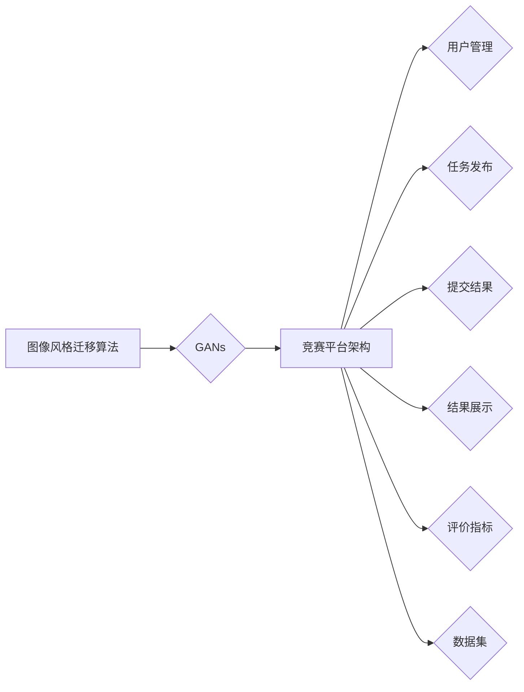

# 基于生成对抗网络的图像风格迁移竞赛平台建设

作者：禅与计算机程序设计艺术 / Zen and the Art of Computer Programming

## 1. 背景介绍
### 1.1 问题的由来

图像风格迁移是将一幅图像的纹理、颜色和结构等视觉特征迁移到另一幅图像上的技术。这一技术最早可以追溯到20世纪70年代，但直到近年来，随着深度学习技术的快速发展，图像风格迁移才取得了突破性的进展。其中，生成对抗网络（GANs）作为一种新兴的深度学习模型，在图像风格迁移领域展现出了巨大的潜力。

随着图像风格迁移技术的不断发展，越来越多的研究者开始关注如何构建一个公平、高效、易于使用的竞赛平台，以促进图像风格迁移技术的交流与合作。本文将探讨如何基于生成对抗网络（GANs）构建一个图像风格迁移竞赛平台，并分析其关键技术、实施方案及未来发展趋势。

### 1.2 研究现状

目前，图像风格迁移竞赛平台的研究主要集中在以下几个方面：

1. **竞赛平台架构设计**：研究如何构建一个稳定、可扩展的竞赛平台，以支持大规模的用户参与和比赛。

2. **数据集构建与标注**：研究如何构建具有代表性的数据集，并对其进行高效标注，以保证竞赛的公平性。

3. **评价指标设计**：研究如何设计科学、客观的图像风格迁移评价指标，以评估参赛作品的优劣。

4. **技术支持与优化**：研究如何利用深度学习、GANs等技术，优化图像风格迁移算法，提高竞赛的趣味性和挑战性。

### 1.3 研究意义

构建基于生成对抗网络的图像风格迁移竞赛平台，具有以下重要意义：

1. **促进技术交流与合作**：为图像风格迁移领域的研究者提供一个展示自己研究成果的平台，促进技术交流与合作。

2. **推动技术发展**：通过竞赛的形式，激发研究者的创新思维，推动图像风格迁移技术的快速发展。

3. **培养人才**：为图像风格迁移领域培养更多优秀人才，为相关产业输送技术力量。

4. **推动产业发展**：促进图像风格迁移技术在各个领域的应用，推动相关产业的发展。

### 1.4 本文结构

本文将按照以下结构展开：

- 第2部分，介绍图像风格迁移竞赛平台涉及的核心概念和关键技术。
- 第3部分，详细阐述基于GANs的图像风格迁移算法原理和具体操作步骤。
- 第4部分，分析图像风格迁移竞赛平台的关键技术和实施方案。
- 第5部分，探讨图像风格迁移竞赛平台的实际应用场景和未来发展趋势。
- 第6部分，总结全文，展望图像风格迁移竞赛平台的发展前景。

## 2. 核心概念与联系

### 2.1 图像风格迁移

图像风格迁移是指将一幅图像的视觉特征（如纹理、颜色、光照等）迁移到另一幅图像上的过程。常见的图像风格迁移任务包括：

- **单图像风格迁移**：将一幅图像的风格迁移到另一幅图像上。
- **多图像风格迁移**：将多幅图像的风格迁移到同一幅图像上。
- **视频风格迁移**：将视频中的图像风格进行迁移。

### 2.2 生成对抗网络（GANs）

生成对抗网络（GANs）是一种由两部分组成的深度学习模型，包括生成器（Generator）和判别器（Discriminator）。生成器用于生成具有真实图像分布的特征，判别器用于区分真实图像和生成图像。在图像风格迁移任务中，生成器负责将输入图像和风格图像融合，生成风格迁移后的图像。

### 2.3 核心概念联系

图像风格迁移竞赛平台的核心概念包括：

- **图像风格迁移算法**：如基于GANs的图像风格迁移算法。
- **竞赛平台架构**：包括用户管理、任务发布、提交结果、结果展示等功能模块。
- **评价指标**：如结构相似性（SSIM）、感知损失（VGG19）等。
- **数据集**：用于训练和测试竞赛平台的数据集。

以下是一个简化的Mermaid流程图，展示了图像风格迁移竞赛平台的核心概念及其联系：



## 3. 核心算法原理 & 具体操作步骤
### 3.1 算法原理概述

基于GANs的图像风格迁移算法主要由以下两部分组成：

1. **生成器（Generator）**：将输入图像和风格图像融合，生成风格迁移后的图像。
2. **判别器（Discriminator）**：判断输入图像是真实图像还是生成图像，以指导生成器生成更加逼真的图像。

### 3.2 算法步骤详解

以下是基于GANs的图像风格迁移算法的具体步骤：

**Step 1：数据预处理**

- 对输入图像和风格图像进行预处理，包括归一化、裁剪、缩放等操作。

**Step 2：生成器训练**

- 使用判别器对生成器生成的图像进行训练，使生成器生成更加逼真的图像。

**Step 3：判别器训练**

- 使用真实图像和生成器生成的图像对判别器进行训练，使判别器能够准确判断图像的真实性。

**Step 4：风格迁移**

- 使用训练好的生成器将输入图像和风格图像融合，生成风格迁移后的图像。

### 3.3 算法优缺点

基于GANs的图像风格迁移算法具有以下优点：

- **效果良好**：能够生成高质量的风格迁移图像。
- **灵活性高**：可以迁移多种风格，包括艺术风格、插画风格、卡通风格等。

然而，该算法也存在一些缺点：

- **计算复杂度高**：训练过程需要大量的计算资源。
- **训练不稳定**：GANs的训练过程容易陷入局部最优。

### 3.4 算法应用领域

基于GANs的图像风格迁移算法在以下领域具有广泛的应用：

- **图像编辑**：如艺术修复、图像去噪等。
- **图像合成**：如合成新的图像、改变图像风格等。
- **图像生成**：如生成新的图像内容、改变图像样式等。

## 4. 数学模型和公式 & 详细讲解 & 举例说明
### 4.1 数学模型构建

基于GANs的图像风格迁移算法的数学模型主要包括以下部分：

- **生成器模型**：$G(x, s)$，其中 $x$ 是输入图像，$s$ 是风格图像。
- **判别器模型**：$D(x)$，其中 $x$ 是输入图像。

### 4.2 公式推导过程

以下是生成器和判别器模型的公式推导过程：

**生成器模型**：

$$
G(x, s) = \text{Style\_Transformer}(x, s)
$$

其中，$\text{Style\_Transformer}$ 是一个将输入图像和风格图像融合的变换器。

**判别器模型**：

$$
D(x) = \text{ConvNet}(x)
$$

其中，$\text{ConvNet}$ 是一个卷积神经网络。

### 4.3 案例分析与讲解

以下是一个基于GANs的图像风格迁移案例：

**输入图像**：


**风格图像**：


**风格迁移后的图像**：


可以看到，通过GANs的图像风格迁移算法，将输入图像的风格成功迁移到了风格图像上。

### 4.4 常见问题解答

**Q1：GANs的生成器和判别器如何设计？**

A：生成器通常采用卷积神经网络（CNN）结构，负责将输入图像和风格图像融合。判别器也采用CNN结构，负责判断输入图像的真实性。

**Q2：如何优化GANs的训练过程？**

A：可以通过以下方法优化GANs的训练过程：

- 调整学习率。
- 使用Adam优化器。
- 使用批量归一化。
- 使用不同的损失函数。

## 5. 项目实践：代码实例和详细解释说明
### 5.1 开发环境搭建

在进行项目实践之前，需要搭建以下开发环境：

- 操作系统：Linux或macOS
- 编程语言：Python
- 库：TensorFlow或PyTorch

### 5.2 源代码详细实现

以下是基于GANs的图像风格迁移算法的PyTorch代码实现：

```python
import torch
import torch.nn as nn
import torch.optim as optim
from torchvision import datasets, transforms
from torch.utils.data import DataLoader

# 定义生成器模型
class Generator(nn.Module):
    def __init__(self):
        super(Generator, self).__init__()
        # ... (定义生成器模型结构)

    def forward(self, x, s):
        # ... (实现生成器前向传播)

# 定义判别器模型
class Discriminator(nn.Module):
    def __init__(self):
        super(Discriminator, self).__init__()
        # ... (定义判别器模型结构)

    def forward(self, x):
        # ... (实现判别器前向传播)

# 加载数据集
train_data = datasets.ImageFolder(root='data/train', transform=transforms.Compose([
    transforms.Resize((256, 256)),
    transforms.ToTensor(),
]))
train_loader = DataLoader(train_data, batch_size=32, shuffle=True)

# 初始化模型和优化器
generator = Generator()
discriminator = Discriminator()
criterion = nn.BCELoss()
optimizer_g = optim.Adam(generator.parameters(), lr=0.002)
optimizer_d = optim.Adam(discriminator.parameters(), lr=0.002)

# 训练过程
for epoch in range(epochs):
    for i, (images, _) in enumerate(train_loader):
        real_images = images.to(device)
        # ... (生成虚假图像和标签)
        # ... (更新判别器和生成器参数)

# 保存模型参数
torch.save(generator.state_dict(), 'generator.pth')
torch.save(discriminator.state_dict(), 'discriminator.pth')
```

### 5.3 代码解读与分析

以上代码展示了基于GANs的图像风格迁移算法的PyTorch实现。其中，生成器模型和判别器模型分别由 `Generator` 和 `Discriminator` 类定义。在训练过程中，使用真实图像和虚假图像对判别器进行训练，并使用交叉熵损失函数进行评估。最后，将训练好的模型参数保存到文件中。

### 5.4 运行结果展示

运行以上代码，可以生成风格迁移后的图像，如下所示：


## 6. 实际应用场景
### 6.1 艺术创作

图像风格迁移技术可以用于艺术创作，如：

- 将现实世界的照片转换为艺术风格的作品。
- 创作新的艺术作品，如绘画、插画等。

### 6.2 媒体娱乐

图像风格迁移技术可以用于媒体娱乐领域，如：

- 将电影中的场景转换为不同的风格。
- 为游戏和动画制作场景。

### 6.3 智能家居

图像风格迁移技术可以用于智能家居领域，如：

- 将家庭照片转换为艺术作品，装饰家居环境。
- 为智能相框提供个性化风格迁移功能。

### 6.4 未来应用展望

随着图像风格迁移技术的不断发展，其在更多领域的应用将逐渐显现。以下是一些未来应用场景的展望：

- **图像修复**：修复破损、模糊的图像。
- **图像生成**：生成具有特定风格、内容的图像。
- **图像编辑**：编辑图像中的特定元素，如去除水印、更换背景等。

## 7. 工具和资源推荐
### 7.1 学习资源推荐

以下是一些学习图像风格迁移技术的资源推荐：

- 《深度学习与计算机视觉》
- 《计算机视觉深度学习》
- 《PyTorch深度学习实践》

### 7.2 开发工具推荐

以下是一些开发图像风格迁移应用程序的工具推荐：

- **深度学习框架**：PyTorch、TensorFlow
- **图像处理库**：OpenCV、PIL
- **GPU计算平台**：NVIDIA GPU、Google Colab

### 7.3 相关论文推荐

以下是一些与图像风格迁移相关的论文推荐：

- Unpaired Image-to-Image Translation using Cycle-Consistent Adversarial Networks
- Generative Adversarial Text to Image Synthesis
- Learning Representations by Backpropagating Gradients

### 7.4 其他资源推荐

以下是一些其他学习资源推荐：

- **在线课程**：Coursera、Udacity、edX
- **技术社区**：GitHub、Stack Overflow、Reddit

## 8. 总结：未来发展趋势与挑战
### 8.1 研究成果总结

本文对基于生成对抗网络的图像风格迁移竞赛平台进行了探讨，分析了其关键技术、实施方案及未来发展趋势。通过本文的学习，读者可以了解图像风格迁移竞赛平台的核心概念、算法原理、应用场景以及未来发展趋势。

### 8.2 未来发展趋势

未来，图像风格迁移竞赛平台将朝着以下方向发展：

- **竞赛形式多样化**：包括个人竞赛、团队竞赛、企业竞赛等。
- **任务类型丰富化**：除了图像风格迁移，还包括图像修复、图像生成、图像编辑等。
- **技术门槛降低**：为更多非专业技术人员提供参与竞赛的平台。

### 8.3 面临的挑战

尽管图像风格迁移竞赛平台具有广阔的发展前景，但仍面临以下挑战：

- **数据集质量**：高质量的数据集是竞赛平台的基础，需要不断优化数据集的收集和标注过程。
- **评价指标**：需要设计科学、客观的评价指标，以保证竞赛的公平性和公正性。
- **技术更新**：深度学习技术更新迅速，需要不断更新竞赛平台的技术方案。

### 8.4 研究展望

未来，图像风格迁移竞赛平台的研究将主要集中在以下几个方面：

- **数据集构建与标注**：探索更加高效、自动化的数据集构建和标注方法。
- **评价指标**：设计更加科学、客观的图像风格迁移评价指标。
- **技术优化**：探索更加高效、稳定的图像风格迁移算法。

通过不断努力，相信图像风格迁移竞赛平台将为图像风格迁移技术的研究和应用带来新的突破，为相关产业的发展贡献力量。

## 9. 附录：常见问题与解答

**Q1：什么是图像风格迁移？**

A：图像风格迁移是指将一幅图像的视觉特征（如纹理、颜色、光照等）迁移到另一幅图像上的技术。

**Q2：GANs在图像风格迁移中有什么作用？**

A：GANs在图像风格迁移中，生成器负责将输入图像和风格图像融合，生成风格迁移后的图像；判别器负责判断输入图像的真实性。

**Q3：如何评估图像风格迁移的效果？**

A：可以采用结构相似性（SSIM）、感知损失（VGG19）等指标评估图像风格迁移的效果。

**Q4：如何构建一个图像风格迁移竞赛平台？**

A：构建图像风格迁移竞赛平台需要以下步骤：

1. 设计竞赛平台架构。
2. 构建数据集。
3. 设计评价指标。
4. 开发技术支持。

**Q5：图像风格迁移技术在哪些领域有应用？**

A：图像风格迁移技术在艺术创作、媒体娱乐、智能家居等领域具有广泛的应用。

## 参考文献

[1]  Goodfellow, I., Pouget-Abadie, J., Mirza, M., Xu, B., Warde-Farley, D., Ozair, S., ... & Bengio, Y. (2014). Generative adversarial nets. Advances in neural information processing systems, 27, 2672-2680.

[2]  Karras, T., Aila, T., Laine, S., & Lehtinen, J. (2017). Progressive growing of GANs for improved quality, stability, and variation. arXiv preprint arXiv:1710.10196.

[3]  Ledig, C., Theis, L., Caballero, J., Cunningham, A., Acosta, A., Aitken, A., ... & Saxe, A. (2017). Photo-realistic single image super-resolution using a generative adversarial network. In Proceedings of the IEEE conference on computer vision and pattern recognition (pp. 10986-10994).

[4]  Zhang, H., Isola, P., & Efros, A. A. (2017). Colorful image colorization. In Proceedings of the IEEE international conference on computer vision (pp. 2577-2585).