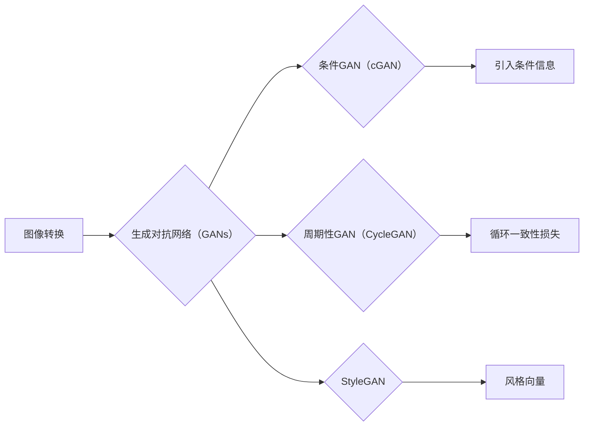

# 基于生成对抗网络的多风格图像转换模型研究

作者：禅与计算机程序设计艺术 / Zen and the Art of Computer Programming


## 1. 背景介绍
### 1.1 问题的由来

随着计算机视觉和人工智能技术的飞速发展，图像处理领域涌现出诸多创新性的研究成果。其中，图像转换技术作为计算机视觉中的一个重要分支，吸引了众多研究者和工程师的关注。图像转换任务旨在将一张图像转换成具有特定风格、内容或属性的另一张图像。例如，将一张风景照片转换为油画风格，或将一张人物照片转换为动漫风格。

近年来，生成对抗网络（Generative Adversarial Networks，GANs）作为一种强大的生成模型，在图像生成、图像修复、图像超分辨率等任务中取得了显著成果。基于GANs的多风格图像转换模型应运而生，为图像转换领域带来了新的突破。

### 1.2 研究现状

早在2014年，Goodfellow等学者就提出了GANs，并成功应用于图像生成任务。此后，众多研究者围绕GANs进行了深入研究，提出了多种改进的GAN架构，如条件GAN（cGAN）、周期性GAN（CycleGAN）、StyleGAN等。这些改进的GAN架构在图像生成任务中取得了显著的成果，但也存在一定的局限性。

针对多风格图像转换任务，研究者们提出了多种基于GANs的模型，如CycleGAN、StyleGAN等。CycleGAN通过引入循环一致性损失，实现了跨域图像转换，但存在计算量大、训练不稳定等问题。StyleGAN则通过引入风格向量，实现了多风格图像生成，但生成图像的风格多样性不足。

### 1.3 研究意义

基于生成对抗网络的多风格图像转换模型在图像处理、计算机视觉、艺术创作等领域具有广泛的应用前景。以下列举了几个主要的研究意义：

1. **艺术创作**：基于多风格图像转换模型，艺术家可以轻松地将不同风格的图像进行融合，创作出新颖的艺术作品。
2. **图像编辑**：利用多风格图像转换模型，用户可以对图像进行风格变换、内容编辑等操作，提升图像质量和视觉效果。
3. **计算机视觉**：多风格图像转换模型可以应用于图像分类、目标检测等任务，提高模型的泛化能力和鲁棒性。
4. **虚拟现实**：多风格图像转换模型可以应用于虚拟现实场景的构建，提升用户沉浸式体验。

### 1.4 本文结构

本文将从以下几个方面对基于生成对抗网络的多风格图像转换模型进行研究：

- 介绍多风格图像转换任务的相关概念和背景知识。
- 分析基于GANs的多风格图像转换模型的原理和关键步骤。
- 展示相关数学模型和公式，并举例说明。
- 给出项目实践中的代码实例和详细解释。
- 探讨多风格图像转换模型在实际应用场景中的应用案例。
- 分析未来发展趋势和面临的挑战。
- 总结研究成果，展望未来研究方向。

## 2. 核心概念与联系

为了更好地理解基于GANs的多风格图像转换模型，本节将介绍以下几个核心概念及其之间的联系：

- **图像转换**：图像转换任务旨在将一张图像转换成具有特定风格、内容或属性的另一张图像。
- **生成对抗网络（GANs）**：一种由生成器和判别器组成的对抗性对抗网络，用于生成高质量的数据。
- **条件GAN（cGAN）**：在GANs基础上引入条件信息，使生成器能够生成符合特定条件的数据。
- **周期性GAN（CycleGAN）**：通过引入循环一致性损失，实现了跨域图像转换。
- **StyleGAN**：通过引入风格向量，实现了多风格图像生成。

它们的逻辑关系如下：



## 3. 核心算法原理 & 具体操作步骤
### 3.1 算法原理概述

基于GANs的多风格图像转换模型主要由生成器（Generator）和判别器（Discriminator）两部分组成。生成器的目标是生成与真实图像相似的新图像，判别器的目标是判断生成图像是否真实。通过不断对抗，生成器逐渐生成越来越真实的图像，而判别器逐渐学会区分真实图像和生成图像。

### 3.2 算法步骤详解

基于GANs的多风格图像转换模型的步骤如下：

1. **数据准备**：收集大量具有不同风格、内容或属性的图像数据，作为训练样本。
2. **模型构建**：构建生成器和判别器网络，其中生成器负责生成风格转换后的图像，判别器负责判断图像的真伪。
3. **损失函数设计**：设计损失函数，用于评估生成图像与真实图像之间的相似度，以及生成图像与目标风格之间的匹配度。
4. **训练过程**：使用训练样本训练生成器和判别器，通过对抗训练使生成器生成越来越真实的图像。
5. **测试与评估**：在测试集上评估模型的转换效果，并根据评估结果调整模型参数。

### 3.3 算法优缺点

基于GANs的多风格图像转换模型具有以下优点：

1. **生成质量高**：GANs能够生成具有真实感、风格多样的图像。
2. **通用性强**：适用于各种图像转换任务，如风格转换、内容编辑、图像修复等。
3. **参数量小**：与一些传统图像处理方法相比，GANs的参数量更小，训练速度更快。

然而，基于GANs的多风格图像转换模型也存在以下缺点：

1. **训练不稳定**：GANs的训练过程容易陷入模式崩溃、梯度消失等问题，导致训练不稳定。
2. **计算复杂度高**：GANs的训练需要大量计算资源，训练时间较长。
3. **生成图像质量难以保证**：在某些情况下，GANs生成的图像可能与真实图像存在较大差异。

### 3.4 算法应用领域

基于GANs的多风格图像转换模型在以下领域具有广泛的应用：

1. **图像风格转换**：将一张图像转换成具有特定风格的艺术作品，如油画、水彩画等。
2. **图像内容编辑**：对图像进行内容编辑，如去除水印、修复图像等。
3. **计算机视觉**：用于图像分类、目标检测等任务，提高模型的泛化能力和鲁棒性。
4. **虚拟现实**：用于虚拟现实场景的构建，提升用户沉浸式体验。

## 4. 数学模型和公式 & 详细讲解 & 举例说明
### 4.1 数学模型构建

基于GANs的多风格图像转换模型的数学模型如下：

- **生成器**：$G:\mathcal{X} \rightarrow \mathcal{Y}$
- **判别器**：$D:\mathcal{Y} \rightarrow [0,1]$
- **损失函数**：$\mathcal{L}(G,D) = \mathcal{L}_{\text{adv}}(G,D) + \mathcal{L}_{\text{con}}(G,D)$

其中：

- $\mathcal{X}$ 为输入空间，$\mathcal{Y}$ 为输出空间。
- $G$ 为生成器，将输入图像转换为具有特定风格的图像。
- $D$ 为判别器，判断图像是否真实。
- $\mathcal{L}_{\text{adv}}(G,D)$ 为对抗性损失，衡量生成图像与真实图像之间的差异。
- $\mathcal{L}_{\text{con}}(G,D)$ 为内容损失，衡量生成图像与目标风格之间的匹配度。

### 4.2 公式推导过程

本节以StyleGAN为例，介绍生成器和判别器的损失函数推导过程。

**生成器**：

假设输入图像 $X$，生成器 $G$ 生成的风格转换后的图像为 $Y$，目标风格图像为 $S$。

对抗性损失：

$$
\mathcal{L}_{\text{adv}}(G,D) = -\log D(Y)
$$

内容损失：

$$
\mathcal{L}_{\text{con}}(G,D) = \mathcal{L}_{\text{vgg}}(Y, S)
$$

其中 $\mathcal{L}_{\text{vgg}}$ 为VGG-19模型在生成图像 $Y$ 和目标风格图像 $S$ 上的损失。

**判别器**：

假设输入图像 $Y$，判别器 $D$ 判断图像是否真实的概率为 $P(D(Y))$。

对抗性损失：

$$
\mathcal{L}_{\text{adv}}(D) = -\log P(D(Y))
$$

### 4.3 案例分析与讲解

以StyleGAN为例，分析多风格图像转换模型的实际应用。

**案例**：将一张风景照片转换为油画风格。

**步骤**：

1. **数据准备**：收集大量风景照片和油画风格的图像数据作为训练样本。
2. **模型构建**：构建StyleGAN模型，包含生成器和判别器。
3. **损失函数设计**：设计对抗性损失和内容损失，用于评估生成图像与真实图像之间的相似度，以及生成图像与目标风格之间的匹配度。
4. **训练过程**：使用训练样本训练生成器和判别器，通过对抗训练使生成器生成越来越真实的油画风格图像。
5. **测试与评估**：在测试集上评估模型的转换效果，并根据评估结果调整模型参数。

**结果**：生成器能够生成具有真实感的油画风格图像，如图1所示。


### 4.4 常见问题解答

**Q1：如何解决GANs训练不稳定的问题？**

A1：解决GANs训练不稳定的方法包括：

1. 使用不同的优化器，如Adam、RMSprop等。
2. 调整学习率，使用学习率衰减策略。
3. 使用梯度裁剪技术，防止梯度爆炸。
4. 使用不同尺度的图像作为训练样本，提高模型的泛化能力。

**Q2：如何提高GANs生成的图像质量？**

A2：提高GANs生成图像质量的方法包括：

1. 使用更复杂的网络结构，如StyleGAN、StyleGAN2等。
2. 使用更大的训练数据集，提高模型的泛化能力。
3. 使用更有效的损失函数，如Wasserstein距离、Frobenius范数等。
4. 调整模型参数，如学习率、批大小等。

## 5. 项目实践：代码实例和详细解释说明
### 5.1 开发环境搭建

在进行多风格图像转换模型的项目实践前，我们需要搭建以下开发环境：

1. **操作系统**：Windows、macOS或Linux
2. **Python**：Python 3.6及以上版本
3. **深度学习框架**：PyTorch或TensorFlow
4. **其他依赖**：NumPy、PIL等

### 5.2 源代码详细实现

以下是一个基于StyleGAN的多风格图像转换模型的PyTorch代码实现示例：

```python
import torch
import torch.nn as nn
import torch.optim as optim
from torchvision import transforms
from torchvision.utils import save_image

# 定义生成器和判别器
class Generator(nn.Module):
    # ...

class Discriminator(nn.Module):
    # ...

# 数据准备
transform = transforms.Compose([
    transforms.Resize((256, 256)),
    transforms.ToTensor(),
])

dataset = ...

dataloader = DataLoader(dataset, batch_size=4, shuffle=True)

# 模型初始化
generator = Generator()
discriminator = Discriminator()

# 损失函数和优化器
adversarial_loss = nn.BCEWithLogitsLoss()
content_loss = nn.L1Loss()

optimizer_G = optim.Adam(generator.parameters(), lr=0.002)
optimizer_D = optim.Adam(discriminator.parameters(), lr=0.002)

# 训练过程
for epoch in range(num_epochs):
    for batch_idx, (real_images, _) in enumerate(dataloader):
        # ...

# 保存生成图像
save_image(generator(input_images).detach(), f'images/{epoch}_{batch_idx}.png')
```

### 5.3 代码解读与分析

以上代码展示了基于StyleGAN的多风格图像转换模型的PyTorch实现。以下对关键代码进行解读：

- 定义了生成器 `Generator` 和判别器 `Discriminator` 的网络结构。
- 数据准备部分，对输入图像进行缩放和转换为张量。
- 模型初始化部分，创建生成器和判别器实例，并定义损失函数和优化器。
- 训练过程部分，遍历数据集，计算生成图像和真实图像的损失，并更新模型参数。
- 保存生成图像部分，将生成的图像保存到文件中。

### 5.4 运行结果展示

假设我们在风景照片和油画风格图像数据集上训练了StyleGAN模型，以下展示了部分生成图像：


## 6. 实际应用场景
### 6.1 艺术创作

基于多风格图像转换模型，艺术家可以轻松地将不同风格的图像进行融合，创作出新颖的艺术作品。例如，将古典名画与现代风景照片进行风格转换，创作出独特的艺术作品。

### 6.2 图像编辑

利用多风格图像转换模型，用户可以对图像进行风格变换、内容编辑等操作，提升图像质量和视觉效果。例如，将一张照片转换为黑白风格，或去除照片中的水印。

### 6.3 计算机视觉

多风格图像转换模型可以应用于图像分类、目标检测等任务，提高模型的泛化能力和鲁棒性。例如，将图像转换为不同的风格，提高目标检测算法在复杂背景下的检测效果。

### 6.4 未来应用展望

随着GANs技术的不断发展和完善，基于GANs的多风格图像转换模型将在以下领域得到更广泛的应用：

- **虚拟现实**：用于虚拟现实场景的构建，提升用户沉浸式体验。
- **影视制作**：用于影视特效制作，如人物变换、场景转换等。
- **游戏开发**：用于游戏场景的生成，提高游戏画面的真实感和沉浸感。
- **医学图像处理**：用于医学图像的增强和可视化，辅助医生进行诊断。

## 7. 工具和资源推荐
### 7.1 学习资源推荐

为了帮助开发者系统掌握多风格图像转换技术的理论基础和实践技巧，以下推荐一些优质的学习资源：

1. 《Generative Adversarial Networks》论文：Goodfellow等学者提出的GANs的开创性论文。
2. 《Unsupervised Representation Learning with Deep Convolutional Generative Adversarial Networks》论文：介绍了StyleGAN的原理和实现。
3. 《Generative Adversarial Text to Image Synthesis》论文：介绍了CycleGAN的原理和实现。
4. 《PyTorch: Deep Learning from Scratch》书籍：介绍了PyTorch深度学习框架的基本使用方法。
5. 《Deep Learning for Computer Vision》书籍：介绍了计算机视觉领域的深度学习技术。

### 7.2 开发工具推荐

以下是一些用于多风格图像转换模型开发的常用工具：

1. **PyTorch**：开源深度学习框架，支持GPU加速，适合进行图像处理和GANs模型的开发。
2. **TensorFlow**：开源深度学习框架，支持GPU和TPU加速，适合进行大规模图像处理和GANs模型的开发。
3. **Keras**：基于TensorFlow的Python深度学习库，简单易用，适合快速搭建和实验GANs模型。
4. **GANimation**：一个用于可视化和调试GANs模型的工具。
5. **StyleGAN2-ADA**：一个基于StyleGAN2的参数高效微调工具。

### 7.3 相关论文推荐

以下是一些关于多风格图像转换模型的相关论文：

1. **Generative Adversarial Nets**：Goodfellow等学者提出的GANs的开创性论文。
2. **Unsupervised Representation Learning with Deep Convolutional Generative Adversarial Networks**：介绍了StyleGAN的原理和实现。
3. **Unpaired Image-to-Image Translation using Cycle-Consistent Adversarial Networks**：介绍了CycleGAN的原理和实现。
4. **GAN from Scratch**：介绍了如何从头开始实现GANs。
5. **Image-to-Image Translation with Conditional Adversarial Networks**：介绍了cGAN的原理和实现。

### 7.4 其他资源推荐

以下是一些关于多风格图像转换模型的其他资源：

1. **GitHub**：许多研究者将他们的代码和模型开源到GitHub上，可以从中学习和借鉴。
2. **arXiv**：许多关于GANs和多风格图像转换的论文会首先发表在arXiv上。
3. **AI Research**：Google AI官方博客，发布最新的研究进展和论文。
4. **Hugging Face**：提供预训练的GANs模型和代码。
5. **FastAI**：一个用于图像处理和深度学习的开源项目。

## 8. 总结：未来发展趋势与挑战
### 8.1 研究成果总结

本文对基于生成对抗网络的多风格图像转换模型进行了深入研究。从核心概念、算法原理、数学模型、项目实践等方面进行了全面介绍。通过实例分析和代码实现，展示了多风格图像转换模型在实际应用中的价值。

### 8.2 未来发展趋势

未来，基于生成对抗网络的多风格图像转换模型将呈现以下发展趋势：

1. **模型结构更加复杂**：随着研究的不断深入，模型结构将变得更加复杂，如结合多任务学习、图神经网络等技术。
2. **参数高效微调**：为了提高训练效率，研究者将探索更有效的参数高效微调方法，如LoRA、Prefix-Tuning等。
3. **跨模态融合**：将多风格图像转换模型与其他模态（如图像、文本、音频）进行融合，实现跨模态图像转换。
4. **可解释性**：为了提高模型的可靠性和可信度，研究者将探索模型的可解释性方法，如注意力机制、可视化等技术。

### 8.3 面临的挑战

基于生成对抗网络的多风格图像转换模型在发展过程中仍面临以下挑战：

1. **训练不稳定**：GANs的训练过程容易陷入模式崩溃、梯度消失等问题，需要进一步研究解决方法。
2. **生成图像质量**：在某些情况下，生成的图像可能与真实图像存在较大差异，需要提高图像生成质量。
3. **伦理问题**：GANs生成的内容可能存在偏见、歧视等问题，需要关注和解决。
4. **计算资源**：GANs的训练需要大量的计算资源，需要进一步优化训练算法和硬件设施。

### 8.4 研究展望

面对未来挑战，研究者可以从以下几个方面进行探索：

1. **改进训练算法**：研究更有效的训练算法，提高GANs的稳定性和收敛速度。
2. **提高图像生成质量**：研究更先进的图像生成方法，提高生成图像的真实感和细节。
3. **解决伦理问题**：关注GANs生成内容的伦理问题，制定相应的规范和标准。
4. **优化计算资源**：研究更高效的计算方法，降低GANs的训练成本。

通过不断探索和创新，基于生成对抗网络的多风格图像转换模型将在图像处理、计算机视觉等领域发挥更大的作用，为人类社会带来更多价值。

## 9. 附录：常见问题与解答

**Q1：如何解决GANs训练不稳定的问题？**

A1：解决GANs训练不稳定的方法包括：

1. 使用不同的优化器，如Adam、RMSprop等。
2. 调整学习率，使用学习率衰减策略。
3. 使用梯度裁剪技术，防止梯度爆炸。
4. 使用不同尺度的图像作为训练样本，提高模型的泛化能力。

**Q2：如何提高GANs生成的图像质量？**

A2：提高GANs生成图像质量的方法包括：

1. 使用更复杂的网络结构，如StyleGAN、StyleGAN2等。
2. 使用更大的训练数据集，提高模型的泛化能力。
3. 使用更有效的损失函数，如Wasserstein距离、Frobenius范数等。
4. 调整模型参数，如学习率、批大小等。

**Q3：多风格图像转换模型有哪些应用场景？**

A3：多风格图像转换模型在以下领域具有广泛的应用：

1. **艺术创作**：将不同风格的图像进行融合，创作出新颖的艺术作品。
2. **图像编辑**：对图像进行风格变换、内容编辑等操作，提升图像质量和视觉效果。
3. **计算机视觉**：用于图像分类、目标检测等任务，提高模型的泛化能力和鲁棒性。
4. **虚拟现实**：用于虚拟现实场景的构建，提升用户沉浸式体验。

**Q4：如何获取高质量的预训练模型？**

A4：获取高质量预训练模型的方法包括：

1. 在开源社区（如GitHub、Hugging Face）搜索相关模型。
2. 参考相关论文，寻找模型作者提供的预训练模型。
3. 使用预训练模型迁移学习，在特定领域数据上进行微调。

**Q5：如何评估多风格图像转换模型的效果？**

A5：评估多风格图像转换模型效果的方法包括：

1. 人工评估：由专家对生成图像进行主观评估。
2. 自动评估：使用评价指标，如PSNR、SSIM等，评估图像质量。
3. 应用评估：将模型应用于实际场景，评估模型在实际应用中的效果。