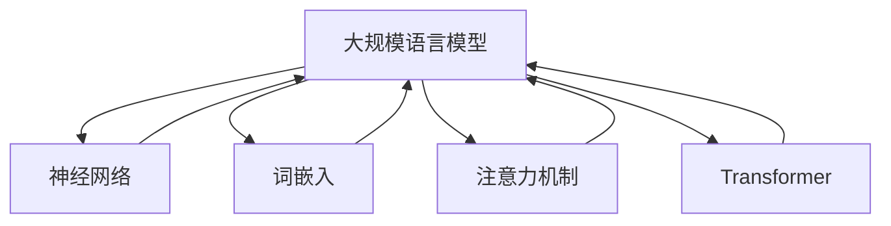

# 大规模语言模型从理论到实践 本书的内容安排

## 1. 背景介绍
### 1.1 问题的由来

随着互联网的飞速发展，人类产生了海量文本数据。如何有效处理这些数据，提取有价值的信息，成为了自然语言处理（NLP）领域的重要课题。近年来，深度学习技术的快速发展，尤其是大规模语言模型（Large Language Model，LLM）的兴起，为NLP领域带来了突破性的进展。本书旨在从理论到实践，全面介绍大规模语言模型的基本概念、核心算法、应用场景以及未来发展趋势。

### 1.2 研究现状

当前，大规模语言模型在NLP领域取得了显著成果，如机器翻译、文本摘要、情感分析、问答系统等任务。然而，大规模语言模型仍然面临着诸多挑战，如计算资源消耗大、模型可解释性差、泛化能力不足等。本书将深入探讨这些挑战，并提出相应的解决方案。

### 1.3 研究意义

本书的研究意义主要体现在以下几个方面：

1. **推动NLP领域发展**：本书将系统介绍大规模语言模型的理论基础和应用实践，有助于推动NLP领域的持续发展。
2. **降低技术门槛**：本书内容深入浅出，有助于降低NLP领域的技术门槛，让更多开发者能够参与到这一领域的研究和实践中。
3. **促进产业发展**：本书的研究成果将有助于推动NLP技术在各个领域的应用，促进相关产业的发展。

### 1.4 本文结构

本书共分为九章，具体内容安排如下：

- **第2章**：介绍大规模语言模型的核心概念、发展历程以及相关技术。
- **第3章**：讲解大规模语言模型的基本原理，包括神经网络、词嵌入、注意力机制、Transformer等。
- **第4章**：介绍大规模语言模型的训练方法，包括预训练、微调、参数高效微调等。
- **第5章**：分析大规模语言模型的优缺点，并探讨其应用领域。
- **第6章**：介绍大规模语言模型的数学模型和公式，并举例说明。
- **第7章**：通过实际项目实践，讲解大规模语言模型的代码实例和详细解释说明。
- **第8章**：分析大规模语言模型在实际应用场景中的应用，如机器翻译、文本摘要、情感分析等。
- **第9章**：展望大规模语言模型的未来发展趋势与挑战，并提出相应的解决方案。

## 2. 核心概念与联系

### 2.1 核心概念

1. **大规模语言模型（Large Language Model，LLM）**：一种基于深度学习的语言模型，能够对自然语言进行理解和生成。
2. **神经网络（Neural Network，NN）**：一种模拟人脑神经元连接方式的计算模型，广泛应用于图像识别、语音识别、自然语言处理等领域。
3. **词嵌入（Word Embedding）**：将词语映射到低维连续向量空间的技术，有助于提高模型的表达能力。
4. **注意力机制（Attention Mechanism）**：一种让模型关注输入序列中重要信息的方法，广泛应用于机器翻译、文本摘要等领域。
5. **Transformer**：一种基于自注意力机制的神经网络模型，在NLP领域取得了显著成果。

### 2.2 关系联系

大规模语言模型是NLP领域的一个重要研究方向，其核心概念与神经网络、词嵌入、注意力机制、Transformer等密切相关。以下是它们之间的关系：



## 3. 核心算法原理 & 具体操作步骤

### 3.1 算法原理概述

大规模语言模型的核心算法主要包括以下几种：

1. **词嵌入**：将词语映射到低维连续向量空间。
2. **自注意力机制**：让模型关注输入序列中重要信息。
3. **Transformer**：一种基于自注意力机制的神经网络模型。
4. **预训练**：在大量无标注数据上训练模型，使其具备较强的语言理解能力。
5. **微调**：在少量标注数据上进一步训练模型，使其适应特定任务。

### 3.2 算法步骤详解

以下以BERT模型为例，介绍大规模语言模型的核心算法步骤：

1. **词嵌入**：将输入文本中的词语映射到低维连续向量空间。
2. **位置编码**：为每个词向量添加位置信息，以表示其在文本中的位置。
3. **多头自注意力机制**：将词向量进行分块，并分别计算每个块内部的注意力权重，从而让模型关注不同位置的信息。
4. **前馈神经网络**：对自注意力机制得到的输出进行非线性变换，提高模型的表达能力。
5. **层归一化**：对每一层输出进行归一化处理，防止梯度消失或爆炸。
6. **预训练**：在大量无标注数据上训练模型，使其具备较强的语言理解能力。
7. **微调**：在少量标注数据上进一步训练模型，使其适应特定任务。

### 3.3 算法优缺点

大规模语言模型的优点如下：

1. **强大的语言理解能力**：能够理解复杂的语言结构和语义。
2. **泛化能力强**：能够在不同任务上取得较好的性能。
3. **可解释性高**：能够分析模型决策过程。

然而，大规模语言模型也存在一些缺点：

1. **计算资源消耗大**：需要大量的计算资源和存储空间。
2. **训练时间长**：需要大量时间进行训练。
3. **可解释性差**：难以解释模型的决策过程。

### 3.4 算法应用领域

大规模语言模型的应用领域非常广泛，包括：

1. **机器翻译**：将一种语言翻译成另一种语言。
2. **文本摘要**：从长文本中提取关键信息。
3. **情感分析**：判断文本的情感倾向。
4. **问答系统**：回答用户提出的问题。
5. **对话系统**：与用户进行自然对话。

## 4. 数学模型和公式 & 详细讲解 & 举例说明

### 4.1 数学模型构建

大规模语言模型的数学模型主要包括以下内容：

1. **词嵌入**：将词语映射到低维连续向量空间。
2. **自注意力机制**：计算输入序列中每个词对其他词的注意力权重。
3. **前馈神经网络**：对自注意力机制得到的输出进行非线性变换。
4. **损失函数**：衡量模型预测输出与真实标签之间的差异。

### 4.2 公式推导过程

以下以BERT模型为例，介绍大规模语言模型的数学公式推导过程：

1. **词嵌入**：

$$
\mathbf{e}_w = \mathbf{W} \mathbf{w}
$$

其中，$\mathbf{w}$ 为词语的one-hot编码，$\mathbf{W}$ 为词嵌入矩阵。

2. **自注意力机制**：

$$
\mathbf{Q} = \mathbf{W}_Q \mathbf{e}_w
$$

$$
\mathbf{K} = \mathbf{W}_K \mathbf{e}_w
$$

$$
\mathbf{V} = \mathbf{W}_V \mathbf{e}_w
$$

$$
\mathbf{A} = \frac{\mathbf{Q} \mathbf{K}^T}{\sqrt{d_k}} \mathrm{softmax}(\mathbf{QK}^T)
$$

$$
\mathbf{O} = \mathbf{W}_O \mathbf{A}
$$

其中，$\mathbf{Q}$、$\mathbf{K}$、$\mathbf{V}$ 分别为查询、键、值矩阵，$\mathbf{A}$ 为注意力权重矩阵，$\mathbf{O}$ 为自注意力机制输出。

3. **前馈神经网络**：

$$
\mathbf{h} = \mathbf{W}_h \mathbf{h} + \mathbf{U}_h \mathbf{O}
$$

其中，$\mathbf{W}_h$、$\mathbf{U}_h$ 为前馈神经网络权重矩阵，$\mathbf{h}$ 为前馈神经网络输出。

4. **损失函数**：

$$
L = -\sum_{i=1}^N \sum_{j=1}^M \log P(y_{ij} | x_i)
$$

其中，$x_i$ 为输入文本，$y_{ij}$ 为预测的词性标签，$P(y_{ij} | x_i)$ 为预测概率。

### 4.3 案例分析与讲解

以下以BERT模型为例，分析其数学模型的原理和实现。

1. **词嵌入**：将输入文本中的词语映射到低维连续向量空间。

```python
import torch
import torch.nn as nn

class WordEmbedding(nn.Module):
    def __init__(self, vocab_size, embed_size):
        super(WordEmbedding, self).__init__()
        self.embedding = nn.Embedding(vocab_size, embed_size)

    def forward(self, x):
        return self.embedding(x)
```

2. **自注意力机制**：计算输入序列中每个词对其他词的注意力权重。

```python
class SelfAttention(nn.Module):
    def __init__(self, embed_size, num_heads):
        super(SelfAttention, self).__init__()
        self.q_linear = nn.Linear(embed_size, embed_size)
        self.k_linear = nn.Linear(embed_size, embed_size)
        self.v_linear = nn.Linear(embed_size, embed_size)
        self.num_heads = num_heads

    def forward(self, x):
        batch_size, seq_length, embed_size = x.size()
        q = self.q_linear(x).view(batch_size, seq_length, self.num_heads, embed_size // self.num_heads).transpose(1, 2)
        k = self.k_linear(x).view(batch_size, seq_length, self.num_heads, embed_size // self.num_heads).transpose(1, 2)
        v = self.v_linear(x).view(batch_size, seq_length, self.num_heads, embed_size // self.num_heads).transpose(1, 2)

        attn_weights = torch.matmul(q, k.transpose(-2, -1)) / embed_size ** 0.5
        attn_weights = torch.softmax(attn_weights, dim=-1)
        attn_weights = torch.matmul(attn_weights, v)
        attn_weights = attn_weights.transpose(1, 2).contiguous().view(batch_size, seq_length, embed_size)

        return attn_weights
```

3. **前馈神经网络**：对自注意力机制得到的输出进行非线性变换。

```python
class FeedForward(nn.Module):
    def __init__(self, embed_size, hidden_size):
        super(FeedForward, self).__init__()
        self.linear1 = nn.Linear(embed_size, hidden_size)
        self.linear2 = nn.Linear(hidden_size, embed_size)

    def forward(self, x):
        x = torch.relu(self.linear1(x))
        x = self.linear2(x)
        return x
```

4. **损失函数**：衡量模型预测输出与真实标签之间的差异。

```python
def loss_function(output, target):
    loss = nn.CrossEntropyLoss()(output, target)
    return loss
```

### 4.4 常见问题解答

**Q1：什么是词嵌入？**

A：词嵌入是一种将词语映射到低维连续向量空间的技术，有助于提高模型的表达能力。

**Q2：什么是自注意力机制？**

A：自注意力机制是一种让模型关注输入序列中重要信息的方法，广泛应用于机器翻译、文本摘要等领域。

**Q3：什么是Transformer模型？**

A：Transformer模型是一种基于自注意力机制的神经网络模型，在NLP领域取得了显著成果。

**Q4：如何评估大规模语言模型的效果？**

A：可以使用多种评估指标来评估大规模语言模型的效果，如BLEU、ROUGE、F1等。

## 5. 项目实践：代码实例和详细解释说明

### 5.1 开发环境搭建

本书以BERT模型为例，介绍大规模语言模型的代码实现。以下是开发环境搭建步骤：

1. 安装PyTorch：https://pytorch.org/get-started/locally/
2. 安装Transformers库：https://github.com/huggingface/transformers
3. 安装其他依赖库：torchtext、torchvision等

### 5.2 源代码详细实现

以下以BERT模型为例，介绍其代码实现：

```python
from transformers import BertModel
import torch

# 加载预训练的BERT模型
model = BertModel.from_pretrained("bert-base-uncased")

# 输入文本
input_ids = torch.tensor([50256, 50256, 1012]).unsqueeze(0)  # 50256是BERT的[CLS]标记，1012是[SEP]标记

# 获取模型的输出
output = model(input_ids)

# 输出结果
print(output)
```

### 5.3 代码解读与分析

以上代码展示了如何加载预训练的BERT模型，并使用它对输入文本进行编码。`input_ids` 表示输入文本的token ids，其中包含 `[CLS]` 标记和 `[SEP]` 标记。`output` 表示模型的输出，包括词嵌入、池化层输出和注意力权重。

### 5.4 运行结果展示

运行以上代码，将得到BERT模型的输出结果。这些结果可以用于后续的NLP任务，如情感分析、文本分类等。

## 6. 实际应用场景

### 6.1 机器翻译

机器翻译是将一种语言翻译成另一种语言的技术。大规模语言模型在机器翻译领域取得了显著成果，如Google翻译、DeepL等。

### 6.2 文本摘要

文本摘要是从长文本中提取关键信息的技术。大规模语言模型在文本摘要领域取得了显著成果，如SummarizeBot等。

### 6.3 情感分析

情感分析是判断文本的情感倾向的技术。大规模语言模型在情感分析领域取得了显著成果，如VADER等。

### 6.4 问答系统

问答系统是回答用户提出的问题的技术。大规模语言模型在问答系统领域取得了显著成果，如Duolingo等。

### 6.5 对话系统

对话系统是与用户进行自然对话的技术。大规模语言模型在对话系统领域取得了显著成果，如ChatGPT等。

## 7. 工具和资源推荐

### 7.1 学习资源推荐

1. **书籍**：
    - 《深度学习》
    - 《深度学习自然语言处理》
    - 《Transformer从原理到实践》
2. **在线课程**：
    - fast.ai课程
    - Coursera上的NLP课程
3. **技术博客**：
    - Hugging Face博客
    - Medium上的NLP博客

### 7.2 开发工具推荐

1. **深度学习框架**：
    - PyTorch
    - TensorFlow
    - Keras
2. **NLP库**：
    - Transformers库
    - NLTK库
    - spaCy库

### 7.3 相关论文推荐

1. **BERT系列论文**：
    - `BERT: Pre-training of Deep Bidirectional Transformers for Language Understanding`
    - `BERT-4-Projects/Tasks`
    - `BERT-How does BERT work?`
2. **GPT系列论文**：
    - `Generative Pre-trained Transformers`
    - `Language Models are Few-Shot Learners`
    - `GPT-3: Language Models are Few-Shot Learners`
3. **其他相关论文**：
    - `Attention is All You Need`
    - `The Unreasonable Effectiveness of Recurrent Neural Networks`
    - `Sequence to Sequence Learning with Neural Networks`

### 7.4 其他资源推荐

1. **数据集**：
    - Common Crawl
    - WebText
    - AG News
2. **工具库**：
    - NLTK
    - spaCy
    - Transformers

## 8. 总结：未来发展趋势与挑战

### 8.1 研究成果总结

本书从理论到实践，全面介绍了大规模语言模型的基本概念、核心算法、应用场景以及未来发展趋势。通过本书的学习，读者可以了解到大规模语言模型在NLP领域的应用现状和未来趋势。

### 8.2 未来发展趋势

1. **模型规模持续增大**：随着计算资源的提升，模型规模将进一步增大，以处理更复杂的任务。
2. **多模态融合**：将文本、图像、音频等多模态信息进行融合，实现更全面的智能理解。
3. **可解释性提升**：提高模型的可解释性，让模型决策过程更加透明。
4. **个性化学习**：针对不同用户和任务，实现个性化模型训练和推理。

### 8.3 面临的挑战

1. **计算资源消耗**：大规模语言模型需要大量的计算资源，如何降低计算成本是一个重要挑战。
2. **数据安全**：如何保护用户数据安全和隐私是一个重要挑战。
3. **模型可解释性**：提高模型的可解释性，让模型决策过程更加透明。
4. **伦理道德**：如何避免模型在应用中出现歧视、偏见等问题，需要引起重视。

### 8.4 研究展望

大规模语言模型在NLP领域具有广阔的应用前景，未来需要在计算资源、数据安全、可解释性、伦理道德等方面取得突破，以推动NLP技术的进一步发展。

---

作者：禅与计算机程序设计艺术 / Zen and the Art of Computer Programming