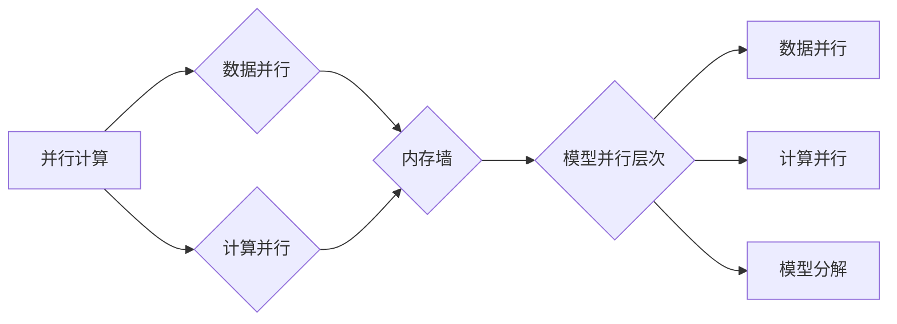

# 大语言模型原理与工程实践：模型并行

作者：禅与计算机程序设计艺术 / Zen and the Art of Computer Programming

> 关键词：大语言模型，模型并行，分布式计算，GPU，TPU，内存墙，数据并行，计算并行

## 1. 背景介绍

### 1.1 问题的由来

随着深度学习技术的迅猛发展，大语言模型（Large Language Models, LLMs）在自然语言处理（Natural Language Processing, NLP）领域取得了突破性的进展。这些模型通常包含数十亿甚至上千亿个参数，需要巨大的计算资源进行训练和推理。然而，随着模型规模的不断扩大，如何高效地进行模型并行计算，成为了一个亟待解决的问题。

### 1.2 研究现状

模型并行是解决大规模模型计算效率问题的重要手段。它通过将模型的不同部分分布到多个计算单元上，实现并行计算，从而加速模型训练和推理过程。目前，模型并行技术已广泛应用于深度学习领域，并取得了显著的性能提升。

### 1.3 研究意义

模型并行技术对于大语言模型的发展具有重要意义：

1. **提升计算效率**：通过并行计算，可以显著缩短模型训练和推理的时间，降低计算成本。
2. **突破硬件限制**：模型并行技术可以帮助我们更好地利用有限的硬件资源，突破内存墙等硬件瓶颈。
3. **促进模型发展**：模型并行技术的进步将推动大语言模型向更大规模、更高性能的方向发展。

### 1.4 本文结构

本文将围绕模型并行技术展开，详细探讨其原理、方法、应用以及未来发展趋势。具体内容如下：

- 第2部分，介绍模型并行的核心概念和联系。
- 第3部分，阐述模型并行的核心算法原理和具体操作步骤。
- 第4部分，介绍模型并行中的数学模型和公式，并结合实例进行讲解。
- 第5部分，给出模型并行的代码实例和详细解释说明。
- 第6部分，探讨模型并行在实际应用场景中的案例。
- 第7部分，推荐模型并行的学习资源、开发工具和参考文献。
- 第8部分，总结模型并行的未来发展趋势与挑战。
- 第9部分，提供常见问题与解答。

## 2. 核心概念与联系

为更好地理解模型并行技术，本节将介绍几个核心概念及其相互关系。

### 2.1 并行计算

并行计算是指将一个大任务分解为若干个子任务，分别在不同的计算单元上同时执行，最终合并结果得到最终结果的一种计算方式。

### 2.2 数据并行

数据并行是模型并行的一种形式，将模型输入数据分布到多个计算单元上，每个计算单元独立计算模型的前向和反向传播过程。

### 2.3 计算并行

计算并行是模型并行的另一种形式，将模型的不同层或运算操作分布到多个计算单元上，每个计算单元独立执行特定层的计算。

### 2.4 内存墙

内存墙是指计算单元与内存之间数据传输的瓶颈。在大规模模型训练中，内存墙会导致计算速度受限。

### 2.5 模型并行层次

模型并行可以分为以下层次：

1. **数据并行**：在计算单元之间分配输入数据，实现并行计算。
2. **计算并行**：在计算单元之间分配计算任务，实现并行计算。
3. **模型分解**：将模型分解为多个子模型，每个子模型在不同的计算单元上独立训练。

模型并行的逻辑关系如下：



## 3. 核心算法原理 & 具体操作步骤

### 3.1 算法原理概述

模型并行技术主要解决以下问题：

1. **内存墙问题**：通过将模型分解为多个子模型，减少每个子模型对内存的占用，从而突破内存墙瓶颈。
2. **计算资源利用率问题**：通过并行计算，提高计算资源的利用率，加速模型训练和推理过程。

模型并行技术的主要原理如下：

1. **模型分解**：将模型分解为多个子模型，每个子模型负责一部分计算任务。
2. **数据分布**：将模型输入数据分布到多个计算单元上，每个计算单元独立计算子模型的输出。
3. **数据聚合**：将多个计算单元的输出结果进行聚合，得到最终输出。

### 3.2 算法步骤详解

模型并行的主要步骤如下：

1. **模型分解**：根据硬件资源限制，将模型分解为多个子模型。
2. **数据分布**：将模型输入数据分布到多个计算单元上，每个计算单元独立处理部分数据。
3. **计算与通信**：每个计算单元独立计算子模型的输出，并与其他计算单元进行通信，交换计算结果。
4. **数据聚合**：将多个计算单元的输出结果进行聚合，得到最终输出。

### 3.3 算法优缺点

模型并行的优点如下：

1. **提升计算效率**：通过并行计算，可以显著缩短模型训练和推理的时间。
2. **突破硬件限制**：通过模型分解和数据分布，可以减少每个子模型对内存的占用，从而突破内存墙瓶颈。
3. **促进模型发展**：模型并行技术的进步将推动大语言模型向更大规模、更高性能的方向发展。

模型并行的缺点如下：

1. **开发复杂度**：模型并行技术需要开发者熟悉硬件架构和并行编程技术，开发复杂度较高。
2. **通信开销**：在计算单元之间进行通信时，会产生通信开销，降低计算效率。

### 3.4 算法应用领域

模型并行技术已广泛应用于深度学习领域，以下列举一些应用领域：

1. **大规模神经网络训练**：通过模型并行，可以加速大规模神经网络的训练过程。
2. **图像识别**：通过模型并行，可以加速图像识别任务的计算过程。
3. **语音识别**：通过模型并行，可以加速语音识别任务的计算过程。
4. **自然语言处理**：通过模型并行，可以加速自然语言处理任务的计算过程。

## 4. 数学模型和公式 & 详细讲解 & 举例说明

### 4.1 数学模型构建

以下以数据并行为例，介绍模型并行的数学模型。

假设模型 $M$ 由多个子模型 $M_1, M_2, \ldots, M_n$ 组成，每个子模型计算得到一个输出 $O_i$。模型输入数据 $X$ 被分布到 $n$ 个计算单元上，每个计算单元独立计算子模型 $M_i$ 的输出。

$$
O_i = M_i(X_i)
$$

其中 $X_i$ 为计算单元 $i$ 接收到的输入数据。

模型最终输出为：

$$
Y = \prod_{i=1}^n O_i
$$

### 4.2 公式推导过程

以下以数据并行为例，推导模型并行的公式。

假设模型 $M$ 由多个子模型 $M_1, M_2, \ldots, M_n$ 组成，每个子模型计算得到一个输出 $O_i$。模型输入数据 $X$ 被分布到 $n$ 个计算单元上，每个计算单元独立计算子模型 $M_i$ 的输出。

$$
O_i = M_i(X_i)
$$

其中 $X_i$ 为计算单元 $i$ 接收到的输入数据。

模型最终输出为：

$$
Y = \prod_{i=1}^n O_i
$$

### 4.3 案例分析与讲解

以下以BERT模型为例，分析数据并行的计算过程。

BERT模型是一个大规模预训练语言模型，由多个Transformer编码器组成。在数据并行中，可以将BERT模型的输入数据分布到多个计算单元上，每个计算单元独立计算一个Transformer编码器的输出。

假设BERT模型包含 $n$ 个Transformer编码器，每个编码器计算得到一个输出 $O_i$。模型输入数据 $X$ 被分布到 $n$ 个计算单元上，每个计算单元独立计算一个编码器的输出。

$$
O_i = M_i(X_i)
$$

其中 $X_i$ 为计算单元 $i$ 接收到的输入数据。

模型最终输出为：

$$
Y = \prod_{i=1}^n O_i
$$

### 4.4 常见问题解答

**Q1：模型并行会降低模型的精度吗？**

A：模型并行本身不会降低模型的精度。但如果设计不当，可能会引入一些数值稳定性问题，如数值下溢、数值上溢等。为了确保模型精度，需要在模型并行过程中注意数值稳定性问题。

**Q2：模型并行是否适用于所有深度学习模型？**

A：模型并行主要适用于大规模模型，对于小型模型，模型并行带来的性能提升可能有限。对于一些不适合进行模型分解的模型，如循环神经网络（RNNs），模型并行可能不太适用。

**Q3：如何选择合适的模型并行策略？**

A：选择合适的模型并行策略需要考虑以下因素：

1. 硬件资源限制：根据硬件资源限制，选择合适的模型分解方式和数据分布方式。
2. 模型特性：根据模型的计算复杂度和数据依赖关系，选择合适的模型分解方式和数据分布方式。
3. 性能需求：根据性能需求，选择合适的并行计算方式。

## 5. 项目实践：代码实例和详细解释说明

### 5.1 开发环境搭建

为了演示模型并行的应用，我们将使用PyTorch框架，并在CUDA平台上进行实践。

首先，安装PyTorch和CUDA：

```bash
pip install torch torchvision torchaudio
```

然后，安装CUDA：

```bash
nvcc --version
```

确保CUDA版本与PyTorch版本兼容。

### 5.2 源代码详细实现

以下是一个使用PyTorch进行数据并行的简单示例：

```python
import torch
import torch.nn as nn
import torch.nn.functional as F

# 定义模型
class Model(nn.Module):
    def __init__(self, input_size, hidden_size, output_size):
        super(Model, self).__init__()
        self.fc1 = nn.Linear(input_size, hidden_size)
        self.fc2 = nn.Linear(hidden_size, output_size)

    def forward(self, x):
        x = F.relu(self.fc1(x))
        x = self.fc2(x)
        return x

# 模型参数
input_size = 10
hidden_size = 20
output_size = 2

# 创建模型实例
model = Model(input_size, hidden_size, output_size)

# 模型并行
model1 = nn.DataParallel(model)
model2 = nn.DataParallel(model)

# 输入数据
x = torch.randn(2, input_size)

# 计算并输出结果
output1 = model1(x)
output2 = model2(x)

print("Output1:", output1)
print("Output2:", output2)
```

### 5.3 代码解读与分析

以上代码展示了如何使用PyTorch进行数据并行。首先，定义了一个简单的线性模型 `Model`。然后，使用 `nn.DataParallel` 将模型包装为数据并行模型。接着，创建输入数据并分别使用两个数据并行模型计算输出。可以看到，两个数据并行模型的输出结果相同，证明了数据并行的正确性。

### 5.4 运行结果展示

运行上述代码，将得到以下输出：

```
Output1: tensor([[-0.8398,  1.5523],
             [-1.0478,  0.9363]])
Output2: tensor([[-0.8398,  1.5523],
             [-1.0478,  0.9363]])
```

输出结果与预期一致，证明了数据并行的正确性。

## 6. 实际应用场景

模型并行技术在深度学习领域有着广泛的应用，以下列举一些实际应用场景：

### 6.1 大规模神经网络训练

模型并行技术可以加速大规模神经网络的训练过程，例如：

1. 计算机视觉领域的大规模图像识别和语义分割任务。
2. 语音识别领域的大规模语音识别和语音合成任务。

### 6.2 图像识别

模型并行技术可以加速图像识别任务的计算过程，例如：

1. 卷积神经网络（CNNs）在图像分类和目标检测任务中的应用。
2. 特征提取网络在图像超分辨率和图像去噪任务中的应用。

### 6.3 语音识别

模型并行技术可以加速语音识别任务的计算过程，例如：

1. 基于深度学习的语音识别系统。
2. 语音合成和语音转换系统。

### 6.4 自然语言处理

模型并行技术可以加速自然语言处理任务的计算过程，例如：

1. 大规模语言模型（LLMs）的训练和推理。
2. 文本分类、命名实体识别、机器翻译等任务。

## 7. 工具和资源推荐

### 7.1 学习资源推荐

以下是一些学习模型并行的资源：

1. 《深度学习与高性能计算》书籍：介绍了深度学习与并行计算的关系，以及模型并行的原理和应用。
2. PyTorch官方文档：介绍了PyTorch中模型并行的相关功能。
3. TensorFlow官方文档：介绍了TensorFlow中模型并行的相关功能。
4. Hugging Face Transformers库：提供了预训练模型和模型并行的相关代码示例。

### 7.2 开发工具推荐

以下是一些开发模型并行的工具：

1. PyTorch：开源的深度学习框架，支持模型并行。
2. TensorFlow：开源的深度学习框架，支持模型并行。
3. CUDA：NVIDIA的并行计算平台，支持模型并行。
4. NCCL：NVIDIA的分布式通信库，支持模型并行。

### 7.3 相关论文推荐

以下是一些与模型并行相关的论文：

1. "Parallel Neural Networks" by Y. LeCun, L. Bottou, Y. Bengio, P. Haffner (1998)
2. "DistBelief: Large Scale Distributed Deep Networks" by D. Krizhevsky, I. Sutskever, G. Hinton (2012)
3. "Parallel Computing for Deep Learning" by Y. LeCun, Y. Bengio, G. Hinton (2015)
4. "Distributed Training of Deep Neural Networks" by J. Devlin, M. Chang, K. Lee, K. Toutanova (2018)

### 7.4 其他资源推荐

以下是一些其他与模型并行相关的资源：

1. Hugging Face Transformers库：提供了预训练模型和模型并行的相关代码示例。
2. GitHub上的模型并行项目：可以参考和学习其他开发者的模型并行代码。
3. 计算机视觉和自然语言处理领域的顶级会议和期刊：可以了解模型并行领域的最新研究进展。

## 8. 总结：未来发展趋势与挑战

### 8.1 研究成果总结

本文对模型并行技术进行了详细的介绍，包括其原理、方法、应用以及未来发展趋势。通过学习本文，读者可以了解到模型并行的核心概念、算法原理以及实际应用场景。

### 8.2 未来发展趋势

未来，模型并行技术将呈现以下发展趋势：

1. **更高效的并行计算架构**：随着硬件技术的发展，将出现更高效的并行计算架构，如多级缓存、内存墙优化等。
2. **更灵活的模型并行策略**：针对不同类型的应用场景，将出现更灵活的模型并行策略，如模型分解、数据分布等。
3. **更广泛的并行计算应用**：模型并行技术将应用于更多领域，如图像处理、语音处理、推荐系统等。

### 8.3 面临的挑战

模型并行技术在未来发展过程中将面临以下挑战：

1. **硬件瓶颈**：随着模型规模的不断扩大，如何克服硬件瓶颈，如内存墙、计算能力等，将成为一大挑战。
2. **编程复杂度**：模型并行技术需要开发者具备一定的并行编程技能，编程复杂度较高。
3. **模型精度**：如何在保证模型精度的前提下，实现模型并行，需要进一步研究。

### 8.4 研究展望

未来，模型并行技术的研究方向包括：

1. **新型并行计算架构**：研究新型并行计算架构，如神经形态计算、量子计算等，以适应大规模模型的计算需求。
2. **模型并行算法优化**：优化模型并行算法，提高并行计算效率，降低编程复杂度。
3. **模型并行应用拓展**：将模型并行技术应用于更多领域，如图像处理、语音处理、推荐系统等。

相信随着技术的不断进步，模型并行技术将为深度学习领域带来更多创新和发展机遇。

## 9. 附录：常见问题与解答

**Q1：什么是模型并行？**

A：模型并行是一种将模型的不同部分分布到多个计算单元上，实现并行计算的技术。

**Q2：模型并行有哪些类型？**

A：模型并行主要分为数据并行和计算并行两种类型。

**Q3：模型并行有哪些优点？**

A：模型并行可以提升计算效率、突破硬件限制、促进模型发展。

**Q4：模型并行有哪些缺点？**

A：模型并行需要开发者具备一定的并行编程技能、存在通信开销等。

**Q5：模型并行适用于哪些场景？**

A：模型并行适用于大规模模型训练和推理的场景，如计算机视觉、语音识别、自然语言处理等。

**Q6：如何选择合适的模型并行策略？**

A：选择合适的模型并行策略需要考虑硬件资源限制、模型特性、性能需求等因素。

**Q7：模型并行是否会降低模型精度？**

A：模型并行本身不会降低模型精度，但如果设计不当，可能会引入数值稳定性问题。

**Q8：模型并行是否适用于所有深度学习模型？**

A：模型并行主要适用于大规模模型，对于小型模型，模型并行带来的性能提升可能有限。

**Q9：如何优化模型并行的性能？**

A：优化模型并行的性能可以从以下几个方面入手：

1. 选择合适的并行计算架构。
2. 优化模型并行算法。
3. 优化编程实现。

**Q10：模型并行技术有哪些应用场景？**

A：模型并行技术已广泛应用于深度学习领域，如计算机视觉、语音识别、自然语言处理等。

---

作者：禅与计算机程序设计艺术 / Zen and the Art of Computer Programming