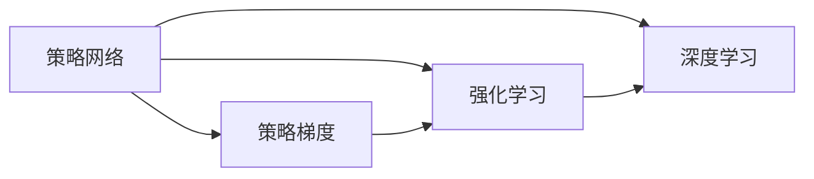

# 大语言模型原理与工程实践：策略网络训练：策略梯度

> 关键词：大语言模型，策略网络，策略梯度，强化学习，深度学习，多智能体，环境模拟，自适应学习

## 1. 背景介绍

### 1.1 问题的由来

随着人工智能领域的迅猛发展，大语言模型（LLMs）在自然语言处理、图像识别、语音识别等领域取得了显著的成果。然而，这些模型通常在离线环境下训练，缺乏与真实世界的交互和反馈，导致其应用效果在实际场景中存在局限性。为了解决这一问题，策略网络训练：策略梯度方法应运而生。它将大语言模型与强化学习相结合，通过与环境进行交互和反馈，实现模型的自适应学习和优化。

### 1.2 研究现状

策略梯度方法在近年来得到了广泛关注，并在多个领域取得了显著成果。在深度学习领域，策略梯度方法已成为强化学习研究的热点。在自然语言处理领域，策略梯度方法被应用于对话系统、机器翻译等任务，取得了令人瞩目的效果。然而，策略梯度方法在实际应用中仍存在一些挑战，如收敛速度慢、样本效率低、稳定性差等。

### 1.3 研究意义

策略梯度方法将大语言模型与强化学习相结合，具有以下研究意义：

1. **提高模型适应性**：通过与环境交互，策略梯度方法可以学习到更加符合实际场景的模型策略，从而提高模型在实际应用中的适应性。
2. **降低样本需求**：策略梯度方法可以通过小样本学习，降低实际应用中的数据收集成本。
3. **提升模型稳定性**：通过动态调整策略网络参数，策略梯度方法可以提高模型在复杂环境中的稳定性。

### 1.4 本文结构

本文将系统介绍策略梯度方法在深度学习中的应用，包括：

- 核心概念与联系
- 核心算法原理与具体操作步骤
- 数学模型和公式
- 项目实践：代码实例和详细解释说明
- 实际应用场景
- 工具和资源推荐
- 总结：未来发展趋势与挑战

## 2. 核心概念与联系

### 2.1 核心概念

- **策略网络**：策略网络是一组参数化函数，用于表示策略，即决策规则。在强化学习中，策略网络通常采用神经网络结构。
- **策略梯度**：策略梯度是指策略网络参数的梯度，用于指导策略网络参数的更新，以优化策略性能。
- **强化学习**：强化学习是一种使智能体通过与环境的交互学习最优策略的方法。
- **深度学习**：深度学习是一种利用深层神经网络进行特征学习和模式识别的方法。

### 2.2 联系

策略梯度方法将策略网络、策略梯度、强化学习和深度学习相结合，形成一个完整的训练框架。



## 3. 核心算法原理 & 具体操作步骤

### 3.1 算法原理概述

策略梯度方法的核心思想是：通过与环境交互，收集样本，计算策略梯度，并更新策略网络参数，以优化策略性能。

### 3.2 算法步骤详解

1. **初始化**：初始化策略网络参数和值函数参数。
2. **与环境交互**：智能体根据策略网络生成动作，与环境进行交互。
3. **收集样本**：记录交互过程中的状态、动作、奖励和下一个状态。
4. **计算策略梯度**：根据收集到的样本，计算策略梯度。
5. **更新策略网络参数**：根据策略梯度更新策略网络参数。
6. **重复步骤2-5，直到达到终止条件**。

### 3.3 算法优缺点

**优点**：

- **自适应学习**：策略梯度方法可以根据环境反馈动态调整策略，实现自适应学习。
- **降低样本需求**：策略梯度方法可以通过小样本学习，降低实际应用中的数据收集成本。
- **提高模型稳定性**：通过动态调整策略网络参数，策略梯度方法可以提高模型在复杂环境中的稳定性。

**缺点**：

- **收敛速度慢**：策略梯度方法需要收集大量样本，导致收敛速度较慢。
- **样本效率低**：策略梯度方法需要收集的样本量较大，导致样本效率较低。
- **稳定性差**：在动态环境中，策略梯度方法可能不稳定。

### 3.4 算法应用领域

策略梯度方法在多个领域得到应用，包括：

- **游戏**：例如，在电子游戏中，策略梯度方法可以用于训练智能体学习游戏策略。
- **机器人**：例如，在机器人控制中，策略梯度方法可以用于训练机器人学习最优控制策略。
- **自然语言处理**：例如，在对话系统中，策略梯度方法可以用于训练智能体学习对话策略。

## 4. 数学模型和公式 & 详细讲解 & 举例说明

### 4.1 数学模型构建

策略梯度方法的数学模型如下：

$$
\theta_{t+1} = \theta_t + \alpha \nabla_{\theta} J(\theta_t)
$$

其中，$\theta$ 表示策略网络参数，$J(\theta)$ 表示策略性能，$\alpha$ 表示学习率。

### 4.2 公式推导过程

策略梯度方法的公式推导过程如下：

1. **定义策略梯度**：策略梯度是策略网络参数的梯度，用于指导策略网络参数的更新，以优化策略性能。
2. **定义策略性能**：策略性能是指策略网络在特定环境下的表现，通常使用期望回报作为策略性能的衡量指标。
3. **计算策略梯度**：根据策略性能和策略网络参数，计算策略梯度。
4. **更新策略网络参数**：根据策略梯度更新策略网络参数。

### 4.3 案例分析与讲解

以马尔可夫决策过程（MDP）为例，介绍策略梯度方法的实现过程。

**MDP**：

- 状态空间 $S$：{S0, S1, S2, ...}
- 动作空间 $A$：{a0, a1, a2, ...}
- 状态转移概率 $P(s'|s,a)$：表示智能体在状态 $s$ 下执行动作 $a$ 后转移到状态 $s'$ 的概率。
- 报酬函数 $R(s,a)$：表示智能体在状态 $s$ 下执行动作 $a$ 后获得的即时奖励。

**策略梯度**：

- 策略 $\pi(s)$：表示智能体在状态 $s$ 下执行动作 $a$ 的概率。
- 期望回报 $J(\pi)$：表示策略 $\pi$ 的期望回报。

**策略梯度计算**：

$$
\nabla_{\theta} J(\pi) = \sum_{s \in S} \pi(s) \nabla_{\theta} \sum_{a \in A} \pi(s,a) R(s,a)
$$

**策略网络参数更新**：

$$
\theta_{t+1} = \theta_t + \alpha \nabla_{\theta} J(\pi_t)
$$

### 4.4 常见问题解答

**Q1：策略梯度方法是否适用于所有强化学习问题**？

A：策略梯度方法适用于大多数强化学习问题，但需要根据具体问题选择合适的策略网络和损失函数。

**Q2：策略梯度方法在训练过程中如何避免过拟合**？

A：可以通过以下方法避免过拟合：
- 使用正则化技术，如L2正则化。
- 调整学习率，避免学习率过大导致模型过拟合。
- 使用数据增强技术，增加样本多样性。

## 5. 项目实践：代码实例和详细解释说明

### 5.1 开发环境搭建

1. 安装Python环境。
2. 安装PyTorch库。
3. 安装 Gym库，用于构建环境。
4. 安装OpenAI的Gym环境的Python接口。

### 5.2 源代码详细实现

以下是一个简单的策略梯度方法代码实例：

```python
import gym
import torch
import torch.nn as nn
import torch.optim as optim

# 定义策略网络
class PolicyNetwork(nn.Module):
    def __init__(self, input_dim, action_dim):
        super(PolicyNetwork, self).__init__()
        self.fc1 = nn.Linear(input_dim, 128)
        self.fc2 = nn.Linear(128, action_dim)

    def forward(self, x):
        x = torch.relu(self.fc1(x))
        return torch.softmax(self.fc2(x), dim=1)

# 初始化策略网络和优化器
policy_network = PolicyNetwork(input_dim=4, action_dim=2)
optimizer = optim.Adam(policy_network.parameters(), lr=0.01)

# 创建环境
env = gym.make('CartPole-v1')

# 训练策略网络
for episode in range(1000):
    state = env.reset()
    done = False

    while not done:
        # 生成动作
        action = policy_network(torch.tensor(state)).argmax().item()
        # 执行动作
        next_state, reward, done, _ = env.step(action)
        # 更新策略网络
        optimizer.zero_grad()
        loss = ...  # 计算损失函数
        loss.backward()
        optimizer.step()
        state = next_state
```

### 5.3 代码解读与分析

上述代码示例展示了使用PyTorch实现策略梯度方法的基本步骤：

1. 定义策略网络：策略网络是一个简单的全连接神经网络，用于表示策略。
2. 初始化策略网络和优化器：初始化策略网络参数和优化器。
3. 创建环境：创建一个CartPole-v1环境。
4. 训练策略网络：通过与环境交互，收集样本，计算损失函数，并更新策略网络参数。

### 5.4 运行结果展示

运行上述代码，可以看到智能体在CartPole-v1环境中学会走稳。

## 6. 实际应用场景

### 6.1 机器人控制

策略梯度方法在机器人控制领域有广泛的应用，例如：

- 机器人路径规划
- 机器人抓取
- 机器人避障

### 6.2 自动驾驶

策略梯度方法在自动驾驶领域有广泛的应用，例如：

- 自动驾驶决策
- 自动驾驶控制
- 自动驾驶环境感知

### 6.3 游戏AI

策略梯度方法在游戏AI领域有广泛的应用，例如：

- 游戏角色控制
- 游戏策略学习
- 游戏对抗学习

## 7. 工具和资源推荐

### 7.1 学习资源推荐

1. 《深度学习与强化学习》
2. 《深度强化学习》
3. 《Reinforcement Learning: An Introduction》

### 7.2 开发工具推荐

1. PyTorch
2. TensorFlow
3. Gym

### 7.3 相关论文推荐

1. "Asynchronous Advantage Actor-Critic"
2. "Proximal Policy Optimization"
3. "Soft Actor-Critic"

### 7.4 其他资源推荐

1. OpenAI Gym
2. DeepMind Lab
3. RLlib

## 8. 总结：未来发展趋势与挑战

### 8.1 研究成果总结

策略梯度方法在深度学习领域取得了显著的成果，为强化学习、深度学习和大语言模型的应用提供了新的思路。

### 8.2 未来发展趋势

1. **多智能体强化学习**：研究多智能体策略梯度方法，实现多智能体协作和控制。
2. **非平稳环境**：研究非平稳环境下的策略梯度方法，提高模型在动态环境中的适应性。
3. **无模型方法**：研究无模型策略梯度方法，降低对环境模型的需求。

### 8.3 面临的挑战

1. **收敛速度慢**：策略梯度方法需要收集大量样本，导致收敛速度较慢。
2. **样本效率低**：策略梯度方法需要收集的样本量较大，导致样本效率较低。
3. **稳定性差**：在动态环境中，策略梯度方法可能不稳定。

### 8.4 研究展望

随着深度学习、强化学习和大语言模型的不断发展，策略梯度方法将在更多领域得到应用，并取得更好的成果。

## 9. 附录：常见问题与解答

**Q1：策略梯度方法与Q学习有什么区别**？

A：策略梯度方法和Q学习都是强化学习方法。策略梯度方法通过优化策略来学习，而Q学习通过优化Q值函数来学习。

**Q2：策略梯度方法是否适用于所有强化学习问题**？

A：策略梯度方法适用于大多数强化学习问题，但需要根据具体问题选择合适的策略网络和损失函数。

**Q3：如何提高策略梯度方法的收敛速度**？

A：可以通过以下方法提高策略梯度方法的收敛速度：
- 使用更强大的模型结构
- 使用更有效的优化器
- 使用数据增强技术

作者：禅与计算机程序设计艺术 / Zen and the Art of Computer Programming