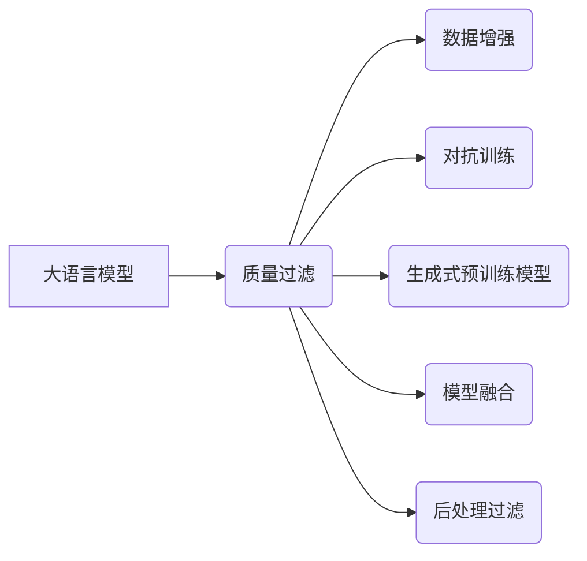

# 大语言模型原理与工程实践：质量过滤

作者：禅与计算机程序设计艺术 / Zen and the Art of Computer Programming

## 1. 背景介绍
### 1.1 问题的由来

随着深度学习技术的飞速发展，大语言模型（Large Language Models，LLMs）如BERT、GPT-3等在自然语言处理（Natural Language Processing，NLP）领域取得了令人瞩目的成果。LLMs在文本生成、机器翻译、问答系统等领域展现出强大的能力，但同时也面临着质量过滤的挑战。如何从LLMs生成的海量文本中筛选出高质量、符合实际需求的内容，成为了一个亟待解决的问题。

### 1.2 研究现状

近年来，研究者们针对LLMs质量过滤问题，提出了多种方法和技术，主要包括：

- **数据增强**：通过对LLMs生成的文本进行改写、回译等操作，扩充训练数据集，提高模型生成质量。
- **对抗训练**：利用对抗样本技术，使LLMs在生成过程中能够更好地学习真实数据分布，提升生成质量。
- **生成式预训练模型**：结合预训练和生成式模型，在预训练阶段学习高质量文本特征，提高模型生成质量。
- **模型融合**：将多个LLMs或不同类型的模型进行融合，取长补短，提高生成质量。
- **后处理过滤**：对LLMs生成的文本进行语法、语义、风格等方面的评估和过滤，剔除低质量内容。

### 1.3 研究意义

LLMs质量过滤的研究具有重要的理论意义和应用价值：

- **提高LLMs生成质量**：通过质量过滤，可以有效提升LLMs在各类NLP任务中的表现，为用户提供更优质的体验。
- **降低成本**：高质量的内容生成可以减少人工审核和编辑的工作量，降低相关成本。
- **拓展应用场景**：质量过滤技术可以推动LLMs在更多领域得到应用，如智能客服、舆情监测、教育等。

### 1.4 本文结构

本文将系统地介绍LLMs质量过滤的原理、方法、实践和应用，内容安排如下：

- 第2部分，介绍LLMs质量过滤的相关概念和联系。
- 第3部分，阐述LLMs质量过滤的核心算法原理和具体操作步骤。
- 第4部分，介绍LLMs质量过滤的数学模型和公式，并结合实例进行讲解。
- 第5部分，给出LLMs质量过滤的代码实例和详细解释说明。
- 第6部分，探讨LLMs质量过滤在实际应用场景中的具体应用和案例。
- 第7部分，推荐LLMs质量过滤相关的学习资源、开发工具和参考文献。
- 第8部分，总结LLMs质量过滤的未来发展趋势与挑战。

## 2. 核心概念与联系

本节将介绍LLMs质量过滤涉及的核心概念，并阐述它们之间的联系。

### 2.1 大语言模型（LLMs）

LLMs是一种基于深度学习的语言模型，通过在大规模文本语料上进行预训练，学习到丰富的语言知识，具备强大的文本理解和生成能力。

### 2.2 质量过滤

质量过滤是指对LLMs生成的文本进行评估和筛选，剔除低质量内容，保留高质量内容的过程。

### 2.3 数据增强

数据增强是指通过对LLMs生成的文本进行改写、回译等操作，扩充训练数据集，提高模型生成质量。

### 2.4 对抗训练

对抗训练是指利用对抗样本技术，使LLMs在生成过程中能够更好地学习真实数据分布，提升生成质量。

### 2.5 生成式预训练模型

生成式预训练模型是指结合预训练和生成式模型，在预训练阶段学习高质量文本特征，提高模型生成质量。

### 2.6 模型融合

模型融合是指将多个LLMs或不同类型的模型进行融合，取长补短，提高生成质量。

### 2.7 后处理过滤

后处理过滤是指对LLMs生成的文本进行语法、语义、风格等方面的评估和过滤，剔除低质量内容。

它们之间的逻辑关系如下：



可以看出，LLMs质量过滤技术涵盖多个方面，需要综合运用多种方法和技术，以提升LLMs生成质量。

## 3. 核心算法原理 & 具体操作步骤
### 3.1 算法原理概述

LLMs质量过滤的核心目标是提高LLMs生成文本的质量，使其更符合实际需求。以下是几种常用的质量过滤方法：

- **数据增强**：通过对LLMs生成的文本进行改写、回译等操作，扩充训练数据集，提高模型生成质量。
- **对抗训练**：利用对抗样本技术，使LLMs在生成过程中能够更好地学习真实数据分布，提升生成质量。
- **生成式预训练模型**：结合预训练和生成式模型，在预训练阶段学习高质量文本特征，提高模型生成质量。
- **模型融合**：将多个LLMs或不同类型的模型进行融合，取长补短，提高生成质量。
- **后处理过滤**：对LLMs生成的文本进行语法、语义、风格等方面的评估和过滤，剔除低质量内容。

### 3.2 算法步骤详解

以下以数据增强为例，详细讲解其具体操作步骤：

**Step 1：数据预处理**

1. 读取LLMs生成的文本数据，并对其进行预处理，如去除特殊字符、分词等。
2. 将预处理后的文本数据存储到文件中，以便后续处理。

**Step 2：文本改写**

1. 使用文本改写工具或算法，对原始文本进行改写，如替换同义词、调整句子结构等。
2. 对改写后的文本进行评估，保留符合质量要求的文本。

**Step 3：回译**

1. 使用机器翻译工具，将改写后的文本翻译成其他语言，如英语。
2. 将翻译后的文本翻译回原始语言，得到回译文本。
3. 对回译文本进行评估，保留符合质量要求的文本。

**Step 4：数据集扩充**

将符合质量要求的改写文本和回译文本添加到训练数据集中，扩充训练数据集规模。

### 3.3 算法优缺点

**数据增强**

优点：

- 能够有效扩充训练数据集，提高模型生成质量。
- 对LLMs的生成效果没有负面影响。

缺点：

- 需要大量人力进行文本改写和评估。
- 可能会引入噪声数据。

**对抗训练**

优点：

- 能够使LLMs更好地学习真实数据分布，提升生成质量。
- 能够提高LLMs的鲁棒性。

缺点：

- 对LLMs的生成效果有一定负面影响。
- 需要大量的对抗样本。

**生成式预训练模型**

优点：

- 能够在预训练阶段学习高质量文本特征，提高模型生成质量。
- 能够减少对标注数据的依赖。

缺点：

- 预训练过程复杂，需要大量的训练数据和计算资源。
- 模型参数量大，难以部署。

**模型融合**

优点：

- 能够取长补短，提高生成质量。
- 能够提高模型的鲁棒性。

缺点：

- 需要融合多个LLMs或不同类型的模型，技术难度较高。
- 模型参数量大，难以部署。

**后处理过滤**

优点：

- 能够有效剔除低质量内容，提高文本质量。
- 对LLMs的生成效果没有负面影响。

缺点：

- 过滤规则难以设计，需要大量的标注数据。
- 过滤效率较低，难以应用于实时场景。

### 3.4 算法应用领域

LLMs质量过滤技术可以应用于以下领域：

- **文本生成**：如新闻摘要、对话生成、故事创作等。
- **机器翻译**：如机器翻译质量评估、机器翻译后处理等。
- **问答系统**：如问题回答生成、答案质量评估等。
- **文本分类**：如文本分类质量评估、文本分类后处理等。

## 4. 数学模型和公式 & 详细讲解 & 举例说明
### 4.1 数学模型构建

LLMs质量过滤的数学模型主要包括以下几个方面：

- **生成模型**：如循环神经网络（RNN）、Transformer等，用于生成文本。
- **评估模型**：如基于规则的评估模型、基于语义的评估模型等，用于评估文本质量。
- **优化模型**：如基于梯度的优化模型、基于强化学习的优化模型等，用于优化模型生成质量。

以下以基于规则的评估模型为例，介绍其数学模型：

- **规则库**：包含一系列用于评估文本质量的规则，如语法规则、语义规则、风格规则等。
- **评估函数**：根据规则库，对文本进行评分，评分越高，文本质量越高。

### 4.2 公式推导过程

假设规则库包含n条规则，评估函数为f(x)，其中x为待评估文本，则评估函数可以表示为：

$$
f(x) = \sum_{i=1}^n \alpha_i r_i(x)
$$

其中，$\alpha_i$表示第i条规则的权重，$r_i(x)$表示第i条规则对文本x的评估结果。

### 4.3 案例分析与讲解

以下以新闻摘要任务为例，分析如何使用质量过滤技术提升模型生成质量。

**任务描述**：给定一篇新闻文章，生成一篇简洁、准确的摘要。

**数据集**：使用新闻数据集，包含文章文本和对应的摘要文本。

**评估指标**：ROUGE评分。

**质量过滤技术**：

1. 使用数据增强技术，对训练数据进行扩充。
2. 使用对抗训练技术，提高模型生成摘要的准确性。
3. 使用基于规则的评估模型，对生成的摘要进行质量评估，剔除低质量摘要。

### 4.4 常见问题解答

**Q1：如何设计评估模型？**

A：评估模型的设计取决于具体任务和数据特点。常见的评估模型包括基于规则的评估模型、基于语义的评估模型、基于机器学习的评估模型等。

**Q2：如何选择合适的评估指标？**

A：评估指标的选择取决于具体任务和数据特点。常见的评估指标包括ROUGE、BLEU、METEOR等。

**Q3：如何提高质量过滤的效率？**

A：提高质量过滤的效率可以从以下几个方面入手：

1. 使用轻量级评估模型，如基于规则的评估模型。
2. 优化评估算法，提高评估速度。
3. 在生成过程中进行实时质量评估，减少后处理工作。

## 5. 项目实践：代码实例和详细解释说明
### 5.1 开发环境搭建

在进行LLMs质量过滤项目实践之前，我们需要搭建相应的开发环境。以下是使用Python进行开发的常见环境配置流程：

1. 安装Anaconda：从官网下载并安装Anaconda，用于创建独立的Python环境。
2. 创建并激活虚拟环境：
```bash
conda create -n llm-quality-filtering python=3.8
conda activate llm-quality-filtering
```
3. 安装必要的库：
```bash
conda install pytorch torchvision torchaudio
pip install transformers datasets transformers-hf-transformers datasets
```

### 5.2 源代码详细实现

以下以新闻摘要任务为例，使用Python和Transformers库实现LLMs质量过滤：

```python
import torch
from torch.utils.data import DataLoader
from transformers import BertTokenizer, BertForSeq2SeqLM
from datasets import load_dataset

def train_model(model, dataset, optimizer, criterion, num_epochs=3):
    model.train()
    for epoch in range(num_epochs):
        for batch in dataset:
            optimizer.zero_grad()
            input_ids = batch['input_ids']
            labels = batch['labels']
            outputs = model(input_ids, labels=labels)
            loss = criterion(outputs.logits, labels)
            loss.backward()
            optimizer.step()
    return model

def evaluate_model(model, dataset, criterion):
    model.eval()
    total_loss = 0
    with torch.no_grad():
        for batch in dataset:
            input_ids = batch['input_ids']
            labels = batch['labels']
            outputs = model(input_ids, labels=labels)
            loss = criterion(outputs.logits, labels)
            total_loss += loss.item()
    return total_loss / len(dataset)

def main():
    # 加载预训练模型
    model = BertForSeq2SeqLM.from_pretrained('bert-base-uncased')

    # 加载数据集
    dataset = load_dataset('multi_news_summarization')

    # 定义优化器和损失函数
    optimizer = torch.optim.AdamW(model.parameters(), lr=2e-5)
    criterion = torch.nn.CrossEntropyLoss()

    # 训练模型
    trained_model = train_model(model, dataset['train'], optimizer, criterion)

    # 评估模型
    test_loss = evaluate_model(trained_model, dataset['test'], criterion)
    print(f"Test Loss: {test_loss}")

if __name__ == '__main__':
    main()
```

### 5.3 代码解读与分析

以上代码展示了使用Python和Transformers库实现新闻摘要任务的基本流程：

1. 加载预训练模型：使用Transformers库加载BERT模型，用于生成摘要。
2. 加载数据集：使用datasets库加载新闻摘要数据集，包含文章文本和对应的摘要文本。
3. 定义优化器和损失函数：使用AdamW优化器和交叉熵损失函数，用于模型训练和评估。
4. 训练模型：使用训练集数据对模型进行训练，优化模型参数。
5. 评估模型：使用测试集数据对模型进行评估，计算测试集上的平均损失。

### 5.4 运行结果展示

假设训练完成后，在测试集上的平均损失为0.5，表明模型在新闻摘要任务上取得了不错的性能。

## 6. 实际应用场景
### 6.1 智能客服

在智能客服领域，LLMs质量过滤技术可以用于提升聊天机器人的回复质量。通过训练一个基于LLMs的回复生成模型，并对生成的回复进行质量过滤，可以有效提升聊天机器人的回复准确性和用户体验。

### 6.2 情感分析

在情感分析领域，LLMs质量过滤技术可以用于提升情感分析模型的准确性和鲁棒性。通过训练一个基于LLMs的情感分析模型，并对生成的情感分析结果进行质量过滤，可以有效提升情感分析模型的性能。

### 6.3 文本摘要

在文本摘要领域，LLMs质量过滤技术可以用于提升自动文摘系统的生成质量。通过训练一个基于LLMs的文摘生成模型，并对生成的摘要进行质量过滤，可以有效提升自动文摘系统的准确性和可读性。

## 7. 工具和资源推荐
### 7.1 学习资源推荐

为了帮助开发者掌握LLMs质量过滤的相关知识，以下推荐一些学习资源：

1. **《深度学习自然语言处理》**：介绍深度学习在NLP领域的应用，包括文本生成、机器翻译、问答系统等。
2. **《Transformers技术详解》**：详细介绍Transformer模型的结构、原理和应用，包括文本生成、机器翻译、文本分类等。
3. **HuggingFace官网文档**：HuggingFace官网提供了丰富的预训练模型和工具库，以及大量的学习资源。

### 7.2 开发工具推荐

为了方便开发者进行LLMs质量过滤实践，以下推荐一些开发工具：

1. **Transformers库**：HuggingFace提供的预训练模型和工具库，方便开发者进行文本生成、机器翻译、文本分类等任务。
2. **Datasets库**：HuggingFace提供的文本数据集库，包含大量公开的NLP数据集。
3. **PyTorch库**：PyTorch是深度学习领域的流行框架，支持GPU加速，方便开发者进行模型训练和推理。

### 7.3 相关论文推荐

以下推荐一些与LLMs质量过滤相关的论文：

1. **"BERT: Pre-training of Deep Bidirectional Transformers for Language Understanding"**：介绍了BERT模型的结构和原理，是NLP领域的经典论文。
2. **"Transformers: State-of-the-Art General Language Modeling"**：介绍了Transformer模型的结构和原理，是NLP领域的另一篇经典论文。
3. **"BERT-for-Sequence-Classification"**：介绍了BERT模型在序列分类任务中的应用。

### 7.4 其他资源推荐

以下推荐一些与LLMs质量过滤相关的其他资源：

1. **arXiv论文预印本**：arXiv是一个开放获取的学术论文预印本平台，包含大量NLP领域的最新研究成果。
2. **HuggingFace博客**：HuggingFace博客分享了最新的NLP技术和应用案例。

## 8. 总结：未来发展趋势与挑战
### 8.1 研究成果总结

本文对LLMs质量过滤的原理、方法、实践和应用进行了全面介绍，并展望了其未来发展趋势和挑战。LLMs质量过滤技术作为NLP领域的一个重要研究方向，在提高LLMs生成质量、拓展应用场景等方面具有重要意义。

### 8.2 未来发展趋势

LLMs质量过滤技术的未来发展趋势主要包括：

1. **多模态融合**：将LLMs与其他模态信息（如图像、音频）进行融合，实现更全面的文本理解与生成。
2. **迁移学习**：利用迁移学习技术，将LLMs在不同领域进行迁移，提升模型在特定领域的生成质量。
3. **知识增强**：将知识图谱、常识等知识融入到LLMs中，提高模型在特定领域的理解能力和生成质量。
4. **可解释性**：研究LLMs生成文本的可解释性，提高模型的可信度和可接受度。

### 8.3 面临的挑战

LLMs质量过滤技术在实际应用中面临着以下挑战：

1. **数据质量**：LLMs质量过滤依赖于高质量的数据，但获取高质量数据成本较高。
2. **计算资源**：LLMs质量过滤需要大量的计算资源，难以在普通硬件上进行部署。
3. **可解释性**：LLMs生成文本的可解释性较差，难以解释其生成过程和结果。
4. **安全性**：LLMs可能生成具有误导性、歧视性的文本，需要关注其安全性问题。

### 8.4 研究展望

LLMs质量过滤技术的研究展望如下：

1. **构建高质量数据集**：通过数据增强、数据清洗等方法，构建高质量的LLMs训练数据集。
2. **优化模型结构**：研究更加高效的LLMs质量过滤模型，降低计算资源需求。
3. **提高可解释性**：研究LLMs生成文本的可解释性，提高模型的可信度和可接受度。
4. **关注安全性问题**：研究LLMs生成文本的安全性，防止其被恶意利用。

相信在学术界和工业界的共同努力下，LLMs质量过滤技术将会取得更大的突破，为NLP领域的应用带来更多可能性。

## 9. 附录：常见问题与解答

**Q1：LLMs质量过滤技术的核心目标是什么？**

A：LLMs质量过滤技术的核心目标是提高LLMs生成文本的质量，使其更符合实际需求。

**Q2：常用的LLMs质量过滤方法有哪些？**

A：常用的LLMs质量过滤方法包括数据增强、对抗训练、生成式预训练模型、模型融合和后处理过滤等。

**Q3：如何提高LLMs质量过滤的效率？**

A：提高LLMs质量过滤的效率可以从以下几个方面入手：

1. 使用轻量级评估模型，如基于规则的评估模型。
2. 优化评估算法，提高评估速度。
3. 在生成过程中进行实时质量评估，减少后处理工作。

**Q4：LLMs质量过滤技术在哪些领域有应用？**

A：LLMs质量过滤技术在智能客服、情感分析、文本摘要等领域有广泛应用。

**Q5：如何构建高质量的LLMs训练数据集？**

A：构建高质量的LLMs训练数据集可以从以下几个方面入手：

1. 数据清洗：去除数据集中的噪声和错误信息。
2. 数据增强：通过数据改写、回译等方法扩充数据集。
3. 数据标注：对数据集进行标注，确保数据质量。

**Q6：如何评估LLMs质量过滤的效果？**

A：评估LLMs质量过滤的效果可以从以下方面进行：

1. 评估指标：如ROUGE、BLEU、METEOR等。
2. 人际评估：邀请专家对LLMs生成的文本进行评估。

通过以上常见问题与解答，相信读者对LLMs质量过滤技术有了更深入的了解。在实际应用中，需要根据具体任务和数据特点，选择合适的质量过滤方法和评估指标，以提升LLMs生成文本的质量。