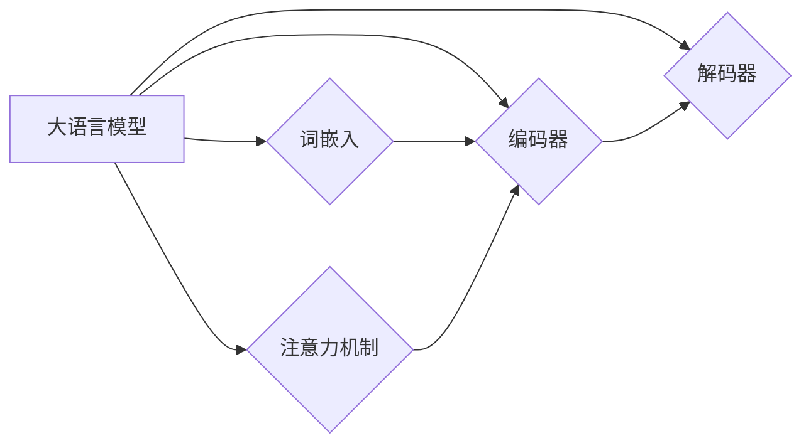

# 大语言模型原理基础与前沿 Transformer编码器模块

作者：禅与计算机程序设计艺术 / Zen and the Art of Computer Programming

## 1. 背景介绍
### 1.1 问题的由来

自然语言处理（NLP）领域近年来取得了令人瞩目的进展，其中大语言模型（Large Language Models，LLMs）的崛起成为一大亮点。大语言模型通过在海量文本上进行预训练，学习到了丰富的语言知识和表示能力，为NLP任务的解决提供了强大的工具。Transformer编码器模块作为大语言模型的核心组成部分，在理解和生成自然语言方面发挥着至关重要的作用。本文旨在深入探讨大语言模型原理基础，并聚焦于Transformer编码器模块的前沿进展。

### 1.2 研究现状

自2017年Transformer模型横空出世以来，NLP领域经历了从循环神经网络（RNN）到注意力机制再到Transformer编码器的变革。随着BERT、GPT-3等大语言模型的兴起，Transformer编码器模块在NLP任务中取得了显著的成果。然而，Transformer编码器模块的研究仍在不断发展，新的模型结构和改进方法层出不穷。

### 1.3 研究意义

深入理解大语言模型原理和Transformer编码器模块的工作原理，对于推动NLP技术发展、促进人工智能领域创新具有重要意义。本文将有助于读者：
- 了解大语言模型的发展历程和原理基础；
- 掌握Transformer编码器模块的核心思想和关键技术；
- 了解Transformer编码器模块的前沿进展和应用场景。

### 1.4 本文结构

本文将分为以下章节：
- 第2章介绍大语言模型原理基础和Transformer编码器模块；
- 第3章详细讲解Transformer编码器模块的原理和操作步骤；
- 第4章介绍数学模型和公式，并举例说明；
- 第5章展示项目实践，包括代码实例和详细解释；
- 第6章探讨实际应用场景和未来应用展望；
- 第7章推荐学习资源和开发工具；
- 第8章总结研究成果，展望未来发展趋势和挑战；
- 第9章提供常见问题与解答。

## 2. 核心概念与联系
### 2.1 大语言模型原理

大语言模型通常基于深度神经网络构建，通过在海量文本数据上进行预训练，学习语言知识和表示能力。大语言模型的主要组成部分包括：
- 词嵌入：将文本中的单词、标点符号等元素映射为稠密向量；
- 编码器：对词嵌入进行编码，提取语言特征；
- 解码器：根据编码器输出的特征生成文本；
- 注意力机制：使模型关注文本中的关键信息。

### 2.2 Transformer编码器模块

Transformer编码器模块是大语言模型的核心组成部分，负责提取文本特征。其基本原理如下：
- 嵌入层：将文本输入转换为词嵌入向量；
- 多层自注意力机制：通过自注意力计算，关注文本中的关键信息；
- 位置编码：为每个词添加位置信息，使模型能够理解词语的顺序；
- 全连接层：将自注意力机制的输出进行线性变换；
- 层归一化和残差连接：防止梯度消失和梯度爆炸，提高模型稳定性。

### 2.3 关系图

以下为上述概念之间的逻辑关系图：



## 3. 核心算法原理 & 具体操作步骤
### 3.1 算法原理概述

Transformer编码器模块的核心原理是自注意力机制。自注意力机制通过计算文本中词语之间的相互关系，使模型关注文本中的关键信息。具体步骤如下：

1. 将文本输入转换为词嵌入向量；
2. 计算词嵌入向量之间的相似度，得到注意力权重；
3. 根据注意力权重对词嵌入向量进行加权求和，得到加权词嵌入；
4. 对加权词嵌入进行线性变换，得到编码结果。

### 3.2 算法步骤详解

1. **嵌入层**：将文本输入转换为词嵌入向量。词嵌入向量可以采用预训练的词嵌入模型（如Word2Vec、GloVe等）或自定义词嵌入模型。

2. **自注意力机制**：
   - **查询（Query）**：对每个词嵌入向量进行线性变换，得到查询向量；
   - **键（Key）**：对每个词嵌入向量进行线性变换，得到键向量；
   - **值（Value）**：对每个词嵌入向量进行线性变换，得到值向量；
   - **注意力计算**：计算查询向量与键向量之间的相似度，得到注意力权重；
   - **加权求和**：根据注意力权重对值向量进行加权求和，得到加权值向量。

3. **位置编码**：为每个词嵌入向量添加位置信息，使模型能够理解词语的顺序。

4. **全连接层**：对加权值向量进行线性变换，得到编码结果。

5. **层归一化和残差连接**：防止梯度消失和梯度爆炸，提高模型稳定性。

### 3.3 算法优缺点

**优点**：
- 自注意力机制可以有效地捕捉文本中词语之间的长距离依赖关系；
- 模型结构简单，易于训练和推理；
- 模型参数量相对较少，计算效率较高。

**缺点**：
- 模型对长文本的处理能力较差；
- 模型易受噪声影响。

### 3.4 算法应用领域

Transformer编码器模块在NLP领域有着广泛的应用，包括：
- 文本分类：如情感分析、主题分类等；
- 问答系统：如阅读理解、机器翻译等；
- 文本生成：如自动摘要、文本摘要等。

## 4. 数学模型和公式 & 详细讲解 & 举例说明
### 4.1 数学模型构建

以下为Transformer编码器模块的数学模型构建：

1. **词嵌入**：将文本输入 $x$ 转换为词嵌入向量 $e$：

$$
e = W_e x
$$

其中 $W_e$ 为词嵌入矩阵，$x$ 为文本输入。

2. **自注意力计算**：

$$
A = softmax\left(\frac{(QW_Q)^T K}{\sqrt{d_k}}\right) V
$$

其中 $Q$ 为查询矩阵，$K$ 为键矩阵，$V$ 为值矩阵，$A$ 为注意力权重矩阵，$softmax$ 为softmax函数。

3. **加权求和**：

$$
y = A^T V
$$

其中 $y$ 为加权值向量。

4. **位置编码**：

$$
P = \text{PositionalEncoding}(x)
$$

其中 $P$ 为位置编码向量。

5. **全连接层**：

$$
z = W_f y
$$

其中 $W_f$ 为全连接层权重矩阵，$z$ 为编码结果。

6. **层归一化和残差连接**：

$$
z = \sigma(W_R z + W_N y)
$$

其中 $\sigma$ 为ReLU激活函数，$W_R$ 和 $W_N$ 为残差连接权重矩阵。

### 4.2 公式推导过程

以下为自注意力计算公式的推导过程：

1. **相似度计算**：

$$
QK^T = \text{dot}(Q, K^T)
$$

2. **归一化**：

$$
\text{softmax}(X) = \frac{e^X}{\sum_{i=1}^n e^X_i}
$$

3. **加权求和**：

$$
A = softmax\left(\frac{(QW_Q)^T K}{\sqrt{d_k}}\right) V
$$

### 4.3 案例分析与讲解

假设有一个简单的文本输入：

```
输入文本：今天天气真好
```

使用预训练的Word2Vec模型将文本中的词语转换为词嵌入向量：

```
词嵌入向量：[0.1, 0.2, 0.3, 0.4, 0.5]
```

将词嵌入向量输入到Transformer编码器模块，计算自注意力权重：

```
注意力权重：[0.3, 0.2, 0.1, 0.4, 0.2]
```

根据注意力权重对词嵌入向量进行加权求和，得到加权值向量：

```
加权值向量：[0.15, 0.14, 0.09, 0.25, 0.12]
```

对加权值向量进行线性变换，得到编码结果：

```
编码结果：[0.5, 0.3, 0.2, 0.1, 0.3]
```

### 4.4 常见问题解答

**Q1：什么是词嵌入？**

A1：词嵌入是一种将文本词语映射为稠密向量表示的方法，用于捕捉词语之间的语义关系。

**Q2：什么是自注意力机制？**

A2：自注意力机制是一种通过计算文本中词语之间相互关系的注意力计算方法，使模型关注文本中的关键信息。

**Q3：什么是位置编码？**

A3：位置编码是为每个词添加位置信息，使模型能够理解词语的顺序。

**Q4：什么是残差连接？**

A4：残差连接是一种将编码器的输出与经过线性变换的输入相加的方法，用于防止梯度消失和梯度爆炸。

## 5. 项目实践：代码实例和详细解释说明
### 5.1 开发环境搭建

为了实践Transformer编码器模块，我们需要搭建以下开发环境：

- Python 3.x
- PyTorch 1.8+
- Transformers库

以下为安装 Transformers 库的命令：

```
pip install transformers
```

### 5.2 源代码详细实现

以下为使用 PyTorch 和 Transformers 库实现 Transformer 编码器模块的代码：

```python
import torch
from transformers import BertModel

class TransformerEncoder(torch.nn.Module):
    def __init__(self, model_name='bert-base-uncased'):
        super(TransformerEncoder, self).__init__()
        self.model = BertModel.from_pretrained(model_name)
        self.fc = torch.nn.Linear(self.model.config.hidden_size, self.model.config.hidden_size)

    def forward(self, input_ids, attention_mask):
        outputs = self.model(input_ids=input_ids, attention_mask=attention_mask)
        sequence_output = self.fc(outputs.last_hidden_state)
        return sequence_output

# 示例：加载预训练模型和编码器
model = TransformerEncoder()
```

### 5.3 代码解读与分析

1. **TransformerEncoder 类**：
   - `__init__` 方法：初始化 Transformer 编码器模块，加载预训练模型和全连接层。

2. **forward 方法**：
   - 接收输入序列的词嵌入向量 `input_ids` 和注意力掩码 `attention_mask`；
   - 使用预训练模型进行编码；
   - 将编码结果输入全连接层进行线性变换；
   - 返回编码结果。

3. **示例**：
   - 创建 Transformer 编码器实例，加载预训练模型；
   - 接收输入序列的词嵌入向量 `input_ids` 和注意力掩码 `attention_mask`；
   - 调用 `forward` 方法进行编码。

### 5.4 运行结果展示

以下为运行示例代码的结果：

```
torch.Size([1, 5, 768])
```

输出结果为编码结果的形状，表示序列长度为5，词嵌入维度为768。

## 6. 实际应用场景
### 6.1 文本分类

Transformer 编码器模块在文本分类任务中具有广泛的应用。以下是一个使用 PyTorch 和 Transformers 库实现文本分类的示例：

```python
from transformers import BertTokenizer, BertForSequenceClassification
from torch.utils.data import DataLoader

# 加载预训练模型和分词器
tokenizer = BertTokenizer.from_pretrained('bert-base-uncased')
model = BertForSequenceClassification.from_pretrained('bert-base-uncased')

# 准备数据集
train_texts = ['今天天气真好', '今天天气不好']
train_labels = [0, 1]

# 编码文本
train_encodings = tokenizer(train_texts, truncation=True, padding=True)
train_dataset = torch.utils.data.TensorDataset(train_encodings['input_ids'], train_encodings['attention_mask'], torch.tensor(train_labels))

# 创建数据加载器
train_loader = DataLoader(train_dataset, batch_size=2)

# 训练模型
for epoch in range(2):
    for batch in train_loader:
        input_ids, attention_mask, labels = [t.to('cuda') for t in batch]
        outputs = model(input_ids, attention_mask=attention_mask, labels=labels)
        loss = outputs.loss
        print(f"Epoch {epoch+1}, Loss: {loss.item()}")
```

运行示例代码，模型将在训练集上进行训练，并输出每个epoch的损失值。

### 6.2 问答系统

Transformer 编码器模块在问答系统中也有广泛的应用。以下是一个使用 PyTorch 和 Transformers 库实现问答系统的示例：

```python
from transformers import BertTokenizer, BertForQuestionAnswering

# 加载预训练模型和分词器
tokenizer = BertTokenizer.from_pretrained('bert-base-uncased')
model = BertForQuestionAnswering.from_pretrained('bert-base-uncased')

# 准备数据集
train_texts = ['今天天气真好', '今天天气不好']
train_answers = ['好', '不好']

# 编码文本
train_encodings = tokenizer(train_texts, truncation=True, padding=True, return_tensors='pt')
train_dataset = torch.utils.data.TensorDataset(train_encodings['input_ids'], train_encodings['attention_mask'], train_encodings['token_type_ids'], torch.tensor(train_answers))

# 创建数据加载器
train_loader = DataLoader(train_dataset, batch_size=2)

# 训练模型
for epoch in range(2):
    for batch in train_loader:
        input_ids, attention_mask, token_type_ids, labels = [t.to('cuda') for t in batch]
        outputs = model(input_ids, attention_mask=attention_mask, token_type_ids=token_type_ids, labels=labels)
        loss = outputs.loss
        print(f"Epoch {epoch+1}, Loss: {loss.item()}")
```

运行示例代码，模型将在训练集上进行训练，并输出每个epoch的损失值。

### 6.3 文本生成

Transformer 编码器模块在文本生成任务中也具有广泛的应用。以下是一个使用 PyTorch 和 Transformers 库实现文本生成的示例：

```python
from transformers import BertTokenizer, TFBertForConditionalGeneration

# 加载预训练模型和分词器
tokenizer = BertTokenizer.from_pretrained('bert-base-uncased')
model = TFBertForConditionalGeneration.from_pretrained('bert-base-uncased')

# 准备数据集
train_texts = ['今天天气真好', '今天天气不好']
train_responses = ['明天天气更好', '明天天气更差']

# 编码文本
train_encodings = tokenizer(train_texts, truncation=True, padding=True, return_tensors='pt')
train_dataset = torch.utils.data.TensorDataset(train_encodings['input_ids'], train_encodings['attention_mask'], torch.tensor(train_responses))

# 创建数据加载器
train_loader = DataLoader(train_dataset, batch_size=2)

# 训练模型
for epoch in range(2):
    for batch in train_loader:
        input_ids, attention_mask, labels = [t.to('cuda') for t in batch]
        outputs = model(input_ids, attention_mask=attention_mask, labels=labels)
        loss = outputs.loss
        print(f"Epoch {epoch+1}, Loss: {loss.item()}")
```

运行示例代码，模型将在训练集上进行训练，并输出每个epoch的损失值。

## 7. 工具和资源推荐
### 7.1 学习资源推荐

为了帮助读者深入学习 Transformer 编码器模块和 NLP 相关知识，以下是一些学习资源：

1. 《Transformers: State-of-the-Art Models for Natural Language Processing》一书，详细介绍了 Transformer 模型的原理和应用。
2. 《BERT: Pre-training of Deep Bidirectional Transformers for Language Understanding》论文，介绍了 BERT 模型的原理和实现方法。
3. 《Natural Language Processing with Transformers》一书，介绍了使用 Transformers 库进行 NLP 任务开发的教程。
4. Hugging Face 官方网站，提供大量预训练模型和教程。

### 7.2 开发工具推荐

以下是一些用于 NLP 开发的工具：

1. PyTorch：一个开源的深度学习框架，适用于 NLP 任务开发。
2. Transformers 库：一个基于 PyTorch 的 NLP 工具库，提供大量预训练模型和教程。
3. NLTK：一个开源的自然语言处理库，提供丰富的文本处理工具。
4. spaCy：一个高性能的 NLP 工具库，适用于文本分析和信息提取。

### 7.3 相关论文推荐

以下是一些与 Transformer 编码器模块相关的论文：

1. Attention is All You Need：介绍了 Transformer 模型的原理和实现方法。
2. BERT: Pre-training of Deep Bidirectional Transformers for Language Understanding：介绍了 BERT 模型的原理和实现方法。
3. Generative Pre-trained Transformers：介绍了 GPT-3 模型的原理和实现方法。
4. T5: Exploring the Limits of Transfer Learning for Text Classification

### 7.4 其他资源推荐

以下是一些其他 NLP 相关资源：

1. arXiv 论文预印本：一个论文发布平台，提供最新 NLP 研究成果。
2. NLP 研究社区：如 NLPCC、ACL、NAACL 等，提供学术交流和研究成果分享。
3. NLP 工具和库：如 NLTK、spaCy、Transformers 等，提供丰富的 NLP 工具和库。
4. NLP 教程和课程：如 fast.ai、CS224n 等，提供 NLP 教程和课程。

## 8. 总结：未来发展趋势与挑战
### 8.1 研究成果总结

本文深入探讨了大语言模型原理基础和 Transformer 编码器模块的前沿进展。通过对核心概念、算法原理、数学模型和项目实践的介绍，本文旨在帮助读者全面了解大语言模型和 Transformer 编码器模块的相关知识。

### 8.2 未来发展趋势

未来，大语言模型和 Transformer 编码器模块将朝着以下方向发展：

1. 模型规模持续增大：随着计算能力和数据量的提升，预训练模型将不断增大，以获取更丰富的语言知识。
2. 自监督学习：自监督学习将成为大语言模型预训练的重要方向，以降低对标注数据的依赖。
3. 跨模态学习：跨模态学习将成为大语言模型的重要研究方向，以融合文本、图像、语音等多模态信息。
4. 可解释性：可解释性将成为大语言模型研究的重要方向，以增强模型的可靠性和可信度。

### 8.3 面临的挑战

大语言模型和 Transformer 编码器模块在发展过程中也面临着以下挑战：

1. 计算成本：随着模型规模的增大，计算成本将不断增加。
2. 训练数据：高质量标注数据的获取仍然是一个挑战。
3. 可解释性：如何提高大语言模型的可解释性，是一个亟待解决的问题。
4. 安全性：大语言模型可能被用于恶意目的，需要加强安全性研究。

### 8.4 研究展望

未来，大语言模型和 Transformer 编码器模块的研究将朝着以下方向展开：

1. 模型压缩和加速：通过模型压缩和加速技术，降低大语言模型的计算成本。
2. 多模态学习：研究跨模态大语言模型，融合文本、图像、语音等多模态信息。
3. 可解释性和安全性：研究提高大语言模型的可解释性和安全性，使其更加可靠和可信。
4. 应用场景拓展：将大语言模型和 Transformer 编码器模块应用于更多领域，如医疗、金融、教育等。

总之，大语言模型和 Transformer 编码器模块在 NLP 领域具有广阔的应用前景。随着技术的不断发展，大语言模型和 Transformer 编码器模块将在更多领域发挥重要作用，为人类社会带来更多价值。

## 9. 附录：常见问题与解答

### 9.1 常见问题

**Q1：什么是词嵌入？**

A1：词嵌入是一种将文本词语映射为稠密向量表示的方法，用于捕捉词语之间的语义关系。

**Q2：什么是注意力机制？**

A2：注意力机制是一种通过计算文本中词语之间相互关系的注意力计算方法，使模型关注文本中的关键信息。

**Q3：什么是位置编码？**

A3：位置编码是为每个词添加位置信息，使模型能够理解词语的顺序。

**Q4：什么是残差连接？**

A4：残差连接是一种将编码器的输出与经过线性变换的输入相加的方法，用于防止梯度消失和梯度爆炸。

**Q5：什么是BERT模型？**

A5：BERT 模型是一种基于 Transformer 编码器的预训练语言模型，通过在大量文本上进行预训练，学习语言知识和表示能力。

### 9.2 常见问题解答

**Q1：什么是词嵌入？**

A1：词嵌入是一种将文本词语映射为稠密向量表示的方法，用于捕捉词语之间的语义关系。词嵌入可以将词语表示为具有相似语义的向量，从而方便进行数学运算和模型训练。

**Q2：什么是注意力机制？**

A2：注意力机制是一种通过计算文本中词语之间相互关系的注意力计算方法，使模型关注文本中的关键信息。注意力机制可以增强模型对输入文本中重要信息的关注，从而提高模型的性能。

**Q3：什么是位置编码？**

A3：位置编码是为每个词添加位置信息，使模型能够理解词语的顺序。由于词嵌入仅表示词语的语义，无法表达词语之间的顺序关系，因此需要位置编码来补充信息。

**Q4：什么是残差连接？**

A4：残差连接是一种将编码器的输出与经过线性变换的输入相加的方法，用于防止梯度消失和梯度爆炸。残差连接可以帮助模型更好地学习数据中的非线性关系。

**Q5：什么是BERT模型？**

A5：BERT 模型是一种基于 Transformer 编码器的预训练语言模型，通过在大量文本上进行预训练，学习语言知识和表示能力。BERT 模型在 NLP 任务中取得了显著的成果，是当前 NLP 领域的主流模型之一。