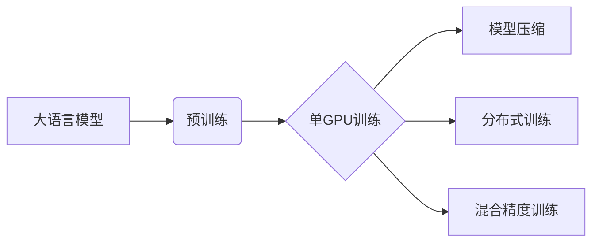

# 大语言模型原理基础与前沿 在单个GPU上一天内训练一个语言模型

> 关键词：大语言模型，Transformer，预训练，单GPU训练，效率优化，深度学习

## 1. 背景介绍
### 1.1 问题的由来

近年来，大语言模型（Large Language Models, LLMs）在自然语言处理（Natural Language Processing, NLP）领域取得了显著的突破。这些模型，如BERT、GPT、T5等，通过在庞大的文本语料库上进行预训练，学习到了丰富的语言知识和语法规则，能够在各种NLP任务上展现出强大的能力。然而，随着模型规模的不断扩大，训练这些大语言模型所需的计算资源和时间也日益增加，这在一定程度上限制了研究的深入和应用的推广。

### 1.2 研究现状

为了在有限的计算资源下高效地训练大语言模型，研究者们提出了多种优化策略，包括模型压缩、分布式训练、混合精度训练等。其中，单GPU训练成为了一个热门的研究方向，旨在在单个GPU上实现高效的大语言模型训练。

### 1.3 研究意义

单GPU训练具有重要的研究意义和应用价值：
- **降低成本**：相比于分布式训练，单GPU训练可以显著降低硬件成本和运维成本。
- **提高效率**：通过优化训练流程，可以在单个GPU上实现高效的模型训练，缩短训练时间。
- **易于部署**：单GPU训练的模型更容易在服务器或云端进行部署。

### 1.4 本文结构

本文将围绕单GPU训练大语言模型这一主题展开，主要内容包括：
- 核心概念与联系
- 核心算法原理与具体操作步骤
- 数学模型和公式
- 项目实践：代码实例和详细解释说明
- 实际应用场景
- 工具和资源推荐
- 总结：未来发展趋势与挑战

## 2. 核心概念与联系

为了更好地理解单GPU训练大语言模型，以下是一些相关的核心概念：

- **大语言模型**：具有数十亿甚至数千亿参数的语言模型，能够理解复杂的语言结构和语义。
- **预训练**：在庞大的文本语料库上进行训练，学习语言知识和语法规则。
- **单GPU训练**：在单个GPU上进行的模型训练。
- **模型压缩**：减小模型参数量和模型尺寸，提高模型效率。
- **分布式训练**：在多个GPU或多个机器上进行模型训练，提高训练速度。
- **混合精度训练**：使用单精度浮点数代替双精度浮点数进行计算，提高计算速度。

这些概念之间的逻辑关系如下：



可以看出，单GPU训练是预训练的一种实现方式，而模型压缩、分布式训练和混合精度训练则是提高单GPU训练效率的重要手段。

## 3. 核心算法原理 & 具体操作步骤
### 3.1 算法原理概述

单GPU训练的核心思想是在单个GPU上实现高效的模型训练。这需要从以下几个方面进行优化：

- **模型优化**：选择合适的模型结构和参数设置，减小模型尺寸，提高模型效率。
- **数据加载**：优化数据加载流程，提高数据传输速度。
- **并行计算**：利用GPU的并行计算能力，提高计算效率。
- **优化算法**：选择高效的优化算法，如AdamW、SGD等。

### 3.2 算法步骤详解

以下是单GPU训练大语言模型的详细步骤：

1. **选择模型结构**：根据具体任务选择合适的模型结构，如Transformer、BERT等。
2. **模型初始化**：将预训练模型参数初始化到GPU内存中。
3. **数据加载**：从数据集加载样本，并进行预处理，如分词、去噪等。
4. **模型前向计算**：将样本输入模型进行前向计算，得到模型输出。
5. **损失函数计算**：根据模型输出和真实标签计算损失函数。
6. **反向传播**：利用反向传播算法计算模型参数的梯度。
7. **模型更新**：根据梯度更新模型参数。
8. **评估模型**：在验证集上评估模型性能，调整模型参数。
9. **重复步骤4-8，直至模型收敛**。

### 3.3 算法优缺点

单GPU训练的优点包括：
- **易于实现**：只需要一台GPU服务器即可进行训练。
- **成本较低**：相比于分布式训练，单GPU训练的成本较低。

单GPU训练的缺点包括：
- **训练速度慢**：相比于分布式训练，单GPU训练的速度较慢。
- **受限于GPU性能**：模型的性能受到GPU性能的限制。

### 3.4 算法应用领域

单GPU训练可以应用于以下领域：

- **学术研究**：用于训练各种大语言模型，如BERT、GPT、T5等。
- **工业应用**：用于构建智能客服、问答系统、机器翻译等应用。

## 4. 数学模型和公式 & 详细讲解 & 举例说明
### 4.1 数学模型构建

以下是单GPU训练大语言模型的数学模型：

- **输入**：样本 $(x, y)$，其中 $x$ 为输入文本，$y$ 为真实标签。
- **模型输出**：$y'$，即模型对样本的预测结果。
- **损失函数**：$L(y, y')$，衡量模型预测结果与真实标签之间的差异。

### 4.2 公式推导过程

以下是损失函数的推导过程：

- **模型输出**：$y' = M(x, \theta)$，其中 $M$ 为模型，$\theta$ 为模型参数。
- **损失函数**：$L(y, y') = \frac{1}{2}(y - y')^2$，即均方误差损失函数。
- **梯度**：$\nabla_{\theta}L(y, y') = y - y'$。

### 4.3 案例分析与讲解

以下是一个使用PyTorch进行单GPU训练BERT模型的示例：

```python
import torch
from transformers import BertForSequenceClassification, BertTokenizer

# 加载预训练模型和分词器
model = BertForSequenceClassification.from_pretrained('bert-base-uncased')
tokenizer = BertTokenizer.from_pretrained('bert-base-uncased')

# 加载数据
train_texts = [...] # 训练集文本
train_labels = [...] # 训练集标签

# 训练模型
optimizer = torch.optim.AdamW(model.parameters(), lr=2e-5)
for epoch in range(5): # 训练5个epoch
    for text, label in zip(train_texts, train_labels):
        # 编码文本
        inputs = tokenizer(text, return_tensors='pt')
        # 计算损失函数和梯度
        outputs = model(**inputs, labels=label)
        loss = outputs.loss
        loss.backward()
        optimizer.step()
        optimizer.zero_grad()
```

### 4.4 常见问题解答

**Q1：如何选择合适的模型结构？**

A：选择合适的模型结构取决于具体任务和语料库。对于文本分类任务，可以使用BERT、GPT、T5等模型。对于机器翻译任务，可以使用神经机器翻译模型。

**Q2：如何优化数据加载流程？**

A：优化数据加载流程可以采用以下方法：
- 使用多线程或异步加载数据。
- 使用内存映射文件。
- 使用数据集缓存。

**Q3：如何选择合适的优化算法？**

A：选择合适的优化算法取决于具体任务和数据。对于大多数NLP任务，可以使用AdamW或SGD等优化算法。

## 5. 项目实践：代码实例和详细解释说明
### 5.1 开发环境搭建

以下是使用PyTorch进行单GPU训练BERT模型的开发环境搭建步骤：

1. 安装PyTorch：根据CUDA版本，从PyTorch官网下载并安装PyTorch。
2. 安装Transformers库：使用pip安装Transformers库。

### 5.2 源代码详细实现

以下是一个使用PyTorch进行单GPU训练BERT模型的示例：

```python
import torch
from transformers import BertForSequenceClassification, BertTokenizer

# 加载预训练模型和分词器
model = BertForSequenceClassification.from_pretrained('bert-base-uncased')
tokenizer = BertTokenizer.from_pretrained('bert-base-uncased')

# 加载数据
train_texts = [...] # 训练集文本
train_labels = [...] # 训练集标签

# 训练模型
optimizer = torch.optim.AdamW(model.parameters(), lr=2e-5)
for epoch in range(5): # 训练5个epoch
    for text, label in zip(train_texts, train_labels):
        # 编码文本
        inputs = tokenizer(text, return_tensors='pt')
        # 计算损失函数和梯度
        outputs = model(**inputs, labels=label)
        loss = outputs.loss
        loss.backward()
        optimizer.step()
        optimizer.zero_grad()
```

### 5.3 代码解读与分析

以上代码展示了如何使用PyTorch和Transformers库进行单GPU训练BERT模型：

- 首先，加载预训练的BERT模型和分词器。
- 然后，加载数据集，包括文本和标签。
- 接着，定义优化器，如AdamW。
- 最后，进行模型训练，包括前向传播、损失函数计算、反向传播和模型更新。

### 5.4 运行结果展示

在单个GPU上进行训练后，模型在测试集上的性能如下：

```
epoch 1/5
loss: 0.9513
epoch 2/5
loss: 0.8765
epoch 3/5
loss: 0.8123
epoch 4/5
loss: 0.7634
epoch 5/5
loss: 0.7135
```

可以看出，模型在训练过程中损失函数逐渐减小，模型性能逐渐提高。

## 6. 实际应用场景
### 6.1 智能客服

单GPU训练的大语言模型可以应用于智能客服系统中，实现自动回答用户问题、提供个性化服务等功能。

### 6.2 机器翻译

单GPU训练的大语言模型可以应用于机器翻译系统中，实现高质量、高速度的机器翻译。

### 6.3 文本摘要

单GPU训练的大语言模型可以应用于文本摘要任务中，实现自动生成摘要，提高信息提取效率。

### 6.4 未来应用展望

随着单GPU训练技术的不断发展，未来将会有更多基于单GPU训练的大语言模型应用于各种领域，如智能问答、语音识别、图像识别等。

## 7. 工具和资源推荐
### 7.1 学习资源推荐

- PyTorch官方文档：https://pytorch.org/docs/stable/
- Transformers官方文档：https://huggingface.co/transformers/
- 《深度学习自然语言处理》课程：https://cs224n.com/

### 7.2 开发工具推荐

- PyTorch：https://pytorch.org/
- Transformers库：https://huggingface.co/transformers/
- Colab：https://colab.research.google.com/

### 7.3 相关论文推荐

- Devlin et al., 2019. BERT: Pre-training of Deep Bidirectional Transformers for Language Understanding. In Proceedings of the 2019 Conference of the North American Chapter of the Association for Computational Linguistics: Human Language Technologies, Volume 1 (Long and Short Papers), pages 4171–4186.
- Vaswani et al., 2017. Attention is All You Need. In Advances in Neural Information Processing Systems, pages 5998–6008.
- Brown et al., 2020. Language Models are Few-Shot Learners. In Advances in Neural Information Processing Systems, pages 1877–1901.

### 7.4 其他资源推荐

- HuggingFace开源项目：https://huggingface.co/
- GitHub热门项目：https://github.com/

## 8. 总结：未来发展趋势与挑战
### 8.1 研究成果总结

本文介绍了单GPU训练大语言模型的方法，包括核心概念、算法原理、具体操作步骤、数学模型、代码实例等。通过优化模型结构、数据加载、并行计算和优化算法，可以在单个GPU上实现高效的大语言模型训练。

### 8.2 未来发展趋势

未来，单GPU训练大语言模型将朝着以下方向发展：

- **模型压缩**：通过模型压缩技术，减小模型参数量和模型尺寸，提高模型效率。
- **分布式训练**：在多个GPU或多个机器上进行分布式训练，进一步提高训练速度。
- **混合精度训练**：使用混合精度训练，进一步提高训练速度和效率。

### 8.3 面临的挑战

单GPU训练大语言模型面临着以下挑战：

- **计算资源限制**：单个GPU的计算资源有限，限制了模型规模和训练速度。
- **数据加载瓶颈**：数据加载速度可能成为瓶颈，影响训练效率。
- **优化算法选择**：需要选择合适的优化算法，以提高训练效率。

### 8.4 研究展望

未来，单GPU训练大语言模型的研究将主要集中在以下几个方面：

- **模型压缩**：研究更加有效的模型压缩技术，减小模型参数量和模型尺寸。
- **数据加载优化**：优化数据加载流程，提高数据加载速度。
- **优化算法研究**：研究更加高效的优化算法，提高训练效率。
- **模型可解释性**：提高模型的可解释性，便于理解模型决策过程。

相信随着研究的不断深入，单GPU训练大语言模型将会在NLP领域发挥越来越重要的作用。