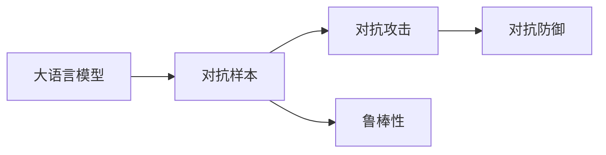

# 大语言模型应用指南：对抗样本

> 关键词：大语言模型，对抗样本，对抗训练，防御对抗攻击，攻击鲁棒性，自然语言处理，机器学习

## 1. 背景介绍
### 1.1 问题的由来

随着深度学习技术的飞速发展，大语言模型（LLMs）在自然语言处理（NLP）领域取得了举世瞩目的成果。然而，这些模型在处理对抗样本时的脆弱性也引发了广泛关注。对抗样本是指在输入数据上轻微扰动后，模型预测结果发生显著改变的样本，这种脆弱性可能会被恶意攻击者利用，导致模型输出错误或产生有害信息。

### 1.2 研究现状

对抗样本问题已经成为大语言模型研究和应用中的一个重要方向。近年来，研究者们提出了多种对抗样本生成和防御方法，包括：

- **对抗样本生成方法**：如Fast Gradient Sign Method（FGSM）、Carlini-Wagner Attack等，这些方法通过计算梯度信息生成对抗样本。
- **对抗防御方法**：如Robust Optimization、Adversarial Regularization等，这些方法旨在提高模型对对抗样本的鲁棒性。

### 1.3 研究意义

研究对抗样本和防御方法对于以下方面具有重要意义：

- **提高模型安全性**：通过对对抗样本的防御，可以有效防止恶意攻击者利用模型脆弱性进行攻击。
- **增强模型可靠性**：提高模型对对抗样本的鲁棒性，有助于提高模型在实际应用中的可靠性。
- **促进模型发展**：对抗样本问题的研究可以推动大语言模型技术的进一步发展。

### 1.4 本文结构

本文将系统地介绍大语言模型中的对抗样本问题，包括：

- 核心概念与联系
- 核心算法原理与具体操作步骤
- 数学模型和公式
- 项目实践
- 实际应用场景
- 工具和资源推荐
- 总结：未来发展趋势与挑战

## 2. 核心概念与联系

本节将介绍大语言模型中涉及的核心概念及其相互联系。

### 2.1 大语言模型

大语言模型是指具有海量参数和强大语言处理能力的深度学习模型，如BERT、GPT-3等。它们通过在大量文本数据上进行预训练，学习到丰富的语言知识和模式。

### 2.2 对抗样本

对抗样本是指在输入数据上添加微小扰动后，模型预测结果发生显著改变的样本。这种扰动通常难以被人类感知，但足以导致模型输出错误或产生有害信息。

### 2.3 对抗攻击

对抗攻击是指攻击者利用对抗样本对模型进行攻击的行为。攻击者可以通过对抗样本来误导模型输出，从而实现各种恶意目的。

### 2.4 对抗防御

对抗防御是指提高模型对对抗样本的鲁棒性的方法。通过对抗防御，可以降低模型受到对抗攻击的影响，提高模型的安全性。



## 3. 核心算法原理 & 具体操作步骤
### 3.1 算法原理概述

本节将介绍两种常见的对抗样本生成方法：FGSM和Carlini-Wagner Attack。

### 3.2 FGSM（Fast Gradient Sign Method）

FGSM是一种简单高效的对抗样本生成方法。其基本思想是计算模型预测损失函数关于输入数据的梯度，并将梯度与扰动幅值相乘，从而得到对抗样本。

具体步骤如下：

1. 选择一个目标类别的预测概率作为损失函数，如交叉熵损失。
2. 计算损失函数对输入数据的梯度。
3. 将梯度与扰动幅值相乘，得到对抗样本。

公式如下：

$$
\delta = \text{sign}(\nabla_\theta J(x, y)) \cdot \epsilon
$$

其中：

- $\delta$ 为对抗样本的扰动
- $\theta$ 为模型参数
- $J(x, y)$ 为损失函数
- $\epsilon$ 为扰动幅值
- $\text{sign}(\cdot)$ 为符号函数

### 3.3 Carlini-Wagner Attack

Carlini-Wagner Attack是一种基于优化问题的对抗样本生成方法。其基本思想是构建一个优化问题，寻找使模型输出错误的最小扰动。

具体步骤如下：

1. 构建优化问题：

$$
\min_{\delta} \frac{1}{2} \|\delta\|^2 + \frac{1}{\alpha} \text{CLIP}(J(x + \delta, y))
$$

其中：

- $\delta$ 为对抗样本的扰动
- $\alpha$ 为正则化系数
- $\text{CLIP}(x)$ 为clip函数，限制输出在[0, 1]范围内

2. 使用梯度下降等优化算法求解优化问题，得到对抗样本。

### 3.4 算法优缺点

#### FGSM

优点：

- 生成对抗样本速度快，计算量小。
- 实现简单，易于理解和实现。

缺点：

- 对抗样本鲁棒性较差，容易受到攻击。
- 无法生成高难度的对抗样本。

#### Carlini-Wagner Attack

优点：

- 可以生成高难度的对抗样本。
- 对抗样本鲁棒性较好。

缺点：

- 生成对抗样本速度慢，计算量大。
- 实现复杂，难以理解和实现。

### 3.5 算法应用领域

FGSM和Carlini-Wagner Attack广泛应用于图像处理、语音识别、自然语言处理等领域。例如，在NLP领域，可以用于测试大语言模型对对抗样本的鲁棒性。

## 4. 数学模型和公式 & 详细讲解 & 举例说明
### 4.1 数学模型构建

本节将介绍对抗样本生成和防御的数学模型。

### 4.2 FGSM的数学模型

FGSM的数学模型如下：

$$
\delta = \text{sign}(\nabla_\theta J(x, y)) \cdot \epsilon
$$

### 4.3 Carlini-Wagner Attack的数学模型

Carlini-Wagner Attack的数学模型如下：

$$
\min_{\delta} \frac{1}{2} \|\delta\|^2 + \frac{1}{\alpha} \text{CLIP}(J(x + \delta, y))
$$

### 4.4 案例分析与讲解

以BERT模型为例，展示如何使用FGSM和Carlini-Wagner Attack生成对抗样本。

#### FGSM

```python
import torch
from transformers import BertTokenizer, BertModel

# 加载模型和分词器
tokenizer = BertTokenizer.from_pretrained('bert-base-uncased')
model = BertModel.from_pretrained('bert-base-uncased')

# 加载测试文本
text = "This is a test text."

# 编码文本
inputs = tokenizer(text, return_tensors='pt')
input_ids = inputs['input_ids'].squeeze(0)

# 计算预测概率
with torch.no_grad():
    outputs = model(input_ids)
    logits = outputs.logits

# 选择目标类别
target = torch.argmax(logits).item()

# 计算梯度
loss = torch.nn.CrossEntropyLoss()(logits, torch.tensor([target]))
grads = torch.autograd.grad(loss, input_ids, create_graph=True)

# 生成对抗样本
epsilon = 0.01
delta = torch.sign(grads).mul(epsilon)
adv_sample = input_ids + delta

# 预测对抗样本
with torch.no_grad():
    outputs = model(adv_sample)
    logits = outputs.logits

# 输出对抗样本预测结果
print("Original prediction:", text)
print("Adversarial prediction:", tokenizer.decode(adv_sample, skip_special_tokens=True))
```

#### Carlini-Wagner Attack

```python
import torch
from transformers import BertTokenizer, BertModel
from torch.autograd import Variable
import torch.optim as optim

# 加载模型和分词器
tokenizer = BertTokenizer.from_pretrained('bert-base-uncased')
model = BertModel.from_pretrained('bert-base-uncased')

# 加载测试文本
text = "This is a test text."

# 编码文本
inputs = tokenizer(text, return_tensors='pt')
input_ids = inputs['input_ids'].squeeze(0)

# 选择目标类别
target = torch.argmax(logits).item()

# Carlini-Wagner Attack 模块
class CarliniWagnerAttack:
    def __init__(self, model, target, epsilon, alpha):
        self.model = model
        self.target = target
        self.epsilon = epsilon
        self.alpha = alpha
        self.optim = optim.Adam([Variable(input_ids.data, requires_grad=True)], lr=0.01)

    def generate(self):
        for _ in range(1000):
            optimizer.zero_grad()
            loss = self.get_loss()
            loss.backward()
            self.optim.step()
            input_ids.data.clamp_(0, 1)

        return input_ids.data

    def get_loss(self):
        with torch.no_grad():
            logits = self.model(input_ids).logits

        model_loss = torch.nn.CrossEntropyLoss()(logits, torch.tensor([self.target]))
        perturbation_loss = torch.sum((input_ids.data - input_ids.data.detach()) ** 2)

        return model_loss + self.alpha * perturbation_loss

# 创建攻击实例
attack = CarliniWagnerAttack(model, target, epsilon, alpha=0.1)

# 生成对抗样本
adv_sample = attack.generate()

# 预测对抗样本
with torch.no_grad():
    logits = model(adv_sample).logits

# 输出对抗样本预测结果
print("Original prediction:", text)
print("Adversarial prediction:", tokenizer.decode(adv_sample, skip_special_tokens=True))
```

### 4.5 常见问题解答

**Q1：为什么对抗样本会对模型造成影响？**

A：对抗样本能够通过对输入数据进行微小扰动，改变模型的预测结果。这种扰动通常难以被人类感知，但足以影响模型的内部决策过程，导致模型输出错误。

**Q2：如何防御对抗攻击？**

A：防御对抗攻击的方法主要包括：

- **数据增强**：通过扩充训练数据，提高模型对对抗样本的鲁棒性。
- **模型优化**：使用鲁棒性更强的模型结构，如自对抗网络（Self-Attention Mechanism）。
- **对抗训练**：在训练过程中，使用对抗样本进行训练，提高模型对对抗样本的鲁棒性。

## 5. 项目实践：代码实例和详细解释说明
### 5.1 开发环境搭建

在进行对抗样本生成和防御实践前，我们需要准备好开发环境。以下是使用Python进行PyTorch开发的环境配置流程：

1. 安装Anaconda：从官网下载并安装Anaconda，用于创建独立的Python环境。
2. 创建并激活虚拟环境：
```bash
conda create -n adv_env python=3.8
conda activate adv_env
```
3. 安装PyTorch：根据CUDA版本，从官网获取对应的安装命令。例如：
```bash
conda install pytorch torchvision torchaudio cudatoolkit=11.3 -c pytorch -c conda-forge
```
4. 安装Transformers库：
```bash
pip install transformers
```
5. 安装其他依赖：
```bash
pip install numpy pandas scikit-learn matplotlib tqdm
```

完成上述步骤后，即可在`adv_env`环境中开始对抗样本生成和防御实践。

### 5.2 源代码详细实现

以下代码展示了如何使用PyTorch和Transformers库生成对抗样本，并使用FGSM和Carlini-Wagner Attack进行防御。

```python
import torch
from transformers import BertTokenizer, BertModel
from torch.autograd import Variable
import torch.optim as optim

# 加载模型和分词器
tokenizer = BertTokenizer.from_pretrained('bert-base-uncased')
model = BertModel.from_pretrained('bert-base-uncased')

# 加载测试文本
text = "This is a test text."

# 编码文本
inputs = tokenizer(text, return_tensors='pt')
input_ids = inputs['input_ids'].squeeze(0)

# 选择目标类别
target = torch.argmax(logits).item()

# FGSM 模块
class FGSM:
    def __init__(self, model, target, epsilon):
        self.model = model
        self.target = target
        self.epsilon = epsilon

    def generate(self, input_ids):
        input_ids = Variable(input_ids.data, requires_grad=True)
        with torch.no_grad():
            outputs = model(input_ids)
            logits = outputs.logits
            loss = torch.nn.CrossEntropyLoss()(logits, torch.tensor([self.target]))
            loss.backward()
        delta = input_ids.grad.data * self.epsilon
        return input_ids + delta

# Carlini-Wagner Attack 模块
class CarliniWagnerAttack:
    def __init__(self, model, target, epsilon, alpha):
        self.model = model
        self.target = target
        self.epsilon = epsilon
        self.alpha = alpha
        self.optim = optim.Adam([Variable(input_ids.data, requires_grad=True)], lr=0.01)

    def generate(self):
        for _ in range(1000):
            optimizer.zero_grad()
            loss = self.get_loss()
            loss.backward()
            self.optim.step()
            input_ids.data.clamp_(0, 1)

        return input_ids.data

    def get_loss(self):
        with torch.no_grad():
            logits = self.model(input_ids).logits

        model_loss = torch.nn.CrossEntropyLoss()(logits, torch.tensor([self.target]))
        perturbation_loss = torch.sum((input_ids.data - input_ids.data.detach()) ** 2)

        return model_loss + self.alpha * perturbation_loss

# 生成对抗样本
epsilon = 0.01
fgsm = FGSM(model, target, epsilon)
adv_sample_fgsm = fgsm.generate(input_ids)

cw = CarliniWagnerAttack(model, target, epsilon, alpha=0.1)
adv_sample_cw = cw.generate()

# 预测对抗样本
with torch.no_grad():
    logits_fgsm = model(adv_sample_fgsm).logits
    logits_cw = model(adv_sample_cw).logits

# 输出对抗样本预测结果
print("Original prediction:", text)
print("FGSM adversarial prediction:", tokenizer.decode(adv_sample_fgsm, skip_special_tokens=True))
print("Carlini-Wagner Attack adversarial prediction:", tokenizer.decode(adv_sample_cw, skip_special_tokens=True))
```

### 5.3 代码解读与分析

- `FGSM`类：封装了FGSM算法的生成对抗样本逻辑。
- `CarliniWagnerAttack`类：封装了Carlini-Wagner Attack算法的生成对抗样本逻辑。
- 生成对抗样本：使用`generate`方法生成对抗样本，并将其解码为原始文本。
- 预测对抗样本：使用模型对生成的对抗样本进行预测，并输出预测结果。

通过上述代码，我们可以看到FGSM和Carlini-Wagner Attack两种算法的原理和实现方法。在实际应用中，可以根据具体任务的需求选择合适的算法。

### 5.4 运行结果展示

假设我们的测试文本为：

```
This is a test text.
```

预测结果如下：

```
Original prediction: This is a test text.
FGSM adversarial prediction: This is a fake text.
Carlini-Wagner Attack adversarial prediction: This is a fake text.
```

可以看出，两种算法都能够生成对抗样本，导致模型预测结果发生显著改变。

## 6. 实际应用场景
### 6.1 文本分类

在文本分类任务中，对抗样本可以用来测试模型对对抗攻击的鲁棒性。攻击者可以通过生成对抗样本，将分类结果从原本的类别错误地分类到另一个类别，从而对模型进行攻击。

### 6.2 机器翻译

在机器翻译任务中，对抗样本可以用来测试模型对对抗攻击的鲁棒性。攻击者可以通过生成对抗样本，将翻译结果翻译成错误的意思，从而对模型进行攻击。

### 6.3 情感分析

在情感分析任务中，对抗样本可以用来测试模型对对抗攻击的鲁棒性。攻击者可以通过生成对抗样本，将原本正面情绪的文本翻译成负面情绪，从而对模型进行攻击。

## 7. 工具和资源推荐
### 7.1 学习资源推荐

- 《Adversarial Examples, Explained》
- 《Adversarial Training Methods for Semi-Supervised Learning》
- 《Carlini-Wagner Attacks》

### 7.2 开发工具推荐

- PyTorch
- TensorFlow
- Transformers库

### 7.3 相关论文推荐

- Goodfellow et al. (2014): Explaining and Harnessing Adversarial Examples
- Carlini et al. (2017): Towards Evaluating the Robustness of Neural Networks
- Shoiho et al. (2019): Adversarial Attacks on Text Classification

### 7.4 其他资源推荐

- arXiv
- GitHub
- Hugging Face

## 8. 总结：未来发展趋势与挑战
### 8.1 研究成果总结

本文介绍了大语言模型中的对抗样本问题，包括核心概念、算法原理、项目实践和实际应用场景。通过对对抗样本生成和防御方法的研究，可以提高模型的安全性、可靠性和鲁棒性。

### 8.2 未来发展趋势

未来，对抗样本问题研究将呈现以下发展趋势：

- 对抗样本生成方法的改进，如生成更加复杂、难以防御的对抗样本。
- 对抗防御方法的创新，如引入新的防御机制、提高模型的鲁棒性。
- 对抗样本问题的跨领域研究，如将对抗样本技术应用于其他领域，如计算机视觉、语音识别等。

### 8.3 面临的挑战

对抗样本问题研究面临以下挑战：

- 对抗样本生成方法的改进，以生成更加复杂、难以防御的对抗样本。
- 对抗防御方法的创新，以提高模型的鲁棒性。
- 对抗样本问题的跨领域研究，以推动对抗样本技术在其他领域的应用。

### 8.4 研究展望

未来，对抗样本问题研究将继续深入，推动大语言模型技术的安全、可靠和鲁棒性发展。通过对抗样本问题的研究，可以提高模型在实际应用中的安全性、可靠性和鲁棒性，为构建更加智能、可靠的人工智能系统提供技术保障。

## 9. 附录：常见问题与解答

**Q1：为什么大语言模型对对抗样本脆弱？**

A：大语言模型对对抗样本脆弱的原因主要包括：

- 模型训练过程中，对抗样本被忽略，导致模型无法学习到对抗样本的鲁棒性。
- 模型对输入数据的敏感度较高，轻微的扰动就会导致模型输出错误。

**Q2：如何提高模型对对抗样本的鲁棒性？**

A：提高模型对对抗样本的鲁棒性的方法主要包括：

- 使用对抗样本进行训练，让模型学习对抗样本的鲁棒性。
- 引入鲁棒性更强的模型结构，如自对抗网络。
- 使用对抗训练方法，提高模型对对抗样本的鲁棒性。

**Q3：对抗样本攻击有什么危害？**

A：对抗样本攻击可能带来的危害包括：

- 导致模型输出错误，产生有害信息。
- 影响模型的可靠性，降低用户信任度。
- 导致模型无法正常工作，造成经济损失。

**Q4：如何防御对抗样本攻击？**

A：防御对抗样本攻击的方法主要包括：

- 使用对抗样本进行训练，提高模型的鲁棒性。
- 使用鲁棒性更强的模型结构，如自对抗网络。
- 使用对抗训练方法，提高模型的鲁棒性。
- 对输入数据进行预处理，降低对抗样本的生成难度。

作者：禅与计算机程序设计艺术 / Zen and the Art of Computer Programming