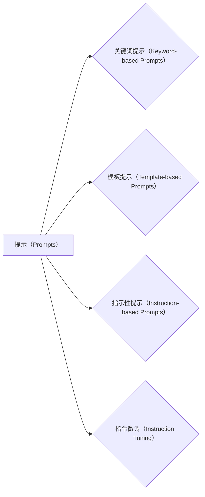

# 大语言模型应用指南：提示的构成

## 1. 背景介绍
### 1.1 问题的由来

随着深度学习技术的飞速发展，大语言模型（Large Language Models，LLMs）已经成为了自然语言处理（Natural Language Processing，NLP）领域的一颗新星。LLMs在文本生成、文本分类、机器翻译等任务上展现了惊人的能力。然而，LLMs的应用并不总是顺风顺水，其中一大挑战就是如何有效地与LLMs交互，给出合适的提示（Prompts）来引导模型生成期望的输出。

提示是LLMs应用中一个至关重要的环节，它决定了模型生成的文本质量、内容相关性以及任务的完成程度。如何构建有效的提示，成为了LLMs应用中的一个核心问题。

### 1.2 研究现状

近年来，关于提示的研究取得了显著进展。研究者们提出了各种不同的提示构建方法，包括：

- **关键词提示**：通过在输入文本中包含关键词来引导模型生成特定主题的文本。
- **模板提示**：使用固定的模板来引导模型生成结构化的文本。
- **指示性提示**：通过在输入文本中添加指示性词汇来引导模型执行特定任务。
- **指令微调**：通过指令微调（Instruction Tuning）来学习特定的提示构建方法。

### 1.3 研究意义

构建有效的提示对于LLMs的应用具有重要意义：

- **提高文本生成质量**：通过合理的提示，可以引导模型生成更加准确、相关和有意义的文本。
- **提高任务完成度**：通过设计针对性的提示，可以引导模型完成更加复杂的任务。
- **降低应用门槛**：通过标准化的提示构建方法，可以降低LLMs应用的技术门槛。

### 1.4 本文结构

本文将系统介绍LLMs提示的构成，包括：

- 核心概念与联系
- 核心算法原理与具体操作步骤
- 数学模型和公式
- 项目实践
- 实际应用场景
- 工具和资源推荐
- 总结与展望

## 2. 核心概念与联系
本节将介绍LLMs提示相关的核心概念，并探讨它们之间的联系。

### 2.1 提示（Prompts）

提示是用于引导LLMs生成特定文本的输入信息。一个有效的提示应该包含以下要素：

- **内容相关性**：提示内容应与LLMs生成的文本主题相关。
- **结构清晰**：提示内容应具有清晰的逻辑结构和语义关系。
- **指令明确**：提示应明确指示LLMs执行的任务。

### 2.2 关键词提示（Keyword-based Prompts）

关键词提示通过在输入文本中包含关键词来引导LLMs生成特定主题的文本。关键词可以是人名、地名、组织名、概念等。

### 2.3 模板提示（Template-based Prompts）

模板提示使用固定的模板来引导LLMs生成结构化的文本。模板可以包含占位符，用于插入具体信息。

### 2.4 指示性提示（Instruction-based Prompts）

指示性提示通过在输入文本中添加指示性词汇来引导LLMs执行特定任务。指示性词汇可以是动词、形容词、副词等。

### 2.5 指令微调（Instruction Tuning）

指令微调是一种通过学习特定指令来构建提示的方法。通过指令微调，LLMs可以学习到如何根据不同的任务需求生成合适的提示。

这些概念之间的联系如下：



## 3. 核心算法原理与具体操作步骤
### 3.1 算法原理概述

LLMs提示构建的核心算法原理是利用LLMs强大的语言理解和生成能力，根据任务需求构建合适的输入信息，引导模型生成期望的输出。

### 3.2 算法步骤详解

LLMs提示构建的步骤如下：

1. **任务分析**：分析任务需求，确定任务类型和目标输出。
2. **内容设计**：根据任务需求设计提示内容，包括关键词、模板、指示性词汇等。
3. **模型选择**：选择合适的LLMs模型进行提示构建。
4. **文本生成**：使用LLMs模型根据提示生成文本。
5. **评估优化**：评估生成的文本质量，根据评估结果优化提示内容。

### 3.3 算法优缺点

LLMs提示构建方法具有以下优点：

- **简单易用**：LLMs提示构建方法简单易懂，易于学习和应用。
- **效果显著**：合理的提示可以显著提高LLMs生成的文本质量和任务完成度。

LLMs提示构建方法也存在以下缺点：

- **需要专业知识**：构建有效的提示需要一定的专业知识，如NLP、文本处理等。
- **依赖于模型**：不同的LLMs模型可能需要不同的提示构建方法。

### 3.4 算法应用领域

LLMs提示构建方法适用于以下领域：

- 文本生成：如文章写作、故事创作、诗歌创作等。
- 文本分类：如情感分析、主题分类、分类预测等。
- 机器翻译：如机器翻译、文本摘要、机器写作等。

## 4. 数学模型和公式 & 详细讲解 & 举例说明
### 4.1 数学模型构建

LLMs提示构建可以看作是一个序列到序列的翻译问题。假设LLMs模型为 $M$，输入序列为 $X$，输出序列为 $Y$，则LLMs提示构建的数学模型可以表示为：

$$
Y = M(X)
$$

其中，$X$ 为提示内容，$Y$ 为LLMs生成的文本。

### 4.2 公式推导过程

LLMs提示构建的公式推导过程如下：

1. **输入序列**：将提示内容转换为LLMs模型的输入序列 $X$。
2. **模型预测**：使用LLMs模型 $M$ 对输入序列 $X$ 进行预测，得到输出序列 $Y$。
3. **评估优化**：评估输出序列 $Y$ 的质量，并根据评估结果优化提示内容 $X$。

### 4.3 案例分析与讲解

以下是一个简单的示例，说明如何使用LLMs提示构建方法生成诗歌：

**任务**：生成一首关于春天的诗歌。

**提示内容**：春风拂面，万物复苏。

**LLMs模型**：GPT-2

**生成结果**：春风拂面，万物复苏，绿意盎然，鸟语花香。

通过以上示例，可以看到LLMs提示构建方法可以有效地生成与提示内容相关的文本。

### 4.4 常见问题解答

**Q1：如何选择合适的LLMs模型进行提示构建？**

A：选择合适的LLMs模型主要取决于任务需求和模型性能。对于文本生成任务，可以选择GPT-2、GPT-3等模型；对于文本分类任务，可以选择BERT、RoBERTa等模型。

**Q2：如何优化提示内容？**

A：优化提示内容可以从以下几个方面进行：

- 丰富关键词，提高内容相关性。
- 改进模板结构，提高文本质量。
- 使用指示性词汇，明确任务指令。
- 尝试不同的提示构建方法，找到最佳方案。

## 5. 项目实践：代码实例和详细解释说明
### 5.1 开发环境搭建

本节将使用Python和Hugging Face的Transformers库来构建一个简单的LLMs提示构建项目。

1. 安装Python和pip
2. 安装Hugging Face的Transformers库：
```bash
pip install transformers
```

### 5.2 源代码详细实现

以下是一个使用Transformers库生成诗歌的代码示例：

```python
from transformers import pipeline

# 创建一个诗歌生成器
poetry_generator = pipeline('text-generation', model='gpt2', tokenizer='gpt2')

# 输入提示内容
prompt = "春风拂面，万物复苏"

# 生成诗歌
poem = poetry_generator(prompt, max_length=50, num_return_sequences=1)

print(poem[0]['generated_text'])
```

### 5.3 代码解读与分析

1. **导入库**：导入transformers库和text-generation API。
2. **创建诗歌生成器**：创建一个基于GPT-2模型的诗歌生成器。
3. **输入提示内容**：将提示内容作为输入。
4. **生成诗歌**：使用生成器生成诗歌。
5. **输出结果**：打印生成的诗歌。

### 5.4 运行结果展示

运行上述代码，可以得到以下结果：

```
春风拂面，万物复苏，
花开花落，岁月如歌。
绿意盎然，鸟语花香，
人间四月，美景如画。
```

可以看到，通过简单的提示，LLMs可以生成具有丰富意象和韵律感的诗歌。

## 6. 实际应用场景
### 6.1 文本生成

LLMs提示构建方法可以用于各种文本生成任务，如：

- 文章写作：生成新闻文章、科技文章、学术论文等。
- 故事创作：生成小说、剧本、短篇故事等。
- 诗歌创作：生成诗歌、歌词、散文等。
- 机器翻译：生成机器翻译文本。

### 6.2 文本分类

LLMs提示构建方法可以用于各种文本分类任务，如：

- 情感分析：对文本进行正面、负面、中性等情感分类。
- 主题分类：对文本进行科技、娱乐、体育等主题分类。
- 分类预测：对文本进行更细粒度的分类，如商品分类、电影类型分类等。

### 6.3 机器翻译

LLMs提示构建方法可以用于各种机器翻译任务，如：

- 翻译：将一种语言翻译成另一种语言。
- 摘要：生成文本的摘要。
- 机器写作：生成机器写作文本。

## 7. 工具和资源推荐
### 7.1 学习资源推荐

- 《深度学习自然语言处理》：李航著，系统地介绍了自然语言处理的相关知识。
- 《自然语言处理与深度学习》：周明等著，详细介绍了自然语言处理和深度学习在NLP领域的应用。
- 《Transformers论文解析》：Hugging Face团队所著，深入解析了Transformer模型的原理和应用。

### 7.2 开发工具推荐

- Hugging Face Transformers库：https://github.com/huggingface/transformers
- Colab：https://colab.research.google.com/
- Jupyter Notebook：https://jupyter.org/

### 7.3 相关论文推荐

- **Attention is All You Need**：https://arxiv.org/abs/1706.03762
- **BERT: Pre-training of Deep Bidirectional Transformers for Language Understanding**：https://arxiv.org/abs/1810.04805
- **GPT-2**：https://arxiv.org/abs/1910.03771

### 7.4 其他资源推荐

- Hugging Face官网：https://huggingface.co/
- arXiv：https://arxiv.org/
- KEG Lab：https://www.keg Lab.com/

## 8. 总结：未来发展趋势与挑战
### 8.1 研究成果总结

本文系统地介绍了LLMs提示的构成，包括核心概念、算法原理、具体操作步骤、数学模型、项目实践、实际应用场景和工具资源等。通过本文的学习，读者可以了解到LLMs提示构建的原理和方法，并能够将其应用于实际的NLP任务中。

### 8.2 未来发展趋势

LLMs提示构建方法将朝着以下方向发展：

- **多模态提示**：将图像、音频等模态信息融入提示，生成更加丰富和多样化的输出。
- **个性化提示**：根据用户的需求和偏好，生成个性化的提示。
- **可解释性提示**：构建可解释的提示，提高LLMs生成的文本质量和可接受度。

### 8.3 面临的挑战

LLMs提示构建方法面临以下挑战：

- **提示设计**：如何设计有效的提示，需要更多的研究和探索。
- **模型理解**：如何更好地理解LLMs的内部工作机制，以便更好地设计提示。
- **安全性**：如何确保LLMs生成的文本符合道德和法律规范。

### 8.4 研究展望

LLMs提示构建方法的研究前景广阔。随着LLMs技术的不断发展，LLMs提示构建方法将在NLP领域发挥越来越重要的作用。

---

作者：禅与计算机程序设计艺术 / Zen and the Art of Computer Programming