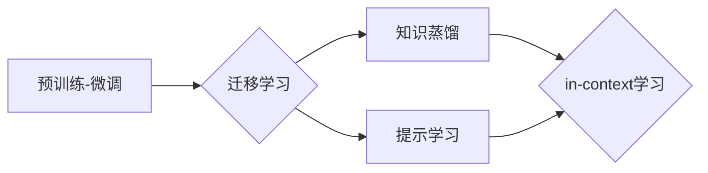

# 大语言模型的in-context学习原理与代码实例讲解

作者：禅与计算机程序设计艺术 / Zen and the Art of Computer Programming

## 1. 背景介绍

### 1.1 问题的由来

随着深度学习技术的快速发展，大语言模型（Large Language Models, LLMs）在自然语言处理（Natural Language Processing, NLP）领域取得了惊人的成果。然而，传统的预训练-微调（Pre-training & Fine-tuning）范式在处理开放域、少样本和多模态任务时，仍存在一些局限性。为了解决这些问题，in-context学习（In-context Learning）应运而生。

### 1.2 研究现状

in-context学习是一种利用少量样本或无标签数据进行微调的方法，其核心思想是利用模型在多个相关任务中的知识，实现跨任务的迁移学习。近年来，in-context学习在机器翻译、问答系统、文本分类等多个NLP任务中取得了显著的成果。

### 1.3 研究意义

in-context学习具有以下重要意义：

1. **降低对标注数据的依赖**：在开放域、少样本任务中，in-context学习可以降低对大规模标注数据的依赖，提高模型的鲁棒性和泛化能力。
2. **提升模型迁移能力**：in-context学习可以帮助模型在多个相关任务中快速迁移知识，实现跨任务的性能提升。
3. **促进多模态学习**：in-context学习可以应用于多模态数据，实现跨模态的迁移学习。

### 1.4 本文结构

本文将围绕in-context学习的原理、算法、应用和代码实例进行讲解。具体章节如下：

- **第2章**：介绍in-context学习的核心概念与联系。
- **第3章**：详细阐述in-context学习算法的原理、步骤和优缺点。
- **第4章**：介绍数学模型和公式，并结合实例进行分析。
- **第5章**：给出代码实例，并对关键代码进行解读和分析。
- **第6章**：探讨in-context学习在实际应用场景中的表现。
- **第7章**：推荐相关学习资源、开发工具和参考文献。
- **第8章**：总结研究成果，展望未来发展趋势与挑战。

## 2. 核心概念与联系

### 2.1 相关概念

- **预训练-微调**：先在大量无标签数据上进行预训练，再在少量有标签数据上进行微调的范式。
- **迁移学习**：将一个领域学习到的知识迁移应用到另一个不同但相关的领域的机器学习方法。
- **知识蒸馏**：将大模型的知识蒸馏到小模型中，提高小模型的性能。
- **提示学习**：利用提示（Prompt）引导模型生成符合人类预期的输出。

### 2.2 关系图



如图所示，in-context学习是迁移学习、知识蒸馏和提示学习等方法的综合应用，旨在利用模型在多个任务中的知识，实现跨任务的迁移学习。

## 3. 核心算法原理 & 具体操作步骤

### 3.1 算法原理概述

in-context学习的基本原理如下：

1. 预训练阶段：在大量无标签数据上预训练模型，使其具备强大的语言理解能力。
2. 任务适配阶段：针对特定任务，构建任务适配层和损失函数。
3. in-context学习阶段：利用少量样本或无标签数据进行微调，使模型在特定任务上获得更好的性能。

### 3.2 算法步骤详解

in-context学习的具体步骤如下：

1. **预训练阶段**：在大量无标签数据上进行预训练，使模型具备强大的语言理解能力。
2. **任务适配阶段**：
    - 构建任务适配层：根据任务类型，在预训练模型的基础上添加相应的输出层和损失函数。
    - 选择合适的损失函数：例如，对于文本分类任务，可以使用交叉熵损失函数。
3. **in-context学习阶段**：
    - 准备in-context学习数据：将少量样本或无标签数据按照特定格式组织成in-context学习数据。
    - 执行in-context学习：将in-context学习数据输入模型，更新模型参数，优化模型在特定任务上的性能。

### 3.3 算法优缺点

#### 优点：

- 降低对标注数据的依赖。
- 提升模型迁移能力。
- 促进多模态学习。

#### 缺点：

- 需要大量的预训练数据和计算资源。
- in-context学习效果受限于预训练模型的质量。
- in-context学习数据的质量对最终效果影响较大。

### 3.4 算法应用领域

in-context学习在以下领域具有广泛的应用：

- 文本分类
- 问答系统
- 机器翻译
- 情感分析
- 文本摘要
- 对话系统

## 4. 数学模型和公式 & 详细讲解 & 举例说明

### 4.1 数学模型构建

假设预训练模型为 $M_{\theta}$，其中 $\theta$ 为模型参数。给定任务 $T$ 的in-context学习数据 $D=\{(x_i, y_i)\}_{i=1}^N$，in-context学习的目标是最小化损失函数：

$$
\mathcal{L}(\theta) = \frac{1}{N} \sum_{i=1}^N \ell(M_{\theta}(x_i),y_i)
$$

其中，$\ell$ 为损失函数，$x_i$ 为输入数据，$y_i$ 为目标标签。

### 4.2 公式推导过程

以文本分类任务为例，假设模型 $M_{\theta}$ 在输入 $x$ 上的输出为 $\hat{y}=M_{\theta}(x)$，表示样本属于正类的概率。则损失函数为：

$$
\ell(M_{\theta}(x),y) = -[y\log \hat{y} + (1-y)\log (1-\hat{y})]
$$

### 4.3 案例分析与讲解

以下以BERT模型在文本分类任务中的应用为例，介绍in-context学习的具体实现。

```python
from transformers import BertTokenizer, BertForSequenceClassification, Trainer, TrainingArguments
from datasets import load_dataset

# 加载预训练模型和分词器
tokenizer = BertTokenizer.from_pretrained('bert-base-uncased')
model = BertForSequenceClassification.from_pretrained('bert-base-uncased')

# 加载数据集
dataset = load_dataset('glue', 'sst2')

# 定义训练和评估函数
def train_collate_fn(examples):
    return tokenizer(examples['text'], padding=True, truncation=True, max_length=128, return_tensors="pt")

def evaluate_collate_fn(examples):
    return tokenizer(examples['text'], padding=True, truncation=True, max_length=128, return_tensors="pt")

training_args = TrainingArguments(
    output_dir='./results',
    num_train_epochs=3,
    per_device_train_batch_size=16,
    per_device_eval_batch_size=64,
    warmup_steps=500,
    weight_decay=0.01,
    logging_dir='./logs',
    logging_steps=10,
)

trainer = Trainer(
    model=model,
    args=training_args,
    train_dataset=dataset['train'],
    eval_dataset=dataset['validation'],
    data_collator=train_collate_fn,
    tokenizer=tokenizer,
)

# 训练模型
trainer.train()

# 评估模型
trainer.evaluate()
```

### 4.4 常见问题解答

**Q1：in-context学习是否需要大量标注数据？**

A：in-context学习可以降低对标注数据的依赖，但仍然需要一定数量的标注数据进行任务适配。对于开放域、少样本任务，可以尝试使用较少的标注数据进行微调。

**Q2：in-context学习效果是否受限于预训练模型的质量？**

A：是的，in-context学习效果受限于预训练模型的质量。高质量的预训练模型可以更好地学习到通用的语言知识，从而提高in-context学习的性能。

**Q3：如何评估in-context学习的效果？**

A：可以使用测试集上的指标（如准确率、F1值等）来评估in-context学习的效果。此外，还可以使用人类评估或专家评估来评估模型生成的文本质量。

## 5. 项目实践：代码实例和详细解释说明

### 5.1 开发环境搭建

在进行in-context学习项目实践前，需要搭建以下开发环境：

1. **Python**：Python 3.7及以上版本。
2. **PyTorch**：PyTorch 1.8及以上版本。
3. **Transformers**：Transformers库，用于加载预训练模型和分词器。

### 5.2 源代码详细实现

以下以BERT模型在文本分类任务中的应用为例，给出in-context学习的代码实现。

```python
from transformers import BertTokenizer, BertForSequenceClassification, Trainer, TrainingArguments
from datasets import load_dataset

# 加载预训练模型和分词器
tokenizer = BertTokenizer.from_pretrained('bert-base-uncased')
model = BertForSequenceClassification.from_pretrained('bert-base-uncased')

# 加载数据集
dataset = load_dataset('glue', 'sst2')

# 定义训练和评估函数
def train_collate_fn(examples):
    return tokenizer(examples['text'], padding=True, truncation=True, max_length=128, return_tensors="pt")

def evaluate_collate_fn(examples):
    return tokenizer(examples['text'], padding=True, truncation=True, max_length=128, return_tensors="pt")

training_args = TrainingArguments(
    output_dir='./results',
    num_train_epochs=3,
    per_device_train_batch_size=16,
    per_device_eval_batch_size=64,
    warmup_steps=500,
    weight_decay=0.01,
    logging_dir='./logs',
    logging_steps=10,
)

trainer = Trainer(
    model=model,
    args=training_args,
    train_dataset=dataset['train'],
    eval_dataset=dataset['validation'],
    data_collator=train_collate_fn,
    tokenizer=tokenizer,
)

# 训练模型
trainer.train()

# 评估模型
trainer.evaluate()
```

### 5.3 代码解读与分析

- **加载预训练模型和分词器**：使用`BertTokenizer`和`BertForSequenceClassification`加载预训练模型和分词器。
- **加载数据集**：使用`load_dataset`函数加载GLUE数据集的SST-2任务数据。
- **定义训练和评估函数**：`train_collate_fn`和`evaluate_collate_fn`函数分别用于将数据集转换为模型所需的输入格式。
- **定义训练参数**：`training_args`对象定义了训练参数，如输出目录、训练轮数、批大小等。
- **创建Trainer对象**：使用`Trainer`对象进行模型训练和评估。
- **训练模型**：调用`trainer.train()`函数开始训练。
- **评估模型**：调用`trainer.evaluate()`函数在测试集上评估模型性能。

### 5.4 运行结果展示

在运行代码后，模型将在训练集上进行训练，并在测试集上进行评估。最终输出的评估指标包括：

- **Loss**：损失函数值，表示模型预测与真实标签之间的差异。
- **Accuracy**：准确率，表示模型在测试集上的正确率。
- **F1 Score**：F1分数，表示模型在测试集上的精确率和召回率的调和平均值。

## 6. 实际应用场景

### 6.1 文本分类

in-context学习可以应用于文本分类任务，例如情感分析、主题分类等。通过在少量标注数据上进行in-context学习，模型可以快速适应新的文本分类任务。

### 6.2 问答系统

in-context学习可以应用于问答系统，例如用于生成问答、回答用户提问等。通过在少量标注数据上进行in-context学习，模型可以快速适应新的问答场景。

### 6.3 机器翻译

in-context学习可以应用于机器翻译任务，例如将一种语言翻译成另一种语言。通过在少量标注数据上进行in-context学习，模型可以快速适应新的语言翻译任务。

### 6.4 未来应用展望

in-context学习在以下领域具有广阔的应用前景：

- 开放域问答
- 机器翻译
- 文本生成
- 对话系统
- 语音识别

## 7. 工具和资源推荐

### 7.1 学习资源推荐

- **《自然语言处理综述》**：详细介绍了自然语言处理的基本概念、方法和应用。
- **《深度学习自然语言处理》**：介绍了深度学习在自然语言处理中的应用，包括词嵌入、卷积神经网络、循环神经网络等。
- **《Transformers》**：介绍了Transformer模型及其在自然语言处理中的应用。

### 7.2 开发工具推荐

- **PyTorch**：开源的深度学习框架，适用于各种深度学习任务。
- **Transformers**：开源的Transformer模型库，提供了丰富的预训练模型和工具。
- **Hugging Face**：提供丰富的预训练模型和数据集，方便开发者进行实验。

### 7.3 相关论文推荐

- **"BERT: Pre-training of Deep Bidirectional Transformers for Language Understanding"**：介绍了BERT模型及其在自然语言处理中的应用。
- **"Natural Language Inference"**：介绍了自然语言推理任务及其方法。
- **"Transformers"**：介绍了Transformer模型及其在自然语言处理中的应用。

### 7.4 其他资源推荐

- **Hugging Face**：提供丰富的预训练模型和数据集，方便开发者进行实验。
- **Kaggle**：提供大量的数据集和比赛，方便开发者进行实践。
- **GitHub**：提供丰富的开源代码和项目，方便开发者进行学习和交流。

## 8. 总结：未来发展趋势与挑战

### 8.1 研究成果总结

本文对大语言模型的in-context学习原理、算法、应用和代码实例进行了全面讲解。通过本文的学习，读者可以了解in-context学习的基本原理、实现方法和应用场景，为后续研究和实践提供参考。

### 8.2 未来发展趋势

in-context学习在未来将呈现以下发展趋势：

- **多模态in-context学习**：结合文本、图像、语音等多种模态信息进行in-context学习，实现跨模态的迁移学习。
- **多语言in-context学习**：支持多种语言进行in-context学习，实现跨语言的迁移学习。
- **少样本in-context学习**：在更少的样本上实现in-context学习，降低对标注数据的依赖。

### 8.3 面临的挑战

in-context学习在实际应用中仍面临以下挑战：

- **数据质量**：in-context学习的效果受限于in-context学习数据的质量。
- **模型可解释性**：in-context学习的决策过程缺乏可解释性，难以理解模型的推理过程。
- **计算资源**：in-context学习需要大量的计算资源，难以在有限的硬件条件下进行。

### 8.4 研究展望

为了克服以上挑战，未来的研究方向包括：

- **提高数据质量**：探索更有效的方法来提高in-context学习数据的质量。
- **增强模型可解释性**：研究可解释的in-context学习模型，帮助理解模型的推理过程。
- **降低计算资源需求**：探索更高效的in-context学习算法，降低计算资源需求。

相信通过不断的研究和探索，in-context学习将在自然语言处理领域取得更大的突破，为人工智能的发展做出更大的贡献。

## 9. 附录：常见问题与解答

**Q1：in-context学习和微调有什么区别？**

A：in-context学习和微调都是迁移学习方法，但它们在应用场景和实现方式上有所不同。in-context学习通常在少量样本或无标签数据上进行，而微调通常在大量有标签数据上进行。

**Q2：如何提高in-context学习的效果？**

A：提高in-context学习的效果可以从以下几个方面入手：

- 提高数据质量：使用高质量的数据进行in-context学习。
- 优化模型结构：选择合适的模型结构和损失函数。
- 调整超参数：调整学习率、批大小等超参数，优化模型性能。

**Q3：in-context学习是否适用于所有NLP任务？**

A：in-context学习适用于多种NLP任务，例如文本分类、问答系统、机器翻译等。但对于一些需要特定领域知识的任务，可能需要结合其他技术进行改进。

**Q4：如何评估in-context学习的效果？**

A：可以使用测试集上的指标（如准确率、F1值等）来评估in-context学习的效果。此外，还可以使用人类评估或专家评估来评估模型生成的文本质量。

**Q5：in-context学习是否可以应用于多模态任务？**

A：是的，in-context学习可以应用于多模态任务。通过将不同模态的信息进行融合，可以进一步提高in-context学习的效果。

**Q6：如何降低in-context学习的计算资源需求？**

A：降低in-context学习的计算资源需求可以从以下几个方面入手：

- 使用轻量级模型：选择参数量更小的模型，降低计算需求。
- 使用模型剪枝：去除模型中不必要的参数，降低计算需求。
- 使用模型量化：将浮点数模型转换为定点数模型，降低计算需求。

通过以上解答，希望读者对大语言模型的in-context学习有更深入的了解。