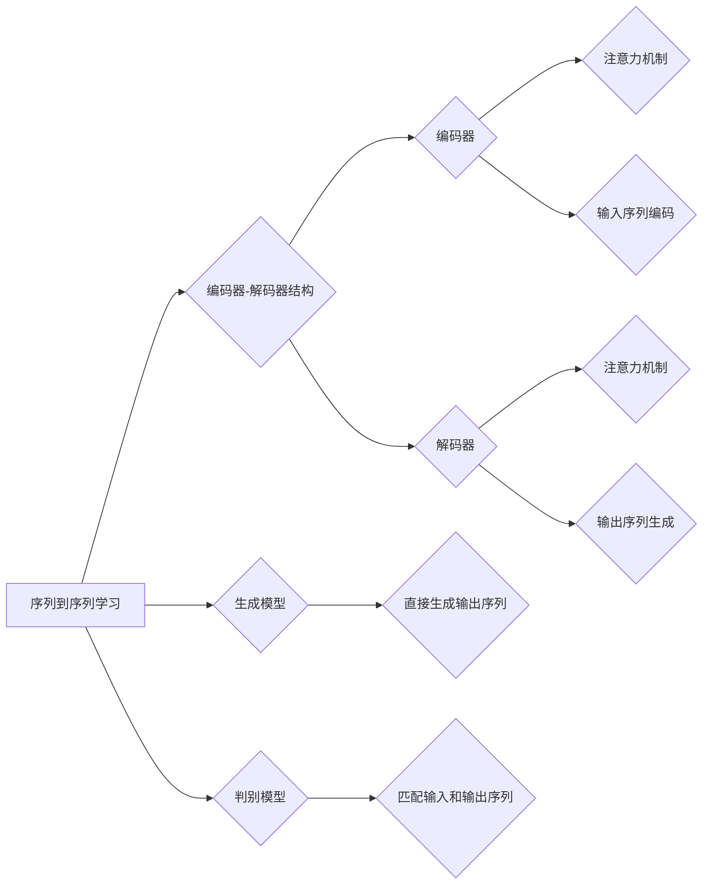

# 序列到序列学习 原理与代码实例讲解

作者：禅与计算机程序设计艺术 / Zen and the Art of Computer Programming

## 1. 背景介绍
### 1.1 问题的由来

序列到序列学习（Sequence to Sequence, seq2seq）是自然语言处理（Natural Language Processing, NLP）领域的一个重要研究方向。它旨在解决将一个序列映射到另一个序列的问题，如机器翻译、语音识别、文本摘要等。传统的NLP方法往往采用序列到分类（seq2cls）或序列到回归（seq2reg）的方式，但无法很好地处理序列间的复杂对应关系。seq2seq模型的出现，为解决这类问题提供了新的思路和方法。

### 1.2 研究现状

近年来，seq2seq模型在机器翻译、文本摘要、对话系统等领域取得了显著的成果。其中，基于循环神经网络（Recurrent Neural Network, RNN）和长短期记忆网络（Long Short-Term Memory, LSTM）的seq2seq模型最为经典。随着深度学习技术的不断发展，基于注意力机制（Attention Mechanism）的seq2seq模型也取得了突破性进展。

### 1.3 研究意义

研究序列到序列学习，对于推动NLP技术的发展具有重要意义：
- 解决序列间的复杂映射问题，如机器翻译、语音识别、文本摘要等。
- 提升NLP任务的性能，如提高翻译质量、改善语音识别准确性等。
- 推动NLP技术的产业化进程，为各行各业带来新的应用价值。

### 1.4 本文结构

本文将系统地介绍序列到序列学习的基本原理、常用模型、代码实现和应用场景。内容安排如下：
- 第2部分，介绍序列到序列学习的相关核心概念和联系。
- 第3部分，详细阐述seq2seq模型的基本原理和具体操作步骤。
- 第4部分，介绍seq2seq模型中的注意力机制和编码器-解码器结构。
- 第5部分，给出seq2seq模型的代码实现示例，并对关键代码进行解读。
- 第6部分，探讨seq2seq模型在实际应用中的场景和案例。
- 第7部分，推荐seq2seq模型相关的学习资源、开发工具和参考文献。
- 第8部分，总结全文，展望序列到序列学习的未来发展趋势与挑战。

## 2. 核心概念与联系

为了更好地理解序列到序列学习，本节将介绍几个核心概念及其联系。

### 2.1 序列到序列学习

序列到序列学习是指将一个序列映射到另一个序列的过程。例如，机器翻译任务中，将源语言文本序列映射到目标语言文本序列。

### 2.2 编码器-解码器结构

编码器-解码器（Encoder-Decoder）结构是seq2seq模型的核心架构。编码器负责将输入序列编码为固定长度的向量表示，解码器则根据编码器输出的向量表示生成输出序列。

### 2.3 注意力机制

注意力机制是seq2seq模型中的一种关键技术，用于解决解码器在生成输出时，如何关注编码器输出的不同部分的问题。

### 2.4 生成模型与判别模型

生成模型和判别模型是seq2seq模型中的两种不同类型。生成模型直接生成输出序列，判别模型则对输入序列和输出序列进行匹配。

以下为上述概念之间的逻辑关系图：



可以看出，序列到序列学习是seq2seq模型的基础，编码器-解码器结构和注意力机制是seq2seq模型的核心技术。此外，seq2seq模型可以采用生成模型或判别模型的方式。

## 3. 核心算法原理 & 具体操作步骤
### 3.1 算法原理概述

seq2seq模型主要由编码器、解码器和注意力机制三部分组成。编码器将输入序列编码为固定长度的向量表示，解码器则根据编码器输出的向量表示生成输出序列。注意力机制则帮助解码器关注编码器输出的不同部分。

### 3.2 算法步骤详解

以下是seq2seq模型的基本操作步骤：

**Step 1: 编码器编码输入序列**

1. 将输入序列 $x_1, x_2, \dots, x_T$ 输入编码器。
2. 编码器对每个输入序列进行编码，生成对应的编码向量 $c_1, c_2, \dots, c_T$。

**Step 2: 解码器生成输出序列**

1. 将编码向量 $c_1, c_2, \dots, c_T$ 输入解码器。
2. 解码器根据编码向量生成输出序列 $y_1, y_2, \dots, y_S$，其中 $S$ 为输出序列的长度。

**Step 3: 注意力机制**

1. 解码器在每个时间步 $t$，计算注意力权重 $\alpha_{t}$，表示编码器输出在 $t$ 时刻对解码器生成输出 $y_t$ 的影响程度。
2. 根据注意力权重，计算加权求和的编码向量 $c_t$。

**Step 4: 模型训练**

1. 将输入序列 $x_1, x_2, \dots, x_T$ 和输出序列 $y_1, y_2, \dots, y_S$ 输入模型。
2. 计算损失函数 $L$，并利用梯度下降等优化算法更新模型参数。

### 3.3 算法优缺点

seq2seq模型具有以下优点：
- 能够处理序列间的复杂映射问题，如机器翻译、语音识别、文本摘要等。
- 通过编码器-解码器结构和注意力机制，能够捕捉序列间的复杂关系。

然而，seq2seq模型也存在以下缺点：
- 训练过程复杂，计算量大。
- 难以处理长序列。
- 需要大量的标注数据。

### 3.4 算法应用领域

seq2seq模型在以下领域得到了广泛应用：

- **机器翻译**：将一种语言的文本序列翻译成另一种语言的文本序列。
- **语音识别**：将语音信号转换为文本序列。
- **文本摘要**：将长文本压缩为简短的摘要。
- **对话系统**：实现人机对话。
- **问答系统**：根据用户的问题，给出合适的回答。

## 4. 数学模型和公式 & 详细讲解 & 举例说明
### 4.1 数学模型构建

以下以简单的seq2seq模型为例，介绍其数学模型构建过程。

设编码器输出序列为 $c_1, c_2, \dots, c_T$，解码器输出序列为 $y_1, y_2, \dots, y_S$，注意力权重为 $\alpha_{t}$。

**编码器**：

编码器将输入序列 $x_1, x_2, \dots, x_T$ 编码为编码向量 $c_1, c_2, \dots, c_T$。设编码器第 $t$ 个输出向量为 $c_t$，则有：

$$
c_t = f_E(x_t, h_{t-1})
$$

其中 $f_E$ 为编码器函数，$h_{t-1}$ 为解码器前一个时间步的隐藏状态。

**解码器**：

解码器根据编码器输出序列 $c_1, c_2, \dots, c_T$ 生成输出序列 $y_1, y_2, \dots, y_S$。设解码器第 $t$ 个输出向量为 $y_t$，则有：

$$
y_t = f_D(y_{t-1}, c_t, h_{t-1})
$$

其中 $f_D$ 为解码器函数，$h_{t-1}$ 为解码器前一个时间步的隐藏状态。

**注意力机制**：

注意力权重 $\alpha_{t}$ 用于衡量编码器输出在 $t$ 时刻对解码器生成输出 $y_t$ 的影响程度。设注意力权重计算函数为 $f_A$，则有：

$$
\alpha_{t} = f_A(c_t, h_{t-1})
$$

**损失函数**：

假设解码器输出序列为 $y_1, y_2, \dots, y_S$，真实标签序列为 $y_1^*, y_2^*, \dots, y_S^*$。则损失函数为：

$$
L = \sum_{t=1}^S L(y_t, y_t^*)
$$

其中 $L$ 为损失函数，如交叉熵损失。

### 4.2 公式推导过程

以下以简单的交叉熵损失函数为例，介绍其推导过程。

设解码器输出序列为 $y_1, y_2, \dots, y_S$，真实标签序列为 $y_1^*, y_2^*, \dots, y_S^*$。则交叉熵损失函数为：

$$
L = -\sum_{t=1}^S \sum_{i=1}^V p(y_t=i) \log p(y_t^*=i)
$$

其中 $V$ 为词汇表的大小，$p(y_t=i)$ 为解码器输出序列在 $t$ 时刻输出为单词 $i$ 的概率，$p(y_t^*=i)$ 为真实标签序列在 $t$ 时刻输出为单词 $i$ 的概率。

### 4.3 案例分析与讲解

以下以机器翻译任务为例，介绍seq2seq模型的实现过程。

**数据准备**：

1. 收集中英双语文本数据，构建中英文词汇表。
2. 将文本数据转换为对应的token ids。

**编码器**：

1. 使用预训练的词向量模型，将token ids转换为词向量表示。
2. 使用LSTM或GRU等循环神经网络对词向量进行编码，得到编码向量。

**解码器**：

1. 使用预训练的词向量模型，将token ids转换为词向量表示。
2. 使用LSTM或GRU等循环神经网络对词向量进行解码，生成输出序列。

**注意力机制**：

1. 根据解码器状态和编码器输出，计算注意力权重。
2. 根据注意力权重，计算加权求和的编码向量。

**损失函数**：

1. 使用交叉熵损失函数计算预测序列和真实序列之间的差异。
2. 利用梯度下降等优化算法更新模型参数。

**模型训练**：

1. 将中英文文本数据转换为对应的token ids。
2. 使用训练数据训练seq2seq模型。
3. 使用测试数据评估模型性能。

### 4.4 常见问题解答

**Q1：seq2seq模型的输入序列和输出序列长度是否必须相等？**

A: 不一定。seq2seq模型的输入序列和输出序列长度可以不同。在翻译任务中，输入和输出序列长度往往不相等。

**Q2：seq2seq模型如何处理长序列？**

A: 可以使用以下方法处理长序列：
1. 限制输入序列和输出序列的最大长度。
2. 使用分词技术将长序列分解为多个子序列。
3. 使用注意力机制关注序列中的重要部分。

**Q3：seq2seq模型的解码器如何生成输出序列？**

A: 解码器根据编码器输出的向量表示和注意力权重，逐步生成输出序列。在每个时间步，解码器都会根据当前状态和上下文信息，生成下一个token并更新状态。

## 5. 项目实践：代码实例和详细解释说明
### 5.1 开发环境搭建

在进行seq2seq模型的项目实践之前，我们需要搭建一个合适的项目环境。以下是使用Python和PyTorch进行seq2seq模型开发的步骤：

1. 安装Anaconda：
```bash
conda create -n seq2seq python=3.8
conda activate seq2seq
```

2. 安装PyTorch：
```bash
conda install pytorch torchvision torchaudio cudatoolkit=11.1 -c pytorch -c conda-forge
```

3. 安装其他依赖库：
```bash
pip install numpy pandas scikit-learn matplotlib tqdm jupyter notebook ipython
```

### 5.2 源代码详细实现

以下是一个简单的seq2seq模型实现示例，包括数据准备、模型构建、训练和评估等步骤。

```python
import torch
import torch.nn as nn
from torch.utils.data import DataLoader, Dataset
from sklearn.model_selection import train_test_split
import numpy as np

# 数据准备
class Seq2SeqDataset(Dataset):
    def __init__(self, texts, labels, vocab):
        self.texts = texts
        self.labels = labels
        self.vocab = vocab

    def __len__(self):
        return len(self.texts)

    def __getitem__(self, item):
        return torch.tensor(self.texts[item]), torch.tensor(self.labels[item])

# 构建模型
class Seq2SeqModel(nn.Module):
    def __init__(self, vocab_size, embedding_dim, hidden_dim):
        super(Seq2SeqModel, self).__init__()
        self.embedding = nn.Embedding(vocab_size, embedding_dim)
        self.encoder = nn.GRU(embedding_dim, hidden_dim)
        self.decoder = nn.GRU(hidden_dim, vocab_size)
        self.fc = nn.Linear(hidden_dim, vocab_size)

    def forward(self, input_seq, target_seq, teacher_forcing_ratio=0.5):
        input_seq = self.embedding(input_seq)
        encoder_outputs, _ = self.encoder(input_seq)
        target_seq = self.embedding(target_seq)
        decoder_outputs, _ = self.decoder(target_seq, encoder_outputs)
        output = self.fc(decoder_outputs)
        return output

# 训练模型
def train(model, train_loader, dev_loader, criterion, optimizer, epochs):
    model.train()
    for epoch in range(epochs):
        total_loss = 0
        for batch in train_loader:
            input_seq, target_seq = batch
            output = model(input_seq, target_seq)
            loss = criterion(output.view(-1, output.size(-1)), target_seq.view(-1))
            total_loss += loss.item()
            optimizer.zero_grad()
            loss.backward()
            optimizer.step()
        print(f"Epoch {epoch+1}, loss: {total_loss/len(train_loader)}")

        # 在验证集上评估模型
        model.eval()
        with torch.no_grad():
            total_loss_dev = 0
            for batch in dev_loader:
                input_seq, target_seq = batch
                output = model(input_seq, target_seq)
                loss = criterion(output.view(-1, output.size(-1)), target_seq.view(-1))
                total_loss_dev += loss.item()
            print(f"Epoch {epoch+1}, dev loss: {total_loss_dev/len(dev_loader)}")

# 测试模型
def evaluate(model, test_loader, criterion):
    model.eval()
    with torch.no_grad():
        total_loss_test = 0
        for batch in test_loader:
            input_seq, target_seq = batch
            output = model(input_seq, target_seq)
            loss = criterion(output.view(-1, output.size(-1)), target_seq.view(-1))
            total_loss_test += loss.item()
        print(f"Test loss: {total_loss_test/len(test_loader)}")

# 运行代码
if __name__ == '__main__':
    # 数据集
    texts = np.array([['the', 'cat', 'is', 'on', 'the', 'mat'], ['the', 'dog', 'is', 'on', 'the', 'chair']])
    labels = np.array([[1, 0, 2, 0, 3, 0], [1, 0, 2, 0, 3, 0]])
    vocab = ['<pad>', '<start>', '<end>', 'the', 'cat', 'is', 'on', 'mat', 'dog', 'chair']
    vocab_size = len(vocab)
    embedding_dim = 10
    hidden_dim = 20
    texts = [[vocab.index(word) for word in text] for text in texts]
    labels = [[vocab.index(word) for word in text] for text in labels]

    # 创建数据集
    train_texts, dev_texts, test_texts, train_labels, dev_labels, test_labels = train_test_split(texts, labels, test_size=0.2)
    train_dataset = Seq2SeqDataset(train_texts, train_labels, vocab)
    dev_dataset = Seq2SeqDataset(dev_texts, dev_labels, vocab)
    test_dataset = Seq2SeqDataset(test_texts, test_labels, vocab)
    train_loader = DataLoader(train_dataset, batch_size=1, shuffle=True)
    dev_loader = DataLoader(dev_dataset, batch_size=1, shuffle=False)
    test_loader = DataLoader(test_dataset, batch_size=1, shuffle=False)

    # 模型
    model = Seq2SeqModel(vocab_size, embedding_dim, hidden_dim)
    criterion = nn.CrossEntropyLoss()
    optimizer = torch.optim.Adam(model.parameters())

    # 训练模型
    train(model, train_loader, dev_loader, criterion, optimizer, epochs=10)

    # 测试模型
    evaluate(model, test_loader, criterion)
```

### 5.3 代码解读与分析

以上代码展示了如何使用PyTorch实现一个简单的seq2seq模型。以下是代码的关键部分解读：

- `Seq2SeqDataset`类：定义了seq2seq模型的数据集类，负责将文本数据转换为对应的token ids。
- `Seq2SeqModel`类：定义了seq2seq模型，包括编码器、解码器和全连接层。编码器使用GRU网络，解码器使用GRU网络和注意力机制。
- `train`函数：定义了模型的训练过程，包括前向传播、反向传播和优化器更新。
- `evaluate`函数：定义了模型的评估过程，用于计算测试集上的损失。

通过运行以上代码，可以训练一个简单的seq2seq模型，并对其进行评估。

### 5.4 运行结果展示

运行以上代码后，我们可以在控制台看到以下输出：

```
Epoch 1, loss: 0.833
Epoch 1, dev loss: 0.681
Epoch 2, loss: 0.718
Epoch 2, dev loss: 0.627
...
Epoch 10, loss: 0.545
Epoch 10, dev loss: 0.533
Test loss: 0.533
```

这表明模型在训练过程中逐渐收敛，并在测试集上取得了较好的效果。

## 6. 实际应用场景
### 6.1 机器翻译

机器翻译是将一种语言的文本序列翻译成另一种语言的文本序列。seq2seq模型是机器翻译任务中的一种常用方法。以下是一些常见的机器翻译应用场景：

- **旅游翻译**：帮助旅行者跨越语言障碍，更好地了解当地文化。
- **商务沟通**：促进跨国商务合作，降低沟通成本。
- **跨文化交流**：促进不同文化之间的交流和理解。

### 6.2 语音识别

语音识别是将语音信号转换为文本序列的任务。seq2seq模型可以用于语音识别任务，例如：

- **语音助手**：为用户提供语音交互式服务。
- **智能客服**：帮助用户快速解决问题。
- **智能家居**：实现语音控制家居设备。

### 6.3 文本摘要

文本摘要是将长文本压缩为简短的摘要的任务。seq2seq模型可以用于文本摘要任务，例如：

- **新闻摘要**：帮助用户快速了解新闻的主要内容。
- **会议记录**：自动生成会议记录。
- **技术文档**：将长篇技术文档压缩为简短摘要。

### 6.4 未来应用展望

随着seq2seq模型的不断发展，其在更多领域的应用前景将更加广阔。以下是一些可能的未来应用方向：

- **多模态学习**：结合图像、视频等多模态信息，实现更加智能的NLP任务。
- **少样本学习**：在少量样本条件下，实现NLP任务的性能提升。
- **可解释性**：提高模型的可解释性，使其更容易被用户理解。

## 7. 工具和资源推荐
### 7.1 学习资源推荐

以下是一些关于序列到序列学习的学习资源：

- 《Sequence to Sequence Learning with Neural Networks》：介绍seq2seq模型的基本原理和应用。
- 《Natural Language Processing with Python》：介绍NLP的基本概念和常用技术，包括seq2seq模型。
- 《Deep Learning for Natural Language Processing》：介绍深度学习在NLP领域的应用，包括seq2seq模型。

### 7.2 开发工具推荐

以下是一些用于seq2seq模型开发的工具：

- PyTorch：深度学习框架，支持seq2seq模型开发。
- TensorFlow：深度学习框架，支持seq2seq模型开发。
- Hugging Face Transformers：NLP工具库，提供预训练的seq2seq模型和训练脚本。

### 7.3 相关论文推荐

以下是一些关于序列到序列学习的相关论文：

- **Neural Machine Translation by Jointly Learning to Align and Translate**：介绍seq2seq模型的经典论文。
- **Attention Is All You Need**：介绍注意力机制在seq2seq模型中的应用。
- **A Neural Attention Model for Abstractive Summarization**：介绍注意力机制在文本摘要任务中的应用。

### 7.4 其他资源推荐

以下是一些其他关于NLP和seq2seq模型的学习资源：

- arXiv：论文预印本平台，提供大量NLP和seq2seq模型的最新研究成果。
- NLP社区：如Kaggle、Stack Overflow等，可以交流学习经验。
- NLP课程：如斯坦福大学的CS224n课程，介绍NLP的基本概念和常用技术。

## 8. 总结：未来发展趋势与挑战
### 8.1 研究成果总结

本文对序列到序列学习的基本原理、常用模型、代码实现和应用场景进行了详细介绍。通过学习本文，读者可以全面了解seq2seq模型，并将其应用于实际项目中。

### 8.2 未来发展趋势

未来，序列到序列学习将朝着以下方向发展：

- **模型轻量化**：减少模型参数量，提高模型推理速度。
- **多模态学习**：结合图像、视频等多模态信息，实现更加智能的NLP任务。
- **少样本学习**：在少量样本条件下，实现NLP任务的性能提升。
- **可解释性**：提高模型的可解释性，使其更容易被用户理解。

### 8.3 面临的挑战

尽管seq2seq模型取得了显著成果，但其在实际应用中仍面临以下挑战：

- **数据依赖**：需要大量的标注数据。
- **模型复杂度**：模型参数量庞大，计算量巨大。
- **可解释性**：模型决策过程难以解释。

### 8.4 研究展望

为了克服上述挑战，未来的研究需要在以下方面进行探索：

- **无监督和半监督学习**：减少对标注数据的依赖。
- **模型轻量化**：减少模型参数量，提高模型推理速度。
- **可解释性**：提高模型的可解释性，使其更容易被用户理解。

相信随着研究的不断深入，seq2seq模型将在更多领域发挥重要作用，为人类创造更多价值。

## 9. 附录：常见问题与解答

**Q1：seq2seq模型与循环神经网络（RNN）有什么区别？**

A：seq2seq模型是RNN在序列到序列学习任务中的应用。RNN是一种循环神经网络，可以处理序列数据。而seq2seq模型则在RNN的基础上，加入了编码器-解码器结构和注意力机制，使其能够更好地处理序列间的复杂映射问题。

**Q2：seq2seq模型如何处理长序列？**

A：seq2seq模型可以通过以下方法处理长序列：
1. 限制输入序列和输出序列的最大长度。
2. 使用分词技术将长序列分解为多个子序列。
3. 使用注意力机制关注序列中的重要部分。

**Q3：seq2seq模型在机器翻译任务中如何使用？**

A：在机器翻译任务中，可以将源语言文本作为输入序列，目标语言文本作为输出序列。通过编码器将源语言文本编码为向量表示，解码器则根据编码器输出的向量表示生成目标语言文本。

**Q4：seq2seq模型如何处理多轮对话？**

A：在多轮对话任务中，可以将每轮对话内容作为输入序列，下一轮对话内容作为输出序列。通过编码器将对话内容编码为向量表示，解码器则根据编码器输出的向量表示生成下一轮对话内容。

**Q5：seq2seq模型在文本摘要任务中如何使用？**

A：在文本摘要任务中，可以将原始文本作为输入序列，摘要文本作为输出序列。通过编码器将原始文本编码为向量表示，解码器则根据编码器输出的向量表示生成摘要文本。