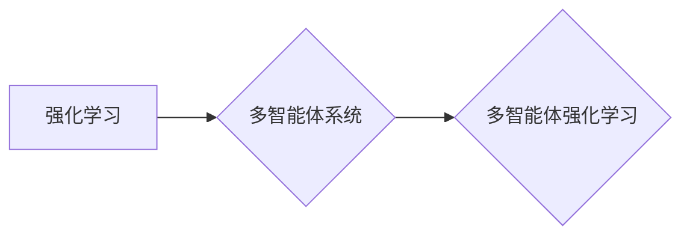

# 强化学习Reinforcement Learning的多智能体系统协作机制

作者：禅与计算机程序设计艺术 / Zen and the Art of Computer Programming

## 1. 背景介绍
### 1.1 问题的由来

随着人工智能技术的飞速发展，强化学习（Reinforcement Learning，RL）在游戏、机器人、推荐系统等领域取得了显著的成果。然而，在实际应用中，许多复杂任务往往需要多个智能体协同工作，以实现更复杂的决策和行为。因此，如何设计有效的多智能体强化学习（Multi-Agent Reinforcement Learning，MAML）协作机制，成为当前研究的热点问题。

### 1.2 研究现状

近年来，多智能体强化学习取得了长足的进步，涌现出许多具有代表性的研究，如多智能体深度Q网络（Multi-Agent Deep Q-Network，DQN）、多智能体协同强化学习（Multi-Agent Collaborative Reinforcement Learning，MACRL）、多智能体对抗强化学习（Multi-Agent Competitive Reinforcement Learning，MACRL）等。这些研究从不同角度探讨了多智能体系统的协作机制，为解决实际应用中的复杂问题提供了新的思路。

### 1.3 研究意义

研究多智能体强化学习协作机制具有重要的理论意义和应用价值：

1. **提升智能体性能**：通过有效的协作机制，多个智能体可以共享信息、协同决策，从而提高整体性能。
2. **拓展应用领域**：多智能体强化学习可以应用于机器人协作、智能交通、多机器人系统、多智能体博弈等复杂场景，具有广泛的应用前景。
3. **推动理论发展**：多智能体强化学习的研究将促进强化学习理论的发展，为解决更复杂的决策问题提供新的方法。

### 1.4 本文结构

本文将从以下方面对多智能体强化学习协作机制进行探讨：

1. 介绍多智能体强化学习的基本概念和联系。
2. 深入分析多智能体强化学习协作机制的核心算法原理和具体操作步骤。
3. 讨论多智能体强化学习协作机制的数学模型和公式，并举例说明。
4. 通过项目实践，给出多智能体强化学习协作机制的代码实例和详细解释。
5. 探讨多智能体强化学习协作机制在实际应用场景中的应用，并展望未来发展趋势。

## 2. 核心概念与联系

为了更好地理解多智能体强化学习协作机制，本节将介绍几个核心概念：

- **强化学习（Reinforcement Learning，RL）**：一种通过与环境交互，不断学习最优决策策略的方法。智能体通过选择动作，获得奖励，并不断优化策略，以最大化长期奖励。

- **多智能体系统（Multi-Agent System，MAS）**：由多个智能体组成，通过协同合作完成复杂任务的系统。智能体之间可以存在竞争、合作或协同关系。

- **多智能体强化学习（Multi-Agent Reinforcement Learning，MAML）**：一种基于强化学习方法，使多个智能体能够协同完成复杂任务。

它们的逻辑关系如下图所示：



可以看出，强化学习是多智能体强化学习的基础，多智能体系统是多智能体强化学习的研究对象，而多智能体强化学习则是针对多智能体系统设计的一种强化学习方法。

## 3. 核心算法原理 & 具体操作步骤
### 3.1 算法原理概述

多智能体强化学习协作机制的核心思想是：通过设计有效的策略和通信机制，使多个智能体能够协同完成复杂任务，实现整体性能的最优化。

具体而言，多智能体强化学习协作机制主要包括以下步骤：

1. **环境建模**：根据任务需求，建立多智能体系统的环境模型，包括智能体的状态、动作、奖励等。
2. **策略设计**：设计智能体的决策策略，包括状态-动作映射和动作选择机制。
3. **通信机制**：设计智能体之间的通信机制，实现信息共享和协同决策。
4. **学习算法**：设计多智能体强化学习算法，使智能体能够通过与环境交互，不断优化策略。

### 3.2 算法步骤详解

以下以多智能体协同强化学习（MACRL）为例，详细介绍多智能体强化学习协作机制的具体操作步骤：

1. **环境建模**：假设有 $n$ 个智能体，每个智能体的状态空间为 $S_i$，动作空间为 $A_i$，奖励函数为 $R_i$。智能体 $i$ 的策略为 $\pi_i(s_i)$，其中 $s_i \in S_i$，$a_i \in A_i$。

2. **策略设计**：设计智能体的策略 $\pi_i(s_i)$，使得智能体 $i$ 在状态 $s_i$ 下选择动作 $a_i$，以最大化长期奖励。

3. **通信机制**：设计智能体之间的通信机制，实现信息共享和协同决策。例如，智能体 $i$ 可以将自身的状态、动作和奖励等信息发送给其他智能体，共享全局信息。

4. **学习算法**：设计MACRL算法，使智能体能够通过与环境交互，不断优化策略。常见的MACRL算法包括：

   - **合作式MACRL**：所有智能体共同学习一个全局策略，以最大化整体奖励。
   - **竞争式MACRL**：智能体之间相互竞争，以获得更大的奖励。
   - **协同式MACRL**：智能体之间既竞争又合作，以实现整体性能的最优化。

### 3.3 算法优缺点

多智能体强化学习协作机制具有以下优点：

1. **提升智能体性能**：通过协作机制，智能体可以共享信息、协同决策，从而提高整体性能。
2. **拓展应用领域**：多智能体强化学习可以应用于机器人协作、智能交通、多机器人系统、多智能体博弈等复杂场景，具有广泛的应用前景。
3. **推动理论发展**：多智能体强化学习的研究将促进强化学习理论的发展，为解决更复杂的决策问题提供新的方法。

然而，多智能体强化学习协作机制也存在一定的局限性：

1. **设计难度**：设计有效的协作机制需要考虑智能体的目标、环境、通信等因素，具有一定的复杂性。
2. **计算复杂度**：多智能体强化学习通常需要求解大规模的优化问题，计算复杂度较高。
3. **稳定性**：在动态环境中，智能体之间可能存在冲突，导致系统不稳定。

### 3.4 算法应用领域

多智能体强化学习协作机制在以下领域具有广泛的应用：

- **机器人协作**：如多机器人搬运、清洁、手术等任务。
- **智能交通**：如自动驾驶、交通信号控制、车辆路径规划等。
- **多机器人系统**：如多无人机协同飞行、多机器人编队等。
- **多智能体博弈**：如围棋、象棋、电子竞技等。

## 4. 数学模型和公式 & 详细讲解 & 举例说明
### 4.1 数学模型构建

多智能体强化学习协作机制的数学模型主要包括以下部分：

- **状态空间**：描述多智能体系统当前状态的集合。
- **动作空间**：描述每个智能体可选动作的集合。
- **策略空间**：描述智能体策略的集合。
- **通信机制**：描述智能体之间信息交互的规则。
- **奖励函数**：描述智能体在特定状态和动作下获得的奖励。

以下以多智能体协同强化学习（MACRL）为例，介绍其数学模型：

假设有 $n$ 个智能体，每个智能体的状态空间为 $S_i$，动作空间为 $A_i$，策略为 $\pi_i(s_i)$，通信机制为 $C_i$，奖励函数为 $R_i$。

- **状态空间**：$S = \prod_{i=1}^n S_i$
- **动作空间**：$A = \prod_{i=1}^n A_i$
- **策略空间**：$\Pi = \prod_{i=1}^n \Pi_i$
- **通信机制**：$C = \prod_{i=1}^n C_i$
- **奖励函数**：$R = \prod_{i=1}^n R_i$

### 4.2 公式推导过程

以下以合作式MACRL为例，推导其数学模型中的关键公式。

假设智能体 $i$ 的策略为 $\pi_i(s_i)$，通信机制为 $C_i$，奖励函数为 $R_i$。则智能体 $i$ 在状态 $s_i$ 和动作 $a_i$ 下的期望奖励为：

$$
E[R_i(s_i, a_i)] = \sum_{s' \in S_i} P(s'_i|s_i, a_i) R_i(s'_i)
$$

其中，$P(s'_i|s_i, a_i)$ 表示智能体 $i$ 在状态 $s_i$ 和动作 $a_i$ 下转移到状态 $s'_i$ 的概率。

为了最大化智能体 $i$ 的长期奖励，我们需要找到最优策略 $\pi_i^*$，使得：

$$
\pi_i^* = \mathop{\arg\max}_{\pi_i} \sum_{s_i, a_i} \pi_i(s_i) E[R_i(s_i, a_i)]
$$

### 4.3 案例分析与讲解

以下以多智能体协作运输任务为例，分析多智能体强化学习协作机制的实现过程。

假设有3个智能体，分别负责运输3个包裹。智能体的状态由当前位置、目标位置和所携带包裹数量组成。智能体的动作包括移动到相邻位置和放下包裹。奖励函数根据运输距离和完成时间进行计算。

首先，建立智能体的状态空间、动作空间、策略空间和奖励函数：

- **状态空间**：$S = \{ (x_i, y_i, c_i) | x_i, y_i \in \mathbb{N}, c_i \in \{0, 1, 2, 3\} \}$
- **动作空间**：$A = \{ (x_i', y_i') | x_i', y_i' \in \mathbb{N} \}$
- **策略空间**：$\Pi = \{ \pi_i(s_i) | s_i \in S, \pi_i(s_i) \in A \}$
- **奖励函数**：$R(s, a) = \begin{cases} -1, & \text{if } c_i \
eq 0 \ -d(s, a), & \text{if } c_i = 0 \end{cases}$

其中，$d(s, a)$ 表示从状态 $s$ 移动到动作 $a$ 的距离。

接下来，设计智能体的策略和通信机制。每个智能体在状态 $s_i$ 下，根据自身目标位置和所携带包裹数量选择最优动作 $a_i$。智能体之间通过广播自己的位置信息，实现信息共享。

最后，使用MACRL算法对智能体进行训练，使它们能够协同完成运输任务。

### 4.4 常见问题解答

**Q1：多智能体强化学习协作机制如何解决智能体之间的冲突？**

A: 多智能体强化学习协作机制可以通过以下方法解决智能体之间的冲突：

1. **优先级规则**：设定智能体之间的优先级，保证高优先级智能体优先执行动作。
2. **避障策略**：智能体在执行动作时，需要检测其他智能体的位置，避免发生碰撞。
3. **协商机制**：智能体之间进行协商，达成共识，共同完成任务。

**Q2：如何评估多智能体强化学习协作机制的性能？**

A: 可以从以下几个方面评估多智能体强化学习协作机制的性能：

1. **任务完成率**：智能体是否能够成功完成预定的任务。
2. **效率**：完成任务的平均时间。
3. **稳定性**：系统在动态环境下的稳定性。
4. **公平性**：智能体之间是否公平地分享资源和收益。

## 5. 项目实践：代码实例和详细解释说明
### 5.1 开发环境搭建

在进行多智能体强化学习协作机制的项目实践之前，我们需要搭建相应的开发环境。以下是使用Python和OpenAI的Gym库进行项目实践的步骤：

1. 安装Anaconda：从官网下载并安装Anaconda，用于创建独立的Python环境。
2. 创建并激活虚拟环境：
```bash
conda create -n multi-agent-env python=3.8 
conda activate multi-agent-env
```
3. 安装PyTorch和Gym：
```bash
conda install pytorch torchvision torchaudio gym
```
4. 安装其他相关库：
```bash
pip install numpy pandas matplotlib
```

### 5.2 源代码详细实现

以下是一个基于Gym库的多智能体强化学习协作机制的简单示例：

```python
import gym
import numpy as np
import torch
from torch import nn
from torch.distributions import Categorical

# 定义智能体
class Agent(nn.Module):
    def __init__(self, state_dim, action_dim):
        super(Agent, self).__init__()
        self.fc1 = nn.Linear(state_dim, 64)
        self.fc2 = nn.Linear(64, action_dim)
    
    def forward(self, x):
        x = torch.relu(self.fc1(x))
        return self.fc2(x)
    
    def act(self, x, epsilon):
        if np.random.rand() < epsilon:
            return np.random.randint(self.fc2.out_features)
        probs = self.forward(x).softmax(0)
        return Categorical(probs).sample().item()

# 定义环境
class MultiAgentEnv(gym.Env):
    def __init__(self, num_agents):
        super(MultiAgentEnv, self).__init__()
        self.action_space = gym.spaces.Discrete(4)
        self.observation_space = gym.spaces.Box(low=-np.inf, high=np.inf, shape=(num_agents, 4))
        self.num_agents = num_agents
    
    def step(self, actions):
        # 根据动作更新状态和奖励
        # ...
        return next_state, rewards, done, info
    
    def reset(self):
        # 初始化环境状态
        # ...
        return next_state
    
    def render(self):
        # 渲染环境
        # ...
        pass

# 初始化环境
env = MultiAgentEnv(num_agents=3)
agent = Agent(env.observation_space.shape[0], env.action_space.n)

# 训练智能体
num_episodes = 1000
epsilon = 0.1
for episode in range(num_episodes):
    state = env.reset()
    done = False
    while not done:
        actions = [agent.act(state[i], epsilon) for i in range(env.num_agents)]
        next_state, rewards, done, info = env.step(actions)
        # ...
```

### 5.3 代码解读与分析

以上代码展示了使用PyTorch和Gym库实现多智能体强化学习协作机制的基本流程。以下是对关键代码的解读和分析：

1. **Agent类**：定义了一个简单的智能体类，包含一个前馈神经网络，用于将状态转换为动作。
2. **MultiAgentEnv类**：定义了一个多智能体环境类，包含智能体的状态、动作、奖励等。
3. **训练智能体**：使用一个简单的epsilon-greedy策略训练智能体，使其能够根据环境反馈不断优化策略。

### 5.4 运行结果展示

运行上述代码，可以看到智能体在环境中的行为和奖励变化。通过不断训练，智能体将学会如何协作完成特定任务。

## 6. 实际应用场景
### 6.1 智能机器人协作

多智能体强化学习协作机制在智能机器人协作领域具有广泛的应用前景。例如，多机器人搬运、清洁、手术等任务，都可以通过多智能体强化学习协作机制来实现。

### 6.2 智能交通

多智能体强化学习协作机制可以应用于智能交通领域，如自动驾驶、交通信号控制、车辆路径规划等。通过协同决策，多车辆可以高效、安全地行驶，缓解交通拥堵问题。

### 6.3 多机器人系统

多智能体强化学习协作机制可以应用于多机器人系统，如多无人机协同飞行、多机器人编队等。通过协同合作，多机器人可以完成更复杂的任务，提高工作效率。

### 6.4 多智能体博弈

多智能体强化学习协作机制可以应用于多智能体博弈领域，如围棋、象棋、电子竞技等。通过学习如何与其他智能体协同合作，智能体可以在博弈中取得更好的成绩。

### 6.5 未来应用展望

随着多智能体强化学习协作机制的不断发展，其应用领域将不断拓展。未来，多智能体强化学习协作机制有望在以下领域取得突破：

- **智能医疗**：如多机器人手术、多智能体病理分析等。
- **工业制造**：如多机器人生产线协同作业、智能调度等。
- **能源管理**：如智能电网调度、智能能源分配等。

## 7. 工具和资源推荐
### 7.1 学习资源推荐

为了更好地学习多智能体强化学习协作机制，以下推荐一些学习资源：

1. **《多智能体系统与强化学习》**：系统地介绍了多智能体系统的基本概念、算法和实现方法。
2. **《多智能体强化学习》**：详细讲解了多智能体强化学习的基本原理、算法和应用案例。
3. **Gym库官方文档**：提供了丰富的多智能体环境示例，方便开发者学习和实践。

### 7.2 开发工具推荐

以下推荐一些用于多智能体强化学习协作机制开发的开源工具：

1. **Gym**：提供丰富的多智能体环境，方便开发者进行实验和验证。
2. **OpenAI Baselines**：提供了一系列常用的强化学习算法实现，方便开发者快速上手。
3. **PyTorch**：强大的深度学习框架，支持多智能体强化学习算法的实现。

### 7.3 相关论文推荐

以下推荐一些关于多智能体强化学习协作机制的经典论文：

1. **"Algorithms for Multi-Agent Reinforcement Learning"**：综述了多智能体强化学习的基本算法和进展。
2. **"Multi-Agent Deep Q-Learning: A Survey"**：介绍了多智能体深度Q学习算法及其应用。
3. **"Collaborative Multi-Agent Reinforcement Learning"**：详细探讨了协同多智能体强化学习的基本原理和算法。

### 7.4 其他资源推荐

以下推荐一些与多智能体强化学习协作机制相关的其他资源：

1. **《人工智能：一种现代的方法》**：介绍了人工智能的基本概念、方法和应用。
2. **《深度学习》**：介绍了深度学习的基本原理、方法和应用。
3. **《图灵奖获得者John Hopfield论文集》**：收集了图灵奖获得者John Hopfield的多篇经典论文，包括多智能体协同学习等。

## 8. 总结：未来发展趋势与挑战
### 8.1 研究成果总结

本文从多智能体强化学习协作机制的理论基础、算法原理、应用场景等方面进行了全面介绍。通过分析多智能体强化学习协作机制的优势和局限性，本文揭示了其在实际应用中的巨大潜力。

### 8.2 未来发展趋势

未来，多智能体强化学习协作机制将呈现以下发展趋势：

1. **算法多样化**：随着研究的深入，将涌现更多适用于不同场景的多智能体强化学习算法。
2. **应用领域拓展**：多智能体强化学习协作机制将在更多领域得到应用，如智能医疗、工业制造、能源管理等。
3. **跨学科融合**：多智能体强化学习协作机制将与其他学科（如经济学、心理学等）进行交叉融合，形成新的研究方向。

### 8.3 面临的挑战

尽管多智能体强化学习协作机制具有广阔的应用前景，但其在实际应用中仍面临以下挑战：

1. **算法复杂性**：多智能体强化学习协作机制的算法复杂度高，需要大量的计算资源。
2. **动态环境适应性**：多智能体系统在动态环境中，智能体之间可能存在冲突，导致系统不稳定。
3. **伦理和社会影响**：多智能体强化学习协作机制在实际应用中可能引发伦理和社会问题，如失业、数据安全等。

### 8.4 研究展望

为了应对多智能体强化学习协作机制所面临的挑战，未来的研究可以从以下方面展开：

1. **算法优化**：研究更加高效、稳定的多智能体强化学习协作算法，降低计算复杂度。
2. **动态环境适应性**：研究智能体在动态环境中的适应性，提高系统稳定性。
3. **伦理和社会影响**：关注多智能体强化学习协作机制的伦理和社会影响，确保其安全、可靠、可控地应用于实际场景。

总之，多智能体强化学习协作机制是人工智能领域的一个热点研究方向，具有广泛的应用前景。随着研究的不断深入，多智能体强化学习协作机制将为人类社会创造更多的价值。

## 9. 附录：常见问题与解答

**Q1：多智能体强化学习协作机制与单智能体强化学习有何区别？**

A: 多智能体强化学习协作机制与单智能体强化学习的主要区别在于：

1. **智能体数量**：多智能体强化学习协作机制涉及多个智能体，而单智能体强化学习只关注单个智能体。
2. **环境复杂性**：多智能体强化学习协作机制的环境更加复杂，需要考虑智能体之间的交互和协作。
3. **策略设计**：多智能体强化学习协作机制需要设计有效的协作策略，而单智能体强化学习只需要设计最优决策策略。

**Q2：多智能体强化学习协作机制在哪些领域具有应用前景？**

A: 多智能体强化学习协作机制在以下领域具有广泛的应用前景：

1. **智能机器人协作**：如多机器人搬运、清洁、手术等任务。
2. **智能交通**：如自动驾驶、交通信号控制、车辆路径规划等。
3. **多机器人系统**：如多无人机协同飞行、多机器人编队等。
4. **多智能体博弈**：如围棋、象棋、电子竞技等。

**Q3：如何评估多智能体强化学习协作机制的性能？**

A: 可以从以下几个方面评估多智能体强化学习协作机制的性能：

1. **任务完成率**：智能体是否能够成功完成预定的任务。
2. **效率**：完成任务的平均时间。
3. **稳定性**：系统在动态环境下的稳定性。
4. **公平性**：智能体之间是否公平地分享资源和收益。

**Q4：多智能体强化学习协作机制在实际应用中会面临哪些挑战？**

A: 多智能体强化学习协作机制在实际应用中可能面临以下挑战：

1. **算法复杂性**：多智能体强化学习协作机制的算法复杂度高，需要大量的计算资源。
2. **动态环境适应性**：多智能体系统在动态环境中，智能体之间可能存在冲突，导致系统不稳定。
3. **伦理和社会影响**：多智能体强化学习协作机制在实际应用中可能引发伦理和社会问题，如失业、数据安全等。