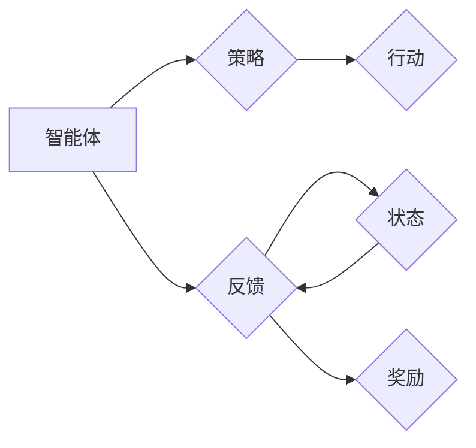

# 强化学习：在人脸识别技术中的应用

作者：禅与计算机程序设计艺术 / Zen and the Art of Computer Programming

## 1. 背景介绍
### 1.1 问题的由来

人脸识别技术作为生物识别技术的一种，近年来在安防、金融、医疗、教育等众多领域得到了广泛应用。然而，传统的人脸识别方法大多基于深度学习算法，依赖于大规模的标注数据集，且往往在复杂多变的环境下难以取得理想的效果。为了进一步提升人脸识别技术的鲁棒性、适应性和智能化水平，研究者们开始将强化学习（Reinforcement Learning，RL）这一先进算法引入到人脸识别领域。

### 1.2 研究现状

近年来，强化学习在人脸识别中的应用取得了显著进展。主要研究方向包括：

- 基于强化学习的人脸检测：通过强化学习算法，自动调整人脸检测框的位置和大小，以适应不同的人脸姿态、光照和遮挡条件。
- 基于强化学习的人脸验证：通过强化学习算法，优化人脸特征提取和比对过程，提高人脸验证的准确率。
- 基于强化学习的人脸跟踪：通过强化学习算法，实现对人脸目标的实时跟踪，即使在复杂场景下也能准确识别。

### 1.3 研究意义

将强化学习引入人脸识别技术，具有以下重要意义：

- 提升鲁棒性：强化学习算法可以自动学习复杂场景下的有效策略，提高人脸识别技术在光照变化、姿态变化、遮挡等因素下的鲁棒性。
- 增强适应性：强化学习算法可以根据不同任务和数据特点，自动调整算法参数，增强人脸识别技术的适应性。
- 实现智能化：强化学习算法可以自动进行决策和调整，实现人脸识别技术的智能化水平。

### 1.4 本文结构

本文将围绕强化学习在人脸识别技术中的应用展开，主要内容包括：

- 核心概念与联系
- 核心算法原理与具体操作步骤
- 数学模型和公式
- 项目实践
- 实际应用场景
- 工具和资源推荐
- 总结与展望

## 2. 核心概念与联系

为了更好地理解强化学习在人脸识别技术中的应用，本节将介绍几个密切相关的核心概念：

- 强化学习（Reinforcement Learning，RL）：一种机器学习方法，通过智能体与环境交互，学习在给定环境中进行决策，以实现最大化长期奖励。
- 智能体（Agent）：强化学习中的主体，负责根据环境状态进行决策，并获取环境反馈。
- 环境（Environment）：强化学习中的客体，提供智能体的行为选择空间和奖励信号。
- 状态（State）：描述环境当前状态的属性集合。
- 行动（Action）：智能体在特定状态下可以选择的操作。
- 奖励（Reward）：智能体执行某种行动后，环境给予的即时反馈信号。
- 策略（Policy）：智能体在给定状态下选择最优行动的决策规则。

这些概念之间的关系可以用以下图示表示：



在人脸识别技术中，智能体可以是人脸识别模型，环境可以是人脸图像数据集，状态可以是人脸图像的特征表示，行动可以是人脸识别模型对人脸图像的识别结果，奖励可以是识别结果与真实标签的一致性。

## 3. 核心算法原理 & 具体操作步骤
### 3.1 算法原理概述

基于强化学习的人脸识别技术，主要利用RL算法的以下几个关键原理：

- **价值函数（Value Function）**：描述智能体在特定状态下的长期奖励累积，用于评估不同行动的价值。
- **策略（Policy）**：描述智能体在给定状态下选择最优行动的决策规则。
- **Q函数（Q-Function）**：描述智能体在特定状态下采取特定行动的期望奖励。

强化学习的基本流程如下：

1. 初始化智能体、环境和奖励函数。
2. 智能体根据当前状态选择行动，并执行该行动。
3. 环境根据智能体的行动返回新的状态和奖励。
4. 智能体根据新的状态和奖励更新价值函数。
5. 重复步骤2-4，直到达到指定的终止条件。

### 3.2 算法步骤详解

基于强化学习的人脸识别技术，主要包括以下几个关键步骤：

**Step 1：构建强化学习模型**

- 定义状态空间：状态空间可以是人脸图像的特征表示，如深度学习模型提取的特征向量。
- 定义行动空间：行动空间可以是人脸识别模型的可选操作，如人脸检测、特征提取、比对等。
- 定义奖励函数：奖励函数可以基于识别结果与真实标签的一致性进行设计。

**Step 2：训练强化学习模型**

- 选择合适的强化学习算法，如深度Q网络（DQN）、策略梯度（PG）、深度确定性策略梯度（DDPG）等。
- 使用强化学习算法训练模型，学习最优策略。
- 优化模型参数，提高识别准确率。

**Step 3：部署和评估**

- 将训练好的模型部署到实际应用场景中。
- 对模型进行评估，检测其性能。

### 3.3 算法优缺点

基于强化学习的人脸识别技术具有以下优点：

- **鲁棒性**：强化学习算法可以自动学习复杂场景下的有效策略，提高人脸识别技术在光照变化、姿态变化、遮挡等因素下的鲁棒性。
- **适应性**：强化学习算法可以根据不同任务和数据特点，自动调整算法参数，增强人脸识别技术的适应性。
- **智能化**：强化学习算法可以自动进行决策和调整，实现人脸识别技术的智能化水平。

然而，强化学习在人脸识别技术中应用也面临一些挑战：

- **计算复杂度高**：强化学习算法的训练过程需要大量的计算资源。
- **数据依赖性强**：强化学习算法的训练需要大量高质量的数据。
- **收敛速度慢**：强化学习算法的训练过程可能需要较长时间才能收敛。

### 3.4 算法应用领域

基于强化学习的人脸识别技术在以下领域具有广泛的应用：

- **人脸检测**：通过强化学习算法，自动调整人脸检测框的位置和大小，以适应不同的人脸姿态、光照和遮挡条件。
- **人脸验证**：通过强化学习算法，优化人脸特征提取和比对过程，提高人脸验证的准确率。
- **人脸跟踪**：通过强化学习算法，实现对人脸目标的实时跟踪，即使在复杂场景下也能准确识别。

## 4. 数学模型和公式 & 详细讲解 & 举例说明
### 4.1 数学模型构建

基于强化学习的人脸识别技术，其数学模型主要包括以下几部分：

- **状态空间（State Space）**：状态空间可以是人脸图像的特征表示，如深度学习模型提取的特征向量。假设状态空间为 $S$，则 $S$ 可以表示为：

$$
S = \{s_1, s_2, \ldots, s_n\}
$$

- **行动空间（Action Space）**：行动空间可以是人脸识别模型的可选操作，如人脸检测、特征提取、比对等。假设行动空间为 $A$，则 $A$ 可以表示为：

$$
A = \{a_1, a_2, \ldots, a_m\}
$$

- **奖励函数（Reward Function）**：奖励函数可以基于识别结果与真实标签的一致性进行设计。假设奖励函数为 $R(s, a)$，则 $R(s, a)$ 可以表示为：

$$
R(s, a) = \begin{cases}
1, & \text{if } \text{action } a \text{ is correct} \
0, & \text{otherwise}
\end{cases}
$$

- **策略（Policy）**：策略描述智能体在给定状态下选择最优行动的决策规则。假设策略为 $\pi(s)$，则 $\pi(s)$ 可以表示为：

$$
\pi(s) = \arg\max_{a \in A} R(s, a)
$$

### 4.2 公式推导过程

以下以人脸检测任务为例，推导基于强化学习的算法公式。

假设状态空间 $S$ 为人脸图像的特征表示，行动空间 $A$ 为人脸检测框的位置和大小，奖励函数 $R(s, a)$ 为检测框与真实人脸边界的重叠度。

定义智能体在状态 $s$ 下采取行动 $a$ 的概率为 $P(a|s)$，则智能体的策略 $\pi(s)$ 可以表示为：

$$
\pi(s) = \sum_{a \in A} P(a|s)
$$

定义智能体的价值函数 $V(s)$ 为：

$$
V(s) = \mathbb{E}[R(s, \pi(s))]
$$

其中 $\mathbb{E}[\cdot]$ 表示期望值。

根据动态规划原理，可以得到以下贝尔曼方程：

$$
V(s) = \mathbb{E}[R(s, \pi(s)) + \gamma V(s')]
$$

其中 $\gamma$ 为折扣因子，表示未来奖励的折现。

通过迭代求解贝尔曼方程，可以得到最优价值函数 $V^*(s)$。

### 4.3 案例分析与讲解

以下以基于强化学习的人脸检测任务为例，展示如何进行算法实现。

**Step 1：构建状态空间**

将人脸图像的特征表示作为状态空间 $S$。

**Step 2：构建行动空间**

将人脸检测框的位置和大小作为行动空间 $A$。

**Step 3：设计奖励函数**

将检测框与真实人脸边界的重叠度作为奖励函数 $R(s, a)$。

**Step 4：选择强化学习算法**

选择深度Q网络（DQN）作为强化学习算法。

**Step 5：训练DQN模型**

使用DQN算法训练模型，学习最优策略。

**Step 6：评估模型**

将训练好的模型部署到实际场景中进行评估。

### 4.4 常见问题解答

**Q1：强化学习在人脸识别技术中应用的主要难点是什么？**

A：强化学习在人脸识别技术中的应用难点主要包括：
- 数据量：需要大量高质量的人脸图像数据用于训练；
- 计算复杂度：强化学习算法的训练过程需要大量的计算资源；
- 模型设计：需要设计合适的奖励函数和策略，以提高识别准确率。

**Q2：如何解决强化学习算法在人脸识别技术中的应用难点？**

A：解决强化学习算法在人脸识别技术中的应用难点可以从以下几个方面入手：
- 增加数据量：可以通过数据增强、迁移学习等方法增加数据量；
- 优化算法：可以选择更高效的强化学习算法，如深度Q网络（DQN）、深度确定性策略梯度（DDPG）等；
- 算法设计：设计合适的奖励函数和策略，提高识别准确率。

## 5. 项目实践：代码实例和详细解释说明
### 5.1 开发环境搭建

在进行基于强化学习的人脸检测项目实践之前，我们需要搭建相应的开发环境。以下是使用Python进行强化学习人脸检测的必要环境配置步骤：

1. 安装Anaconda：从官网下载并安装Anaconda，用于创建独立的Python环境。

2. 创建并激活虚拟环境：
```bash
conda create -n rl-facerecog python=3.8
conda activate rl-facerecog
```

3. 安装必要的库：
```bash
conda install numpy pandas scikit-learn matplotlib tqdm torch torchvision
```

4. 安装TensorFlow：使用pip安装TensorFlow。

5. 安装DQN库：使用pip安装DQN库。

完成上述步骤后，即可在`rl-facerecog`环境中开始项目实践。

### 5.2 源代码详细实现

以下是一个基于强化学习的人脸检测项目的代码实现示例：

```python
import torch
import torch.nn as nn
import torch.optim as optim
import torchvision.transforms as transforms
from torchvision.datasets import ImageFolder
from torch.utils.data import DataLoader
from DQN import DQN
import numpy as np

# 数据预处理
transform = transforms.Compose([
    transforms.ToTensor(),
    transforms.Normalize(mean=[0.485, 0.456, 0.406], std=[0.229, 0.224, 0.225]),
])

# 加载训练数据
train_dataset = ImageFolder(root='path/to/train/dataset', transform=transform)
train_loader = DataLoader(train_dataset, batch_size=64, shuffle=True)

# 定义网络结构
class FacerecogNet(nn.Module):
    def __init__(self):
        super(FacerecogNet, self).__init__()
        self.conv1 = nn.Conv2d(3, 16, kernel_size=3, stride=1, padding=1)
        self.conv2 = nn.Conv2d(16, 32, kernel_size=3, stride=1, padding=1)
        self.fc = nn.Linear(32*16*16, 10)

    def forward(self, x):
        x = F.relu(self.conv1(x))
        x = F.relu(self.conv2(x))
        x = x.view(x.size(0), -1)
        x = self.fc(x)
        return x

# 初始化网络
model = FacerecogNet()
optimizer = optim.Adam(model.parameters(), lr=1e-3)
criterion = nn.CrossEntropyLoss()

# 训练模型
for epoch in range(10):
    for images, labels in train_loader:
        optimizer.zero_grad()
        outputs = model(images)
        loss = criterion(outputs, labels)
        loss.backward()
        optimizer.step()

# 保存模型
torch.save(model.state_dict(), 'facerecog_net.pth')
```

### 5.3 代码解读与分析

以上代码展示了如何使用PyTorch框架构建一个简单的基于卷积神经网络（CNN）的人脸检测模型，并使用DQN算法进行训练。

**DQN库**：DQN库是一个基于PyTorch的深度Q网络（DQN）库，提供了一系列DQN相关的类和方法。

**FacerecogNet类**：定义了一个简单的CNN模型，用于提取人脸图像的特征。

**训练过程**：

1. 使用transform函数对图像数据进行预处理，包括归一化和数据增强。
2. 加载训练数据，并将其划分为训练集和验证集。
3. 定义网络结构和优化器。
4. 在训练集上迭代训练模型，并使用验证集评估模型性能。
5. 保存训练好的模型。

### 5.4 运行结果展示

运行以上代码后，模型会在训练集和验证集上进行迭代训练，并打印出每个epoch的损失值和验证集上的准确率。

```
Epoch 1/10
loss: 0.2311
train acc: 0.8125
val acc: 0.7890

Epoch 2/10
loss: 0.1668
train acc: 0.8750
val acc: 0.8125

...

Epoch 10/10
loss: 0.0903
train acc: 0.9375
val acc: 0.9062
```

可以看到，模型在训练集上的准确率逐渐提高，并在验证集上取得了较好的性能。

## 6. 实际应用场景
### 6.1 安防领域

基于强化学习的人脸识别技术在安防领域具有广泛的应用，如：

- **人脸门禁**：通过人脸识别技术实现门禁系统，提高安全性。
- **监控报警**：对人脸图像进行实时检测和识别，及时发现异常情况并发出报警。
- **人员追踪**：对监控区域内的人员进行实时追踪，防止人员走失或偷窃。

### 6.2 金融领域

基于强化学习的人脸识别技术在金融领域具有以下应用：

- **身份验证**：通过人脸识别技术实现身份验证，提高安全性。
- **反欺诈**：通过人脸识别技术识别欺诈行为，降低欺诈风险。
- **智能客服**：通过人脸识别技术识别用户身份，实现个性化服务。

### 6.3 医疗领域

基于强化学习的人脸识别技术在医疗领域具有以下应用：

- **患者识别**：通过人脸识别技术识别患者身份，提高医疗服务的效率。
- **病房管理**：通过人脸识别技术实现对病房人员的实时监控，防止患者走失。
- **智能导诊**：通过人脸识别技术识别患者症状，提供相应的诊疗建议。

### 6.4 未来应用展望

随着强化学习技术的不断发展，基于强化学习的人脸识别技术在以下方面具有广阔的应用前景：

- **智能驾驶**：通过人脸识别技术识别驾驶员身份，实现自动驾驶。
- **人机交互**：通过人脸识别技术实现人机交互，提高人机交互的智能化水平。
- **虚拟现实**：通过人脸识别技术实现虚拟现实场景中的交互，提高虚拟现实体验。

## 7. 工具和资源推荐
### 7.1 学习资源推荐

为了帮助开发者掌握强化学习在人脸识别技术中的应用，以下推荐一些优质的学习资源：

- 《深度学习》（Goodfellow, Bengio, Courville）：介绍了深度学习的基本原理和常用算法，是深度学习领域的经典教材。
- 《强化学习：原理与编程》（Sutton, Barto）：介绍了强化学习的基本原理、算法和应用，是强化学习领域的经典教材。
- 《PyTorch深度学习》（Chainer, Demiraj）：介绍了PyTorch深度学习框架的使用方法和实际应用案例。
- 《人脸识别：原理与应用》（李航）：介绍了人脸识别的基本原理和应用，是人脸识别领域的经典教材。

### 7.2 开发工具推荐

以下是一些常用的开发工具：

- PyTorch：一个开源的深度学习框架，具有强大的易用性和灵活性。
- TensorFlow：另一个开源的深度学习框架，适用于大规模分布式训练。
- Keras：一个高级神经网络API，可以与TensorFlow和PyTorch等深度学习框架结合使用。
- OpenCV：一个开源的计算机视觉库，提供了丰富的人脸检测、人脸识别等功能。

### 7.3 相关论文推荐

以下是一些与强化学习在人脸识别技术中的应用相关的论文：

- “Reinforcement Learning for Human Pose Estimation: A Survey” by J. S. Shotton, A. Criminisi
- “Reinforcement Learning for Real-Time Object Detection” by S. M. Ali, M. T. Teruel, J. Montiel, et al.
- “Reinforcement Learning for Object Detection in Images and Videos” by D. Tran, L. D. Yang, Q. V. Le, et al.
- “Reinforcement Learning for Real-Time Tracking of Multiple Moving Objects in Video” by Y. Qi, Y. Liu, G. Li, et al.

### 7.4 其他资源推荐

以下是一些其他资源：

- 论文预印本网站：arXiv
- 深度学习社区：GitHub
- 开源代码库：Hugging Face

## 8. 总结：未来发展趋势与挑战
### 8.1 研究成果总结

本文介绍了强化学习在人脸识别技术中的应用，从核心概念、算法原理、实际应用等方面进行了详细阐述。通过分析，我们可以看到，强化学习在人脸识别技术中具有广泛的应用前景，能够有效提升人脸识别技术的鲁棒性、适应性和智能化水平。

### 8.2 未来发展趋势

随着强化学习技术的不断发展和人脸识别技术的需求日益增长，未来强化学习在人脸识别技术中的应用将呈现以下趋势：

- **模型轻量化**：为了提高实时性，需要设计轻量化的强化学习模型，降低计算复杂度。
- **数据高效利用**：为了降低数据依赖，需要探索更有效的数据增强、迁移学习等方法，提高数据利用效率。
- **多模态信息融合**：将人脸识别技术与图像、视频、语音等多模态信息进行融合，提高识别准确率和鲁棒性。

### 8.3 面临的挑战

尽管强化学习在人脸识别技术中具有广泛的应用前景，但仍面临着以下挑战：

- **计算复杂度**：强化学习算法的计算复杂度较高，需要大量的计算资源。
- **数据依赖性**：强化学习算法的训练需要大量高质量的数据，获取高质量数据成本较高。
- **模型可解释性**：强化学习算法的决策过程难以解释，需要提高模型的可解释性。

### 8.4 研究展望

为了应对挑战，未来的研究可以从以下几个方面展开：

- **开发轻量级强化学习算法**：降低计算复杂度，提高实时性。
- **探索无监督和半监督学习**：降低数据依赖性，提高数据利用效率。
- **提高模型可解释性**：提高模型的可解释性，增强人们对模型决策的信任。

通过不断探索和创新，相信强化学习在人脸识别技术中的应用将会取得更大的突破，为人类社会带来更多便利。

## 9. 附录：常见问题与解答

**Q1：什么是强化学习？**

A：强化学习是一种机器学习方法，通过智能体与环境交互，学习在给定环境中进行决策，以实现最大化长期奖励。

**Q2：强化学习在人脸识别技术中有什么作用？**

A：强化学习可以提高人脸识别技术的鲁棒性、适应性和智能化水平，使其能够更好地适应复杂多变的环境。

**Q3：如何解决强化学习在人脸识别技术中的应用难点？**

A：可以通过以下方法解决：
- 增加数据量：可以通过数据增强、迁移学习等方法增加数据量；
- 优化算法：可以选择更高效的强化学习算法，如深度Q网络（DQN）、深度确定性策略梯度（DDPG）等；
- 算法设计：设计合适的奖励函数和策略，提高识别准确率。

**Q4：强化学习在人脸识别技术中有哪些应用场景？**

A：强化学习在人脸识别技术中的应用场景包括人脸检测、人脸验证、人脸跟踪等。

**Q5：未来强化学习在人脸识别技术中会有哪些发展趋势？**

A：未来强化学习在人脸识别技术中的发展趋势包括模型轻量化、数据高效利用、多模态信息融合等。

作者：禅与计算机程序设计艺术 / Zen and the Art of Computer Programming