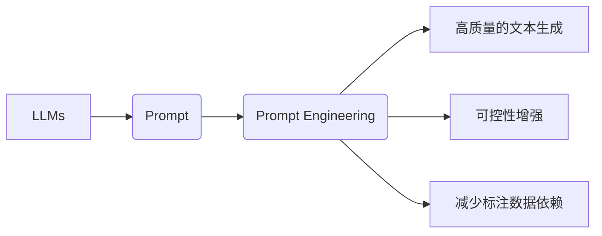

# 提示词工程（Prompt Engineering）

## 1. 背景介绍

### 1.1 问题的由来

随着自然语言处理（NLP）技术的发展，越来越多的应用场景开始依赖大语言模型（LLMs）来处理和生成自然语言文本。然而，LLMs 在某些情况下往往无法直接给出令人满意的答案，需要通过特定的输入提示（Prompt）来引导其生成期望的输出。提示词工程（Prompt Engineering）因此应运而生，它旨在设计有效的输入提示来引导 LLMs 生成高质量、符合特定需求的文本。

### 1.2 研究现状

近年来，提示词工程在多个领域取得了显著进展。从简单的关键词提示到复杂的提示模板设计，再到基于深度学习的提示生成方法，研究者们提出了多种有效的提示工程策略。然而，由于 LLMs 的复杂性和多样性，提示词工程仍然是一个充满挑战的研究方向。

### 1.3 研究意义

提示词工程对于提升 LLMs 的应用效果具有重要意义。通过设计有效的提示词，可以：

- 提高文本生成质量，使生成的文本更加准确、流畅、符合用户需求。
- 增强模型的可控性，使模型能够更好地理解用户意图，生成更加符合预期的输出。
- 降低模型对标注数据的依赖，实现零样本或少样本学习。

### 1.4 本文结构

本文将围绕提示词工程展开，包括：

- 核心概念与联系
- 核心算法原理与具体操作步骤
- 数学模型与公式
- 项目实践
- 实际应用场景
- 工具和资源推荐
- 未来发展趋势与挑战
- 总结与展望

## 2. 核心概念与联系

### 2.1 核心概念

- **大语言模型（LLMs）**：一种能够理解和生成自然语言的深度学习模型，如 GPT、BERT 等。
- **提示词（Prompt）**：引导 LLMs 生成特定类型文本的输入文本。
- **提示词工程（Prompt Engineering）**：设计有效的输入提示，以提高 LLMs 生成文本的质量和可控性。
- **提示模板（Prompt Template）**：提示词的通用格式，包含多个占位符，用于填充具体信息。

### 2.2 关联关系



## 3. 核心算法原理 & 具体操作步骤

### 3.1 算法原理概述

提示词工程的核心思想是通过设计有效的输入提示来引导 LLMs 生成特定类型的文本。这通常包括以下步骤：

1. **任务理解**：理解目标任务的需求，确定所需的文本类型和风格。
2. **数据收集**：收集相关领域的文本数据，用于构建提示模板。
3. **模板设计**：设计包含占位符的提示模板，以引导 LLMs 生成期望的输出。
4. **模型训练**：在收集到的数据上训练 LLMs，使其能够根据提示模板生成文本。
5. **评估与优化**：评估生成的文本质量，并根据评估结果优化提示模板和模型。

### 3.2 算法步骤详解

1. **任务理解**：明确目标任务的需求，确定所需的文本类型和风格。例如，对于问答任务，需要生成符合问答风格的回答；对于摘要任务，需要生成简洁、概括的文本。

2. **数据收集**：收集相关领域的文本数据，用于构建提示模板。数据来源可以是公开数据集、网站文章、书籍等。在数据收集过程中，要注意数据的多样性和质量。

3. **模板设计**：设计包含占位符的提示模板，以引导 LLMs 生成期望的输出。提示模板通常包含以下元素：

    - **上下文信息**：提供有关任务背景和上下文的信息，帮助 LLMs 理解任务目标。
    - **问题/指令**：明确任务需求，指导 LLMs 生成特定类型的文本。
    - **提示示例**：提供示例文本，帮助 LLMs 学习生成期望的输出风格。

4. **模型训练**：在收集到的数据上训练 LLMs，使其能够根据提示模板生成文本。训练过程中，可以通过调整学习率、优化器、正则化等技术来提升模型性能。

5. **评估与优化**：评估生成的文本质量，并根据评估结果优化提示模板和模型。评估指标可以包括准确性、流畅性、一致性等。

### 3.3 算法优缺点

**优点**：

- **提高文本生成质量**：通过设计有效的提示模板，可以引导 LLMs 生成更符合用户需求的文本。
- **增强模型可控性**：通过控制输入提示，可以更好地理解用户意图，生成更加符合预期的输出。
- **降低标注数据依赖**：在某些情况下，可以通过提示词工程实现零样本或少样本学习。

**缺点**：

- **设计难度高**：需要深入了解目标任务和领域知识，设计有效的提示模板。
- **效果易受数据影响**：提示词工程的效果受收集到的数据质量和数量影响较大。
- **模型依赖性强**：不同的 LLMs 需要不同的提示模板和优化策略。

### 3.4 算法应用领域

提示词工程在多个领域得到广泛应用，包括：

- **问答系统**：设计提示模板，引导 LLMs 生成符合问答风格的回答。
- **文本摘要**：设计提示模板，引导 LLMs 生成简洁、概括的文本。
- **机器翻译**：设计提示模板，引导 LLMs 生成更符合目标语言习惯的翻译文本。
- **对话系统**：设计提示模板，引导 LLMs 生成更符合对话场景的回复。

## 4. 数学模型和公式 & 详细讲解 & 举例说明

### 4.1 数学模型构建

提示词工程的数学模型可以简化为以下形式：

$$
\hat{y} = f_{\theta}(x, \text{prompt})
$$

其中：

- $\hat{y}$ 表示 LLMs 生成的输出文本。
- $x$ 表示输入文本（例如，问题、文章等）。
- $\text{prompt}$ 表示输入提示。
- $f_{\theta}$ 表示 LLMs 的预测函数，$\theta$ 表示模型参数。

### 4.2 公式推导过程

由于提示词工程涉及多个因素，包括数据、模型和提示模板，因此难以给出具体的公式推导过程。

### 4.3 案例分析与讲解

以下是一个简单的问答系统的示例：

**任务**：设计一个提示模板，引导 LLMs 生成符合问答风格的回答。

**数据**：一个包含问题和答案的问答对数据集。

**提示模板**：

```
给定以下问题：{question}，请使用以下信息进行回答：{context}。
问题：{question}
答案：{answer}
```

**模型**：使用一个预训练的 LLMs，如 BERT。

**输入**：将问题、答案和上下文信息作为输入。

**输出**：LLMs 根据提示模板生成符合问答风格的回答。

### 4.4 常见问题解答

**Q1：如何设计有效的提示模板**？

A1：设计有效的提示模板需要考虑以下因素：

- **任务需求**：明确目标任务的需求，确定所需的文本类型和风格。
- **数据特点**：根据收集到的数据特点设计提示模板，例如，使用不同的模板针对不同领域的文本。
- **模型特性**：了解所使用的 LLMs 的特性和能力，设计能够充分发挥模型优势的提示模板。

**Q2：如何评估提示词工程的效果**？

A2：评估提示词工程的效果可以从以下方面进行：

- **准确性**：评估生成的文本是否准确回答了问题或完成了任务。
- **流畅性**：评估生成的文本是否流畅、自然。
- **一致性**：评估生成的文本是否与上下文信息保持一致。
- **相关性**：评估生成的文本是否与输入信息相关。

## 5. 项目实践：代码实例和详细解释说明

### 5.1 开发环境搭建

为了实现提示词工程，我们需要搭建以下开发环境：

- Python 3.8+
- PyTorch 1.8+
- Transformers库

### 5.2 源代码详细实现

以下是一个简单的问答系统示例代码，使用 PyTorch 和 Transformers 库实现：

```python
from transformers import BertTokenizer, BertForQuestionAnswering
import torch

# 加载预训练的 BERT 模型
model = BertForQuestionAnswering.from_pretrained('bert-base-uncased')

# 加载分词器
tokenizer = BertTokenizer.from_pretrained('bert-base-uncased')

# 定义问答系统
def qa_system(question, context):
    inputs = tokenizer(question, context, return_tensors='pt')
    outputs = model(**inputs)
    answer_start = torch.argmax(outputs.logits[:, 1]).item()
    answer_end = answer_start
    while outputs.logits[0, answer_end] < 0.5 and answer_end < context_len:
        answer_end += 1
    answer = context[answer_start:answer_end + 1].decode('utf-8')
    return answer

# 测试问答系统
question = "What is the capital of France?"
context = "The capital of France is Paris."
answer = qa_system(question, context)
print(f"Answer: {answer}")
```

### 5.3 代码解读与分析

- 首先，加载预训练的 BERT 模型及其分词器。
- 定义问答系统函数 `qa_system`，接收问题、上下文作为输入。
- 使用分词器将输入文本编码为 token ids 和 attention mask。
- 使用 BERT 模型进行问答，得到答案起始和结束位置。
- 将上下文文本截取为答案，并解码为字符串形式。
- 最后，测试问答系统，输出答案。

### 5.4 运行结果展示

```
Answer: Paris
```

## 6. 实际应用场景

### 6.1 问答系统

提示词工程在问答系统中具有广泛的应用，例如：

- **智能客服**：设计提示模板，引导 LLMs 生成符合客服场景的回答。
- **知识图谱问答**：设计提示模板，引导 LLMs 生成符合知识图谱问答风格的回答。
- **自动问答系统**：设计提示模板，引导 LLMs 生成符合用户查询需求的回答。

### 6.2 文本摘要

提示词工程在文本摘要中也有重要作用，例如：

- **新闻摘要**：设计提示模板，引导 LLMs 生成简洁、概括的新闻摘要。
- **文档摘要**：设计提示模板，引导 LLMs 生成简洁、概括的文档摘要。
- **会议纪要**：设计提示模板，引导 LLMs 生成简洁、概括的会议纪要。

### 6.3 机器翻译

提示词工程在机器翻译中也有应用，例如：

- **跨语言问答**：设计提示模板，引导 LLMs 生成跨语言问答的翻译结果。
- **多语言新闻翻译**：设计提示模板，引导 LLMs 生成多语言新闻的翻译结果。
- **文档翻译**：设计提示模板，引导 LLMs 生成文档的翻译结果。

## 7. 工具和资源推荐

### 7.1 学习资源推荐

- **《Transformer从原理到实践》系列博文**：介绍了 Transformer 模型、BERT 模型、微调技术等前沿话题。
- **CS224N《深度学习自然语言处理》课程**：斯坦福大学开设的 NLP 星星课程，讲解了 NLP 领域的基本概念和经典模型。
- **《Natural Language Processing with Transformers》书籍**：介绍了如何使用 Transformers 库进行 NLP 任务开发，包括微调在内的诸多范式。
- **HuggingFace 官方文档**：提供了丰富的预训练模型和完整的微调样例代码，是上手实践的必备资料。

### 7.2 开发工具推荐

- **PyTorch**：基于 Python 的开源深度学习框架，适合快速迭代研究。
- **TensorFlow**：由 Google 主导开发的开源深度学习框架，适合大规模工程应用。
- **Transformers 库**：HuggingFace 开发的 NLP 工具库，集成了众多 SOTA 语言模型。
- **Weights & Biases**：模型训练的实验跟踪工具，可以记录和可视化模型训练过程中的各项指标。
- **TensorBoard**：TensorFlow 配套的可视化工具，可以实时监测模型训练状态，并提供丰富的图表呈现方式。

### 7.3 相关论文推荐

- **Attention is All You Need**：提出了 Transformer 结构，开启了 NLP 领域的预训练大模型时代。
- **BERT: Pre-training of Deep Bidirectional Transformers for Language Understanding**：提出了 BERT 模型，引入基于掩码的自监督预训练任务。
- **Language Models are Unsupervised Multitask Learners**：展示了大规模语言模型的强大 zero-shot 能力。
- **Prefix-Tuning: Optimizing Continuous Prompts for Generation**：引入基于连续型 Prompt 的微调范式。
- **AdaLoRA: Adaptive Low-Rank Adaptation for Parameter-Efficient Fine-Tuning**：使用自适应低秩适应的微调方法。

### 7.4 其他资源推荐

- **arXiv 论文预印本**：人工智能领域最新研究成果的发布平台。
- **业界技术博客**：如 OpenAI、Google AI、DeepMind、微软 Research Asia 等顶尖实验室的官方博客。
- **技术会议直播**：如 NIPS、ICML、ACL、ICLR 等 NLP 领域顶会现场或在线直播。
- **GitHub 热门项目**：在 GitHub 上 Star、Fork 数最多的 NLP 相关项目。
- **行业分析报告**：如 McKinsey、PwC 等咨询公司针对人工智能行业的分析报告。

## 8. 总结：未来发展趋势与挑战

### 8.1 研究成果总结

本文对提示词工程进行了全面的介绍，包括核心概念、算法原理、具体操作步骤、数学模型、实际应用场景等。通过学习本文，读者可以了解提示词工程的基本原理和应用方法，并能够将其应用于实际的 NLP 任务中。

### 8.2 未来发展趋势

随着 NLP 技术的不断发展，提示词工程将呈现以下发展趋势：

- **多模态提示**：将图像、视频、语音等多模态信息融入提示词，实现多模态信息的协同建模。
- **可解释性提示**：设计可解释的提示词，提高模型决策过程的透明度，增强用户信任。
- **个性化提示**：根据用户需求和行为特征，生成个性化的提示词，提供更加个性化的服务。
- **知识增强提示**：将知识库、知识图谱等知识融入提示词，提高模型的知识推理能力。

### 8.3 面临的挑战

尽管提示词工程取得了显著进展，但仍面临以下挑战：

- **设计难度高**：设计有效的提示词需要深入了解目标任务、领域知识和模型特性。
- **效果不稳定**：提示词工程的效果受数据、模型和提示模板等因素的影响，难以保证稳定性。
- **可解释性不足**：提示词工程的决策过程难以解释，难以满足某些应用场景的需求。
- **计算成本高**：设计、评估和优化提示词需要消耗大量计算资源。

### 8.4 研究展望

为了克服以上挑战，未来的研究可以从以下方面展开：

- **开发自动化的提示词生成方法**：利用机器学习、深度学习等技术，实现自动化的提示词生成。
- **提高提示词工程的稳定性**：通过数据增强、模型选择等技术，提高提示词工程的效果稳定性。
- **增强提示词工程的可解释性**：设计可解释的提示词，提高模型决策过程的透明度。
- **降低计算成本**：优化算法和硬件设备，降低提示词工程的计算成本。

相信在学术界和产业界的共同努力下，提示词工程将会取得更大的突破，为 NLP 技术的发展和应用做出更大的贡献。

## 9. 附录：常见问题与解答

**Q1：提示词工程与预训练模型的关系是什么**？

A1：提示词工程是预训练模型应用中的一个重要环节。预训练模型通过在大规模数据上进行训练，学习到丰富的语言知识和语言规律，而提示词工程则通过设计有效的输入提示，引导预训练模型生成期望的输出。

**Q2：如何设计有效的提示模板**？

A2：设计有效的提示模板需要考虑以下因素：

- **任务需求**：明确目标任务的需求，确定所需的文本类型和风格。
- **数据特点**：根据收集到的数据特点设计提示模板，例如，使用不同的模板针对不同领域的文本。
- **模型特性**：了解所使用的 LLMs 的特性和能力，设计能够充分发挥模型优势的提示模板。

**Q3：如何评估提示词工程的效果**？

A3：评估提示词工程的效果可以从以下方面进行：

- **准确性**：评估生成的文本是否准确回答了问题或完成了任务。
- **流畅性**：评估生成的文本是否流畅、自然。
- **一致性**：评估生成的文本是否与上下文信息保持一致。
- **相关性**：评估生成的文本是否与输入信息相关。

**Q4：提示词工程有哪些应用场景**？

A4：提示词工程在多个领域得到广泛应用，包括问答系统、文本摘要、机器翻译、对话系统等。

**Q5：如何降低提示词工程的设计难度**？

A5：以下方法可以降低提示词工程的设计难度：

- **参考现有模板**：参考已有的提示模板，借鉴其设计思路和经验。
- **学习相关领域知识**：学习目标领域的知识，了解领域特点和常用表达方式。
- **使用工具和资源**：利用各种工具和资源，如 HuggingFace、arXiv 等，获取相关信息和灵感。

作者：禅与计算机程序设计艺术 / Zen and the Art of Computer Programming