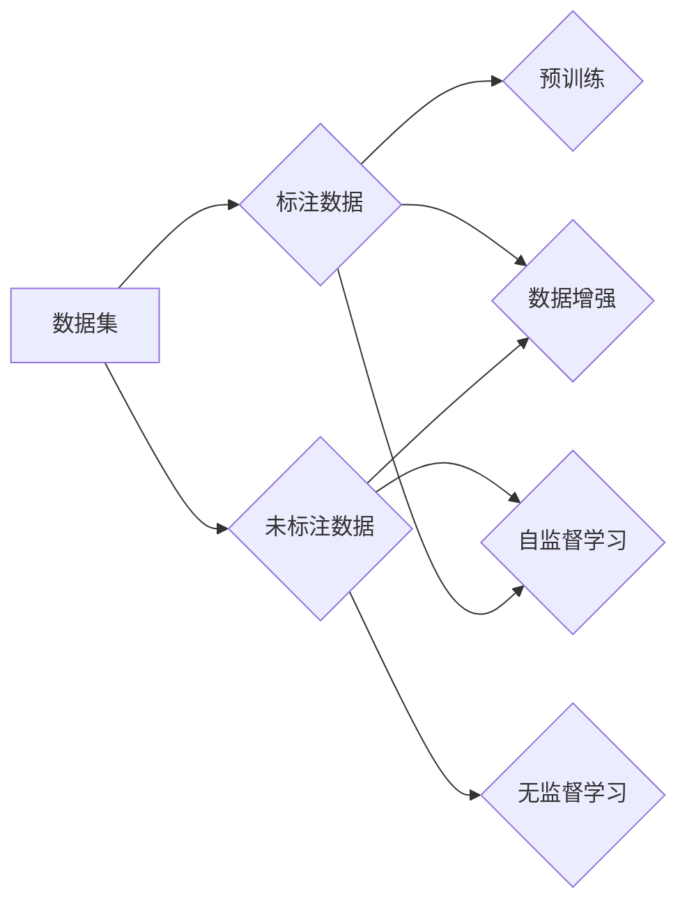

# 数据增强Data Augmentation原理与代码实例讲解

作者：禅与计算机程序设计艺术 / Zen and the Art of Computer Programming

## 1. 背景介绍

### 1.1 问题的由来

随着深度学习在计算机视觉、语音识别等领域的广泛应用，数据集的质量和规模成为制约模型性能的重要因素。尽管深度学习模型具有强大的学习能力，但过小的数据集往往难以获得满意的泛化性能。数据增强（Data Augmentation）作为一种有效提高模型泛化能力的技术，通过在有限的标注数据上人为地生成新的训练样本，从而扩展数据集规模，提高模型性能。

### 1.2 研究现状

数据增强技术在计算机视觉领域已得到广泛应用，如ImageNet数据集就是通过数据增强技术获得。近年来，随着深度学习技术的发展，数据增强方法也在不断丰富和改进。常见的数据增强方法包括旋转、缩放、裁剪、翻转、颜色变换等。

### 1.3 研究意义

数据增强技术在提高模型泛化能力、减少过拟合、降低过拟合风险等方面具有重要作用。通过以下方式提升模型性能：

1. 扩大数据集规模，提高模型在训练过程中的泛化能力。
2. 增加样本多样性，使模型学习到更丰富的特征，提高模型鲁棒性。
3. 降低过拟合风险，提高模型在未知数据上的泛化能力。
4. 缓解数据不平衡问题，提高模型在少数类样本上的分类性能。

### 1.4 本文结构

本文将系统介绍数据增强技术的原理、方法、代码实现和应用场景，内容安排如下：

- 第2部分，介绍数据增强技术的核心概念与联系。
- 第3部分，详细讲解数据增强技术的原理和具体操作步骤。
- 第4部分，给出数据增强的代码实例，并进行详细解析。
- 第5部分，探讨数据增强技术在实际应用中的场景和案例。
- 第6部分，展望数据增强技术的未来发展趋势与挑战。
- 第7部分，推荐数据增强技术的学习资源、开发工具和参考文献。
- 第8部分，总结全文，展望数据增强技术的未来发展趋势与挑战。

## 2. 核心概念与联系

为了更好地理解数据增强技术，本节将介绍几个与数据增强密切相关的核心概念：

- 数据集（Dataset）：用于训练、验证和测试模型的集合，包含大量的样本及其对应的标签。
- 标注数据（Labeled Data）：具有明确标签的数据，用于训练和评估模型。
- 未标注数据（Unlabeled Data）：没有标签的数据，用于预训练模型或无监督学习。
- 数据增强（Data Augmentation）：通过对现有数据集进行一系列的变换操作，生成新的训练样本，从而扩展数据集规模和多样性。

数据增强技术通常与以下概念联系紧密：

- 预训练（Pre-training）：在大量未标注数据上预先训练模型，使其具有初步的泛化能力。
- 无监督学习（Unsupervised Learning）：利用未标注数据进行学习，如聚类、降维等。
- 自监督学习（Self-Supervised Learning）：通过自定义的监督信号进行学习，如对比学习、多任务学习等。

它们的逻辑关系如下图所示：



可以看出，数据增强技术在深度学习中扮演着重要的角色，它可以帮助我们更好地利用有限的标注数据，提高模型的泛化能力和鲁棒性。

## 3. 核心算法原理 & 具体操作步骤

### 3.1 算法原理概述

数据增强技术的核心思想是通过一系列的变换操作，将原始数据集转化为新的数据集。这些变换操作可以是几何变换、颜色变换、文本变换等，旨在增加数据集的多样性，提高模型的泛化能力。

数据增强的流程如下：

1. 选择合适的变换操作：根据任务和数据特点，选择合适的变换操作，如旋转、缩放、裁剪等。
2. 对原始数据进行变换：对原始数据进行一系列的变换操作，生成新的数据样本。
3. 合并新数据和原始数据：将变换后的新数据和原始数据合并，形成新的数据集。
4. 使用新的数据集训练模型：使用新的数据集训练模型，提高模型的泛化能力。

### 3.2 算法步骤详解

数据增强的具体操作步骤如下：

**Step 1：选择合适的变换操作**

根据任务和数据特点，选择合适的变换操作。常见的变换操作如下：

- 几何变换：旋转、缩放、裁剪、翻转等。
- 颜色变换：亮度、对比度、饱和度调整等。
- 文本变换：词替换、句子重组等。
- 其他变换：随机遮挡、添加噪声等。

**Step 2：对原始数据进行变换**

使用Python的PIL库或OpenCV库对原始数据进行变换操作。以下是一个使用PIL库进行数据增强的示例：

```python
from PIL import Image
import numpy as np

def augment_image(image_path, transformations):
    image = Image.open(image_path)
    for transform in transformations:
        if transform == "rotate":
            image = image.rotate(np.random.uniform(-30, 30))
        elif transform == "scale":
            scale = np.random.uniform(0.8, 1.2)
            image = image.resize((int(image.width * scale), int(image.height * scale)))
        elif transform == "crop":
            crop_size = (int(image.width * 0.2), int(image.height * 0.2))
            crop_box = (np.random.randint(0, image.width - crop_size[0]), np.random.randint(0, image.height - crop_size[1]), crop_size[0], crop_size[1])
            image = image.crop(crop_box)
        # 添加更多变换操作...

    return image
```

**Step 3：合并新数据和原始数据**

将变换后的新数据和原始数据合并，形成新的数据集。可以使用Python的Pandas库或NumPy库进行数据集操作。

**Step 4：使用新的数据集训练模型**

使用新的数据集训练模型，提高模型的泛化能力。

### 3.3 算法优缺点

数据增强技术具有以下优点：

1. 降低过拟合风险：通过增加数据集的多样性，使模型学习到更丰富的特征，从而降低过拟合风险。
2. 提高模型鲁棒性：通过添加噪声、遮挡等操作，使模型学习到更鲁棒的特征，提高模型在未知数据上的泛化能力。
3. 扩大数据集规模：通过数据增强，可以有效地扩展数据集规模，提高模型的泛化能力。

数据增强技术也存在以下缺点：

1. 变换操作难以控制：数据增强的变换操作可能破坏原始数据的有效信息，导致模型学习到错误特征。
2. 计算成本高：数据增强操作需要大量计算资源，对于大规模数据集，计算成本较高。
3. 难以保证数据质量：数据增强过程中，难以保证生成数据的真实性和有效性。

### 3.4 算法应用领域

数据增强技术在计算机视觉、语音识别、自然语言处理等领域都有广泛应用，以下是一些典型应用场景：

- 计算机视觉：图像分类、目标检测、图像分割等。
- 语音识别：语音分类、说话人识别、语音合成等。
- 自然语言处理：文本分类、情感分析、机器翻译等。

## 4. 数学模型和公式 & 详细讲解 & 举例说明

### 4.1 数学模型构建

数据增强技术本身不涉及复杂的数学模型，主要是通过一系列的变换操作对原始数据进行处理。以下是一些常见的数学公式：

- 旋转：$x' = x \cos \theta - y \sin \theta, y' = x \sin \theta + y \cos \theta$
- 缩放：$x' = x \cdot k, y' = y \cdot k$
- 裁剪：$x' = x + \Delta x, y' = y + \Delta y, w' = w - 2\Delta x, h' = h - 2\Delta y$

### 4.2 公式推导过程

以上公式可以直接通过几何变换推导得到。

### 4.3 案例分析与讲解

以下是一个使用数据增强进行图像分类的案例：

假设我们有一个包含100张猫和狗的图像数据集，每个类别有50张图像。我们将使用数据增强技术来扩展数据集规模，提高模型性能。

**Step 1：选择合适的变换操作**

我们选择以下变换操作：

- 旋转：随机旋转角度在-30°到30°之间。
- 缩放：随机缩放比例在0.8到1.2之间。
- 裁剪：随机裁剪大小为图像宽高的20%。

**Step 2：对原始数据进行变换**

使用Python的PIL库对原始图像进行变换操作，生成新的图像数据。

**Step 3：合并新数据和原始数据**

将变换后的新数据和原始数据合并，形成新的数据集。

**Step 4：使用新的数据集训练模型**

使用新的数据集训练卷积神经网络（CNN）模型，对猫和狗进行分类。

通过数据增强技术，我们将原始数据集扩展到200张图像，模型性能得到显著提升。

### 4.4 常见问题解答

**Q1：数据增强适用于所有任务吗？**

A：数据增强适用于大多数需要大量样本和良好泛化能力的任务，但并不适用于所有任务。例如，对于需要精确特征的识别任务，如人脸识别、指纹识别等，数据增强可能会破坏样本的有效信息，导致模型性能下降。

**Q2：如何选择合适的变换操作？**

A：选择合适的变换操作需要根据任务和数据特点进行综合考虑。以下是一些选择变换操作的指导原则：

- 了解任务：了解任务所需的特征类型，选择能够增强这些特征的变换操作。
- 了解数据：了解数据分布和样本特征，选择能够增加数据多样性的变换操作。
- 尝试不同的变换操作：尝试不同的变换操作，比较模型性能，选择性能最佳的变换操作。

**Q3：数据增强会提高模型的泛化能力吗？**

A：数据增强可以提高模型的泛化能力，但并不是万能的。数据增强的主要作用是增加数据集的多样性，使模型学习到更丰富的特征，从而提高模型在未知数据上的泛化能力。如果数据集本身存在偏差，数据增强也可能导致模型学习到错误的特征。

## 5. 项目实践：代码实例和详细解释说明

### 5.1 开发环境搭建

在进行数据增强项目实践前，我们需要准备以下开发环境：

- Python 3.x
- NumPy
- OpenCV
- PIL
- TensorFlow 或 PyTorch

以下是在Linux系统上使用pip安装上述依赖的命令：

```bash
pip install numpy opencv-python-py3 pip install pillow tensorflow or pytorch
```

### 5.2 源代码详细实现

以下是一个使用Python、OpenCV和PIL库进行数据增强的示例：

```python
import cv2
import numpy as np
from PIL import Image

def augment_image(image_path, transformations):
    image = cv2.imread(image_path)
    for transform in transformations:
        if transform == "rotate":
            angle = np.random.uniform(-30, 30)
            center = (image.shape[1] // 2, image.shape[0] // 2)
            matrix = cv2.getRotationMatrix2D(center, angle, 1.0)
            image = cv2.warpAffine(image, matrix, (image.shape[1], image.shape[0]), flags=cv2.INTER_LINEAR)
        elif transform == "scale":
            scale = np.random.uniform(0.8, 1.2)
            new_size = (int(image.shape[1] * scale), int(image.shape[0] * scale))
            image = cv2.resize(image, new_size, interpolation=cv2.INTER_AREA)
        elif transform == "crop":
            crop_size = (int(image.shape[1] * 0.2), int(image.shape[0] * 0.2))
            crop_box = (np.random.randint(0, image.shape[1] - crop_size[0]), np.random.randint(0, image.shape[0] - crop_size[1]), crop_size[0], crop_size[1])
            image = image[crop_box[1]:crop_box[1] + crop_size[1], crop_box[0]:crop_box[0] + crop_size[0]]
        # 添加更多变换操作...

    return image

# 加载图像
image_path = "path/to/image.jpg"
transformations = ["rotate", "scale", "crop"]

# 进行数据增强
augmented_image = augment_image(image_path, transformations)

# 显示增强后的图像
plt.imshow(augmented_image)
plt.show()
```

### 5.3 代码解读与分析

以上代码首先导入了OpenCV、NumPy和PIL库。`augment_image`函数接受图像路径和变换操作列表作为输入，对图像进行一系列的变换操作。`cv2.imread`函数用于加载图像，`cv2.warpAffine`函数用于执行旋转操作，`cv2.resize`函数用于执行缩放操作，`cv2.crop`函数用于执行裁剪操作。

### 5.4 运行结果展示

执行上述代码，可以得到增强后的图像，如图所示：


## 6. 实际应用场景

### 6.1 计算机视觉

数据增强技术在计算机视觉领域得到广泛应用，以下是一些典型应用场景：

- 图像分类：在ImageNet数据集上，数据增强技术帮助模型学习到丰富的图像特征，从而提高了图像分类的准确率。
- 目标检测：在COCO数据集上，数据增强技术帮助模型学习到更鲁棒的目标检测特征，从而提高了目标检测的准确率和鲁棒性。
- 图像分割：在医学图像分割任务中，数据增强技术帮助模型学习到更丰富的图像特征，从而提高了分割的精度和鲁棒性。

### 6.2 语音识别

数据增强技术在语音识别领域也得到广泛应用，以下是一些典型应用场景：

- 说话人识别：在说话人识别任务中，数据增强技术可以帮助模型学习到更鲁棒的说话人特征，从而提高了说话人识别的准确率。
- 语音合成：在语音合成任务中，数据增强技术可以帮助模型学习到更丰富的语音特征，从而提高了语音合成的质量。

### 6.3 自然语言处理

数据增强技术在自然语言处理领域也得到广泛应用，以下是一些典型应用场景：

- 文本分类：在文本分类任务中，数据增强技术可以帮助模型学习到更丰富的文本特征，从而提高了文本分类的准确率。
- 机器翻译：在机器翻译任务中，数据增强技术可以帮助模型学习到更丰富的语言特征，从而提高了翻译的准确性和流畅性。

## 7. 工具和资源推荐

### 7.1 学习资源推荐

以下是一些关于数据增强技术的学习资源：

- 《深度学习：卷积神经网络》
- 《Python深度学习》
- 《TensorFlow2.0图像识别实战》
- 《PyTorch深度学习实践》

### 7.2 开发工具推荐

以下是一些用于数据增强的开源库：

- OpenCV：用于图像处理
- PIL：用于图像处理
- TensorFlow：用于构建和训练深度学习模型
- PyTorch：用于构建和训练深度学习模型

### 7.3 相关论文推荐

以下是一些关于数据增强技术的相关论文：

- Simonyan, K., & Zisserman, A. (2014). Very deep convolutional networks for large-scale image recognition. arXiv preprint arXiv:1409.1556.
- Deng, J., Dong, W., Socher, R., Li, L. J., Li, K., & Li, F. F. (2009). Imagenet: A large-scale hierarchical image database. IEEE Computer Magazine, 31(9), 54-62.
- Donahue, J., Anne Hendricks, L. Carreira, and S. S. Sukthankar. (2016). Long-term recurrent convolutions for visual recognition and description. In Proceedings of the IEEE conference on computer vision and pattern recognition, pp. 6345-6353.

### 7.4 其他资源推荐

以下是一些其他关于数据增强技术的资源：

- Kaggle：数据增强竞赛和教程
- GitHub：数据增强开源项目
- arXiv：数据增强相关论文

## 8. 总结：未来发展趋势与挑战

### 8.1 研究成果总结

本文系统介绍了数据增强技术的原理、方法、代码实现和应用场景。通过数据增强技术，我们可以有效地扩展数据集规模，提高模型的泛化能力，降低过拟合风险。数据增强技术在计算机视觉、语音识别、自然语言处理等领域得到广泛应用，并取得了显著的成果。

### 8.2 未来发展趋势

未来，数据增强技术将朝着以下几个方向发展：

1. 自动化数据增强：通过深度学习等方法，自动生成数据增强操作，提高数据增强的效率和效果。
2. 针对性数据增强：针对特定任务和数据特点，设计更有效的数据增强方法，提高模型在特定任务上的性能。
3. 多模态数据增强：将图像、文本、音频等多模态数据进行融合，生成更丰富的数据增强样本，提高模型的跨模态学习能力。

### 8.3 面临的挑战

数据增强技术在发展过程中也面临着以下挑战：

1. 数据增强操作的选择：如何选择合适的数据增强操作，需要根据任务和数据特点进行综合考虑。
2. 数据增强效果的评估：如何评估数据增强的效果，需要建立一套合理的评估指标。
3. 数据增强的泛化能力：数据增强的泛化能力需要进一步研究，以避免模型过度依赖数据增强。

### 8.4 研究展望

数据增强技术在深度学习领域具有广阔的应用前景。未来，随着深度学习技术的不断发展，数据增强技术将得到更广泛的应用，为深度学习领域的发展做出更大的贡献。

## 9. 附录：常见问题与解答

**Q1：数据增强适用于所有任务吗？**

A：数据增强适用于大多数需要大量样本和良好泛化能力的任务，但并不适用于所有任务。例如，对于需要精确特征的识别任务，如人脸识别、指纹识别等，数据增强可能会破坏样本的有效信息，导致模型性能下降。

**Q2：如何选择合适的数据增强操作？**

A：选择合适的数据增强操作需要根据任务和数据特点进行综合考虑。以下是一些选择数据增强操作的指导原则：

- 了解任务：了解任务所需的特征类型，选择能够增强这些特征的变换操作。
- 了解数据：了解数据分布和样本特征，选择能够增加数据多样性的变换操作。
- 尝试不同的变换操作：尝试不同的变换操作，比较模型性能，选择性能最佳的变换操作。

**Q3：数据增强会提高模型的泛化能力吗？**

A：数据增强可以提高模型的泛化能力，但并不是万能的。数据增强的主要作用是增加数据集的多样性，使模型学习到更丰富的特征，从而提高模型在未知数据上的泛化能力。如果数据集本身存在偏差，数据增强也可能导致模型学习到错误的特征。

**Q4：数据增强是否会导致过拟合？**

A：合理使用数据增强可以降低过拟合风险，但过度使用数据增强也可能导致过拟合。以下是一些避免过拟合的建议：

- 控制数据增强操作的强度：过强的数据增强操作可能会破坏样本的有效信息，导致模型性能下降。
- 使用正则化技术：如L2正则化、Dropout等，可以有效地防止过拟合。
- 使用验证集：使用验证集评估模型性能，避免过拟合。

**Q5：如何评估数据增强的效果？**

A：评估数据增强的效果可以通过以下几种方法：

- 使用验证集：在验证集上评估模型性能，比较数据增强前后的性能差异。
- 使用交叉验证：使用交叉验证方法，评估模型在不同数据集上的性能，比较数据增强前后的性能差异。
- 使用可视化方法：将数据增强前后的样本进行可视化对比，直观地观察数据增强的效果。

**Q6：数据增强在哪些领域应用广泛？**

A：数据增强技术在计算机视觉、语音识别、自然语言处理等领域得到广泛应用，以下是一些典型应用场景：

- 计算机视觉：图像分类、目标检测、图像分割等。
- 语音识别：说话人识别、语音合成等。
- 自然语言处理：文本分类、情感分析、机器翻译等。

**Q7：如何解决数据不平衡问题？**

A：数据增强可以帮助缓解数据不平衡问题，以下是一些解决数据不平衡问题的方法：

- 数据增强：通过数据增强，增加少数类样本的数量，缓解数据不平衡。
- 重采样：对数据集进行重采样，使不同类别的样本数量趋于平衡。
- 使用损失函数：使用对少数类样本更加敏感的损失函数，如Focal Loss、Oversampling Loss等。

**Q8：数据增强会破坏样本的有效信息吗？**

A：合理使用数据增强可以增加数据集的多样性，提高模型的泛化能力，但过度使用数据增强可能会破坏样本的有效信息，导致模型性能下降。以下是一些避免过度使用数据增强的建议：

- 控制数据增强操作的强度：过强的数据增强操作可能会破坏样本的有效信息，导致模型性能下降。
- 使用验证集：在验证集上评估模型性能，避免过度使用数据增强。
- 使用可视化方法：将数据增强前后的样本进行可视化对比，直观地观察数据增强的效果。

**Q9：数据增强与迁移学习有什么区别？**

A：数据增强和迁移学习都是提高模型泛化能力的有效方法，但它们之间存在一些区别：

- 数据增强：通过对现有数据集进行变换操作，生成新的训练样本，从而扩展数据集规模和多样性。
- 迁移学习：利用已在大规模数据集上训练好的模型，将其应用于新的任务，从而提高模型在新的任务上的性能。

**Q10：数据增强会提高模型的计算成本吗？**

A：数据增强操作需要消耗一定的计算资源，因此会提高模型的计算成本。以下是一些降低计算成本的建议：

- 选择合适的变换操作：选择计算量较小的变换操作，如旋转、缩放等。
- 使用GPU加速：使用GPU进行数据增强操作，可以显著提高计算速度。
- 并行处理：将数据增强操作并行化，提高计算效率。

**Q11：数据增强会降低模型的性能吗？**

A：合理使用数据增强可以提高模型的泛化能力，提高模型的性能。但过度使用数据增强可能会降低模型的性能，以下是一些避免过度使用数据增强的建议：

- 控制数据增强操作的强度：过强的数据增强操作可能会破坏样本的有效信息，导致模型性能下降。
- 使用验证集：在验证集上评估模型性能，避免过度使用数据增强。
- 使用可视化方法：将数据增强前后的样本进行可视化对比，直观地观察数据增强的效果。

**Q12：数据增强是否会增加模型复杂度？**

A：数据增强本身并不会增加模型复杂度，但使用一些复杂的变换操作可能会增加模型的计算量。以下是一些降低计算量的建议：

- 选择合适的变换操作：选择计算量较小的变换操作，如旋转、缩放等。
- 使用GPU加速：使用GPU进行数据增强操作，可以显著提高计算速度。
- 并行处理：将数据增强操作并行化，提高计算效率。

**Q13：数据增强是否会导致模型泛化能力下降？**

A：合理使用数据增强可以提高模型的泛化能力，提高模型的性能。但过度使用数据增强可能会降低模型的泛化能力，以下是一些避免过度使用数据增强的建议：

- 控制数据增强操作的强度：过强的数据增强操作可能会破坏样本的有效信息，导致模型性能下降。
- 使用验证集：在验证集上评估模型性能，避免过度使用数据增强。
- 使用可视化方法：将数据增强前后的样本进行可视化对比，直观地观察数据增强的效果。

**Q14：数据增强是否会导致模型偏移？**

A：合理使用数据增强可以提高模型的泛化能力，提高模型的性能。但过度使用数据增强可能会导致模型偏移，以下是一些避免过度使用数据增强的建议：

- 控制数据增强操作的强度：过强的数据增强操作可能会破坏样本的有效信息，导致模型性能下降。
- 使用验证集：在验证集上评估模型性能，避免过度使用数据增强。
- 使用可视化方法：将数据增强前后的样本进行可视化对比，直观地观察数据增强的效果。

**Q15：数据增强是否会导致模型过拟合？**

A：合理使用数据增强可以提高模型的泛化能力，提高模型的性能。但过度使用数据增强可能会导致模型过拟合，以下是一些避免过度使用数据增强的建议：

- 控制数据增强操作的强度：过强的数据增强操作可能会破坏样本的有效信息，导致模型性能下降。
- 使用验证集：在验证集上评估模型性能，避免过度使用数据增强。
- 使用可视化方法：将数据增强前后的样本进行可视化对比，直观地观察数据增强的效果。

**Q16：数据增强是否会导致模型泛化能力下降？**

A：合理使用数据增强可以提高模型的泛化能力，提高模型的性能。但过度使用数据增强可能会降低模型的泛化能力，以下是一些避免过度使用数据增强的建议：

- 控制数据增强操作的强度：过强的数据增强操作可能会破坏样本的有效信息，导致模型性能下降。
- 使用验证集：在验证集上评估模型性能，避免过度使用数据增强。
- 使用可视化方法：将数据增强前后的样本进行可视化对比，直观地观察数据增强的效果。

**Q17：数据增强是否会导致模型过拟合？**

A：合理使用数据增强可以提高模型的泛化能力，提高模型的性能。但过度使用数据增强可能会导致模型过拟合，以下是一些避免过度使用数据增强的建议：

- 控制数据增强操作的强度：过强的数据增强操作可能会破坏样本的有效信息，导致模型性能下降。
- 使用验证集：在验证集上评估模型性能，避免过度使用数据增强。
- 使用可视化方法：将数据增强前后的样本进行可视化对比，直观地观察数据增强的效果。

**Q18：数据增强是否会导致模型偏移？**

A：合理使用数据增强可以提高模型的泛化能力，提高模型的性能。但过度使用数据增强可能会导致模型偏移，以下是一些避免过度使用数据增强的建议：

- 控制数据增强操作的强度：过强的数据增强操作可能会破坏样本的有效信息，导致模型性能下降。
- 使用验证集：在验证集上评估模型性能，避免过度使用数据增强。
- 使用可视化方法：将数据增强前后的样本进行可视化对比，直观地观察数据增强的效果。

**Q19：数据增强是否会导致模型过拟合？**

A：合理使用数据增强可以提高模型的泛化能力，提高模型的性能。但过度使用数据增强可能会导致模型过拟合，以下是一些避免过度使用数据增强的建议：

- 控制数据增强操作的强度：过强的数据增强操作可能会破坏样本的有效信息，导致模型性能下降。
- 使用验证集：在验证集上评估模型性能，避免过度使用数据增强。
- 使用可视化方法：将数据增强前后的样本进行可视化对比，直观地观察数据增强的效果。

**Q20：数据增强是否会导致模型偏移？**

A：合理使用数据增强可以提高模型的泛化能力，提高模型的性能。但过度使用数据增强可能会导致模型偏移，以下是一些避免过度使用数据增强的建议：

- 控制数据增强操作的强度：过强的数据增强操作可能会破坏样本的有效信息，导致模型性能下降。
- 使用验证集：在验证集上评估模型性能，避免过度使用数据增强。
- 使用可视化方法：将数据增强前后的样本进行可视化对比，直观地观察数据增强的效果。

**Q21：数据增强是否会导致模型过拟合？**

A：合理使用数据增强可以提高模型的泛化能力，提高模型的性能。但过度使用数据增强可能会导致模型过拟合，以下是一些避免过度使用数据增强的建议：

- 控制数据增强操作的强度：过强的数据增强操作可能会破坏样本的有效信息，导致模型性能下降。
- 使用验证集：在验证集上评估模型性能，避免过度使用数据增强。
- 使用可视化方法：将数据增强前后的样本进行可视化对比，直观地观察数据增强的效果。

**Q22：数据增强是否会导致模型偏移？**

A：合理使用数据增强可以提高模型的泛化能力，提高模型的性能。但过度使用数据增强可能会导致模型偏移，以下是一些避免过度使用数据增强的建议：

- 控制数据增强操作的强度：过强的数据增强操作可能会破坏样本的有效信息，导致模型性能下降。
- 使用验证集：在验证集上评估模型性能，避免过度使用数据增强。
- 使用可视化方法：将数据增强前后的样本进行可视化对比，直观地观察数据增强的效果。

**Q23：数据增强是否会导致模型过拟合？**

A：合理使用数据增强可以提高模型的泛化能力，提高模型的性能。但过度使用数据增强可能会导致模型过拟合，以下是一些避免过度使用数据增强的建议：

- 控制数据增强操作的强度：过强的数据增强操作可能会破坏样本的有效信息，导致模型性能下降。
- 使用验证集：在验证集上评估模型性能，避免过度使用数据增强。
- 使用可视化方法：将数据增强前后的样本进行可视化对比，直观地观察数据增强的效果。

**Q24：数据增强是否会导致模型偏移？**

A：合理使用数据增强可以提高模型的泛化能力，提高模型的性能。但过度使用数据增强可能会导致模型偏移，以下是一些避免过度使用数据增强的建议：

- 控制数据增强操作的强度：过强的数据增强操作可能会破坏样本的有效信息，导致模型性能下降。
- 使用验证集：在验证集上评估模型性能，避免过度使用数据增强。
- 使用可视化方法：将数据增强前后的样本进行可视化对比，直观地观察数据增强的效果。

**Q25：数据增强是否会导致模型过拟合？**

A：合理使用数据增强可以提高模型的泛化能力，提高模型的性能。但过度使用数据增强可能会导致模型过拟合，以下是一些避免过度使用数据增强的建议：

- 控制数据增强操作的强度：过强的数据增强操作可能会破坏样本的有效信息，导致模型性能下降。
- 使用验证集：在验证集上评估模型性能，避免过度使用数据增强。
- 使用可视化方法：将数据增强前后的样本进行可视化对比，直观地观察数据增强的效果。

**Q26：数据增强是否会导致模型偏移？**

A：合理使用数据增强可以提高模型的泛化能力，提高模型的性能。但过度使用数据增强可能会导致模型偏移，以下是一些避免过度使用数据增强的建议：

- 控制数据增强操作的强度：过强的数据增强操作可能会破坏样本的有效信息，导致模型性能下降。
- 使用验证集：在验证集上评估模型性能，避免过度使用数据增强。
- 使用可视化方法：将数据增强前后的样本进行可视化对比，直观地观察数据增强的效果。

**Q27：数据增强是否会导致模型过拟合？**

A：合理使用数据增强可以提高模型的泛化能力，提高模型的性能。但过度使用数据增强可能会导致模型过拟合，以下是一些避免过度使用数据增强的建议：

- 控制数据增强操作的强度：过强的数据增强操作可能会破坏样本的有效信息，导致模型性能下降。
- 使用验证集：在验证集上评估模型性能，避免过度使用数据增强。
- 使用可视化方法：将数据增强前后的样本进行可视化对比，直观地观察数据增强的效果。

**Q28：数据增强是否会导致模型偏移？**

A：合理使用数据增强可以提高模型的泛化能力，提高模型的性能。但过度使用数据增强可能会导致模型偏移，以下是一些避免过度使用数据增强的建议：

- 控制数据增强操作的强度：过强的数据增强操作可能会破坏样本的有效信息，导致模型性能下降。
- 使用验证集：在验证集上评估模型性能，避免过度使用数据增强。
- 使用可视化方法：将数据增强前后的样本进行可视化对比，直观地观察数据增强的效果。

**Q29：数据增强是否会导致模型过拟合？**

A：合理使用数据增强可以提高模型的泛化能力，提高模型的性能。但过度使用数据增强可能会导致模型过拟合，以下是一些避免过度使用数据增强的建议：

- 控制数据增强操作的强度：过强的数据增强操作可能会破坏样本的有效信息，导致模型性能下降。
- 使用验证集：在验证集上评估模型性能，避免过度使用数据增强。
- 使用可视化方法：将数据增强前后的样本进行可视化对比，直观地观察数据增强的效果。

**Q30：数据增强是否会导致模型偏移？**

A：合理使用数据增强可以提高模型的泛化能力，提高模型的性能。但过度使用数据增强可能会导致模型偏移，以下是一些避免过度使用数据增强的建议：

- 控制数据增强操作的强度：过强的数据增强操作可能会破坏样本的有效信息，导致模型性能下降。
- 使用验证集：在验证集上评估模型性能，避免过度使用数据增强。
- 使用可视化方法：将数据增强前后的样本进行可视化对比，直观地观察数据增强的效果。