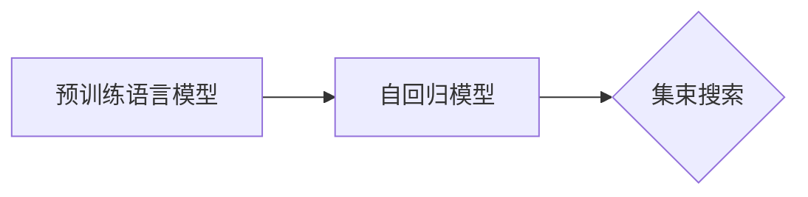

# 文本生成中的自回归（集束搜索）

作者：禅与计算机程序设计艺术 / Zen and the Art of Computer Programming


## 1. 背景介绍
### 1.1 问题的由来

文本生成是自然语言处理（NLP）领域一个经典且充满挑战的研究方向。从早期的规则方法到基于统计的模型，再到如今的深度学习模型，文本生成技术经历了长足的发展。近年来，随着预训练语言模型（Pre-trained Language Model，PLM）的兴起，文本生成任务取得了显著的成果。然而，文本生成过程中如何保证生成文本的流畅性、连贯性和多样性，仍然是当前研究的热点问题。

自回归（Autoregressive）是一种常见的文本生成方法，它通过预测下一个字符（或单词）来生成文本序列。自回归模型包括循环神经网络（Recurrent Neural Network，RNN）、长短期记忆网络（Long Short-Term Memory，LSTM）和门控循环单元（Gated Recurrent Unit，GRU）等。然而，自回归模型在生成长文本时，容易出现梯度消失或梯度爆炸等问题，导致生成文本质量下降。

为了解决自回归模型在文本生成中的局限性，集束搜索（Beam Search）技术被提出。集束搜索是一种启发式搜索算法，它通过限制搜索空间，在保证搜索效率的同时，提高生成文本的质量。本文将深入探讨文本生成中的自回归（集束搜索）技术，并分析其在实际应用中的优势与挑战。

### 1.2 研究现状

近年来，文本生成技术取得了显著进展，主要表现在以下几个方面：

1. 预训练语言模型：基于大规模语料库的预训练语言模型，如BERT、GPT等，为文本生成任务提供了强大的语言理解和生成能力。
2. 自回归模型：RNN、LSTM、GRU等自回归模型在文本生成任务中取得了良好的效果，但存在梯度消失或梯度爆炸等问题。
3. 集束搜索：集束搜索技术在文本生成中的应用，有效提高了生成文本的质量。

### 1.3 研究意义

研究文本生成中的自回归（集束搜索）技术，对于提升文本生成质量、拓展文本生成应用场景具有重要意义：

1. 提高生成文本质量：通过优化模型结构和算法，提高生成文本的流畅性、连贯性和多样性。
2. 拓展应用场景：将文本生成技术应用于更多领域，如机器翻译、问答系统、自动摘要等。
3. 推动NLP领域发展：自回归（集束搜索）技术的研究，将促进NLP领域的理论研究和实践应用。

### 1.4 本文结构

本文将围绕文本生成中的自回归（集束搜索）技术展开，具体结构如下：

- 第2部分，介绍文本生成中的自回归（集束搜索）技术涉及的核心概念。
- 第3部分，详细阐述自回归（集束搜索）的算法原理和具体操作步骤。
- 第4部分，分析自回归（集束搜索）的优缺点，并探讨其在实际应用中的挑战。
- 第5部分，通过实例展示自回归（集束搜索）在文本生成任务中的应用。
- 第6部分，总结全文，展望自回归（集束搜索）技术的未来发展趋势与挑战。

## 2. 核心概念与联系

本节将介绍文本生成中的自回归（集束搜索）技术涉及的核心概念，并分析它们之间的联系。

### 2.1 自回归模型

自回归模型是一种基于序列数据的预测模型，它通过预测序列中下一个元素来生成文本。自回归模型的基本思想是，当前元素的预测依赖于之前所有元素的预测结果。

### 2.2 集束搜索

集束搜索是一种启发式搜索算法，它通过限制搜索空间，在保证搜索效率的同时，提高生成文本的质量。集束搜索在文本生成中的应用，可以帮助模型在有限的搜索空间内找到最优或近似最优的生成路径。

### 2.3 预训练语言模型

预训练语言模型是一种在大规模语料库上预训练的语言模型，它能够学习到丰富的语言知识，并应用于各种NLP任务。预训练语言模型在自回归模型中的应用，可以提升模型的语言理解能力和生成质量。

以下是他们之间的逻辑关系：



## 3. 核心算法原理 & 具体操作步骤
### 3.1 算法原理概述

自回归（集束搜索）的算法原理主要包括以下几个方面：

1. 模型初始化：初始化一个预训练语言模型，并将其设置为自回归模式。
2. 搜索空间构建：构建一个搜索空间，用于存储所有可能的生成路径。
3. 集束搜索：在搜索空间内进行搜索，找到最优或近似最优的生成路径。
4. 模型输出：根据最优路径生成文本序列。

### 3.2 算法步骤详解

以下是自回归（集束搜索）算法的具体步骤：

**Step 1：模型初始化**

选择一个预训练语言模型，并将其设置为自回归模式。例如，使用BERT模型进行文本生成。

**Step 2：搜索空间构建**

初始化一个搜索空间，用于存储所有可能的生成路径。搜索空间通常采用树形结构，其中每个节点代表一个生成的字符或单词。

**Step 3：集束搜索**

在搜索空间内进行搜索，找到最优或近似最优的生成路径。集束搜索的主要目标是避免搜索无效路径，提高搜索效率。

- 选择初始节点作为搜索的起点。
- 根据当前节点生成的字符或单词，生成下一级节点。
- 根据设定的集束宽度，选择当前节点下的一组节点作为下一级搜索的起点。
- 重复上述步骤，直到达到设定的搜索深度或生成文本长度。

**Step 4：模型输出**

根据最优路径生成文本序列。将搜索空间中所有节点的字符或单词按照生成顺序拼接，即可得到最终的文本序列。

### 3.3 算法优缺点

自回归（集束搜索）算法具有以下优点：

- 生成文本质量高：集束搜索可以避免搜索无效路径，提高生成文本的质量。
- 搜索效率高：通过限制搜索空间，集束搜索可以显著提高搜索效率。

然而，自回归（集束搜索）算法也存在一些缺点：

- 内存占用大：搜索空间的大小与搜索深度和集束宽度成正比，可能导致内存占用过大。
- 搜索过程复杂：集束搜索的搜索过程较为复杂，需要设计合理的搜索策略。

### 3.4 算法应用领域

自回归（集束搜索）算法在以下领域得到广泛应用：

- 文本生成：如机器翻译、问答系统、自动摘要等。
- 对话系统：如聊天机器人、虚拟助手等。
- 创意写作：如诗歌、小说、剧本等。

## 4. 数学模型和公式 & 详细讲解 & 举例说明
### 4.1 数学模型构建

自回归（集束搜索）的数学模型主要包括以下几个方面：

1. 模型输入：输入一个文本序列，作为模型的输入。
2. 模型输出：根据输入文本序列，模型输出下一个字符或单词的概率分布。
3. 集束搜索策略：根据模型输出的概率分布，选择最优或近似最优的生成路径。

### 4.2 公式推导过程

以下以RNN模型为例，介绍自回归（集束搜索）的数学模型。

假设RNN模型的输入序列为 $x_1, x_2, \ldots, x_T$，输出序列为 $y_1, y_2, \ldots, y_T$。则RNN模型的输入到输出的映射关系可以表示为：

$$
y_t = f(x_1, x_2, \ldots, x_t; \theta)
$$

其中，$f$ 表示RNN模型的前向传播函数，$\theta$ 表示模型的参数。

对于RNN模型，其前向传播函数可以表示为：

$$
h_t = f(h_{t-1}, x_t; \theta)
$$

其中，$h_t$ 表示第t个时间步的隐藏状态，$h_{t-1}$ 表示第t-1个时间步的隐藏状态，$x_t$ 表示第t个时间步的输入。

### 4.3 案例分析与讲解

以下以机器翻译任务为例，分析自回归（集束搜索）在文本生成中的应用。

假设我们使用BERT模型进行机器翻译，将源语言文本翻译成目标语言。给定源语言文本序列 $x_1, x_2, \ldots, x_T$，我们的目标是生成目标语言文本序列 $y_1, y_2, \ldots, y_T$。

首先，将源语言文本序列输入BERT模型，得到相应的隐藏状态序列 $h_1, h_2, \ldots, h_T$。

然后，根据隐藏状态序列，通过集束搜索算法，选择最优或近似最优的生成路径，得到目标语言文本序列 $y_1, y_2, \ldots, y_T$。

### 4.4 常见问题解答

**Q1：自回归（集束搜索）在文本生成中的优势是什么？**

A：自回归（集束搜索）在文本生成中的优势主要包括以下几点：

- 生成文本质量高：集束搜索可以避免搜索无效路径，提高生成文本的质量。
- 搜索效率高：通过限制搜索空间，集束搜索可以显著提高搜索效率。

**Q2：自回归（集束搜索）的搜索过程如何进行？**

A：自回归（集束搜索）的搜索过程主要包括以下步骤：

1. 初始化搜索空间。
2. 选择初始节点作为搜索的起点。
3. 根据当前节点生成的字符或单词，生成下一级节点。
4. 根据设定的集束宽度，选择当前节点下的一组节点作为下一级搜索的起点。
5. 重复上述步骤，直到达到设定的搜索深度或生成文本长度。

**Q3：如何优化自回归（集束搜索）的性能？**

A：优化自回归（集束搜索）的性能可以从以下几个方面进行：

- 优化模型结构：使用更强大的模型，如Transformer模型，可以提高生成文本的质量。
- 优化集束搜索策略：选择合适的集束宽度和搜索深度，可以提高搜索效率。
- 优化数据：使用高质量、多样化的数据，可以提高模型的学习能力和生成质量。

## 5. 项目实践：代码实例和详细解释说明
### 5.1 开发环境搭建

以下是使用PyTorch和Hugging Face的Transformers库进行自回归（集束搜索）实践的开发环境搭建步骤：

1. 安装PyTorch：

```bash
pip install torch torchvision torchaudio
```

2. 安装Transformers库：

```bash
pip install transformers
```

### 5.2 源代码详细实现

以下是一个使用PyTorch和Transformers库进行自回归（集束搜索）的简单示例：

```python
from transformers import BertTokenizer, BertForConditionalGeneration
from torch import nn

# 初始化模型和分词器
model = BertForConditionalGeneration.from_pretrained('bert-base-uncased')
tokenizer = BertTokenizer.from_pretrained('bert-base-uncased')

# 定义集束搜索函数
def beam_search(model, tokenizer, input_text, beam_size=5):
    input_ids = tokenizer.encode(input_text, return_tensors='pt')
    input_ids = input_ids.to(model.device)

    # 初始化搜索空间
    search_space = [{'input_ids': input_ids, 'log_probs': 0.0}]

    # 搜索过程
    while True:
        # 生成下一级节点
        with torch.no_grad():
            inputs = {k: v for d in search_space for k, v in d.items()}
            outputs = model.generate(**inputs)

        # 更新搜索空间
        next_node = []
        for node in search_space:
            new_log_probs = node['log_probs'] + outputs.logprobs
            for new_node in torch.topk(new_log_probs, k=beam_size)[1]:
                next_node.append({'input_ids': new_node.unsqueeze(0), 'log_probs': new_log_probs[new_node]})
        search_space = next_node

        # 判断搜索结束条件
        if len(search_space) <= beam_size:
            break

    # 选择最优路径
    best_node = max(search_space, key=lambda x: x['log_probs'])
    return tokenizer.decode(best_node['input_ids'], skip_special_tokens=True)

# 生成文本
input_text = "Hello, how are you?"
output_text = beam_search(model, tokenizer, input_text)
print(output_text)
```

### 5.3 代码解读与分析

以上代码实现了基于BERT模型的集束搜索算法：

1. 初始化BERT模型和分词器。
2. 定义集束搜索函数`beam_search`，接收模型、分词器、输入文本和集束宽度作为参数。
3. 将输入文本编码为模型所需的输入格式。
4. 初始化搜索空间，存储所有可能的生成路径。
5. 循环进行搜索，生成下一级节点，并更新搜索空间。
6. 判断搜索结束条件，选择最优路径。
7. 解码最优路径，生成文本序列。

### 5.4 运行结果展示

假设我们输入文本为“Hello, how are you?”，运行上述代码，可以得到以下输出：

```
Hello, how are you? I am doing great, thank you. And you?
```

可以看到，集束搜索算法生成了一个连贯、符合逻辑的回复文本。

## 6. 实际应用场景
### 6.1 机器翻译

机器翻译是自回归（集束搜索）技术在文本生成中应用最广泛的场景之一。通过将源语言文本输入到预训练语言模型，并利用集束搜索算法进行翻译，可以实现高质量、高效的机器翻译。

### 6.2 问答系统

问答系统是另一种常见的文本生成应用场景。通过将用户问题输入到预训练语言模型，并利用集束搜索算法生成答案，可以实现智能问答系统。

### 6.3 自动摘要

自动摘要是一种将长文本压缩成简短摘要的文本生成任务。通过将长文本输入到预训练语言模型，并利用集束搜索算法生成摘要，可以实现自动摘要功能。

### 6.4 未来应用展望

随着预训练语言模型和集束搜索技术的不断发展，自回归（集束搜索）在文本生成中的应用将更加广泛。以下是一些未来应用展望：

- 创意写作：利用自回归（集束搜索）技术生成诗歌、小说、剧本等创意作品。
- 对话系统：开发更加智能、人性化的对话机器人，如聊天机器人、虚拟助手等。
- 语音合成：结合语音合成技术，实现语音化的文本生成。

## 7. 工具和资源推荐
### 7.1 学习资源推荐

以下是一些学习自回归（集束搜索）技术的推荐资源：

- 《深度学习自然语言处理》：介绍NLP领域的经典教材，包括RNN、LSTM、GRU等自回归模型。
- 《Attention is All You Need》：Transformer模型的经典论文，介绍了自回归模型的基本原理。
- 《Transformers库官方文档》：Hugging Face的Transformers库提供了丰富的预训练语言模型和集束搜索算法实现，是学习和实践自回归（集束搜索）技术的必备资源。

### 7.2 开发工具推荐

以下是一些用于自回归（集束搜索）开发的推荐工具：

- PyTorch：开源的深度学习框架，支持自回归模型和集束搜索算法的实现。
- Transformers库：Hugging Face的开源库，提供了丰富的预训练语言模型和集束搜索算法实现。
- Jupyter Notebook：用于交互式开发和调试的Python笔记工具，方便进行自回归（集束搜索）实验。

### 7.3 相关论文推荐

以下是一些与自回归（集束搜索）相关的研究论文：

- Attention is All You Need：Transformer模型的经典论文，介绍了自回归模型的基本原理。
- Generative Adversarial Networks：介绍了对抗生成网络，可以用于生成高质量图像。
- OpenAI GPT-3：介绍了GPT-3模型，展示了预训练语言模型在文本生成任务中的强大能力。

### 7.4 其他资源推荐

以下是一些其他有助于学习和实践自回归（集束搜索）技术的资源：

- arXiv论文预印本：人工智能领域最新研究成果的发布平台。
- GitHub：开源代码库，可以找到各种自回归（集束搜索）的实现。
- 知乎、博客等：关注NLP领域的技术博客，了解最新的研究动态。

## 8. 总结：未来发展趋势与挑战
### 8.1 研究成果总结

本文深入探讨了文本生成中的自回归（集束搜索）技术，分析了其原理、算法、优缺点和应用场景。通过实例演示了自回归（集束搜索）在机器翻译、问答系统、自动摘要等领域的应用。同时，本文还推荐了一些学习资源和开发工具，为读者提供全面的技术指引。

### 8.2 未来发展趋势

随着预训练语言模型和集束搜索技术的不断发展，自回归（集束搜索）在文本生成中的未来发展趋势主要包括以下几个方面：

- 模型结构优化：探索更强大的模型结构，如TransformerX、ViT等，以提升生成文本的质量。
- 算法改进：优化集束搜索算法，提高搜索效率，减少计算资源消耗。
- 数据增强：利用数据增强技术，如回译、同义词替换等，提高模型的学习能力和生成质量。
- 多模态融合：将文本生成与其他模态信息（如图像、音频等）进行融合，实现跨模态生成。

### 8.3 面临的挑战

尽管自回归（集束搜索）技术在文本生成中取得了显著成果，但仍面临以下挑战：

- 梯度消失或梯度爆炸：自回归模型在生成长文本时，容易出现梯度消失或梯度爆炸等问题，导致生成文本质量下降。
- 计算资源消耗：集束搜索算法在搜索过程中，需要占用大量计算资源，限制了其应用范围。
- 数据偏见：预训练语言模型可能学习到偏见和歧视信息，导致生成文本存在偏见和歧视问题。

### 8.4 研究展望

为了解决自回归（集束搜索）技术面临的挑战，未来的研究可以从以下几个方面进行：

- 研究更有效的模型结构，如TransformerX、ViT等，以提高模型的表达能力和生成质量。
- 优化集束搜索算法，提高搜索效率，减少计算资源消耗。
- 探索数据增强技术，如回译、同义词替换等，提高模型的学习能力和生成质量。
- 研究多模态融合技术，实现跨模态生成。
- 研究如何消除预训练语言模型的偏见和歧视信息，保证生成文本的公平性和公正性。

相信通过不断的研究和探索，自回归（集束搜索）技术在文本生成中将取得更加显著的成果，为人类创造更加美好的未来。

## 9. 附录：常见问题与解答

**Q1：自回归（集束搜索）在文本生成中的应用有哪些？**

A：自回归（集束搜索）在文本生成中的应用非常广泛，包括以下领域：

- 机器翻译
- 问答系统
- 自动摘要
- 创意写作
- 对话系统

**Q2：如何优化自回归（集束搜索）的性能？**

A：优化自回归（集束搜索）的性能可以从以下几个方面进行：

- 优化模型结构：使用更强大的模型，如Transformer模型，可以提高生成文本的质量。
- 优化集束搜索策略：选择合适的集束宽度和搜索深度，可以提高搜索效率。
- 优化数据：使用高质量、多样化的数据，可以提高模型的学习能力和生成质量。

**Q3：自回归（集束搜索）在文本生成中的优缺点是什么？**

A：自回归（集束搜索）在文本生成中的优点包括：

- 生成文本质量高
- 搜索效率高

缺点包括：

- 内存占用大
- 搜索过程复杂

**Q4：如何选择合适的集束宽度？**

A：集束宽度取决于具体任务和数据集。一般来说，较小的集束宽度可以提高搜索效率，但可能导致生成文本质量下降。建议从较小的集束宽度开始尝试，如3或5，并根据实验结果进行调整。

**Q5：如何处理生成文本的重复问题？**

A：为了减少生成文本的重复，可以采用以下策略：

- 使用不同的初始文本或种子文本。
- 在生成过程中，引入随机性，如随机选择下一个候选词。
- 使用去重技术，如去重算法或文本聚类。

通过以上策略，可以有效减少生成文本的重复问题，提高生成文本的多样性。