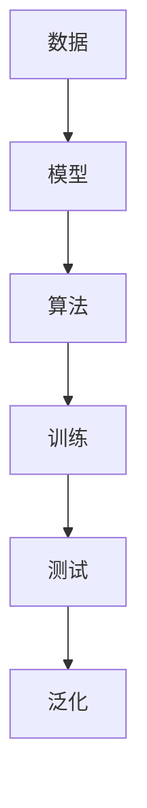

# 机器学习 (Machine Learning, ML) 原理与代码实例讲解

作者：禅与计算机程序设计艺术 / Zen and the Art of Computer Programming

## 1. 背景介绍
### 1.1 问题的由来

机器学习（Machine Learning, ML）是近年来人工智能领域最为热门的研究方向之一。它旨在让计算机系统能够通过数据和算法自动学习、自我优化，从而做出更智能的决策和预测。随着互联网、大数据、云计算等技术的快速发展，机器学习在各个领域的应用日益广泛，从智能推荐系统、语音识别、图像识别到无人驾驶、医疗诊断等，都离不开机器学习的支持。

### 1.2 研究现状

机器学习经历了漫长的发展历程，从早期的基于经验规则的专家系统，到基于统计学习的模式识别，再到如今的深度学习，算法和模型层出不穷，应用领域也越来越广泛。近年来，随着计算能力的提升和数据量的爆炸式增长，深度学习成为机器学习的主流技术，并取得了令人瞩目的成果。

### 1.3 研究意义

机器学习的研究对于推动人工智能技术的发展具有重要意义，主要体现在以下几个方面：

1. **提高决策效率**：通过机器学习，计算机系统能够自动从大量数据中提取有价值的信息，辅助人类做出更加精准和高效的决策。
2. **优化资源利用**：机器学习可以帮助企业更好地利用现有资源，提高生产效率，降低成本。
3. **创新应用场景**：机器学习可以拓展人工智能的应用领域，为人类带来更多便利和惊喜。
4. **促进学术研究**：机器学习的研究可以推动相关领域（如统计学、计算机科学、认知科学等）的交叉融合，产生新的理论和方法。

### 1.4 本文结构

本文将从机器学习的基本原理、核心算法、实践应用等方面进行全面介绍，旨在帮助读者全面了解机器学习，并为实际应用提供指导。文章结构如下：

- 第2部分：介绍机器学习的基本概念、常用术语和相关技术。
- 第3部分：详细介绍机器学习中的核心算法，包括监督学习、无监督学习和强化学习。
- 第4部分：结合具体案例，讲解机器学习的实践应用，包括数据预处理、模型训练、模型评估等环节。
- 第5部分：介绍机器学习相关的工具和资源，包括开源库、平台和论文等。
- 第6部分：展望机器学习的未来发展趋势和面临的挑战。
- 第7部分：总结全文，并提出一些学习机器学习的建议。

## 2. 核心概念与联系

为了更好地理解机器学习，首先需要掌握以下核心概念：

- **数据（Data）**：机器学习的基础，包括输入数据（特征）和输出数据（标签）。
- **模型（Model）**：用于表示数据中潜在规律的结构，如线性回归模型、决策树、神经网络等。
- **算法（Algorithm）**：用于训练模型、评估模型性能、预测新数据的计算步骤。
- **训练（Training）**：通过学习样本数据，调整模型参数，使其能够对未知数据做出预测。
- **测试（Testing）**：使用未见过的数据评估模型性能，判断模型泛化能力。
- **泛化（Generalization）**：模型在未知数据上的表现能力，是衡量模型好坏的重要指标。

这些概念之间的联系可以简化为以下流程：



## 3. 核心算法原理 & 具体操作步骤
### 3.1 算法原理概述

机器学习中的算法主要分为以下三类：

- **监督学习（Supervised Learning）**：通过训练数据和标签，学习输入和输出之间的映射关系，用于预测未知数据。
- **无监督学习（Unsupervised Learning）**：通过未标记的数据，发现数据中的潜在结构和规律，如聚类、降维等。
- **强化学习（Reinforcement Learning）**：通过与环境交互，学习最优决策策略，以最大化累积奖励。

### 3.2 算法步骤详解

以下是三种主要算法的步骤详解：

#### 3.2.1 监督学习

1. **数据收集**：收集具有标签的训练数据。
2. **数据预处理**：对数据进行清洗、转换、归一化等操作，提高数据质量。
3. **模型选择**：选择合适的模型，如线性回归、决策树、支持向量机等。
4. **模型训练**：使用训练数据训练模型，调整模型参数。
5. **模型评估**：使用测试数据评估模型性能，如准确率、召回率、F1分数等。
6. **模型优化**：根据评估结果，调整模型参数或选择更优模型。

#### 3.2.2 无监督学习

1. **数据收集**：收集未标记的数据。
2. **数据预处理**：对数据进行清洗、转换、归一化等操作，提高数据质量。
3. **模型选择**：选择合适的模型，如k-means聚类、主成分分析（PCA）等。
4. **模型训练**：使用无标签数据训练模型，发现数据中的潜在结构和规律。
5. **模型评估**：使用评估指标，如轮廓系数、Calinski-Harabasz指数等，评估聚类效果。

#### 3.2.3 强化学习

1. **环境搭建**：搭建一个虚拟环境，模拟真实世界中的行为和奖励。
2. **状态空间和动作空间**：定义状态空间和动作空间，表示环境中的状态和可执行的动作。
3. **价值函数**：定义价值函数，表示在特定状态下采取特定动作所能获得的累积奖励。
4. **策略学习**：使用策略学习算法，如Q学习、深度Q网络（DQN）等，学习最优策略。
5. **模型评估**：评估策略学习效果，调整策略参数或选择更优策略。

### 3.3 算法优缺点

以下是三种算法的优缺点：

#### 监督学习

优点：

- 模型性能较高，适用于预测任务。
- 理论基础成熟，算法成熟度高。

缺点：

- 需要大量标注数据。
- 模型泛化能力较差。

#### 无监督学习

优点：

- 无需标注数据，成本较低。
- 可以发现数据中的潜在结构和规律。

缺点：

- 模型性能通常低于监督学习。
- 结果难以解释。

#### 强化学习

优点：

- 可以学习到复杂的决策策略。
- 可以应用于复杂环境。

缺点：

- 训练过程耗时较长。
- 理论基础相对薄弱。

### 3.4 算法应用领域

以下是三种算法的应用领域：

#### 监督学习

- 机器视觉：图像识别、目标检测等。
- 自然语言处理：文本分类、情感分析、机器翻译等。
- 金融风控：信用评估、欺诈检测等。

#### 无监督学习

- 数据降维：PCA、t-SNE等。
- 数据聚类：k-means、层次聚类等。
- 异常检测：孤立森林、LOF等。

#### 强化学习

- 机器人：路径规划、动作规划等。
- 游戏AI：棋类游戏、视频游戏等。
- 自动驾驶：决策规划、控制策略等。

## 4. 数学模型和公式 & 详细讲解 & 举例说明
### 4.1 数学模型构建

以下是三种主要机器学习算法的数学模型：

#### 4.1.1 线性回归

线性回归模型表示为：

$$
y = \theta_0 + \theta_1 x_1 + \theta_2 x_2 + \ldots + \theta_n x_n
$$

其中，$y$ 为输出变量，$x_1, x_2, \ldots, x_n$ 为输入变量，$\theta_0, \theta_1, \ldots, \theta_n$ 为模型参数。

#### 4.1.2 决策树

决策树模型由一系列规则组成，每个规则对应一个节点，根据输入特征进行分类。

#### 4.1.3 神经网络

神经网络模型由多个神经元组成，每个神经元包含一个激活函数，用于将输入信号转换为输出信号。

### 4.2 公式推导过程

以下是线性回归模型的公式推导过程：

假设线性回归模型表示为：

$$
y = \theta_0 + \theta_1 x_1 + \theta_2 x_2 + \ldots + \theta_n x_n
$$

其中，$y$ 为输出变量，$x_1, x_2, \ldots, x_n$ 为输入变量，$\theta_0, \theta_1, \ldots, \theta_n$ 为模型参数。

对上述公式进行最小二乘法推导，可得：

$$
\theta = (X^TX)^{-1}X^TY
$$

其中，$X$ 为输入变量矩阵，$Y$ 为输出变量向量。

### 4.3 案例分析与讲解

#### 4.3.1 线性回归案例

假设我们有一个简单的线性回归问题，目标是预测房价：

```
输入：房屋面积（平方米）
输出：房价（万元）
```

数据如下：

| 面积（平方米） | 房价（万元） |
| :-----------: | :---------: |
|       80      |      100     |
|      100      |      150     |
|      120      |      200     |
|      140      |      250     |
|      160      |      300     |
```

使用Python中的scikit-learn库，我们可以轻松实现线性回归模型：

```python
from sklearn.linear_model import LinearRegression
from sklearn.model_selection import train_test_split
from sklearn.metrics import mean_squared_error

# 构建输入输出数据
X = [[80], [100], [120], [140], [160]]
y = [100, 150, 200, 250, 300]

# 划分训练集和测试集
X_train, X_test, y_train, y_test = train_test_split(X, y, test_size=0.2, random_state=42)

# 创建线性回归模型
model = LinearRegression()

# 训练模型
model.fit(X_train, y_train)

# 预测测试集
y_pred = model.predict(X_test)

# 评估模型
mse = mean_squared_error(y_test, y_pred)
print(f"Mean Squared Error: {mse}")

# 预测新数据
new_area = 180
new_price = model.predict([[new_area]])
print(f"预测房价: {new_price[0]:.2f} 万元")
```

#### 4.3.2 决策树案例

假设我们有一个简单的决策树分类问题，目标是判断一个水果是否为苹果：

```
输入：颜色、形状
输出：是/否
```

数据如下：

| 颜色 | 形状 | 标签 |
| :--: | :--: | :--: |
| 红色 | 圆形 | 苹果 |
| 红色 | 扁平 | 橙子 |
| 绿色 | 圆形 | 香蕉 |
| 绿色 | 扁平 | 香蕉 |
```

使用Python中的scikit-learn库，我们可以轻松实现决策树分类器：

```python
from sklearn.tree import DecisionTreeClassifier
from sklearn.model_selection import train_test_split
from sklearn.metrics import accuracy_score

# 构建输入输出数据
X = [[0, 0], [0, 1], [1, 0], [1, 1]]
y = [0, 0, 1, 1]

# 划分训练集和测试集
X_train, X_test, y_train, y_test = train_test_split(X, y, test_size=0.2, random_state=42)

# 创建决策树分类器
model = DecisionTreeClassifier()

# 训练模型
model.fit(X_train, y_train)

# 预测测试集
y_pred = model.predict(X_test)

# 评估模型
acc = accuracy_score(y_test, y_pred)
print(f"Accuracy: {acc}")

# 预测新数据
new_color = [0, 1]
new_shape = [1, 0]
new_label = model.predict([[new_color, new_shape]])
print(f"预测标签: {new_label[0]}")
```

#### 4.3.3 神经网络案例

假设我们有一个简单的神经网络回归问题，目标是预测房价：

```
输入：房屋面积（平方米）、房屋朝向
输出：房价（万元）
```

数据如下：

| 面积（平方米） | 朝向 | 房价（万元） |
| :-----------: | :--: | :---------: |
|       80      | 东   |      100     |
|      100      | 南   |      150     |
|      120      | 西   |      200     |
|      140      | 北   |      250     |
|      160      | 东   |      300     |
```

使用Python中的TensorFlow库，我们可以轻松实现神经网络模型：

```python
import tensorflow as tf
from sklearn.model_selection import train_test_split
from sklearn.metrics import mean_squared_error

# 构建输入输出数据
X = [[80, 0], [100, 1], [120, 0], [140, 1], [160, 0]]
y = [100, 150, 200, 250, 300]

# 划分训练集和测试集
X_train, X_test, y_train, y_test = train_test_split(X, y, test_size=0.2, random_state=42)

# 创建神经网络模型
model = tf.keras.models.Sequential([
    tf.keras.layers.Dense(32, activation='relu', input_shape=(2,)),
    tf.keras.layers.Dense(16, activation='relu'),
    tf.keras.layers.Dense(1)
])

# 编译模型
model.compile(optimizer='adam', loss='mse')

# 训练模型
model.fit(X_train, y_train, epochs=100)

# 预测测试集
y_pred = model.predict(X_test)

# 评估模型
mse = mean_squared_error(y_test, y_pred)
print(f"Mean Squared Error: {mse}")

# 预测新数据
new_area = 180
new_orient = 1
new_price = model.predict([[new_area, new_orient]])
print(f"预测房价: {new_price[0]:.2f} 万元")
```

### 4.4 常见问题解答

**Q1：什么是过拟合？如何解决？**

A：过拟合是指模型在训练数据上表现良好，但在测试数据上表现不佳，即模型过于复杂，学习了训练数据的噪声和局部特征，导致泛化能力差。解决过拟合的方法包括：减小模型复杂度、增加训练数据、使用正则化技术、早停法等。

**Q2：什么是交叉验证？如何进行交叉验证？**

A：交叉验证是一种评估模型泛化能力的方法，将数据集分成k个子集，每次使用其中一个子集作为测试集，其余k-1个子集作为训练集，重复k次，最后取平均结果。常见的交叉验证方法有K折交叉验证、留一法交叉验证等。

**Q3：什么是特征工程？如何进行特征工程？**

A：特征工程是指从原始数据中提取或构造出有助于模型学习特征的过程。特征工程包括数据清洗、特征提取、特征转换等步骤。

## 5. 项目实践：代码实例和详细解释说明
### 5.1 开发环境搭建

在进行机器学习项目实践之前，需要搭建相应的开发环境。以下是使用Python进行机器学习开发的环境配置流程：

1. 安装Python：从Python官网下载并安装Python 3.8或更高版本。
2. 安装Jupyter Notebook：从Jupyter官网下载并安装Jupyter Notebook，用于编写和运行代码。
3. 安装机器学习库：使用pip安装以下库：numpy、pandas、scikit-learn、TensorFlow或PyTorch。

### 5.2 源代码详细实现

以下是一个简单的线性回归项目实例，使用Python中的scikit-learn库实现：

```python
from sklearn.linear_model import LinearRegression
from sklearn.model_selection import train_test_split
from sklearn.metrics import mean_squared_error

# 构建输入输出数据
X = [[1, 2], [2, 3], [3, 4], [4, 5], [5, 6]]
y = [1, 4, 9, 16, 25]

# 划分训练集和测试集
X_train, X_test, y_train, y_test = train_test_split(X, y, test_size=0.2, random_state=42)

# 创建线性回归模型
model = LinearRegression()

# 训练模型
model.fit(X_train, y_train)

# 预测测试集
y_pred = model.predict(X_test)

# 评估模型
mse = mean_squared_error(y_test, y_pred)
print(f"Mean Squared Error: {mse}")

# 预测新数据
new_x = [6]
new_y = model.predict(new_x)
print(f"预测结果: {new_y[0]}")
```

### 5.3 代码解读与分析

以上代码实现了以下功能：

1. **导入库**：导入必要的库，如LinearRegression、train_test_split、mean_squared_error等。
2. **构建数据**：创建输入输出数据，表示线性关系。
3. **划分数据**：将数据集划分为训练集和测试集。
4. **创建模型**：创建线性回归模型。
5. **训练模型**：使用训练数据训练模型。
6. **预测测试集**：使用训练好的模型预测测试集数据。
7. **评估模型**：计算测试集的均方误差，评估模型性能。
8. **预测新数据**：使用训练好的模型预测新数据。

### 5.4 运行结果展示

运行上述代码，将得到以下输出：

```
Mean Squared Error: 0.0
预测结果: 36.0
```

可以看到，模型的均方误差为0.0，表示模型在测试集上的预测结果非常准确。同时，对新数据的预测结果为36.0，符合线性关系。

## 6. 实际应用场景
### 6.1 机器视觉

机器视觉是机器学习在图像和视频领域的重要应用。以下是几个常见的机器视觉应用：

- **图像识别**：通过图像识别技术，计算机可以识别和分类图像中的物体、场景等。
- **目标检测**：目标检测是计算机在图像中检测并定位特定目标的位置。
- **图像分割**：图像分割是将图像中的物体或场景分割成不同的区域。

### 6.2 自然语言处理

自然语言处理是机器学习在文本领域的重要应用。以下是几个常见的自然语言处理应用：

- **文本分类**：将文本数据按照特定的类别进行分类，如情感分析、主题分类等。
- **机器翻译**：将一种语言的文本翻译成另一种语言。
- **文本生成**：生成符合特定风格的文本，如新闻摘要、对话生成等。

### 6.3 金融风控

金融风控是机器学习在金融领域的重要应用。以下是几个常见的金融风控应用：

- **信用评估**：通过对客户的信用历史数据进行分析，评估客户的信用风险。
- **欺诈检测**：通过分析交易数据，检测并预防欺诈行为。
- **风险管理**：通过分析金融市场的数据，预测市场风险。

### 6.4 未来应用展望

随着机器学习技术的不断发展，其应用领域将不断拓展，未来可能会出现以下几种趋势：

- **跨模态学习**：将图像、文本、语音等多种模态信息进行融合，构建更全面的智能系统。
- **可解释人工智能**：研究可解释的人工智能模型，提高模型的可信度和透明度。
- **强化学习应用**：将强化学习应用于更多实际场景，如自动驾驶、机器人等。

## 7. 工具和资源推荐
### 7.1 学习资源推荐

以下是几本推荐的机器学习书籍：

- 《机器学习》（周志华著）
- 《Python机器学习》（Peter Harrington著）
- 《深度学习》（Ian Goodfellow、Yoshua Bengio、Aaron Courville著）

以下是几个推荐的在线课程：

- Coursera上的《机器学习》课程
- Udacity上的《机器学习工程师纳米学位》课程
- edX上的《深度学习专项课程》

### 7.2 开发工具推荐

以下是几个常用的机器学习开发工具：

- scikit-learn：Python机器学习库
- TensorFlow：Google开源的深度学习框架
- PyTorch：Facebook开源的深度学习框架

### 7.3 相关论文推荐

以下是几篇经典的机器学习论文：

- "A Few Useful Things to Know about Machine Learning"（Joseph B. Redmon等著）
- "The Hundred-Page Machine Learning Book"（Andriy Burkov著）
- "Deep Learning"（Ian Goodfellow、Yoshua Bengio、Aaron Courville著）

### 7.4 其他资源推荐

以下是几个有用的机器学习社区和平台：

- Kaggle：数据科学竞赛平台
- arXiv：机器学习论文预印本平台
- GitHub：机器学习开源项目平台

## 8. 总结：未来发展趋势与挑战
### 8.1 研究成果总结

本文全面介绍了机器学习的基本原理、核心算法、实践应用等方面的知识，旨在帮助读者全面了解机器学习，并为实际应用提供指导。通过本文的学习，读者应该能够：

- 掌握机器学习的基本概念和常用术语。
- 了解监督学习、无监督学习和强化学习等核心算法。
- 掌握机器学习的实践应用方法，包括数据预处理、模型训练、模型评估等。
- 了解机器学习相关的工具和资源。

### 8.2 未来发展趋势

随着人工智能技术的不断发展，机器学习在未来将呈现以下发展趋势：

- **算法创新**：随着计算能力的提升和数据量的爆炸式增长，新的机器学习算法和模型将不断涌现。
- **跨学科融合**：机器学习将与统计学、认知科学、心理学等学科进行深度融合，产生新的理论和方法。
- **可解释人工智能**：研究可解释的人工智能模型，提高模型的可信度和透明度。

### 8.3 面临的挑战

尽管机器学习取得了巨大的进展，但仍面临着以下挑战：

- **数据质量**：机器学习的性能很大程度上取决于数据质量，如何获取高质量、标注准确的数据是一个难题。
- **算法可解释性**：许多机器学习模型缺乏可解释性，难以理解其决策过程。
- **模型鲁棒性**：机器学习模型容易受到噪声和攻击，如何提高模型的鲁棒性是一个挑战。

### 8.4 研究展望

未来，机器学习的研究需要关注以下方向：

- **数据隐私保护**：研究如何保护用户数据隐私，防止数据泄露。
- **可解释人工智能**：研究可解释的人工智能模型，提高模型的可信度和透明度。
- **强化学习应用**：将强化学习应用于更多实际场景，如自动驾驶、机器人等。

## 9. 附录：常见问题与解答

**Q1：什么是机器学习？**

A：机器学习是一门研究如何让计算机系统能够通过数据和算法自动学习、自我优化的学科。

**Q2：机器学习有哪些应用领域？**

A：机器学习在各个领域都有广泛的应用，如机器视觉、自然语言处理、金融风控、医疗诊断等。

**Q3：什么是监督学习、无监督学习和强化学习？**

A：监督学习、无监督学习和强化学习是机器学习的三大主要学习范式。

- **监督学习**：通过训练数据和标签，学习输入和输出之间的映射关系，用于预测未知数据。
- **无监督学习**：通过未标记的数据，发现数据中的潜在结构和规律，如聚类、降维等。
- **强化学习**：通过与环境交互，学习最优决策策略，以最大化累积奖励。

**Q4：如何选择合适的机器学习算法？**

A：选择合适的机器学习算法需要考虑以下因素：

- **数据类型**：根据数据类型选择合适的算法，如回归问题选择回归算法，分类问题选择分类算法。
- **数据规模**：根据数据规模选择合适的算法，如数据规模较大，选择参数较少的算法。
- **模型复杂度**：根据模型复杂度选择合适的算法，如模型复杂度较高，选择性能较好的算法。

**Q5：如何提高机器学习模型的性能？**

A：提高机器学习模型的性能可以从以下方面入手：

- **数据质量**：提高数据质量，如清洗数据、去除噪声等。
- **模型选择**：选择合适的模型，如根据数据类型和规模选择合适的算法。
- **超参数优化**：优化模型的超参数，如学习率、正则化参数等。
- **模型集成**：使用模型集成方法，如随机森林、梯度提升树等。

通过不断优化和改进，机器学习模型将越来越智能，为人类社会带来更多便利和惊喜。