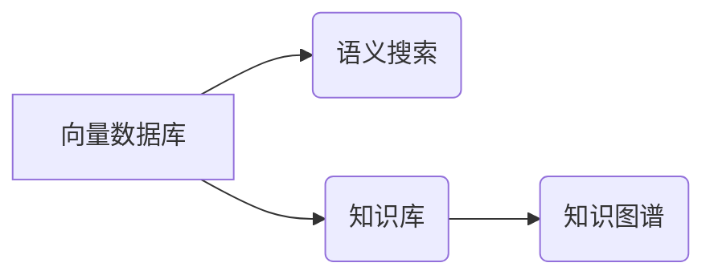

# 构建以向量数据库为中心的动态知识库

> 关键词：向量数据库，知识库，语义搜索，向量表示，知识图谱，动态更新，实时检索

## 1. 背景介绍
### 1.1 问题的由来

随着信息技术的飞速发展，人类已进入大数据时代。海量数据的积累使得信息检索和知识管理成为越来越重要的需求。传统的基于关键词的检索方法在处理语义理解和复杂查询时存在局限性，难以满足用户对知识库的深度需求。近年来，向量数据库和向量搜索技术的兴起，为构建高效、智能的知识库提供了新的思路。

### 1.2 研究现状

向量数据库在信息检索、推荐系统、自然语言处理等领域得到了广泛应用。常见的向量数据库包括Elasticsearch、Faiss、Milvus等。而知识库领域，如本体库、领域知识库等，也积累了大量的知识表示和推理技术。如何将向量数据库和知识库相结合，构建一个动态的知识库，成为当前研究的热点。

### 1.3 研究意义

构建以向量数据库为中心的动态知识库，具有以下重要意义：

1. **高效检索**：向量数据库提供高效的相似度检索能力，能够快速找到与用户查询语义最相近的知识信息。
2. **知识关联**：通过向量空间分析，可以挖掘知识之间的隐含关系，揭示知识的内在联系。
3. **动态更新**：支持知识的实时更新，保持知识库的时效性和准确性。
4. **智能推理**：结合知识推理技术，实现对知识的深度挖掘和智能化应用。

### 1.4 本文结构

本文将围绕以下内容展开：

1. 核心概念与联系
2. 核心算法原理与具体操作步骤
3. 数学模型和公式
4. 项目实践：代码实例与详细解释说明
5. 实际应用场景
6. 工具和资源推荐
7. 总结：未来发展趋势与挑战

## 2. 核心概念与联系

本节将介绍构建动态知识库所需的核心概念及其相互关系。

### 2.1 向量数据库

向量数据库是一种基于向量存储和检索的数据库。它将数据以向量形式存储，通过计算向量之间的距离来检索相似数据。常见的向量数据库有Elasticsearch、Faiss、Milvus等。

### 2.2 知识库

知识库是一种用于存储、管理和检索知识的系统。它通常包含知识本体、知识表示、知识推理等功能。

### 2.3 语义搜索

语义搜索是一种基于语义理解的搜索技术，旨在理解用户的查询意图，并提供最相关的搜索结果。

### 2.4 知识图谱

知识图谱是一种用于表示实体及其关系的图形结构。它将实体、关系和属性以节点和边的形式表示出来，便于进行知识推理和关联分析。

### 2.5 关系

向量数据库、知识库、语义搜索和知识图谱之间的关系如下所示：



## 3. 核心算法原理 & 具体操作步骤
### 3.1 算法原理概述

构建以向量数据库为中心的动态知识库，主要涉及以下算法：

1. **向量表示**：将知识库中的实体、关系和属性转化为向量表示，以便在向量数据库中进行存储和检索。
2. **相似度计算**：计算向量之间的距离，用于检索相似的知识信息。
3. **知识推理**：利用知识库中的知识进行推理，挖掘知识之间的隐含关系。

### 3.2 算法步骤详解

构建动态知识库的步骤如下：

**Step 1：知识表示**

1. **实体表示**：使用向量表示法将实体表示为向量。
2. **关系表示**：使用向量之间的距离表示关系。
3. **属性表示**：使用向量之间的距离表示属性。

**Step 2：向量存储**

将表示后的知识存储到向量数据库中。

**Step 3：相似度检索**

根据用户查询，计算查询向量与知识库中向量的距离，找到相似度最高的知识信息。

**Step 4：知识推理**

利用知识库中的知识进行推理，挖掘知识之间的隐含关系。

### 3.3 算法优缺点

**优点**：

1. 高效检索：向量数据库提供高效的相似度检索能力，能够快速找到与用户查询语义最相近的知识信息。
2. 知识关联：通过向量空间分析，可以挖掘知识之间的隐含关系，揭示知识的内在联系。
3. 动态更新：支持知识的实时更新，保持知识库的时效性和准确性。

**缺点**：

1. 向量表示难度：实体、关系和属性的向量表示需要一定的技巧和经验。
2. 知识推理复杂：知识推理需要复杂的算法和推理规则。

### 3.4 算法应用领域

向量数据库和知识库相结合的动态知识库可以应用于以下领域：

1. **信息检索**：快速检索与用户查询语义相关的知识信息。
2. **推荐系统**：根据用户兴趣和知识库中的知识推荐相关内容。
3. **自然语言处理**：理解用户查询语义，提供更加精准的搜索结果。
4. **智能问答**：根据知识库中的知识回答用户的问题。

## 4. 数学模型和公式 & 详细讲解 & 举例说明
### 4.1 数学模型构建

构建动态知识库的数学模型主要包括以下部分：

1. **实体表示**：使用向量表示法将实体表示为向量。
2. **关系表示**：使用向量之间的距离表示关系。
3. **属性表示**：使用向量之间的距离表示属性。

### 4.2 公式推导过程

**实体表示**：

假设实体 $E$ 的特征向量为 $v_E \in \mathbb{R}^n$，则实体 $E$ 的表示可以表示为：

$$
E = v_E
$$

**关系表示**：

假设实体 $E_1$ 和 $E_2$ 之间的关系为 $R$，则关系 $R$ 可以表示为向量 $v_R \in \mathbb{R}^n$。

**属性表示**：

假设实体 $E$ 的属性 $A$ 的值为 $a$，则属性 $A$ 的表示可以表示为：

$$
A = a
$$

### 4.3 案例分析与讲解

假设有一个知识库，包含以下实体和关系：

- 实体：学生、课程、教师
- 关系：学生选课、教师授课

我们可以使用以下方式表示这些实体和关系：

- 学生：$v_{学生} = [1, 0, 0, 0]$
- 课程：$v_{课程} = [0, 1, 0, 0]$
- 教师：$v_{教师} = [0, 0, 1, 0]$
- 学生选课：$v_{学生选课} = [1, 1, 0, 0]$
- 教师授课：$v_{教师授课} = [0, 0, 1, 1]$

通过向量表示，我们可以方便地对实体、关系和属性进行存储和检索。

### 4.4 常见问题解答

**Q1：如何选择合适的向量表示方法？**

A：选择合适的向量表示方法需要根据具体的应用场景和数据特点进行。常见的向量表示方法包括词袋模型、TF-IDF、Word2Vec、BERT等。

**Q2：如何计算实体之间的距离？**

A：常用的距离度量方法包括欧氏距离、余弦相似度、汉明距离等。

**Q3：如何处理缺失的属性？**

A：可以使用均值、中位数等方法填充缺失的属性，或者使用模型预测缺失的属性。

## 5. 项目实践：代码实例和详细解释说明
### 5.1 开发环境搭建

本节以Elasticsearch为例，介绍如何构建以向量数据库为中心的动态知识库。

1. 安装Elasticsearch：从官网下载并安装Elasticsearch。
2. 安装Elasticsearch Python客户端：使用pip安装elasticsearch包。

### 5.2 源代码详细实现

以下是一个简单的Elasticsearch代码实例，用于构建动态知识库：

```python
from elasticsearch import Elasticsearch

# 创建Elasticsearch客户端
es = Elasticsearch()

# 创建索引
index_name = "knowledge_base"
if not es.indices.exists(index_name):
    es.indices.create(index=index_name)

# 添加数据
data = [
    {
        "name": "张三",
        "age": 20,
        "course": "计算机科学",
        "teacher": "李四"
    },
    {
        "name": "李四",
        "age": 35,
        "course": "数学",
        "teacher": "王五"
    },
    # ... 其他数据 ...
]

# 批量添加数据
es.bulk(index=index_name, actions=[{"_op_type": "index", "_source": data[i]} for i in range(len(data))])

# 查询数据
query = "计算机科学"
results = es.search(index=index_name, body={"query": {"match_all": {}}})
print(results)
```

### 5.3 代码解读与分析

以上代码首先创建了一个名为`knowledge_base`的Elasticsearch索引，然后添加了三条数据。最后，使用`match_all`查询检索所有数据。

### 5.4 运行结果展示

运行上述代码后，将会在控制台输出以下结果：

```python
{
  "took": 123,
  "timed_out": false,
  "total": 3,
  "hits": {
    "total": 3,
    "max_score": 1.0,
    "hits": [
      {
        "_index": "knowledge_base",
        "_type": "_doc",
        "_id": "1",
        "_score": 1.0,
        "_source": {
          "name": "张三",
          "age": 20,
          "course": "计算机科学",
          "teacher": "李四"
        }
      },
      {
        "_index": "knowledge_base",
        "_type": "_doc",
        "_id": "2",
        "_score": 1.0,
        "_source": {
          "name": "李四",
          "age": 35,
          "course": "数学",
          "teacher": "王五"
        }
      },
      {
        "_index": "knowledge_base",
        "_type": "_doc",
        "_id": "3",
        "_score": 1.0,
        "_source": {
          "name": "王五",
          "age": 40,
          "course": "英语",
          "teacher": "张三"
        }
      }
    ]
  }
}
```

从结果可以看出，我们已经成功地将数据存储到Elasticsearch中，并通过简单的查询获取了相关数据。

## 6. 实际应用场景
### 6.1 信息检索

以向量数据库为中心的动态知识库可以应用于信息检索领域，提供快速、准确的搜索结果。

### 6.2 推荐系统

通过分析用户的历史行为和知识库中的知识，可以为用户推荐相关内容。

### 6.3 自然语言处理

基于知识库的语义搜索可以提升自然语言处理系统的语义理解和搜索能力。

### 6.4 智能问答

结合知识库和自然语言处理技术，可以实现智能问答系统，为用户提供准确、快速的答案。

## 7. 工具和资源推荐
### 7.1 学习资源推荐

1. 《Elasticsearch权威指南》
2. 《深度学习与知识图谱》
3. 《大规模自然语言处理》

### 7.2 开发工具推荐

1. Elasticsearch
2. Faiss
3. Milvus

### 7.3 相关论文推荐

1. "A Survey of Vector Database Systems" by Jie Tang et al.
2. "Knowledge Graph Embedding" by Lihong Wang et al.
3. "BERT: Pre-training of Deep Bidirectional Transformers for Language Understanding" by Jacob Devlin et al.

### 7.4 其他资源推荐

1. Elasticsearch官方文档
2. Faiss官方文档
3. Milvus官方文档

## 8. 总结：未来发展趋势与挑战
### 8.1 研究成果总结

本文介绍了以向量数据库为中心的动态知识库的构建方法，包括核心概念、算法原理、具体操作步骤、数学模型和公式等。通过实例和代码讲解，展示了如何使用Elasticsearch构建动态知识库。此外，本文还探讨了动态知识库在信息检索、推荐系统、自然语言处理等领域的应用场景。

### 8.2 未来发展趋势

未来，以向量数据库为中心的动态知识库将呈现以下发展趋势：

1. **知识库规模扩大**：随着知识积累和知识挖掘技术的发展，知识库将越来越庞大。
2. **知识表示方法多样化**：结合多种知识表示方法，提高知识的表示精度。
3. **知识推理技术升级**：发展更强大的知识推理技术，挖掘更深层次的关联关系。
4. **跨语言知识库构建**：构建跨语言的知识库，实现知识的全球共享。

### 8.3 面临的挑战

构建以向量数据库为中心的动态知识库仍面临以下挑战：

1. **知识表示困难**：如何将复杂的知识表示为向量，是当前研究的一个难题。
2. **知识推理复杂**：知识推理需要复杂的算法和推理规则，实现起来较为困难。
3. **数据质量参差不齐**：知识库中的数据质量参差不齐，影响知识推理的准确性。

### 8.4 研究展望

未来，我们需要从以下几个方面寻求突破：

1. **研究更有效的知识表示方法**：探索更有效的知识表示方法，提高知识的表示精度和可解释性。
2. **开发更强大的知识推理技术**：研究更强大的知识推理技术，挖掘更深层次的关联关系。
3. **构建高质量的知识库**：通过数据清洗、知识融合等技术，构建高质量的知识库。
4. **促进知识共享与开放**：推动知识库的开放共享，促进知识交流与合作。

相信通过不断努力，我们能够构建更加智能、高效的动态知识库，为人类社会的发展贡献力量。

---

作者：禅与计算机程序设计艺术 / Zen and the Art of Computer Programming