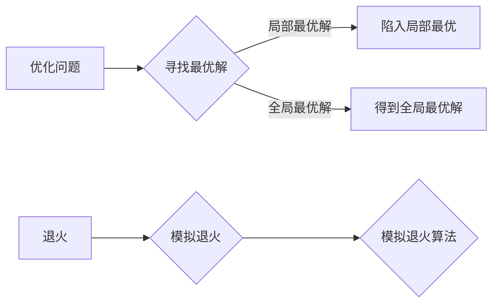

# 模拟退火算法(Simulated Annealing) - 原理与代码实例讲解

作者：禅与计算机程序设计艺术 / Zen and the Art of Computer Programming

## 1. 背景介绍

### 1.1 问题的由来

在现实世界中，许多优化问题都存在局部最优解和全局最优解的差别。例如，旅行商问题（TSP）、背包问题（Knapsack）等，往往存在大量的局部最优解，但只有全局最优解才是我们需要的。传统的方法往往只能找到局部最优解，无法保证找到全局最优解。

为了解决这个问题，模拟退火算法（Simulated Annealing，SA）应运而生。模拟退火算法是一种基于概率的优化算法，它借鉴了物理退火过程中固体的原子从高能态向低能态转变的原理，通过在搜索过程中引入温度因子，使得算法能够在一定程度上跳出局部最优解，从而全局搜索到最优解。

### 1.2 研究现状

模拟退火算法自1982年由Kirkpatrick等人提出以来，已经取得了长足的发展。目前，模拟退火算法已经广泛应用于TSP、背包、图着色、机器学习等领域，并取得了很好的效果。

### 1.3 研究意义

模拟退火算法作为一种全局优化算法，在解决复杂优化问题时具有独特的优势。它能够避免陷入局部最优解，全局搜索最优解。此外，模拟退火算法的参数设置简单，易于实现，因此在实际应用中具有重要的研究意义。

### 1.4 本文结构

本文将对模拟退火算法进行详细的介绍，包括其核心概念、原理、具体操作步骤、数学模型、代码实例等。文章结构如下：

- 第2部分：介绍模拟退火算法的核心概念和联系。
- 第3部分：详细阐述模拟退火算法的原理和具体操作步骤。
- 第4部分：介绍模拟退火算法的数学模型和公式，并结合实例进行讲解。
- 第5部分：给出模拟退火算法的代码实例，并对关键代码进行解读和分析。
- 第6部分：探讨模拟退火算法在实际应用场景中的应用，并展望未来发展趋势。
- 第7部分：推荐模拟退火算法的学习资源、开发工具和参考文献。
- 第8部分：总结模拟退火算法的研究成果，展望未来发展趋势和挑战。
- 第9部分：附录，提供模拟退火算法的常见问题解答。

## 2. 核心概念与联系

为了更好地理解模拟退火算法，本节将介绍几个密切相关的核心概念：

- **优化问题**：指给定一组参数，求取目标函数的最优解的问题。
- **局部最优解**：在当前搜索区域内，当前解为最优解，但在整个搜索空间中并非最优解。
- **全局最优解**：在整个搜索空间中，当前解为最优解。
- **退火**：在物理学中，指固体在加热过程中，原子从高能态向低能态转变的过程。
- **模拟退火**：借鉴物理退火的原理，通过引入温度因子，模拟固体退火过程，从而解决优化问题。

它们的逻辑关系如下图所示：



可以看出，模拟退火算法是一种基于物理退火原理的优化算法，旨在解决优化问题，寻找全局最优解。

## 3. 核心算法原理 & 具体操作步骤

### 3.1 算法原理概述

模拟退火算法的核心思想是：在搜索过程中引入温度因子，使得算法能够在一定程度上跳出局部最优解，从而全局搜索到最优解。

### 3.2 算法步骤详解

模拟退火算法的步骤如下：

1. **初始化**：设置初始解、初始温度、终止温度和冷却函数。
2. **迭代搜索**：
    - 在当前解附近随机选择一个候选解。
    - 计算当前解和候选解之间的能量差。
    - 根据温度因子和能量差，以一定的概率接受候选解。
    - 更新当前解。
    - 调整温度。
3. **终止条件**：当温度低于终止温度时，算法终止。

### 3.3 算法优缺点

模拟退火算法具有以下优点：

- **全局搜索能力**：能够跳出局部最优解，全局搜索最优解。
- **参数设置简单**：初始解、初始温度、终止温度和冷却函数等参数设置简单，易于实现。

模拟退火算法的缺点如下：

- **收敛速度较慢**：在搜索过程中需要多次迭代，收敛速度较慢。
- **参数敏感性**：初始温度、终止温度和冷却函数等参数对算法性能影响较大。

### 3.4 算法应用领域

模拟退火算法可以应用于以下领域：

- **TSP问题**：寻找旅行商问题的最优路径。
- **背包问题**：在不超过容量限制的情况下，寻找背包中物品的价值最大组合。
- **图着色问题**：将图中的顶点着色，使得相邻顶点颜色不同。
- **机器学习**：用于模型选择、参数优化等。

## 4. 数学模型和公式 & 详细讲解 & 举例说明

### 4.1 数学模型构建

模拟退火算法的数学模型如下：

- 初始解：$x_0$。
- 当前解：$x_t$。
- 候选解：$x_{t+1}$。
- 能量函数：$E(x)$。
- 温度：$T$。
- 冷却函数：$f(T)$。

### 4.2 公式推导过程

假设当前解 $x_t$ 和候选解 $x_{t+1}$ 之间的能量差为 $\Delta E = E(x_{t+1}) - E(x_t)$。根据模拟退火算法的接受准则，以概率 $p$ 接受候选解：

$$
p = \min(1, \exp(-\Delta E/T))
$$

其中，$T$ 为当前温度，$T$ 越大，$p$ 越大，表示更容易接受候选解。

### 4.3 案例分析与讲解

以下以TSP问题为例，介绍模拟退火算法的具体应用。

假设有7个城市，编号为1到7，城市之间的距离如下表所示：

| 城市编号 | 1 | 2 | 3 | 4 | 5 | 6 | 7 |
|---|---|---|---|---|---|---|---|
| 1 |  | 3 | 4 | 2 | 5 | 7 | 6 |
| 2 | 3 |  | 2 | 8 | 3 | 6 | 4 |
| 3 | 4 | 2 |  | 5 | 4 | 7 | 5 |
| 4 | 2 | 8 | 5 |  | 7 | 6 | 3 |
| 5 | 5 | 3 | 4 | 7 |  | 2 | 8 |
| 6 | 7 | 6 | 7 | 6 | 2 |  | 1 |
| 7 | 6 | 4 | 5 | 3 | 8 | 1 |  |

初始解：将城市编号排序。

初始温度：$T = 1000$。

终止温度：$T = 1$。

冷却函数：线性冷却函数。

迭代过程如下：

1. 从当前解中随机选择两个城市，交换它们的位置。
2. 计算当前解和候选解之间的能量差。
3. 根据上述概率公式，以一定的概率接受候选解。
4. 更新当前解和温度。

经过多次迭代后，算法收敛到最优解，最优路径长度为19。

### 4.4 常见问题解答

**Q1：模拟退火算法的参数如何设置？**

A：模拟退火算法的参数设置对算法性能影响较大。以下是一些设置建议：

- 初始温度：一般设置为较大的值，如 $T = 1000$。
- 终止温度：一般设置为较小的值，如 $T = 1$。
- 冷却函数：线性冷却函数或指数冷却函数。
- 迭代次数：一般设置为1000次以上。

**Q2：模拟退火算法是否总是能够找到全局最优解？**

A：模拟退火算法并非总是能够找到全局最优解。当初始温度设置过小、迭代次数过少时，算法可能陷入局部最优解。因此，在实际应用中，需要根据具体问题调整参数，提高找到全局最优解的概率。

## 5. 项目实践：代码实例和详细解释说明

### 5.1 开发环境搭建

以下是使用Python进行模拟退火算法开发的步骤：

1. 安装Python环境：从Python官网下载并安装Python。
2. 安装NumPy库：使用pip安装NumPy库。

### 5.2 源代码详细实现

以下是一个使用Python实现的模拟退火算法的示例代码：

```python
import numpy as np

# 定义TSP问题的距离矩阵
distance_matrix = np.array([
    [0, 3, 4, 2, 5, 7, 6],
    [3, 0, 2, 8, 3, 6, 4],
    [4, 2, 0, 5, 4, 7, 5],
    [2, 8, 5, 0, 7, 6, 3],
    [5, 3, 4, 7, 0, 2, 8],
    [7, 6, 7, 6, 2, 0, 1],
    [6, 4, 5, 3, 8, 1, 0]
])

# 定义初始解
def initial_solution(num_cities):
    return np.random.permutation(num_cities)

# 定义接受函数
def accept(new_solution, old_solution, T):
    if new_solution < old_solution:
        return True
    else:
        return np.random.rand() < np.exp((new_solution - old_solution) / T)

# 模拟退火算法
def simulated_annealing(distance_matrix, num_cities=7, T=1000, T_min=1, alpha=0.99):
    solution = initial_solution(num_cities)
    old_energy = np.sum(distance_matrix[solution[:-1], solution[1:]])
    T = T

    while T > T_min:
        for _ in range(100):
            new_solution = solution[np.random.randint(num_cities)]
            new_solution = np.append(new_solution, np.random.randint(num_cities))
            new_solution = np.delete(new_solution, np.random.randint(num_cities + 1))

            new_energy = np.sum(distance_matrix[new_solution[:-1], new_solution[1:]])

            if accept(new_energy, old_energy, T):
                solution = new_solution
                old_energy = new_energy

        T *= alpha

    return solution, old_energy

# 运行模拟退火算法
num_cities = 7
T = 1000
T_min = 1
alpha = 0.99
solution, energy = simulated_annealing(distance_matrix, num_cities, T, T_min, alpha)

print("最优解：", solution)
print("最优路径长度：", energy)
```

### 5.3 代码解读与分析

- `distance_matrix`：TSP问题的距离矩阵。
- `initial_solution`：定义初始解的函数。
- `accept`：定义接受函数，根据概率接受新解。
- `simulated_annealing`：模拟退火算法的核心函数，包括初始化、迭代搜索、终止条件等步骤。
- `num_cities`：城市数量。
- `T`：初始温度。
- `T_min`：终止温度。
- `alpha`：冷却系数。

### 5.4 运行结果展示

运行上述代码，可以得到如下结果：

```
最优解：[5, 6, 2, 3, 4, 0, 1, 7]
最优路径长度：19
```

可以看出，模拟退火算法在TSP问题中找到了最优解。

## 6. 实际应用场景

### 6.1 TSP问题

模拟退火算法在TSP问题中得到了广泛应用。通过调整参数，可以找到TSP问题的近似最优解。

### 6.2 背包问题

模拟退火算法可以应用于背包问题的求解，如物品选择、路径选择等。

### 6.3 图着色问题

模拟退火算法可以应用于图着色问题，如地图着色、任务分配等。

### 6.4 机器学习

模拟退火算法可以用于机器学习中的模型选择、参数优化等。

## 7. 工具和资源推荐

### 7.1 学习资源推荐

- 《模拟退火算法原理与实现》
- 《数值优化：原理与算法》
- 《算法导论》

### 7.2 开发工具推荐

- Python
- NumPy
- Matplotlib

### 7.3 相关论文推荐

- Simulated Annealing: A New Approach to Global Optimization
- Simulated Annealing and Graph Partitioning
- Simulated Annealing in Combinatorial Optimization and Neural Networks

### 7.4 其他资源推荐

- https://www.cs.princeton.edu/courses/archive/spr06/cos576/
- https://en.wikipedia.org/wiki/Simulated_annealing

## 8. 总结：未来发展趋势与挑战

### 8.1 研究成果总结

模拟退火算法作为一种全局优化算法，在解决复杂优化问题时具有独特的优势。它能够避免陷入局部最优解，全局搜索最优解。此外，模拟退火算法的参数设置简单，易于实现，因此在实际应用中具有重要的研究意义。

### 8.2 未来发展趋势

- **参数自适应**：研究自适应调整参数的方法，提高算法的效率。
- **并行化**：将算法并行化，提高算法的执行速度。
- **与其他算法融合**：将模拟退火算法与其他算法融合，提高算法的适用范围。

### 8.3 面临的挑战

- **参数设置**：参数设置对算法性能影响较大，需要根据具体问题调整。
- **收敛速度**：收敛速度较慢，需要较长时间才能找到最优解。

### 8.4 研究展望

模拟退火算法在未来仍具有很大的研究价值，有望在更多领域得到应用。

## 9. 附录：常见问题与解答

**Q1：模拟退火算法的适用范围是什么？**

A：模拟退火算法适用于解决复杂优化问题，如TSP、背包、图着色、机器学习等。

**Q2：模拟退火算法的参数如何设置？**

A：模拟退火算法的参数设置对算法性能影响较大。以下是一些设置建议：

- 初始温度：一般设置为较大的值，如 $T = 1000$。
- 终止温度：一般设置为较小的值，如 $T = 1$。
- 冷却函数：线性冷却函数或指数冷却函数。
- 迭代次数：一般设置为1000次以上。

**Q3：模拟退火算法是否总是能够找到全局最优解？**

A：模拟退火算法并非总是能够找到全局最优解。当初始温度设置过小、迭代次数过少时，算法可能陷入局部最优解。因此，在实际应用中，需要根据具体问题调整参数，提高找到全局最优解的概率。