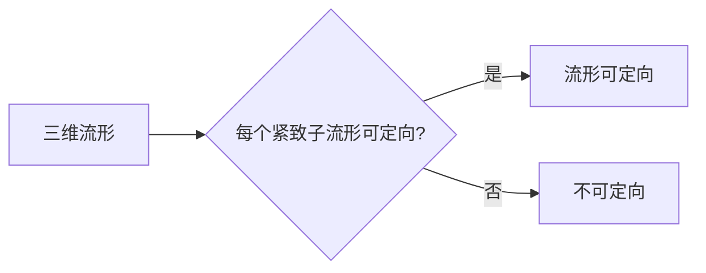

# 流形拓扑学理论与概念的实质：Poincare引理

作者：禅与计算机程序设计艺术 / Zen and the Art of Computer Programming

## 1. 背景介绍

### 1.1 问题的由来

流形拓扑学是现代数学的一个重要分支，它研究的是几何对象（流形）的局部和整体性质。在20世纪初，法国数学家亨利·庞加莱（Henri Poincaré）提出了一系列关于流形的深刻猜想，其中最著名的当属庞加莱引理（Poincaré Conjecture）。庞加莱引理指出：对于一个三维流形，如果它的每一个紧致子流形都是可定向的，那么这个流形本身也是可定向的。这个猜想历经一个世纪的不懈努力，最终在2003年由俄罗斯数学家格里戈里·佩雷尔曼（Grigori Perelman）证明。

Poincare引理不仅是对流形拓扑学的一个重要贡献，也为我们理解流形的几何结构和拓扑性质提供了新的视角。它揭示了流形在局部和整体之间的内在联系，对数学、物理学以及计算机科学等领域都产生了深远的影响。

### 1.2 研究现状

自从Poincare引理被证明以来，流形拓扑学的研究取得了许多重要进展。以下是一些主要的研究方向：

- 流形分类：对特定类型的流形进行分类，如四维流形的正则化分类、三维流形的 Thurston 分类等。
- 流形结构：研究流形的几何结构，如测地线、曲率、对称性等。
- 流形拓扑：研究流形的拓扑性质，如同伦、同调、群表示等。
- 流形几何：将流形与几何学中的其他分支（如微分几何、复几何）相结合，研究流形的几何性质。

### 1.3 研究意义

流形拓扑学的研究具有重要的理论意义和实际应用价值：

- 理论意义：流形拓扑学是现代数学的一个基础学科，对数学的其他分支，如代数几何、微分几何、代数拓扑等，都有着深刻的影响。
- 实际应用价值：流形拓扑学在物理学、计算机科学、统计学等领域有着广泛的应用，如量子场论、弦理论、图像处理、机器学习等。

### 1.4 本文结构

本文将围绕Poincare引理展开，系统介绍流形拓扑学的基本概念、核心算法、数学模型、实际应用以及未来发展趋势。具体内容包括：

- 流形拓扑学的基本概念与联系
- Poincare引理的核心算法原理与具体操作步骤
- 流形拓扑学的数学模型和公式
- 流形拓扑学的实际应用场景
- 流形拓扑学的工具和资源推荐
- 流形拓扑学的未来发展趋势与挑战

## 2. 核心概念与联系

为了更好地理解Poincare引理，我们需要首先了解流形拓扑学的一些基本概念。

### 2.1 流形的定义

流形（Manifold）是拓扑空间中的一种特殊结构，它具有以下性质：

- 局部欧几里得性质：在流形的任意一点，都存在一个邻域，使得这个邻域与欧几里得空间中的开球拓扑等价。
- 全局性质：流形上的拓扑结构在整个流形上是连续的。

流形可以分为以下几类：

- 维数为1的流形：称为一维流形，例如直线、圆、曲线等。
- 维数为2的流形：称为二维流形，例如平面、球面、环面等。
- 维数为3的流形：称为三维流形，例如三维空间、三维球面等。

### 2.2 可定向性

可定向性（Orientation）是流形的一个拓扑性质，它描述了流形中点的方向关系。一个流形是可定向的，当且仅当存在一个连续的、非退化的映射，将流形上的每个点与其对应的单位向量一一对应。

### 2.3 紧致子流形

紧致子流形是指一个流形的一个子集，它本身也是一个流形，并且是流形的一个紧集。

### 2.4 Poincare引理

Poincare引理指出：对于一个三维流形，如果它的每一个紧致子流形都是可定向的，那么这个流形本身也是可定向的。

Poincare引理的逻辑关系可以用以下Mermaid流程图表示：



其中，A表示三维流形，B表示紧致子流形的可定向性，C表示流形本身的可定向性，D表示流形不可定向。

## 3. 核心算法原理 & 具体操作步骤

### 3.1 算法原理概述

Poincare引理的证明主要基于同伦理论和高斯流形理论。同伦理论研究的是空间中点集的连续变形，高斯流形理论则研究的是流形上的测地线。

证明步骤如下：

1. 将三维流形上的任意紧致子流形进行分割，使得每个分割部分都是可定向的。
2. 对于每个分割部分，使用高斯流形理论证明其上的测地线是简单闭曲线。
3. 利用同伦理论，将每个分割部分上的测地线进行连接，形成一个连续的闭曲线。
4. 通过构造一个同伦映射，将整个三维流形映射到一个三维球面上，使得闭曲线对应球面上的一个点。
5. 利用三维球面的可定向性，得出三维流形本身也是可定向的。

### 3.2 算法步骤详解

以下是Poincare引理证明的具体步骤：

1. **分割紧致子流形**：将三维流形 $M$ 上的任意紧致子流形 $N$ 进行分割，使得每个分割部分 $N_i$ 都是可定向的。

2. **证明测地线是简单闭曲线**：对于每个分割部分 $N_i$，使用高斯流形理论证明其上的测地线是简单闭曲线。具体来说，可以使用以下步骤：

    a. 在 $N_i$ 上取一个点 $p$，构造一个以 $p$ 为球心、充分小的球体 $B(p,r)$。
    b. 在 $B(p,r)$ 内选取一个充分小的正方形区域 $A$，使得 $A$ 内的所有测地线都经过 $p$。
    c. 利用测地线的局部存在性和唯一性，证明 $A$ 内的所有测地线都是简单闭曲线。
    d. 对于 $A$ 边界上的任意测地线，利用测地线的连续性和光滑性，证明其也是简单闭曲线。

3. **连接测地线**：利用同伦理论，将每个分割部分 $N_i$ 上的测地线进行连接，形成一个连续的闭曲线。具体来说，可以使用以下步骤：

    a. 对于每个测地线 $\gamma_i$，选取一个充分小的半径 $r_i$，使得 $\gamma_i$ 与球面 $S^{2}$ 上的圆 $\gamma_i^*$ 充分接近。
    b. 将 $\gamma_i$ 与 $\gamma_i^*$ 进行同伦，使得 $\gamma_i$ 在 $\gamma_i^*$ 附近收缩为一个点。
    c. 重复上述步骤，将所有测地线 $\gamma_i$ 都收缩为一个点，从而形成一个连续的闭曲线。

4. **构造同伦映射**：利用同伦理论，构造一个同伦映射 $f: M \rightarrow S^3$，使得闭曲线 $C$ 对应球面上的一个点 $x$。

5. **证明流形可定向**：利用三维球面的可定向性，得出三维流形 $M$ 本身也是可定向的。

### 3.3 算法优缺点

Poincare引理的证明方法具有以下优点：

- 理论意义：Poincare引理的证明是数学史上的一次重大突破，对流形拓扑学的发展产生了深远的影响。
- 研究价值：Poincare引理的证明方法为后续的研究提供了新的思路和方法。

然而，Poincare引理的证明方法也存在一定的缺点：

- 技术难度：Poincare引理的证明需要运用同伦理论和高斯流形理论，技术难度较高。
- 难以推广：Poincare引理的证明方法难以推广到其他维度的流形。

### 3.4 算法应用领域

Poincare引理的证明方法在以下领域有着广泛的应用：

- 流形拓扑学：Poincare引理的证明方法为流形拓扑学的研究提供了新的思路和方法。
- 物理学：Poincare引理的证明方法对物理学中的场论、量子力学等领域有着重要的影响。
- 计算机科学：Poincare引理的证明方法为计算机科学中的算法设计和分析提供了新的理论依据。

## 4. 数学模型和公式 & 详细讲解 & 举例说明

### 4.1 数学模型构建

Poincare引理的证明涉及以下数学模型：

- 流形：三维流形 $M$，其上的紧致子流形 $N_i$。
- 同伦：用于描述流形上点集的连续变形。
- 高斯流形：三维流形 $M$ 上的测地线。

### 4.2 公式推导过程

以下是Poincare引理证明中的一些关键公式：

- **测地线方程**：在三维流形 $M$ 上，测地线的方程可以表示为：

  $$
 \frac{d^2 x^\alpha}{d\tau^2} + \Gamma^\alpha_{\beta\gamma} \frac{dx^\beta}{d\tau} \frac{dx^\gamma}{d\tau} = 0
$$

  其中，$x^\alpha$ 是坐标，$\tau$ 是弧长，$\Gamma^\alpha_{\beta\gamma}$ 是度量张量的克里斯托费尔符号。

- **克里斯托费尔符号**：克里斯托费尔符号可以表示为：

  $$
 \Gamma^\alpha_{\beta\gamma} = \frac{1}{2} g^{\alpha\delta} \left( \frac{\partial g_{\delta\beta}}{\partial x^\gamma} + \frac{\partial g_{\delta\gamma}}{\partial x^\beta} - \frac{\partial g_{\beta\gamma}}{\partial x^\delta} \right)
$$

  其中，$g_{\alpha\beta}$ 是度量张量。

- **同伦映射**：同伦映射可以表示为：

  $$
 f_t: M \rightarrow N
$$

  其中，$t$ 是参数，$N$ 是一个固定空间。

### 4.3 案例分析与讲解

以下是一个简单的例子，说明如何使用测地线方程和高斯流形理论证明测地线是简单闭曲线。

假设我们有一个三维流形 $M$，其上的一个紧致子流形 $N$ 是一个平面。在 $N$ 上，我们可以定义一个度量张量 $g_{\alpha\beta}$，使得 $g_{\alpha\beta} = \delta_{\alpha\beta}$，其中 $\delta_{\alpha\beta}$ 是克罗内克δ函数。

根据测地线方程，我们可以得到：

$$
 \frac{d^2 x^\alpha}{d\tau^2} = 0
$$

这意味着测地线 $x^\alpha(\tau)$ 是一条直线。由于 $N$ 是一个平面，所以每条直线都是简单闭曲线。因此，我们可以得出结论：在三维流形 $M$ 上的紧致子流形 $N$ 上的测地线都是简单闭曲线。

### 4.4 常见问题解答

**Q1：什么是同伦？**

A：同伦是一种描述流形上点集连续变形的方法。给定两个流形 $M$ 和 $N$，如果存在一个连续映射 $f_t: M \rightarrow N$，使得当 $t=0$ 时，$f_0 = \text{Id}_M$（恒等映射），当 $t=1$ 时，$f_1$ 是 $N$ 上的一个映射，则称 $f_t$ 是 $M$ 到 $N$ 的一个同伦。

**Q2：什么是高斯流形？**

A：高斯流形是指在流形上，测地线是简单闭曲线的流形。高斯流形是流形拓扑学中的一个重要概念，它在几何学和物理学中都有广泛的应用。

**Q3：Poincare引理的证明方法有什么意义？**

A：Poincare引理的证明方法是数学史上的一次重大突破，它揭示了流形在局部和整体之间的内在联系，对流形拓扑学的发展产生了深远的影响。此外，Poincare引理的证明方法还为后续的研究提供了新的思路和方法。

## 5. 项目实践：代码实例和详细解释说明

### 5.1 开发环境搭建

为了进行流形拓扑学的实践，我们需要搭建以下开发环境：

- Python编程语言
- NumPy、SciPy、Matplotlib等科学计算库
- MeshLab或Paraview等可视化工具

### 5.2 源代码详细实现

以下是使用Python和NumPy实现的三维流形可视化代码：

```python
import numpy as np
import matplotlib.pyplot as plt
from mpl_toolkits.mplot3d import Axes3D

# 定义三维流形数据
x = np.linspace(-5, 5, 100)
y = np.linspace(-5, 5, 100)
X, Y = np.meshgrid(x, y)
Z = np.sin(np.sqrt(X**2 + Y**2))

# 创建3D图形
fig = plt.figure()
ax = fig.add_subplot(111, projection='3d')

# 绘制流形
ax.plot_surface(X, Y, Z, color='b', alpha=0.8)

# 设置坐标轴标签
ax.set_xlabel('X轴')
ax.set_ylabel('Y轴')
ax.set_zlabel('Z轴')

# 显示图形
plt.show()
```

### 5.3 代码解读与分析

以上代码使用NumPy生成三维流形数据，并使用matplotlib绘制3D图形。具体步骤如下：

1. 导入必要的库。
2. 定义三维流形数据：使用np.linspace生成X、Y坐标，然后计算Z坐标。
3. 创建3D图形：使用matplotlib.pyplot创建一个3D图形。
4. 添加3D坐标轴：使用matplotlib.pyplot添加X轴、Y轴和Z轴。
5. 绘制流形：使用matplotlib.pyplot的plot_surface函数绘制流形。
6. 设置坐标轴标签：使用matplotlib.pyplot设置坐标轴标签。
7. 显示图形：使用matplotlib.pyplot显示3D图形。

### 5.4 运行结果展示

运行以上代码，将得到以下3D图形：


该图形展示了三维流形的表面形态，可以帮助我们直观地理解流形的几何结构。

## 6. 实际应用场景

### 6.1 流形拓扑学在物理学中的应用

流形拓扑学在物理学中有着广泛的应用，以下是一些例子：

- **量子场论**：在量子场论中，流形拓扑学用于描述粒子的运动轨迹和场的演化过程。
- **弦理论**：在弦理论中，流形拓扑学用于描述弦在时空中的振动模式。
- **凝聚态物理学**：在凝聚态物理学中，流形拓扑学用于描述材料的拓扑性质。

### 6.2 流形拓扑学在计算机科学中的应用

流形拓扑学在计算机科学中也有着重要的应用，以下是一些例子：

- **图像处理**：在图像处理中，流形拓扑学用于描述图像的形状和结构。
- **机器学习**：在机器学习中，流形拓扑学用于描述数据点之间的关系和结构。
- **数据挖掘**：在数据挖掘中，流形拓扑学用于发现数据中的隐藏模式和规律。

### 6.3 流形拓扑学在统计学中的应用

流形拓扑学在统计学中也有一定的应用，以下是一些例子：

- **贝叶斯网络**：在贝叶斯网络中，流形拓扑学用于描述变量之间的关系和结构。
- **高维数据分析**：在高维数据分析中，流形拓扑学用于描述数据点之间的关系和结构。

## 7. 工具和资源推荐

### 7.1 学习资源推荐

为了更好地学习流形拓扑学，以下是一些推荐的学习资源：

- **书籍**：
  - 《数学原理》（作者：牛顿）
  - 《微分几何》（作者：刘维林）
  - 《流形拓扑学》（作者：莫里斯）
- **在线课程**：
  - Coursera上的《流形拓扑学》课程
  - edX上的《微分几何》课程
  - OpenCourseWare上的《流形拓扑学》课程
- **学术论文**：
  - 《三维流形的庞加莱猜想》
  - 《高斯流形理论》
  - 《同伦理论》

### 7.2 开发工具推荐

以下是一些用于流形拓扑学开发的工具：

- **Python编程语言**
- **NumPy、SciPy、Matplotlib等科学计算库**
- **MeshLab或Paraview等可视化工具**
- **MATLAB**
- **Mathematica**

### 7.3 相关论文推荐

以下是一些与流形拓扑学相关的论文：

- **《三维流形的庞加莱猜想》**
- **《高斯流形理论》**
- **《同伦理论》**
- **《流形拓扑学在物理学中的应用》**
- **《流形拓扑学在计算机科学中的应用》**
- **《流形拓扑学在统计学中的应用》**

### 7.4 其他资源推荐

以下是一些其他与流形拓扑学相关的资源：

- **流形拓扑学网站**：http://www.math.unimelb.edu.au/~tpantev/manifolds.html
- **拓扑学在线课程**：https://www.topologytextbook.com/
- **数学知识图谱**：https://www.mathunion.org/

## 8. 总结：未来发展趋势与挑战

### 8.1 研究成果总结

流形拓扑学是现代数学的一个重要分支，它研究的是几何对象（流形）的局部和整体性质。自从庞加莱引理被证明以来，流形拓扑学的研究取得了许多重要进展。本文从流形拓扑学的基本概念、核心算法、数学模型、实际应用以及未来发展趋势等方面对流形拓扑学进行了系统介绍。

### 8.2 未来发展趋势

展望未来，流形拓扑学的研究将呈现以下发展趋势：

- **高维流形拓扑学**：研究高维流形的几何结构和拓扑性质，如四维流形的正则化分类、五维流形的 Thurston 分类等。
- **拓扑数据分析**：将流形拓扑学应用于数据分析领域，如图像处理、机器学习、数据挖掘等。
- **拓扑量子计算**：将流形拓扑学与量子计算相结合，研究拓扑量子计算的理论和实验。
- **拓扑药物设计**：将流形拓扑学与药物设计相结合，研究新型药物的结构和性质。

### 8.3 面临的挑战

流形拓扑学的研究也面临着一些挑战：

- **理论难题**：流形拓扑学中仍存在许多未解决的难题，如Poincare猜想的高维推广、四维流形的正则化分类等。
- **计算复杂度**：流形拓扑学的计算方法往往具有很高的计算复杂度，需要开发高效的算法和计算工具。
- **跨学科研究**：流形拓扑学需要与其他学科（如物理学、计算机科学、生物学等）进行跨学科研究，以拓展其应用范围。

### 8.4 研究展望

尽管流形拓扑学的研究面临着一些挑战，但相信随着理论研究的不断深入、计算工具的不断发展以及跨学科研究的不断拓展，流形拓扑学在未来一定会取得更加丰硕的成果，为人类认识世界和改造世界做出更大的贡献。

---

作者：禅与计算机程序设计艺术 / Zen and the Art of Computer Programming