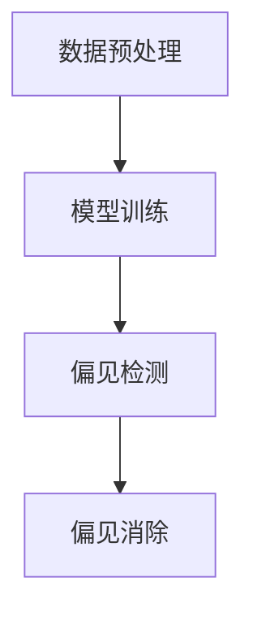

# 大语言模型原理基础与前沿 偏见

## 1.背景介绍

大语言模型（Large Language Models, LLMs）是近年来人工智能领域的一个重要突破。它们通过大量的文本数据进行训练，能够生成高质量的自然语言文本，完成翻译、问答、文本生成等任务。然而，随着大语言模型的广泛应用，偏见问题也逐渐显现出来。偏见不仅影响模型的公平性和公正性，还可能导致严重的社会问题。因此，理解和解决大语言模型中的偏见问题显得尤为重要。

## 2.核心概念与联系

### 2.1 大语言模型

大语言模型是基于深度学习技术，特别是基于Transformer架构的模型。它们通过大量的文本数据进行训练，能够生成高质量的自然语言文本。常见的大语言模型包括GPT-3、BERT等。

### 2.2 偏见

偏见是指模型在处理数据时，因数据本身或训练过程中的某些因素，导致输出结果存在系统性误差。偏见可以分为多种类型，如性别偏见、种族偏见、年龄偏见等。

### 2.3 偏见与大语言模型的联系

大语言模型在训练过程中，使用了大量的互联网文本数据。这些数据不可避免地包含了人类社会中的各种偏见。因此，大语言模型在生成文本时，也可能会反映出这些偏见。

## 3.核心算法原理具体操作步骤

### 3.1 数据预处理

在训练大语言模型之前，需要对数据进行预处理。预处理的步骤包括数据清洗、去重、分词等。

### 3.2 模型训练

模型训练是大语言模型的核心步骤。常见的训练方法包括自监督学习和迁移学习。自监督学习通过预测文本中的某些部分来训练模型，而迁移学习则是将预训练模型应用到特定任务中。

### 3.3 偏见检测

偏见检测是识别模型输出中存在的偏见。常见的检测方法包括定量分析和定性分析。定量分析通过统计方法检测偏见，而定性分析则通过人工评估来识别偏见。

### 3.4 偏见消除

偏见消除是通过调整模型或数据，减少模型输出中的偏见。常见的方法包括数据增强、对抗训练和公平性约束等。



## 4.数学模型和公式详细讲解举例说明

### 4.1 语言模型的数学基础

语言模型的核心是概率论。给定一个词序列 $w_1, w_2, ..., w_n$，语言模型的目标是计算这个序列的概率 $P(w_1, w_2, ..., w_n)$。根据链式法则，这个概率可以分解为：

$$
P(w_1, w_2, ..., w_n) = P(w_1) P(w_2 | w_1) P(w_3 | w_1, w_2) ... P(w_n | w_1, w_2, ..., w_{n-1})
$$

### 4.2 Transformer模型

Transformer模型是大语言模型的基础。它通过自注意力机制（Self-Attention）来捕捉词与词之间的关系。自注意力机制的计算公式为：

$$
Attention(Q, K, V) = softmax\left(\frac{QK^T}{\sqrt{d_k}}\right)V
$$

其中，$Q$、$K$、$V$分别是查询矩阵、键矩阵和值矩阵，$d_k$是键矩阵的维度。

### 4.3 偏见检测的数学方法

偏见检测可以通过统计方法来实现。例如，性别偏见可以通过计算不同性别词汇的共现概率来检测。给定一个词汇 $w$ 和性别词汇 $g$，共现概率 $P(w|g)$ 可以表示为：

$$
P(w|g) = \frac{count(w, g)}{count(g)}
$$

### 4.4 偏见消除的数学方法

偏见消除可以通过对抗训练来实现。对抗训练的目标是通过引入一个对抗网络，使得生成的文本在不同偏见维度上具有相似的分布。对抗训练的损失函数可以表示为：

$$
L = L_{task} + \lambda L_{adv}
$$

其中，$L_{task}$ 是任务损失，$L_{adv}$ 是对抗损失，$\lambda$ 是权重参数。

## 5.项目实践：代码实例和详细解释说明

### 5.1 数据预处理

```python
import re

def preprocess_text(text):
    # 去除特殊字符
    text = re.sub(r'\W', ' ', text)
    # 转换为小写
    text = text.lower()
    return text

# 示例文本
text = "Hello, World! This is a test."
preprocessed_text = preprocess_text(text)
print(preprocessed_text)
```

### 5.2 模型训练

```python
from transformers import GPT2LMHeadModel, GPT2Tokenizer, Trainer, TrainingArguments

# 加载预训练模型和分词器
model = GPT2LMHeadModel.from_pretrained('gpt2')
tokenizer = GPT2Tokenizer.from_pretrained('gpt2')

# 定义训练数据
train_texts = ["Hello, world!", "How are you?"]
train_encodings = tokenizer(train_texts, return_tensors='pt', padding=True, truncation=True)

# 定义训练参数
training_args = TrainingArguments(
    output_dir='./results',
    num_train_epochs=1,
    per_device_train_batch_size=2,
    save_steps=10,
    save_total_limit=2,
)

# 定义Trainer
trainer = Trainer(
    model=model,
    args=training_args,
    train_dataset=train_encodings,
)

# 开始训练
trainer.train()
```

### 5.3 偏见检测

```python
from transformers import pipeline

# 加载预训练模型
classifier = pipeline('sentiment-analysis')

# 示例文本
texts = ["She is a nurse.", "He is a doctor."]
results = classifier(texts)

# 输出结果
for text, result in zip(texts, results):
    print(f"Text: {text}, Sentiment: {result['label']}, Score: {result['score']}")
```

### 5.4 偏见消除

```python
from transformers import GPT2LMHeadModel, GPT2Tokenizer, Trainer, TrainingArguments

# 加载预训练模型和分词器
model = GPT2LMHeadModel.from_pretrained('gpt2')
tokenizer = GPT2Tokenizer.from_pretrained('gpt2')

# 定义对抗训练数据
train_texts = ["She is a nurse.", "He is a doctor."]
train_encodings = tokenizer(train_texts, return_tensors='pt', padding=True, truncation=True)

# 定义对抗训练参数
training_args = TrainingArguments(
    output_dir='./results',
    num_train_epochs=1,
    per_device_train_batch_size=2,
    save_steps=10,
    save_total_limit=2,
)

# 定义对抗Trainer
trainer = Trainer(
    model=model,
    args=training_args,
    train_dataset=train_encodings,
)

# 开始对抗训练
trainer.train()
```

## 6.实际应用场景

### 6.1 自动文本生成

大语言模型可以用于自动文本生成，如新闻报道、小说创作等。然而，生成的文本可能会包含偏见，需要进行偏见检测和消除。

### 6.2 机器翻译

大语言模型在机器翻译中表现出色，但也可能会引入源语言中的偏见。因此，需要在翻译过程中进行偏见检测和消除。

### 6.3 问答系统

大语言模型可以用于构建智能问答系统。然而，问答系统的回答可能会反映出训练数据中的偏见，需要进行偏见检测和消除。

## 7.工具和资源推荐

### 7.1 工具

- **Transformers库**：由Hugging Face提供的开源库，支持多种大语言模型的训练和应用。
- **Fairness Indicators**：由Google提供的工具，用于检测和评估模型的公平性。

### 7.2 资源

- **OpenAI GPT-3**：OpenAI提供的大语言模型，支持多种自然语言处理任务。
- **BERT**：由Google提出的大语言模型，广泛应用于各种自然语言处理任务。

## 8.总结：未来发展趋势与挑战

大语言模型在自然语言处理领域取得了显著的进展，但偏见问题仍然是一个重要的挑战。未来的发展趋势包括：

- **更高效的偏见检测方法**：开发更高效的偏见检测方法，能够快速识别和消除模型中的偏见。
- **多模态模型**：结合文本、图像、音频等多种模态的数据，构建更加全面和公平的模型。
- **公平性约束**：在模型训练过程中引入公平性约束，确保模型输出的公平性和公正性。

## 9.附录：常见问题与解答

### 9.1 大语言模型为什么会产生偏见？

大语言模型在训练过程中使用了大量的互联网文本数据，这些数据不可避免地包含了人类社会中的各种偏见。因此，大语言模型在生成文本时，也可能会反映出这些偏见。

### 9.2 如何检测大语言模型中的偏见？

偏见检测可以通过统计方法和人工评估来实现。常见的方法包括计算不同词汇的共现概率、使用预训练的分类器进行情感分析等。

### 9.3 如何消除大语言模型中的偏见？

偏见消除可以通过数据增强、对抗训练和公平性约束等方法来实现。数据增强通过增加多样化的数据来减少偏见，对抗训练通过引入对抗网络来减少偏见，公平性约束通过在训练过程中引入公平性约束来减少偏见。

---

作者：禅与计算机程序设计艺术 / Zen and the Art of Computer Programming