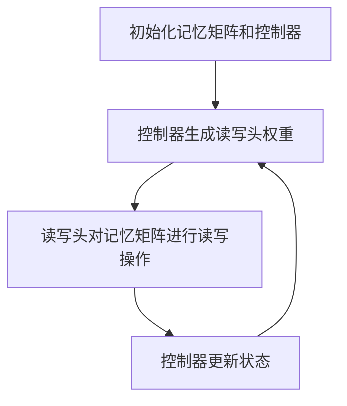
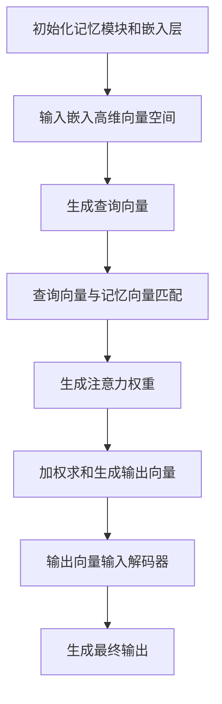

# 大语言模型原理基础与前沿 外部记忆

## 1.背景介绍

在人工智能领域，语言模型（Language Model, LM）是自然语言处理（NLP）的核心技术之一。近年来，随着深度学习技术的发展，特别是大规模预训练模型（如GPT-3、BERT等）的出现，语言模型的性能得到了显著提升。然而，这些模型在处理长文本和复杂任务时，仍然面临着记忆和推理能力的限制。为了解决这些问题，外部记忆（External Memory）机制被引入到大语言模型中，成为当前研究的热点。

外部记忆机制的引入，使得语言模型能够在处理长文本和复杂任务时，具备更强的记忆和推理能力。这一机制不仅提升了模型的性能，还为解决实际应用中的诸多问题提供了新的思路和方法。

## 2.核心概念与联系

### 2.1 语言模型

语言模型是通过统计或机器学习方法，预测一个句子中下一个词的概率分布。传统的语言模型包括n-gram模型、隐马尔可夫模型（HMM）等，而现代的语言模型主要基于深度学习技术，如RNN、LSTM、Transformer等。

### 2.2 外部记忆

外部记忆是一种增强模型记忆能力的机制，通过引入外部存储单元，使得模型能够在处理长文本和复杂任务时，具备更强的记忆和推理能力。外部记忆的实现方式多种多样，包括神经图灵机（Neural Turing Machine, NTM）、记忆网络（Memory Networks）等。

### 2.3 语言模型与外部记忆的联系

将外部记忆机制引入语言模型，可以显著提升模型的记忆和推理能力。通过外部记忆，模型可以在处理长文本和复杂任务时，保持对上下文信息的有效记忆，从而提高模型的性能和准确性。

## 3.核心算法原理具体操作步骤

### 3.1 神经图灵机（NTM）

神经图灵机是一种结合了神经网络和图灵机的模型，通过引入外部记忆矩阵，使得模型具备读写记忆的能力。其核心算法步骤如下：

1. 初始化记忆矩阵和控制器。
2. 控制器根据输入生成读写头的权重。
3. 读写头根据权重对记忆矩阵进行读写操作。
4. 控制器根据读写结果更新状态。
5. 重复步骤2-4，直到处理完所有输入。



### 3.2 记忆网络（Memory Networks）

记忆网络是一种通过引入外部记忆模块，增强模型记忆能力的架构。其核心算法步骤如下：

1. 初始化记忆模块和嵌入层。
2. 将输入嵌入到高维向量空间。
3. 根据输入生成查询向量。
4. 查询向量与记忆模块中的记忆向量进行匹配，生成注意力权重。
5. 根据注意力权重对记忆向量进行加权求和，生成输出向量。
6. 将输出向量输入到解码器，生成最终输出。



## 4.数学模型和公式详细讲解举例说明

### 4.1 神经图灵机（NTM）

神经图灵机的核心在于其读写操作。假设记忆矩阵为 $M \in \mathbb{R}^{N \times M}$，其中 $N$ 是记忆单元的数量，$M$ 是每个记忆单元的维度。读写头的操作可以表示为：

#### 读操作

读头生成读权重 $w^r \in \mathbb{R}^N$，读出的向量为：

$$
r_t = \sum_{i=1}^N w^r_i M_i
$$

#### 写操作

写头生成写权重 $w^w \in \mathbb{R}^N$ 和写向量 $e_t \in \mathbb{R}^M$，更新后的记忆矩阵为：

$$
M'_i = M_i (1 - w^w_i e_t) + w^w_i a_t
$$

其中，$a_t$ 是要写入的向量。

### 4.2 记忆网络（Memory Networks）

记忆网络的核心在于其注意力机制。假设记忆模块中的记忆向量为 $m_i \in \mathbb{R}^d$，查询向量为 $q \in \mathbb{R}^d$，注意力权重 $p_i$ 可以表示为：

$$
p_i = \text{softmax}(q \cdot m_i)
$$

输出向量 $o$ 为：

$$
o = \sum_{i} p_i m_i
$$

## 5.项目实践：代码实例和详细解释说明

### 5.1 神经图灵机（NTM）代码实例

以下是一个简单的神经图灵机实现示例：

```python
import torch
import torch.nn as nn
import torch.optim as optim

class NTM(nn.Module):
    def __init__(self, input_size, output_size, memory_size, memory_dim):
        super(NTM, self).__init__()
        self.controller = nn.LSTM(input_size, output_size)
        self.memory = torch.zeros(memory_size, memory_dim)
        self.read_head = nn.Linear(output_size, memory_size)
        self.write_head = nn.Linear(output_size, memory_size)
        self.write_vector = nn.Linear(output_size, memory_dim)

    def forward(self, x):
        output, _ = self.controller(x)
        read_weights = torch.softmax(self.read_head(output), dim=1)
        read_vector = torch.matmul(read_weights, self.memory)
        write_weights = torch.softmax(self.write_head(output), dim=1)
        write_vector = self.write_vector(output)
        self.memory = self.memory * (1 - write_weights.unsqueeze(-1)) + write_weights.unsqueeze(-1) * write_vector
        return read_vector

# 示例使用
ntm = NTM(input_size=10, output_size=20, memory_size=128, memory_dim=40)
input_data = torch.randn(5, 10)  # 假设输入序列长度为5，特征维度为10
output = ntm(input_data)
print(output)
```

### 5.2 记忆网络（Memory Networks）代码实例

以下是一个简单的记忆网络实现示例：

```python
import torch
import torch.nn as nn
import torch.optim as optim

class MemoryNetwork(nn.Module):
    def __init__(self, input_size, memory_size, memory_dim):
        super(MemoryNetwork, self).__init__()
        self.embedding = nn.Embedding(input_size, memory_dim)
        self.memory = nn.Parameter(torch.randn(memory_size, memory_dim))
        self.query = nn.Linear(memory_dim, memory_dim)

    def forward(self, x):
        embedded = self.embedding(x)
        query_vector = self.query(embedded)
        attention_weights = torch.softmax(torch.matmul(query_vector, self.memory.t()), dim=1)
        output_vector = torch.matmul(attention_weights, self.memory)
        return output_vector

# 示例使用
mem_net = MemoryNetwork(input_size=100, memory_size=128, memory_dim=40)
input_data = torch.randint(0, 100, (5,))  # 假设输入序列长度为5
output = mem_net(input_data)
print(output)
```

## 6.实际应用场景

### 6.1 长文本处理

在长文本处理任务中，传统的语言模型往往难以保持对上下文信息的有效记忆。通过引入外部记忆机制，模型可以在处理长文本时，保持对上下文信息的有效记忆，从而提高文本生成和理解的准确性。

### 6.2 问答系统

在问答系统中，外部记忆机制可以帮助模型记住大量的知识和信息，从而在回答复杂问题时，提供更准确和详细的答案。例如，记忆网络可以存储大量的知识图谱信息，帮助模型在回答问题时，进行有效的推理和检索。

### 6.3 机器翻译

在机器翻译任务中，外部记忆机制可以帮助模型保持对源语言文本的有效记忆，从而提高翻译的准确性和流畅性。例如，神经图灵机可以在翻译长句子时，保持对源语言文本的有效记忆，从而生成更准确的译文。

## 7.工具和资源推荐

### 7.1 工具

1. **PyTorch**：一个流行的深度学习框架，支持动态计算图和自动微分，适合实现和训练复杂的神经网络模型。
2. **TensorFlow**：另一个流行的深度学习框架，支持静态计算图和分布式训练，适合大规模模型的训练和部署。
3. **Hugging Face Transformers**：一个开源的NLP库，提供了大量预训练的语言模型和工具，方便进行NLP任务的研究和应用。

### 7.2 资源

1. **论文**：阅读相关领域的最新研究论文，如《Neural Turing Machines》、《Memory Networks》等，了解最新的研究进展和技术细节。
2. **教程**：学习相关的在线教程和课程，如Coursera、edX等平台上的深度学习和NLP课程，掌握相关的理论和实践技能。
3. **社区**：参与相关的技术社区和论坛，如Stack Overflow、GitHub等，交流经验和问题，获取更多的技术支持和资源。

## 8.总结：未来发展趋势与挑战

外部记忆机制的引入，为大语言模型的研究和应用带来了新的机遇和挑战。未来的发展趋势包括：

1. **更高效的记忆机制**：研究更高效的记忆机制，提高模型的记忆和推理能力，减少计算和存储开销。
2. **更大规模的预训练模型**：结合外部记忆机制，训练更大规模的预训练模型，提高模型的性能和泛化能力。
3. **多模态融合**：将外部记忆机制应用于多模态任务，如图像、文本、语音等，提升模型的综合能力和应用范围。

然而，外部记忆机制也面临着一些挑战，如记忆的有效管理、读写操作的优化、模型的可解释性等。解决这些挑战，将是未来研究的重要方向。

## 9.附录：常见问题与解答

### 问题1：外部记忆机制如何影响模型的训练时间？

外部记忆机制的引入，增加了模型的复杂性和计算量，可能会导致训练时间的增加。然而，通过优化读写操作和记忆管理，可以在一定程度上减少训练时间。

### 问题2：外部记忆机制是否适用于所有NLP任务？

外部记忆机制在处理长文本和复杂任务时，表现出显著的优势。然而，对于一些简单的NLP任务，传统的语言模型可能已经足够，外部记忆机制的引入可能并不会带来显著的性能提升。

### 问题3：如何选择合适的外部记忆机制？

选择合适的外部记忆机制，取决于具体的任务和需求。神经图灵机适用于需要复杂读写操作的任务，而记忆网络则适用于需要大规模知识检索和推理的任务。

---

作者：禅与计算机程序设计艺术 / Zen and the Art of Computer Programming