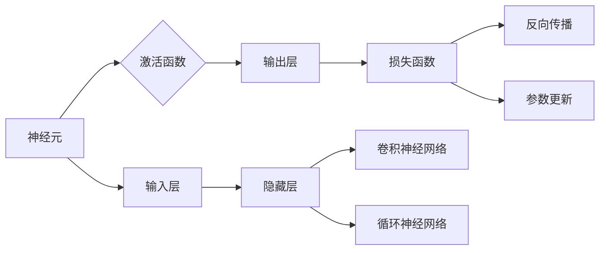

# 深度学习 (Deep Learning) 原理与代码实例讲解

作者：禅与计算机程序设计艺术 / Zen and the Art of Computer Programming

## 1. 背景介绍
### 1.1 问题的由来

深度学习作为人工智能领域的一个重要分支，近年来取得了惊人的进展。从图像识别、语音识别到自然语言处理，深度学习模型在各个领域都取得了突破性的成果。然而，深度学习并非一蹴而就，其发展历程充满了挑战和机遇。

### 1.2 研究现状

深度学习的研究已经经历了数十年的发展，从早期的感知机、BP算法到如今的深度神经网络，算法和模型不断演进。近年来，随着计算能力的提升和大数据的涌现，深度学习取得了显著的成果。

### 1.3 研究意义

深度学习的研究意义在于：

1. **模拟人脑神经网络**：深度学习模型的结构和参数与人类大脑神经元类似，能够模拟人脑的学习过程，从而实现智能。
2. **自动特征提取**：深度学习模型能够自动从原始数据中提取特征，无需人工设计，降低了模型开发成本。
3. **泛化能力**：深度学习模型在多个领域取得了优异的成绩，具有强大的泛化能力。

### 1.4 本文结构

本文将围绕深度学习的原理和代码实例展开，内容安排如下：

- 第2部分，介绍深度学习的基本概念和核心算法。
- 第3部分，详细讲解深度学习的常用算法原理和具体操作步骤。
- 第4部分，介绍深度学习的数学模型和公式，并结合实例讲解。
- 第5部分，给出深度学习项目的代码实例，并对关键代码进行解读。
- 第6部分，探讨深度学习在实际中的应用场景及案例。
- 第7部分，推荐深度学习相关的学习资源、开发工具和参考文献。
- 第8部分，总结全文，展望深度学习的未来发展趋势与挑战。
- 第9部分，附录中包含常见问题与解答。

## 2. 核心概念与联系

为了更好地理解深度学习，我们需要掌握以下核心概念：

- **神经元**：神经网络的基本单元，负责接收输入信号、计算输出值。
- **神经层**：由多个神经元组成的层次结构，用于特征提取和变换。
- **激活函数**：对神经元输出进行非线性变换，引入非线性特性。
- **损失函数**：衡量模型预测值与真实值之间的差异，用于指导模型优化。
- **反向传播**：一种基于梯度下降的优化算法，用于更新模型参数。
- **正则化**：防止模型过拟合的技术，如L1正则、L2正则、Dropout等。
- **卷积神经网络**：用于图像识别和处理的神经网络，具有局部感知、平移不变性等特点。
- **循环神经网络**：用于序列数据处理，如语音识别、自然语言处理等。

它们之间的逻辑关系可以用以下Mermaid流程图表示：



## 3. 核心算法原理 & 具体操作步骤
### 3.1 算法原理概述

深度学习的核心算法包括：

- **多层感知机**：一种简单的神经网络模型，由多个神经元层堆叠而成。
- **卷积神经网络**：适用于图像识别、图像生成等任务，具有局部感知和平移不变性。
- **循环神经网络**：适用于序列数据处理，如语音识别、自然语言处理等。
- **生成对抗网络**：由生成器和判别器组成，用于生成高质量的数据样本。

### 3.2 算法步骤详解

以下以多层感知机为例，介绍深度学习算法的具体操作步骤：

**Step 1: 数据预处理**

1. 收集原始数据。
2. 对数据进行清洗、预处理，如归一化、标准化等。

**Step 2: 构建模型**

1. 定义网络结构，如输入层、隐藏层、输出层等。
2. 选择合适的激活函数，如ReLU、Sigmoid等。
3. 设置损失函数，如均方误差、交叉熵等。

**Step 3: 训练模型**

1. 使用反向传播算法优化模型参数。
2. 计算损失函数，并更新模型参数。
3. 调整学习率和正则化参数，优化模型性能。

**Step 4: 验证模型**

1. 使用验证集评估模型性能。
2. 调整模型结构和参数，优化模型性能。

**Step 5: 测试模型**

1. 使用测试集评估模型性能。
2. 输出模型预测结果。

### 3.3 算法优缺点

深度学习算法的优点：

- **强大的特征提取能力**：能够自动从原始数据中提取特征，无需人工设计。
- **泛化能力强**：在多个领域取得了优异的成绩。
- **可解释性强**：可以通过可视化等方法理解模型的决策过程。

深度学习算法的缺点：

- **训练时间长**：需要大量的计算资源和时间进行训练。
- **对数据质量要求高**：数据质量对模型性能有很大影响。
- **参数调优复杂**：需要调整大量的参数，如学习率、正则化系数等。

### 3.4 算法应用领域

深度学习算法在以下领域有广泛应用：

- **图像识别**：如图像分类、目标检测、图像分割等。
- **语音识别**：如语音识别、语音合成等。
- **自然语言处理**：如机器翻译、情感分析、文本摘要等。
- **医疗诊断**：如图像诊断、疾病预测等。
- **自动驾驶**：如车道线检测、障碍物检测等。

## 4. 数学模型和公式 & 详细讲解 & 举例说明
### 4.1 数学模型构建

深度学习模型的数学模型主要包括：

- **神经元模型**：表示为 $y = \sigma(Wx + b)$，其中 $W$ 为权重矩阵，$b$ 为偏置向量，$\sigma$ 为激活函数。
- **多层感知机**：由多个神经元层堆叠而成，表示为 $y = \sigma(W_1x + b_1) \circ \sigma(W_2y_1 + b_2) \circ \ldots \circ \sigma(W_{n-1}y_{n-2} + b_{n-1})$。
- **损失函数**：衡量模型预测值与真实值之间的差异，如均方误差、交叉熵等。

### 4.2 公式推导过程

以下以均方误差损失函数为例，介绍其推导过程：

均方误差损失函数定义为：

$$
\mathcal{L} = \frac{1}{2} \sum_{i=1}^{N}(y_i - \hat{y}_i)^2
$$

其中 $y_i$ 为真实标签，$\hat{y}_i$ 为模型预测值。

对损失函数求导，得到：

$$
\frac{\partial \mathcal{L}}{\partial \hat{y}_i} = y_i - \hat{y}_i
$$

### 4.3 案例分析与讲解

以下以MNIST手写数字识别为例，介绍深度学习模型的构建和训练过程。

**Step 1: 数据预处理**

1. 下载MNIST数据集。
2. 对图像进行归一化处理。

**Step 2: 构建模型**

1. 定义网络结构，如输入层、隐藏层、输出层等。
2. 选择合适的激活函数，如ReLU。
3. 设置损失函数，如均方误差。

**Step 3: 训练模型**

1. 使用反向传播算法优化模型参数。
2. 计算损失函数，并更新模型参数。
3. 调整学习率和正则化参数，优化模型性能。

**Step 4: 验证模型**

1. 使用验证集评估模型性能。
2. 调整模型结构和参数，优化模型性能。

**Step 5: 测试模型**

1. 使用测试集评估模型性能。
2. 输出模型预测结果。

### 4.4 常见问题解答

**Q1：深度学习模型如何防止过拟合？**

A：防止过拟合的方法包括：

1. 增加数据集。
2. 减少模型复杂度。
3. 使用正则化技术，如L1正则、L2正则、Dropout等。
4. 使用早停法。

**Q2：深度学习模型的计算复杂度如何计算？**

A：深度学习模型的计算复杂度主要由以下因素决定：

1. 模型结构：包括层数、每层的神经元数量等。
2. 数据量：包括训练数据量、测试数据量等。
3. 计算设备：包括CPU、GPU等。

## 5. 项目实践：代码实例和详细解释说明
### 5.1 开发环境搭建

以下是使用Python和TensorFlow构建深度学习模型的开发环境搭建步骤：

1. 安装Anaconda。
2. 创建并激活虚拟环境。
3. 安装TensorFlow、Keras等库。

### 5.2 源代码详细实现

以下是一个简单的深度学习模型代码实例：

```python
import tensorflow as tf
from tensorflow.keras.models import Sequential
from tensorflow.keras.layers import Dense, Flatten

# 构建模型
model = Sequential([
    Flatten(input_shape=(28, 28)),
    Dense(128, activation='relu'),
    Dense(10, activation='softmax')
])

# 编译模型
model.compile(optimizer='adam', loss='categorical_crossentropy', metrics=['accuracy'])

# 训练模型
model.fit(x_train, y_train, epochs=10, batch_size=32, validation_data=(x_test, y_test))
```

### 5.3 代码解读与分析

以上代码使用了Keras构建了一个简单的深度学习模型，用于MNIST手写数字识别。

- `Sequential`：构建序列模型，将不同的层按顺序连接起来。
- `Flatten`：将输入数据展平为一维向量。
- `Dense`：全连接层，用于特征提取和变换。
- `compile`：编译模型，指定优化器、损失函数和评估指标。
- `fit`：训练模型，指定训练数据、迭代轮数、批大小等。

### 5.4 运行结果展示

运行以上代码，可以在MNIST数据集上训练一个简单的深度学习模型，并评估其性能。

## 6. 实际应用场景
### 6.1 图像识别

深度学习在图像识别领域取得了显著的成果，如ImageNet图像分类比赛。

### 6.2 语音识别

深度学习在语音识别领域也得到了广泛应用，如Google的语音识别系统。

### 6.3 自然语言处理

深度学习在自然语言处理领域取得了突破性进展，如BERT、GPT等模型。

### 6.4 未来应用展望

深度学习在未来将应用于更多领域，如：

- **医疗诊断**：如图像诊断、疾病预测等。
- **自动驾驶**：如车道线检测、障碍物检测等。
- **机器人**：如视觉感知、运动控制等。

## 7. 工具和资源推荐
### 7.1 学习资源推荐

- 《深度学习》（Ian Goodfellow、Yoshua Bengio、Aaron Courville著）：深度学习的经典教材。
- 《深度学习实践》（Aurélien Géron著）：介绍了深度学习的实践方法和代码实例。
- 《TensorFlow实战》（Martín Guggenheim著）：介绍了TensorFlow的用法和深度学习项目实践。

### 7.2 开发工具推荐

- TensorFlow：Google开发的深度学习框架。
- Keras：基于TensorFlow的开源深度学习库。
- PyTorch：由Facebook开发的深度学习框架。

### 7.3 相关论文推荐

- 《A Few Useful Things to Know about Machine Learning》（Pedro Domingos著）：介绍了机器学习的基本原理和方法。
- 《Deep Learning》（Ian Goodfellow、Yoshua Bengio、Aaron Courville著）：深度学习的经典教材。
- 《Mastering Deep Learning with PyTorch》（Aditya Khosla、Aditi Mathur、Suyog Shah著）：介绍了PyTorch的用法和深度学习项目实践。

### 7.4 其他资源推荐

- TensorFlow官方网站：https://www.tensorflow.org/
- PyTorch官方网站：https://pytorch.org/
- Keras官方网站：https://keras.io/

## 8. 总结：未来发展趋势与挑战
### 8.1 研究成果总结

深度学习作为人工智能领域的一个重要分支，取得了显著的进展。从图像识别、语音识别到自然语言处理，深度学习模型在各个领域都取得了突破性的成果。

### 8.2 未来发展趋势

未来深度学习的发展趋势包括：

- **模型轻量化**：降低模型复杂度，提高模型运行速度。
- **可解释性**：提高模型的解释性，使其更加可靠和安全。
- **多模态学习**：融合多模态数据，如文本、图像、语音等。

### 8.3 面临的挑战

深度学习在发展过程中也面临着一些挑战：

- **数据质量**：数据质量对模型性能有很大影响。
- **计算资源**：训练深度学习模型需要大量的计算资源。
- **可解释性**：提高模型的解释性，使其更加可靠和安全。

### 8.4 研究展望

未来，深度学习将在以下方面取得突破：

- **小样本学习**：在数据量较小的情况下，实现模型学习。
- **迁移学习**：将已学习到的知识迁移到新的任务。
- **可解释性**：提高模型的解释性，使其更加可靠和安全。

## 9. 附录：常见问题与解答

**Q1：深度学习与机器学习的区别是什么？**

A：深度学习和机器学习是两个相互关联的领域。机器学习是研究如何使计算机通过数据学习，而深度学习是机器学习的一个分支，主要研究如何使用神经网络进行学习。

**Q2：深度学习需要哪些基础？**

A：学习深度学习需要掌握以下基础知识：

- 线性代数
- 概率论与数理统计
- 优化算法
- 计算机编程

**Q3：深度学习模型如何训练？**

A：深度学习模型的训练过程包括：

1. 数据预处理
2. 构建模型
3. 训练模型
4. 验证模型
5. 测试模型

**Q4：深度学习模型如何评估？**

A：深度学习模型的评估方法包括：

- 混淆矩阵
- 准确率
- 召回率
- F1值

**Q5：如何防止深度学习模型过拟合？**

A：防止深度学习模型过拟合的方法包括：

- 增加数据集
- 减少模型复杂度
- 使用正则化技术
- 使用早停法

---

作者：禅与计算机程序设计艺术 / Zen and the Art of Computer Programming