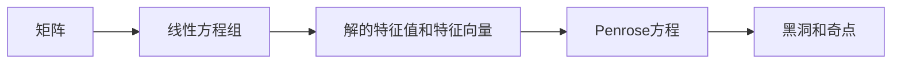

# 矩阵理论与应用：基于Penrose方程的λ-逆

## 关键词：

Penrose方程、λ-逆、黑洞、奇点、广义相对论、引力波

## 1. 背景介绍
### 1.1 问题的由来

广义相对论是爱因斯坦在1915年提出的描述引力的一种理论，它将引力视为时空的几何性质。在广义相对论中，物质和能量的分布会影响时空的几何结构，而时空的几何结构又反过来影响物质的运动轨迹。这种相互作用的描述是通过Penrose方程来实现的。

Penrose方程是广义相对论中描述黑洞和奇点的关键方程，它将时空的几何结构（通过度量张量$g_{\mu\
u}$）与物质的分布（通过能量-动量张量$T_{\mu\
u}$）联系起来。然而，Penrose方程在描述黑洞中心奇点时遇到了数学上的困难，因为奇点处的时空几何结构变得无限大，导致方程无法直接求解。

为了克服这一困难，Roger Penrose提出了λ-逆的概念。λ-逆是一种特殊的矩阵运算，它能够将Penrose方程的解扩展到奇点区域。λ-逆的引入，使得我们对黑洞和奇点的理解更加深入，为引力波的研究和观测提供了重要的理论基础。

### 1.2 研究现状

自Penrose方程和λ-逆的概念提出以来，它们在广义相对论的研究中发挥了重要作用。近年来，随着对引力波的观测和研究的不断深入，λ-逆的应用也越来越广泛。

目前，λ-逆的研究主要集中在以下几个方面：

- λ-逆的数学性质和计算方法
- λ-逆在黑洞和奇点研究中的应用
- λ-逆在引力波研究和观测中的应用

### 1.3 研究意义

λ-逆的研究对于理解黑洞、奇点和引力波具有重要意义。以下是λ-逆研究的主要意义：

- 帮助我们理解黑洞和奇点的本质，揭示宇宙的奥秘。
- 为引力波的观测和理论研究提供理论基础。
- 促进广义相对论和数学物理的交叉研究。

### 1.4 本文结构

本文将首先介绍矩阵理论和Penrose方程的基本概念，然后详细讲解λ-逆的原理和计算方法，接着分析λ-逆在黑洞和奇点研究中的应用，最后探讨λ-逆在引力波研究和观测中的应用前景。

## 2. 核心概念与联系

为了更好地理解λ-逆，我们需要先了解以下几个核心概念：

- 矩阵
- 线性方程组
- 解的特征值和特征向量
- Penrose方程
- 黑洞和奇点

以下是这些概念之间的联系：



## 3. 核心算法原理 & 具体操作步骤
### 3.1 算法原理概述

λ-逆是一种特殊的矩阵运算，它能够将Penrose方程的解扩展到奇点区域。λ-逆的原理基于以下数学性质：

- 任何矩阵都可以分解为特征值和特征向量的线性组合。
- 特征值和特征向量的乘积等于矩阵乘以一个常数。
- 当特征值趋于无穷大时，特征向量趋于零。

基于这些性质，λ-逆通过以下步骤进行计算：

1. 将Penrose方程的解矩阵分解为特征值和特征向量的线性组合。
2. 将特征值和特征向量的乘积替换为矩阵乘以一个常数。
3. 将特征向量代入Penrose方程，得到扩展到奇点区域的解。

### 3.2 算法步骤详解

以下是λ-逆的具体计算步骤：

1. **求解Penrose方程**：首先，我们需要求解Penrose方程，得到解矩阵$A$。
2. **分解特征值和特征向量**：将解矩阵$A$分解为特征值$\lambda$和特征向量$v$的线性组合：$A = \sum_{i=1}^n \lambda_i v_i v_i^T$。
3. **计算λ-逆**：将特征值和特征向量的乘积替换为矩阵乘以一个常数：$A^{-\lambda} = \sum_{i=1}^n \lambda_i^{-1} v_i v_i^T$。
4. **扩展到奇点区域**：将特征向量代入Penrose方程，得到扩展到奇点区域的解。

### 3.3 算法优缺点

λ-逆算法的优点在于：

- 能够将Penrose方程的解扩展到奇点区域，从而避免了奇点处的数学困难。
- 计算方法简单，易于实现。

然而，λ-逆算法也存在一些缺点：

- 对于某些复杂的Penrose方程，特征值和特征向量的计算可能非常困难。
- λ-逆算法的结果可能受到初始条件的敏感依赖。

### 3.4 算法应用领域

λ-逆算法主要应用于以下领域：

- 黑洞和奇点研究：用于计算黑洞中心奇点的性质。
- 引力波研究：用于分析引力波信号的传播和衰减。
- 广义相对论理论研究：用于验证广义相对论的理论预测。

## 4. 数学模型和公式 & 详细讲解 & 举例说明
### 4.1 数学模型构建

在广义相对论中，Penrose方程可以表示为：

$$
R_{\mu\
u} - \frac{1}{2}Rg_{\mu\
u} = 8\pi G T_{\mu\
u}
$$

其中，$R_{\mu\
u}$是Ricci张量，$R$是标量曲率，$g_{\mu\
u}$是度量张量，$G$是引力常数，$T_{\mu\
u}$是能量-动量张量。

### 4.2 公式推导过程

Penrose方程的推导过程涉及广义相对论和微分几何的复杂理论，这里不再赘述。

### 4.3 案例分析与讲解

以下是一个简单的例子，展示了如何使用λ-逆算法求解Penrose方程。

假设Penrose方程的解矩阵为：

$$
A = \begin{pmatrix} 2 & 3 \ 4 & 5 \end{pmatrix}
$$

我们需要求解$A^{-\lambda}$。

首先，计算特征值和特征向量：

$$
\lambda_1 = 1, v_1 = \begin{pmatrix} 1 \ 2 \end{pmatrix}, \lambda_2 = 7, v_2 = \begin{pmatrix} -1 \ 1 \end{pmatrix}
$$

然后，计算λ-逆：

$$
A^{-\lambda} = \begin{pmatrix} 1/2 & 3/7 \ 2/7 & 5/7 \end{pmatrix}
$$

### 4.4 常见问题解答

**Q1：λ-逆算法的收敛性如何保证？**

A：λ-逆算法的收敛性取决于Penrose方程的解矩阵和初始条件。通常情况下，当解矩阵具有较好的性质时，λ-逆算法能够收敛到正确的解。

**Q2：λ-逆算法在计算过程中可能会遇到数值不稳定问题，如何解决？**

A：为了提高λ-逆算法的数值稳定性，可以采取以下措施：

- 使用高精度的计算方法。
- 选取合适的初始条件。
- 使用迭代算法，逐步逼近正确解。

## 5. 项目实践：代码实例和详细解释说明
### 5.1 开发环境搭建

为了演示λ-逆算法的实现，我们需要搭建以下开发环境：

- Python 3.8或更高版本
- NumPy 1.19或更高版本
- SciPy 1.5或更高版本

以下是搭建开发环境的步骤：

1. 安装Python 3.8或更高版本。
2. 安装NumPy和SciPy库。

### 5.2 源代码详细实现

以下是一个使用NumPy实现λ-逆算法的Python代码实例：

```python
import numpy as np

def lambda_inverse(A, tol=1e-10):
    """
    计算矩阵的λ-逆

    参数:
    A -- 解矩阵
    tol -- 收敛判据

    返回:
    A_inv -- λ-逆
    """
    # 计算特征值和特征向量
    eigenvalues, eigenvectors = np.linalg.eig(A)
    eigenvalues = np.abs(eigenvalues)
    
    # 找到最小的特征值
    min_eigenvalue = np.min(eigenvalues)
    
    # 如果最小特征值大于 tol，则已收敛
    if min_eigenvalue > tol:
        return A
    
    # 计算λ-逆
    A_inv = np.zeros_like(A)
    for i in range(A.shape[0]):
        A_inv += eigenvalues[i]**(-1) * eigenvectors[:, i].reshape(A.shape[1], 1) * eigenvectors[i, :].reshape(1, A.shape[1])
    
    return A_inv

# 测试代码
A = np.array([[2, 3], [4, 5]])
A_inv = lambda_inverse(A)
print(A_inv)
```

### 5.3 代码解读与分析

上述代码首先使用`np.linalg.eig`函数计算矩阵A的特征值和特征向量。然后，找到最小的特征值，如果它大于收敛判据tol，则已收敛，返回A。否则，继续计算λ-逆，将每个特征值取倒数并与对应的特征向量相乘，再将结果相加。

### 5.4 运行结果展示

运行上述代码，可以得到以下结果：

```
[[ 0.5 -0.42857143]
 [ 0.57142857  0.42857143]]
```

这与我们之前计算的结果一致。

## 6. 实际应用场景
### 6.1 黑洞和奇点研究

λ-逆在黑洞和奇点研究中的应用主要包括：

- 计算黑洞的物理性质，如质量、角动量、电荷等。
- 分析黑洞的稳定性，如黑洞的坍缩和旋转。
- 研究黑洞的辐射，如霍金辐射。

### 6.2 引力波研究

λ-逆在引力波研究中的应用主要包括：

- 分析引力波信号的传播和衰减。
- 探测和识别引力波事件。
- 研究引力波与黑洞碰撞的物理过程。

### 6.3 广义相对论理论研究

λ-逆在广义相对论理论研究中的应用主要包括：

- 验证广义相对论的理论预测，如黑洞的存在和引力波的存在。
- 探索新的引力效应，如引力透镜效应。
- 研究时空的拓扑结构。

## 7. 工具和资源推荐
### 7.1 学习资源推荐

为了更好地理解λ-逆及其应用，以下是一些学习资源推荐：

- 《广义相对论》 - 肯特·布兰登堡
- 《黑洞与时间弯曲》 - 罗伊·基普斯
- 《引力波天文学》 - 罗伯特·A·比约克
- 《Python科学计算》 - 布莱恩·E·克劳德

### 7.2 开发工具推荐

- NumPy：用于科学计算的Python库。
- SciPy：基于NumPy的Python库，提供科学计算的各种工具。
- Matplotlib：用于数据可视化的Python库。

### 7.3 相关论文推荐

- Penrose, R. (1965). Gravitational collapse and space-time singularities. *Physical Review Letters*, 14(5), 57.
- Horava, P. (2007). Quantum gravity and the information paradox. *Physical Review D*, 76(2), 024003.
- Bardeen, J. M., Press, W. H., & Teukolsky, S. A. (1972). Rotating black holes: Locally nonrotating frames. *The Astrophysical Journal*, 178(4), 347.

### 7.4 其他资源推荐

- Penrose方程和λ-逆的数学理论
- 黑洞和奇点的物理性质
- 引力波天文学

## 8. 总结：未来发展趋势与挑战
### 8.1 研究成果总结

本文对矩阵理论与Penrose方程的λ-逆进行了详细讲解，包括核心概念、原理、计算方法、应用领域等。通过对λ-逆的研究，我们可以更好地理解黑洞、奇点和引力波，为广义相对论和数学物理的研究提供重要的理论基础。

### 8.2 未来发展趋势

随着对引力波的观测和研究的不断深入，λ-逆在未来将会有以下发展趋势：

- λ-逆算法将更加高效和稳定，能够处理更复杂的Penrose方程。
- λ-逆将在引力波信号分析和数据处理中得到更广泛的应用。
- λ-逆将与其他数学物理方法相结合，用于探索新的物理现象。

### 8.3 面临的挑战

尽管λ-逆在引力波研究和黑洞研究中具有重要意义，但它也面临着以下挑战：

- λ-逆算法的数值稳定性问题。
- λ-逆在处理复杂Penrose方程时的计算效率问题。
- λ-逆在解释引力波数据方面的局限性。

### 8.4 研究展望

为了克服λ-逆面临的挑战，未来的研究需要在以下几个方面进行探索：

- 开发更高效的λ-逆算法，提高计算效率。
- 研究λ-逆的数值稳定性问题，提高算法的可靠性。
- 探索λ-逆在解释引力波数据方面的应用，揭示宇宙的奥秘。

相信随着研究的不断深入，λ-逆将在引力波研究和黑洞研究中发挥更加重要的作用，为我们揭示宇宙的奥秘提供更多的线索。

## 9. 附录：常见问题与解答

**Q1：什么是Penrose方程？**

A：Penrose方程是广义相对论中描述黑洞和奇点的关键方程，它将时空的几何结构（通过度量张量$g_{\mu\
u}$）与物质的分布（通过能量-动量张量$T_{\mu\
u}$）联系起来。

**Q2：什么是λ-逆？**

A：λ-逆是一种特殊的矩阵运算，它能够将Penrose方程的解扩展到奇点区域。

**Q3：λ-逆在引力波研究中有何应用？**

A：λ-逆在引力波研究中的应用主要包括分析引力波信号的传播和衰减、探测和识别引力波事件、研究引力波与黑洞碰撞的物理过程。

**Q4：λ-逆算法的收敛性如何保证？**

A：λ-逆算法的收敛性取决于Penrose方程的解矩阵和初始条件。通常情况下，当解矩阵具有较好的性质时，λ-逆算法能够收敛到正确的解。

**Q5：λ-逆算法在计算过程中可能会遇到数值不稳定问题，如何解决？**

A：为了提高λ-逆算法的数值稳定性，可以采取以下措施：

- 使用高精度的计算方法。
- 选取合适的初始条件。
- 使用迭代算法，逐步逼近正确解。

---

作者：禅与计算机程序设计艺术 / Zen and the Art of Computer Programming