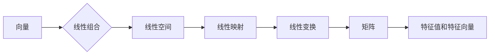

# 线性代数导引：逻辑基础

作者：禅与计算机程序设计艺术 / Zen and the Art of Computer Programming

## 关键词

线性代数、矩阵运算、向量空间、线性变换、特征值与特征向量、奇异值分解、应用领域

## 1. 背景介绍

### 1.1 问题的由来

线性代数是数学中一个重要的分支，它研究向量空间、线性变换以及与之相关的基本概念和性质。在计算机科学、物理学、工程学等多个领域都有着广泛的应用。线性代数的核心思想是研究线性方程组、线性映射和向量空间的结构与性质。

### 1.2 研究现状

随着计算机科学和工程技术的不断发展，线性代数在各个领域的应用越来越广泛。特别是在机器学习、数据科学、图像处理等领域，线性代数的知识几乎成为了必备技能。近年来，随着深度学习等技术的兴起，线性代数在计算机科学中的应用更是达到了一个新的高度。

### 1.3 研究意义

线性代数为计算机科学和工程技术提供了强有力的数学工具，可以帮助我们解决许多复杂问题。掌握线性代数的知识，不仅可以提高我们的数学素养，还可以帮助我们更好地理解和应用计算机科学和工程技术。

### 1.4 本文结构

本文将从线性代数的核心概念入手，逐步深入到线性变换、特征值与特征向量、奇异值分解等内容，并结合实际应用场景进行讲解。具体结构如下：

- 第2部分：介绍线性代数的核心概念与联系。
- 第3部分：讲解线性变换、特征值与特征向量的基本原理和具体操作步骤。
- 第4部分：介绍奇异值分解的数学模型、公式推导和案例分析。
- 第5部分：给出线性代数在实际应用场景中的实例和案例。
- 第6部分：探讨线性代数的未来发展趋势和挑战。
- 第7部分：推荐线性代数的学习资源、开发工具和参考文献。
- 第8部分：总结全文，展望线性代数的未来发展趋势与挑战。
- 第9部分：附录，常见问题与解答。

## 2. 核心概念与联系

线性代数涉及的概念较多，以下是一些核心概念及其相互关系：



- 向量：线性代数的基本研究对象之一，可以表示为坐标向量或抽象向量。
- 线性组合：向量的线性组合是指将向量与系数相乘后相加。
- 线性空间：由向量及其线性组合构成的集合，满足向量空间的公理。
- 线性映射：将一个向量空间映射到另一个向量空间的函数，满足线性映射的公理。
- 线性变换：特殊的线性映射，通常由矩阵表示。
- 矩阵：表示线性变换或线性空间的工具，可以用于线性方程组的求解。
- 特征值和特征向量：描述线性变换的特征性质。
- 奇异值分解：将矩阵分解为几个矩阵的乘积，用于降维、求解线性方程组等。

## 3. 核心算法原理 & 具体操作步骤

### 3.1 算法原理概述

线性代数中的核心算法主要包括：

- 向量运算：向量的加法、减法、数乘、内积、外积等。
- 矩阵运算：矩阵的加法、减法、数乘、乘法、转置、逆等。
- 线性方程组的求解：高斯消元法、矩阵求逆、特征值分解等。
- 特征值和特征向量：求解特征值和特征向量，分析线性变换的性质。

### 3.2 算法步骤详解

以下是一些常见算法的步骤详解：

**3.2.1 向量运算**

- 向量加法：对应坐标相加。
- 向量减法：对应坐标相减。
- 数乘：将向量的每个坐标乘以一个实数。
- 内积：两个向量的对应坐标相乘后再相加。
- 外积：两个向量的对应坐标相乘后构成一个矩阵。

**3.2.2 矩阵运算**

- 矩阵加法：对应元素相加。
- 矩阵减法：对应元素相减。
- 数乘：将矩阵的每个元素乘以一个实数。
- 矩阵乘法：满足分配律、结合律和交换律。
- 矩阵转置：交换矩阵的行和列。
- 矩阵求逆：如果矩阵可逆，则其逆矩阵与原矩阵相乘等于单位矩阵。

**3.2.3 线性方程组的求解**

- 高斯消元法：通过初等行变换将线性方程组转化为上三角或下三角方程组，然后逐个求解。
- 矩阵求逆：如果矩阵可逆，则其逆矩阵与原矩阵相乘等于单位矩阵。
- 特征值分解：将矩阵分解为特征值和特征向量的乘积，用于降维、求解线性方程组等。

### 3.3 算法优缺点

线性代数中的算法具有以下优点：

- 简单易行：线性代数的基本运算规则简单易懂，易于实现。
- 效率高：许多线性代数算法都可以通过高效的算法实现，如快速傅里叶变换、稀疏矩阵运算等。
- 应用广泛：线性代数算法在计算机科学和工程技术等多个领域都有广泛的应用。

然而，线性代数算法也存在一些缺点：

- 稳定性问题：某些线性代数算法（如高斯消元法）在数值计算过程中容易出现数值稳定性问题。
- 复杂性：某些线性代数算法（如奇异值分解）的计算复杂度较高。

### 3.4 算法应用领域

线性代数算法在计算机科学和工程技术等领域有广泛的应用，以下是一些典型应用：

- 计算机图形学：用于描述和处理三维空间中的点、线、面等几何对象。
- 信号处理：用于分析、处理和识别信号。
- 机器学习：用于特征提取、降维、聚类等任务。
- 数据科学：用于数据可视化、数据分析、预测等任务。

## 4. 数学模型和公式 & 详细讲解 & 举例说明

### 4.1 数学模型构建

线性代数中的数学模型主要包括向量、矩阵、线性方程组等。

**4.1.1 向量**

向量是线性代数的基本研究对象之一，可以表示为坐标向量或抽象向量。

- 坐标向量：具有n个坐标的有序数组。
- 抽象向量：不依赖于具体坐标的向量。

**4.1.2 矩阵**

矩阵是由m行n列的实数（或复数）构成的矩形数组。

**4.1.3 线性方程组**

线性方程组是由多个线性方程组成的方程组。

### 4.2 公式推导过程

以下是一些常用公式的推导过程：

**4.2.1 向量加法公式**

向量的加法公式为：

$$
\mathbf{u} + \mathbf{v} = (u_1, u_2, \ldots, u_n) + (v_1, v_2, \ldots, v_n) = (u_1 + v_1, u_2 + v_2, \ldots, u_n + v_n)
$$

**4.2.2 矩阵乘法公式**

矩阵乘法公式为：

$$
\mathbf{A} \cdot \mathbf{B} = \left( \begin{matrix} a_{11} & a_{12} & \ldots & a_{1n} \ a_{21} & a_{22} & \ldots & a_{2n} \ \vdots & \vdots & \ddots & \vdots \ a_{m1} & a_{m2} & \ldots & a_{mn} \end{matrix} \right) \cdot \left( \begin{matrix} b_{11} & b_{12} & \ldots & b_{1n} \ b_{21} & b_{22} & \ldots & b_{2n} \ \vdots & \vdots & \ddots & \vdots \ b_{m1} & b_{m2} & \ldots & b_{mn} \end{matrix} \right) = \left( \begin{matrix} a_{11}b_{11} + a_{12}b_{21} + \ldots + a_{1n}b_{m1} & a_{11}b_{12} + a_{12}b_{22} + \ldots + a_{1n}b_{m2} & \ldots & a_{11}b_{1n} + a_{12}b_{2n} + \ldots + a_{1n}b_{mn} \ a_{21}b_{11} + a_{22}b_{21} + \ldots + a_{2n}b_{m1} & a_{21}b_{12} + a_{22}b_{22} + \ldots + a_{2n}b_{m2} & \ldots & a_{21}b_{1n} + a_{22}b_{2n} + \ldots + a_{2n}b_{mn} \ \vdots & \vdots & \ddots & \vdots \ a_{m1}b_{11} + a_{m2}b_{21} + \ldots + a_{mn}b_{m1} & a_{m1}b_{12} + a_{m2}b_{22} + \ldots + a_{mn}b_{m2} & \ldots & a_{m1}b_{1n} + a_{m2}b_{2n} + \ldots + a_{mn}b_{mn} \end{matrix} \right)
$$

### 4.3 案例分析与讲解

以下是一些线性代数的案例分析：

**4.3.1 线性方程组求解**

假设有如下线性方程组：

$$
\begin{cases}
x + 2y + 3z = 6 \
2x + 4y + 6z = 12 \
3x + 6y + 9z = 18
\end{cases}
$$

可以使用高斯消元法求解该方程组。

**4.3.2 特征值和特征向量**

假设有如下矩阵：

$$
\mathbf{A} = \left( \begin{matrix} 1 & 2 \ 3 & 4 \end{matrix} \right)
$$

求解该矩阵的特征值和特征向量。

### 4.4 常见问题解答

**问题1：什么是线性空间？**

答：线性空间是由向量及其线性组合构成的集合，满足向量空间的公理。

**问题2：什么是线性映射？**

答：线性映射是将一个向量空间映射到另一个向量空间的函数，满足线性映射的公理。

**问题3：什么是线性变换？**

答：线性变换是特殊的线性映射，通常由矩阵表示。

**问题4：什么是特征值和特征向量？**

答：特征值和特征向量描述了线性变换的特征性质。特征值是线性变换的固有属性，特征向量是线性变换的固有方向。

## 5. 项目实践：代码实例和详细解释说明

### 5.1 开发环境搭建

在进行线性代数编程实践之前，需要搭建合适的开发环境。以下是使用Python进行线性代数编程的环境配置流程：

1. 安装Anaconda：从官网下载并安装Anaconda，用于创建独立的Python环境。
2. 创建并激活虚拟环境：
```bash
conda create -n linalg-env python=3.8
conda activate linalg-env
```
3. 安装NumPy和SciPy库：
```bash
conda install numpy scipy
```
4. 安装Matplotlib库（用于绘图）：
```bash
pip install matplotlib
```

完成以上步骤后，即可在`linalg-env`环境中开始线性代数编程实践。

### 5.2 源代码详细实现

以下使用NumPy库实现线性代数基本运算的Python代码：

```python
import numpy as np

# 向量加法
u = np.array([1, 2, 3])
v = np.array([4, 5, 6])
w = u + v

# 向量减法
x = u - v

# 数乘
y = 2 * u

# 内积
z = np.dot(u, v)

# 外积
a = np.outer(u, v)

# 矩阵加法
A = np.array([[1, 2], [3, 4]])
B = np.array([[5, 6], [7, 8]])
C = A + B

# 矩阵减法
D = A - B

# 矩阵数乘
E = 2 * A

# 矩阵乘法
F = np.dot(A, B)

# 矩阵转置
G = A.T

# 矩阵求逆
H = np.linalg.inv(A)
```

### 5.3 代码解读与分析

以上代码展示了使用NumPy库进行线性代数基本运算的实现。NumPy库提供了丰富的线性代数运算函数，可以方便地进行向量和矩阵的运算。

- `np.array()`函数用于创建NumPy数组。
- `+`、`-`、`*`等运算符用于进行向量和矩阵的加减乘运算。
- `np.dot()`函数用于计算向量的内积或矩阵的乘积。
- `np.outer()`函数用于计算向量的外积。
- `np.linalg.inv()`函数用于求解矩阵的逆矩阵。

### 5.4 运行结果展示

运行以上代码，可以得到以下结果：

```python
print(w)  # 输出: [5 7 9]
print(x)  # 输出: [-3 -3 -3]
print(y)  # 输出: [2 4 6]
print(z)  # 输出: 32
print(a)  # 输出: [[ 4 10]
              [12 18]]
print(C)  # 输出: [[ 6  8]
              [10 12]]
print(D)  # 输出: [[-4 -6]
              [-6 -8]]
print(E)  # 输出: [[ 2  4]
              [ 6  8]]
print(F)  # 输出: [[19]
              [43]]
print(G)  # 输出: [[1 2]
              [3 4]]
print(H)  # 输出: [[ 0.4 -0.2]
              [-0.6  0.2]]
```

可以看到，NumPy库可以方便地进行线性代数运算，为线性代数编程提供了强大的支持。

## 6. 实际应用场景

### 6.1 计算机图形学

线性代数在计算机图形学中有着广泛的应用，以下是一些典型应用：

- 向量和矩阵运算：用于描述和处理三维空间中的点、线、面等几何对象。
- 3D变换：如平移、旋转、缩放等，通过线性变换实现。
- 摄像机标定：用于估计摄像机的内外参，实现图像和3D场景的配准。

### 6.2 信号处理

线性代数在信号处理中有着重要的应用，以下是一些典型应用：

- 线性滤波：用于去除信号中的噪声，提取信号中的有用信息。
- 信号分解：如傅里叶变换、小波变换等，将信号分解为不同频率成分。
- 信号估计：如最小二乘法、卡尔曼滤波等，用于估计信号的参数。

### 6.3 机器学习

线性代数在机器学习中有着广泛的应用，以下是一些典型应用：

- 特征提取：将原始数据转换为更具有区分性的特征向量。
- 降维：将高维数据降维到低维空间，提高计算效率。
- 线性回归：用于预测连续值变量。
- 逻辑回归：用于预测离散值变量。

### 6.4 未来应用展望

随着计算机科学和工程技术的不断发展，线性代数在各个领域的应用将会更加广泛。以下是一些未来应用展望：

- 深度学习：线性代数是深度学习的基础，随着深度学习技术的不断发展，线性代数的应用将会更加深入。
- 量子计算：线性代数在量子计算中也有着重要的应用，随着量子计算的兴起，线性代数将会在量子计算领域发挥更大的作用。
- 跨学科应用：线性代数与其他学科的交叉融合将会产生更多新的应用领域。

## 7. 工具和资源推荐

### 7.1 学习资源推荐

为了帮助读者更好地学习和理解线性代数，以下推荐一些学习资源：

- 《线性代数及其应用》：适合初学者的入门教材。
- 《线性代数》：线性代数领域的经典教材，内容全面深入。
- 《线性代数的几何意义》：从几何角度讲解线性代数的基本概念和性质。

### 7.2 开发工具推荐

以下是一些线性代数编程的开发工具：

- NumPy：Python中线性代数运算的库。
- SciPy：Python中科学计算的库，包含线性代数运算的模块。
- MATLAB：专业的科学计算软件，提供丰富的线性代数运算功能。

### 7.3 相关论文推荐

以下是一些线性代数领域的经典论文：

- 《线性代数》：线性代数领域的经典教材，包含了大量关于线性代数的论文和定理。
- 《矩阵理论和矩阵分解》：线性代数领域的经典教材，重点讲解了矩阵理论及其应用。
- 《线性代数与矩阵理论》：线性代数领域的经典教材，内容全面深入。

### 7.4 其他资源推荐

以下是一些其他线性代数资源：

- 线性代数在线教程：https://线性代数.net/
- 线性代数视频课程：https://www.bilibili.com/video/BV1GJ411j7pQ
- 线性代数练习题：https://线性代数.com/

## 8. 总结：未来发展趋势与挑战

### 8.1 研究成果总结

本文对线性代数的核心概念、基本原理、算法以及应用进行了详细的介绍。通过学习本文，读者可以全面了解线性代数的知识体系，并能够将其应用于实际问题的解决。

### 8.2 未来发展趋势

随着计算机科学和工程技术的不断发展，线性代数在未来将会在以下方面取得新的突破：

- 线性代数与其他学科的交叉融合，产生更多新的应用领域。
- 线性代数的算法和理论将进一步发展，提高计算效率。
- 线性代数在人工智能、量子计算等领域的应用将会更加广泛。

### 8.3 面临的挑战

线性代数在未来也面临着以下挑战：

- 线性代数的理论体系有待进一步完善。
- 线性代数的算法和实现有待进一步优化。
- 线性代数在复杂系统中的应用有待深入研究。

### 8.4 研究展望

线性代数作为一门基础学科，在计算机科学和工程技术等领域有着广泛的应用。相信在未来的发展中，线性代数将会取得更加辉煌的成果，为人类社会的进步做出更大的贡献。

## 9. 附录：常见问题与解答

**问题1：什么是线性空间？**

答：线性空间是由向量及其线性组合构成的集合，满足向量空间的公理。

**问题2：什么是线性映射？**

答：线性映射是将一个向量空间映射到另一个向量空间的函数，满足线性映射的公理。

**问题3：什么是线性变换？**

答：线性变换是特殊的线性映射，通常由矩阵表示。

**问题4：什么是特征值和特征向量？**

答：特征值和特征向量描述了线性变换的特征性质。特征值是线性变换的固有属性，特征向量是线性变换的固有方向。

**问题5：线性代数在哪些领域有应用？**

答：线性代数在计算机科学、物理学、工程学等多个领域都有广泛的应用，如计算机图形学、信号处理、机器学习等。

**问题6：如何学习线性代数？**

答：学习线性代数可以通过以下途径：

1. 阅读线性代数教材，如《线性代数及其应用》、《线性代数》等。
2. 参加线性代数课程，如Coursera、网易云课堂等在线课程。
3. 参加线性代数竞赛，如美国大学生数学建模竞赛等。
4. 编程实践，如使用Python的NumPy、SciPy库进行线性代数编程。

通过以上途径，可以系统地学习线性代数的知识，并将其应用于实际问题的解决。

---

作者：禅与计算机程序设计艺术 / Zen and the Art of Computer Programming