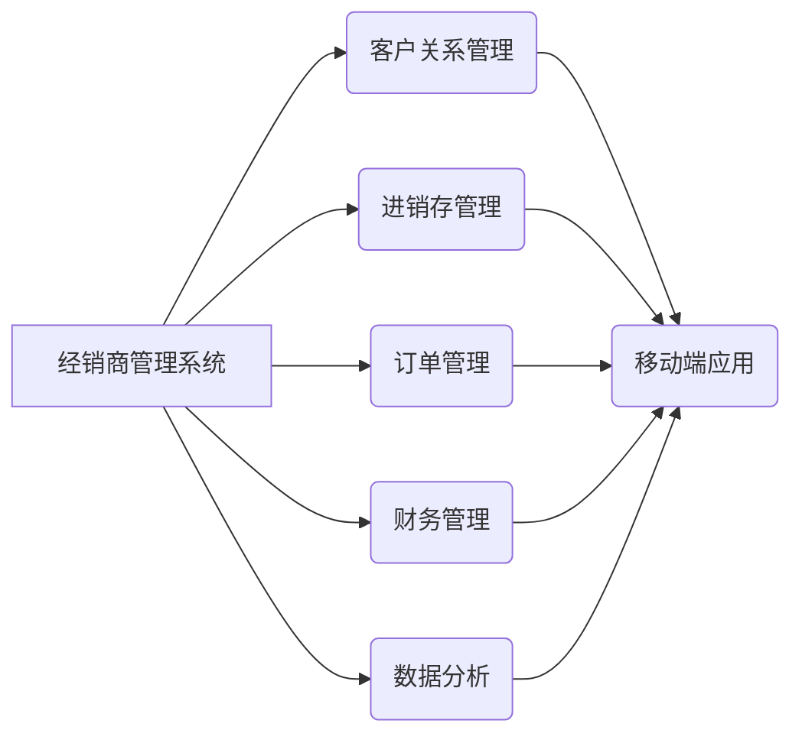

# 经销商管理系统架构设计方案

作者：禅与计算机程序设计艺术 / Zen and the Art of Computer Programming

## 1. 背景介绍
### 1.1 问题的由来

随着市场竞争的加剧和企业规模的扩大，经销商管理逐渐成为企业运营中的重要环节。经销商管理系统的目标是提升经销商的运营效率，降低管理成本，从而提高整个企业的盈利能力。然而，传统的经销商管理系统往往存在功能单一、扩展性差、用户体验不佳等问题，难以满足现代企业对经销商管理的需求。

### 1.2 研究现状

目前，市场上存在多种经销商管理系统，大致可以分为以下几类：

- **CRM系统**：主要侧重于客户关系管理，对经销商的管理功能相对较弱。
- **进销存系统**：主要关注商品的进销存管理，缺乏对经销商的深入管理。
- **经销商管理系统**：专门针对经销商的管理需求，但功能相对单一，扩展性较差。

### 1.3 研究意义

设计一套高效、可靠、易用的经销商管理系统，对于提升企业竞争力具有重要意义：

- **提高运营效率**：通过系统化、自动化管理，提高经销商的运营效率，降低管理成本。
- **提升客户满意度**：优化经销商管理流程，提升客户满意度，增强客户粘性。
- **增强决策支持**：提供全面、准确的数据分析，为企业决策提供有力支持。
- **降低运营风险**：通过实时监控和预警，降低运营风险，保障企业利益。

### 1.4 本文结构

本文将详细阐述经销商管理系统的架构设计方案，包括系统架构、技术选型、功能模块、实施步骤等方面。内容安排如下：

- 第2部分，介绍经销商管理系统的核心概念和关键技术。
- 第3部分，详细阐述系统架构设计方案，包括系统架构图和关键技术选型。
- 第4部分，介绍系统功能模块设计和实现。
- 第5部分，介绍系统实施步骤和保障措施。
- 第6部分，探讨经销商管理系统的应用场景和发展趋势。
- 第7部分，总结全文，展望经销商管理系统的发展前景。

## 2. 核心概念与联系

### 2.1 经销商管理系统

经销商管理系统是指一套集成了客户关系管理、进销存管理、订单管理、财务管理、数据分析等功能，用于对经销商进行全面、高效管理的软件系统。

### 2.2 核心技术

- **云计算**：利用云计算技术实现系统的弹性扩展和按需服务。
- **大数据**：通过大数据分析技术，挖掘数据价值，为决策提供支持。
- **移动端应用**：提供移动端应用，方便经销商随时随地查询和管理信息。
- **人工智能**：利用人工智能技术，实现智能推荐、智能客服等功能。

### 2.3 关系图



## 3. 核心算法原理 & 具体操作步骤
### 3.1 算法原理概述

经销商管理系统涉及多种算法，主要包括：

- **数据加密算法**：保障数据安全。
- **数据压缩算法**：提高数据传输效率。
- **机器学习算法**：实现智能推荐、智能客服等功能。

### 3.2 算法步骤详解

- **数据加密算法**：选择合适的加密算法（如AES、RSA等），对敏感数据进行加密存储和传输。
- **数据压缩算法**：选择合适的数据压缩算法（如Huffman编码、LZ77编码等），提高数据传输效率。
- **机器学习算法**：选择合适的机器学习算法（如决策树、支持向量机等），实现智能推荐、智能客服等功能。

### 3.3 算法优缺点

- **数据加密算法**：优点是保障数据安全，缺点是加密和解密过程较慢。
- **数据压缩算法**：优点是提高数据传输效率，缺点是压缩和解压过程较慢。
- **机器学习算法**：优点是实现智能推荐、智能客服等功能，缺点是模型训练和推理过程较慢。

### 3.4 算法应用领域

- **数据加密算法**：广泛应用于金融、医疗、政府等领域。
- **数据压缩算法**：广泛应用于通信、存储等领域。
- **机器学习算法**：广泛应用于推荐系统、智能客服等领域。

## 4. 数学模型和公式 & 详细讲解 & 举例说明
### 4.1 数学模型构建

经销商管理系统涉及多种数学模型，主要包括：

- **线性回归模型**：用于预测销售量、库存量等数据。
- **决策树模型**：用于分类、预测等任务。
- **支持向量机模型**：用于分类、回归等任务。

### 4.2 公式推导过程

- **线性回归模型**：

  $$
y = \beta_0 + \beta_1 x_1 + \beta_2 x_2 + \cdots + \beta_n x_n + \epsilon
$$

- **决策树模型**：

  $$
f(x) = g(x) = \prod_{i=1}^n \alpha_i g(x_i)
$$

- **支持向量机模型**：

  $$
f(x) = \text{sign}(\sum_{i=1}^n \alpha_i y_i \phi(x_i) \cdot x + b)
$$

### 4.3 案例分析与讲解

以线性回归模型为例，假设我们想要预测某商品的销售量，我们可以收集历史销售数据，构建如下线性回归模型：

$$
y = \beta_0 + \beta_1 x_1 + \beta_2 x_2 + \epsilon
$$

其中，$y$ 表示销售量，$x_1$ 表示广告投放量，$x_2$ 表示促销活动天数，$\epsilon$ 表示随机误差。

### 4.4 常见问题解答

**Q1：如何选择合适的模型？**

A：选择合适的模型需要根据具体任务和数据特点进行评估。一般而言，可以使用交叉验证等方法，比较不同模型的性能，选择性能最佳的模型。

**Q2：如何优化模型参数？**

A：可以通过网格搜索、贝叶斯优化等方法优化模型参数。

**Q3：如何评估模型性能？**

A：可以使用准确率、召回率、F1值等指标评估模型性能。

## 5. 项目实践：代码实例和详细解释说明
### 5.1 开发环境搭建

以下是使用Python进行经销商管理系统开发的开发环境搭建步骤：

1. 安装Anaconda：从官网下载并安装Anaconda，用于创建独立的Python环境。
2. 创建并激活虚拟环境：
```bash
conda create -n business-system-env python=3.8
conda activate business-system-env
```
3. 安装相关库：
```bash
conda install pandas numpy scikit-learn matplotlib
```
4. 安装Flask框架：
```bash
pip install flask
```

### 5.2 源代码详细实现

以下是使用Python和Flask框架开发的经销商管理系统简单示例：

```python
from flask import Flask, request, jsonify
import pandas as pd

app = Flask(__name__)

# 假设数据存储在CSV文件中
data = pd.read_csv('data.csv')

@app.route('/sales', methods=['GET'])
def get_sales():
    # 获取查询参数
    product_id = request.args.get('product_id', '')
    start_date = request.args.get('start_date', '')
    end_date = request.args.get('end_date', '')

    # 查询数据
    df = data[(data['product_id'] == product_id) & (data['date'] >= start_date) & (data['date'] <= end_date)]

    # 返回结果
    return jsonify(df.to_dict(orient='records'))

if __name__ == '__main__':
    app.run(debug=True)
```

### 5.3 代码解读与分析

以上代码示例使用Flask框架搭建了一个简单的经销商管理系统。该系统可以查询特定产品在一定时间范围内的销售数据。

- 第一行代码导入必要的库。
- 第二行代码创建Flask应用实例。
- 第三行代码读取CSV文件中的数据。
- 第四行代码定义`/sales`接口，用于查询销售数据。
- 第五行代码返回查询结果。
- 第六行代码启动Flask应用。

### 5.4 运行结果展示

运行以上代码，访问`http://localhost:5000/sales?product_id=1&start_date=2022-01-01&end_date=2022-12-31`，即可查询产品ID为1，时间范围为2022年1月1日至2022年12月31日的销售数据。

## 6. 实际应用场景
### 6.1 销售数据分析

通过经销商管理系统，企业可以实时了解各个经销商的销售情况，分析销售趋势，预测未来销售量，为制定销售策略提供数据支持。

### 6.2 库存管理

经销商管理系统可以帮助企业实时掌握各个经销商的库存情况，避免库存积压或缺货，降低库存成本。

### 6.3 客户关系管理

经销商管理系统可以帮助企业建立和维护与经销商的良好关系，提高客户满意度。

### 6.4 财务管理

经销商管理系统可以帮助企业进行财务核算，提高财务管理的效率。

### 6.5 数据分析

经销商管理系统可以收集和分析大量数据，为企业决策提供有力支持。

## 7. 工具和资源推荐
### 7.1 学习资源推荐

- 《Python编程：从入门到实践》
- 《Flask Web开发：轻量级Python Web开发框架》
- 《Scikit-learn机器学习》

### 7.2 开发工具推荐

- Anaconda
- PyCharm
- Flask
- Pandas
- Matplotlib

### 7.3 相关论文推荐

- 《云计算与大数据》
- 《机器学习》

### 7.4 其他资源推荐

- https://www.oschina.net/
- https://www.csdn.net/

## 8. 总结：未来发展趋势与挑战
### 8.1 研究成果总结

本文针对经销商管理系统的需求，设计了一套基于云计算、大数据、移动端应用和人工智能的架构方案。该方案具有以下特点：

- **功能完善**：集成了客户关系管理、进销存管理、订单管理、财务管理、数据分析等功能。
- **技术先进**：采用了云计算、大数据、移动端应用和人工智能等先进技术。
- **易用性强**：界面友好，操作简单，易于学习和使用。

### 8.2 未来发展趋势

- **智能化**：利用人工智能技术，实现智能推荐、智能客服等功能。
- **移动化**：提供移动端应用，方便经销商随时随地查询和管理信息。
- **云化**：利用云计算技术，实现系统的弹性扩展和按需服务。

### 8.3 面临的挑战

- **数据安全**：如何保障数据安全，防止数据泄露。
- **系统性能**：如何保证系统高性能，满足大量并发访问。
- **用户体验**：如何提升用户体验，提高系统易用性。

### 8.4 研究展望

未来，经销商管理系统将朝着以下方向发展：

- **更加智能化**：利用人工智能技术，实现更加智能的推荐、客服等功能。
- **更加移动化**：提供更加便捷的移动端应用，满足经销商随时随地管理业务的需求。
- **更加生态化**：与更多企业应用和平台集成，构建一个更加完善的生态系统。

## 9. 附录：常见问题与解答

**Q1：如何保障数据安全？**

A：可以采用以下措施保障数据安全：

- 使用数据加密算法对敏感数据进行加密存储和传输。
- 建立数据备份机制，定期备份重要数据。
- 对用户进行权限管理，限制用户访问权限。
- 采用安全审计机制，对数据访问和操作进行审计。

**Q2：如何保证系统高性能？**

A：可以采用以下措施保证系统高性能：

- 使用高性能服务器和存储设备。
- 对系统进行性能优化，提高系统响应速度。
- 使用缓存技术，减少数据库访问次数。
- 采用负载均衡技术，分散系统访问压力。

**Q3：如何提升用户体验？**

A：可以采用以下措施提升用户体验：

- 设计简洁、易用的用户界面。
- 提供详细的操作指南和帮助文档。
- 定期收集用户反馈，不断改进系统功能。
- 定期更新系统，修复漏洞，提升系统安全性。

作者：禅与计算机程序设计艺术 / Zen and the Art of Computer Programming