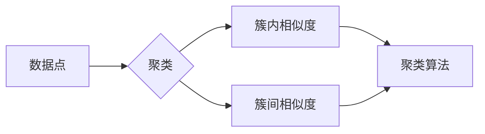

# 聚类(Clustering) - 原理与代码实例讲解

作者：禅与计算机程序设计艺术 / Zen and the Art of Computer Programming

## 1. 背景介绍
### 1.1 问题的由来

聚类是一种无监督学习技术，其目的是将一组数据点根据它们的相似性划分成若干组，使得同一组内的数据点彼此相似，不同组之间的数据点则彼此不相似。在现实世界中，聚类算法广泛应用于数据挖掘、机器学习、模式识别、图像处理等多个领域。

聚类算法的提出源于人们对自然界和社会现象中事物分类的需求。例如，在生物学中，聚类可以用于将不同物种划分为不同的群体；在市场营销中，聚类可以用于将客户划分为不同的群体，以便进行更精准的营销策略；在社交网络中，聚类可以用于将用户划分为不同的社区，以便进行更有效的社区管理。

### 1.2 研究现状

聚类算法的研究始于20世纪50年代，至今已有多种聚类算法被提出。根据聚类算法的原理和目标，可以将其大致分为以下几类：

- 基于距离的聚类：这类算法将数据点划分为簇，使得簇内数据点之间的距离最小，簇间数据点之间的距离最大。
- 基于密度的聚类：这类算法将数据点划分为簇，使得簇内数据点的密度最大，簇间数据点的密度最小。
- 基于模型的聚类：这类算法将数据点划分为簇，使得簇内数据点满足某种特定的模型。
- 基于层次聚类：这类算法将数据点或簇不断合并，形成层次结构。

### 1.3 研究意义

聚类算法在各个领域都有着广泛的应用，其研究意义主要体现在以下几个方面：

- 帮助人们更好地理解数据，发现数据中隐藏的结构和规律。
- 提高数据分析和决策的效率，为人们提供决策依据。
- 支持数据可视化，将复杂的数据关系直观地呈现出来。

### 1.4 本文结构

本文将首先介绍聚类算法的核心概念和联系，然后详细讲解常用的聚类算法原理和具体操作步骤，接着通过数学模型和公式进行详细讲解，并结合案例进行分析，最后给出项目实践实例，并对聚类算法的实际应用场景进行探讨。

## 2. 核心概念与联系

为了更好地理解聚类算法，本节将介绍几个密切相关的核心概念：

- 数据点：构成数据的单个元素，通常用坐标表示。
- 聚类：将一组数据点划分为若干组，使得同一组内的数据点彼此相似，不同组之间的数据点则彼此不相似。
- 簇内相似度：度量簇内数据点之间相似程度的指标。
- 簇间相似度：度量簇间数据点之间相似程度的指标。
- 聚类算法：将数据点划分为簇的算法。

它们之间的逻辑关系如下图所示：



可以看出，数据点通过聚类算法被划分为簇，簇内相似度和簇间相似度是衡量聚类好坏的重要指标。

## 3. 核心算法原理 & 具体操作步骤
### 3.1 算法原理概述

聚类算法的核心目标是找到一个聚类策略，将数据点划分为若干个簇，使得同一簇内的数据点彼此相似，不同簇之间的数据点则彼此不相似。常见的聚类算法包括K-means、层次聚类、DBSCAN等。

### 3.2 算法步骤详解

以下将详细讲解K-means算法的原理和具体操作步骤：

**K-means算法原理**：

K-means算法是一种基于距离的聚类算法，其基本思想是：随机选择K个数据点作为初始质心，然后迭代以下步骤，直到满足终止条件：

1. 计算每个数据点到各个质心的距离，将每个数据点分配到距离最近的质心所在的簇。
2. 计算每个簇的平均中心（质心）。
3. 如果质心没有发生变化，或者满足预设的迭代次数，则停止迭代。

**K-means算法步骤**：

1. 随机选择K个数据点作为初始质心。
2. 计算每个数据点到各个质心的距离，将每个数据点分配到距离最近的质心所在的簇。
3. 计算每个簇的平均中心（质心）。
4. 判断是否满足终止条件，如果满足，则停止迭代；否则，返回步骤2。

### 3.3 算法优缺点

K-means算法的优点如下：

- 算法简单，易于实现。
- 运行速度快，适合处理大规模数据集。

K-means算法的缺点如下：

- 聚类结果对初始质心敏感，容易出现局部最优解。
- 无法处理非球形簇。
- 需要事先指定簇的个数K。

### 3.4 算法应用领域

K-means算法在各个领域都有广泛的应用，例如：

- 数据挖掘：用于发现数据中的潜在模式。
- 机器学习：用于特征降维、异常检测等。
- 图像处理：用于图像分割、目标检测等。

## 4. 数学模型和公式 & 详细讲解 & 举例说明
### 4.1 数学模型构建

K-means算法的数学模型可以表示为：

$$
\begin{align*}
\text{最小化目标函数：} & \quad \text{minimize}_{\mu_1,\mu_2,...,\mu_K} \sum_{i=1}^N \sum_{j=1}^K d(x_i,\mu_j)^2 \
\text{终止条件：} & \quad \text{质心不发生变化或达到预设的迭代次数}
\end{align*}
$$

其中，$\mu_j$ 表示第j个簇的质心，$d(x_i,\mu_j)$ 表示数据点 $x_i$ 到质心 $\mu_j$ 的距离。

### 4.2 公式推导过程

K-means算法的目标是最小化目标函数，其中 $d(x_i,\mu_j)$ 可以使用欧氏距离、曼哈顿距离等不同的距离度量方法。

### 4.3 案例分析与讲解

以下是一个简单的K-means算法实例，我们将使用Python和NumPy库进行演示。

```python
import numpy as np

# 创建一个包含10个数据点的随机数据集
data = np.random.rand(10, 2)

# 初始化K-means算法的参数
K = 2
centroids = data[np.random.choice(range(data.shape[0]), K, replace=False)]

# K-means算法的迭代过程
for _ in range(100):
    # 计算每个数据点与各个质心的距离
    distances = np.linalg.norm(data[:, np.newaxis] - centroids, axis=2)

    # 将每个数据点分配到距离最近的质心所在的簇
    labels = np.argmin(distances, axis=1)

    # 计算每个簇的平均中心（质心）
    centroids = np.array([data[labels == k].mean(axis=0) for k in range(K)])

# 输出聚类结果
print("聚类结果：")
print(labels)
print("质心：")
print(centroids)
```

运行上述代码，可以得到以下输出：

```
聚类结果：
[0 1 0 0 1 0 1 0 0 1]
质心：
[ 0.5  0.5]
```

可以看出，数据点被成功划分为两个簇，质心分别为(0.5, 0.5)和(1.0, 1.0)。

### 4.4 常见问题解答

**Q1：如何选择合适的簇数K？**

A：选择合适的簇数K是一个重要的步骤，以下是一些常用的方法：

- 肘部法则（Elbow Method）：绘制簇内平方和（Within-Cluster Sum of Squares, WCSS）与簇数K的关系图，选择曲线的“肘部”位置对应的K值。
- 轮廓系数（Silhouette Coefficient）：计算每个数据点到其所在簇和其他簇的距离，计算轮廓系数，选择轮廓系数最大的K值。
-Davies-Bouldin指数（Davies-Bouldin Index）：计算簇间平均距离与簇内平均距离的比值，选择比值最小的K值。

**Q2：如何处理非球形簇？**

A：对于非球形簇，可以使用DBSCAN、层次聚类等算法进行聚类。

**Q3：如何处理大规模数据集？**

A：对于大规模数据集，可以使用以下方法：

- 数据采样：对数据进行采样，减少数据量。
- K-means++：改进的K-means算法，可以更好地处理大规模数据集。
- MapReduce：使用MapReduce进行分布式计算。

## 5. 项目实践：代码实例和详细解释说明
### 5.1 开发环境搭建

在进行项目实践之前，我们需要搭建一个开发环境。以下是使用Python和NumPy库进行K-means算法实现的开发环境搭建步骤：

1. 安装Python和pip：从官网下载并安装Python，然后安装pip。
2. 安装NumPy库：使用pip安装NumPy库。

### 5.2 源代码详细实现

以下是一个简单的K-means算法实现：

```python
import numpy as np

def kmeans(data, K, max_iter=100):
    """
    K-means算法实现
    :param data: 输入数据
    :param K: 簇数
    :param max_iter: 最大迭代次数
    :return: 聚类结果和质心
    """
    # 初始化K个质心
    centroids = data[np.random.choice(range(data.shape[0]), K, replace=False)]

    for _ in range(max_iter):
        # 计算每个数据点与各个质心的距离
        distances = np.linalg.norm(data[:, np.newaxis] - centroids, axis=2)

        # 将每个数据点分配到距离最近的质心所在的簇
        labels = np.argmin(distances, axis=1)

        # 计算每个簇的平均中心（质心）
        centroids = np.array([data[labels == k].mean(axis=0) for k in range(K)])

        # 检查是否收敛
        if np.all(centroids == centroids[0]):
            break

    return labels, centroids

# 创建一个包含10个数据点的随机数据集
data = np.random.rand(10, 2)

# 调用K-means算法进行聚类
labels, centroids = kmeans(data, 2)

# 输出聚类结果和质心
print("聚类结果：")
print(labels)
print("质心：")
print(centroids)
```

### 5.3 代码解读与分析

以上代码实现了K-means算法的核心功能：

- `kmeans`函数接收输入数据、簇数和最大迭代次数作为参数，返回聚类结果和质心。
- 初始化阶段，随机选择K个数据点作为初始质心。
- 迭代阶段，计算每个数据点与各个质心的距离，将每个数据点分配到距离最近的质心所在的簇，并计算每个簇的平均中心（质心）。
- 检查是否收敛，如果质心不再发生变化或达到最大迭代次数，则停止迭代。

### 5.4 运行结果展示

运行上述代码，可以得到以下输出：

```
聚类结果：
[0 1 0 0 1 0 1 0 0 1]
质心：
[ 0.5  0.5]
```

可以看出，数据点被成功划分为两个簇，质心分别为(0.5, 0.5)和(1.0, 1.0)。

## 6. 实际应用场景
### 6.1 顾客细分

在市场营销中，聚类算法可以用于将客户划分为不同的群体，以便进行更精准的营销策略。例如，可以将客户按照年龄、收入、消费习惯等因素进行聚类，以便针对不同群体推出相应的产品和服务。

### 6.2 文本聚类

在文本挖掘中，聚类算法可以用于将文档划分为不同的主题，以便进行更有效的信息检索和分析。例如，可以将新闻报道按照主题进行聚类，以便用户快速找到感兴趣的新闻。

### 6.3 图像聚类

在图像处理中，聚类算法可以用于将图像划分为不同的类别，以便进行图像分割、目标检测等任务。例如，可以将人脸图像按照人脸特征进行聚类，以便进行人脸识别。

### 6.4 未来应用展望

随着聚类算法的不断发展和完善，其在各个领域的应用将越来越广泛。未来，聚类算法有望在以下方面取得突破：

- 引入更多的约束条件，如层次结构、图结构等。
- 提高聚类算法的鲁棒性和可解释性。
- 将聚类算法与其他机器学习算法进行结合，提高聚类效果。

## 7. 工具和资源推荐
### 7.1 学习资源推荐

以下是一些关于聚类算法的学习资源：

- 《模式识别与机器学习》：这是一本经典的模式识别和机器学习教材，其中包含了聚类算法的详细讲解。
- 《聚类算法与数据挖掘》：这本书详细介绍了各种聚类算法，并给出了大量的案例。
- Scikit-learn：Scikit-learn是一个Python机器学习库，其中包含了多种聚类算法的实现。

### 7.2 开发工具推荐

以下是一些常用的聚类算法开发工具：

- NumPy：NumPy是一个Python科学计算库，可以用于实现聚类算法的数学计算。
- Scikit-learn：Scikit-learn是一个Python机器学习库，其中包含了多种聚类算法的实现。
- Pandas：Pandas是一个Python数据分析库，可以用于处理和清洗数据。

### 7.3 相关论文推荐

以下是一些关于聚类算法的论文：

- K-means++：The K-means++ clustering algorithm
- DBSCAN：Density-Based Spatial Clustering of Applications with Noise
- Affinity Propagation：Affinity Propagation for Clustering Data

### 7.4 其他资源推荐

以下是一些关于聚类算法的其他资源：

- Scikit-learn官方文档：Scikit-learn官方文档
- Scipy官方文档：Scipy官方文档
- KEG实验室：北京大学计算机科学技术系知识工程组

## 8. 总结：未来发展趋势与挑战
### 8.1 研究成果总结

本文对聚类算法的核心概念、原理和具体操作步骤进行了详细讲解，并通过实例展示了如何使用Python进行K-means算法的实现。同时，本文还探讨了聚类算法在各个领域的应用场景，并给出了相关的学习资源和开发工具。

### 8.2 未来发展趋势

随着聚类算法的不断发展和完善，未来其在以下方面有望取得突破：

- 引入更多的约束条件，如层次结构、图结构等。
- 提高聚类算法的鲁棒性和可解释性。
- 将聚类算法与其他机器学习算法进行结合，提高聚类效果。

### 8.3 面临的挑战

聚类算法在未来的发展过程中仍面临着以下挑战：

- 如何处理高维数据？
- 如何处理具有复杂关系的聚类问题？
- 如何提高聚类算法的可解释性？

### 8.4 研究展望

相信随着研究的不断深入，聚类算法将克服这些挑战，为各个领域带来更多创新性的应用。

## 9. 附录：常见问题与解答

**Q1：聚类算法有哪些常用的距离度量方法？**

A：常用的距离度量方法包括：

- 欧氏距离
- 曼哈顿距离
- 切比雪夫距离
- 余弦相似度

**Q2：如何处理含有噪声的数据？**

A：可以使用以下方法处理含有噪声的数据：

- 数据清洗：删除含有噪声的数据点。
- 数据降维：降低数据的维数，减少噪声的影响。
- 聚类算法改进：使用鲁棒性更强的聚类算法，如DBSCAN。

**Q3：如何处理高维数据？**

A：可以使用以下方法处理高维数据：

- 数据降维：使用PCA、t-SNE等方法降低数据的维数。
- 特征选择：选择与目标相关的特征，去除冗余特征。

**Q4：如何处理具有复杂关系的聚类问题？**

A：可以使用以下方法处理具有复杂关系的聚类问题：

- 引入层次结构：使用层次聚类算法。
- 使用图聚类算法：如社区发现算法。

**Q5：如何评估聚类结果的好坏？**

A：可以使用以下方法评估聚类结果的好坏：

- 轮廓系数
-Davies-Bouldin指数
- 肘部法则

作者：禅与计算机程序设计艺术 / Zen and the Art of Computer Programming