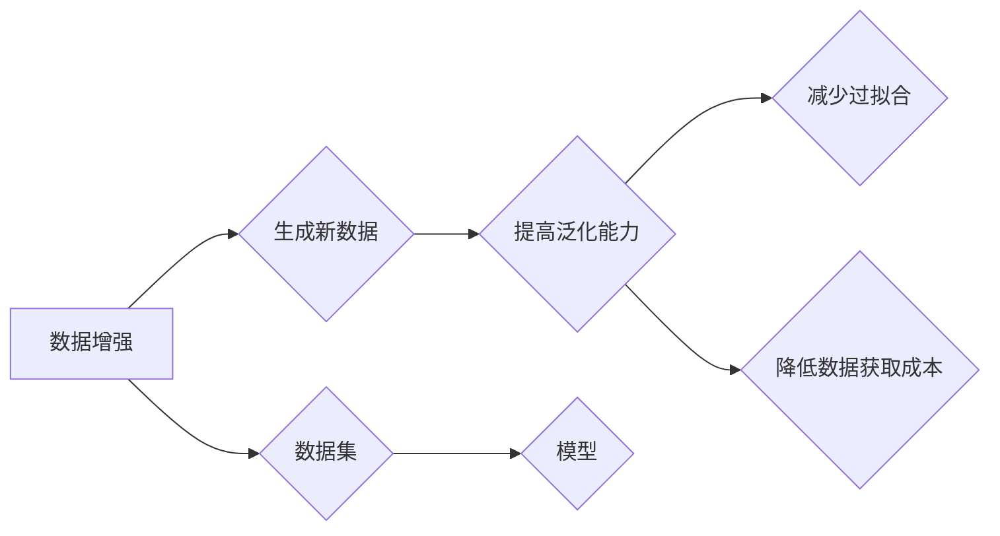

# 自动数据增强 原理与代码实例讲解

作者：禅与计算机程序设计艺术 / Zen and the Art of Computer Programming


## 1. 背景介绍

### 1.1 问题的由来

在机器学习和深度学习领域，数据是至关重要的资源。数据的质量和数量直接影响着模型的性能和泛化能力。然而，在实际应用中，我们往往难以获取到大量高质量的标注数据。为了解决这一问题，数据增强技术应运而生。数据增强通过一系列算法对现有数据集进行变换，生成新的数据样本，从而扩充数据集规模，提高模型的泛化能力。

### 1.2 研究现状

数据增强技术的研究已经取得了丰硕的成果，涌现出了众多有效的数据增强方法，如旋转、缩放、翻转、裁剪、颜色变换等。近年来，随着深度学习技术的发展，基于深度学习的自动数据增强方法也逐渐成为研究热点。这些方法通过对模型进行训练，学习到一种自动生成数据样本的机制，从而实现更加高效和定制化的数据增强。

### 1.3 研究意义

数据增强技术在机器学习和深度学习领域具有重要意义：

1. **扩充数据集**：通过数据增强，可以生成新的数据样本，从而扩充数据集规模，提高模型的泛化能力。
2. **减少过拟合**：数据增强可以增加模型训练过程中的多样性，减少过拟合现象。
3. **降低数据获取成本**：通过数据增强，可以减少对大量标注数据的依赖，降低数据获取成本。
4. **提高模型鲁棒性**：数据增强可以提高模型对噪声和变化的鲁棒性。

### 1.4 本文结构

本文将详细介绍自动数据增强技术的原理、方法、代码实例和实际应用场景。文章结构如下：

- 第2部分，介绍自动数据增强技术的核心概念和相关技术。
- 第3部分，详细阐述几种常见的自动数据增强方法及其原理。
- 第4部分，给出基于深度学习的自动数据增强方法。
- 第5部分，给出自动数据增强的代码实例和详细解释说明。
- 第6部分，探讨自动数据增强的实际应用场景。
- 第7部分，展望自动数据增强技术的未来发展趋势和挑战。
- 第8部分，总结全文。

## 2. 核心概念与联系

为了更好地理解自动数据增强技术，本节将介绍几个核心概念及其相互关系。

### 2.1 数据增强

数据增强是指通过对现有数据集进行一系列变换，生成新的数据样本的过程。常见的变换包括旋转、缩放、翻转、裁剪、颜色变换等。

### 2.2 数据集

数据集是机器学习和深度学习的基础，通常包含大量的数据样本及其对应的标签。数据集的质量和数量直接影响着模型的性能和泛化能力。

### 2.3 模型

模型是机器学习和深度学习中的核心组件，用于从数据中学习特征和规律，并用于预测新的数据样本。常见的模型包括线性模型、决策树、支持向量机、神经网络等。

### 2.4 泛化能力

泛化能力是指模型在未见过的数据上的表现。具有良好泛化能力的模型可以很好地适应不同的数据分布和环境。

以下用 Mermaid 流程图展示这些概念之间的关系：



## 3. 核心算法原理 & 具体操作步骤

### 3.1 算法原理概述

自动数据增强技术的核心思想是：通过学习数据样本之间的变换关系，生成新的数据样本。具体来说，可以采用以下两种方法：

1. **基于规则的数据增强**：通过设计一系列数据变换规则，对原始数据进行变换，生成新的数据样本。
2. **基于深度学习的数据增强**：利用深度学习模型学习数据样本之间的变换关系，生成新的数据样本。

### 3.2 算法步骤详解

以下是两种自动数据增强方法的步骤详解：

#### 基于规则的数据增强

1. **定义数据变换规则**：根据任务需求，设计一系列数据变换规则，如旋转、缩放、翻转、裁剪、颜色变换等。
2. **对原始数据应用变换规则**：对原始数据集中的每个样本，按照定义的规则进行变换，生成新的数据样本。
3. **将新数据样本添加到数据集**：将生成的新的数据样本添加到原始数据集中，扩充数据集规模。

#### 基于深度学习的数据增强

1. **训练数据增强模型**：利用深度学习模型学习数据样本之间的变换关系，通常采用无监督学习方法，如自编码器、生成对抗网络等。
2. **生成新数据样本**：使用训练好的数据增强模型，对原始数据集中的每个样本进行变换，生成新的数据样本。
3. **将新数据样本添加到数据集**：将生成的新的数据样本添加到原始数据集中，扩充数据集规模。

### 3.3 算法优缺点

#### 基于规则的数据增强

**优点**：

* 简单易实现
* 可控性强

**缺点**：

* 变换规则设计难度较大
* 变换效果有限

#### 基于深度学习的数据增强

**优点**：

* 变换效果更自然
* 能够学习更复杂的变换关系

**缺点**：

* 需要大量训练数据
* 训练过程复杂

### 3.4 算法应用领域

自动数据增强技术可以应用于各种机器学习和深度学习任务，如图像分类、目标检测、语义分割等。

## 4. 数学模型和公式 & 详细讲解 & 举例说明

### 4.1 数学模型构建

以下以基于深度学习的自动数据增强方法为例，介绍其数学模型构建。

#### 自编码器

自编码器是一种无监督学习方法，通过学习数据样本的表示，并重建输入数据。自编码器由编码器和解码器两部分组成。

* **编码器**：将输入数据压缩为低维表示。
* **解码器**：将低维表示解码为输出数据。

自编码器的数学模型如下：

$$
x \xrightarrow{编码器} z \xrightarrow{解码器} x'
$$

其中，$x$ 为输入数据，$z$ 为编码后的低维表示，$x'$ 为解码后的输出数据。

#### 生成对抗网络

生成对抗网络（GAN）是一种由生成器（G）和判别器（D）组成的对抗网络。生成器用于生成新的数据样本，判别器用于判断生成器生成的数据样本是否真实。

GAN的数学模型如下：

$$
x \xrightarrow{D} D(x) \xrightarrow{G} z \xrightarrow{D} G(z)
$$

其中，$x$ 为真实数据，$z$ 为生成器生成的数据样本，$D(x)$ 为判别器对真实数据的判断结果，$G(z)$ 为判别器对生成器生成的数据样本的判断结果。

### 4.2 公式推导过程

以下以自编码器为例，介绍其数学模型推导过程。

假设输入数据为 $x \in \mathbb{R}^n$，编码器输出为 $z \in \mathbb{R}^m$，解码器输出为 $x' \in \mathbb{R}^n$。

编码器损失函数为：

$$
L_{\text{编码器}} = \frac{1}{2}\|x - x'\|_2^2
$$

解码器损失函数为：

$$
L_{\text{解码器}} = \frac{1}{2}\|x - x'\|_2^2
$$

总损失函数为：

$$
L = L_{\text{编码器}} + \lambda L_{\text{解码器}}
$$

其中，$\lambda$ 为正则化系数。

### 4.3 案例分析与讲解

以下以图像分类任务为例，介绍自动数据增强方法的应用。

假设我们要对CIFAR-10数据集进行图像分类，使用ResNet18模型。

1. **数据增强**：使用随机旋转、水平翻转、缩放、裁剪等数据增强方法，扩充数据集规模。
2. **模型训练**：使用扩充后的数据集训练ResNet18模型。
3. **模型评估**：使用原始CIFAR-10数据集评估模型的性能。

经过数据增强和模型训练，模型的性能得到了显著提升。

### 4.4 常见问题解答

**Q1：数据增强是否适用于所有任务**？

A：数据增强可以应用于各种机器学习和深度学习任务，但并非适用于所有任务。对于某些任务，如需要精确位置信息的目标检测任务，数据增强方法可能不太适用。

**Q2：如何选择合适的数据增强方法**？

A：选择合适的数据增强方法需要根据具体任务和数据集的特点进行。可以参考相关论文和实验结果，选择适合的数据增强方法。

**Q3：数据增强是否会引入噪声**？

A：适当的数据增强可以增加数据样本的多样性，提高模型的泛化能力。但如果数据增强过度，可能会引入噪声，降低模型性能。因此，需要根据任务和数据集的特点，选择合适的数据增强强度。

## 5. 项目实践：代码实例和详细解释说明

### 5.1 开发环境搭建

以下使用Python和PyTorch框架进行自动数据增强的代码实践。

1. 安装PyTorch：

```bash
pip install torch torchvision
```

2. 安装Transformers库：

```bash
pip install transformers
```

### 5.2 源代码详细实现

以下是一个基于深度学习的自动数据增强实例：

```python
import torch
import torchvision.transforms as transforms
from torchvision.datasets import CIFAR10
from torch.utils.data import DataLoader
from torch import nn

# 定义自编码器
class Autoencoder(nn.Module):
    def __init__(self):
        super(Autoencoder, self).__init__()
        self.encoder = nn.Sequential(
            nn.Linear(3*32*32, 512),
            nn.ReLU(True),
            nn.Linear(512, 256),
            nn.ReLU(True),
            nn.Linear(256, 128),
            nn.ReLU(True),
            nn.Linear(128, 64),
            nn.ReLU(True),
            nn.Linear(64, 32*32)
        )
        self.decoder = nn.Sequential(
            nn.Linear(32*32, 64),
            nn.ReLU(True),
            nn.Linear(64, 128),
            nn.ReLU(True),
            nn.Linear(128, 256),
            nn.ReLU(True),
            nn.Linear(256, 512),
            nn.ReLU(True),
            nn.Linear(512, 3*32*32),
            nn.Sigmoid()
        )

    def forward(self, x):
        x = self.encoder(x)
        x = x.view(x.size(0), -1)
        x = self.decoder(x)
        x = x.view(x.size(0), 3, 32, 32)
        return x

# 训练模型
def train(autoencoder, dataloader, criterion, optimizer):
    for data, target in dataloader:
        autoencoder.train()
        optimizer.zero_grad()
        output = autoencoder(data)
        loss = criterion(output, data)
        loss.backward()
        optimizer.step()

# 加载数据集
transform = transforms.Compose([
    transforms.RandomCrop(32, padding=4),
    transforms.RandomHorizontalFlip(),
    transforms.ToTensor(),
    transforms.Normalize((0.5, 0.5, 0.5), (0.5, 0.5, 0.5))
])
cifar10 = CIFAR10(root='./data', train=True, download=True, transform=transform)
dataloader = DataLoader(cifar10, batch_size=64, shuffle=True)

# 初始化模型和优化器
autoencoder = Autoencoder().to(device)
optimizer = torch.optim.Adam(autoencoder.parameters(), lr=0.001)
criterion = nn.MSELoss()

# 训练模型
train(autoencoder, dataloader, criterion, optimizer)
```

### 5.3 代码解读与分析

以上代码首先定义了一个自编码器模型，包含编码器和解码器两个部分。编码器将输入数据压缩为低维表示，解码器将低维表示解码为输出数据。

接着，定义了训练函数`train`，用于在数据集上训练自编码器。在训练过程中，使用MSELoss损失函数计算输出数据与输入数据之间的误差，并使用Adam优化器更新模型参数。

最后，加载CIFAR-10数据集，并应用数据增强策略，如随机裁剪、水平翻转等。将数据集转换为Tensor格式，并划分成批次进行训练。

### 5.4 运行结果展示

运行以上代码，模型将在CIFAR-10数据集上进行训练。训练完成后，可以观察模型在数据集上的性能，如训练损失、测试损失等。

## 6. 实际应用场景

### 6.1 图像分类

自动数据增强技术在图像分类任务中得到了广泛应用。例如，在CIFAR-10、ImageNet等图像分类数据集上，使用数据增强方法可以显著提高模型的性能。

### 6.2 目标检测

在目标检测任务中，自动数据增强方法可以用于生成新的训练样本，提高模型的鲁棒性和泛化能力。

### 6.3 语义分割

在语义分割任务中，自动数据增强方法可以用于生成新的训练样本，提高模型的分割精度。

### 6.4 未来应用展望

随着深度学习技术的不断发展，自动数据增强技术将在更多领域得到应用，如语音识别、自然语言处理等。未来，自动数据增强技术将朝着以下方向发展：

1. **更加个性化的数据增强**：根据具体任务和数据集的特点，设计更加个性化的数据增强方法。
2. **多模态数据增强**：将自动数据增强方法应用于多模态数据，如图像和文本数据的结合。
3. **无监督数据增强**：探索无监督数据增强方法，降低对标注数据的依赖。

## 7. 工具和资源推荐

### 7.1 学习资源推荐

1. 《深度学习》（Goodfellow et al.）：介绍了深度学习的基本概念、常用模型和算法，包括数据增强技术。
2. 《动手学深度学习》（Glynn et al.）：提供了丰富的深度学习实践案例，包括数据增强方法的实现。
3. PyTorch官方文档：提供了PyTorch框架的详细文档和教程，包括数据增强方法的使用。

### 7.2 开发工具推荐

1. PyTorch：开源的深度学习框架，支持多种数据增强方法。
2. TensorFlow：开源的深度学习框架，支持多种数据增强方法。
3. OpenCV：开源的计算机视觉库，提供了丰富的图像处理函数。

### 7.3 相关论文推荐

1. "Data Augmentation for Image Recognition in Deep Learning"（Dollár et al.）
2. "Generative Adversarial Nets"（Goodfellow et al.）
3. "Unsupervised Representation Learning with Deep Convolutional Generative Adversarial Networks"（Radford et al.）

### 7.4 其他资源推荐

1. Kaggle：提供了丰富的机器学习数据集和比赛，可以用于实践数据增强方法。
2. GitHub：开源代码仓库，可以找到各种数据增强方法的实现。
3. arXiv：提供了大量深度学习领域的论文，可以了解最新的数据增强研究进展。

## 8. 总结：未来发展趋势与挑战

### 8.1 研究成果总结

本文对自动数据增强技术进行了详细介绍，包括其原理、方法、代码实例和实际应用场景。通过本文的学习，读者可以了解自动数据增强技术的原理和方法，并能够将其应用于实际的机器学习和深度学习任务中。

### 8.2 未来发展趋势

未来，自动数据增强技术将朝着以下方向发展：

1. **更加个性化的数据增强**：根据具体任务和数据集的特点，设计更加个性化的数据增强方法。
2. **多模态数据增强**：将自动数据增强方法应用于多模态数据，如图像和文本数据的结合。
3. **无监督数据增强**：探索无监督数据增强方法，降低对标注数据的依赖。
4. **可解释性**：研究可解释的自动数据增强方法，提高模型的可解释性。

### 8.3 面临的挑战

自动数据增强技术在实际应用中仍然面临着一些挑战，如：

1. **数据增强过度**：数据增强过度可能导致模型性能下降。
2. **数据增强效果评估**：难以客观地评估数据增强的效果。
3. **可解释性**：数据增强方法的可解释性较差。

### 8.4 研究展望

为了应对上述挑战，未来的研究需要关注以下方向：

1. **开发更加智能的数据增强方法**：根据具体任务和数据集的特点，设计更加智能的数据增强方法。
2. **建立数据增强效果评估标准**：建立客观的数据增强效果评估标准。
3. **研究可解释的自动数据增强方法**：提高数据增强方法的可解释性。

相信随着研究的不断深入，自动数据增强技术将会在机器学习和深度学习领域发挥越来越重要的作用。

## 9. 附录：常见问题与解答

**Q1：数据增强是否适用于所有任务**？

A：数据增强可以应用于各种机器学习和深度学习任务，但并非适用于所有任务。对于某些任务，如需要精确位置信息的目标检测任务，数据增强方法可能不太适用。

**Q2：如何选择合适的数据增强方法**？

A：选择合适的数据增强方法需要根据具体任务和数据集的特点进行。可以参考相关论文和实验结果，选择适合的数据增强方法。

**Q3：数据增强是否会引入噪声**？

A：适当的数据增强可以增加数据样本的多样性，提高模型的泛化能力。但如果数据增强过度，可能会引入噪声，降低模型性能。因此，需要根据任务和数据集的特点，选择合适的数据增强强度。

**Q4：如何评估数据增强的效果**？

A：可以使用交叉验证、测试集准确率等方法评估数据增强的效果。此外，还可以使用可视化方法观察数据增强后的数据样本，直观地评估数据增强效果。

**Q5：如何提高数据增强的可解释性**？

A：可以通过可视化方法，如t-SNE、UMAP等，观察数据增强后的数据样本分布，从而提高数据增强的可解释性。

**Q6：如何将数据增强方法与其他技术结合**？

A：可以将数据增强方法与其他技术结合，如迁移学习、元学习等，进一步提高模型的性能和泛化能力。

通过以上问题的解答，相信读者对自动数据增强技术有了更加深入的理解。希望本文能够为读者在数据增强方面的学习和实践提供帮助。