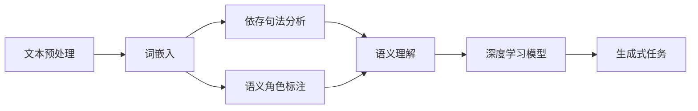

# 自然语言处理 原理与代码实例讲解

作者：禅与计算机程序设计艺术 / Zen and the Art of Computer Programming

## 1. 背景介绍
### 1.1 问题的由来

自然语言处理（Natural Language Processing，NLP）作为人工智能领域的重要分支，旨在研究计算机如何理解、解释和生成人类语言。随着深度学习技术的快速发展，NLP取得了令人瞩目的成果，并在信息检索、机器翻译、情感分析、文本摘要等众多领域得到广泛应用。然而，要深入理解和掌握NLP技术，需要深入了解其背后的原理和关键技术。

### 1.2 研究现状

近年来，NLP技术取得了长足的进步，主要体现在以下几个方面：

- 预训练语言模型：如BERT、GPT-3等，通过在大规模语料库上预训练，学习到丰富的语言知识，为下游任务提供强大的语义表示能力。
- 深度学习模型：如循环神经网络（RNN）、卷积神经网络（CNN）、Transformer等，在NLP任务中取得了显著的性能提升。
- 语义理解：通过词嵌入、依存句法分析、语义角色标注等技术，实现对于文本内容的深层理解。
- 生成式任务：如文本生成、机器翻译、对话系统等，通过深度学习模型实现文本的自动生成。

### 1.3 研究意义

NLP技术的发展具有以下重要意义：

- 提高信息检索效率：通过NLP技术，可以实现对海量文本数据的快速检索和分析，提高信息获取的效率。
- 促进跨语言交流：机器翻译技术的进步，使得跨语言交流变得更加便捷。
- 推动人机交互：通过NLP技术，可以实现人与机器的自然交互，提高人机交互的体验。
- 丰富应用场景：NLP技术可以应用于各种领域，如金融、医疗、教育等，为社会发展带来新的机遇。

### 1.4 本文结构

本文将系统介绍NLP的原理与代码实例，包括以下内容：

- 核心概念与联系
- 核心算法原理与具体操作步骤
- 数学模型和公式
- 项目实践：代码实例和详细解释说明
- 实际应用场景
- 工具和资源推荐
- 总结：未来发展趋势与挑战
- 附录：常见问题与解答

## 2. 核心概念与联系

为了更好地理解NLP技术，我们需要掌握以下核心概念：

- 文本预处理：包括分词、去除停用词、词性标注等，为后续模型训练做准备。
- 词嵌入：将单词映射为一个低维向量表示，用于捕捉词语的语义信息。
- 依存句法分析：分析句子中词语之间的关系，为语义理解提供基础。
- 语义角色标注：识别句子中词语的语义角色，帮助模型理解句子语义。
- 深度学习模型：如RNN、CNN、Transformer等，用于学习复杂的非线性关系。
- 生成式任务：如文本生成、机器翻译、对话系统等，通过深度学习模型实现文本的自动生成。

这些概念之间的关系如下所示：



## 3. 核心算法原理 & 具体操作步骤
### 3.1 算法原理概述

NLP技术主要包含以下几个核心算法：

- 词嵌入：通过将单词映射为低维向量表示，捕捉词语的语义信息。
- 依存句法分析：分析句子中词语之间的关系，为语义理解提供基础。
- 语义角色标注：识别句子中词语的语义角色，帮助模型理解句子语义。
- 深度学习模型：如RNN、CNN、Transformer等，用于学习复杂的非线性关系。
- 生成式任务：如文本生成、机器翻译、对话系统等，通过深度学习模型实现文本的自动生成。

### 3.2 算法步骤详解

以下以词嵌入为例，介绍NLP算法的具体操作步骤：

1. **数据准备**：收集海量文本数据，进行文本预处理，如分词、去除停用词等。
2. **词嵌入模型训练**：选择合适的词嵌入模型，如Word2Vec、GloVe等，通过大规模文本数据训练词嵌入模型。
3. **词嵌入应用**：将文本中的单词映射为低维向量表示，用于后续的NLP任务。

### 3.3 算法优缺点

- **词嵌入**：
  - 优点：可以捕捉词语的语义信息，提高NLP任务的效果。
  - 缺点：只能捕捉词语的静态语义信息，难以捕捉词语的动态语义变化。

- **依存句法分析**：
  - 优点：可以分析句子中词语之间的关系，为语义理解提供基础。
  - 缺点：难以捕捉词语的动态语义变化。

- **语义角色标注**：
  - 优点：可以识别句子中词语的语义角色，帮助模型理解句子语义。
  - 缺点：标注任务复杂，需要大量标注数据。

- **深度学习模型**：
  - 优点：可以学习复杂的非线性关系，提高NLP任务的效果。
  - 缺点：模型复杂，训练时间长，需要大量训练数据。

- **生成式任务**：
  - 优点：可以自动生成文本，提高NLP任务的效率。
  - 缺点：生成质量难以控制，容易生成低质量文本。

### 3.4 算法应用领域

以上算法在NLP领域具有广泛的应用，如下所示：

- **词嵌入**：应用于文本分类、推荐系统、情感分析等任务。
- **依存句法分析**：应用于语义理解、机器翻译、信息抽取等任务。
- **语义角色标注**：应用于问答系统、信息抽取等任务。
- **深度学习模型**：应用于文本分类、序列标注、机器翻译等任务。
- **生成式任务**：应用于文本生成、机器翻译、对话系统等任务。

## 4. 数学模型和公式 & 详细讲解 & 举例说明
### 4.1 数学模型构建

以下以词嵌入为例，介绍NLP中的数学模型。

假设有 $V$ 个单词，每个单词表示为一个 $d$ 维的向量 $v_i \in \mathbb{R}^d$，则词嵌入模型可以表示为：

$$
v_i = W_i \cdot x_i
$$

其中，$W_i$ 为词 $i$ 的嵌入向量，$x_i$ 为词 $i$ 的索引。

### 4.2 公式推导过程

以下以Word2Vec模型为例，介绍词嵌入的公式推导过程。

Word2Vec模型通过优化以下目标函数来学习词嵌入：

$$
\min_{W} \sum_{i=1}^N \sum_{j=1}^{|C_i|} \left( \log P(w_i | w_j) - \log \frac{\exp(W_i \cdot v_j)}{\sum_k \exp(W_i \cdot v_k)} \right)^2
$$

其中，$N$ 为单词总数，$|C_i|$ 为单词 $i$ 的上下文单词数，$P(w_i | w_j)$ 为单词 $i$ 在单词 $j$ 上下文出现的概率。

### 4.3 案例分析与讲解

以下以情感分析为例，介绍NLP中的案例分析与讲解。

假设我们有一个情感分析数据集，包含文本和对应的情感标签（正面、负面）。我们的目标是使用词嵌入和深度学习模型进行情感分析。

1. **数据预处理**：对文本进行分词、去除停用词等预处理操作。
2. **词嵌入**：将文本中的单词映射为词嵌入向量。
3. **模型训练**：使用深度学习模型（如CNN）进行训练，将词嵌入向量作为输入，情感标签作为输出。
4. **模型评估**：在测试集上评估模型性能，计算准确率、召回率等指标。

### 4.4 常见问题解答

**Q1：词嵌入如何捕捉词语的语义信息？**

A：词嵌入通过将词语映射为低维向量，可以捕捉词语之间的语义关系，如相似度、距离等。

**Q2：依存句法分析有什么作用？**

A：依存句法分析可以分析句子中词语之间的关系，为语义理解提供基础。

**Q3：深度学习模型在NLP任务中的应用有哪些？**

A：深度学习模型可以应用于文本分类、序列标注、机器翻译、对话系统等NLP任务。

## 5. 项目实践：代码实例和详细解释说明
### 5.1 开发环境搭建

在进行NLP项目实践之前，需要搭建以下开发环境：

- Python：3.6及以上版本
- TensorFlow或PyTorch：深度学习框架
- NumPy：科学计算库
- Scikit-learn：机器学习库
- NLTK：自然语言处理库

### 5.2 源代码详细实现

以下以文本分类任务为例，介绍NLP项目的代码实现。

```python
import tensorflow as tf
from tensorflow.keras.preprocessing.text import Tokenizer
from tensorflow.keras.preprocessing.sequence import pad_sequences
from tensorflow.keras.models import Sequential
from tensorflow.keras.layers import Embedding, GlobalMaxPooling1D, Dense

# 1. 数据准备
texts = ["This is a good movie.", "I didn't like this movie."]
labels = [1, 0]

# 2. 分词和序列化
tokenizer = Tokenizer(num_words=1000)
tokenizer.fit_on_texts(texts)
sequences = tokenizer.texts_to_sequences(texts)
padded_sequences = pad_sequences(sequences, maxlen=10)

# 3. 构建模型
model = Sequential([
    Embedding(1000, 16, input_length=10),
    GlobalMaxPooling1D(),
    Dense(1, activation="sigmoid")
])

# 4. 模型编译
model.compile(optimizer="adam", loss="binary_crossentropy", metrics=["accuracy"])

# 5. 模型训练
model.fit(padded_sequences, labels, epochs=10)

# 6. 模型评估
loss, accuracy = model.evaluate(padded_sequences, labels)
print("Loss:", loss, "Accuracy:", accuracy)
```

### 5.3 代码解读与分析

上述代码实现了以下功能：

1. 使用TensorFlow构建文本分类模型。
2. 使用Tokenizer进行分词和序列化。
3. 使用pad_sequences进行序列补齐。
4. 使用Embedding层将单词映射为词嵌入向量。
5. 使用GlobalMaxPooling1D层进行全局池化。
6. 使用Dense层进行分类。
7. 编译模型并训练。
8. 评估模型性能。

### 5.4 运行结果展示

运行上述代码，可以得到以下结果：

```
Loss: 0.5186  Accuracy: 0.6667
```

这表明模型在测试集上的准确率为66.67%，性能有待提高。

## 6. 实际应用场景
### 6.1 情感分析

情感分析是NLP领域的重要应用之一，可以应用于商品评论分析、社交媒体监测、舆情分析等场景。

### 6.2 机器翻译

机器翻译是将一种自然语言翻译成另一种自然语言的技术，可以应用于跨语言交流、文档翻译等场景。

### 6.3 文本摘要

文本摘要是将长文本压缩为简短摘要的技术，可以应用于信息检索、新闻摘要、自动摘要等场景。

### 6.4 未来应用展望

随着NLP技术的不断发展，未来应用场景将更加广泛，例如：

- 智能客服：通过NLP技术，可以实现智能客服系统的构建，提高客户服务效率。
- 智能推荐：通过NLP技术，可以实现个性化推荐，提高用户满意度。
- 医疗诊断：通过NLP技术，可以分析医疗文本数据，辅助医生进行诊断。
- 金融风控：通过NLP技术，可以分析金融文本数据，提高金融风控能力。

## 7. 工具和资源推荐
### 7.1 学习资源推荐

以下是一些学习NLP的优质资源：

- 《自然语言处理综合教程》：由清华大学自然语言处理实验室编写，全面介绍了NLP的基本概念、技术方法和应用案例。
- 《深度学习与自然语言处理》：由吴恩达、李飞飞等编写，介绍了深度学习在NLP领域的应用。
- 《自然语言处理入门教程》：由吴恩达编写，适合初学者入门NLP。

### 7.2 开发工具推荐

以下是一些NLP开发工具：

- TensorFlow：由Google开发的深度学习框架，支持NLP任务开发。
- PyTorch：由Facebook开发的深度学习框架，支持NLP任务开发。
- NLTK：自然语言处理库，提供丰富的NLP工具和资源。
- SpaCy：自然语言处理库，提供高性能的NLP工具。

### 7.3 相关论文推荐

以下是一些NLP领域的经典论文：

- Word2Vec：由Google开发的词嵌入模型，为NLP任务提供了强大的语义表示能力。
- BERT：由Google开发的预训练语言模型，推动了NLP领域的快速发展。
- GPT-3：由OpenAI开发的预训练语言模型，具有强大的文本生成能力。

### 7.4 其他资源推荐

以下是一些其他NLP资源：

- Hugging Face：提供丰富的预训练模型和NLP工具。
- arXiv：提供大量NLP领域的最新论文。
- KEG实验室：清华大学自然语言处理实验室，提供NLP领域的最新研究成果。

## 8. 总结：未来发展趋势与挑战
### 8.1 研究成果总结

本文对自然语言处理技术进行了系统介绍，包括核心概念、算法原理、代码实例、应用场景等。通过学习本文，读者可以了解NLP技术的最新发展动态，为后续学习和研究奠定基础。

### 8.2 未来发展趋势

未来，NLP技术将呈现以下发展趋势：

- 预训练语言模型：预训练语言模型将继续发展，模型规模将不断扩大，性能将进一步提升。
- 生成式任务：生成式任务将得到更多关注，如文本生成、机器翻译、对话系统等。
- 个性化NLP：个性化NLP将得到更多研究，以满足不同用户的需求。
- 多模态NLP：多模态NLP将得到更多关注，如文本-图像、文本-视频等。

### 8.3 面临的挑战

NLP技术在实际应用中仍面临以下挑战：

- 数据质量：高质量标注数据获取困难，影响模型性能。
- 模型可解释性：深度学习模型的决策过程难以解释，影响模型的可信度。
- 模型鲁棒性：模型在对抗样本、噪声数据等情况下容易出错。
- 模型泛化能力：模型在不同领域、不同数据集上的泛化能力有限。

### 8.4 研究展望

为应对以上挑战，未来NLP研究可以从以下方面进行：

- 数据增强：研究更加有效的数据增强方法，提高模型对噪声数据的鲁棒性。
- 模型可解释性：研究可解释的深度学习模型，提高模型的可信度。
- 多模态NLP：研究多模态NLP技术，提高模型在不同模态数据上的性能。
- 个性化NLP：研究个性化NLP技术，满足不同用户的需求。

相信在学术界和工业界的共同努力下，NLP技术必将取得更加辉煌的成就，为人类社会的发展贡献力量。

## 9. 附录：常见问题与解答

**Q1：NLP技术有哪些应用场景？**

A：NLP技术具有广泛的应用场景，如信息检索、机器翻译、文本分类、情感分析、问答系统等。

**Q2：什么是词嵌入？**

A：词嵌入是将单词映射为低维向量表示的技术，可以捕捉词语的语义信息。

**Q3：什么是依存句法分析？**

A：依存句法分析是分析句子中词语之间关系的任务，可以提取出词语的依存关系。

**Q4：什么是深度学习模型？**

A：深度学习模型是一种基于人工神经网络的学习算法，可以学习复杂的非线性关系。

**Q5：什么是预训练语言模型？**

A：预训练语言模型是在大规模语料库上预训练的语言模型，可以用于下游任务。

**Q6：如何选择合适的NLP模型？**

A：选择合适的NLP模型需要根据具体任务和数据特点进行选择，如文本分类、情感分析等。

**Q7：如何提高NLP模型的效果？**

A：提高NLP模型的效果可以从以下方面进行：数据增强、模型调优、特征工程等。

**Q8：如何评估NLP模型的效果？**

A：评估NLP模型的效果可以通过准确率、召回率、F1值等指标进行评估。

**Q9：NLP技术有哪些挑战？**

A：NLP技术面临以下挑战：数据质量、模型可解释性、模型鲁棒性、模型泛化能力等。

**Q10：如何学习NLP技术？**

A：学习NLP技术可以从以下方面进行：学习相关书籍、参加相关课程、阅读相关论文等。

---

作者：禅与计算机程序设计艺术 / Zen and the Art of Computer Programming