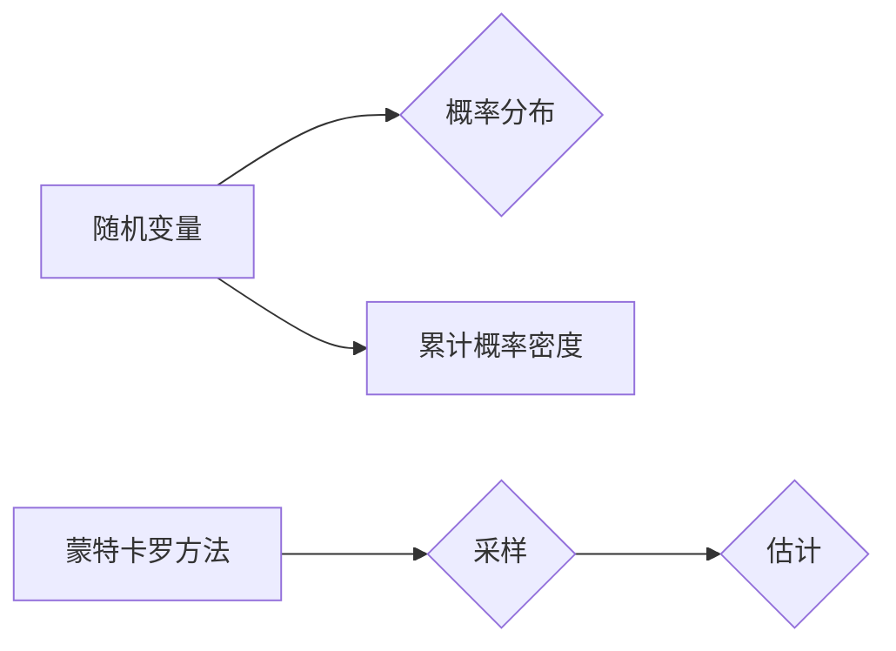

# 蒙特卡罗方法 (Monte Carlo Methods) 原理与代码实例讲解

作者：禅与计算机程序设计艺术 / Zen and the Art of Computer Programming

## 1. 背景介绍

### 1.1 问题的由来

蒙特卡罗方法（Monte Carlo Methods），也称为统计模拟方法，是一种基于随机抽样的数值计算方法。它起源于20世纪中叶，最初应用于物理学、工程学等领域，用于解决一些难以直接计算的问题。随着计算机科学的快速发展，蒙特卡罗方法逐渐扩展到金融、运筹学、计算机图形学、生物信息学等多个领域，成为求解复杂问题的有力工具。

### 1.2 研究现状

近年来，蒙特卡罗方法在学术界和工业界得到了广泛应用。随着高性能计算和并行计算技术的发展，蒙特卡罗方法在处理大规模复杂问题时展现出强大的优势。同时，蒙特卡罗方法的原理和算法也得到了不断改进和完善，如蒙特卡罗加速技术、重要性抽样、分层抽样等。

### 1.3 研究意义

蒙特卡罗方法具有以下研究意义：

1. 解决复杂问题：蒙特卡罗方法能够处理一些难以直接计算的问题，如多维积分、随机过程、优化问题等。
2. 降低计算成本：蒙特卡罗方法可以降低计算成本，特别是在大规模复杂问题中，通过随机抽样可以显著减少计算量。
3. 提高计算精度：蒙特卡罗方法在处理复杂问题时，可以获得较高的计算精度，特别是在概率分布、随机现象等方面。
4. 促进学科交叉：蒙特卡罗方法在多个学科领域得到应用，促进了学科交叉和融合。

### 1.4 本文结构

本文将分为以下几个部分：

1. 核心概念与联系
2. 核心算法原理与具体操作步骤
3. 数学模型和公式
4. 项目实践：代码实例
5. 实际应用场景
6. 工具和资源推荐
7. 总结：未来发展趋势与挑战
8. 附录：常见问题与解答

## 2. 核心概念与联系

蒙特卡罗方法的核心概念包括：

- 随机变量：在蒙特卡罗方法中，随机变量是表示随机现象的基本工具。
- 概率分布：描述随机变量取值概率的函数。
- 采样：从概率分布中抽取样本的过程。
- 估计：根据抽样结果对未知参数进行估计。
- 累计概率密度：描述随机变量取值概率的函数。

以下是蒙特卡罗方法与其他相关概念的联系：



## 3. 核心算法原理与具体操作步骤

### 3.1 算法原理概述

蒙特卡罗方法的基本原理是利用随机抽样的方法，通过大量重复实验来估计问题的解。具体步骤如下：

1. 确定问题的数学模型和随机变量。
2. 选择合适的概率分布和采样方法。
3. 通过随机抽样得到样本值。
4. 根据样本值估计问题的解。

### 3.2 算法步骤详解

1. **确定问题的数学模型和随机变量**：首先需要明确待求解问题的数学模型，并确定相关的随机变量。例如，对于多维积分问题，需要确定被积函数、积分区间和随机变量。
2. **选择合适的概率分布和采样方法**：根据问题的特点和随机变量的分布，选择合适的概率分布和采样方法。常见的概率分布包括均匀分布、正态分布、指数分布等。
3. **通过随机抽样得到样本值**：根据选定的概率分布和采样方法，从概率分布中抽取样本值。对于多维积分问题，需要使用多维随机抽样方法，如蒙特卡洛抽样、Metropolis-Hastings采样等。
4. **根据样本值估计问题的解**：根据样本值估计问题的解。对于积分问题，可以使用蒙特卡罗积分公式进行估计；对于随机过程问题，可以使用蒙特卡罗模拟进行估计。

### 3.3 算法优缺点

**优点**：

- 适用于解决复杂问题。
- 计算精度高。
- 能够处理大规模复杂问题。

**缺点**：

- 计算量大。
- 对于某些问题，收敛速度慢。

### 3.4 算法应用领域

蒙特卡罗方法在以下领域得到广泛应用：

- 物理学：模拟粒子运动、计算物理场等。
- 工程学：结构可靠性分析、优化设计等。
- 金融学：风险评估、期权定价等。
- 运筹学：排队理论、库存管理等。

## 4. 数学模型和公式

### 4.1 数学模型构建

以下是一个蒙特卡罗积分的例子：

$$
\int_a^b f(x) \, dx
$$

其中，$f(x)$ 是被积函数，$a$ 和 $b$ 是积分区间。

### 4.2 公式推导过程

蒙特卡罗积分公式如下：

$$
\int_a^b f(x) \, dx \approx \frac{N}{N}\sum_{i=1}^N f(x_i)
$$

其中，$N$ 是抽样次数，$x_i$ 是第 $i$ 个抽样点。

### 4.3 案例分析与讲解

以下是一个蒙特卡罗积分的例子：

```python
import random

def f(x):
    return x**2

a, b = 0, 1
N = 10000
sum = 0

for _ in range(N):
    x = random.uniform(a, b)
    sum += f(x)

integral = sum / N
print("Monte Carlo integral:", integral)
```

### 4.4 常见问题解答

**Q1：蒙特卡罗方法是否适用于所有问题？**

A：蒙特卡罗方法适用于解决复杂问题，特别是那些难以直接计算的问题。对于一些简单问题，使用蒙特卡罗方法可能不如直接计算效率高。

**Q2：蒙特卡罗方法的计算精度如何？**

A：蒙特卡罗方法的计算精度取决于抽样次数。随着抽样次数的增加，计算精度也会提高。

## 5. 项目实践：代码实例

### 5.1 开发环境搭建

以下是使用Python进行蒙特卡罗方法开发的开发环境配置流程：

1. 安装Anaconda：从官网下载并安装Anaconda，用于创建独立的Python环境。
2. 创建并激活虚拟环境：
```bash
conda create -n monte-carlo-env python=3.8
conda activate monte-carlo-env
```
3. 安装NumPy和Matplotlib：
```bash
conda install numpy matplotlib
```
4. 安装随机数生成库：
```bash
pip install numpy
```

### 5.2 源代码详细实现

以下是一个使用Python进行蒙特卡罗积分的代码实例：

```python
import random
import matplotlib.pyplot as plt

def f(x):
    return x**2

a, b = 0, 1
N = 10000
sum = 0

for _ in range(N):
    x = random.uniform(a, b)
    sum += f(x)

integral = sum / N

print("Monte Carlo integral:", integral)

x_values = [i * (b - a) / N for i in range(N + 1)]
y_values = [f(x) for x in x_values]

plt.plot(x_values, y_values)
plt.scatter([a + (b - a) / N * i for i in range(N)], [f(x) for x in x_values], color='red')
plt.title("Monte Carlo integration")
plt.xlabel("x")
plt.ylabel("f(x)")
plt.show()
```

### 5.3 代码解读与分析

- `f(x)` 定义了被积函数。
- `a` 和 `b` 定义了积分区间。
- `N` 定义了抽样次数。
- `sum` 用于累加抽样结果。
- `integral` 用于计算蒙特卡罗积分的估计值。
- 使用 `matplotlib.pyplot` 绘制被积函数和抽样结果。

### 5.4 运行结果展示

运行代码后，将输出蒙特卡罗积分的估计值，并绘制被积函数和抽样结果。

## 6. 实际应用场景

### 6.1 金融风险评估

蒙特卡罗方法可以用于金融风险评估，如信用风险、市场风险等。通过模拟金融市场波动，可以评估不同风险事件发生的概率和潜在损失。

### 6.2 结构可靠性分析

蒙特卡罗方法可以用于结构可靠性分析，如桥梁、建筑等。通过模拟结构在复杂载荷作用下的响应，可以评估结构的可靠性和寿命。

### 6.3 机器学习

蒙特卡罗方法可以用于机器学习，如生成对抗网络（GANs）。通过模拟生成器生成的新样本，可以评估生成器的性能和收敛速度。

### 6.4 未来应用展望

随着蒙特卡罗方法的发展和计算能力的提升，它将在更多领域得到应用，如人工智能、生物信息学、物理学等。以下是一些未来应用展望：

1. 蒙特卡罗方法与深度学习的结合，如深度学习模型训练过程的加速、生成对抗网络（GANs）的改进等。
2. 蒙特卡罗方法与其他优化算法的结合，如遗传算法、粒子群算法等，提高优化效率。
3. 蒙特卡罗方法与其他机器学习算法的结合，如强化学习、迁移学习等，拓展应用范围。

## 7. 工具和资源推荐

### 7.1 学习资源推荐

1. 《Monte Carlo Methods》
2. 《Simulation and the Monte Carlo Method》
3. 《Monte Carlo Methods for Computer Graphics》

### 7.2 开发工具推荐

1. NumPy：用于数值计算的Python库。
2. SciPy：基于NumPy的科学计算库。
3. Matplotlib：用于数据可视化的Python库。

### 7.3 相关论文推荐

1. "Monte Carlo Methods" by W. F.chine
2. "Simulation and the Monte Carlo Method" by R. Y. Rubinstein
3. "Monte Carlo Methods for Computer Graphics" by W. K. Pratt

### 7.4 其他资源推荐

1. Wikipedia：蒙特卡罗方法相关词条。
2. Coursera：蒙特卡罗方法在线课程。
3. GitHub：蒙特卡罗方法相关开源项目。

## 8. 总结：未来发展趋势与挑战

### 8.1 研究成果总结

本文介绍了蒙特卡罗方法的原理、算法和应用，并通过Python代码实例展示了蒙特卡罗方法的实现过程。蒙特卡罗方法作为一种基于随机抽样的数值计算方法，在解决复杂问题时具有独特的优势，广泛应用于各个领域。

### 8.2 未来发展趋势

1. 蒙特卡罗方法与深度学习的结合，如深度学习模型训练过程的加速、生成对抗网络（GANs）的改进等。
2. 蒙特卡罗方法与其他优化算法的结合，如遗传算法、粒子群算法等，提高优化效率。
3. 蒙特卡罗方法与其他机器学习算法的结合，如强化学习、迁移学习等，拓展应用范围。

### 8.3 面临的挑战

1. 随机数生成：如何生成高质量的随机数是蒙特卡罗方法的一个挑战。
2. 采样效率：提高采样效率，减少计算量，是蒙特卡罗方法的一个重要研究方向。
3. 可靠性：如何保证蒙特卡罗方法的可靠性，是实际应用中需要关注的问题。

### 8.4 研究展望

蒙特卡罗方法作为一种基于随机抽样的数值计算方法，在解决复杂问题时具有独特的优势。随着计算能力的提升和算法的改进，蒙特卡罗方法将在更多领域得到应用，为科学研究和实际应用提供有力支持。

## 9. 附录：常见问题与解答

**Q1：什么是蒙特卡罗方法？**

A：蒙特卡罗方法是一种基于随机抽样的数值计算方法，通过模拟随机事件来估计问题的解。

**Q2：蒙特卡罗方法适用于哪些问题？**

A：蒙特卡罗方法适用于解决复杂问题，特别是那些难以直接计算的问题。

**Q3：如何提高蒙特卡罗方法的计算精度？**

A：提高蒙特卡罗方法的计算精度可以通过以下方法：
1. 增加抽样次数。
2. 优化随机抽样方法。
3. 使用自适应蒙特卡罗方法。

**Q4：蒙特卡罗方法与数值积分有什么关系？**

A：蒙特卡罗方法是数值积分的一种方法，通过随机抽样来估计积分的值。

**Q5：蒙特卡罗方法与蒙特卡洛模拟有什么区别？**

A：蒙特卡罗方法是蒙特卡洛模拟的一种，蒙特卡洛模拟是一个更广泛的概念，包括蒙特卡罗方法在内的多种方法。

作者：禅与计算机程序设计艺术 / Zen and the Art of Computer Programming