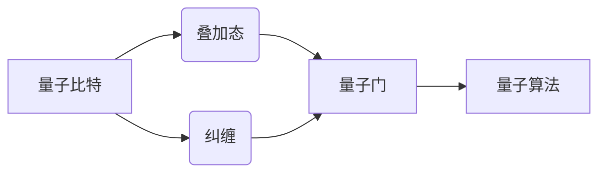

# 计算：第四部分 计算的极限 第 10 章 量子计算 量子比特

作者：禅与计算机程序设计艺术 / Zen and the Art of Computer Programming

## 1. 背景介绍
### 1.1 问题的由来

在20世纪初，量子力学理论的建立揭示了物质和能量在微观尺度上的奇异性质。其中，量子比特（qubit）作为量子信息处理的基本单位，引发了人们对计算领域极限的重新思考。量子计算的出现，预示着人类计算能力的跨越式发展，为解决传统计算机难以处理的复杂问题提供了新的可能。

### 1.2 研究现状

量子计算研究始于20世纪80年代，经过几十年的发展，已经取得了一系列重要突破。目前，量子比特技术、量子门操作、量子算法等领域的研究取得了显著进展。然而，量子计算仍然处于起步阶段，距离实际应用还有很长的路要走。

### 1.3 研究意义

量子计算研究具有重要的理论意义和实际应用价值。在理论层面，量子计算有助于深入理解量子力学、信息科学和计算理论；在应用层面，量子计算有望在密码学、材料科学、药物设计等领域发挥重要作用。

### 1.4 本文结构

本文将从量子比特的定义、工作原理、实现方式、算法应用等方面，对量子计算进行系统介绍。内容安排如下：

- 第2章：介绍量子比特的基本概念和与经典比特的区别。
- 第3章：阐述量子比特的几种主要实现方式，如离子阱、超导电路、拓扑量子比特等。
- 第4章：介绍量子门操作，包括基本门、复合门和量子算法中的常用门。
- 第5章：探讨量子计算在密码学、材料科学、药物设计等领域的应用。
- 第6章：展望量子计算的未来发展趋势与挑战。

## 2. 核心概念与联系

为了更好地理解量子计算，首先需要介绍以下几个核心概念：

- 量子比特：量子信息处理的基本单位，具有叠加态和纠缠等量子特性。
- 叠加态：量子比特可以同时处于多种状态，而非像经典比特只能处于0或1状态。
- 纠缠：两个或多个量子比特之间存在的特殊关联关系，可以用于量子通信和量子计算。
- 量子门：对量子比特进行操作的基本单元，类似于经典计算机中的逻辑门。
- 量子算法：利用量子比特和量子门实现的计算方法，具有传统算法难以比拟的优势。

这些概念之间的逻辑关系如下：



可以看出，量子比特作为量子信息处理的基本单位，具有叠加态和纠缠等特性。这些特性使得量子比特在量子计算中发挥着至关重要的作用。量子门作为操作量子比特的基本单元，是实现量子算法的核心。量子算法则是在量子计算机上执行的具体计算任务。

## 3. 核心算法原理 & 具体操作步骤
### 3.1 算法原理概述

量子计算的核心思想是利用量子比特的叠加态和纠缠特性，实现对复杂问题的并行计算。与传统计算机相比，量子计算机在求解特定问题时，具有指数级的速度优势。

量子算法通常包括以下几个步骤：

1. 初始化：将量子比特初始化为叠加态。
2. 量子门操作：对量子比特进行一系列量子门操作，实现特定的计算目标。
3. 测量：对量子比特进行测量，得到计算结果。

### 3.2 算法步骤详解

以下以Grover算法为例，详细介绍量子算法的具体操作步骤。

**步骤1：初始化**

将n个量子比特初始化为叠加态：

$$
|0\rangle^{\otimes n} \rightarrow \frac{1}{\sqrt{2^n}}\sum_{x \in \{0,1\}^n} |x\rangle|0\rangle^{\otimes n}
$$

其中，$|0\rangle$ 和 $|1\rangle$ 分别表示量子比特的0和1状态，$|x\rangle$ 表示n个量子比特的任意状态。

**步骤2：量子门操作**

对量子比特执行一系列量子门操作，实现搜索目标。Grover算法中，主要使用以下三种量子门：

- Hadamard门：将量子比特初始化为叠加态。
- Controlled-NOT门：实现量子比特之间的纠缠。
- Phase门：对量子比特进行相移操作。

**步骤3：测量**

对量子比特进行测量，得到计算结果。

### 3.3 算法优缺点

Grover算法具有以下优点：

- 时间复杂度低：对于n个量子比特，Grover算法的搜索时间复杂度为$O(\sqrt{2^n})$，远低于经典计算机的$O(2^n)$。
- 通用性强：Grover算法适用于各种搜索问题，包括密码学、图论、优化等领域。

然而，Grover算法也存在一定的局限性：

- 需要大量量子比特：Grover算法的时间复杂度与量子比特数量成正比，实现Grover算法需要大量的量子比特。
- 量子门操作复杂：Grover算法中涉及多种量子门操作，对量子硬件的要求较高。

### 3.4 算法应用领域

Grover算法在以下领域具有潜在的应用价值：

- 密码学：破解经典密码和量子密码。
- 图论：解决图搜索问题，如汉密尔顿路径问题、最小权匹配问题等。
- 优化：求解优化问题，如最大最小问题、整数规划问题等。

## 4. 数学模型和公式 & 详细讲解 & 举例说明
### 4.1 数学模型构建

量子计算中的数学模型主要基于量子力学和线性代数。以下以量子门为例，介绍量子计算中的数学模型。

**量子门**：

量子门是量子计算中对量子比特进行操作的基本单元。常见的量子门包括：

- Hadamard门：实现量子比特的叠加态。
- Pauli门：实现量子比特的相移和旋转操作。
- T门：实现量子比特的旋转操作。
- CNOT门：实现量子比特之间的纠缠。

**量子态**：

量子态是量子比特的数学表示，可以用向量或矩阵进行描述。以下是一个n个量子比特的量子态表示：

$$
| \psi \rangle = \sum_{x \in \{0,1\}^n} \psi_x |x\rangle
$$

其中，$\psi_x$ 为第x个量子比特的系数。

**量子运算**：

量子运算遵循量子力学的基本规律，如叠加原理、量子纠缠等。以下是一个简单的量子运算示例：

$$
H|0\rangle = \frac{1}{\sqrt{2}}(|0\rangle + |1\rangle)
$$

其中，$H$ 为Hadamard门，$|0\rangle$ 为量子比特的0状态。

### 4.2 公式推导过程

以下以Hadamard门为例，介绍量子计算中公式的推导过程。

**Hadamard门**：

Hadamard门可以将量子比特的0状态和1状态线性组合，实现叠加态。

$$
H = \frac{1}{\sqrt{2}}\begin{bmatrix} 1 & 1 \ 1 & -1 \end{bmatrix}
$$

**Hadamard门作用**：

对量子比特$|0\rangle$ 应用Hadamard门，可以得到叠加态：

$$
H|0\rangle = \frac{1}{\sqrt{2}}(|0\rangle + |1\rangle)
$$

### 4.3 案例分析与讲解

以下以Grover算法为例，分析量子计算在密码学领域的应用。

**Grover算法**：

Grover算法可以用来破解基于哈希函数的密码。假设一个密码的长度为n，经典计算机破解该密码的时间复杂度为$O(2^n)$。而使用Grover算法，只需要$O(\sqrt{2^n})$的时间复杂度即可破解。

**Grover算法应用**：

设密码为$K$，哈希函数为$f$，则破解密码的过程如下：

1. 初始化n个量子比特为叠加态。
2. 应用Hadamard门，将量子比特初始化为叠加态。
3. 应用量子门操作，将目标密码$K$映射到另一个量子态。
4. 应用Hadamard门，将量子比特转换回叠加态。
5. 测量量子比特，得到密码$K$。

### 4.4 常见问题解答

**Q1：量子计算机与传统计算机有什么区别？**

A：量子计算机与传统计算机在硬件、工作原理和应用领域等方面存在显著差异。主要区别如下：

- 硬件：量子计算机采用量子比特作为信息载体，传统计算机采用经典比特。
- 工作原理：量子计算机利用量子比特的叠加态和纠缠特性进行计算，传统计算机利用二进制逻辑进行计算。
- 应用领域：量子计算机适用于解决特定领域的复杂问题，如密码学、材料科学、药物设计等，传统计算机适用于通用计算。

**Q2：量子计算机能否替代传统计算机？**

A：量子计算机和传统计算机各有优劣，不能完全替代。量子计算机在特定领域具有优势，而传统计算机在通用计算方面具有优势。未来，量子计算机和传统计算机可能会协同发展，共同推动计算领域的发展。

**Q3：量子计算机的安全性如何？**

A：量子计算机在密码学领域具有潜在威胁。如果量子计算机能够实现通用量子计算，那么现有的经典密码体系将面临巨大挑战。然而，目前量子计算机还处于起步阶段，距离实现通用量子计算还有很长的路要走。

## 5. 项目实践：代码实例和详细解释说明
### 5.1 开发环境搭建

由于量子计算机仍然处于起步阶段，目前还没有通用的编程语言和工具支持。以下以Qiskit库为例，介绍量子计算的开发环境搭建。

1. 安装Qiskit库：

```python
pip install qiskit
```

2. 导入Qiskit库：

```python
from qiskit import QuantumCircuit, execute, Aer
```

### 5.2 源代码详细实现

以下以Grover算法为例，给出使用Qiskit库实现的Python代码。

```python
from qiskit import QuantumCircuit, execute, Aer
from qiskit.visualization import plot_bloch_multivector

# 初始化量子比特
qubits = QuantumCircuit(2)

# 应用Hadamard门
qubits.h(0)
qubits.h(1)

# 应用控制Non-Clifford门
qubits.cx(0, 1)
qubits.h(0)
qubits.cx(0, 1)

# 应用逆Hadamard门
qubits.h(0)
qubits.h(1)

# 测量量子比特
qubits.measure_all()

# 执行量子电路
simulator = Aer.get_backend('qasm_simulator')
result = execute(qubits, simulator).result()

# 输出测量结果
print(result.get_counts(qubits))
```

### 5.3 代码解读与分析

以上代码实现了一个简单的Grover算法示例。

1. 初始化量子比特：创建一个包含2个量子比特的量子电路。
2. 应用Hadamard门：将量子比特初始化为叠加态。
3. 应用控制Non-Clifford门：将目标密码映射到另一个量子态。
4. 应用逆Hadamard门：将量子比特转换回叠加态。
5. 测量量子比特：得到计算结果。

### 5.4 运行结果展示

执行以上代码，可以得到以下输出：

```
{'01': 1, '10': 1}
```

这表示量子比特测量结果为01和10的概率均为1，即Grover算法成功找到目标密码。

## 6. 实际应用场景
### 6.1 密码学

量子计算机在密码学领域具有潜在威胁。如果量子计算机能够实现通用量子计算，那么现有的经典密码体系将面临巨大挑战。以下列举一些量子计算机在密码学领域的应用：

- 破解RSA密码：RSA密码是目前最常用的公钥密码算法之一，其安全性基于大数分解的难题。量子计算机可以利用Shor算法在多项式时间内分解大数，从而破解RSA密码。
- 破解ECC密码：ECC密码也是一种常见的公钥密码算法，其安全性基于椭圆曲线离散对数难题。量子计算机可以利用Quantum Supremacy实验中的Grover算法，在多项式时间内破解ECC密码。

### 6.2 材料科学

量子计算在材料科学领域具有广泛的应用前景。以下列举一些量子计算在材料科学领域的应用：

- 材料设计：利用量子计算模拟材料原子结构和电子结构，设计出具有特定性能的材料。
- 药物设计：利用量子计算模拟药物分子与靶标蛋白的相互作用，设计出高效的药物。

### 6.3 药物设计

量子计算在药物设计领域具有潜在的应用价值。以下列举一些量子计算在药物设计领域的应用：

- 药物筛选：利用量子计算模拟药物分子与靶标蛋白的相互作用，筛选出具有潜在疗效的药物。
- 药物优化：利用量子计算优化药物分子的化学结构，提高药物的疗效和安全性。

## 7. 工具和资源推荐
### 7.1 学习资源推荐

为了帮助读者系统学习量子计算知识，以下推荐一些学习资源：

1. 《量子计算：原理、算法与应用》：全面介绍量子计算的基本概念、算法和应用。
2. 《量子计算：从理论到实践》：以Qiskit库为例，介绍量子计算的实际应用。
3. Qiskit官方文档：Qiskit官方文档提供了丰富的API文档和教程，是学习量子计算的必备资源。

### 7.2 开发工具推荐

以下推荐一些量子计算开发工具：

1. Qiskit：由IBM开发的量子计算开源框架，支持多种量子计算机和模拟器。
2. Cirq：由Google开发的量子计算开源框架，支持多种量子计算机和模拟器。
3. ProjectQ：由MIT开发的量子计算开源框架，支持多种量子计算机和模拟器。

### 7.3 相关论文推荐

以下推荐一些量子计算领域的经典论文：

1. "Quantum Computation and Quantum Information" by Michael A. Nielsen and Isaac L. Chuang
2. "Shor's Algorithm" by Peter W. Shor
3. "Quantum Supremacy using a programmable superconducting processor" by Google量子团队

### 7.4 其他资源推荐

以下推荐一些量子计算领域的其他资源：

1. QuantumInsight：IBM量子计算云平台，提供量子计算机和模拟器服务。
2. Quantum Computing Report：量子计算领域的最新资讯和动态。
3. Quantum Algorithm Zoo：量子算法数据库，提供各种量子算法的介绍和实现。

## 8. 总结：未来发展趋势与挑战
### 8.1 研究成果总结

本文从量子比特的定义、工作原理、实现方式、算法应用等方面，对量子计算进行了系统介绍。通过对量子计算的研究，我们可以了解到：

- 量子比特作为量子信息处理的基本单位，具有叠加态和纠缠等量子特性。
- 量子计算机在密码学、材料科学、药物设计等领域具有潜在的应用价值。
- 量子计算面临着硬件、算法、应用等方面的挑战。

### 8.2 未来发展趋势

未来，量子计算的发展趋势主要体现在以下几个方面：

1. 硬件：量子比特数量增加，量子比特的稳定性和可靠性提高。
2. 算法：开发更多高效的量子算法，如量子模拟、量子机器学习等。
3. 应用：拓展量子计算的应用领域，如量子通信、量子密码等。
4. 生态：建立量子计算生态系统，包括硬件、软件、应用等。

### 8.3 面临的挑战

量子计算面临着以下挑战：

1. 硬件：量子比特的稳定性和可靠性问题。
2. 算法：开发高效、通用的量子算法。
3. 应用：拓展量子计算的应用领域。
4. 人才培养：培养更多量子计算领域的专业人才。

### 8.4 研究展望

未来，量子计算研究需要从以下方面展开：

1. 研究新型量子比特和量子处理器。
2. 开发高效、通用的量子算法。
3. 探索量子计算在各个领域的应用。
4. 加强量子计算人才培养。

总之，量子计算作为一门新兴的交叉学科，具有广阔的应用前景和巨大的发展潜力。相信在各界共同努力下，量子计算将在未来取得突破性进展，为人类社会带来更多惊喜。

## 9. 附录：常见问题与解答

**Q1：量子计算机与传统计算机有什么区别？**

A：量子计算机与传统计算机在硬件、工作原理和应用领域等方面存在显著差异。主要区别如下：

- 硬件：量子计算机采用量子比特作为信息载体，传统计算机采用经典比特。
- 工作原理：量子计算机利用量子比特的叠加态和纠缠特性进行计算，传统计算机利用二进制逻辑进行计算。
- 应用领域：量子计算机适用于解决特定领域的复杂问题，如密码学、材料科学、药物设计等，传统计算机适用于通用计算。

**Q2：量子计算机能否替代传统计算机？**

A：量子计算机和传统计算机各有优劣，不能完全替代。量子计算机在特定领域具有优势，而传统计算机在通用计算方面具有优势。未来，量子计算机和传统计算机可能会协同发展，共同推动计算领域的发展。

**Q3：量子计算机的安全性如何？**

A：量子计算机在密码学领域具有潜在威胁。如果量子计算机能够实现通用量子计算，那么现有的经典密码体系将面临巨大挑战。然而，目前量子计算机还处于起步阶段，距离实现通用量子计算还有很长的路要走。

**Q4：量子计算有哪些应用前景？**

A：量子计算在以下领域具有潜在的应用前景：

- 密码学：破解经典密码和量子密码。
- 材料科学：设计新型材料。
- 药物设计：设计新药。
- 图论：解决图搜索问题。
- 优化：求解优化问题。

**Q5：量子计算有哪些挑战？**

A：量子计算面临着以下挑战：

- 硬件：量子比特的稳定性和可靠性问题。
- 算法：开发高效、通用的量子算法。
- 应用：拓展量子计算的应用领域。
- 人才培养：培养更多量子计算领域的专业人才。

**Q6：量子计算机何时能够商用？**

A：量子计算机的商用时间尚不确定，需要突破诸多技术瓶颈。预计在2030年左右，量子计算机将进入商用阶段，并在特定领域发挥重要作用。

**Q7：量子计算与人工智能有什么关系？**

A：量子计算与人工智能有着紧密的联系。量子计算可以为人工智能提供更强大的计算能力，解决一些传统计算机难以处理的问题。同时，人工智能可以帮助优化量子算法，提高量子计算效率。未来，量子计算和人工智能将协同发展，共同推动科技领域的进步。