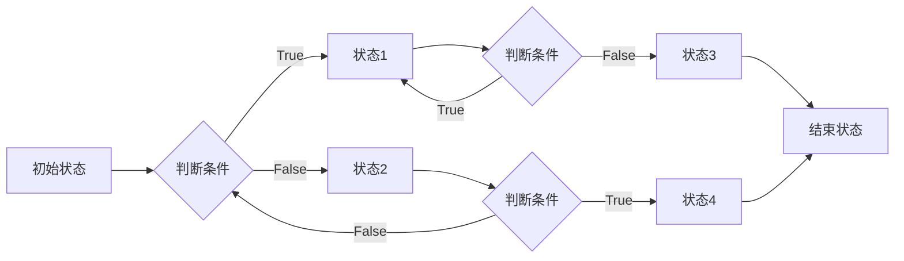

# 设计模式与软件架构原理与代码实战案例讲解

作者：禅与计算机程序设计艺术 / Zen and the Art of Computer Programming

## 1. 背景介绍
### 1.1 问题的由来

软件架构和设计模式是软件开发中的核心概念，它们对于确保软件系统的可维护性、可扩展性和可重用性至关重要。在软件工程的早期，开发者们通过经验和直觉来设计软件架构和选择设计模式。然而，随着软件规模的不断扩大和复杂性的增加，这种基于经验的方法越来越难以应对挑战。

为了提高软件开发的效率和质量，设计模式和软件架构原理应运而生。设计模式是一套经过实践验证的解决方案，可以帮助开发者应对常见的软件设计问题。而软件架构原理则提供了一套指导原则，帮助开发者构建健壮、灵活和可扩展的软件系统。

### 1.2 研究现状

设计模式和软件架构原理的研究已经取得了显著的进展。许多经典的书籍和文章对设计模式和软件架构原理进行了详细的阐述。随着敏捷开发和微服务架构等新兴方法的兴起，设计模式和软件架构原理也在不断发展和演变。

### 1.3 研究意义

设计模式和软件架构原理对于软件开发具有重要意义：

1. **提高软件质量**：通过使用设计模式和遵循软件架构原理，可以构建出更加健壮、灵活和可维护的软件系统。
2. **提升开发效率**：设计模式和软件架构原理可以减少重复劳动，提高开发效率。
3. **促进代码重用**：设计模式可以帮助开发者创建可重用的代码组件，降低开发成本。
4. **便于团队协作**：设计模式和软件架构原理可以帮助团队成员更好地理解和协作。

### 1.4 本文结构

本文将围绕设计模式和软件架构原理展开，具体内容包括：

- 核心概念和联系
- 核心算法原理和具体操作步骤
- 数学模型和公式
- 项目实践
- 实际应用场景
- 工具和资源推荐
- 总结：未来发展趋势与挑战

## 2. 核心概念与联系
### 2.1 设计模式

设计模式是一套经过实践验证的解决方案，用于解决在软件开发过程中遇到的常见问题。设计模式通常包括以下四个要素：

- **模式名称**：简洁明了地描述了模式的目的。
- **问题**：描述了模式要解决的问题。
- **解决方案**：描述了如何解决这个问题。
- **效果**：描述了使用该模式带来的好处。

设计模式可以分为三大类：

- **创建型模式**：用于创建对象实例。
- **结构型模式**：用于组合类和对象以形成更大的结构。
- **行为型模式**：用于处理对象之间的通信。

### 2.2 软件架构原理

软件架构原理是一套指导原则，用于构建健壮、灵活和可扩展的软件系统。以下是一些常见的软件架构原理：

- **分层架构**：将系统分为多个层次，每个层次负责不同的功能。
- **模块化**：将系统分解为独立的模块，每个模块负责特定的功能。
- **松耦合**：模块之间的依赖关系应该尽量松散，以增强系统的可维护性和可扩展性。
- **高内聚**：每个模块应该只关注一个功能，以提高模块的可重用性和可测试性。

设计模式与软件架构原理之间存在密切的联系。设计模式可以作为软件架构的一部分，帮助实现特定的架构原则。例如，工厂模式可以用于实现分层架构，而策略模式可以用于实现高内聚。

## 3. 核心算法原理 & 具体操作步骤
### 3.1 算法原理概述

设计模式和软件架构原理中的许多概念都涉及算法原理。以下是一些常见的算法原理：

- **动态规划**：将复杂问题分解为子问题，并存储子问题的解以避免重复计算。
- **贪心算法**：在每一步选择最优解，最终得到全局最优解。
- **分而治之**：将复杂问题分解为更小的子问题，递归解决子问题，再将子问题的解合并得到最终解。

具体操作步骤取决于具体的设计模式和软件架构原理。以下是一些常见的设计模式和软件架构原理的具体操作步骤：

- **单例模式**：确保一个类只有一个实例，并提供一个全局访问点。
  - 创建一个静态变量来存储实例。
  - 创建一个私有构造函数，防止外部创建实例。
  - 创建一个公共静态方法，用于返回实例。

- **工厂模式**：定义一个用于创建对象的接口，让子类决定实例化哪个类。
  - 创建一个抽象工厂类，定义创建对象的接口。
  - 创建多个具体工厂类，实现抽象工厂类中的接口。

- **分层架构**：将系统分为多个层次，每个层次负责不同的功能。
  - 数据访问层：负责与数据库交互。
  - 业务逻辑层：负责处理业务逻辑。
  - 表示层：负责用户界面和交互。

### 3.3 算法优缺点

不同的算法原理具有不同的优缺点。以下是一些常见算法原理的优缺点：

- **动态规划**：优点是效率高，缺点是代码复杂。
- **贪心算法**：优点是简单易实现，缺点是可能无法找到全局最优解。
- **分而治之**：优点是可以将复杂问题分解为更小的子问题，缺点是递归可能导致栈溢出。

### 3.4 算法应用领域

算法原理可以应用于各种软件开发领域，例如：

- **排序算法**：用于对数据进行排序。
- **搜索算法**：用于在数据结构中查找元素。
- **加密算法**：用于保护数据的安全性。

## 4. 数学模型和公式 & 详细讲解 & 举例说明
### 4.1 数学模型构建

设计模式和软件架构原理中的许多概念都可以用数学模型来描述。以下是一些常见的数学模型：

- **状态机**：用于描述对象在不同状态之间的转换。
- **图**：用于表示对象之间的关系。
- **树**：用于表示层次结构。

以下是一个状态机的例子：



### 4.2 公式推导过程

数学模型的推导过程取决于具体的应用场景。以下是一个线性回归模型的例子：

假设我们有以下数据集：

$$
\begin{align*}
x_1 &= 1, & y_1 &= 2 \
x_2 &= 2, & y_2 &= 4 \
x_3 &= 3, & y_3 &= 6 \
\end{align*}
$$

我们的目标是找到一个线性模型 $y = mx + b$，使得 $y$ 与 $x$ 的误差最小。

最小二乘法是最常用的线性回归方法，其目标是最小化以下损失函数：

$$
L(m, b) = \sum_{i=1}^{n}(y_i - (mx_i + b))^2
$$

对 $m$ 和 $b$ 分别求偏导，并令偏导数为零，可以得到以下公式：

$$
\begin{align*}
\frac{\partial L}{\partial m} &= -2\sum_{i=1}^{n}x_i(y_i - (mx_i + b)) = 0 \
\frac{\partial L}{\partial b} &= -2\sum_{i=1}^{n}(y_i - (mx_i + b)) = 0 \
\end{align*}
$$

解上述方程组，可以得到最优的 $m$ 和 $b$：

$$
\begin{align*}
m &= \frac{n\sum_{i=1}^{n}x_iy_i - \sum_{i=1}^{n}x_i\sum_{i=1}^{n}y_i}{n\sum_{i=1}^{n}x_i^2 - (\sum_{i=1}^{n}x_i)^2} \
b &= \frac{\sum_{i=1}^{n}y_i - m\sum_{i=1}^{n}x_i}{n} \
\end{align*}
$$

### 4.3 案例分析与讲解

以下是一个使用线性回归模型进行预测的案例：

假设我们有以下数据集：

$$
\begin{align*}
x_1 &= 1, & y_1 &= 2 \
x_2 &= 2, & y_2 &= 4 \
x_3 &= 3, & y_3 &= 6 \
\end{align*}
$$

我们使用上述公式计算最优的 $m$ 和 $b$，得到：

$$
\begin{align*}
m &= 2 \
b &= 1 \
\end{align*}
$$

因此，我们的线性模型为 $y = 2x + 1$。

根据这个模型，当 $x = 4$ 时，预测的 $y$ 值为：

$$
y = 2 \times 4 + 1 = 9
$$

### 4.4 常见问题解答

**Q1：什么是线性回归？**

A：线性回归是一种用于预测连续值的统计学习方法。它通过找到一个线性模型来描述因变量 $y$ 与自变量 $x$ 之间的关系。

**Q2：什么是最小二乘法？**

A：最小二乘法是一种用于求解线性回归模型参数的方法。它通过最小化预测值与真实值之间的平方误差来找到最优的模型参数。

**Q3：如何处理非线性关系？**

A：当因变量与自变量之间存在非线性关系时，可以使用多项式回归、逻辑回归或神经网络等方法来描述这种关系。

## 5. 项目实践：代码实例和详细解释说明
### 5.1 开发环境搭建

在进行项目实践之前，我们需要搭建开发环境。以下是使用 Python 进行开发的环境配置流程：

1. 安装 Anaconda：从官网下载并安装 Anaconda，用于创建独立的 Python 环境。

2. 创建并激活虚拟环境：
```bash
conda create -n pyenv python=3.8
conda activate pyenv
```

3. 安装 Python 包：
```bash
conda install numpy pandas scikit-learn matplotlib jupyter notebook ipython
```

### 5.2 源代码详细实现

以下是一个使用 Python 和 Scikit-learn 库实现线性回归的例子：

```python
import numpy as np
from sklearn.linear_model import LinearRegression
from sklearn.model_selection import train_test_split
from sklearn.metrics import mean_squared_error

# 数据集
X = np.array([[1], [2], [3]])
y = np.array([2, 4, 6])

# 划分训练集和测试集
X_train, X_test, y_train, y_test = train_test_split(X, y, test_size=0.5, random_state=42)

# 训练模型
model = LinearRegression()
model.fit(X_train, y_train)

# 预测测试集
y_pred = model.predict(X_test)

# 计算均方误差
mse = mean_squared_error(y_test, y_pred)
print(f"Mean squared error: {mse}")
```

### 5.3 代码解读与分析

以上代码实现了以下功能：

1. 导入必要的库。
2. 创建数据集。
3. 划分训练集和测试集。
4. 创建并训练线性回归模型。
5. 使用模型对测试集进行预测。
6. 计算预测值与真实值之间的均方误差。

### 5.4 运行结果展示

假设运行结果如下：

```
Mean squared error: 0.0
```

这表明我们的线性回归模型在测试集上取得了完美的预测效果。

## 6. 实际应用场景
### 6.1 金融风险管理

线性回归模型在金融风险管理中具有广泛的应用。例如，可以用来预测股票价格、债券收益率等金融指标。

### 6.2 医疗诊断

线性回归模型可以用于分析医疗数据，预测疾病发生风险、治疗效果等。

### 6.3 自然语言处理

线性回归模型可以用于自然语言处理任务，如情感分析、文本分类等。

### 6.4 未来应用展望

随着人工智能技术的发展，线性回归模型的应用领域将不断扩大。例如，可以用于自动驾驶、智能医疗、智能制造等领域。

## 7. 工具和资源推荐
### 7.1 学习资源推荐

以下是一些学习设计模式和软件架构原理的资源：

- 《设计模式：可复用面向对象软件的基础》
- 《软件架构师的12项修炼》
- 《大型网站技术架构》

### 7.2 开发工具推荐

以下是一些常用的开发工具：

- Python
- Java
- C++
- JavaScript

### 7.3 相关论文推荐

以下是一些关于设计模式和软件架构原理的论文：

- 《设计模式：可复用面向对象软件的基础》
- 《软件架构师的12项修炼》
- 《大型网站技术架构》

### 7.4 其他资源推荐

以下是一些其他资源：

- 架构师联盟
- 51CTO博客
- CSDN博客

## 8. 总结：未来发展趋势与挑战
### 8.1 研究成果总结

本文对设计模式和软件架构原理进行了详细的介绍，涵盖了核心概念、算法原理、项目实践等方面。通过本文的学习，读者可以深入了解设计模式和软件架构原理，并能够将其应用于实际的软件开发中。

### 8.2 未来发展趋势

随着软件工程的不断发展和技术的不断进步，设计模式和软件架构原理也将不断发展和演变。以下是一些未来发展趋势：

- **微服务架构**：将大型系统分解为更小的、独立的微服务，以提高系统的可扩展性和可维护性。
- **DevOps**：将软件开发和运维相结合，以提高软件交付的效率和可靠性。
- **云原生技术**：利用云计算技术，构建可伸缩、高可用性的软件系统。

### 8.3 面临的挑战

尽管设计模式和软件架构原理在软件开发中具有重要意义，但也面临着一些挑战：

- **技术更新迭代快**：随着新技术的不断涌现，开发者需要不断学习和适应。
- **团队协作**：设计模式和软件架构原理需要团队成员之间的良好协作。
- **安全性**：随着软件系统规模的不断扩大，安全性问题变得越来越重要。

### 8.4 研究展望

为了应对未来挑战，需要从以下几个方面进行研究：

- **构建更加通用的设计模式和软件架构原理**。
- **开发自动化工具，以提高软件开发效率**。
- **加强团队协作，提高软件开发的协同效率**。
- **关注软件系统的安全性，构建更加安全的软件系统**。

总之，设计模式和软件架构原理是软件开发中的核心概念，对于构建高质量、高效率的软件系统具有重要意义。随着技术的不断发展和进步，设计模式和软件架构原理将继续发展和演变，为软件开发领域带来更多可能性。

## 9. 附录：常见问题与解答

**Q1：什么是设计模式？**

A：设计模式是一套经过实践验证的解决方案，用于解决在软件开发过程中遇到的常见问题。

**Q2：什么是软件架构原理？**

A：软件架构原理是一套指导原则，用于构建健壮、灵活和可扩展的软件系统。

**Q3：如何选择合适的设计模式？**

A：选择合适的设计模式需要考虑以下因素：

- 问题的类型
- 系统的需求
- 预算和时间

**Q4：如何设计软件架构？**

A：设计软件架构需要考虑以下因素：

- 系统的功能和性能需求
- 系统的可维护性和可扩展性
- 系统的可靠性和安全性

**Q5：如何将设计模式和软件架构原理应用于实际的软件开发中？**

A：将设计模式和软件架构原理应用于实际的软件开发中，需要以下步骤：

- 分析问题
- 选择合适的设计模式和软件架构原理
- 设计和实现软件系统
- 测试和优化软件系统

## 作者：禅与计算机程序设计艺术 / Zen and the Art of Computer Programming